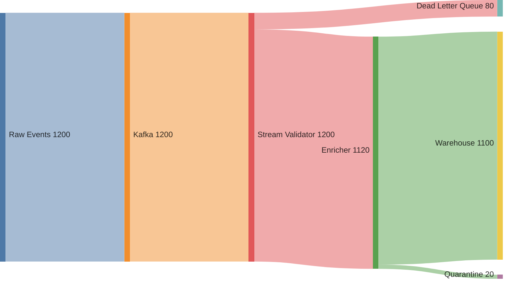
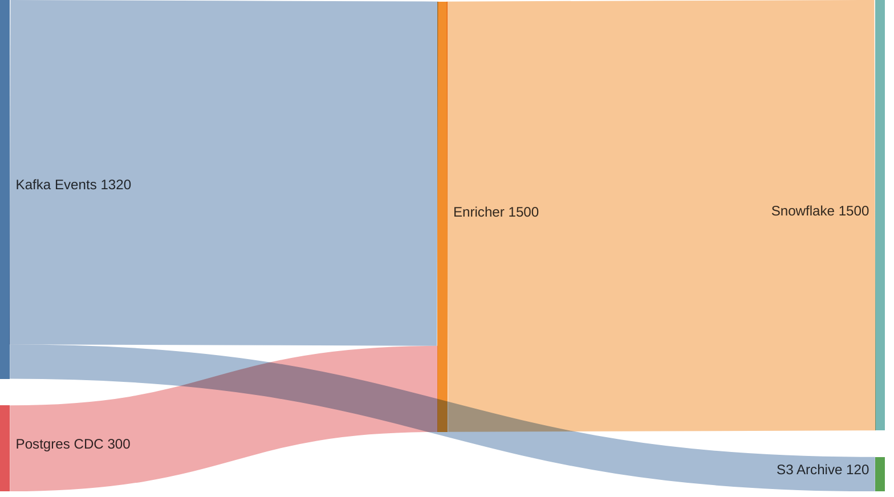
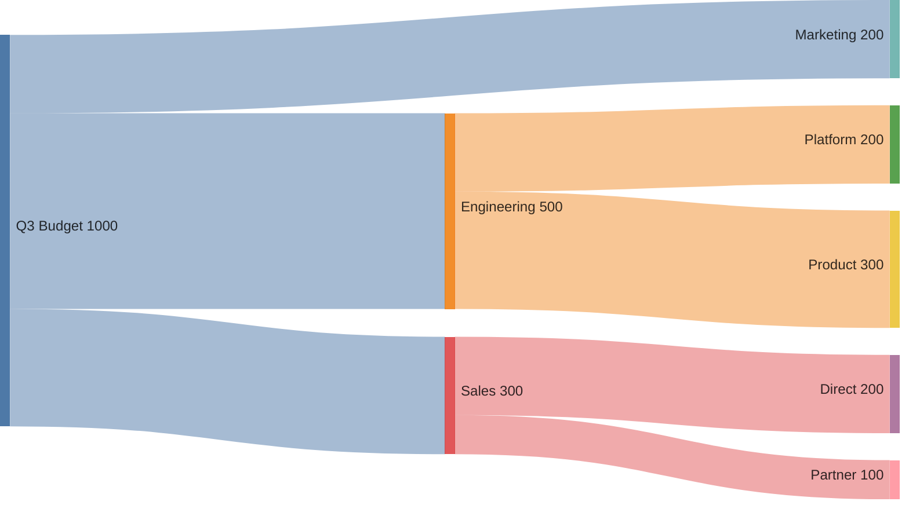
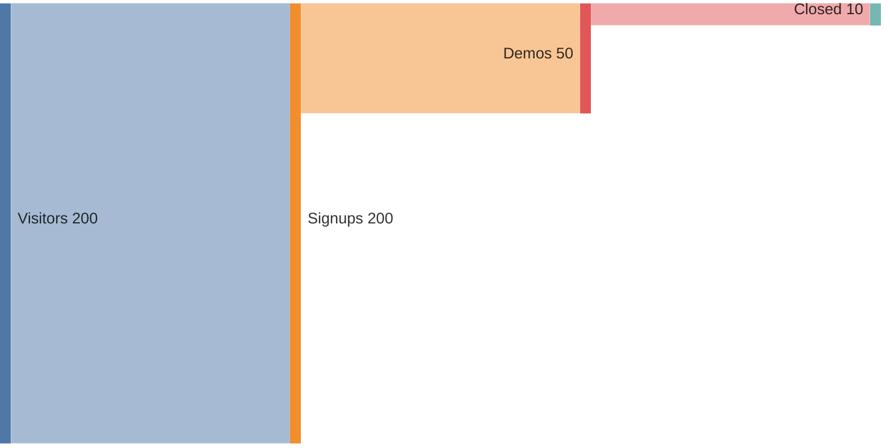

# Sankey Flow

Dynamic, example-anchored Sankey diagramming. Given a prompt, match it against a library of canonical Sankey examples, adapt the matched example's structure to the user's actual data, and render a Mermaid `sankey-beta` diagram. Missing data is marked as placeholder (value=1) — do not invent quantities, and do not interrogate the user. When the prompt references external sources (URLs, financial statements, codebases), delegate extraction to analytical skills rather than asking the user to transcribe data. Single pass — no multi-iteration PDCA loop; the adapt step self-corrects against the matched example's structure.

## Ontological Grounding

A Sankey is a weighted-flow diagram, not inherently a financial entity or a procedure. Keep the user's actual unit and flow vocabulary: widget counts, energy, currency, requests, and other flows all qualify. `onto_anchor` currently gives “Sankey diagram” only a coarse core anchor; do not invent a more specific identity. For a real procedure, `pko:Procedure` may describe the depicted process; for a financial line item, use FIBO only when that *term* resolves there. Neither ontology applies to every diagram or edge. Record sourced quantities using PROV-O provenance (`prov:wasDerivedFrom`); DC+BIBO describes the output document, not its conservation rule.

Domain vocabulary is conditional: resolve financial terms individually before using FIBO; use PKO only for a flow that actually describes a procedure; retain the user's stage names and sourced units for widget, energy, data-pipeline, journey, and other flows. A coarse result stays coarse pending an operator ontology ruling.

## Canonical References

The skill builds on these established resources. Cite them in the output description when relevant:

- **Schmidt, M. (2008).** "The Sankey Diagram in Energy and Material Flow Management." *Journal of Industrial Ecology* 12(1):82–94 (Part I: History) and 12(2):173–185 (Part II: Methodology and Current Applications). The canonical two-part academic reference. Establishes that conservation of energy/mass is a defining property of "simple" Sankeys in the original engineering sense.
- **Sankey, H. R. (1898).** "The Thermal Efficiency of Steam-Engines." *Minutes of Proceedings of the Institution of Civil Engineers* 134:278–312. The original diagram.
- **Minard, C. J. (1869).** *Carte figurative et approximative des pertes successives en hommes de l'Armée Française dans la campagne de Russie 1812–1813.* Predates Sankey; Edward Tufte called it "the best statistical graphic ever drawn."
- **Tufte, E. R. (1983).** *The Visual Display of Quantitative Information.* Chapters on Minard set the standard for flow-visualization data integrity.
- **PROV-O** (W3C): `https://www.w3.org/TR/prov-o/` — the ontology for provenance, used for weight source tracking.
- **FIBO** (EDM Council): `https://spec.edmcouncil.org/fibo/` — the ontology for financial concepts, used for financial-domain node taxonomies.
- **PKO** (Carriero et al. 2025): `https://w3id.org/pko` — the ontology for procedural knowledge, used for flow structure.
- **Mermaid Sankey docs**: `https://mermaid.js.org/syntax/sankey.html` — the rendering target.

## Initial and target condition

- **Initial condition:** the user's stated nodes, edges, weights, units, and source (or explicit absence), plus the inferred domain and conservation mode. A unitless `value=1` placeholder is not a measured count.
- **Target condition:** the rendered Mermaid edges match the sourced edge list one-to-one, no nodes or weights are invented, and the conservation status is `observed_balanced`, `discrepancy`, `unverified`, or `skipped` according to the domain and available measurements. A passing first Check requires no extra inference.

## When to Use

- The user describes a system, process, budget, pipeline, funnel, or allocation and wants to **see the flow** as a Sankey diagram.
- The user gives a vague prompt ("show how our data flows", "where does the budget go", "map the user journey drop-off") and you must **decide which flow is relevant** before drawing.
- The user has partial data and you need to **ask incremental questions** to fill in nodes, links, or weights — not fabricate them.
- The user references an external source (URL, financial statement, codebase, database) and you need to **delegate extraction** to a research skill rather than asking the user to transcribe.
- The user wants the diagram to render natively in Zed's markdown preview (Mermaid `sankey-beta`).
- You need example-anchored adaptation — the adapt step self-corrects the draft against the matched example's structure in a single pass.

## When NOT to Use

- The user wants a flowchart (decisions, branching) without quantitative weights → use `diataxis-diagram` flowchart mode. Sankey requires weighted edges; unweighted flow is a flowchart, not a Sankey.
- The user wants a sequence of messages over time → use `diataxis-diagram` sequence mode.
- The user wants a static state machine → use `diataxis-diagram` state mode.
- The user wants a chord diagram (peer-to-peer flows, no stages) → Sankey is for staged flows; chord is for cyclical/peer flows.
- The user explicitly asks for a different rendering library (D3, Plotly, ECharts) that Zed does not render natively.

## Output Format

Mermaid `sankey-beta` source, wrapped in a markdown code fence. Example:

````

````

Zed rendering constraints (same as `diataxis-diagram`): no `%%{init}%%`, no `classDef`, no inline color styles. Use the front-matter `config` block instead of `init` directives.

## Flow Domain Catalog

Classify the prompt against these domains. Each domain carries: (a) a canonical node taxonomy, (b) weight semantics with unit, (c) a conservation rule, (d) an ontology anchor. Pick the **single best fit**; if two are plausible, prefer the one whose weight semantics the prompt actually mentions. If the prompt spans two domains (e.g., "show our budget and how it converts to users"), produce **two linked diagrams** — one per domain — rather than forcing a choice.

| Domain | Node taxonomy | Weight semantics (unit) | Conservation | Ontology anchor |
|---|---|---|---|---|
| **process** | Process steps / stages | Throughput per unit time (items/hr, req/s) | **asserted** — flag discrepancies as questions | PKO only if a procedure |
| **data-pipeline** | Sources → transformers → sinks | Record/byte volume | **asserted** — flag loss branches | Source vocabulary |
| **resource-allocation** | Budget / capacity pools | Currency or resource units (FTE, GB, CPU) | **mandatory** when the quantities are conserved | FIBO only for resolved financial terms |
| **user-journey** | Funnel stages / touchpoints | User count (or conversion %) | **none** — users can appear in multiple branches | User's stage names |
| **energy-material** | Energy/material stocks and conversions | Energy (kWh) or mass (kg) | **mandatory** — first law | Sourced units |
| **decision-funnel** | Decision branches with outcomes | Count of decisions per branch | **mandatory** — every decision goes somewhere | PKO only if a procedure |
| **value-stream** | Value-stream map (lean) stages | Time (hr) or cost ($) per stage | **none** — time is not conserved; cost accumulates | Source vocabulary |
| **cost-breakdown** | Cost categories → subcategories → outputs | Currency | **mandatory** for conserved allocations | FIBO only for resolved financial terms |
| **conversion** (attribution) | Multi-channel attribution paths | Conversions or revenue | **none** — a conversion may be credited to multiple touches | Source vocabulary |
| **system-architecture** | Services and request/data paths | Request volume or bandwidth | **asserted** — flag where requests are dropped | Source vocabulary |

**Conservation modes**:
- **mandatory**: the domain's physics/finance require conservation. Inflow must equal outflow at every node. If the user's numbers don't balance, flag the discrepancy as a question — do not silently "balance" by inventing a loss branch.
- **asserted**: conservation may or may not hold. If the user states conservation, enforce it. If not, flag discrepancies as questions.
- **none**: flows are not conserved. A single input can split into multiple outputs that sum to more than the input (e.g., a user appears in two funnel branches). Do not enforce conservation.

If the prompt does not match any domain, default to **process** with conservation=asserted, and note the inference in the classification verdict.

## Instructions

The first pass is example-anchored MATCH → ADAPT → deterministic Check → render (2 LLM calls + 1 render). Only a measured edge-mapping error permits one ADAPT correction; intentional non-conservation or missing user data is disclosed, not optimized away. No open-ended quality-scoring loop.

1. **MATCH.** Render `sankey-flow/sankey-match` with the user's `prompt`/`task`, an optional `hint`, and `example_registry: {}` (the included canonical library supplies the examples; do not author a private registry). Select the best-fit flow domain by observed unit and shape, then extract only the user's actual nodes, edges and weights. Does NOT interrogate — missing data is marked as placeholder (value=1). For income statements with losses, negative profits flow into Total Revenue as sources (Revenue + |Loss| = Total Expenses). If the prompt references an external source (URL, file, database), note it for research delegation. If the prompt spans two domains, classify both and plan two diagrams.

2. **ADAPT.** Fill only the user's extracted data into the example layout. Render Mermaid CSV with `verification_gap: ""` on the first pass. The example is never authority to invent a branch. Compare the rendered CSV rows one-to-one with the sourced edge list (IDs, weights, extras, omissions); ADAPT's own `conservation_check` string is not proof. On a mapping error, rerender ADAPT once with that exact mismatch as `verification_gap`, preserving the original edges. If mapping still differs, stop rather than show an unverified diagram.
   - Node labels: title case, ≤ 30 characters. If a label is longer, abbreviate and document the abbreviation in the description paragraph.
   - Node IDs: identical to labels (Mermaid Sankey uses labels as IDs).
   - Order edges so that sources appear before targets in the CSV — this improves Mermaid's layout heuristics.
   - Use the front-matter `config` block for `width`, `height`, `showValues`, `linkColor` (`source` | `target` | `gradient`). Default `linkColor: source`.
   - For **mandatory-conservation** domains, verify inflow = outflow at every internal node. If not, flag in the description rather than silently balancing.
   - For **none-conservation** domains (user-journey, conversion, value-stream), do not add loss branches to "balance" the flow — the asymmetry is the point.
   - **Hard rule**: never fabricate weights. If the user declines to provide a weight, mark the edge as `value=1` (unitless) and note in the diagram description that weights are unweighted placeholders.

   **Research delegation** (when the prompt references a URL, file, financial statement, codebase, or database): Delegate extraction to an analytical skill rather than asking the user to transcribe data. Delegation targets:
   - **`structured-extraction`**: when the source is a document (PDF, HTML, financial statement) and you need to extract entities (line items, stages, services) and relations (flows) into a structured schema. Provide a schema matching the Sankey spec: `{nodes: [{id, label, ontology_concept}], edges: [{source, target, weight, weight_unit, weight_source}]}`.
   - **`metacognition` (inquiry experiment)**: when the source is ambiguous or multi-step (e.g., "research how our competitors handle onboarding and map the flow") and you need to reason through what the flow actually is before extracting weights. Template: `metacognition/inquiry-engine`.
   - **`grep` + manual analysis**: when the source is a codebase and you need to trace data flow through services/modules via the code graph. Use grep + manual analysis.
   - **`web_extract`**: for an authorized URL, extract content or structured fields with a declared schema; cite only returned fields and sources.

   After delegation, validate the extracted spec: are all weights sourced? Are all nodes present? If gaps remain, mark them as placeholders — do not re-delegate the whole task.

3. **CHECK.** A grand-total comparison can hide unbalanced internal nodes. For `mandatory` mode, require numeric sourced weights with comparable units and no unitless placeholders; otherwise the status is `unverified` with the missing inputs named. On measured edges, call `lisp_eval` with `edges` bound to reconciled `{source,target,weight}` records and this form, which emits `[node,inflow,outflow]` for each target that also has outgoing flow:

   ```lisp
   (begin
     (define sum-for (lambda (node es field) (if (= (length es) 0) 0 (+ (if (string= (assoc field (car es)) node) (assoc "weight" (car es)) 0) (sum-for node (cdr es) field)))))
     (define has-out (lambda (node es) (if (= (length es) 0) nil (or (string= node (assoc "source" (car es))) (has-out node (cdr es))))))
     (define rows (lambda (rest all) (if (= (length rest) 0) (list) (let ((node (assoc "target" (car rest)))) (if (has-out node all) (cons (list node (sum-for node all "target") (sum-for node all "source")) (rows (cdr rest) all)) (rows (cdr rest) all))))))
     (rows edges edges))
   ```

   Check its `node_rows` with `lisp_eval` form `(begin (define balanced (lambda (rows epsilon) (if (= (length rows) 0) t (and (<= (abs (- (nth 1 (car rows)) (nth 2 (car rows)))) epsilon) (balanced (cdr rows) epsilon))))) (balanced node_rows epsilon))`, with `epsilon: 0.01`. Duplicate rows for a node are harmless; report its discrepancy once. An empty `node_rows` means no internal node was checked: mark `unverified`, not vacuously balanced. A false result is `discrepancy` with node-level values; true over nonempty rows is `observed_balanced`. In `asserted` mode, check measured values and flag discrepancies, but only enforce conservation if the user claims it. In `none` mode return `skipped`, never `verified: true`. Arithmetic on supplied edges does not prove extraction accuracy.

4. **ACT / surface.** On a reconciled first pass, render `present-sankey.j2` immediately. Override ADAPT's proposed `conservation_check` with the observed node-level result or the explicit `discrepancy`, `unverified`, or `skipped` status. A real discrepancy is reported, never balanced by inventing a branch. On an edge-mapping error, the one ADAPT correction in step 2 is the only re-entry. Surface the fenced ```mermaid block directly rather than burying it in JSON.

## Research Delegation — Detailed Protocol

When the gather step takes Path B (research delegation), follow this protocol:

1. **Identify the source type**: URL (`web_extract`), file in project (`read_file` or `structured-extraction`), codebase (`grep` + manual analysis), ambiguous/multi-step (`metacognition`'s inquiry experiment).

2. **Define the extraction schema**: Provide the same source/target/weight shape for any flow. Resolve domain terms with `onto_anchor`; FIBO is conditional on an actual financial concept:
   ```json
   {
     "nodes": [{"id": "string", "label": "string", "ontology_concept": "tool-returned concept or coarse anchor"}],
     "edges": [{"source": "string", "target": "string", "weight": "number", "weight_unit": "string", "weight_source": "string"}]
   }
   ```

3. **Delegate and await**: Call the delegated skill with the source and schema. Do not attempt extraction yourself if a specialized skill exists.

4. **Validate the result**: Check that (a) all nodes have labels, (b) all edges have weights, (c) weights have sources, (d) the graph is connected (no orphan nodes), (e) conservation holds where mandatory.

5. **Mark gaps as placeholders**: If delegation returns a partial spec (e.g., nodes but no weights), mark the missing weights as `value=1` placeholders and note them in the description. Do not re-delegate the whole task.

6. **Cite the source in provenance**: Every weight extracted via delegation must carry `prov:wasDerivedFrom <source URL or file path>` in the Data sources section.

## Comparative and Multi-Diagram Cases

- **Two domains in one prompt** (e.g., "show our budget and how it converts to users"): produce two Sankeys — one `cost-breakdown`, one `user-journey` — linked by a shared node (the marketing spend node in the cost Sankey is the same as the ad-spend node in the journey Sankey). Note the linkage in both descriptions.
- **Two time periods** (e.g., "Q3 vs Q4 budget"): produce two Sankeys with identical node structure, and add a third "delta" Sankey showing the differences (positive values for increases, the Sankey will render these as flows from "Q4" to the changed categories). Note in the description that the delta Sankey is a comparison, not a flow.
- **Family of related flows** (e.g., the three financial statements — income, balance sheet, cash flow): produce one Sankey per statement, cross-linked. This mirrors GuruFocus's approach of three separate breakdown charts.

## Constraints

- **Never fabricate weights.** This is the single hard rule. Weights must be user-stated, source-read, or explicitly marked as unitless placeholders (`value=1`).
- **Never fabricate nodes or edges.** If the prompt does not mention a node, do not add it. Ask first, or delegate extraction.
- **One domain per diagram.** Do not mix flow domains in a single Sankey. If the prompt spans two domains, produce two diagrams with shared nodes.
- **Respect conservation mode.** Mandatory domains must conserve; asserted domains flag discrepancies; none-domains do not enforce conservation.
- **Mermaid `sankey-beta` only.** Do not output D3, Plotly, ECharts, or raw SVG. Zed renders Mermaid natively.
- **Zed rendering constraints**: no `%%{init}%%`, no `classDef`, no inline color styles. Use the front-matter `config` block.
- **Node labels ≤ 30 characters.** Abbreviate longer labels and document the abbreviation.
- **No duplicate node IDs.** Mermaid Sankey uses labels as IDs; duplicates silently break rendering.
- One passing pass closes the local PDCA; on an observed edge-mapping error, at most one ADAPT correction and recheck. Never rerun merely to improve style or hide a true discrepancy.
- **Delegate, don't transcribe.** When the prompt references an external source, delegate extraction to a specialized skill. Do not ask the user to transcribe data that exists in a source.
- **Cite canonical references** in the output when relevant (Schmidt 2008, FIBO, PROV-O, PKO).
- This SKILL.md body is the authoritative methodology. Jinja2 templates in the registry are structured reference versions of the same content.
- **Visual artifact surfacing** — the `present-sankey.j2` render step (rendering template) must be the process's final output step. It surfaces the fenced ```mermaid block as a raw markdown string so acp_thread's mermaid renderer picks it up. Removing it causes the diagram to stay buried in the adapt step's JSON output — the model must then discover and extract the `markdown` field, which is fragile.

## Registry Templates

| Template | Purpose |
|----------|---------|
| `sankey-examples.j2` | Include | Library of canonical Sankey structural templates (income statement, budget, data pipeline, funnel, balance sheet, process flow) with match triggers, node patterns, edge patterns, conservation modes, and filled instances. Included by the match and adapt templates as few-shot context. |
| `sankey-match.j2` | Classify the prompt's domain, match it against the canonical example library by trigger phrases and structural similarity, and extract the user's actual nodes, edges, and weights in a single pass. Does NOT interrogate — missing data is marked as placeholder (value=1). For income statements with losses, negative profits flow into Total Revenue as sources (Revenue + |Loss| = Total Expenses). |
| `sankey-adapt.j2` | Render sourced edges as Mermaid CSV, with one bounded correction for an observed mapping error; its proposed conservation note is replaced by the invoking agent's deterministic node check. |
| `present-sankey.j2` | Rendering template — surfaces the finalized Sankey markdown (containing the fenced ```mermaid block) as the process's final output string. Flattens the adapt step's JSON object to a raw markdown string. Deterministic (no LLM call). |

To render a template, call the `render_template` tool with the template ref (e.g., `sankey-flow/sankey-examples`) and a context object with the required variables.

## Examples

### Example 1: Vague prompt, full interrogation

**Prompt**: "show how our data flows"

**Classification**: the prompt suggests a `data-pipeline` flow with record/byte units, but names no nodes or edges. Stop before rendering rather than inventing a Kafka/Snowflake graph. Do not assign a PKO procedure identity from the diagram type alone.

**If the user later supplies actual nodes and weights**: "Sources: Kafka events, Postgres CDC. Sinks: Snowflake, S3 archive. Volumes: Kafka ~1.2M events/day, Postgres ~300K rows/day, Snowflake gets everything, S3 archive gets 10% of Kafka."

**Draft**:
````

````

**Description**: Data pipeline flow in thousands of records/day, with no automatic PKO identity. Enricher has 1500 in and 1500 out. The user said S3 receives 10% of Kafka, so the 120 edge originates at Kafka; Kafka's 1200 to Enricher plus 120 copied to S3 is not a conserved one-to-one split. Report that duplication under asserted mode rather than inventing a loss or treating the copied 120 as new records.

### Example 2: Specific prompt, no interrogation

**Prompt**: "Sankey of our Q3 budget: $500K engineering, $300K sales, $200K marketing. Engineering splits into platform $200K and product $300K. Sales splits into direct $200K and partner $100K."

**Classification**: domain = `cost-breakdown` (trigger "budget"; weight = currency; conservation = mandatory). Nodes and seven edges are user-stated; financial line-item ontology terms are resolved individually, not assigned FIBO by chart type.

**Spec gap**: none. Skip interrogation.

**Draft**:
````

````

**Check:** Engineering 500 in = 200+300 out; Sales 300 in = 200+100 out. The root allocation is 500+300+200 = 1000. No fabricated weights or unverified FIBO local names are needed.

### Example 3: Funnel with unknown exits (none mode)

**Prompt**: "Map our lead funnel: 1000 visitors → 200 signups → 50 demos → 10 closed."

**Classification**: domain = `user-journey` (trigger "funnel"; weight = user count; conservation = **none**). Keep user-supplied stage names; do not infer a PKO procedure identity.

**Draft**:
````

````

**Description**: The user supplied 1000 visitors, 200 signups, 50 demos and 10 closed. The three drawn edges carry only stated continuing counts; the destination of the other visitors is unknown, not a fabricated churn branch. Conservation status: `skipped` for this non-conserved journey. Note the unplotted 1000-visitor total in prose, not as an invented weighted edge.

### Example 4: Research delegation (financial statement)

**Prompt**: "Sankey of Apple's latest income statement from their 10-K."

**Classification**: domain = `cost-breakdown` (financial; conservation = mandatory). Source: Apple 10-K (URL needed). Resolve actual extracted financial terms before applying FIBO to any node.

**Gather — Path B (delegation)**:
1. Source type: URL (SEC EDGAR or Apple investor relations).
2. Call `web_extract` with a structured schema for the authorized source URL:
   ```json
   {
     "nodes": [{"id": "string", "label": "string", "ontology_concept": "actual onto_anchor result (including coarse when applicable)"}],
     "edges": [{"source": "string", "target": "string", "weight": "number", "weight_unit": "USD millions", "weight_source": "Apple 10-K page X"}]
   }
   ```
3. Validate: all weights sourced? Conservation holds (Revenue = COGS + OpEx + NetIncome)?
4. If gaps (e.g., extraction missed a line item), mark them as placeholders: "Extraction found Revenue, COGS, NetIncome but not R&D or SG&A — those edges are marked value=1 (unweighted placeholders)."

**Draft**: use Example 2's layout only; retain sourced node labels and their actual ontology-resolution tiers.

**Data sources**: Every weight carries `prov:wasDerivedFrom <Apple 10-K URL, page X>`.

**References**: the returned financial-concept anchors (FIBO only if resolved), Schmidt 2008 Part II (cost-flow Sankeys), and the cited statement.

### Example 5: Multi-diagram family (three financial statements)

**Prompt**: "Visualize Apple's financial statements."

**Classification**: three financial-statement flows; resolve each term independently rather than claiming all nodes are FIBO-anchored:
1. Income statement (Revenue → COGS, OpEx → NetIncome)
2. Balance sheet (Assets = Liabilities + Equity)
3. Cash flow statement (Operating → Investing → Financing → Net change in cash)

**Output**: three Sankeys, cross-linked. Each description notes the linkage (e.g., "NetIncome from the income-statement Sankey flows into RetainedEarnings in the balance-sheet Sankey"). This mirrors GuruFocus's three-chart approach.

**References**: FIBO; GuruFocus (canonical example).
