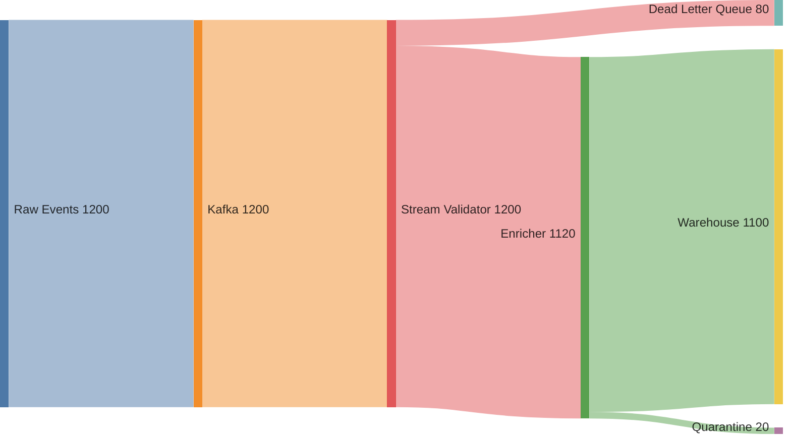
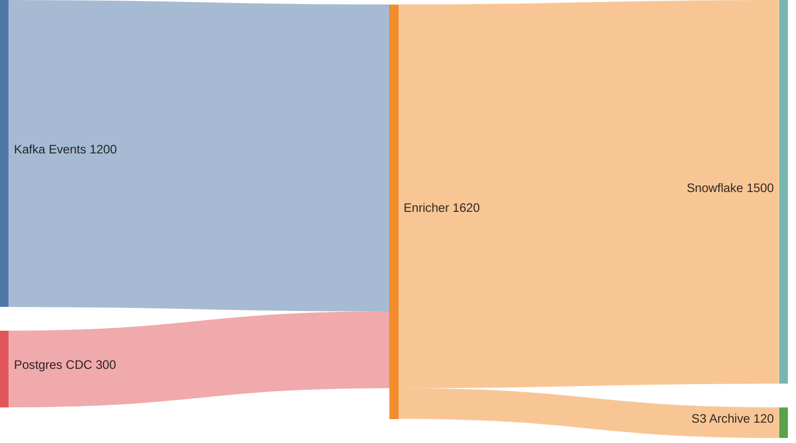
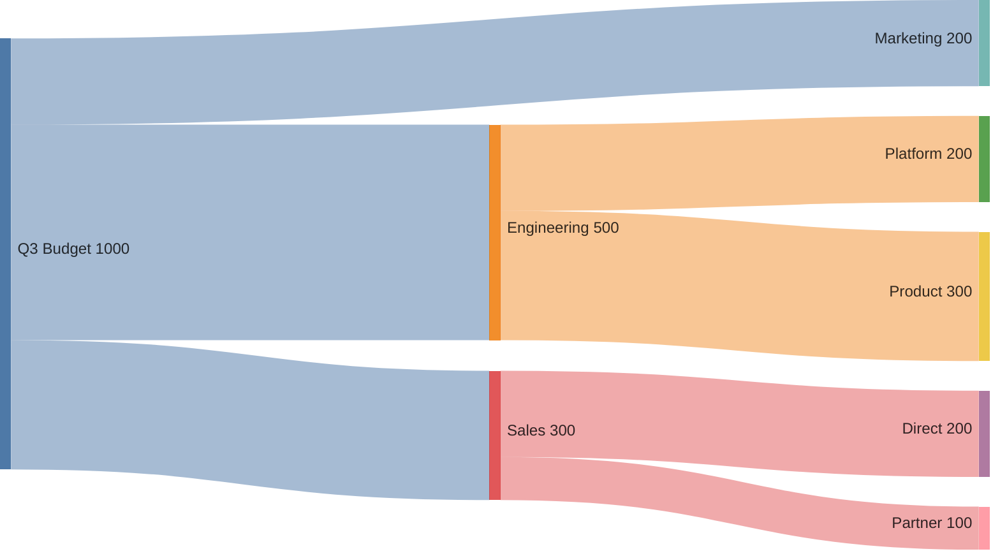
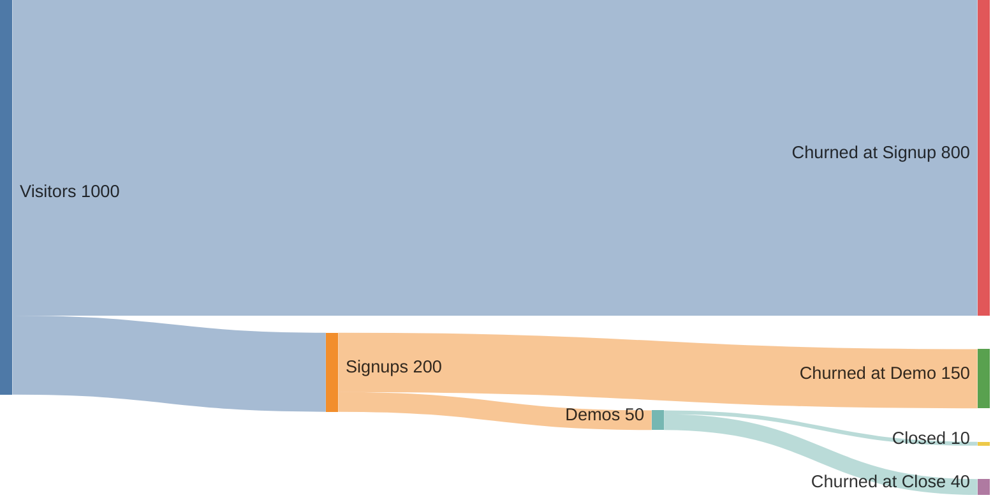

# Sankey Flow

Dynamic, example-anchored Sankey diagramming. Given a prompt, match it against a library of canonical Sankey examples, adapt the matched example's structure to the user's actual data, and render a Mermaid `sankey-beta` diagram. Missing data is marked as placeholder (value=1) — do not invent quantities, and do not interrogate the user. When the prompt references external sources (URLs, financial statements, codebases), delegate extraction to analytical skills rather than asking the user to transcribe data. Single pass — no multi-iteration PDCA loop; the adapt step self-corrects against the matched example's structure.

## Ontological Grounding

A Sankey diagram is a visualization of a **PKO Procedure** (Procedural Knowledge Ontology, Carriero et al. 2025, arXiv:2503.20634). The mapping is:

| Sankey element | PKO concept | Role |
|---|---|---|
| The whole diagram | `pko:Procedure` | A sequence of actions to achieve an outcome |
| Each node | `pko:Step` | A stage in the procedure |
| Each edge | `pko:nextStep` (flow) | Sequential flow between steps |
| Each weight | `pko:StepExecution` quantity | The magnitude flowing through a step execution |
| Conservation rule | `pko:StepVerification` | How the flow's correctness is verified |
| Interrogation questions | `pko:UserQuestionOccurrence` | Questions asked during the procedure |
| Refinement directives | `pko:UserFeedbackOccurrence` | Feedback driving iteration |
| Data sources | `prov:wasDerivedFrom` (PROV-O) | Provenance of each weight |

The state axis (DC+BIBO) anchors the *artifact*: the output markdown is a `bibo:Document`, the Mermaid source is a `dcterms:Dataset`, each weight carries `dcterms:source`.

Domain-specific ontology supplements layer on top:
- **Financial domains** (cost-breakdown, resource-allocation): FIBO (Financial Industry Business Ontology) — line items map to FIBO concepts (e.g., `fibo:CashAndCashEquivalents`, `fibo:OperatingCashFlow`).
- **Process domains** (process, data-pipeline, system-architecture): PKO alone suffices.
- **Energy/material domains**: PKO + domain units (kWh, kg) — no standard OWL ontology is assumed; units are stated in the description.
- **User-journey/conversion**: PKO + the user's own funnel ontology (stages as named Steps).

## Canonical References

The skill builds on these established resources. Cite them in the output description when relevant:

- **Schmidt, M. (2008).** "The Sankey Diagram in Energy and Material Flow Management." *Journal of Industrial Ecology* 12(1):82–94 (Part I: History) and 12(2):173–185 (Part II: Methodology and Current Applications). The canonical two-part academic reference. Establishes that conservation of energy/mass is a defining property of "simple" Sankeys in the original engineering sense.
- **Sankey, H. R. (1898).** "The Thermal Efficiency of Steam-Engines." *Minutes of Proceedings of the Institution of Civil Engineers* 134:278–312. The original diagram.
- **Minard, C. J. (1869).** *Carte figurative et approximative des pertes successives en hommes de l'Armée Française dans la campagne de Russie 1812–1813.* Predates Sankey; Edward Tufte called it "the best statistical graphic ever drawn."
- **Tufte, E. R. (1983).** *The Visual Display of Quantitative Information.* Chapters on Minard set the standard for flow-visualization data integrity.
- **PROV-O** (W3C): `https://www.w3.org/TR/prov-o/` — the ontology for provenance, used for weight source tracking.
- **FIBO** (EDM Council): `https://spec.edmcouncil.org/fibo/` — the ontology for financial concepts, used for financial-domain node taxonomies.
- **PKO** (Carriero et al. 2025): `https://w3id.org/pko` — the ontology for procedural knowledge, used for flow structure.
- **Mermaid Sankey docs**: `https://mermaid.js.org/syntax/sankey.html` — the rendering target.

## When to Use

- The user describes a system, process, budget, pipeline, funnel, or allocation and wants to **see the flow** as a Sankey diagram.
- The user gives a vague prompt ("show how our data flows", "where does the budget go", "map the user journey drop-off") and you must **decide which flow is relevant** before drawing.
- The user has partial data and you need to **ask incremental questions** to fill in nodes, links, or weights — not fabricate them.
- The user references an external source (URL, financial statement, codebase, database) and you need to **delegate extraction** to a research skill rather than asking the user to transcribe.
- The user wants the diagram to render natively in Zed's markdown preview (Mermaid `sankey-beta`).
- You need iterative quality convergence — drafts are scored and refined until the flow is faithful, weighted, and readable.

## When NOT to Use

- The user wants a flowchart (decisions, branching) without quantitative weights → use `diataxis-diagram` flowchart mode. Sankey requires weighted edges; unweighted flow is a flowchart, not a Sankey.
- The user wants a sequence of messages over time → use `diataxis-diagram` sequence mode.
- The user wants a static state machine → use `diataxis-diagram` state mode.
- The user wants a chord diagram (peer-to-peer flows, no stages) → Sankey is for staged flows; chord is for cyclical/peer flows.
- The user explicitly asks for a different rendering library (D3, Plotly, ECharts) that Zed does not render natively.

## Output Format

Mermaid `sankey-beta` source, wrapped in a markdown code fence. Example:

````

````

Zed rendering constraints (same as `diataxis-diagram`): no `%%{init}%%`, no `classDef`, no inline color styles. Use the front-matter `config` block instead of `init` directives.

## Flow Domain Catalog

Classify the prompt against these domains. Each domain carries: (a) a canonical node taxonomy, (b) weight semantics with unit, (c) a conservation rule, (d) an ontology anchor. Pick the **single best fit**; if two are plausible, prefer the one whose weight semantics the prompt actually mentions. If the prompt spans two domains (e.g., "show our budget and how it converts to users"), produce **two linked diagrams** — one per domain — rather than forcing a choice.

| Domain | Node taxonomy | Weight semantics (unit) | Conservation | Ontology anchor |
|---|---|---|---|---|
| **process** | Process steps / stages | Throughput per unit time (items/hr, req/s) | **asserted** — flag discrepancies as questions | PKO |
| **data-pipeline** | Sources → transformers → sinks | Record/byte volume | **asserted** — flag loss branches | PKO |
| **resource-allocation** (financial) | Budget / capacity pools | Currency or resource units (FTE, GB, CPU) | **mandatory** — inflow = outflow | FIBO |
| **user-journey** | Funnel stages / touchpoints | User count (or conversion %) | **none** — users can appear in multiple branches | PKO |
| **energy-material** | Energy/material stocks and conversions | Energy (kWh) or mass (kg) | **mandatory** — first law | PKO + domain units |
| **decision-funnel** | Decision branches with outcomes | Count of decisions per branch | **mandatory** — every decision goes somewhere | PKO |
| **value-stream** | Value-stream map (lean) stages | Time (hr) or cost ($) per stage | **none** — time is not conserved; cost accumulates | PKO |
| **cost-breakdown** (financial) | Cost categories → subcategories → outputs | Currency | **mandatory** — total = sum of parts | FIBO |
| **conversion** (attribution) | Multi-channel attribution paths | Conversions or revenue | **none** — a conversion may be credited to multiple touches | PKO |
| **system-architecture** | Services and request/data paths | Request volume or bandwidth | **asserted** — flag where requests are dropped | PKO |

**Conservation modes**:
- **mandatory**: the domain's physics/finance require conservation. Inflow must equal outflow at every node. If the user's numbers don't balance, flag the discrepancy as a question — do not silently "balance" by inventing a loss branch.
- **asserted**: conservation may or may not hold. If the user states conservation, enforce it. If not, flag discrepancies as questions.
- **none**: flows are not conserved. A single input can split into multiple outputs that sum to more than the input (e.g., a user appears in two funnel branches). Do not enforce conservation.

If the prompt does not match any domain, default to **process** with conservation=asserted, and note the inference in the classification verdict.

## Instructions

The process is example-anchored match → adapt → render (single pass, 2 LLM calls + 1 deterministic render). The old 7-step PDCA loop (classify → gather → draft → evaluate → converge → loop → write) was overengineered — it made up to 21 LLM calls and never converged because the evaluate step kept flagging intentional design choices (e.g., non-conserving loss-making income statements) as quality gaps.

1. **MATCH.** Read the prompt and select the single best-fit domain from the catalog above, match it against the canonical example library by trigger phrases and structural similarity, and extract the user's actual nodes, edges, and weights in a single pass. Does NOT interrogate — missing data is marked as placeholder (value=1). For income statements with losses, negative profits flow into Total Revenue as sources (Revenue + |Loss| = Total Expenses). If the prompt references an external source (URL, file, database), note it for research delegation. If the prompt spans two domains, classify both and plan two diagrams.

2. **ADAPT.** Fill the user's extracted data into the matched canonical example's structure. Verify structure against the example (node count, edge pattern, conservation mode), render the Mermaid sankey-beta CSV with front-matter config, and wrap in a markdown document with description, conservation check, data sources with PROV-O provenance, and references. Single pass — self-correct against the example structure if the draft deviates.
   - Node labels: title case, ≤ 30 characters. If a label is longer, abbreviate and document the abbreviation in the description paragraph.
   - Node IDs: identical to labels (Mermaid Sankey uses labels as IDs).
   - Order edges so that sources appear before targets in the CSV — this improves Mermaid's layout heuristics.
   - Use the front-matter `config` block for `width`, `height`, `showValues`, `linkColor` (`source` | `target` | `gradient`). Default `linkColor: source`.
   - For **mandatory-conservation** domains, verify inflow = outflow at every internal node. If not, flag in the description rather than silently balancing.
   - For **none-conservation** domains (user-journey, conversion, value-stream), do not add loss branches to "balance" the flow — the asymmetry is the point.
   - **Hard rule**: never fabricate weights. If the user declines to provide a weight, mark the edge as `value=1` (unitless) and note in the diagram description that weights are unweighted placeholders.

   **Research delegation** (when the prompt references a URL, file, financial statement, codebase, or database): Delegate extraction to an analytical skill rather than asking the user to transcribe data. Delegation targets:
   - **`structured-extraction`**: when the source is a document (PDF, HTML, financial statement) and you need to extract entities (line items, stages, services) and relations (flows) into a structured schema. Provide a schema matching the Sankey spec: `{nodes: [{id, label, ontology_concept}], edges: [{source, target, weight, weight_unit, weight_source}]}`.
   - **`sequential-inquiry`**: when the source is ambiguous or multi-step (e.g., "research how our competitors handle onboarding and map the flow") and you need to reason through what the flow actually is before extracting weights. Template: `sequential-inquiry/sequential-inquiry-engine`.
   - **`graph-audit` (code mode)**: when the source is a codebase and you need to trace data flow through services/modules via the code graph. Template: `graph-audit/code-discover`.
   - **`firecrawl_scrape` / `firecrawl_extract`**: when the source is a URL and you need to pull structured data (e.g., a financial statement from a 10-K filing).

   After delegation, validate the extracted spec: are all weights sourced? Are all nodes present? If gaps remain, mark them as placeholders — do not re-delegate the whole task.

3. **Conservation check (deterministic).** Call `lisp_eval` to sum source-side and sink-side edge weights for mandatory conservation mode and compare for equality (within epsilon 0.01). Returns conservation_verified, source_total, sink_total, delta. Non-mandatory modes return verified: true (skipped). No LLM call.

4. **Surface the diagram.** A final `render` step (`present-sankey.j2`, Rendering template — deterministic, no LLM call) wraps the adapt step's mermaid source in a titled, annotated markdown document with a title, description, the mermaid diagram, the conservation check, a data table annotating each flow with its weight and provenance, and references. This becomes the process's final output — the fenced ```mermaid block reaches the chat stream directly, not buried inside a JSON object field.

## Research Delegation — Detailed Protocol

When the gather step takes Path B (research delegation), follow this protocol:

1. **Identify the source type**: URL (use `firecrawl_scrape` or `firecrawl_extract`), file in project (use `read_file` or `structured-extraction`), codebase (use `graph-audit` code mode), ambiguous/multi-step (use `sequential-inquiry`).

2. **Define the extraction schema**: Always provide a schema matching the Sankey spec. For financial statements, anchor to FIBO concepts:
   ```json
   {
     "nodes": [{"id": "string", "label": "string", "ontology_concept": "fibo:ConceptName"}],
     "edges": [{"source": "string", "target": "string", "weight": "number", "weight_unit": "string", "weight_source": "string"}]
   }
   ```

3. **Delegate and await**: Call the delegated skill with the source and schema. Do not attempt extraction yourself if a specialized skill exists.

4. **Validate the result**: Check that (a) all nodes have labels, (b) all edges have weights, (c) weights have sources, (d) the graph is connected (no orphan nodes), (e) conservation holds where mandatory.

5. **Mark gaps as placeholders**: If delegation returns a partial spec (e.g., nodes but no weights), mark the missing weights as `value=1` placeholders and note them in the description. Do not re-delegate the whole task.

6. **Cite the source in provenance**: Every weight extracted via delegation must carry `prov:wasDerivedFrom <source URL or file path>` in the Data sources section.

## Comparative and Multi-Diagram Cases

- **Two domains in one prompt** (e.g., "show our budget and how it converts to users"): produce two Sankeys — one `cost-breakdown`, one `user-journey` — linked by a shared node (the marketing spend node in the cost Sankey is the same as the ad-spend node in the journey Sankey). Note the linkage in both descriptions.
- **Two time periods** (e.g., "Q3 vs Q4 budget"): produce two Sankeys with identical node structure, and add a third "delta" Sankey showing the differences (positive values for increases, the Sankey will render these as flows from "Q4" to the changed categories). Note in the description that the delta Sankey is a comparison, not a flow.
- **Family of related flows** (e.g., the three financial statements — income, balance sheet, cash flow): produce one Sankey per statement, cross-linked. This mirrors GuruFocus's approach of three separate breakdown charts.

## Constraints

- **Never fabricate weights.** This is the single hard rule. Weights must be user-stated, source-read, or explicitly marked as unitless placeholders (`value=1`).
- **Never fabricate nodes or edges.** If the prompt does not mention a node, do not add it. Ask first, or delegate extraction.
- **One domain per diagram.** Do not mix flow domains in a single Sankey. If the prompt spans two domains, produce two diagrams with shared nodes.
- **Respect conservation mode.** Mandatory domains must conserve; asserted domains flag discrepancies; none-domains do not enforce conservation.
- **Mermaid `sankey-beta` only.** Do not output D3, Plotly, ECharts, or raw SVG. Zed renders Mermaid natively.
- **Zed rendering constraints**: no `%%{init}%%`, no `classDef`, no inline color styles. Use the front-matter `config` block.
- **Node labels ≤ 30 characters.** Abbreviate longer labels and document the abbreviation.
- **No duplicate node IDs.** Mermaid Sankey uses labels as IDs; duplicates silently break rendering.
- Single pass — no iteration loop. `max_iterations: 1`; the adapt step self-corrects against the matched example's structure.
- **Delegate, don't transcribe.** When the prompt references an external source, delegate extraction to a specialized skill. Do not ask the user to transcribe data that exists in a source.
- **Cite canonical references** in the output when relevant (Schmidt 2008, FIBO, PROV-O, PKO).
- This SKILL.md body is the authoritative methodology. Jinja2 templates in the registry are structured reference versions of the same content.
- **Visual artifact surfacing** — the `present-sankey.j2` render step (rendering template) must be the process's final output step. It surfaces the fenced ```mermaid block as a raw markdown string so acp_thread's mermaid renderer picks it up. Removing it causes the diagram to stay buried in the adapt step's JSON output — the model must then discover and extract the `markdown` field, which is fragile.

## Registry Templates

| Template | Purpose |
|----------|---------|
| `sankey-examples.j2` | Include | Library of canonical Sankey structural templates (income statement, budget, data pipeline, funnel, balance sheet, process flow) with match triggers, node patterns, edge patterns, conservation modes, and filled instances. Included by the match and adapt templates as few-shot context. |
| `sankey-match.j2` |  | Classify the prompt's domain, match it against the canonical example library by trigger phrases and structural similarity, and extract the user's actual nodes, edges, and weights in a single pass. Does NOT interrogate — missing data is marked as placeholder (value=1). For income statements with losses, negative profits flow into Total Revenue as sources (Revenue + |Loss| = Total Expenses). |
| `sankey-adapt.j2` |  | Fill the user's extracted data into the matched canonical example's structure. Verify structure (node count, edge pattern, conservation mode), render Mermaid sankey-beta CSV with front-matter config, and wrap in a markdown document with description, conservation check, data sources with PROV-O provenance, and references. Single pass — no iteration loop. Self-corrects against the example structure if the draft deviates. |
| `present-sankey.j2` |  | Rendering template — surfaces the finalized Sankey markdown (containing the fenced ```mermaid block) as the process's final output string. Flattens the adapt step's JSON object to a raw markdown string. Deterministic (no LLM call). |

To render a template, call the `render_template` tool with the template ref (e.g., `essentialist/essentialist-flow`) and a context object with the required variables.

## Examples

### Example 1: Vague prompt, full interrogation

**Prompt**: "show how our data flows"

**Classification**: domain = `data-pipeline` (trigger phrase "data flows"; weight semantics = record/byte volume; conservation = asserted; ontology = PKO). Candidate nodes: none. Candidate edges: none.

**Interrogation round 1** (3 questions, batched):
1. "What are the sources of your data? (e.g., 'Kafka, Postgres CDC, S3 uploads' — list as many as apply)"
2. "What are the sinks? (e.g., 'Snowflake warehouse, S3 archive, real-time dashboard')"
3. "Do you have approximate volumes per source? (absolute numbers, relative ratios, or 'no idea' are all fine — I will mark unknowns as unweighted)"

**User answer**: "Sources: Kafka events, Postgres CDC. Sinks: Snowflake, S3 archive. Volumes: Kafka ~1.2M events/day, Postgres ~300K rows/day, Snowflake gets everything, S3 archive gets 10% of Kafka."

**Draft**:
````

````

**Description**: Data pipeline flow (PKO Procedure, 4 Steps). Weights in thousands of records/day. Conservation: asserted — Enricher inflow (1500) = outflow (1500+120=1620). **Discrepancy flagged**: outflow exceeds inflow by 120; the user stated S3 Archive receives 10% of Kafka (120K), which implies the Enricher is not the source of S3 Archive, or there is an unreported loss branch. User should clarify.

### Example 2: Specific prompt, no interrogation

**Prompt**: "Sankey of our Q3 budget: $500K engineering, $300K sales, $200K marketing. Engineering splits into platform $200K and product $300K. Sales splits into direct $200K and partner $100K."

**Classification**: domain = `cost-breakdown` (trigger "budget"; weight = currency; conservation = mandatory; ontology = FIBO). Candidate nodes: Q3 Budget, Engineering, Sales, Marketing, Platform, Product, Direct, Partner. Candidate edges: 7, all weighted.

**Spec gap**: none. Skip interrogation.

**Draft**:
````

````

**Convergence**: 0.00 on first draft (all weights user-stated, all nodes present, conservation holds: 500+300+200=1000 in; 200+300+200+100=800 out via sub-allocations, root inflow 1000 = sum of root outflows). CONVERGED.

**References**: FIBO (`fibo:Budget`, `fibo:MonetaryAmount`).

### Example 3: Conservation discrepancy (mandatory domain)

**Prompt**: "Map our lead funnel: 1000 visitors → 200 signups → 50 demos → 10 closed."

**Classification**: domain = `user-journey` (trigger "funnel"; weight = user count; conservation = **none** — users can appear in multiple branches; ontology = PKO).

**Draft**:
````

````

**Description**: User journey funnel (PKO Procedure, 6 Steps). Weights are user counts. Conservation mode: **none** — this is a funnel, not a conserved flow. "Churned at Signup", "Churned at Demo", and "Churned at Close" are inferred loss branches added to make the funnel readable as a Sankey (Sankey widths encode flow magnitude; the implicit loss is the whole point). If the user does not want loss branches shown, the diagram can be redrawn as a pure chain, but then it is not a true Sankey.

**Evaluate**: data integrity = 0.20 (loss branches inferred but flagged, not silently balanced — and conservation mode is `none` so this is acceptable). All other criteria = 0.00. Weighted total = 0.07. CONVERGED.

### Example 4: Research delegation (financial statement)

**Prompt**: "Sankey of Apple's latest income statement from their 10-K."

**Classification**: domain = `cost-breakdown` (financial; conservation = mandatory; ontology = FIBO). Source: Apple 10-K (URL needed).

**Gather — Path B (delegation)**:
1. Source type: URL (SEC EDGAR or Apple investor relations).
2. Delegate to `firecrawl_extract` with schema:
   ```json
   {
     "nodes": [{"id": "string", "label": "string", "ontology_concept": "fibo:Revenue|fibo:CostOfRevenue|fibo:OperatingExpense|fibo:NetIncome"}],
     "edges": [{"source": "string", "target": "string", "weight": "number", "weight_unit": "USD millions", "weight_source": "Apple 10-K page X"}]
   }
   ```
3. Validate: all weights sourced? Conservation holds (Revenue = COGS + OpEx + NetIncome)?
4. If gaps (e.g., extraction missed a line item), mark them as placeholders: "Extraction found Revenue, COGS, NetIncome but not R&D or SG&A — those edges are marked value=1 (unweighted placeholders)."

**Draft**: (structure mirrors Example 2, with FIBO-anchored node labels)

**Data sources**: Every weight carries `prov:wasDerivedFrom <Apple 10-K URL, page X>`.

**References**: FIBO (`fibo:Revenue`, `fibo:CostOfRevenue`, `fibo:OperatingExpense`, `fibo:NetIncome`); Schmidt 2008 Part II (cost-flow Sankeys); GuruFocus (canonical example of financial-statement Sankeys).

### Example 5: Multi-diagram family (three financial statements)

**Prompt**: "Visualize Apple's financial statements."

**Classification**: three domains, all `cost-breakdown`, all FIBO-anchored:
1. Income statement (Revenue → COGS, OpEx → NetIncome)
2. Balance sheet (Assets = Liabilities + Equity)
3. Cash flow statement (Operating → Investing → Financing → Net change in cash)

**Output**: three Sankeys, cross-linked. Each description notes the linkage (e.g., "NetIncome from the income-statement Sankey flows into RetainedEarnings in the balance-sheet Sankey"). This mirrors GuruFocus's three-chart approach.

**References**: FIBO; GuruFocus (canonical example).
