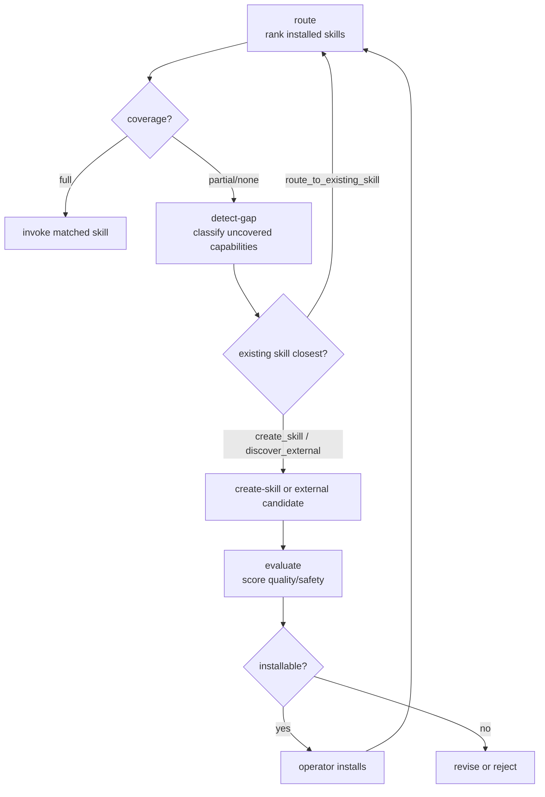

# Skill Discovery

Match tasks to the installed skill catalog and acquire NEW skills when nothing fits. One fit-scoring instrument serves both questions: **route** ranks installed skills for a task or a capability gap and emits uncovered capabilities; **detect-gap** classifies those uncovered capabilities; **evaluate** vets a candidate before installation.

## When to Use

- Match a task or work slice against the installed skill catalog to find the best-fitting skill(s) (route).
- Consume `skill_match_query` fields emitted by `task-breakdown`'s decompose phase or `metacognition`'s `skill_match_queries` (one per slice) and return ranked recommendations (route).
- Detect capability gaps in the registry corpus by comparing task patterns against existing skills (detect-gap).
- Evaluate a candidate skill against format, quality, and safety criteria to decide whether it should be installed, revised, or rejected (evaluate).

## When NOT to Use

- Authoring a skill from scratch — `create-skill`; discovery evaluates candidates, it does not write them.
- Auditing or maintaining installed skills — `skill-maintenance`.
- Executing the matched skill — invoke it directly; a recommendation is not a dispatch.

## Instructions

### skill-discovery-route

1. For each candidate skill in the catalog, compute a fit_score in [0.0, 1.0] across three dimensions: capability overlap (0.50), description alignment (0.25), trigger alignment (0.25).
2. Composite fit_score = (capability × 0.50) + (description × 0.25) + (trigger × 0.25).
3. Rank recommendations by fit_score descending; return at most `max_recommendations` (default 3), only those with fit_score ≥ 0.30.
4. Classify coverage: `full` (≥1 skill at fit ≥ 0.80), `partial` (best fit ≥ 0.40 and < 0.80), `none` (best fit < 0.40).
   **D over P:** the three dimension scores are judgments (P); the composite, the +0.20 boost, the 0.30 floor and the band are arithmetic (D). Recompute them from the route output with `lisp_eval` before acting on it:
   - form: `(let ((fit (min 1 (max 0 (+ (* 0.5 c) (* 0.25 d) (* 0.25 (min 1 (+ t boost)))))))) (list fit (>= fit 0.3) (cond ((>= best 0.8) "full") ((>= best 0.4) "partial") (t "none"))))`
   - env: `{ "c": <capability>, "d": <description>, "t": <trigger>, "boost": <0.2 if the epistemic boost applies, else 0>, "best": <the highest recomputed fit> }`
5. If coverage is partial or none, emit `uncovered_capabilities` (the detect-gap input): each with `capability`, `task_pattern`, `closest_skill`, `gap_type` (coverage|feature|epistemic).
6. When `epistemic_state` is provided with confidence < 0.5, apply a +0.20 boost to trigger-alignment for certainty-finding skills; clamp to [0.0, 1.0].
7. Do not recommend skill-discovery as a match — it is a meta-skill.
8. Respond with a JSON object: `coverage_assessment`, `recommendations`, `uncovered_capabilities`.
9. Re-entry: when coverage is partial or none AND the catalog has changed since this route ran (a candidate was installed), re-run route once against the grown catalog. Bound: max 2 routing passes per task; a second partial result emits the gap signals and stops.

### skill-discovery-detect-gap

1. Map every task pattern to determine if an existing skill covers it fully, partially, or not at all.
2. Classify partial matches as Feature gaps rather than Coverage gaps.
3. Detect latent gaps where a quality or governance rule exists in `kask/docs/architecture/core/PRINCIPLES.md` but no skill enforces it, classifying these as Governance gaps.
4. Score the impact of each gap on agent effectiveness as `critical`, `high`, `medium`, or `low`.
5. Prioritize gaps by impact, then by frequency of the associated task pattern.
6. Recommend an action per gap: `create_skill` (coverage gap), `extend_skill` (feature gap, needs new templates), `route_to_existing_skill` (feature gap, existing skill not yet routed — confirm with route), `discover_external` (external crate), `automate` (automation gap), or `ignore` (low-impact only).
7. Respond with a JSON object containing the `gap_list` and `priority_ranking`.
8. Evaluate every task pattern without skipping niche patterns.
9. Ensure each gap references exactly one category, even if it spans multiple task patterns.
10. Justify impact scoring using task pattern frequency and consequence.
11. Do not recommend `ignore` for any gap with `critical` or `high` impact.
12. Classify `epistemic` gaps distinctly from `knowledge` gaps: `knowledge` means missing facts or information; `epistemic` means missing certainty-finding methods or perspective-rotation tools. An `epistemic` gap is flagged when an agent reports low confidence and no installed skill addresses the uncertainty type (perspective_blind, context_loss, conflict).

### skill-discovery-evaluate

1. Evaluate the candidate skill against format, quality, and safety criteria.
2. Validate the format by checking for YAML frontmatter, a valid name, a specific description, and the absence of deprecated markers.
3. Assess instruction quality to ensure steps are imperative, concrete, actionable, bounded in scope, and have clear trigger conditions.
4. Check Magna Carta compliance and system constraints, including user sovereignty (P1), affirmative consent (P2), generative space (P3), clear boundaries (P4), headless compliance, Regulation span validity, and crate path validity.
5. Score each check from 0 to 2, where 0 is fail, 1 is partial, and 2 is pass.
6. Respond with a JSON object containing `format_validation`, `quality_evaluation`, `safety_evaluation`, `overall_score`, and `recommendation`.
7. Score every check without omitting any.
8. Reject the skill if any safety check scores 0.
9. Revise the skill if the overall score is less than 16 but there are no safety failures.

## Pipeline

Installation is an operator decision; this skill recommends, it never installs.

## Registry Templates

| Template | Purpose |
|----------|---------|
| `skill-discovery-route.j2` | ROUTE — match a task or capability gap against the installed skill catalog. Scores each skill 0.0–1.0 (capability 0.50, description 0.25, trigger 0.25). Returns ranked recommendations with fit_score, match_reason, applicable templates, and invocation hints; emits `coverage_assessment` (full ≥0.8 / partial 0.4–0.79 / none <0.4) and `uncovered_capabilities` for detect-gap. Optional `epistemic_state` boosts certainty-finding skills in a low-confidence regime. |
| `skill-discovery-detect-gap.j2` | DETECT-GAP — classify gaps (coverage, feature, automation, knowledge, governance, quality, epistemic) and prioritize by impact. Recommends actions including `route_to_existing_skill`. |
| `skill-discovery-evaluate.j2` | EVALUATE — score a candidate skill against format, quality, and safety criteria (Magna Carta compliance, Regulation span validity) and produce a scored recommendation. |

To render a template, call the `render_template` tool with the template ref (e.g., `skill-discovery/skill-discovery-route`) and a context object with the required variables.

Template context variables (from each template's [inference] contract):
- `skill-discovery-route.j2`: `task_description`, `task_context`, `skill_catalog`, `max_recommendations`, `epistemic_state`
- `skill-discovery-evaluate.j2`: `candidate_skill_content`

## Constraints

- `skill-discovery-route.j2`: Public. Evaluates every skill in the catalog — do not skip seemingly-irrelevant skills without scoring. fit_score and each dimension score are floats in [0.0, 1.0]. If coverage is `full`, `uncovered_capabilities` must be empty; if `none`, recommendations may be empty but `uncovered_capabilities` must be non-empty.
- `skill-discovery-detect-gap.j2`: Public. Gap categories: coverage, feature, automation, knowledge, governance, quality, epistemic (7 categories). Input `skill_catalog` is the same array passed to route.
- `skill-discovery-evaluate.j2`: Public. 11 checks scored 0–2; max score 22; min installable 16; safety 0 → reject.
- `lisp_eval` is available for deterministic scoring formulas (e.g., weighted combinations of quality, safety, and fit scores).
- This SKILL.md body is the authoritative methodology. Jinja2 templates in the registry are structured reference versions of the same content.
