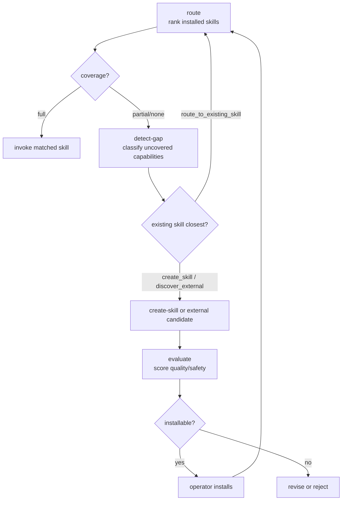

# Skill Discovery

Match tasks to the installed skill catalog and acquire NEW skills when nothing fits. One fit-scoring instrument serves both questions: **route** ranks installed skills for a task or a capability gap and emits uncovered capabilities; **detect-gap** classifies those uncovered capabilities; **evaluate** vets a candidate before installation.

## When to Use

- Match a task or work slice against the installed skill catalog to find the best-fitting skill(s) (route).
- Consume `skill_match_query` fields emitted by `task-breakdown`'s decompose phase, `metacognition`'s `skill_match_queries`, or `kata-improvement`'s step-8 output (one per slice) and return ranked recommendations (route).
- Detect capability gaps in the registry corpus by comparing task patterns against existing skills (detect-gap).
- Evaluate a candidate skill against format, quality, and safety criteria to decide whether it should be installed, revised, or rejected (evaluate).

## When NOT to Use

- Authoring a skill from scratch — `create-skill`; discovery evaluates candidates, it does not write them.
- Auditing or maintaining installed skills — `skill-maintenance`.
- Executing the matched skill — invoke it directly; a recommendation is not a dispatch.

## Reference model and D/P labelling

The fit score is a **heuristic ranking** in the form of a fixed-weight
weighted-sum value model (Belton & Stewart, *Multiple Criteria Decision
Analysis*, 2002 — the same model `mcda` cites), applied WITHOUT the
sensitivity analysis that model prescribes: nothing here tests whether
the 0.50 / 0.25 / 0.25 split changes any ranking. The weights (inherited
from skill-router before the 2026-09-24 fold), the +0.20 epistemic boost
and the 24-of-32 installable threshold (rulings 2026-09-26), and the 0.30
floor and the 0.8 / 0.4 coverage bands (the band boundary fixed 2026-09-25)
are operator-set constants, not values derived from measured routing
outcomes. Treat a fit score as an ordering aid whose arithmetic is
reproducible, not as a calibrated probability that the skill fits; the
constants are open to revision when routing outcomes are recorded against
them.

The three fit dimensions (capability overlap, description alignment, trigger
alignment), gap classification, candidate evaluation, the `epistemic_state`
self-report (P — unmeasured by any tool, disclosed as such), the
boost-applicability judgment (which skills count as certainty-finding),
detect-gap's impact scoring, priority ranking, and per-gap recommended
action are P — judgment, critiqued by the recomputation below and by the
caller's epistemic state. The composite, the +0.20 boost arithmetic, the
0.30 floor and the coverage band are D: recompute them from the route
output with the `lisp_eval` form in skill-discovery-route item 4 before
acting on it — a recommendation whose arithmetic was not recomputed is
unverified routing.

## Instructions

### skill-discovery-route

1. For each candidate skill in the catalog, compute a fit_score in [0.0, 1.0] across three dimensions: capability overlap (0.50), description alignment (0.25), trigger alignment (0.25).
2. Composite fit_score = (capability × 0.50) + (description × 0.25) + (trigger × 0.25).
3. Rank recommendations by fit_score descending; return at most `max_recommendations` (default 3), only those with fit_score ≥ 0.30.
4. Classify coverage: `full` (≥1 skill at fit ≥ 0.80), `partial` (best fit ≥ 0.40 and < 0.80), `none` (best fit < 0.40).
   **D over P:** the three dimension scores are judgments (P); the composite, the +0.20 boost, the 0.30 floor and the band are arithmetic (D). Recompute them from the route output with `lisp_eval` before acting on it:
   - form: `(let ((fit (min 1 (max 0 (+ (* 0.5 c) (* 0.25 d) (* 0.25 (min 1 (+ t boost)))))))) (list fit (>= fit 0.3) (cond ((>= best 0.8) "full") ((>= best 0.4) "partial") (t "none"))))`
   - env: `{ "c": <capability>, "d": <description>, "t": <trigger>, "boost": <0.2 if the epistemic boost applies, else 0>, "best": <the highest recomputed fit> }`
5. If coverage is partial or none, emit `uncovered_capabilities` (the detect-gap input): each with `capability`, `task_pattern`, `closest_skill`, `gap_type` (coverage|feature|epistemic).
6. `epistemic_state` is optional and self-reported by the caller; no skill or tool measures it today. When it is provided with confidence < 0.5, apply a +0.20 boost to trigger-alignment for certainty-finding skills; clamp to [0.0, 1.0]. Record `boost_applied` (true/false) and its reason in the output so the boost can be checked.
7. Do not recommend skill-discovery as a match — it is a meta-skill.
8. Respond with a JSON object: `coverage_assessment`, `recommendations`, `uncovered_capabilities`, and `boost_applied` (with its reason — the audit trail for the one P judgment feeding the D recomputation; the route template's output contract carries all four).
9. Re-entry: when coverage is partial or none AND the catalog has changed since this route ran (a candidate was installed), re-run route once against the grown catalog. Bound: max 2 routing passes per task; a second partial result emits the gap signals and stops.

### skill-discovery-detect-gap

1. Map every task pattern to determine if an existing skill covers it fully, partially, or not at all.
2. Classify partial matches as Feature gaps rather than Coverage gaps.
3. Detect latent gaps where a quality or governance rule exists in `kask/docs/architecture/core/PRINCIPLES.md` but no skill enforces it, classifying these as Governance gaps.
4. Score the impact of each gap on agent effectiveness as `critical`, `high`, `medium`, or `low`.
5. Prioritize gaps by impact, then by frequency of the associated task pattern.
6. Recommend an action per gap: `create_skill` (coverage gap), `extend_skill` (feature gap, needs new templates), `route_to_existing_skill` (feature gap, existing skill not yet routed — confirm with route), `discover_external` (external crate), `automate` (automation gap), or `ignore` (low-impact only).
7. Respond with a JSON object containing the `gap_list` and `priority_ranking`.
8. Evaluate every task pattern without skipping niche patterns.
9. Ensure each gap references exactly one category, even if it spans multiple task patterns.
10. Justify impact scoring using task pattern frequency and consequence.
11. Do not recommend `ignore` for any gap with `critical` or `high` impact.
12. Classify `epistemic` gaps distinctly from `knowledge` gaps: `knowledge` means missing facts or information; `epistemic` means missing certainty-finding methods or perspective-rotation tools. An `epistemic` gap is flagged when an agent reports low confidence and no installed skill addresses the uncertainty type (perspective_blind, context_loss, conflict).

### skill-discovery-evaluate

1. Evaluate the candidate skill against format, quality, and safety criteria.
2. Validate the format by checking for YAML frontmatter, a valid name, a specific description, and the absence of deprecated markers.
3. Assess instruction quality to ensure steps are imperative, concrete, actionable, bounded in scope, and have clear trigger conditions.
4. Check Magna Carta compliance and system constraints, including user sovereignty (P1), affirmative consent (P2), generative space (P3), clear boundaries (P4), headless compliance, Regulation span validity, and crate path validity.
5. Score each of the 16 checks (4 format, 5 quality, 7 safety) from 0 to 2, where 0 is fail, 1 is partial, and 2 is pass. The maximum is 32.
6. Respond with a JSON object containing `format_validation`, `quality_evaluation`, `safety_evaluation`, `overall_score`, `recommendation`, and `recommendation_reason` (the evaluate template's output contract carries all six).
7. Score every check without omitting any.
8. Compute `overall_score` and the recommendation in `lisp_eval`, never by hand. Bind `fmt`, `q` and `s` to the format, quality and safety score lists and `threshold` to the installable minimum:
   `(begin (define sum (lambda (xs) (if (= (length xs) 0) 0 (+ (car xs) (sum (cdr xs)))))) (let ((total (+ (sum fmt) (sum q) (sum s)))) (list total (if (member 0 s) "reject" (if (< total threshold) "revise" "install")))))`
   Tested: all 2s → `[32, install]`; one safety 0 → `reject`; all 1s at threshold 24 → `[16, revise]`. Any safety score of 0 rejects deterministically, including judgment checks such as P3. A format or quality 0 does NOT gate — it only diminishes the total (a candidate failing a format check can still reach `install` if the total clears 24 with no safety 0; verified live) — the safety checks are the gate.
9. The installable threshold is 24 of 32 (operator ruling 2026-09-26), keeping the roughly 73% bar that 16 of 22 set when the template miscounted 11 checks.

## Initial and target condition

- **Initial condition:** the task or gap description, its context, and the installed skill catalog (plus, for evaluate, the candidate skill's content).
- **Target condition:** route returns recommendations whose fit, floor and coverage band were recomputed in `lisp_eval`; evaluate returns a recommendation computed in `lisp_eval` from all 16 scores. Installation stays the operator's decision.

## Step types

| Step | Type | Oracle / critique |
|------|------|-------------------|
| Dimension scores, gap classification and impact, check scores | P | the operator, who decides installation |
| Composite fit, boost, floor, band; overall score and recommendation | D | the `lisp_eval` forms above |

## Pipeline

```mermaid
flowchart TD
    R[route<br/>rank installed skills] --> C{coverage?}
    C -- full --> X[invoke matched skill]
    C -- partial/none --> A[detect-gap<br/>classify uncovered capabilities]
    A --> B{existing skill closest?}
    B -- route_to_existing_skill --> R
    B -- create_skill / discover_external --> N[create-skill or external candidate]
    N --> F[evaluate<br/>score quality/safety]
    F --> H{installable?}
    H -- yes --> I[operator installs] --> R
    H -- no --> J[revise or reject]
```

Installation is an operator decision; this skill recommends, it never installs.

## Registry Templates

| Template | Purpose |
|----------|---------|
| `skill-discovery-route.j2` | ROUTE — match a task or capability gap against the installed skill catalog. Scores each skill 0.0–1.0 (capability 0.50, description 0.25, trigger 0.25). Returns ranked recommendations with fit_score, match_reason, applicable templates, and invocation hints; emits `coverage_assessment` (full ≥0.8 / partial 0.4–0.79 / none <0.4) and `uncovered_capabilities` for detect-gap. Optional `epistemic_state` boosts certainty-finding skills in a low-confidence regime. |
| `skill-discovery-detect-gap.j2` | DETECT-GAP — classify gaps (coverage, feature, automation, knowledge, governance, quality, epistemic) and prioritize by impact. Recommends actions including `route_to_existing_skill`. |
| `skill-discovery-evaluate.j2` | EVALUATE — score a candidate skill against format, quality, and safety criteria (Magna Carta compliance, Regulation span validity) and produce a scored recommendation. |

To render a template, call the `render_template` tool with the template ref (e.g., `skill-discovery/skill-discovery-route`) and a context object with the required variables.

Template context variables (from each template's [inference] contract):
- `skill-discovery-route.j2`: `task_description`, `task_context`, `skill_catalog`, `max_recommendations`, `epistemic_state`
- `skill-discovery-detect-gap.j2`: `task_patterns`, `skill_catalog`
- `skill-discovery-evaluate.j2`: `candidate_skill_content`

## Regression case

All receipts executed live through `lisp_eval` (2026-10-01, batch-10 audit):

- Route composite, full with the boost clamp exercised: `{c: 0.9, d: 0.8,
  t: 0.9, boost: 0.2, best: 0.85}` → `[0.9, true, "full"]` (t+boost = 1.1
  clamps at 1; the band reads `best`).
- Route composite, none-band (the cond-else branch, where `t` does double
  duty as the env binding and the else truth constant): `{c: 0.5, d: 0.5,
  t: 0.5, boost: 0, best: 0.399}` → `[0.5, true, "none"]` — the else branch
  evaluates correctly with `t` bound.
- Route composite, floor-fail under partial: `{c: 0.3, d: 0.2, t: 0.1, boost: 0,
  best: 0.6}` → `[0.225, false, "partial"]` — the 0.30 floor fails this skill's
  fit while the coverage band reads partial from `best` (two different
  inputs: `fit` is THIS skill's recomputed score, `best` is the highest
  recomputed fit across the catalog).
- Evaluate, install: all 2s (16 checks) → `[32, "install"]`.
- Evaluate, safety-0 reject: one safety 0 with total 30 ≥ threshold 24 →
  `[30, "reject"]` — the safety gate dominates the total, deterministically.
- Evaluate, revise: all 1s → `[16, "revise"]` (below the 24-of-32 bar).

The skill's forms are executed at use time, never anchored in code.

## Constraints

- `skill-discovery-route.j2`: Evaluates every skill in the catalog — do not skip seemingly-irrelevant skills without scoring. fit_score and each dimension score are floats in [0.0, 1.0]. If coverage is `full`, `uncovered_capabilities` must be empty; if `none`, recommendations may be empty but `uncovered_capabilities` must be non-empty.
- `skill-discovery-detect-gap.j2`: Gap categories: coverage, feature, automation, knowledge, governance, quality, epistemic (7 categories). Input `skill_catalog` is the same array passed to route.
- `skill-discovery-evaluate.j2`: 16 checks scored 0–2; max score 32; min installable 24 (operator ruling 2026-09-26); safety 0 → reject.
- `lisp_eval` is available for deterministic scoring formulas (e.g., weighted combinations of quality, safety, and fit scores).
