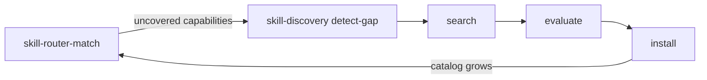

# Skill Router

Route tasks to EXISTING installed skills. Given a task/slice description and the installed skill catalog, score each candidate skill 0.0–1.0 on capability overlap, description alignment, and trigger alignment, and return ranked recommendations with fit scores, applicable templates, and invocation hints. Identify uncovered capabilities as gap signals consumed by skill-discovery. Distinct from skill-discovery (which acquires NEW skills): skill-router matches tasks to EXISTING skills.

## When to Use

- Match a task or work slice against the installed skill catalog to find the best-fitting skill(s).
- Consume `skill_match_query` fields emitted by `task-breakdown`'s decompose phase (one per slice) and return ranked skill recommendations.
- Identify uncovered capabilities (capabilities the task needs that no installed skill covers) as gap signals for `skill-discovery`.
- Apply an optional `epistemic_state` boost to certainty-finding skills when the calling agent is in a low-confidence regime.

## Instructions

### skill-router-match

1. For each candidate skill in the catalog, compute a fit_score in [0.0, 1.0] across three dimensions: capability overlap (0.50), description alignment (0.25), trigger alignment (0.25).
2. Composite fit_score = (capability × 0.50) + (description × 0.25) + (trigger × 0.25).
3. Rank recommendations by fit_score descending; return at most `max_recommendations` (default 3), only those with fit_score ≥ 0.30.
4. Classify coverage: `full` (≥1 skill at fit ≥ 0.80), `partial` (best fit 0.40–0.79), `none` (best fit < 0.40).
5. If coverage is partial or none, emit `uncovered_capabilities` (gap signals for skill-discovery): each with `capability`, `task_pattern`, `closest_skill`, `gap_type` (coverage|feature|epistemic).
6. When `epistemic_state` is provided with confidence < 0.5, apply a +0.20 boost to trigger-alignment for certainty-finding skills; clamp to [0.0, 1.0].
7. Do not recommend skill-router or skill-discovery as matches — they are meta-skills.
8. Respond with a JSON object: `coverage_assessment`, `recommendations`, `uncovered_capabilities`.

## Integration with skill-discovery

- `skill-router` matches tasks to EXISTING skills. When coverage is `none` or `partial`, it emits `uncovered_capabilities`.
- Those capabilities are consumed by `skill-discovery`'s detect-gap phase as `task_patterns`.
- The catalog grows → future `skill-router` calls have better coverage.

## Registry Templates

| Template | Type | Purpose |
|----------|------|---------|
| `skill-router-match.j2` | KnowAct | Match a task/slice description against the installed skill catalog. Scores each candidate skill 0.0–1.0 on semantic fit (capability overlap, lexicon term overlap, when-to-use trigger alignment). Returns top-N ranked recommendations with fit_score, match_reason, applicable templates, and invocation hints. Identifies uncovered_capabilities (capabilities the task needs that no installed skill covers) — these are gap signals consumed by skill-discovery's detect-gap phase. Emits coverage_assessment: full (≥1 skill at fit ≥0.8), partial (best fit 0.4–0.79), or none (best fit <0.4). Accepts an optional epistemic_state input (confidence + uncertainty_type) that boosts trigger-alignment for certainty-finding skills when the agent is in a low-confidence regime. |

## Constraints

- rJoule cap: 2 per invocation. Maximum 1 iterations.
- `skill-router-match.j2`: Public. Evaluates every skill in the catalog — do not skip seemingly-irrelevant skills without scoring. fit_score is a float in [0.0, 1.0]; dimension_scores each in [0.0, 1.0]. Return at most `max_recommendations` (default 3); only recommendations with fit_score ≥ 0.30. If coverage is `full`, `uncovered_capabilities` must be empty; if `none`, recommendations may be empty but `uncovered_capabilities` must be non-empty. Do not recommend skill-router or skill-discovery (meta-skills). Input `skill_catalog` is the same array passed to skill-discovery (standardized naming across the routing/discovery ecosystem).
- Registry is authoritative — when this SKILL.md disagrees with registry templates, the registry wins.