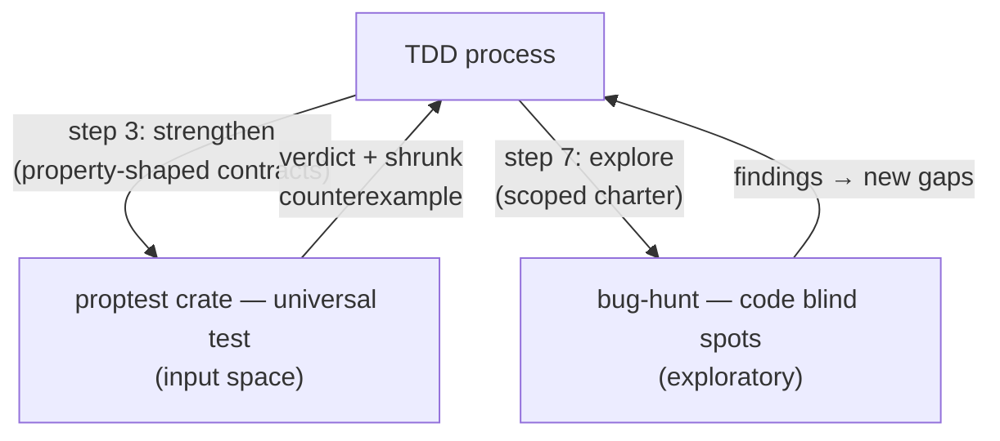

# Tdd

Test-driven development with red-green-refactor loop, code-anchored testing with Dublin Core + PKO ontology, and gap analysis. Builds features or fixes bugs one vertical slice at a time. Enforces behavior testing through public interfaces, code entity anchoring via dcterms:identifier tags, anti-horizontal-slicing, and minimal-implementation discipline. Five MDS categories: domain, composition, trust, lifecycle, curation.

## When to Use

- Planning a TDD cycle before any code is written — using `grep` to find entities in scope, classifying them with Dublin Core (dcterms:type, dcterms:identifier, dcterms:subject), identifying public interfaces, and prioritizing by risk.
- Writing a single tracer bullet: one contract for one behavior, one failing test verifying the contract, then minimal implementation to satisfy it — contract-first, vertical-slice discipline.
- Refactoring while all tests are GREEN — extracting duplication, deepening modules, strengthening contracts, and applying SOLID principles while preserving contract metadata and verifying tests pass after each step.
- Verifying TDD cycle completion — checking all tests pass, clippy is clean, no `todo!()`/`unimplemented!()` stubs remain, contract structure is complete, and code entity anchoring is intact.
- Performing code gap analysis — comparing code entities against tested behaviors, scoring expectation quality (0–3), cross-referencing goal-principle alignment against MDS categories derived from code position, and producing deferral recommendations for `OPEN_QUESTIONS.md`.
- Strengthening a GREEN tracer bullet — writing the universal test that verifies a contract's `post:`/`inv:` across the full input space with the proptest crate directly (a property-test fail is a second source of RED routing back to the tracer or plan).
- Exploring for code blind spots — dispatching to the `bug-hunt` skill with a charter scoped to the slice's code, finding bugs the code structure never surfaced and routing them back as new entities needing tests.

## Instructions

### tdd-plan

: Read `docs/architecture/core/MDS.md` for the relevant domain before planning any test.
2. Use `grep` to find the entities (functions, structs, traits) in scope. Classify each using Dublin Core: `dcterms:type` = SymbolKind, `dcterms:identifier` = qualified name, `dcterms:source` = file:line, `dcterms:subject` = MDS category DERIVED from the entity's code position (what crate/module it's in), not looked up from a spec. Use `grep` to find callers (search for the function/type name across the codebase) to understand what depends on each entity.
3. Author the `expect:` + `[P{N}]` contract annotation manually for each requirement (the contract-generator is not yet implemented; follow the contract structure in MDS.md §7).
4. Review each contract — the `expect:` field is the ground truth for what the test verifies.
5. Only proceed to write tests after the contract passes quality scoring (≥2).
6. For each requirement in scope, identify the `user_expectation` (verbal, user's voice), the `goal_principle` (exactly one of P1–P12), and `constraining_principles` (zero to many).
7. List specific observable behaviors testable through a public interface; classify each as `unit`, `integration`, `contract`, `fuzz`, or `system`.
8. Describe the public interface changes needed (new, modified, or removed items).
9. Rank behaviors by risk: P0 = security/correctness-critical (Trust), P1 = correctness (Domain, Composition), P2 = ergonomics (Lifecycle, Curation).
10. List every assumption with confidence (high/medium/low) and the alternative interpretation.
11. Do NOT write any code — this is planning only.
12. If `surviving_mutants` is provided (e.g. from an operator-supplied mutation-testing report), prioritize functions with surviving mutants — plan a tracer bullet (and a step-3 universal property test) for each under-tested function.
13. Emit a `risk_profile` output: `highest_priority` (P0 > P1 > P2 — the most severe priority in the slice), `touches_trust` (true when any behavior is P0 / Trust), `trust_behaviors` (the P0 behavior descriptions). This drives step 7 (explore) to dispatch to `bug-hunt` on Trust code even when code coverage looks complete — Trust code has the highest cost of failure and warrants exploratory testing regardless of code coverage.

### tdd-tracer

1. Write ONE contract for ONE behavior, then ONE failing test verifying the contract, then the minimal implementation to satisfy the contract — contract-first ordering: (1) Contract → (2) Test → (3) Implementation.
2. Author the contract as a `///` doc-comment on the function signature with all layers: `expect:` (verbal, user's voice), `[P{N}] Motivating:` (exactly one goal principle), `pre:`/`post:` (behavioral specification), `inv:` (optional, for types), and `[P{N}] Constraining:` (zero to many; minimum all applicable Magna Carta P1–P4).
3. Select the goal principle whose user-visible guarantee the contract directly serves; if multiple apply, choose the most directly exercised.
4. Determine constraining principle applicability by asking: "Would implementing this contract without respecting this principle violate it?" If yes, annotate it.
5. Write the test — it must fail (RED). Verify preconditions via `prop_assume!` and assert postconditions via `prop_assert!`.
6. Carry a descriptive doc comment on the test function referencing the contract's `expect:` statement.
7. Write the minimal implementation to satisfy the contract (GREEN) — no speculative features, no extra error handling for impossible scenarios.
8. Test through the public interface (the declared seam) only; do not test private methods or internal state.
9. For fuzz tests, accept all inputs with no `prop_assume!` filtering and verify panic-freedom via `catch_unwind`.
10. For system tests, exercise the full vertical slice end-to-end through its public seams (construct real stores/drivers; prefer in-memory drivers over mocks).

### tdd-strengthen

1. Receive the contract + `oracle_type` from the tracer bullet (step 2 is GREEN).
2. Decide whether a universal property test is warranted: only for property-shaped contracts (`reference` or `invariant` oracle — `post:`/`inv:` spans an input space). Skip cleanly for `hardcoded` (fixed-value) contracts.
3. Write the universal test with the proptest crate directly (TDD can run tests). Pass the contract's `post:`/`inv:` as the property and the oracle type.
4. Collect the property test's verdict: `pass`, `fail` (with shrunk counterexample), `inconclusive`, or `skipped`.
5. Route: `pass` → proceed to refactor; `fail` with a real bug → `retracer` (fix the impl — the contract is correct); `fail` with a wrong contract → `replan` (revise the contract — contract evolution requiring P2 consent); `inconclusive` → `retracer` (fix the test setup, treat as RED).
6. The universal test uses a programmatic oracle — a reference implementation comparison for `reference` contracts, an invariant predicate for `inv:`/`prob:` contracts (not hardcoded `prop_assert_eq!` value comparisons) — so the property scales across the input space.
7. Do NOT replace the representative test from step 2 — the universal test complements it.

### tdd-refactor

1. Confirm all tests pass (GREEN) before refactoring — never refactor while RED.
2. Identify refactor candidates: extract duplication, deepen modules, strengthen contracts (weaken preconditions, strengthen postconditions, add invariants), apply SOLID where it improves locality, reduce public surface.
3. Execute one refactor step at a time; run `cargo test -p <crate>` after each step.
4. Never change behavior — if tests break, revert.
5. Never add features — refactoring changes structure, not behavior.
6. Preserve all contract layers (`expect:`, `[P{N}] Motivating:`, `[P{N}] Constraining:`, `pre:`/`post:`) during refactoring; contract metadata must travel with the function when moved or renamed.
7. When merging functions sharing a goal principle, merge their contracts — preserve the goal, union the constraints. When splitting a function, each new function gets a complete contract with all layers.
8. Evolve contracts when facts justify it: update the contract annotation on the function signature and verify with existing tests. If tests fail under a stricter contract, treat it as a new tracer bullet, not a refactor.
9. After each step, run `grep -rn "/// expect:" crates/ --include="*.rs" | wc -l` and `grep -rn "/// \[P[0-9]*\]" crates/ --include="*.rs" | wc -l`; compare against pre-refactor counts — any decrease means contract metadata was lost; revert.
10. Flag contract evolution requiring P2 consent (changed `expect:` or goal principle) with `severity: high` and do not merge without human approval.

### tdd-verify

1. Verify each test describes behavior, not implementation, and uses the public interface (seam) only.
2. Confirm each test would survive an internal refactor and that no horizontal slicing occurred.
3. Classify implementation-coupled tests carrying `// TEST-DEBT:` comments as medium-severity test-debt, not violations.
: Verify each test carries a contract annotation (`expect:` + `[P{N}]`) anchored to a valid code entity (`dcterms:identifier`).
5. Confirm no code entity in scope is missing a tracer bullet.
6. Verify every contract carries the full structure: `expect:` field present, `[P{N}] Motivating:` present (exactly one), `[P{N}] Constraining:` annotations present (minimum P1–P4 where applicable), `pre:`/`post:` present.
7. Reject vacuous `expect:` fields that restate the function name or the postcondition verbatim — the `expect:` must express what the user needs.
8. Cross-check the contract's `[P{N}]` goal principle against the MDS category default; flag mismatches requiring rationale.
9. Validate semantic alignment between `expect:` natural language and `pre:`/`post:` formal specification — check for ambiguity, contradiction, and vacuous equivalence.
10. Confirm no `todo!()` or `unimplemented!()` stubs exist.
11. Run `cargo test -p <crate>`, `cargo clippy -p <crate> -- -D warnings`, and `cargo check -p <crate>`.
12. Emit `reg.contract.violated` spans for missing `expect:` (critical), missing `[P{N}] Motivating:` (critical), missing `[P{N}] Constraining:` when Magna Carta applies (high), and expectation-postcondition mismatches.

### tdd-gap-check

: Match each tested behavior to a code entity via its contract annotation (`expect:` + `[P{N}]` anchored to `dcterms:identifier`); flag behaviors without annotations as unanchored.
2. Identify gaps: code entities with no matching tested behavior.
3. Derive priority from MDS category: P0 = Trust, P1 = Domain/Composition, P2 = Lifecycle/Curation.
: For code entities with no callers (found via `grep`), flag as additional gaps — orphaned code is untested code.
5. Verify probabilistic contracts governing non-deterministic behavior include a `prob:` field; absence is a coverage gap.
6. Score each contract's `expect:` field on a 0–3 scale: 0 = empty/missing, 1 = vacuous, 2 = functional, 3 = anchored with principle rationale. Contracts scoring 0 or 1 must appear as gaps.
: Verify the `[P{N}]` goal principle matches the entity's MDS category (`dcterms:subject` derived from graph position); correct mismatches.
8. Check constraining principle completeness: for each of P1–P12, ask whether implementing the contract without that principle would violate it; if yes and it is missing, flag as a gap.
9. Verify each `[P{N}]` Constraining annotation has an enforcement test; declarative-only constraints are coverage gaps.
: Cross-reference MDS category alignment: confirm the contract's goal principle matches the MDS category derived from the code entity's position; flag deviations with rationale.
11. Check Magna Carta completeness: list which of P1–P4 are missing from constraining annotations per covered requirement.
: Ensure every code entity appears in exactly one of: `covered_entities`, `gaps`, or `deferrals`.
13. P0 gaps MUST recommend `tracer-bullet`; P1 gaps SHOULD recommend `tracer-bullet` (deferrals require explicit rationale); P2+ gaps MAY defer to `OPEN_QUESTIONS.md`.
14. If `bug_hunt_findings` is provided, each Tier-1 BUG not covered by a tested behavior is a code blind spot — a new gap whose `requirement` is the finding's `summary`.
15. If `surviving_mutants` is provided, each mutant on a tested function is a gap — the universal test is missing or weak; recommend a universal property test (step 3 strengthen).

### tdd-explore

1. Receive the crate scope, risk profile (from plan), gaps (from gap-check), and tested behaviors.
2. Decide whether to dispatch to `bug-hunt`: only when coverage is thin (coverage < 0.70 or unresolved P0/P1 gaps) OR the slice touches Trust (P0) code. Do not run a full expedition on every low-risk slice.
3. Dispatch to the `bug-hunt` skill with a charter scoped to the slice's code (`charter_focus`: code blind spots — behaviors the code structure did not surface).
4. Collect bug-hunt's findings (each cites file:line with verbatim evidence — bug-hunt's no-fiction rule).
5. Classify each finding: a Tier-1 BUG not covered by an existing tracer bullet is a new gap (code blind spot) → route to `replan`; a BUG covered by an existing test means the test is weak → route to `replan` (strengthen with a universal property test); P2 findings may defer.
6. Route: any P0/P1 new gaps → `replan` (findings become new code entities → new tracer bullets); P2-only or no new gaps → `converge`.
7. Do NOT fabricate findings — only report what bug-hunt actually discovered. If bug-hunt returns no findings, route to `converge`.

## Registry Templates

| Template | Purpose |
|----------|---------|
| `tdd-plan.j2` | Plan a TDD cycle: use `grep` to find entities with Dublin Core classification with goal-principle anchoring (each requirement names its P{N} principle), identify public interfaces, classify behaviors by MDS category with default goal-principle mapping, prioritize by risk (P0-P2+), and get user approval before writing any code. |
| `tdd-tracer.j2` | Execute a tracer bullet: write ONE failing test for ONE behavior anchored to a code entity AND goal principle via expect: field with [P{N}] tag (per PRINCIPLES.md §1.6). Contract-first: full v0.28.0 structure with expect:, [P{N}] Constraining: annotations, and pre:/post:. Then minimal code to satisfy the contract. |
| `tdd-strengthen.j2` | Strengthen a GREEN tracer bullet by writing the universal property test (proptest crate) that verifies the contract's post:/inv: across the full input space. Uses programmatic oracles — reference-implementation comparison or invariant predicate. A property-test fail is a second source of RED routing back to the tracer (impl wrong) or the plan (contract wrong). Skips cleanly for hardcoded (fixed-value) contracts. |
| `tdd-refactor.j2` | Refactor while GREEN: extract duplication, deepen modules, apply SOLID principles. Preserve full v0.28.0 contract structure (expect:, [P{N}] Constraining:, pre:/post:) during refactoring. Contract metadata must travel with the function (Rule 6bis). Post-refactor grep verification for expect: and [P{N}] annotations (Rule 8bis). Flag contract evolution requiring P2 consent. Verify tests still pass after each refactor step. |
| `tdd-verify.j2` | Verify TDD cycle completion: all tests pass, clippy clean, no todo!/unimplemented! stubs. Contract completeness audit including expect: user expectation, [P{N}] goal-principle anchoring, and [P{N}] Constraining: annotations per v0.28.0 extended syntax. Emits reg.contract.violated spans for missing/malformed contracts. Tests describe behavior not implementation, code entity anchoring via dcterms:identifier tags, functional coverage gaps identified. Runs `cargo test`/`./script/clippy` so results are operator-visible. |
| `tdd-explore.j2` | Explore for code blind spots by dispatching to the bug-hunt skill with a charter scoped to the slice's code. bug-hunt finds bugs the spec did not name (Weinberg: absent tests = quality threat). Findings not covered by an existing tracer bullet become new code entities routing back to the plan. Dispatches only when coverage is thin OR the slice touches Trust (P0) code — not on every low-risk slice. |
| `tdd-gap-check.j2` | Code gap analysis: compare code entities against tested behaviors including goal-principle alignment cross-reference against MDS category defaults, constraining principle completeness (Magna Carta P1-P4), and expectation quality scoring (0-3 scale). Identify uncovered requirements (gaps) and produce deferral recommendations for OPEN_QUESTIONS.md. P0 gaps MUST have tracer bullets. |

To render a template, call the `render_template` tool with the template ref (e.g., `essentialist/essentialist-flow`) and a context object with the required variables.

## Constraints

- `tdd-plan.j2`: Public. Planning only — do not write code in this phase.
- `tdd-tracer.j2`: Public. Contract-first ordering: Contract → Test → Implementation. Test through public interface only. Minimal implementation — no speculative features. Selects `oracle_type` (hardcoded/reference/invariant) driving step 3.
- `tdd-strengthen.j2`: Public. Writes a universal property test ONLY for property-shaped contracts (reference/invariant oracle). Skips cleanly for hardcoded. A property-test fail is RED — routes back to tracer or plan: if the step result's `routing` field says to jump, re-enter the cycle at the target step.
- `tdd-refactor.j2`: Public. Never refactor while RED. Never change behavior. Preserve all contract layers during refactoring. Post-refactor grep verification for contract metadata.
- `tdd-verify.j2`: Public. Runs the crate's tests and clippy (`cargo test`, `./script/clippy`). Emit `reg.contract.violated` spans for missing/malformed contracts. Reject vacuous `expect:` fields. A property-test `fail` verdict forces `all_tests_pass: false`.
- `tdd-gap-check.j2`: Public. Every requirement in exactly one of: covered, gaps, deferrals. P0 gaps MUST recommend tracer-bullet. Consumes bug-hunt findings + surviving mutants as additional gap sources when provided.
- `tdd-explore.j2`: Public. Dispatches to bug-hunt ONLY when coverage is thin OR slice touches Trust (P0). Findings must cite file:line (no-fiction). P0/P1 new gaps route to replan: re-enter the cycle at the plan step; P2 may defer.
- This SKILL.md body is the authoritative methodology. Jinja2 templates in the registry are structured reference versions of the same content.

## Relationship to Other Skills

TDD is the **spec-driven conductor** of the testing-skill DAG. It keeps its
contract-first, one-behavior, fast-green discipline and orchestrates the other
testing skills as delegates at specific phases of its red-green-refactor loop.

- **proptest (crate)**: per-function property test generator. TDD writes the
  universal test with the proptest crate directly at step 3 (strengthen) for
  property-shaped contracts (`reference`/`invariant` oracle). The tracer (step
  2) writes the representative test (one case, fast green); strengthen writes
  the universal test (full input space). A property-test fail is a second
  source of RED feeding back into TDD's loop.
- **bug-hunt**: exploratory bug finder. TDD dispatches to bug-hunt at step 7
  (explore) when coverage is thin or the slice touches Trust (P0) code. bug-hunt
  finds code blind spots (bugs the code structure never surfaced); findings not covered by an
  existing tracer bullet become new code entities routing back to the
  plan.
- **Operator-supplied mutation reports**: `surviving_mutants` (from a prior
  mutation-testing run, e.g. `cargo-mutants`) are an optional gap source in
  step 6 (gap-check), recommending a universal property test for the
  under-tested function.

## Oracle Mapping

TDD's contract layers map onto a three-type oracle taxonomy:

| Contract layer | Oracle type | Where used |
|----------------|-------------|------------|
| `expect:` with a single fixed expected output | hardcoded | tracer representative test (step 2) — one case, fast green; TBR decays |
| `post:` (input→output guarantee, reference impl exists) | reference comparison | strengthen universal test (step 3) — scales across input space |
| `inv:` / `post:` as a predicate over (input, output) | invariant predicate | strengthen universal test (step 3) — scales best |
| `prob:` (probabilistic, non-deterministic) | invariant predicate with statistical threshold | strengthen universal test (step 3) |

The representative test (step 2) is a hardcoded oracle (one case); the
universal test (step 3) uses programmatic oracles (reference comparison /
invariant predicate) that scale with case count. Programmatic generators
scale; hardcoded I/O pairs do not (TBR decays exponentially).
