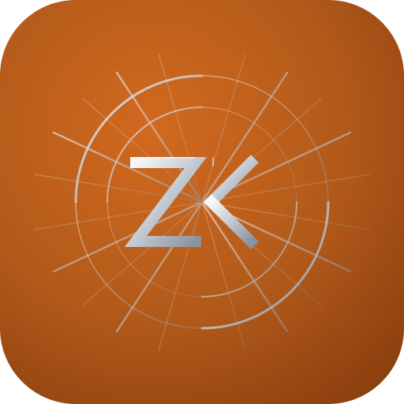

<p align="center">
  
</p>

# Zed-Kask

[](https://zed.dev)

**Zed-Kask** is a minimal-divergence fork of [Zed](https://zed.dev) with the hKask agent platform compiled in-process: one clone, one build, one CI. The editor, collaboration, and inference surfaces are Zed's. The agent platform — skills, an MCP tool fleet, a curator, steer panels, media generation, sovereign memory — is Kask's, delivered as native editor surfaces rather than a separate daemon or service.

## The contract

- **Local and single-user.** Not a cloud platform, not a hosted agent framework. There is no autonomous agent loop by default: the human is in the loop, and skills escalate _to the user_.
- **Sovereign data.** Memory, ledgers, and galleries live in local SQLCipher databases under a single passphrase held in your keychain; rotating it re-keys every database, with rollback on partial failure. External services — the Agent Bestiary World swarm catalog, RunPod inference endpoints, web research providers — are integrations you configure with your own credentials, not a host.
- **Minimal divergence.** Everything Kask lives under [`kask/`](./kask/) (additive — `git merge upstream/main` never touches it). Everything outside `kask/` is upstream Zed except the named seam edits documented in [`DIVERGENCE.md`](./DIVERGENCE.md) (D1–D39), each pinned by a test.

## What you get

### Skills

**68 agent-facing skills** execute inside the agent panel. A skill is a _process_, not a prompt: its `SKILL.md` body is injected into the conversation, and the model — the executor — self-iterates against the convergence criteria the body describes, using two built-in tools: `lisp_eval` (a sandboxed Lisp interpreter — no I/O, no network, bounded steps and depth) for deterministic checks, and `render_template` (316 seeded Jinja2 templates across 64 crates) for structured prompt scaffolding.

Shipped skills are seeded **once** to the global skills directory (`~/.local/share/zed-kask/skills/`); the disk copy is the runtime source of truth, and your edits take effect immediately without recompilation. The 23 **core skills** (quality gates, curator methodologies, skill authoring) are the exception: always-on, re-seeded on every startup, and locked against editing — a hand edit can never silently weaken a gate. See [`kask/docs/reference/skills/README.md`](./kask/docs/reference/skills/README.md) for the registry and [`kask/docs/diataxis/`](./kask/docs/diataxis/) for per-crate explanations.

### The Curator

The **Curator** is a native in-process agent — an `Agent::Curator` variant selectable alongside the Zed coding agent in the Agent Panel. It is the system's cybernetic regulator, not an autonomous agent: a background loop (sense→compare→compute→act) monitors regulation health and memory, raises algedonic alerts when the system drifts, and escalates _to the user_ rather than acting on its own. It carries its own sovereign memory store and gets all coding capabilities plus regulatory context and tools.

### Steer panels

Four native panels extend the steering surface. The **swarm panel** composes and steers local agent swarms (agent cards, hiring, PSO/ACO/flocking parameters); the **kanban panel** drives kata-kanban task boards; the **portfolio** and **media** panels are Steer-only — chat-driven CRUD over the scoped server's tools instead of hand-written management forms. Any of them can take the steering seat of an agent conversation via a per-context system-prompt overlay scoped to exactly one MCP server, with the advertised tool list mechanically verified against the server's generated tool names — a rename degrades loudly at dispatch, not silently.

### Media generation

The `media` MCP server is the fleet's second largest (67 tools): image and video generation, voice synthesis, transcription, face recognition, and a persistent gallery. The **media panel** is a Steer-only surface — no browse forms — where the operator asks a scoped curator conversation to generate, search, organize, or transform media, and generated images and videos render **inline in the conversation** via the editor's media block renderer.

### MCP servers

**11 built-in MCP servers** (**362 registered tools** fleet-wide) are launched by zed's `context_server` host as child processes over stdio and exposed as agent tools through `rmcp`. Each is a thin surface over in-process domain crates — the binary entrypoint is a one-line wrapper around a library `run()`. The fleet:

| Server                 | Surface                                                       |
| ---------------------- | ------------------------------------------------------------- |
| `companies`            | FIBO-anchored valuation, forecasting, portfolio ledger         |
| `corpus`               | Gather→process→output document pipeline                        |
| `curator`              | Curator-scoped memory and regulation surfaces                 |
| `kata-kanban`          | Kata-driven task kanban with idempotent creates               |
| `media`                | AI media generation (image, video, audio, gallery)             |
| `portfolio`            | Transaction-ledger portfolio store with holdings/returns views |
| `prediction-markets`   | Polymarket/Kalshi base rates, calibration, residuals          |
| `research`             | Web search, extraction, browsing, RSS feeds                    |
| `scenarios`            | Event-tree forecasting (Tetlock/Schwartz/Chermack)            |
| `swarm`                | ABW cloud swarms + local swarm substrate + Xaman Ek curator   |
| `training`             | LoRA/QLoRA training pipeline (dataset, submit, validate)      |

Companies, scenarios, and prediction-markets form a three-layer forecasting stack (see [`kask/docs/reference/mcp-servers/README.md`](./kask/docs/reference/mcp-servers/README.md) for the full registry and architecture). The `curator` server may be unloaded by default — the Curator ships as a native agent.

## Installation

### Source build (Linux, requires Rust toolchain)

There are no prebuilt binaries yet — Zed-Kask is built from source. The installer clones the repo at a pinned tag, installs system dependencies via `script/linux`, builds `zed-kask` and all `hkask-mcp-*` MCP server binaries with `cargo`, and installs them to `~/.local/bin`:

```bash
curl -fsSL https://raw.githubusercontent.com/mdz-axo/zed-kask/main/kask/scripts/build/install.sh | bash
```

Verify the install:

```bash
zed-kask --help
ls ~/.local/bin/hkask-mcp-*
```

If `~/.local/bin` is not on your `PATH`, start a new shell or:

```bash
export PATH="$HOME/.local/bin:$PATH"
```

Environment variables the installer honors:

| Variable                 | Default                          | Purpose                                                         |
| ------------------------ | -------------------------------- | --------------------------------------------------------------- |
| `HKASK_VERSION`          | derived from workspace `Cargo.toml` (or `0.39.0`) | Pin a release tag (e.g. `0.233.10`)                  |
| `HKASK_BUILD_TYPE`       | `release`                        | `release` or `debug`                                            |
| `HKASK_SOURCE_DIR`       | unset                            | Use an existing checkout instead of cloning                     |
| `HKASK_REPO_URL`         | `https://github.com/mdz-axo/zed-kask.git` | Override the clone URL                                |
| `HKASK_ALLOW_FALLBACK`   | `false`                          | Set to `true` to fall back to `main` if the tag is missing      |
| `INSTALL_DIR`            | `$HOME/.local`                   | Install prefix; binaries land in `$INSTALL_DIR/bin`             |
| `HKASK_SYSTEM_INSTALL`   | `false`                          | Set to `true` to symlink into `/usr/local/bin`                  |
| `HKASK_REMOVE_CONFIG`    | `false`                          | Set to `true` to remove config and data on uninstall            |

Flags: `--debug` (debug build), `--skip-deps` (skip `script/linux`), `--system` (system-wide install), `--uninstall`.

An updater is installed alongside the binaries; run `update-zed-kask` (or `kask/scripts/build/update-zed-kask.sh`) to move to a newer release.

## License

Zed-Kask inherits Zed's licensing: GPL-3.0-or-later primarily, with Apache-2.0 components where marked. License information for third-party dependencies must be correctly provided for CI to pass; see [`script/licenses/zed-licenses.toml`](./script/licenses/zed-licenses.toml) and the [`cargo-about`](https://github.com/EmbarkStudios/cargo-about) configuration for details.
