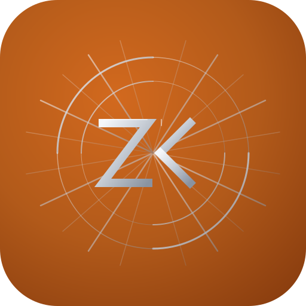

<p align="center">
  
</p>

# Zed-Kask

[](https://zed.dev)

**Zed-Kask** is a minimal-divergence fork of [Zed](https://zed.dev) with the hKask agent platform compiled in-process: one clone, one build, one CI. The editor, collaboration, and inference surfaces are Zed's. The agent platform — skills, an MCP tool fleet, a curator, steer panels, media generation, sovereign memory — is Kask's, delivered as native editor surfaces rather than a separate daemon or service.

## The contract

- **Local and single-user.** Not a cloud platform, not a hosted agent framework. There is no autonomous agent loop by default: the human is in the loop, and skills escalate _to the user_.
- **Sovereign data.** Memory, ledgers, and galleries live in local SQLCipher databases under a single passphrase held in your keychain; rotating it re-keys every database, with rollback on partial failure. External services — the Agent Bestiary World swarm catalog, RunPod inference endpoints, web research providers — are integrations you configure with your own credentials, not a host.
- **Minimal divergence.** Everything Kask lives under [`kask/`](./kask/) (additive — `git merge upstream/main` never touches it). Everything outside `kask/` is upstream Zed except the named seam edits documented in [`DIVERGENCE.md`](./DIVERGENCE.md) (D1–D85; 66 active, 19 retired), each pinned by a test. The current release is **0.40.0**, based on upstream Zed **1.23.0**.

## What you get

### Skills

**60 agent-facing skills** execute inside the agent panel. A skill is a _process_, not a prompt: its `SKILL.md` body is injected into the conversation, and the model — the executor — self-iterates against the convergence criteria the body describes, using two built-in tools: `lisp_eval` (a sandboxed Lisp interpreter — no I/O, no network, bounded steps and depth) for deterministic checks, and `render_template` (274 Jinja2 templates across 56 namespaces under [`kask/registry/templates/`](./kask/registry/templates/)) for structured prompt scaffolding.

Skills are authored in-repo under [`.agents/skills/`](./.agents/skills/) and seeded **once** to the global skills directory (`~/.local/share/zed-kask/skills/`); the disk copy is the runtime source of truth, and your edits take effect immediately without recompilation. The 14 **core skills** (quality gates, curator methodologies, task coordination) are the exception: always-on, re-seeded on every startup, locked against editing, and unshadowable by a project-local skill of the same name — a hand edit can never silently weaken a gate. See [`kask/docs/reference/skills/README.md`](./kask/docs/reference/skills/README.md) for the registry and [`kask/docs/diataxis/`](./kask/docs/diataxis/) for per-crate explanations.

### The Curator

The **Curator** is a native in-process agent — an `Agent::Curator` variant selectable alongside the Zed coding agent in the Agent Panel. It is the system's cybernetic regulator, not an autonomous agent: a background loop (sense→compare→compute→act) monitors regulation health and memory, raises algedonic alerts when the system drifts, and escalates _to the user_ rather than acting on its own. It carries its own sovereign memory store and gets all coding capabilities plus regulatory context and tools.

### Steer panels

Four native panels extend the steering surface. The **swarm panel** composes and steers local agent swarms (agent cards, hiring, PSO/ACO/flocking parameters); the **kanban panel** drives kata-kanban task boards; the **portfolio** and **media** panels are Steer-only — chat-driven CRUD over the scoped server's tools instead of hand-written management forms. Any of them can take the steering seat of an agent conversation via a per-context system-prompt overlay scoped to exactly one MCP server, with the advertised tool list mechanically verified against the server's generated tool names — a rename degrades loudly at dispatch, not silently.

### Media generation

The `media` MCP server is the fleet's largest (98 tools): image and video generation, voice synthesis, transcription, face recognition, a persistent gallery, and the educt transcript and Reduct cloud surfaces. The **media panel** is a Steer-only surface — no browse forms — where the operator asks a scoped curator conversation to generate, search, organize, or transform media, and generated images and videos render **inline in the conversation** via the editor's media block renderer.

### MCP servers

**13 built-in MCP servers** (**408 registered tools** fleet-wide, every count pinned by a test) are launched by the in-process governed `McpRuntime` (D3 — single spawn authority) as child processes over stdio and exposed as agent tools through `rmcp`. Each is a thin surface over in-process domain crates — the binary entrypoint is a one-line wrapper around a library `run()`. The fleet:

| Server               | Surface                                                       | Tools |
| -------------------- | ------------------------------------------------------------- | ----: |
| `companies`          | FIBO-anchored financial forecasting, dual-provider routing, research notes, transcripts, screener | 40 |
| `corpus`             | Gather→process→output document pipeline, QA generation, style replicas | 26 |
| `curator`            | Curator memory, regulation query, algedonic signals, skill-use reporting | 15 |
| `evolution`          | Experiment registry for the sharded evolution program: registered experiments with pre-registered predictions, variant lineages, grounded fitness, selection fossils | 6 |
| `kata-kanban`        | Toyota-Kata task boards and persistent functional goals        | 27 |
| `media`              | AI media generation (image, video, audio, gallery, educt transcripts, Reduct cloud) | 98 |
| `portfolio`          | Transaction-ledger portfolio store (stocks, prediction-event portfolios, CMP indices) with holdings/returns views | 18 |
| `prediction-markets` | Polymarket/Kalshi base rates, calibration, CMP curves and indices, residuals | 32 |
| `research`           | Web search, extraction, browsing, RSS feeds, evidence scoring, research-run ledger, paper identity | 26 |
| `scenarios`          | Event-tree forecasting (Tetlock/Schwartz/Chermack)             | 19 |
| `spreadsheet`        | LogiSheets-backed spreadsheet edits and reconciliation over immutable workbook revisions | 2 |
| `swarm`              | ABW cloud swarms + local swarm substrate + Xaman Ek curator     | 90 |
| `training`           | LoRA/QLoRA training pipeline (dataset, submit, validate, evaluate) | 9 |

Companies, scenarios, and prediction-markets form a three-layer forecasting stack (see [`kask/docs/reference/mcp-servers/README.md`](./kask/docs/reference/mcp-servers/README.md) for the full registry, architecture, and per-server count pins). All thirteen servers auto-load by default (`load_default: true`) unless the operator disables the fleet or an individual server; the Curator additionally ships as a native in-process agent.

## Installation

### Source build (Linux, requires Rust toolchain)

There are no prebuilt binaries yet — Zed-Kask is built from source. The installer clones the repo at a pinned tag, installs system dependencies via `script/linux`, builds `zed-kask` and all `hkask-mcp-*` MCP server binaries with `cargo`, and installs them to `~/.local/bin`:

```bash
curl -fsSL https://raw.githubusercontent.com/mdz-axo/zed-kask/main/kask/scripts/build/install.sh | bash
```

Verify the install:

```bash
zed-kask --help
ls ~/.local/bin/hkask-mcp-*
```

If `~/.local/bin` is not on your `PATH`, start a new shell or:

```bash
export PATH="$HOME/.local/bin:$PATH"
```

Environment variables the installer honors:

| Variable                 | Default                          | Purpose                                                         |
| ------------------------ | -------------------------------- | --------------------------------------------------------------- |
| `HKASK_VERSION`          | derived from workspace `Cargo.toml` (or `0.40.0`) | Pin a release tag (e.g. `0.40.0`)                  |
| `HKASK_BUILD_TYPE`       | `release`                        | `release` or `release-fast`                                    |
| `HKASK_SOURCE_DIR`       | unset                            | Use an existing checkout instead of cloning                     |
| `HKASK_REPO_URL`         | `https://github.com/mdz-axo/zed-kask.git` | Override the clone URL                                |
| `HKASK_ALLOW_FALLBACK`   | `false`                          | Set to `true` to fall back to `main` if the tag is missing      |
| `INSTALL_DIR`            | `$HOME/.local`                   | Install prefix; binaries land in `$INSTALL_DIR/bin`             |
| `HKASK_SYSTEM_INSTALL`   | `false`                          | Set to `true` to symlink into `/usr/local/bin`                  |
| `HKASK_REMOVE_CONFIG`    | `false`                          | Set to `true` to remove config and data on uninstall            |

Flags: `--fast` (release-fast build — parity flags, no LTO), `--skip-deps` (skip `script/linux`), `--system` (system-wide install), `--uninstall`.

An updater is installed alongside the binaries; run `update-zed-kask` (or `kask/scripts/build/update-zed-kask.sh`) to move to a newer release.

## License

Zed-Kask inherits Zed's licensing: GPL-3.0-or-later primarily, with Apache-2.0 components where marked. License information for third-party dependencies must be correctly provided for CI to pass; see [`script/licenses/zed-licenses.toml`](./script/licenses/zed-licenses.toml) and the [`cargo-about`](https://github.com/EmbarkStudios/cargo-about) configuration for details.
