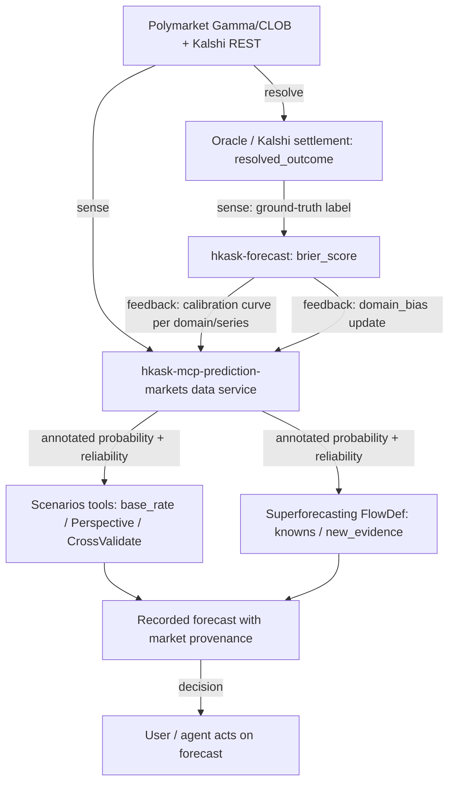

# Prediction Markets → zed-kask: Integration Report

**Audience:** zed-kask forecasting/scenario integration
**Date:** 2026-08-04
**Companion to:** `01-prediction-markets-research.md` (research), `tasks/plan.md` (implementation plan)
**Grounding:** Codebase findings verified by a read-only exploration of `kask/mcp-servers/hkask-mcp-scenarios`, `kask/registry/templates/superforecasting`, `kask/registry/templates/scenario-builder`, `kask/crates/kask_bridge/src/mcp_servers.rs`, `kask/crates/hkask-mcp-server`, `kask/crates/hkask-forecast`.

---

## 1. The integration premise (one sentence)

Integrate prediction-market data as a **new, dedicated, read-only MCP data-service server** (`hkask-mcp-prediction-markets`) that exposes Polymarket (Gamma/CLOB) and Kalshi (Predictions REST) as a unified `{event, market-implied probability, reliability covariates, calibration history, resolution outcome}` feed, consumed by the existing `hkask-mcp-scenarios` tools and the `superforecasting` skill cascade — _without_ adding HTTP to the pure-compute scenarios server.

This premise is the output of the adversarial test in the research report (§4): it is a **conditional, annotated data service**, not a face-value probability injection.

---

## 2. Why a separate server (essentialist deletion test + deep-module)

The scenarios server (`hkask-mcp-scenarios`) is **pure computation**: no `reqwest` dep, no HTTP client, all external data is supplied by the caller as JSON (research text, events, base rates). Its `Cargo.toml` has no network crate. Its 18 tools (`scenario_status`, `scenario_frame`, `scenario_brainstorm`, `scenario_quantify`, `scenario_calibrate`, `scenario_cross_validate`, `scenario_synthesize`, etc.) are wrapped in `execute_tool_semantic` and operate on caller-supplied inputs.

**Deletion test (G1):** If we delete "a new prediction-markets server" and instead add `reqwest` + market fetching _inside_ the scenarios server, complexity reappears — we couple a clean pure-compute module to network IO, credentials, caching, and rate limits, and we violate its current single-responsibility shape. The complexity does not vanish; it relocates and worsens the scenarios module's cohesion. → The separate server **earns its existence**.

**Surface test (G2):** A dedicated server exposes a small surface (≤7 tools) and is consumed through the _existing_ scenarios tools' input fields (`base_rate`, `Perspective{source,probability}`, `CrossValidateRequest{source_b,estimate_b}`). The scenarios server already has a cross-server bridge precedent: `scenario_from_companies` consumes JSON from the `companies` MCP server. A `scenario_from_markets`-style consumption (or caller-mediated passing) mirrors it exactly.

**Deep-module test:** The new server is _deep_ — narrow interface (a handful of lookup/search/calibration tools), rich implementation (two HTTP providers, a relational cache, continuous sync, calibration math reusing `hkask-forecast`). High benefit/cost ratio.

**Rejected alternative (recorded):** "Just teach the agent to `fetch` the Polymarket/Kalshi URLs itself." Rejected because (a) the agent has no structured schema contract for market data — it would paste free-text into `research_text`, losing the quantitative, falsifiable, Brier-scored shape that is the _whole point_; (b) no caching/rate-limit control; (c) no calibration-history persistence. The MCP server gives a typed, governed, cacheable, auditable seam.

---

## 3. Exact seams (file:line, verified)

| Seam                                            | Location                                                                                                                                                                                                 | What attaches here                                                                                                                                                                       |
| ----------------------------------------------- | -------------------------------------------------------------------------------------------------------------------------------------------------------------------------------------------------------- | ---------------------------------------------------------------------------------------------------------------------------------------------------------------------------------------- | ----------------------------------------------------------- |
| New server registration                         | `kask/crates/kask_bridge/src/mcp_servers.rs` (`BUILT_IN_MCP_SERVERS`, scenarios entry at ~L219)                                                                                                          | Add `BuiltinMcpServer { id: "prediction-markets", binary: "hkask-mcp-prediction-markets", credentials: Some(&[]), config_env: Some(&["HKASK_PREDICTION_MARKETS_CACHE_TTL_SECS", ...]) }` |
| HTTP client pattern                             | `kask/mcp-servers/hkask-mcp-research/src/research/providers/mod.rs:36` (`provider_http_client()`) + `kask/crates/hkask-mcp-server/src/server/http_helpers.rs:35,74` (`classify_http_error`, `api_get`)   | Reuse shared helpers; per-provider `reqwest::Client` + key from env at construction                                                                                                      |
| Tool scaffolding                                | `kask/crates/hkask-mcp-server/src/hkask_mcp_server.rs:134` (`mcp_server!` macro) + `hkask_mcp_scenarios.rs:388,1843` (`#[tool]` + `Parameters<Req>` + `execute_tool_semantic`)                           | New `prediction-markets` server struct + `#[tool]` methods; `AnyJsonValue` for arbitrary JSON (never `serde_json::Value`)                                                                |
| Forecasting math reuse                          | `kask/crates/hkask-forecast/src/hkask_forecast.rs` (`brier_score`, `calibrate_from_fermi`, `outside_view_adjustment`, `bayesian_update`, `marginalize`, `certainty_tier`)                                | Compute market Brier from resolved outcome vs probability-at-horizon; reuse, do not re-implement                                                                                         |
| Scenarios server consumption (zero-edit option) | `kask/mcp-servers/hkask-mcp-scenarios/src/types.rs:225` (`ScenarioEvent.basis`/`base_rate`), `:306` (`Perspective.source`/`probability`), `hkask_mcp_scenarios.rs:155` (`CrossValidateRequest.source_b`) | Caller passes market data as `base_rate` or `Perspective{source:"polymarket"                                                                                                             | "kalshi", probability}`or`CrossValidate{source_b:"market"}` |
| Superforecasting skill consumption              | `kask/registry/templates/superforecasting/stage_2_outside_view.j2:7` (`knowns`), `stage_4_evidence_update.j2:8` (`new_evidence`) + FlowDef `kask/registry/manifests/superforecasting.yaml`               | Inject market prices as `knowns` (stage 2 outside-view anchor) and `new_evidence` (stage 4 Bayesian update) via cascade context                                                          |
| Scenario-builder skill (weaker)                 | `kask/registry/templates/scenario-builder/driving-forces.j2:5` (`key_forces`)                                                                                                                            | Pre-weight `key_forces` with market probabilities upstream in FlowDef context                                                                                                            |

**Critical absence (verified):** No `kalshi`, `polymarket`, or `prediction_market` references exist anywhere in the codebase. This is **greenfield** — no existing feed to extend, only the forecasting math/engine to feed into.

---

## 4. The data-service output contract (the interface that earns its depth)

Every market record the server returns carries the annotation the research report (§4) demands. This is the load-bearing design decision — the contract _prevents_ the face-value anti-pattern by construction.

```jsonc
{
  "source": "polymarket" | "kalshi",
  "event_id": "...", "market_id": "...",
  "question": "...", "description": "...",
  "category": "politics" | "economics" | "sports" | "crypto" | ...,
  "series": "...",            // Kalshi series ticker / Polymarket series slug — the reference class
  "deadline": "2026-11-04T...",
  "probability": 0.62,        // market-implied (mid, or last-trade; Kalshi: from forecast-percentile-history)
  "probability_method": "mid" | "last_trade" | "kalshi_percentile_history" | "reconstructed_bucket",
  "spread": 0.015,            // bid/ask — reliability (2607.08199)
  "volume": 1234567.0,         // reliability + horizon covariate
  "liquidity": 98765.0,       // reliability
  "open_interest": 4321,     // Kalshi only
  "last_update": "2026-08-04T...",
  "volatility": {              // 2607.08199 — variance structure, computed from price_history
    "realized_variance": 0.0021,     // variance of price deltas over the window
    "structural_flag": "none" | "near_deadline" | "near_coinflip" | "near_deadline_and_coinflip",
    "interpretation": "high" | "medium" | "low"   // derived: expected price instability
  },
  "status": "open" | "closed" | "settled" | "resolved",
  "resolved_outcome": null | "yes" | "no" | 1 | 0,
  "resolution_source": "uma_oracle" | "kalshi_exchange" | ...,
  "price_history": [ {"t":"...","p":0.60}, ... ],   // for Bayesian revision (2601.18815)
  "ontology": {                // dual-axis mapping, passed through to every consumer
    "process": {             // PKO axis — the market as an executed procedure
      "type": "pko:ProcedureExecution",
      "stage": "creation|trading|oracle_request|proposal|dispute|settlement",  // 2604.20421 lifecycle
      "probability_role": "pko:StepExecution.output"   // each price tick is an execution artifact
    },
    "state": {               // Dublin Core axis — the record as an information resource
      "identifier": "polymarket:0x1234...",       // dcterms:identifier = {source}:{market_id}
      "title": "...",                             // dcterms:title ← question
      "description": "...",                       // dcterms:description
      "temporal": "2026-11-04T...",               // dcterms:temporal ← deadline (horizon)
      "provenance": "uma_oracle|kalshi_exchange"  // dcterms:provenance ← resolution_source
    },
    "mapping_version": "1"   // lets consumers detect mapping evolution
  },
  "calibration": {
    "brier": 0.093,            // computed over resolved markets in this series/category (2604.20421 oracle layer)
    "domain_bias": "underconfident",  // 2602.19520 — politics compresses toward 0.5
    "sample_size": 87,
    "stale": false
  },
  "reliability_tier": "high" | "medium" | "low"  // derived gate: volume>threshold AND spread<threshold AND not stale
}
```

**Design rules encoded in the contract (from the research report's constraint-force ranking):**

1. **Guardrail — never return a bare probability.** Every `probability` is paired with `spread`, `volume`, `last_update`, `calibration`, and `reliability_tier`. A consumer that ignores the annotation is _choosing_ to be naive; the contract does not let it be naive by default.
2. **Guardrail — politics bias is surfaced.** `calibration.domain_bias` carries the 2602.19520 finding so the consumer can apply domain-aware correction rather than face-value ingestion.
3. **Guideline — prefer Kalshi percentile-history.** `probability_method` records provenance; `kalshi_percentile_history` is a stronger signal than `reconstructed_bucket` (which itself is a known approximation per 2604.20421 §6.2).
4. **Cybernetic guardrail — `calibration.stale` ≠ `calibration.brier = 0`.** A read failure propagates `stale: true`, never a synthetic 0 (the `.rules` "unwrap_or(0) on regulation sense inputs" trap generalized to the market-calibration signal).
5. **Guideline — every record carries its dual-axis ontology mapping.** The `ontology.process` (PKO) block types the market as a `pko:ProcedureExecution` in one of 2604.20421's six lifecycle stages; the `ontology.state` (Dublin Core) block types the record as an information resource with `dcterms:identifier/title/description/temporal/provenance`. Consumers (scenarios, superforecasting FlowDef, future skills) receive the mapping _with_ the data, so downstream provenance and stage-aware reasoning (e.g. distrust prices in `dispute` stage per 2604.20421's oracle-risk finding) need no re-derivation. The `dcterms:provenance` value makes the UMA-vs-Kalshi trust distinction machine-checkable for the T10 calibration loop.
6. **Guideline — volatility is a first-class annotation, not raw covariates only.** `volatility.realized_variance` is computed from `price_history` deltas; `volatility.structural_flag` encodes 2607.08199's two structural findings (volatility rises near the deadline and near 0.50 prices). Consumers get an interpretable stability signal without re-implementing the math.

---

## 5. How each consumer uses the feed

### 5.1 `hkask-mcp-scenarios` (zero server edit, caller-mediated)

The scenarios server needs **no code change** for Phase 1. The agent (or a thin orchestrator) calls the new prediction-markets server, then passes results into existing tools:

- **Outside-view base rate:** market `probability` (gated by `reliability_tier`) → `ScenarioEvent.base_rate` (`types.rs:225`) and `Perspective { source: "polymarket"/"kalshi", probability, historical_brier }` (`types.rs:306`). The `scenario_synthesize` dragonfly-eye aggregation already supports multiple `Perspective`s — a market perspective slots in alongside an LLM-generated one.
- **Cross-validation:** `scenario_cross_validate` with `CrossValidateRequest { source_a: "llm_forecast", source_b: "market", ... }` (`hkask_mcp_scenarios.rs:155`) computes divergence between our forecast and the market — _the_ quantitative check the user asked for.
- **Resolution tracking / Brier:** resolved market outcomes feed `StoredForecastRecord` (`types.rs:347`) and `CalibrationCurve` (`types.rs:366`) so the scenarios server's own calibration loop incorporates market-anchored forecasts.

**Optional Phase-2+ server-native bridge:** a `scenario_from_markets` tool mirroring `scenario_from_companies` (`hkask_mcp_scenarios.rs:598`, request at L125). This _does_ edit the scenarios server, but only to add a thin consumer that calls the prediction-markets server and returns the same `ScenarioEvent` JSON — no `reqwest` in the scenarios crate (it calls the prediction-markets MCP server over the in-process tool boundary, like `scenario_from_companies` calls companies). Defer to Phase 2 to keep Phase 1 a pure addition.

### 5.2 `superforecasting` skill (FlowDef context injection)

The skill's templates are **sandboxed Jinja2 with no network access** (verified: `driving-forces.j2:127–130` forbids arbitrary code/network). All external data must be injected as `contract.input` fields by the FlowDef cascade orchestrator (`kask/registry/manifests/superforecasting.yaml`), populated via the `task` field per the `.rules` "Skill cascade context must carry the user's task" trap.

- **Stage 2 (outside view, `stage_2_outside_view.j2:7`):** inject the market's `probability` + `calibration` as a `known` (base-rate reference-class datum). The `series` field is the reference class the outside view anchors on — Kalshi series are purpose-built for this ("Monthly Jobs Report", etc.).
- **Stage 4 (evidence update, `stage_4_evidence_update.j2:8`):** inject each _price move_ in `price_history` as a `new_evidence` item with a likelihood ratio (from 2601.18815's inverse-problem framing). A market that moved 0.55→0.72 on high volume is strong evidence; the same move on thin volume is weak.
- **Stage 7 (record, `stage_7_record.j2`):** record the market-anchored forecast with its `source` provenance so the Brier can be computed at resolution.

This is a **FlowDef edit + cascade-context injection**, not a template-contract change. It keeps the templates sandboxed and pushes the market-awareness to the orchestrator where credentials/caching would otherwise violate the sandbox.

### 5.3 `scenario-builder` skill (weaker fit — pre-weighting only)

`scenario-builder` is qualitative (Schwartz 2×2). Its `driving-forces.j2` takes `key_forces` but no probability field. The cleanest attach is upstream context injection: pre-weight/rank `key_forces` by market probabilities (e.g., a Kalshi recession market informs the "Economy" STEEP force's uncertainty). This is lower-value than the superforecasting path and is **deferred** to a later phase.

### 5.4 Event ↔ market entity resolution (the matching problem)

A market is only useful to a scenario if the two refer to the _same_ underlying event. `market_lookup` is a text search; the load-bearing operation is **matching**: given a `ScenarioEvent.question` (or a superforecasting `forecasting_question`), find the market(s) about the same event with a match confidence. Without a mechanical matcher, the agent improvises the mapping per-invocation — the exact place errors enter (a market about a _different_ Fed meeting, a _different_ election cycle). The matcher is a data-service tool (`market_match`), not consumer logic: it owns question normalization, deadline alignment, and candidate ranking, and returns confidence-tiered candidates so the consumer can refuse low-confidence matches (same epistemic posture as `reliability_tier`).

### 5.5 Persistence: the "event base" question (OUGHT — open design decision)

The resolved-outcome store (T5) and the match history (T4c) both imply persistence. Two shapes:

- **Flat store** (SQLite/JSONL journal): markets, outcomes, calibration rows as tables/documents. Lowest weight, sufficient for Brier computation and caching. **Sufficient for Phases 1–2.**
- **Graph "event base"**: events as nodes; typed edges for _market→resolves→outcome_, _market→matches→scenario_event_, _event→parent_series→event_, _market→references→company/corpus_doc_. Earns its existence when consumers ask **relationship questions** ("which scenario events share a market anchor?", "what resolved markets are in this event's reference class?", "which companies does this market reference?") rather than lookup questions. The scenarios server already maintains event trees (`tree_cache`); companies and corpus servers have entities that interlink with markets.

**Research finding (2026-08-04, verified against GitHub):** no embedded/local Rust graph DB offers CRDT/multi-writer replication — Grafeo (Apache-2.0, pure-Rust embedded, GQL/Cypher/SPARQL + vector/BM25, 0.5.x, no CRDT), CozoDB (MPL-2.0, Datalog, SQLite backend, time-travel, pre-1.0 storage instability), SurrealDB (BSL 1.1 — license caution for an editor-shipped component, heavy footprint, consensus not CRDT), IndraDB (no query language), Kuzu (archived Oct 2025). **If CRDT sync is ever required, it must be layered above the store (automerge/yrs as substrate, graph as materialized view) — do not select a DB on CRDT claims none of them make.** Ranking for this use case: Grafeo > CozoDB > SurrealDB > IndraDB. This is a Phase-2 decision (T12), gated on the essentialist deletion test: adopt the graph only if flat-store relationship queries demonstrably reappear in consumers.

### 5.6 Deterministic statistics and the Constant Maturity Prediction (CMP) contract

**Design principle (OUGHT, elevated to Guardrail):** the data service returns _statistics_, not raw material for the LLM to derive statistics from. Any computation with a closed form or a standard algorithm must live in Rust (`hkask-forecast` or a new crate), not in a prompt. Audit of what this moves out of LLM reasoning:

| Computation                                                        | Was            | Now                                                                                                                                                                                                              |
| ------------------------------------------------------------------ | -------------- | ---------------------------------------------------------------------------------------------------------------------------------------------------------------------------------------------------------------- |
| Realized variance / structural vol flags                           | LLM (implicit) | Deterministic (T4)                                                                                                                                                                                               |
| Domain-bias correction (2602.19520 politics de-compression)        | LLM cascade    | Deterministic: `p' = 0.5 + (p − 0.5)(1 + δ_domain,horizon)` applied in the bridge before `base_rate` is returned (T13 + T8 amendment) — closes the consumer-adherence gap mechanically for the highest-risk case |
| Isotonic recalibration per domain/series                           | absent         | Deterministic fit over resolved (price, outcome) pairs (T13)                                                                                                                                                     |
| Volatility regime classification (smooth vs jump-like, 2607.08199) | absent         | Deterministic classifier over `price_history` (T13)                                                                                                                                                              |
| Match confidence scoring (T4c)                                     | hybrid         | Deterministic scoring over extracted features (entity overlap, deadline delta)                                                                                                                                   |

**The CMP contract (Hypothesis, design sketch).** Analogous to Constant Maturity Treasury yields (treasury.gov CMT methodology, public domain): prediction markets have constantly-shifting deadlines, so raw prices are never comparable across time. The CMP construction standardizes them:

1. **Base-event registry** — widely traded benchmark events per domain (Kalshi series like `FED`, `CPI`; major Polymarket election events) function as the "risk-free rate" frame: the reference structure other events are priced against. Declared in config, not discovered (avoids auto-promoting a manipulated market to benchmark status).
2. **Constant-tenor synthesis** — from all markets in a base-event family, bucket price histories by time-to-resolution and interpolate in **log-odds space** (standard for bounded probabilities) to produce synthetic 30d/90d/1y probability series. The 2602.19520 horizon effect becomes _measurable per tenor_ instead of a qualitative caveat.
3. **CMP-standardized volatility** — realized variance computed on the constant-tenor series, removing the mechanical deadline-driven vol inflation (2607.08199) so volatility numbers are comparable across events.
4. **Residual risk decomposition** — a niche event's exposure to base events estimated by regressing its log-odds changes on base-event log-odds changes over overlapping windows; the residual is the event's idiosyncratic risk. Gated on overlapping-history depth (N observations) — refuses to emit a residual from thin data (same epistemic posture as `stale`).

**Caveats:** (Hypothesis, unverified) CMP feasibility depends on per-base-event market density across deadlines — treasuries have dense maturity coverage; prediction markets may be sparse outside politics/macro. The T0 spike must sample this. Linear co-movement in log-odds is a first-approximation model choice, not a fact.

---

## 6. The cybernetic feedback loop (end-to-end)



**Loop properties (pragmatic-cybernetics audit):**

- **Polarity: negative (corrective).** Poorly-calibrated market _sources_ (high Brier) get their weight reduced in future `Perspective` aggregation and in the `reliability_tier` gate. This is the loop that prevents the 2602.19520 bias from compounding.
- **Failure-signal rule (the `.rules` trap, generalized):** any calibration-read failure (DB outage, API error) propagates `calibration.stale = true`, never `brier = 0`. `brier = 0` would be read as "perfect calibration" → reinforcing loop → over-weight a broken source. This is the single most important correctness invariant of the integration.
- **Delay tolerance:** unresolved markets stay "pending"; the loop does not drop them. Resolution delay (days–months) is handled by the `StoredForecastRecord` journal (already present, `types.rs:347`).
- **Variety (Ashby):** the loop models per-`category` and per-`series` calibration, not a single global "market = probability" model — matching the 87.3% variance that 2602.19520 says a single model would lose.
- **Good Regulator:** the consumer (scenarios/superforecasting) models the market's domain + horizon + calibration, satisfying the requirement that the regulator model the system it regulates.

---

## 7. What we deliberately do NOT integrate (essentialist subtractions)

1. **No trading/order placement, and no trading-capable credentials.** The server is read-only by construction: `credentials: Some(&[])` (pinned by `prediction_markets_allowlist_matches_actual_reads`). This also permanently excludes the Kalshi WebSocket — its handshake requires an RSA-signed trading-capable API key, and injecting one would violate credential minimization for zero analytic gain (REST candlesticks cover history; Polymarket's public WS covers streaming). We are a _read-only data service_. Polymarket CLOB order placement, Kalshi order/trade endpoints, RFQs, portfolio — all out of scope. Adding them would import an entire regulated-trading surface (auth, geographic restrictions, funds) for zero forecasting value. (Also avoids the `.rules` MCP-credential-leak surface.)
2. **No on-chain Polymarket indexing.** 2604.20421's full pipeline indexes `OrderFilled` events on Polygon directly. We consume the **Gamma + CLOB REST APIs** instead — we get prices, volume, and resolution without running a Polygon node or replicating their entity-resolution bridge layer. (On-chain recovery is the paper's fallback for _incomplete_ API metadata; the public Gamma API is sufficient for our read-only needs. Revisit only if API gaps appear in the Phase-0 spike.)
3. **No face-value `price → base_rate` shortcut tool.** The contract (§4) forbids returning a bare probability. A "give me a number to plug in" tool would re-introduce the 2602.19520 bias channel.
4. **No rewriting of superforecasting/scenario-builder templates.** Templates stay sandboxed; market data enters via FlowDef context injection. Editing templates to be market-aware would couple them to a specific data source and violate the sandbox.
5. **No new forecasting math crate.** We reuse `hkask-forecast` (`brier_score`, `bayesian_update`, `outside_view_adjustment`, `marginalize`, `certainty_tier`). The research report found the math we need already exists; a new crate would be the "trait-with-one-impl" speculative-generality trap the `.rules` warn against.

---

## 8. Risks and open questions (honest, not resolved)

| #   | Risk / Question                                                                                                                                                                                          | Impact                           | Mitigation / Resolution path                                                                                                                                                                                   |
| --- | -------------------------------------------------------------------------------------------------------------------------------------------------------------------------------------------------------- | -------------------------------- | -------------------------------------------------------------------------------------------------------------------------------------------------------------------------------------------------------------- |
| R1  | Polymarket Gamma exact response field names unverified (docs SPA 404'd via fetch; no live API call made this session)                                                                                    | High — blocks schema pinning     | **Phase-0 spike:** live `GET gamma-api.polymarket.com/events` + `GET /markets` and pin fields. Do not implement before.                                                                                        |
| R2  | Kalshi forecast-percentile-history response shape unverified at depth                                                                                                                                    | Medium                           | Same spike: `GET /events/{ticker}/forecast-percentile-history` on a live ticker.                                                                                                                               |
| R3  | Rate limits (Polymarket per-endpoint; Kalshi tiered token-buckets)                                                                                                                                       | Medium                           | Cache with TTL (`HKASK_PREDICTION_MARKETS_CACHE_TTL_SECS`); prefer Kalshi percentile-history (one call) over reconstructed Polymarket bucket polling.                                                          |
| R4  | Politics underconfidence bias (2602.19520) silently corrupting outside-view anchors                                                                                                                      | High (the central academic risk) | Encoded as `calibration.domain_bias` in the contract; `reliability_tier` gate; consumer must apply correction, not face-value. Pinned by a test asserting politics markets carry a non-empty `domain_bias`.    |
| R5  | `calibration.brier = 0` on read failure (reinforcing loop)                                                                                                                                               | High (cybernetic trap)           | Propagate `stale: true`; `.rules`-style warn on the failure branch. Pinned by a test: read-error returns `stale`, not 0.                                                                                       |
| R6  | Thin/illiquid markets misread as informative (2607.08199)                                                                                                                                                | Medium                           | `reliability_tier` derived from volume+spread+open-interest thresholds; test asserts a sub-threshold market is `low`.                                                                                          |
| R7  | Polymarket bucket markets (e.g. CPI) require reconstruction (2604.20421 §6.2)                                                                                                                            | Medium                           | Phase-2 feature; `probability_method: "reconstructed_bucket"` carries provenance so consumers know it's an approximation.                                                                                      |
| R8  | `reqwest` futures must run on a tokio reactor (`.rules` "background_spawn panics")                                                                                                                       | Medium (compile/runtime)         | Launch via `McpRuntime`/`ContextServerStore` (the existing kask MCP launch paths), which already handle the tokio reactor; do not `cx.background_spawn` a reqwest future.                                      |
| R9  | Credential/config allowlist alignment (`.rules` "allowlists must align")                                                                                                                                 | Low–Med                          | Start `credentials: Some(&[])` (Polymarket reads are public; Kalshi public market data needs no key). Add `config_env` only for cache TTL. `all_servers_have_credential_allowlist` test must pass.             |
| R10 | Geographic restrictions (Polymarket trading is geo-blocked; reads may differ)                                                                                                                            | Low (read-only)                  | Out of scope for read; revisit if Polymarket read endpoints geo-block.                                                                                                                                         |
| R11 | 2604.20421's public resource (`polymonitor.club`) is a data _terminal_, not a documented bulk-download or calibration-as-a-service API; dataset/code availability unconfirmed                            | Low–Med                          | We do not depend on it — our Phase-1 providers hit first-party APIs directly. Treat polymonitor as a validation reference only; resolve availability question opportunistically.                               |
| R12 | Kalshi cents→dollar fixed-point migration (`price_dollars` vs legacy cents) — parser must tolerate both representations during the transition                                                            | Med                              | T0 spike records which fields are live; provider parser handles both with a units test; legacy `/portfolio/orders` deprecation no earlier than May 2026 per docs.                                              |
| R13 | Kalshi orderbook returns bids-only (yes + no); a naive spread computation reads zero ask depth                                                                                                           | Med                              | Compute ask as 1−best-no-bid (binary equivalence, verified in docs); pinned by a parser unit test with a bids-only fixture.                                                                                    |
| R14 | Ontology-mapping precedent unverified: how (whether) existing kask MCP servers annotate tool outputs with PKO/DC mappings is unknown; whether a `hkask:` forecasting namespace already exists is unknown | Med                              | Resolved in T4 by grepping existing servers + registry before pinning the `ontology` block shape; if a precedent exists, follow it instead of the proposed shape. Open questions Q-O1/Q-O2 (§4 design rule 5). |

---

## 9. Recommendation (OUGHT, labeled as such)

**Adopt the dedicated `hkask-mcp-prediction-markets` data-service server**, Phase 1 = Polymarket Gamma + Kalshi read endpoints behind the annotated contract (§4), consumed caller-mediated by `hkask-mcp-scenarios` and via FlowDef context by the `superforecasting` skill. Phase 2 = server-native `scenario_from_markets` bridge + Polymarket bucket reconstruction + streaming (WebSocket) for live updates. Phase 3 = calibration loop closure (Brier feedback into `reliability_tier`) and scenario-builder pre-weighting.

This is **OUGHT** (a design choice), not IS (a fact). Its evidentiary basis is the research report's six findings; its correctness invariants are the four contract guardrails and the cybernetic stale-signal rule. It is corroborated, not confirmed — the Phase-0 live-API spike (R1/R2) is the falsification test that must pass before implementation proceeds.

See `tasks/plan.md` for the phased, vertically-sliced implementation.
