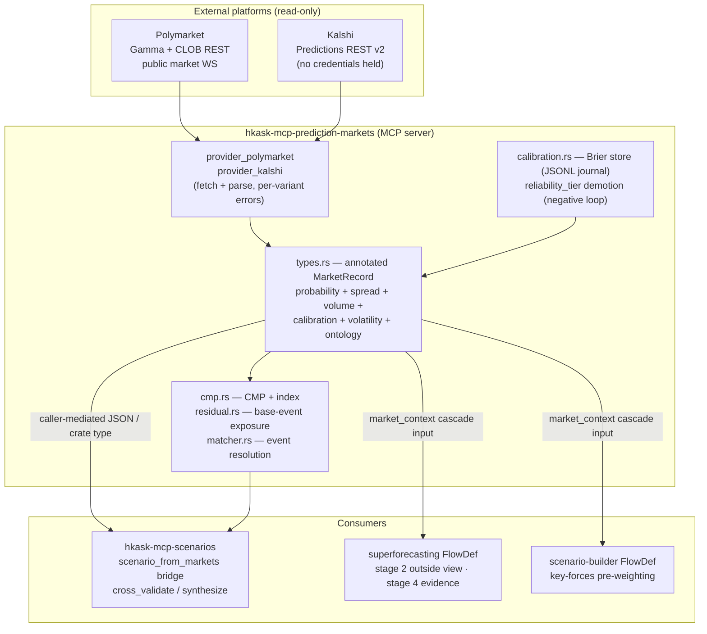
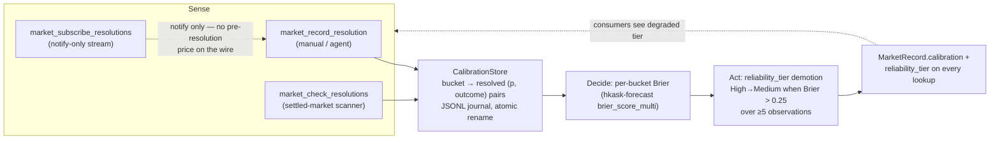
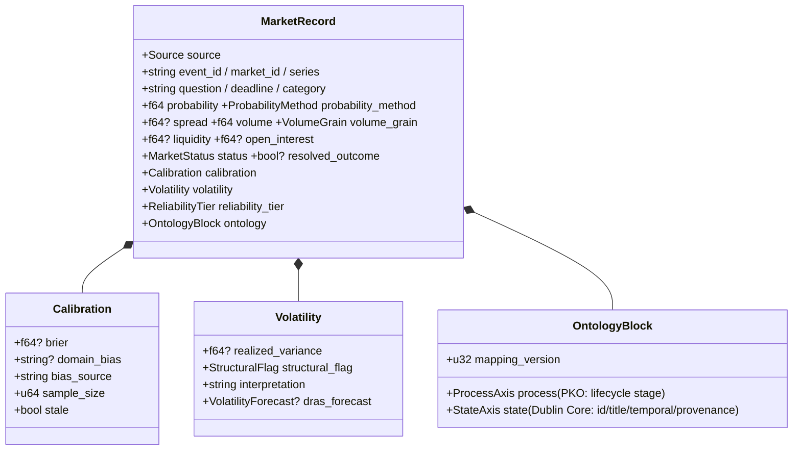

# Prediction-Markets Data Service — Architecture

**Diataxis type:** explanation (orienting diagram + data-flow reference).
**Companion:** `02-zed-kask-integration.md` (design), `tasks/plan.md` (build).

## System context



## The calibration feedback loop (the cybernetic core)



**Loop invariants (all pinned by tests):** negative-only polarity (good calibration never promotes); a missing/failed calibration read is `stale: true`, never `brier: 0` (a synthetic 0 would read as "perfectly calibrated" and invert the loop); ambiguous 50-50 resolutions are skipped, never recorded (arXiv:2604.20421 "Unknown" resolutions).

## The annotated contract (data shape reference)



**Load-bearing rule:** no field is ever a bare probability. Every `probability` travels with its reliability covariates, calibration state, and ontology mapping — a consumer cannot be naive by default.

## The CMP index (term structure)

```mermaid
xychart
    x-axis ["7d", "30d", "90d", "180d", "365d", "730d"]
    y-axis "P(no Fed change)" 0 --> 0.16
    line [0.061, 0.061, 0.096, 0.095, 0.118, 0.139]
```

*Live curve, KXFEDDECISION, 2026-08-05 (12 cohorts, log-odds interpolated). The 30d→1y slope (+0.79 log-odds/yr) is the term-structure signal: expectations of holding steady strengthen with horizon.*

## Tool surface (18 tools)

| Tool | Role |
|---|---|
| `market_lookup` | annotated records by free-text query |
| `market_match` | event ↔ market entity resolution (confidence-tiered) |
| `market_ontology_map` | the dual-axis mapping document |
| `market_calibration` | per-bucket Brier reading |
| `market_record_resolution` | sense arm: record an outcome |
| `market_check_resolutions` | sense arm: scan settled markets (idempotent) |
| `market_subscribe_resolutions` | notify-only resolution stream |
| `market_ladder` | series duration profile |
| `market_cmp` | single-tenor CMP point |
| `market_cmp_index` | the full published curve + slope |
| `market_cmp_index_store` | store the CMP curve as a transaction-ledger portfolio |
| `market_cmp_portfolio_store` | store the solved-portfolio CMP index set (maturity-bucketed, orientation-tagged) |
| `market_cmp_context_suggest` | propose curated/live economic context with reasoning |
| `market_volatility` | DR-AS structural volatility forecast (arXiv:2607.08199) |
| `market_residual` | niche-event base exposure (β, r²) |
| `market_history` | price history + realized variance + regime |
