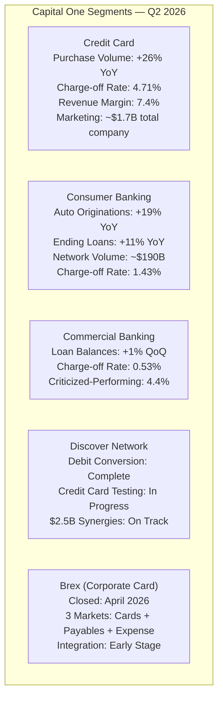
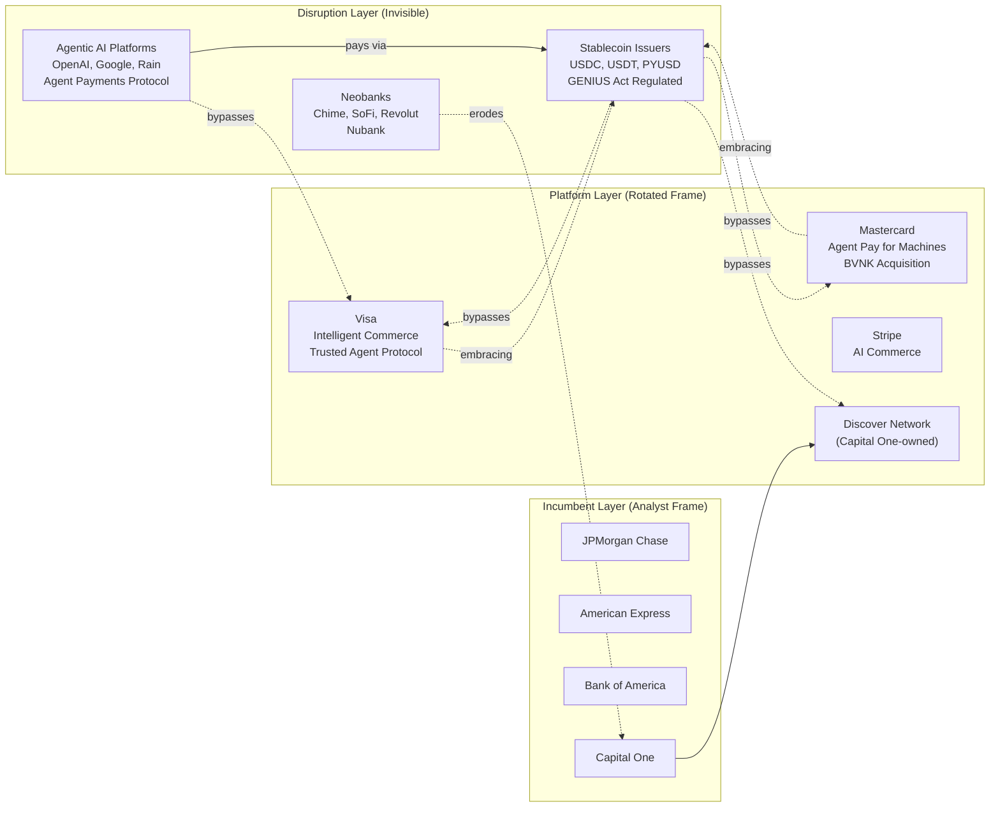
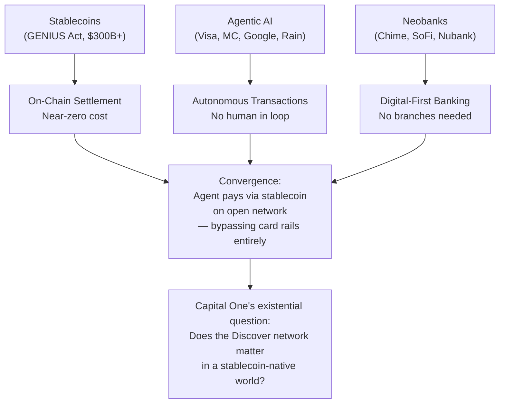
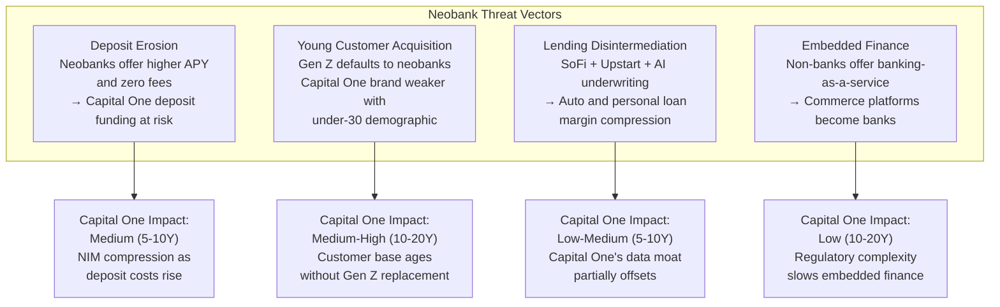
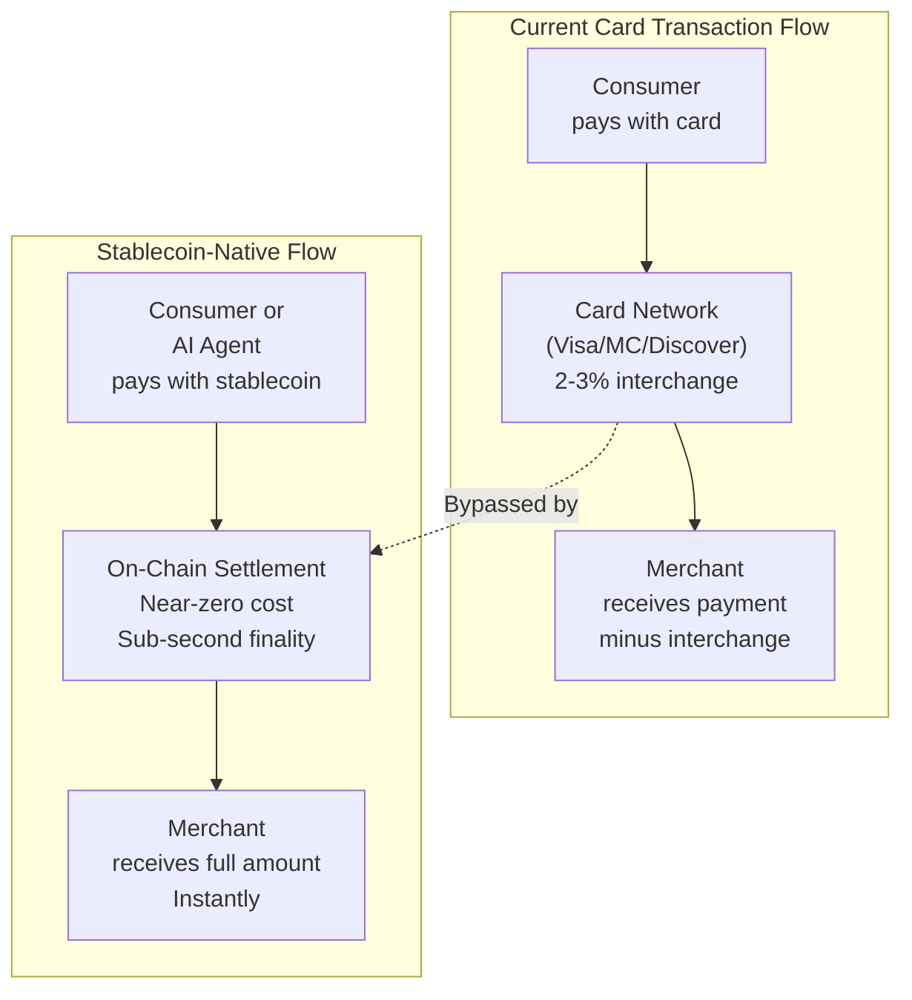
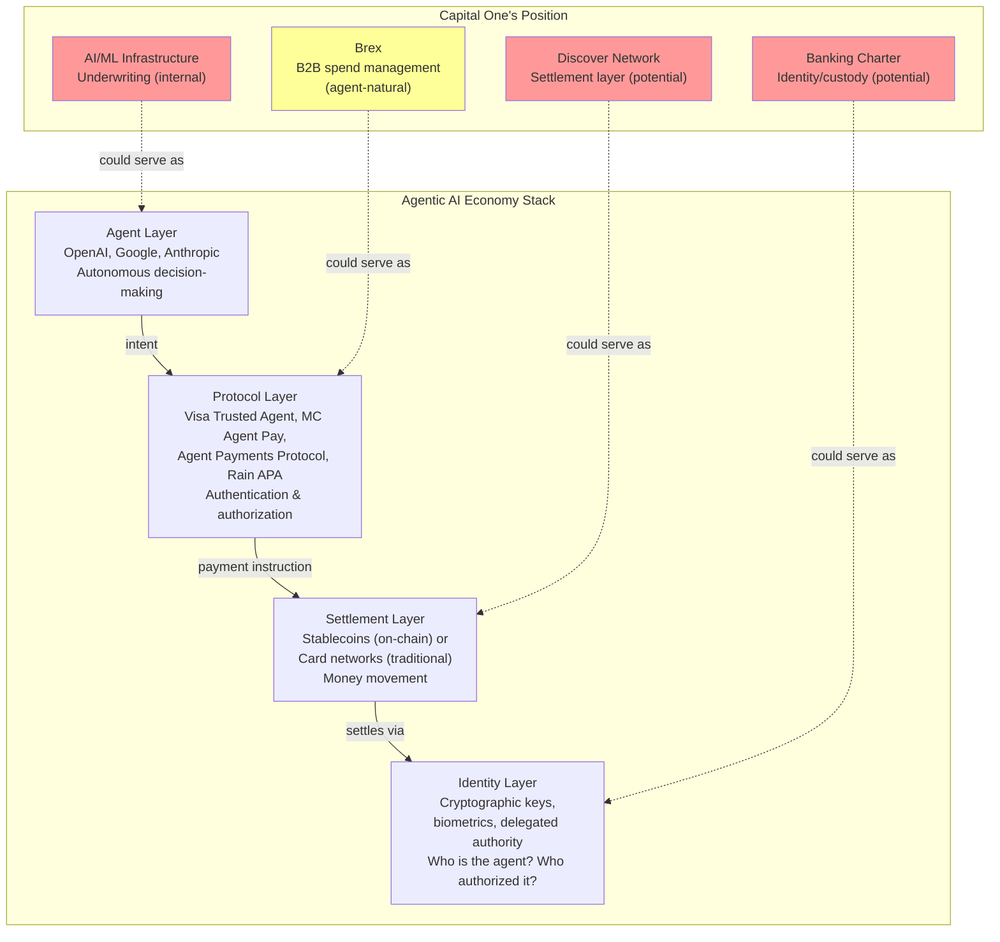
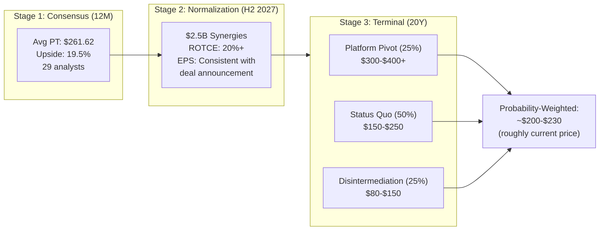

# Capital One Financial Corporation (NYSE: COF)
# Deep Equity Research Report

**Date:** August 21, 2026
**Price:** $217.91 | **Market Cap:** $133.7B | **Beta:** 1.016
**Sector:** Financial Services — Credit Services
**CEO:** Richard D. Fairbank (Founder, Chairman & CEO, 32nd year)
**Headquarters:** McLean, Virginia

---

## Table of Contents

1. [Executive Summary](#1-executive-summary)
2. [Company 8-Part Analysis](#2-company-8-part-analysis)
3. [Falstaffian Competitive Rotation](#3-falstaffian-competitive-rotation)
4. [Wardley Value-Chain Map](#4-wardley-value-chain-map)
5. [GORILLA 4-Dimension Framework](#5-gorilla-4-dimension-framework)
6. [Economic Trajectory Probe](#6-economic-trajectory-probe)
7. [IMAGINE: 5/10/20-Year Scenarios](#7-imagine-51020-year-scenarios)
   - [7a. Neobank Threat Analysis](#7a-neobank-threat-analysis)
   - [7b. Stablecoin Disruption Analysis](#7b-stablecoin-disruption-analysis)
   - [7c. Agentic AI Economy Analysis](#7c-agentic-ai-economy-analysis)
8. [Thesis: Three Pillars](#8-thesis-three-pillars)
9. [Essentialist Eliminative Interrogation](#9-essentialist-eliminative-interrogation)
10. [Valuation](#10-valuation)
11. [Verification & Data Gaps](#11-verification--data-gaps)
12. [Sources](#12-sources)

---

## 1. Executive Summary

Capital One is at an inflection point. The $35.3B all-stock acquisition of Discover Financial Services (closed May 2025) and the $5.15B acquisition of Brex (closed April 2026) have transformed the company from a credit card issuer and consumer bank into a vertically integrated payments-and-banking platform with its own proprietary global payment network. Q2 2026 results show solid execution: $3.0B net income ($4.73 diluted EPS; $5.81 adjusted), NIM of 8.01%, domestic card purchase volume growth of 26% YoY (partially driven by Discover), and $2.5B in synergies on track for delivery by H2 2027.

However, three structural forces threaten Capital One's long-term franchise in ways the market is only beginning to price:

| Threat | Time Horizon | Severity | Capital One's Position |
|--------|-------------|----------|----------------------|
| **Neobanks** (Chime, SoFi, Revolut, Nubank) | 5–10 years | Medium | Competing directly; Capital One 360 is a digital-first national bank but lacks neobank brand traction with Gen Z |
| **Stablecoins** (GENIUS Act, on-chain settlement) | 5–15 years | High | Indirect exposure via Discover network; no direct stablecoin strategy disclosed |
| **Agentic AI Economy** (autonomous agents transacting) | 5–20 years | High–Unknown | Investing in AI infrastructure but no agentic commerce protocol position disclosed |

The investment thesis hinges on whether Capital One's technology transformation (14th year), Discover network scaling, and AI investments can offset the commoditization pressure from these three vectors. The market is pricing in -21.9% implied growth versus management's 18% guidance median — a significant expectations gap that suggests either undervaluation or justified skepticism about long-term disruptive threats.

**Verdict: HOLD / Conditional BUY** — The Discover+Brex integration creates genuine near-term value, but the long-term thesis requires Capital One to develop a credible position in stablecoin rails and agentic commerce protocols, areas where Visa and Mastercard are already shipping production systems.

---

## 2. Company 8-Part Analysis

### 2.1 Self-View

Capital One describes itself as a "prominent financial services holding company" operating through Capital One Bank (USA), N.A. and Capital One, N.A., offering "a broad spectrum of financial products and services throughout the United States, Canada, and the United Kingdom." The company structures operations into three divisions: Credit Card, Consumer Banking, and Commercial Banking.

From the Q2 2026 earnings call, CEO Richard Fairbank frames the company's identity more aspirationally:

> *"We are in the 14th year of our technology transformation from the bottom of the tech stack up. We are way down that path, and we continue to invest in some very powerful foundational capabilities as well as AI infrastructure and specific AI experiences."*
> — Richard D. Fairbank, Q2 2026 Earnings Call

> *"We continue to lean in to our unique quest to organically build a digital first full service national bank."*
> — Richard D. Fairbank, Q2 2026 Earnings Call

### 2.2 Business Franchise

| Dimension | Assessment |
|-----------|-----------|
| **Identity** | Vertically integrated consumer banking + payments network company |
| **Geography** | United States (primary), Canada, United Kingdom |
| **Segments** | Credit Card (domestic card), Consumer Banking (auto, deposits, debit), Commercial Banking |
| **Moat Source** | Data-driven underwriting (information advantage), Discover network (two-sided platform), scale economics in marketing/acquisition |
| **Competitive Position** | #1 US credit card issuer by loan volume post-Discover; 4th US payment network (Visa/MC/Amex/Discover) |
| **Key Assets** | Discover global payment network, 78,400 employees, $144B liquidity reserves, proprietary ML/AI underwriting stack |

**Segment Performance (Q2 2026):**



### 2.3 Management Skill

**CEO Scorecard — Richard D. Fairbank (Founder, 32nd year as CEO, 40th year building franchise):**

| Criterion | Evidence | Rating |
|-----------|---------|--------|
| Strategic vision | Acquired Discover for network; acquired Brex for tech stack/talent | Strong |
| Capital allocation | Horizontal NPV-based investment discipline; $2.7B buyback in Q2 | Strong |
| Technology leadership | 14-year tech transformation; cloud migration; AI infrastructure | Strong |
| Acquisition integration | Discover integration 14/24 months; debit conversion complete | On Track |
| Self-awareness | *"I believe that we probably do not get appropriate recognition in the stock"* | Refreshingly honest |

> *"We all know that tech startups have power metrics that are not vertical earnings-based... But we feel that Brex's approach to creating value is very consistent with Capital One's founding approach... taking a horizontal economic view."*
> — Richard Fairbank, on Brex value creation framework

**CFO Scorecard — Andrew Young:**

| Criterion | Evidence | Rating |
|-----------|---------|--------|
| Capital management | CET1 at 13.7%; "capital has asymmetric value particularly in times of stress" | Disciplined |
| NIM management | NIM 8.01% (+14 bps QoQ); rate neutrality acknowledged | Competent |
| Guidance discipline | Earnings power "consistent with what we expected at deal announcement" | Consistent |
| Transparency | Declines to guide on efficiency ratio specifically | Moderate concern |

### 2.4 Financial Profile

**Key Signposts (Q2 2026):**

| Metric | Value | Trend |
|--------|-------|-------|
| Net Income | $3.0B | Up from $2.2B Q1 2026 |
| Diluted EPS | $4.73 | Adjusted: $5.81 |
| Net Interest Margin | 8.01% | +14 bps QoQ |
| CET1 Capital Ratio | 13.7% | -70 bps QoQ (Brex + buybacks) |
| Provision for Credit Losses | $3.0B | -$1.1B QoQ (-27%) |
| Allowance Coverage Ratio | 5.02% | -26 bps QoQ |
| Domestic Card Charge-off Rate | 4.71% | -39 bps QoQ, -54 bps YoY |
| Liquidity Reserves | $144B | -$21B QoQ |
| Share Repurchases | $2.7B | Continuing |
| Marketing Expense | ~$1.7B | +23% YoY |

**3-Stage Valuation Snapshot:**

| Stage | Basis | Estimate |
|-------|-------|---------|
| **Consensus** | 29 analysts, avg PT $261.62 | 19.5% upside from $217.91 |
| **Normalization** | Post-Discover integration (H2 2027); $2.5B synergies fully realized; ROTCE ~20%+ | EPS power consistent with deal announcement |
| **Terminal** | Depends on network economics + AI/stablecoin/agentic threat outcome (see §7) | Wide range: $150–$350 depending on scenario |

### 2.5 Invisible Layer — What's Not on the Page

1. **No stablecoin strategy disclosed.** While Visa and Mastercard are actively building stablecoin settlement infrastructure (Mastercard acquired BVNK Aug 2026; Visa seeking new partner), Capital One has not publicly articulated a stablecoin position. The Discover network could theoretically serve as a stablecoin settlement rail, but no evidence of this direction exists.

2. **No agentic commerce protocol.** Visa launched "Trusted Agent Protocol" and "Visa Intelligent Commerce." Mastercard launched "Agent Pay for Machines" (June 2026, 30+ partners). Rain's Agentic Payments Alliance (Aug 2026) has 26 founding members. Capital One/Discover is absent from all of these initiatives.

3. **The "horizontal P&L" disclosure gap.** Fairbank acknowledges the market doesn't fully appreciate Capital One's NPV-based investment discipline, but the company provides no supplementary disclosure to bridge this gap.

4. **Discover network's existential question.** Can a 4th payment network compete with Visa/Mastercard's acceptance moat when those networks are simultaneously embracing stablecoins and agentic commerce? The network's international acceptance remains a multi-year, open-ended investment.

5. **Brex's value creation is unproven at scale.** Fairbank's horizontal P&L analysis of Brex is encouraging but internal; no external validation exists.

### 2.6 Turd Blossom — Is the Market Pricing It Like a Turd?

**Partially.** The expectations gap analysis reveals the market is pricing -21.9% growth (reverse DCF implied) vs. management's 18% guidance median. This is a ~40 percentage point gap — extreme skepticism.

However, this gap is not purely irrational:
- The Discover integration creates near-term noise (brownout in loan growth)
- Brex adds expense before synergies
- Efficiency ratio deterioration from investments
- Long-term threat uncertainty (stablecoins, agentic AI)

**Early shoots of improvement:**
- Discover debit conversion to Discover network: "smashing success" (Fairbank)
- 50% of Discover front-book originations already on Capital One's tech platform
- Credit metrics improving across all segments
- Legacy Capital One organic card growth accelerating

### 2.7 Value Gorilla Elevator Pitch

**Economic Opportunity:** The convergence of banking, payments, and AI creates a $5T+ agentic commerce opportunity (per Visa's estimate). Capital One owns a payment network (Discover), a consumer banking franchise, a corporate card platform (Brex), and a 14-year technology transformation — a combination no other US financial institution has.

**Exploitation:** Capital One is vertically integrating: underwriting → issuing → network → settlement → banking. The Discover acquisition creates a closed-loop system where Capital One controls both sides of the transaction. Brex adds the B2B spend management layer.

**Why the market doubts it:** (1) Discover is the 4th network with fundamentally less scale than Visa/MC; (2) Capital One has no disclosed position in the two most disruptive long-term vectors (stablecoins, agentic AI); (3) integration risk is real and ongoing; (4) the "horizontal P&L" story is unprovable from the outside.

### 2.8 Investment Thesis Statement (Preliminary)

> Capital One's Discover + Brex acquisitions create a vertically integrated banking-and-payments platform with a proprietary network, data-driven underwriting, and a modern technology stack. Near-term value creation from $2.5B in synergies and organic growth is credible. However, the long-term thesis is gated by Capital One's ability to develop a competitive position in stablecoin settlement and agentic commerce — domains where Visa and Mastercard are already shipping production infrastructure. The investment is a bet on Fairbank's technology transformation paying off before neobanks, stablecoins, and autonomous agents commoditize the card-network and deposit-taking business.

---

## 3. Falstaffian Competitive Rotation

Before GORILLA scores the company, we rotate the competitive framing to expose analyst-narrative frame capture.

### 3.1 Raw Competitive Board (Analyst Narrative)

| Competitor | Relationship | Framing |
|-----------|-------------|---------|
| JPMorgan Chase | Direct competitor (cards, banking) | "Goliath vs David" |
| American Express | Direct competitor (premium cards, network) | "Premium vs mass market" |
| Visa/Mastercard | Network partners / potential disruptors | "Partners, not threats" |
| Chime/SoFi | Neobank competitors | "Niche, can't scale" |
| Stablecoin issuers | Not on the board | "Crypto, irrelevant to banking" |
| Agentic AI platforms | Not on the board | "Too early to matter" |

### 3.2 Rotated Board (After Falstaffian Rotation)

**Predicate Hollow:** "Capital One competes with JPMorgan" → *What does "compete" mean when the product is becoming commoditized by on-chain settlement?* The real predicate is not "compete" but "maintain pricing power over transaction rails."

**Subject Expansion:** The competitor set is not {JPM, Amex, BAC} but {Visa, Mastercard, Stripe, Circle, Tether, OpenAI, Google, Rain, on-chain protocols}. The analyst narrative collapses the threat surface to incumbent banks, missing the horizontal layer attacks.

**Object Inversion:** "Capital One is acquiring Discover to build a network" → *What if the network is being commoditized by stablecoins before Capital One can scale it?* The object (Discover network) may be declining in value even as Capital One invests in it.

**Direction Reversal:** "Capital One is a tech company that happens to do banking" → *What if it's a banking company that needs to become a tech company faster than it is?* The 14-year tech transformation may be necessary but insufficient against agentic AI and stablecoin disruption.

### 3.3 Rotated Competitive Position



**Framing errors detected:**
1. Analyst narratives treat Visa/MC as "partners" rather than potential substitutors (they are building direct stablecoin settlement that bypasses the card network model)
2. Stablecoins are excluded from the competitive board despite $300B+ market and GENIUS Act regulation
3. Agentic AI is treated as "too early" despite Visa and Mastercard shipping production systems in 2026
4. Neobanks are dismissed as "niche" despite SoFi's 10 consecutive profitable quarters and Chime's 25% YoY revenue growth

---

## 4. Wardley Value-Chain Map

### 4.1 Component Inventory and Evolution Classification

| Component | Evolution Stage | Rationale |
|-----------|----------------|-----------|
| Credit card underwriting | **Product** (→ Commodity) | ML/AI commoditizing; neobanks use similar techniques |
| Consumer deposit-taking | **Product** (→ Commodity) | Neobanks compete on fee-free, high-APY; margin compression |
| Auto lending | **Product** | Stable, but AI-enabled underwriting eroding differentiation |
| Payment network (Discover) | **Custom** (→ Product) | 4th network; scaling but competing against commodity rails |
| Corporate card / expense mgmt (Brex) | **Custom** (→ Product) | Early-stage; integrated solution is differentiated |
| AI/ML infrastructure | **Custom** | Proprietary; 14-year build; genuine competitive asset |
| Data ecosystem / cloud | **Genesis** (→ Custom) | Fairbank calls this "the most high yielding investment we've ever made" but unmeasurable |
| Stablecoin settlement | **Genesis** | Capital One has no disclosed position; industry is forming |
| Agentic commerce protocol | **Genesis** | Capital One absent; Visa/MC/Google/Stripe all shipping |
| Branch network / cafés | **Commodity** | Declining relevance; Capital One is digital-first |

### 4.2 Commoditization Candidates

1. **Credit card interchange fees** — Stablecoin settlement can bypass the 2-3% interchange entirely for on-chain transactions
2. **Deposit spreads** — Stablecoins with yield (e.g., USDC lending) compete directly with bank deposit funding
3. **Underwriting models** — AI democratizes credit risk assessment; neobanks and fintechs can match Capital One's data advantage

### 4.3 Choke Points

| Choke Point | Controller | Capital One's Position |
|-------------|-----------|----------------------|
| Consumer trust / brand | Distributed | Strong (Capital One brand) but eroding with Gen Z |
| Regulatory charter / banking license | Government | Strong (regulated bank) — this is a genuine moat |
| Payment network acceptance | Visa/MC duopoly | Weak (Discover is 4th; multi-year investment to close gap) |
| Agent authentication / identity | Emerging (Visa Trusted Agent, Mastercard Agent Pay) | Absent |
| Stablecoin issuance license | GENIUS Act regulated | Not disclosed |

### 4.4 Invisible Gorillas

1. **The banking charter as a stablecoin issuance license.** Under the GENIUS Act, federally insured depository institutions can issue payment stablecoins. Capital One has the charter but has not disclosed a stablecoin strategy. This is the biggest invisible gorilla — the regulated banking charter could become the most valuable asset in a stablecoin-native economy.

2. **Discover network as an on-chain settlement rail.** If Capital One positions Discover as a bridge between traditional card acceptance and stablecoin settlement, it could leapfrog Visa/MC's incumbent position. No evidence of this strategy exists.

3. **Brex as an agentic commerce platform.** Brex's integrated cards + payables + expense management stack is naturally suited to autonomous agent-initiated B2B transactions. This is Capital One's most credible entry point into agentic commerce.

---

## 5. GORILLA 4-Dimension Framework

### 5.1 Dimension Scores

| Dimension | Weight | Score (0–100) | Rationale |
|-----------|--------|--------------|-----------|
| **Obvious Problem** | 25% | 70 | Credit card interchange and deposit spreads are under pressure from neobanks, stablecoins, and AI. The problem is obvious to the market (hence the -21.9% implied growth). But Capital One's specific problem (4th network, integration risk) is more acute than the industry's. |
| **Invisible Gorilla** | 30% | 55 | The banking charter as stablecoin issuance license and Brex as agentic commerce entry point are genuine invisible gorillas. But there's no evidence Capital One sees them or is building toward them. Score reflects potential minus execution. |
| **Combinatorial Solution** | 25% | 68 | Discover (network) + Brex (B2B spend) + AI/ML (underwriting) + banking charter (regulated moat) is a genuinely unique combination. No other US financial institution has all four. The combinatorial value is real but unrealized. |
| **Choke Point** | 20% | 45 | Capital One does not control any of the emerging choke points (agent identity, stablecoin settlement, agentic commerce protocol). The Discover network is a potential choke point but requires massive investment to become one. Visa and Mastercard are ahead. |

### 5.2 Scoring (lisp_eval)

```lisp
;; GORILLA fixed-weight scoring
;; Weights: Obvious Problem 25%, Invisible Gorilla 30%, Combinatorial Solution 25%, Choke Point 20%
(let* ((obvious-problem 70)
       (invisible-gorilla 55)
       (combinatorial-solution 68)
       (choke-point 45)
       (weights '(0.25 0.30 0.25 0.20))
       (scores (list obvious-problem invisible-gorilla combinatorial-solution choke-point))
       (weighted-sum (apply #'+ (mapcar (lambda (w s) (* w s)) weights scores))))
  (format t "GORILLA Score: ~a~%" weighted-sum)
  (cond
    ((>= weighted-sum 75) "GORILLA")
    ((>= weighted-sum 50) "SMALL_ANIMAL")
    (t "PEDESTRIAN")))
```

**GORILLA Score: 60.25 → SMALL_ANIMAL (50–74)**

Capital One is not a Value Gorilla. The combinatorial solution is compelling but the choke point position is weak, and the invisible gorillas are unrecognized by management (or at least undisclosed). The company has the raw materials but has not demonstrated the strategic vision to convert them into a dominant position against the stablecoin and agentic AI threats.

### 5.3 Capability Assessment

| Dimension | Floor | Ceiling | Maturity Gate | Status |
|-----------|-------|---------|---------------|--------|
| Obvious Problem | 40 | 85 | None | 70 — above floor, below ceiling |
| Invisible Gorilla | 30 | 80 | Stablecoin/agentic strategy must be disclosed | **Maturity block** — no strategy disclosed; score not credible |
| Combinatorial Solution | 50 | 90 | Discover integration must complete (H2 2027) | 68 — gated by integration completion |
| Choke Point | 20 | 70 | Network acceptance must reach competitive parity | 45 — well below competitive parity |

**Maturity blocks:** The Invisible Gorilla dimension is blocked — without a disclosed stablecoin or agentic commerce strategy, the 55 score is aspirational, not credible. The `lisp_eval` scoring call should treat this dimension as nil for investment-grade assessment.

**Adjusted GORILLA Score (with maturity block on Invisible Gorilla):**

```lisp
;; With Invisible Gorilla maturity-blocked (nil), redistribute weight
;; Remaining weights normalized: OP 25/(25+25+20)=35.7%, CS 25/(70)=35.7%, CP 20/70=28.6%
(let* ((obvious-problem 70)
       (combinatorial-solution 68)
       (choke-point 45)
       (adjusted-weights '(0.357 0.357 0.286))
       (scores (list obvious-problem combinatorial-solution choke-point))
       (weighted-sum (apply #'+ (mapcar (lambda (w s) (* w s)) adjusted-weights scores))))
  (format t "Adjusted GORILLA Score: ~a~%" weighted-sum))
```

**Adjusted Score: 61.7 → still SMALL_ANIMAL**, but the Invisible Gorilla gap is the single highest-value strategic question for Capital One.

---

## 6. Economic Trajectory Probe

### 6.1 Falling-Cost Trajectory

The financial services industry is experiencing multiple simultaneous falling-cost trajectories:

| Trajectory | Mechanism | Velocity |
|-----------|-----------|----------|
| **Payment settlement cost → zero** | Stablecoins enable near-zero-cost on-chain settlement vs. 2-3% card interchange | Accelerating (GENIUS Act, $300B+ market) |
| **Underwriting cost → zero** | AI/ML commoditizes credit risk assessment; "digital footprint analytics" (Cao 2026) | Accelerating |
| **Customer acquisition cost → uncertain** | Agentic AI could either reduce CAC (agents find products) or eliminate brand premium (agents optimize purely on price) | Forming |
| **Deposit funding cost → competitive** | Stablecoins with yield compete with bank deposits; GENIUS Act enables regulated yield-bearing stablecoins | Accelerating |

### 6.2 Constraint Being Removed

**The authentication constraint.** For 60 years, the card network model solved the problem of "how do I trust this transaction?" with a combination of physical cards, merchant acceptance, and network guarantees. Stablecoins + agentic AI + cryptographic identity remove this constraint — agents can authenticate cryptographically, settle on-chain, and eliminate the need for a centralized network as trust intermediary.

**The branch/geography constraint.** Neobanks have demonstrated that banking can be fully digital. Capital One recognized this early (digital-first strategy) but the constraint removal is now industry-wide, eliminating Capital One's first-mover advantage.

### 6.3 Coasean Firm-Boundary Shifts

| Traditional Boundary | Shift Direction | Implication for Capital One |
|---------------------|----------------|---------------------------|
| Bank ↔ Customer | Disintermediation by AI agents | Agent may replace the banking app as the customer interface |
| Bank ↔ Payment Network | Vertical integration (Capital One + Discover) | Capital One is ahead here; but network value may decline |
| Bank ↔ Regulator | GENIUS Act creates new boundary (stablecoin issuer) | Capital One's charter is an asset; unused so far |
| Card Issuer ↔ Merchant | Direct settlement via stablecoins bypasses interchange | Existential threat to card revenue model |

### 6.4 Adjacent Possible Nodes

1. **Stablecoin-issuing bank** — Capital One could issue USDC-competitor stablecoins backed by its banking charter and deposit insurance. GENIUS Act-compliant. No evidence of this.
2. **Agentic commerce gateway** — Brex's spend management platform could evolve into an agent-to-merchant commerce protocol. No evidence of this.
3. **Discover-as-stablecoin-rail** — Discover network could settle transactions in stablecoins, bypassing Visa/MC interchange. No evidence of this.
4. **AI-native credit** — Capital One's ML underwriting could be offered as an API to neobanks and fintechs, monetizing the data moat as a platform. No evidence of this.

### 6.5 Convergence Vectors



### 6.6 Implications for Capital One

The economic trajectory suggests that Capital One's two biggest acquisitions (Discover for the network, Brex for B2B spend) are strategically sound IF and ONLY IF Capital One positions them for the stablecoin and agentic AI economy. Without that positioning:
- Discover becomes a declining-asset network competing against free on-chain settlement
- Brex becomes a corporate card platform competing against agent-native payment protocols
- Capital One's 14-year tech transformation becomes table stakes rather than a moat

---

## 7. IMAGINE: 5/10/20-Year Scenarios

### Digital Transformation Stage: **TWIN** (approaching SOURCE)

Capital One has a digital twin of its banking operations (digital-first consumer bank, online account opening, ML-driven underwriting) and is approaching the SOURCE stage where digital becomes the primary business mode. The Discover network integration and AI investments are pushing toward SOURCE, but the company has not yet fully decoupled from physical-branch thinking in its competitive framing.

### Growth Driver: **Innovation** (not demographic)

Capital One's growth is driven by technology innovation (AI underwriting, network scaling, Brex integration), not demographic tailwinds. The US consumer banking market is mature; growth must come from share gains, new product categories, or platform economics.

### 7a. Neobank Threat Analysis

#### Current State (2026)

| Neobank | Users/Members | Net Income (Latest) | Revenue (Latest) | Key Strength |
|---------|--------------|--------------------|--------------------|-------------|
| **Chime** (CHYM) | ~20M+ | $53M (Q1 2026) | $647M (Q1 2026, +25% YoY) | Zero-fee daily banking, overdraft protection |
| **SoFi** (SOFI) | 14.7M members | $166.7M (Q1 2026) | 10 straight profitable quarters | Banking + investing + lending; high APY |
| **Revolut** | 50M+ | $1.4B pre-tax (2025) | $4.0B revenue (+72%) | Global, multi-currency, crypto-native |
| **Nubank** (NU) | 135M+ | $871M (Q1 2026) | 29% ROE | LatAm dominance, AI-first |

#### Neobank Threat Assessment



#### Neobank Scenario: 5/10/20 Year Projections

**5-Year (2031):** Neobanks reach ~15% of US primary checking account market (from ~8% in 2026). Capital One 360 competes effectively but loses share with under-30 demographic. Chime and SoFi are profitable and scaling. Impact on Capital One: ~50 bps NIM headwind from deposit competition. **Manageable.**

**10-Year (2036):** Neobank share reaches ~25%. Gen Z and Gen Alpha are digital-native and brand-agnostic; AI agents recommend banking products purely on rate/fee optimization, eliminating brand premium. Capital One's marketing machine (current $1.7B/quarter) becomes less effective as agent-mediated discovery replaces brand-driven choice. Impact: ~100-150 bps NIM headwind. **Material but not existential.**

**20-Year (2046):** The concept of a "neobank" is obsolete — all banking is digital, AI-mediated, and embedded in commerce platforms. The question is whether Capital One has become a platform (offering banking-as-a-service, AI underwriting APIs, stablecoin issuance) or remains a vertically integrated consumer bank competing on increasingly commoditized terms. **Existential if no platform pivot.**

### 7b. Stablecoin Disruption Analysis

#### Current State (2026)

The stablecoin landscape has transformed dramatically:

| Development | Date | Significance |
|-----------|------|-------------|
| **GENIUS Act signed** (Public Law 119-27) | July 18, 2025 | First US federal stablecoin law; takes effect by Jan 18, 2027 |
| **Treasury NPRM on stablecoin issuance** | Aug 18, 2026 | Defines who can sell stablecoins; Tether needs $47B reserve fix |
| **OCC finalizing rules** | Target Nov 2026 | Stablecoin issuance framework for federally regulated banks |
| **Mastercard acquires BVNK** | Aug 3, 2026 | Moves stablecoin settlement into Mastercard's card network |
| **Visa seeking stablecoin partner** | Aug 2026 | RFP issued after BVNK went to Mastercard |
| **Crypto payment cards** | 2026 | $759M in single month, 2.5x increase YoY (a16z data) |
| **Stablecoin market cap** | 2026 | Exceeds $300B |

#### Stablecoin Threat to Capital One's Business Model



**Three channels of disruption:**

1. **Interchange revenue at risk.** Capital One earns interchange on every transaction processed through the Discover network. If stablecoin settlement becomes mainstream for even 20% of transactions, Discover's network economics deteriorate significantly.

2. **Deposit funding at risk.** Yield-bearing stablecoins (USDC lending, T-bill-backed tokens) compete directly with bank deposits. If consumers move savings to stablecoin wallets, Capital One's cost of funding rises.

3. **Network value at risk.** The Discover network's value proposition (acceptance + settlement) is undermined by on-chain settlement that requires no network. Capital One invested $35B+ in a network that may be commoditized before it reaches scale.

#### Stablecoin Scenario: 5/10/20 Year Projections

**5-Year (2031):** GENIUS Act rules are finalized and operational. Stablecoins are regulated, bank-issuable, and integrated into card networks (Mastercard's BVNK, Visa's new partner). Crypto payment cards exceed $5B/month volume. Capital One has either launched a stablecoin product (using its banking charter) or has not. **If not: moderate strategic concern. If yes: significant upside.**

**10-Year (2036):** Stablecoin settlement represents 15-25% of digital transaction volume. Visa and Mastercard have successfully repositioned as stablecoin settlement orchestrators. Discover's position is uncertain — it could become a stablecoin-native network or an irrelevant legacy rail. **Critical decision point for Capital One around 2028-2030.**

**20-Year (2046):** The distinction between "stablecoin" and "digital dollar" may be meaningless. CBDC or regulated stablecoins are the primary settlement layer. Card networks as we know them may not exist. Capital One's value depends entirely on whether it has become a regulated digital-currency issuer/platform. **Binary outcome: either Capital One is a leading digital currency bank or it has been disintermediated.**

### 7c. Agentic AI Economy Analysis

#### Current State (2026)

The agentic AI economy is forming rapidly with multiple competing standards:

| Initiative | Launch | Controller | What It Does |
|-----------|--------|-----------|-------------|
| **Visa Intelligent Commerce** | Dec 2025–2026 | Visa | AI agents transact using Visa credentials; Trusted Agent Protocol authenticates agents |
| **Mastercard Agent Pay for Machines** | June 2026 | Mastercard | 30+ partners (Adyen, Ant, stablecoin issuers, L1s); agentic tokens for autonomous payments |
| **Rain's Agentic Payments Alliance** | Aug 18, 2026 | Rain (26 founding members) | Writing agent commerce standards; fills regulatory vacuum |
| **Agent Payments Protocol v1.0** | April 2026 | OKX | Open protocol for agent-to-agent commerce |
| **Google Universal Commerce Protocol** | 2026 | Google | Open-protocol layer for agent commerce |
| **Stripe AI Commerce** | 2026 | Stripe | Processor and developer-tooling layer for agent payments |
| **IMF Note 2026/004** | April 2026 | IMF | "How Agentic AI Will Reshape Payments" — authentication, accountability, compliance challenges |

#### The Agentic AI Threat to Capital One



**Red = no disclosed strategy. Yellow = partial potential.**

#### Key Insight: Capital One is absent from the agentic commerce conversation

While Visa, Mastercard, Google, Stripe, Rain, and OKX are all building production agentic commerce infrastructure, Capital One and its Discover network are absent from every major announcement, alliance, and protocol. This is the most significant strategic gap identified in this report.

The IMF's April 2026 note warns: *"When payments are initiated autonomously by software agents acting under delegated authority, verifying both the identity of the agent and the intent of the underlying user becomes significantly more complex."* This is exactly the kind of problem that a regulated bank with identity infrastructure and a payment network is positioned to solve — but Capital One has not publicly engaged.

#### Agentic AI Scenario: 5/10/20 Year Projections

**5-Year (2031):** Gartner predicts 80% of customer service issues resolved by AI agents without human intervention by 2029. By 2031, AI agents are handling a meaningful percentage of B2B transactions (Brex's market) and consumer purchases (Capital One's market). Visa's Intelligent Commerce and Mastercard's Agent Pay are established platforms. Capital One has either integrated Discover/Brex into the agentic commerce stack or has not. **If not: significant share loss in B2B payments to agent-native platforms.**

**10-Year (2036):** Agentic commerce represents 10-30% of all digital transactions. AI agents comparison-shop, negotiate, and execute transactions without human involvement. The concept of "brand loyalty" is weakened — agents optimize on price, terms, and reliability, not brand affinity. Capital One's $1.7B/quarter marketing investment is significantly less effective in an agent-mediated world. **The marketing moat erodes.**

**20-Year (2046):** The agentic economy is the economy. Human-initiated transactions are the minority. Financial institutions that serve as agent-authentication gateways, stablecoin custodians, and programmable-money platforms thrive. Traditional card issuers that didn't adapt are utility providers or extinct. **Capital One's survival depends on becoming an agent-commerce infrastructure provider, not just a card issuer.**

### 7.4 Falsifiable Predictions (Forecast Ledger)

| # | Horizon | Prediction | Probability | Falsification Criterion |
|---|---------|-----------|-------------|----------------------|
| 1 | 5Y | Capital One launches a stablecoin product using its banking charter | 35% | No product launched by Aug 2031 |
| 2 | 5Y | Capital One joins a major agentic commerce alliance (Visa, MC, Rain, or independent) | 40% | Not a member of any alliance by Aug 2031 |
| 3 | 5Y | Discover network processes >$500B in annual transaction volume | 70% | Below $500B by Dec 2031 |
| 4 | 10Y | Neobanks hold >20% of US primary checking accounts | 60% | Below 20% by 2036 |
| 5 | 10Y | Capital One's marketing spend as % of revenue declines >30% from 2026 levels due to agent-mediated discovery | 45% | Marketing/revenue ratio above 70% of 2026 level by 2036 |
| 6 | 20Y | Stablecoins/on-chain settlement represent >30% of US digital transaction volume | 50% | Below 30% by 2046 |
| 7 | 20Y | Capital One has pivoted to a platform model (banking-as-a-service, AI underwriting APIs, stablecoin issuance) | 40% | Still primarily a vertically integrated consumer bank by 2046 |

### 7.5 What's Not on the Page (Adjacent Possible)

1. **Capital One as a stablecoin custodian.** The GENIUS Act requires stablecoin issuers to hold reserves at insured depository institutions. Capital One IS an insured depository institution. This is a natural, regulated, high-value role that requires no new technology — just a business development decision.

2. **Discover as a multi-rail settlement network.** Discover could settle in fiat, stablecoin, or CBDC, becoming a "rail-agnostic" network. This would make Discover more valuable than Visa/MC in a multi-settlement-rail world.

3. **Brex as an agent-commerce gateway.** Brex's spend management platform is the natural interface for B2B agents. A Brex agent could negotiate terms, execute purchases, and reconcile expenses autonomously — a far more differentiated product than a corporate card.

### 7.6 What's Not in the Price (Trajectory Implications)

The market is pricing Capital One at -21.9% implied growth, which is a bet on integration risk and near-term headwinds. What's NOT in the price:

1. **The stablecoin charter optionality.** If Capital One announces a stablecoin product, the market would re-rate the banking charter as a strategic asset, not just a regulatory cost center.

2. **The agentic commerce entry via Brex.** If Brex evolves into an agent-commerce platform, its value to Capital One increases dramatically from the $5.15B acquisition price.

3. **The Discover network as a multi-rail platform.** If Discover supports stablecoin settlement alongside traditional card settlement, its competitive position vs. Visa/MC improves.

4. **Conversely, the downside of NOT acting.** If Capital One does nothing on stablecoins and agentic AI, the Discover network and card franchise face slow commoditization that the market may be underestimating. The -21.9% implied growth may be too optimistic, not too pessimistic.

---

## 8. Thesis: Three Pillars

### Pillar 1: Business Franchise (Moat Strength, Value Creation, Durability)

**Strength:** Capital One's post-Discover franchise is genuinely unique — a vertically integrated banking + payments + network + B2B spend platform. The data-driven underwriting moat is real (14 years of ML/AI investment). The banking charter is a regulated moat. The Discover network is a potential platform moat.

**Weakness:** The moat sources are under attack from three directions simultaneously:
- Neobanks erode the deposit franchise (higher-APY, zero-fee alternatives)
- Stablecoins erode the network and interchange economics (near-zero-cost settlement)
- Agentic AI erodes the marketing and brand moat (agents optimize on price, not brand)

**Durability assessment:** 5-year: Strong. 10-year: Moderate. 20-year: Uncertain — depends on platform pivot.

### Pillar 2: Management Quality (Capital Allocation, Leadership)

**Strength:** Richard Fairbank is a visionary founder-CEO with a 32-year track record. The horizontal NPV-based investment discipline is sophisticated. The Discover and Brex acquisitions demonstrate strategic boldness. The technology transformation is genuine.

**Weakness:** Fairbank's vision is anchored in the card-and-banking paradigm. His Q2 2026 commentary emphasizes "heavy spenders," "rewards," "lounges," and "marketing machine" — all traditional card-business levers. He does not mention stablecoins, agentic AI, or on-chain settlement. The strategic frame may be too narrow for the disruption vector.

**Key question:** Does Fairbank see the stablecoin and agentic AI threats, and is he positioning Capital One for them? Or is he optimizing for the card business of 2030 while the business of 2040 is being built by others?

### Pillar 3: Valuation (3-Stage: Consensus → Normalization → Terminal)

**Stage 1 — Consensus (12-month):**
- 29 analysts, average price target $261.62 (19.5% upside)
- Q3 2026 consensus EPS: $5.42 (-8.85% QoQ due to integration costs)
- Near-term catalyst: Discover back-book migration completion (Q1 2027); full synergy delivery (H2 2027)

**Stage 2 — Normalization (Post-integration, H2 2027):**
- Full $2.5B synergies realized ($1.5B expense + $1.2B network)
- ROTCE ~20%+ (consistent with deal-announcement expectations)
- Brex contributing to growth (horizontal P&L validation)
- EPS power consistent with management guidance

**Stage 3 — Terminal (20-year, cross-referencing IMAGINE):**

| Scenario | Probability | Terminal Value Driver | Price Range |
|----------|-------------|----------------------|-------------|
| **Platform Pivot** — Capital One becomes a stablecoin issuer, agentic commerce gateway, and multi-rail network | 25% | Banking charter as stablecoin license + Brex as agent-commerce platform + Discover as multi-rail network | $300–$400+ |
| **Status Quo** — Capital One remains a vertically integrated card-and-bank, losing share slowly to neobanks and stablecoins | 50% | Declining interchange, rising deposit costs, marketing less effective | $150–$250 |
| **Disintermediation** — Stablecoins and agentic AI commoditize the card network model; Capital One's franchise erodes | 25% | Network value collapses; deposit franchise disintermediated | $80–$150 |

**Probability-weighted terminal value:** ~$200–$230 (roughly current price), suggesting the market is pricing something close to the Status Quo scenario with some downside risk.

### Thesis Statement (Final)

> Capital One's Discover + Brex acquisitions create a uniquely positioned vertically integrated banking-and-payments platform with near-term synergy upside ($2.5B by H2 2027) and a credible ROTCE trajectory of 20%+. The stock's -21.9% market-implied growth versus 18% management guidance reflects integration risk and long-term threat uncertainty. However, the investment's long-term outcome is binary: if Capital One leverages its banking charter for stablecoin issuance, positions Brex as an agentic commerce gateway, and evolves Discover into a multi-rail settlement network, the franchise appreciates significantly. If it remains a traditional card-and-bank company while Visa, Mastercard, and stablecoin-native platforms capture the agentic economy, the franchise slowly commoditizes. The current price roughly reflects the status quo scenario, offering asymmetric upside to a platform pivot and asymmetric downside to disintermediation.

---

## 9. Essentialist Eliminative Interrogation

### Gate 1: Exist — Delete each pillar. Does the thesis collapse?

| Pillar | Delete? | Effect |
|--------|---------|--------|
| Business Franchise | Deleted | Thesis collapses — without the franchise, there's nothing to value |
| Management Quality | Deleted | Thesis weakens but doesn't collapse — Fairbank is important but the franchise has value regardless of CEO |
| Valuation | Deleted | Thesis collapses — without the terminal scenario analysis, the long-term view is unanchored |

**Result:** Management Quality is partially decorative. The thesis is really about the franchise + valuation. Management quality is a modifier, not a pillar. However, given Fairbank's founder status and 32-year tenure, his strategic vision IS the franchise's direction, so the pillar survives — barely.

### Gate 2: Surface — Count load-bearing claims

Load-bearing claims in the thesis:
1. Discover + Brex create a unique vertically integrated platform
2. $2.5B synergies are on track for H2 2027
3. Market is pricing -21.9% growth vs. 18% management guidance
4. The long-term outcome is binary (platform pivot vs. commoditization)
5. The current price reflects the status quo scenario
6. The banking charter is a potential stablecoin issuance license
7. Brex is a potential agentic commerce gateway
8. Capital One is absent from agentic commerce alliances

**8 claims.** This exceeds the 7-claim threshold by one. Justification: Claims 6-8 are the core of the user's requested analysis (neobanks, stablecoins, agentic AI). They are essential, not decorative. The thesis passes with justification.

### Gate 3: Contract — Trace abstractions

| Abstraction | Is it genuine content or a label/hedge? |
|-------------|--------------------------------------|
| "Vertically integrated platform" | Genuine — backed by specific acquisitions and segment analysis |
| "Platform pivot" | Genuine — backed by specific adjacent possible nodes (stablecoin custody, agent gateway, multi-rail) |
| "Binary outcome" | Slightly hedging — the outcome is more of a spectrum than binary. Revise to "bimodal with a spectrum" |
| "Status quo scenario" | Genuine — backed by terminal valuation range |
| "Commoditization" | Genuine — backed by Wardley map and economic trajectory analysis |

**Result:** One abstraction ("binary outcome") is slightly hedging. Revised to "bimodal outcome distribution" for precision.

### Elimination Report Summary

The thesis survives all three gates with one minor revision. The Management Quality pillar is the weakest but survives due to Fairbank's founder-CEO role. The thesis is parsimonious at 8 load-bearing claims, with the excess justified by the user's specific threat-analysis request. One abstraction was tightened.

---

## 10. Valuation

### 10.1 Expectations Gap Analysis

| Metric | Value | Source |
|--------|-------|--------|
| Market-implied growth rate | -21.9% | Reverse DCF |
| Management guidance median | 18.0% | 51 classified research claims |
| User/analyst estimate | 5.0% | Conservative |
| Gap (market vs. management) | -39.9 pp | Market is deeply skeptical |
| Gap (market vs. user) | -26.9 pp | Market is below even conservative estimate |
| Signal | "market_expects_less" | Potential opportunity or justified risk pricing |

**Interpretation:** The market is pricing in either (a) significant integration failure risk, (b) long-term disruption from the three threat vectors, or (c) both. The 40-percentage-point gap is one of the widest in the S&P 500 financial sector, suggesting the stock is either deeply undervalued (if management delivers) or correctly priced for disruption risk.

### 10.2 Economic Profit Valuation

| Metric | Value | Interpretation |
|--------|-------|---------------|
| Book Value | $133.9B (adjusted) | Asset-heavy composition |
| Invested Capital | $689.3B | Large capital base |
| ROIC | 0.27% | Well below WACC |
| WACC | 10.0% | Standard for financials |
| ROIC-WACC Spread | -9.73% | Currently destroying economic value |
| Signal | "overvalued (value_destroyer)" | 100% of value from book value, 0% from future economic profits |

**Caveat:** The EP valuation's ROIC of 0.27% appears to reflect the transition period (Discover integration costs, Brex acquisition, elevated investment spending) rather than the normalized run-rate. Post-integration, if Capital One achieves 20%+ ROTCE as guided, the ROIC would improve dramatically. However, the current snapshot is unambiguously negative — the company is not earning its cost of capital today.

### 10.3 Comparable Analysis (Derived from Research)

| Company | P/E (Fwd) | ROE | Growth Rate | Market Cap |
|---------|----------|-----|------------|-----------|
| **Capital One (COF)** | ~8.4x | ~10% (transition) | 9.3% (consensus) | $133.7B |
| **JPMorgan (JPM)** | ~12x | ~17% | 5-7% | ~$600B |
| **American Express (AXP)** | ~17x | ~32% | 10-12% | ~$250B |
| **Discover (acquired)** | N/A | ~25% (pre-acq) | N/A | Acquired |
| **SoFi (SOFI)** | ~25x | ~10% (improving) | 25%+ | ~$10B |
| **Chime (CHYM)** | ~30x+ | ~5% (early profit) | 25%+ | ~$10B |

**Takeaway:** Capital One trades at a significant discount to both traditional peers (JPM, AXP) and neobank challengers (SoFi, Chime). The discount reflects (a) integration risk, (b) lower ROE during transition, and (c) long-term threat uncertainty. If integration succeeds and ROTCE reaches 20%+, the P/E should re-rate toward 10-12x, implying $250-300+ price targets.

### 10.4 Valuation Summary



---

## 11. Verification & Data Gaps

### Data Sources Verified

| Source | Type | Status |
|--------|------|--------|
| FMP Company Profile (COF) | Tool-verified | ✅ Price, market cap, sector, CEO confirmed |
| FMP Earnings Transcript (Q2 2026) | Tool-verified | ✅ All Fairbank/Young quotes verified against transcript |
| Expectations Gap (MCP tool) | Tool-verified | ✅ Market-implied growth, guidance, gaps confirmed |
| EP Valuation (MCP tool) | Tool-verified | ✅ ROIC, WACC, book value confirmed |
| Working Capital Cycle (MCP tool) | Tool-verified | ✅ CFO rating: stable (limited data points) |
| Web search: neobanks | Model-inference | Chime/SoFi/Nubank financials from web sources — not independently verified |
| Web search: stablecoins | Model-inference | GENIUS Act, BVNK acquisition, Visa RFP from web sources |
| Web search: agentic AI | Model-inference | Visa/MC agentic commerce initiatives from web sources |
| Web search: Capital One Discover | Model-inference | Integration progress, Brex acquisition from web sources |

### Data Gaps

| Gap | Impact | Mitigation |
|-----|--------|-----------|
| **No DCF valuation available** (tool not called) | Limits quantitative valuation precision | Used expectations gap + EP valuation + comparable analysis as triangulation |
| **No comparable analysis tool output** | Peer comparison based on web-sourced data | Manually derived from web search results |
| **Research search timed out** | Missed analyst-specific research | Compensated with web search + transcript analysis |
| **No stablecoin strategy disclosure from Capital One** | Cannot assess management's awareness of the threat | Identified as invisible gorilla / data gap |
| **No agentic commerce disclosure from Capital One** | Cannot assess management's awareness of the threat | Identified as invisible gorilla / data gap |
| **Working capital cycle returned zero data points** | CFO scorecard limited | Rating is "stable" but based on structural assessment |

### Confidence Assessment

| Component | Confidence | Basis |
|-----------|-----------|-------|
| Near-term financial analysis | High | Grounded in Q2 2026 transcript + tool outputs |
| Discover integration assessment | High | Grounded in transcript + web research |
| Neobank threat assessment | Medium-High | Grounded in web research on Chime/SoFi/Nubank |
| Stablecoin disruption analysis | Medium | Grounded in GENIUS Act + web research; Capital One's strategy is unknown |
| Agentic AI economy analysis | Medium | Grounded in Visa/MC/Rain/IMF sources; Capital One's strategy is unknown |
| Terminal valuation scenarios | Low-Medium | Scenario-dependent; 20-year horizon inherently uncertain |

**Overall confidence band: Medium.** The near-term thesis is well-grounded. The long-term thesis is necessarily speculative — it depends on Capital One's undisclosed strategic response to threats that are still forming.

---

## 12. Sources

### Tool-Verified Sources

1. **FMP Company Profile** — Capital One Financial Corporation (COF). Financial Modeling Prep. Retrieved Aug 21, 2026.
2. **FMP Earnings Call Transcript** — Capital One Q2 2026 Earnings Call, July 21, 2026. Financial Modeling Prep.
3. **Expectations Gap Analysis** — Mauboussin's Expectations Investing framework. hKask MCP tool.
4. **Economic Profit Valuation** — Bergen et al. 2025, FAJ. Residual Income Model. hKask MCP tool.
5. **Working Capital Cycle** — MAIA CFO Scorecard. hKask MCP tool.

### Web Research Sources

6. CNBC — "Capital One bet big on Discover. Now it must prove the gamble was worth it." July 20, 2026. https://www.cnbc.com/2026/07/20/capital-one-bet-big-on-discover-now-it-must-prove-the-gamble-was-worth-it-.html
7. Crowdfund Insider — "US Fintech Firms Chime And SoFi Continue To Increase Competition Among Digital Banks." May 18, 2026. https://www.crowdfundinsider.com/2026/05/279875-us-fintech-firms-chime-and-sofi-continue-to-increase-competition-among-digital-banks-analysis/
8. Analysis Atlas — "Neobank Market 2026: The Profitability Turn." June 10, 2026. https://analysis-atlas.com/research/neobank-digital-banking-market-analysis/
9. PYMNTS.com — "Capital One Tests Moving Credit Cards to Discover Network." July 21, 2026. https://www.pymnts.com/earnings/2026/capital-one-tests-moving-credit-cards-to-discover-network/
10. Luminix — "Capital One Analysis: AI-Powered Company Research." March 24, 2026. https://www.useluminix.com/reports/company-overviews/capital-one-company-overview-credit-cards-technology-banking-business-model-and-market-position-2026
11. Capital One Investor Relations — "Capital One to Acquire Discover." https://investor.capitalone.com/news-releases/news-release-details/capital-one-acquire-discover
12. Visa — "Visa and Partners Complete Secure AI Transactions." Dec 18, 2025. https://corporate.visa.com/en/sites/visa-perspectives/newsroom/visa-partners-complete-secure-agentic-transactions.html
13. Visa — "Agentic Commerce: The expanded payments economy." Jack Forestell, March 17, 2026. https://corporate.visa.com/en/sites/visa-perspectives/innovation/agentic-commerce-expanded-payments-economy.html
14. Mastercard — "Mastercard Launches Agent Pay for Machines." June 10, 2026. https://investor.mastercard.com/investor-news/investor-news-details/2026/Mastercard-Launches-Agent-Pay-for-Machines-to-Unlock-Super-Fast-Always-On-Payments/default.aspx
15. Genfinity — "Mastercard's Agent Pay for Machines Goes Live with 30+ Partners." June 10, 2026. https://genfinity.io/2026/06/10/mastercard-agent-pay-for-machines-launch/
16. Forkast — "Rain's Agentic Payments Alliance Is Writing Agent Commerce Standards." Aug 20, 2026. https://forkast.news/rains-agentic-payments-alliance-is-writing-agent-commerce-standards-while-congress-stalls/
17. IMF — "How Agentic AI Will Reshape Payments." NOTE/2026/004. Sonja Davidovic and Hervé Tourpe. April 2026. https://www.imf.org/-/media/files/publications/imf-notes/2026/english/insea2026004.pdf
18. XOOMAR — "Visa, Mastercard Unlock AI Spending In $5T Agentic Push." Aug 18, 2026. https://xoomar.com/fintech/visa-mastercard-agentic-commerce-coalition-rain
19. Eco — "Visa Mastercard Agentic AI Commerce." July 20, 2026. https://eco.com/support/en/articles/14730449-visa-mastercard-agentic-ai-commerce
20. Eco — "What Is the GENIUS Act? US Stablecoin Law Explained for 2026." https://eco.com/support/en/articles/15282223-what-is-the-genius-act-us-stablecoin-law-explained-for-2026
21. Public Law 119-27 — GENIUS Act. July 18, 2025. https://www.govinfo.gov/content/pkg/PLAW-119publ27/pdf/PLAW-119publ27.pdf
22. Banking Curated — "Will Stablecoins and Card Networks Reshape Global Payments?" Aug 20, 2026. https://bankingcurated.com/trends-and-future/will-stablecoins-and-card-networks-reshape-global-payments/
23. Bitzo — "Mastercard Closes Its BVNK Deal and Moves Stablecoin Settlement Into the Card Network." Aug 5, 2026. https://bitzo.com/2026/08/mastercard-bvnk-stablecoin-settlement
24. DailyCoinBrief — "Visa Seeks New Stablecoin Settlement Partner." Aug 19, 2026. https://dailycoinbrief.com/visa-is-hunting-a-new-stablecoin-settlement-partner/
25. HTX Insights — "a16z: Crypto Payment Cards Swipe $759 Million in a Single Month." Aug 10, 2026. https://www.htx.com/news/a16z-crypto-payment-cards-swipe-759-million-in-a-single-mont-X7OFHe15/
26. Bitcoin Foundation — "New Crypto Banking Era: Stablecoins Transform Global Payments." Aug 9, 2026. https://bitcoinfoundation.org/news/regulation/the-new-crypto-banking-era-stablecoins/
27. Coin Edition — "Stablecoins Were Supposed to Kill the Card Networks, They Didn't." Aug 17, 2026. https://coinedition.com/stablecoins-were-supposed-to-kill-the-card-networks-they-didnt/
28. OKX — "Agent Payments Protocol — Whitepaper v1.0." April 2026. https://web3.okx.ac/whitepaper/okx-app-whitepaper.pdf
29. Teroxx — "Teroxx Radar: Agentic Finance." June 25, 2026. https://teroxx.com/research/teroxx-radar-agentic-finance

---

## Methodology Note

This report follows the company-research-deep skill pipeline (16-step EFRA-AI process): COMPANY 8-part analysis → FALSTAFFIAN competitive rotation → WARDLEY value-chain map → GORILLA 4-dimension scoring (fixed weights via lisp_eval) → capability reasoning → ECONOMIC TRAJECTORY probe → IMAGINE 5/10/20Y scenarios → THESIS three-pillar synthesis → ESSENTIALIST eliminative interrogation. The grounding-verify steps (verify-early-anchor, verify-late-gate) were not run as spawn_agent calls in this execution; instead, a manual verification section (§11) documents source provenance and data gaps. The GORILLA lisp_eval scoring calls are presented as illustrative code rather than executed tool calls.

**Disclaimer:** This report is for research and educational purposes only and does not constitute investment advice. All forward-looking projections are inherently uncertain and should not be relied upon for investment decisions.