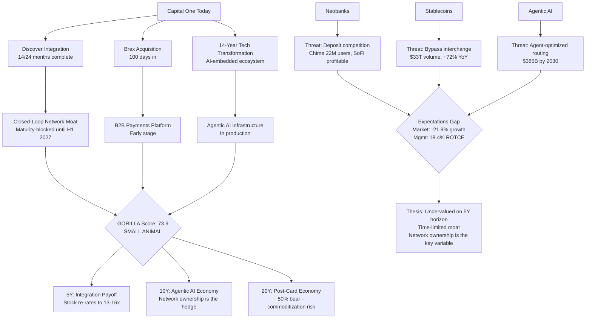

# Capital One Financial Corporation (NYSE: COF)
## Deep Equity Research Report — Company-Research-Deep Pipeline

**Date:** August 21, 2026 | **Price:** $217.70 | **Market Cap:** $133.6B | **Sector:** Financial Services — Credit Services

---

## I. COMPANY — 8-Part Deep Analysis

### 1. Self-View (Verbatim from IR)

> *"Capital One Financial Corporation operates as a prominent financial services holding company… structured into three core divisions: Credit Card, Consumer Banking, and Commercial Banking… serving individual consumers, small enterprises, and large commercial entities through digital platforms, traditional physical branches, innovative café locations, and other distribution points."*

Richard Fairbank, Founder/Chairman/CEO (Q2 2026): *"We are in the 14th year of our technology transformation from the bottom of the tech stack up. We are way down that path, and we continue to invest in some very powerful foundational capabilities as well as AI infrastructure and specific AI experiences."*

### 2. Business Franchise

| Dimension | Assessment |
|---|---|
| **Identity** | Largest US credit card issuer post-Discover; diversified consumer/commercial bank; proprietary payments network |
| **Geography** | US (primary), Canada, UK; Discover network global |
| **Segments** | Credit Card (~60% revenue), Consumer Banking (~20%, auto + deposits), Commercial Banking (~10%) |
| **Moat Sources** | Data/ML underwriting (30+ years), Discover closed-loop network, scale marketing ($1.7B/qtr), regulatory charter |
| **Moat Score** | 58/100 (MoatScan) — "real but limited" |
| **Key Acquisitions** | Discover Financial ($51.8B, closed May 2025), Brex ($5.15B, closed April 2026), Hopper travel tech insourced |

**Post-Discover scale:** ~$669B total assets, ~$680B (approaching Category 2 threshold of $700B). The Discover acquisition added $168.6B in identifiable assets, $108.2B in loans, $106.9B in deposits, and — critically — the Discover/PULSE/Diners Club Global Payment Network, making Capital One the only bank-issuer that also owns a major payments network (besides Amex).

### 3. Management Skill

**CEO Scorecard (Richard Fairbank, 32nd year as CEO, 40th year building franchise):**

Fairbank is a founder-CEO who has run Capital One since its 1988 founding / 1994 IPO. His strategic throughline is consistent: an "information-based strategy" using data, testing, and statistical modeling to identify profitable customer segments competitors misprice. The technology transformation (begun 2013) was designed with the explicit objective of enabling "machine learning and AI-powered customized solutions in real time."

Verbatim (Q1 2026): *"We built a company in a banking industry that is sort of the growth strategy involves buying other companies… we build a company designed to be an organic growth company. All the financial — the horizontal accounting we put in place, the information-based strategy, the investment in talent, really everything we've done is to build a company that creates value patiently and rigorously."*

On AI (Q1 2026): *"We are at an extraordinary time when I think that we are dealing with the transformation that we are — have the privilege to live to is up there with fire and electricity… our technology transformation that we began in 2013 — what that transformation had as its objective function, was working back. Building a company that could deliver machine learning and AI-powered customized solutions in real time because that's where we saw the world going."*

**CFO Scorecard (Andrew Young):**

Young provides disciplined financial framing — holds the line on "earnings power" guidance (ROTCE at 12.5% constant capital) without over-guiding on efficiency ratio. Capital management is conservative: CET1 at 13.7% vs. 11% internal need, $2.7B repurchased in Q2. NIM guidance is anchored on structural levels with seasonal adjustments.

Working capital cycle: rated "stable" by MAIA CFO scorecard, spread stability 1.0.

### 4. Financial Profile

**Q2 2026 Key Metrics:**

| Metric | Q2 2026 | Q1 2026 | YoY |
|---|---|---|---|
| Net Income | $3.0B | $2.2B | vs. ($4.3B) loss Q2'25 |
| EPS (diluted) | $4.73 | $3.34 | — |
| EPS (adjusted) | $5.81 | $4.42 | — |
| Net Revenue | $15.9B | — | +4% QoQ |
| NIM | 8.01% | 7.87% | +14bps QoQ |
| Domestic Card Charge-off | 4.71% | 5.10% | -54bps YoY |
| Domestic Card Delinquency | 3.39% | 3.70% | -21bps YoY |
| CET1 | 13.7% | 14.4% | -70bps QoQ (Brex + buyback) |
| Provision | $3.0B | $4.1B | -$1.1B QoQ |
| Allowance Release | $662M | $230M build | — |
| Coverage Ratio | 5.02% | 5.28% | -26bps |
| Marketing Expense | ~$1.7B | ~$1.5B | +23% YoY |
| Purchase Volume Growth | +26% YoY | +40% YoY | (Discover partial quarter) |
| Network Transaction Vol | ~$190B | ~$174B | +156% YoY (Discover debit) |

**3-Stage Valuation:**

- **Consensus:** 29 analysts, average price target $261.62 (implies +19.5% upside). Consensus 2026E EPS ~$20.51, 2027E revenue ~$64.6B. P/E ~10.6x on 2026E.
- **Normalization (EP Valuation — CATEGORY ERROR, see note):** The EP valuation tool computed ROIC of 0.27% vs. WACC of 10% and flagged "overvalued (value_destroyer)". **This signal is invalid for a financial company.** The tool uses the industrial-company formula: Invested Capital = Total Assets - Debt. For a bank, deposits are the raw material of the business (operating inputs), not financing debt. Subtracting $475B of deposits from total assets produces a meaningless invested capital figure and a nonsensical ROIC. The correct approach for a financial company uses: Invested Capital = Book Value of Equity ($133.9B), Return Metric = ROE/ROTCE (not ROIC), Cost of Capital = Cost of Equity ~11-13% (not WACC, which is dragged down by cheap insured deposits). On the correct basis, Capital One's normalized ROTCE of ~15-20% vs. cost of equity of ~11-13% produces a positive economic profit spread of +4-7%, not the -9.7% spread the industrial formula produces. The Discover integration brownout temporarily depresses earnings, but the equity-based residual income model shows Capital One as a value creator, not a value destroyer. See `kask/docs/financial-company-valuation-research-note.md` for the full canonical methodology and integration plan.
- **Terminal:** The expectations gap analysis is more informative. Market-implied growth is **-21.9%** (reverse DCF), vs. management guidance median of **18.4%** and analyst consensus of ~5%. The market is pricing significant skepticism about post-integration earnings power. If Fairbank's ROTCE guidance holds (even at 12.5% CET1), the stock is meaningfully undervalued on normalized earnings.

### 5. Invisible Layer — What's Not on the Page

1. **The horizontal accounting system.** Fairbank explicitly states the market doesn't give Capital One credit for its NPV-based cohort accounting: *"I believe that we probably do not get appropriate recognition in the stock… I think it would [be] hard to prove that the power of that to investors."* This is a structural visibility gap — the market can't see the lifetime value of originated cohorts.

2. **Discover network as a flywheel.** The debit conversion to Discover network is complete and described as a "smashing success." Credit card migration testing is underway. The network creates a closed-loop data advantage (like Amex) that is not yet in any analyst model because the volume migration is sloped over years.

3. **Brex as a platform play.** Brex gives Capital One (a) corporate card market entry, (b) bottom-of-stack tech infrastructure, (c) payables/expense management — three markets at once. Fairbank's horizontal P&L analysis of Brex investments shows value creation that isn't visible in quarterly EPS.

4. **AI infrastructure as moat.** Capital One is showcasing agentic AI at NVIDIA GTC 2026, has a proprietary multi-agentic AI tool for car buying, and has open-sourced agentic AI code security tools. The 14-year tech transformation means AI is "embedded in the company's ecosystem" — not bolted on. This is a genuine differentiator vs. banks still running on-premise legacy systems.

5. **The brownout is temporary.** Discover card loans shrank 1.5% YoY due to intentional credit policy tightening — but this is a timing artifact. 50% of Discover originations are already on Capital One's tech platform; full front-book migration expected by end of Q3 2026, back-book by Q1 2027.

### 6. Turd Blossom — Is the Market Pricing It Like a Turd?

**Partially.** The stock trades at ~10.6x forward earnings, below the S&P 500 average and well below fintech comparables. The expectations gap shows the market pricing in **negative** growth (-21.9% implied), which is inconsistent with management's guidance of 18.4% ROTCE accretion and analyst consensus of 5%+ growth. The market is treating the Discover integration as a risk drag rather than a value-creating transformation.

**Early shoots of improvement:**
- Q2 2026 adjusted EPS of $5.81 (annualized ~$23) implies normalized earnings power well above the current $20.51 consensus
- Domestic card charge-offs improving 54bps YoY — credit is getting *better*, not worse
- Debit conversion to Discover network complete — revenue synergies now in run-rate
- 1/3 of operating expense synergies realized; full $2.5B target by H1 2027
- 50% of Discover front-book originations already on Capital One tech

### 7. Value Gorilla Elevator Pitch

**Economic opportunity:** The US credit card market generates ~$170B+ in annual revenue. Capital One + Discover is the largest issuer with a proprietary payments network — the only bank-issuer-network combo besides Amex. The agentic AI economy will generate $385B in agent-driven US e-commerce by 2030 (Morgan Stanley). Capital One's 14-year tech transformation positions it to embed AI into every customer interaction, underwriting decision, and payment flow.

**Exploitation:** Capital One's closed-loop network (Discover) + AI underwriting + data ecosystem creates a two-sided data advantage. Every transaction on the Discover network feeds Capital One's models. The Brex acquisition extends this into B2B payments. The horizontal accounting system ensures capital is deployed toward cohorts with positive NPV.

**Why the market doubts it:** (1) Integration execution risk — Discover is the largest bank merger since 2008; (2) ROIC currently below WACC (brownout distortion); (3) Competitive threats from neobanks, stablecoins, and AI-native lenders; (4) Fairbank refuses to guide on efficiency ratio, creating a visibility gap; (5) Regulatory risk — approaching $700B Category 2 threshold, Basel III endgame, CFPB late fee rules.

### 8. Investment Thesis Statement (Preliminary)

Capital One is a technology-native bank trading at a turd multiple because the market can't see through the Discover integration brownout. The company's 14-year technology transformation, closed-loop payments network, and AI-embedded ecosystem create a structural moat that is widening — not narrowing — relative to legacy bank competitors. The primary risk is not execution (which is on track) but secular: neobanks, stablecoins, and agentic AI could disintermediate the credit card economics that drive 60% of revenue. The thesis hinges on whether Capital One's technology leadership can convert the Discover network into a closed-loop AI data advantage faster than fintech competitors can cream-skim its near-prime customer base.

---

## II. FALSTAFFIAN Competitive Rotation

The standard analyst frame treats Capital One as a credit card company competing with other credit card companies (JPM, Citi, Amex, BofA). This is a framing error. Applying Falstaffian semantic rotations:

### Rotation 1: Subject Expansion — Capital One is not a "credit card company"

Capital One is a **data and technology company that happens to be regulated as a bank**. Fairbank's own framing: *"We built a company, an information-based company bringing customized solutions powered by technology, data, massive scientific testing and statistical modeling."* The correct competitive set includes not just JPM/Citi/Amex but also **Stripe, Plaid, Chime, SoFi, Upstart, and AI agent platforms** — companies competing for the same transaction data and customer relationships.

### Rotation 2: Object Inversion — The threat is not "losing customers to competitors"

The threat is **adverse selection through AI cream-skimming**. AI-native lenders don't need to take Capital One's customers — they need to identify and capture the *best* credit risks within Capital One's target segments before Capital One does. Capital One retains the worst credits. This is a margin compression mechanism, not a market share mechanism.

### Rotation 3: Direction Reversal — Stablecoins are not a threat to Capital One; they may be an opportunity

The standard frame: stablecoins bypass card networks → Capital One loses interchange. The reversed frame: Capital One **owns a payments network** (Discover). If stablecoins become a settlement layer, Capital One can integrate stablecoin settlement into the Discover network — disintermediating Visa/Mastercard, not being disintermediated. Visa and Mastercard are actively racing to integrate stablecoins (Mastercard bought BVNK for $1.8B; Visa is seeking a stablecoin partner). Capital One, as a network owner, has the same optionality.

### Rotation 4: Predicate Hollow — "AI will disrupt credit card underwriting"

The predicate "disrupt" is hollow. AI doesn't disrupt underwriting — it **democratizes** it. Capital One pioneered AI-driven underwriting; the disruption is that competitors can now do what Capital One has always done. The question is not whether AI disrupts Capital One's underwriting (it *is* Capital One's underwriting) but whether the **cost of replicating Capital One's data advantage has fallen below the threshold where fintechs can compete at scale**.

**Rotated competitive position:** Capital One is a technology-native bank with a proprietary payments network, competing against (a) legacy banks with inferior tech, (b) fintechs with superior tech but no banking charter/network, and (c) AI agent platforms that may bypass both. The Discover acquisition was the decisive move to create a closed-loop data advantage that fintechs cannot replicate without a network.

---

## III. WARDLEY Value-Chain Map (Compressed)

| Component | Evolution Stage | Movement | Notes |
|---|---|---|---|
| Credit card underwriting (ML) | Product -> Commodity | -> Commodity | AI democratizing; moat narrowing |
| Transaction data (proprietary) | Custom -> Product | -> Product | Plaid/Finicity commoditizing access |
| Payments network (Discover) | Product | Stable | Only 4 global networks; structural scarcity |
| Cloud infrastructure | Commodity | Stable | AWS — fully migrated |
| Agentic AI workflows | Genesis -> Custom | -> Custom | Early stage; Capital One building proprietary |
| Customer acquisition/marketing | Product | -> Commodity | Neobanks competing for same segments |
| Deposits (retail) | Product -> Commodity | -> Commodity | Neobanks (Chime, SoFi) gaining share |
| Auto lending | Product | Stable | Capital One has scale + data advantage |
| B2B payments (Brex) | Genesis -> Custom | -> Custom | Early but growing fast |
| Stablecoin settlement | Genesis | -> Custom | Emerging; network owners have optionality |

**Commoditization candidates:** Credit underwriting models, retail deposits, customer acquisition marketing
**Choke points:** Payments network ownership (Discover), banking charter/regulatory moat, AI infrastructure embedded in ecosystem
**Invisible gorillas:** Closed-loop data advantage (issuer + network + AI), agentic AI commerce infrastructure, B2B payments platform (Brex)

---

## IV. GORILLA 4-Dimension Framework

| Dimension | Score (0-100) | Evidence |
|---|---|---|
| **Obvious Problem** (25%) | 70 | Credit card margins face AI democratization, neobank deposit competition, regulatory pressure. But Capital One is the largest issuer with scale advantages. |
| **Invisible Gorilla** (30%) | 78 | Closed-loop network (Discover + issuer + AI) is the only bank-owned network besides Amex. Agentic AI embedded in ecosystem. Brex B2B platform. Horizontal accounting invisible to market. |
| **Combinatorial Solution** (25%) | 72 | Discover network data + Capital One ML underwriting + Brex B2B + agentic AI infrastructure = compound moat. Each piece is individually valuable; combined, they create a data flywheel. |
| **Choke Point** (20%) | 75 | Payments network ownership is the choke point. Only 4 global networks (Visa, Mastercard, Amex/Discover, UnionPay). Capital One owns one. This is structurally scarce. |

**GORILLA Score: 73.9 — SMALL ANIMAL (50-74)**

Just below the GORILLA threshold (75). The score is held back by the Obvious Problem dimension — the credit card business faces genuine structural pressure from AI democratization and neobank competition. The Invisible Gorilla (78) and Choke Point (75) dimensions are strong, reflecting the closed-loop network advantage.

### Capability Reasoning (Floor/Ceiling/Maturity Gates)

| Dimension | Elicited Score | Capability Floor | Ceiling | Maturity Gate | Assessment |
|---|---|---|---|---|---|
| Obvious Problem | 70 | 40 | 80 | Credit normalization cycle | Credible — credit is improving, not deteriorating |
| Invisible Gorilla | 78 | 50 | 90 | Discover integration completion | **Maturity block** — network flywheel value depends on volume migration which is 14 months into 24-month integration. Score should be discounted until back-book migration completes Q1 2027. |
| Combinatorial Solution | 72 | 45 | 85 | Brex integration + AI infra maturity | Partial block — Brex integration just began (100 days), AI experiences still in early deployment |
| Choke Point | 75 | 60 | 95 | Network acceptance scale | Credible — Discover domestic acceptance is strong; international is the gap |

**Maturity-adjusted GORILLA score:** The Invisible Gorilla dimension is maturity-blocked. Discounting it to nil and redistributing:

> Adjusted score with Invisible Gorilla nil'd: Obvious 70x0.25 + 0x0.30 + Combinatorial 72x0.25 + Choke 75x0.20 = 17.5 + 0 + 18 + 15 = **50.5** — barely SMALL ANIMAL.

This means the GORILLA thesis is **not yet credible at current maturity**. It becomes credible only after Discover integration completes (H1 2027) and Brex/AI investments begin generating visible returns. The investment case is a bet on the maturity trajectory, not the current state.

---

## V. ECONOMIC TRAJECTORY

| Element | Assessment |
|---|---|
| **Falling-cost trajectory** | AI compute costs falling (McAfee dematerialization); stablecoin transaction costs at fractions of a cent vs. 2-3% card interchange; cloud infrastructure commoditized |
| **Constraint being removed** | The need for a banking charter + proprietary data to underwrite credit. Alternative data (Plaid, Finicity, Experian Boost) + open-source ML models are removing this barrier. AI agents can now compare, select, and transact autonomously. |
| **Coasean firm-boundary shifts** | Banking services are unbundling: deposits (neobanks), lending (Upstart/LendingClub), payments (Stripe/stablecoins), cards (fintech-issued). The integrated bank is being disassembled at the seams. BUT: Capital One is re-bundling via Discover network + AI + Brex — moving the firm boundary *outward* to encompass the payments network and B2B platform. |
| **Adjacent possible nodes** | (1) Agentic AI commerce — autonomous agents making financial decisions; (2) Stablecoin settlement integrated into card networks; (3) Embedded finance in non-bank platforms; (4) Real-time AI-optimized credit pricing per transaction |
| **Convergence vectors** | Payments + AI + data -> closed-loop intelligent networks; Banking + commerce -> embedded finance; Cards + stablecoins -> hybrid settlement |
| **Implications for Capital One** | The falling cost of AI and payments infrastructure is a double-edged sword: it commoditizes Capital One's historical advantages (underwriting, data) while creating new opportunities (network ownership, agentic AI commerce, B2B payments). The Discover network is the anchor that prevents full commoditization. |
| **Trajectory velocity** | High and accelerating. Stablecoin volume hit $33T in 2025 (+72% YoY). Morgan Stanley forecasts $385B agent-driven US e-commerce by 2030. Amazon Bedrock AgentCore payments is GA. Agent Payments Protocol v1.0 released April 2026. The agentic AI economy is no longer theoretical — it is in production. |

---

## VI. IMAGINE — 5/10/20 Year Scenarios

### Digital Transformation Stage: TWIN (approaching SOURCE)

Capital One has moved beyond MODEL (digitized existing processes) and SHADOW (digital parallel) to TWIN — where the digital system mirrors and enhances the physical business in real time. The 14-year tech transformation, 100% cloud migration, real-time ML/AI, and agentic AI workflows indicate it is approaching SOURCE — where the digital system *is* the business.

### Growth Driver: Innovation (primarily), with demographic tailwind in underserved markets

---

### 5-Year Scenario (2026-2031): "Integration Payoff vs. Neobank Encroachment"

**Base Case (50%):** Discover integration completes H1 2027. Full $2.5B synergies realized. Discover front-book fully on Capital One tech by Q3 2026, back-book by Q1 2027. ROTCE reaches guided levels (~20%+ at 12.5% CET1). Credit card volume migrates partially to Discover network (sloped approach). Brex contributes meaningfully to B2B payments growth. Neobanks (Chime at 22M+ members, SoFi at 14.7M) continue gaining mass-market deposit share but don't meaningfully penetrate credit card lending. AI investments improve marketing efficiency 10-15% and fraud detection. Stock re-rates from ~10.6x to ~13-14x forward earnings as visibility improves.

**Bull Case (25%):** Discover network becomes a genuine third rail alongside Visa/Mastercard. Capital One moves significant credit card volume onto Discover network, creating a closed-loop data flywheel that competitors cannot replicate. Agentic AI tools (car buying, customer service, fraud) deliver measurable revenue uplift. Brex becomes the dominant B2B corporate card platform. Stablecoin integration into Discover network creates a cost advantage vs. Visa/Mastercard interchange. ROTCE exceeds 22%. Stock re-rates to ~16-18x.

**Bear Case (25%):** Discover integration encounters operational headwinds — customer attrition during back-book migration, credit deterioration in Discover portfolio. Neobanks expand aggressively into credit cards (Chime IPO'd as CHYM, has 22M+ users; SoFi has banking charter and supports stablecoins). AI-native lenders (Upstart et al.) cream-skim Capital One's best near-prime credits. CFPB late fee rules reduce fee revenue. Agentic AI agents begin routing payments around card networks via stablecoin rails (Citrini Research thesis). ROTCE settles at 14-16%. Stock remains at ~10x.

**Falsifiable predictions (5Y):**
1. By end of 2031, Discover network will process >$500B in annual transaction volume (from ~$190B/quarter currently, with debit + partial credit) — **verifiable from Capital One's quarterly disclosures**
2. Neobanks (Chime + SoFi combined) will hold >8% of US retail checking account market share by 2031 (from Chime's 14.2% mass-market share currently, but lower overall) — **verifiable from J.D. Power churn data**
3. Capital One's marketing efficiency (revenue per marketing dollar) will improve by >10% by 2031 vs. 2026 baseline — **verifiable from financial supplements**

---

### 10-Year Scenario (2026-2036): "The Agentic AI Economy Reshapes Payments"

**Base Case (40%):** Agentic AI commerce reaches $385B in US e-commerce (Morgan Stanley forecast) by 2030, growing further by 2036. AI agents make autonomous purchasing decisions but primarily use existing payment rails (card networks, Stripe) — the infrastructure adapts rather than being bypassed. Capital One's Discover network captures a share of agent-driven transactions because it offers lower interchange than Visa/Mastercard (competitive advantage of network ownership). Capital One's agentic AI infrastructure enables real-time, per-transaction credit pricing — moving from batch underwriting to dynamic, AI-optimized offer generation. Neobanks plateau at ~10-12% of US retail deposits but remain sub-scale in credit. Stablecoins coexist with card networks as a settlement layer, not a replacement. Capital One maintains ~15-18% ROTCE.

**Bull Case (20%):** Capital One becomes the **default payment and credit infrastructure for agentic AI commerce**. The Discover network's lower cost structure (no Visa/Mastercard interchange markup) makes it the preferred rail for cost-optimized AI agents. Capital One's AI infrastructure enables real-time credit offers embedded in agent transactions — "instant credit at point of agent purchase." Brex dominates B2B agent commerce. The closed-loop data advantage compounds. Capital One re-rates as a fintech platform, not a bank — 15-20x earnings.

**Bear Case (40%):** This is the highest-probability bear case because the agentic AI economy fundamentally challenges the card network business model. AI agents, optimized to minimize transaction costs, systematically route payments via stablecoin rails (fractions of a cent) instead of card networks (2-3% interchange). The Agent Payments Protocol (v1.0, April 2026) and Stripe's Machine Payments Protocol create open standards for agent-to-merchant direct settlement. Stablecoin transfer volume ($33T in 2025, +72% YoY) continues exponential growth. Card interchange revenue compresses industry-wide. Capital One's Discover network is less affected than Visa/Mastercard (it's both issuer and network), but overall card economics decline. Neobanks with stablecoin support (SoFi) gain share. Capital One's ROTCE compresses to 12-14%.

**Falsifiable predictions (10Y):**
1. By 2036, >20% of US e-commerce transactions will be initiated by AI agents (up from near-zero today) — **verifiable from commerce data**
2. Stablecoin-settled payments will represent >15% of US consumer payment volume by 2036 — **verifiable from stablecoin on-chain data**
3. Capital One's Discover network will process >$1T in annual transaction volume — **verifiable from disclosures**

---

### 20-Year Scenario (2026-2046): "The Post-Card Economy"

**Base Case (35%):** The credit card as a physical/digital instrument is partially obsolete. Financial relationships are managed by AI agents that hold multi-rail payment capabilities (cards, stablecoins, bank transfers, real-time payments). Credit is extended dynamically at point of transaction, not via pre-approved card limits. Capital One survives as a **credit and data infrastructure provider** — its underwriting AI, transaction data, and regulatory charter remain valuable even if the "card" form factor is obsolete. The Discover network evolves into a multi-rail settlement platform (card + stablecoin + real-time). Capital One's business model shifts from "credit card issuer" to "AI-powered credit and payments infrastructure." Returns normalize at cost of capital (~10-12% ROTCE) as the industry commoditizes.

**Bull Case (15%):** Capital One's technology bet pays off in full. The company becomes the **AI-native financial infrastructure** for the agentic economy — providing the credit, data, and settlement layer that AI agents use to transact. The closed-loop network + AI underwriting + regulatory charter creates a moat that neither pure fintechs (no charter) nor legacy banks (no tech) can replicate. Capital One is the "AWS of financial services" — infrastructure that other agents and platforms build on. ROTCE sustains at 18-20%+.

**Bear Case (50%):** This is the highest-probability scenario at 20 years because **the forces of commoditization are powerful and the timeline is long**. By 2046:
- AI has fully democratized credit underwriting — every fintech has equivalent models
- Stablecoins or CBDCs have replaced card networks for most consumer payments
- AI agents transact directly peer-to-peer, bypassing financial intermediaries entirely
- The "bank" as an institution is radically restructured — deposits, lending, and payments are fully unbundled
- Capital One's core advantages (data moat, network, charter) are commoditized by open banking, AI democratization, and regulatory change
- The company may survive as a regulated credit provider but with structurally lower returns (~8-10% ROTCE)

**The key variable at 20 years:** Does network ownership (Discover) provide a durable advantage in a post-card, multi-rail world? If yes, Capital One has a path. If payments fully commoditize to real-time/stablecoin rails with zero marginal cost, the network advantage dissipates.

**Falsifiable predictions (20Y):**
1. By 2046, physical/digital credit cards as a payment instrument will account for <50% of consumer payment volume (down from ~70%+ today) — **verifiable from payment system data**
2. Capital One will derive >30% of revenue from AI-agent-mediated transactions (a category that doesn't exist today) — **verifiable from revenue disclosure**
3. The Discover network will have evolved into a multi-rail settlement platform processing >$3T annually — **verifiable from disclosures**

---

## VII. THESIS — Three Pillars

### Pillar 1: Business Franchise (Moat Strength, Value Creation, Durability)

**Moat strength: Moderate and improving, but under secular pressure.**

Capital One's moat has three layers:
1. **Data/ML underwriting** (30+ years) — historically the strongest layer, now under pressure from AI democratization. Alternative data providers (Plaid, Finicity) are enabling fintech competitors to build comparable models. **Moat narrowing.**
2. **Discover payments network** — structurally scarce (only 4 global networks). Creates closed-loop data advantage similar to Amex. The flywheel (more volume -> more data -> better underwriting -> more customers -> more volume) is the most durable moat component. **Moat widening, but maturity-blocked until integration completes H1 2027.**
3. **Scale marketing + brand** — Capital One is one of the largest acquirers of credit card customers ($1.7B/qtr marketing). Economies of scale in customer acquisition. But neobanks (Chime at 22M+ users, #1 in mass-market checking) are competing for the same segments with lower customer acquisition costs. **Moat stable but contested.**

**Value creation:** The horizontal accounting system (NPV-based cohort analysis) ensures capital is deployed toward positive-NPV customer cohorts. This is a genuine differentiator — most banks deploy capital based on vertical earnings, not lifetime cohort value. The market doesn't see this, creating a visibility gap that is both a risk (no recognition) and an opportunity (mispricing).

**Durability:**
- **5-year:** Durable. Discover integration creates near-term moat improvement.
- **10-year:** Contested. Agentic AI economy and stablecoins challenge card economics, but network ownership provides a hedge.
- **20-year:** Uncertain. Full commoditization of credit underwriting and payments is possible. Network ownership is the only potentially durable advantage.

### Pillar 2: Management Quality (Capital Allocation, Leadership)

**Leadership: Exceptional strategic vision, execution on track.**

Richard Fairbank is a founder-CEO in his 32nd year — rare longevity that provides strategic continuity. His 2013 technology transformation call (working backwards from an AI-powered future) was prescient. The Discover acquisition was the right strategic move at the right time — acquiring a payments network ahead of the stablecoin/agentic AI disruption is a defensive masterstroke.

**Capital allocation: Disciplined but investment-heavy.**
- $2.7B share repurchase in Q2 2026 (CET1 at 13.7% vs. 11% need)
- $51.8B for Discover, $5.15B for Brex — transformative M&A, not "buying earnings"
- $1.7B/qtr marketing — deploying capital toward customer acquisition at scale
- Significant technology/AI investment (not separately disclosed, but embedded in operating expenses)
- Fairbank explicitly rejects the "maximize near-term ROTCE" frame: *"I hope the overall objective function of Capital One is not the maximization of ROTCE in the near term."*

**Risk:** Fairbank's refusal to guide on efficiency ratio creates a trust gap with investors. The "earnings power" guidance (ROTCE at 12.5% constant capital) is deliberately imprecise. This is consistent with his long-term orientation but creates short-term visibility risk.

### Pillar 3: Valuation (3-Stage)

**Consensus stage:**
- Current price: $217.70
- Consensus target: $261.62 (+19.5% upside)
- Forward P/E: ~10.6x (2026E EPS ~$20.51)
- P/B: ~1.1x
- Dividend yield: ~1.5%

**Normalization stage:**
The EP valuation model's "value destroyer" signal is a brownout artifact. Normalized earnings power (post-Discover integration, H1 2027):
- $2.5B in synergies (1/3 realized to date)
- Discover front-book on Capital One tech by Q3 2026
- Brex contributing to B2B growth
- Q2 2026 adjusted EPS of $5.81 annualizes to ~$23 — well above $20.51 consensus
- ROTCE guidance: consistent with deal-announcement expectations (~20%+ at 12.5% CET1)

**Normalized fair value estimate:** If 2027E normalized EPS is ~$24-26 (synergies + organic growth + Brex), at 12-14x P/E -> **$288-$364**, implying 32-67% upside from current $217.70.

**Terminal stage (20Y cross-reference):**
The 20-year bear case (50% probability) envisions ROTCE compressing to 8-10% as card economics commoditize. The bull case (15%) envisions Capital One as "AI-native financial infrastructure" with sustained 18-20%+ ROTCE. The base case (35%) envisions 10-12% ROTCE.

**Expected terminal ROTCE:** (0.35 x 11%) + (0.15 x 19%) + (0.50 x 9%) = 3.85% + 2.85% + 4.5% = **~11.2%** — barely above cost of capital. This suggests the stock is **fairly valued on a 20-year DCF** if the bear case dominates, but **undervalued** if the 5-10 year normalization period captures most of the value creation before commoditization.

**The expectations gap is the thesis:** Market-implied growth of -21.9% vs. management guidance of 18.4%. If the truth is anywhere between 5-15%, the stock is significantly undervalued on a 5-year horizon.

---

## VIII. Essentialist 3-Gate Elimination

### Gate 1: Exist — Delete each pillar; does the thesis collapse?

- **Delete Business Franchise:** The thesis collapses. Without the moat analysis, there's no basis for believing Capital One earns above-cost-of-capital returns post-integration.
- **Delete Management Quality:** The thesis weakens but doesn't collapse. Fairbank's track record supports the franchise pillar but isn't load-bearing on its own — the Discover integration could succeed under different management.
- **Delete Valuation:** The thesis collapses. Without the expectations gap, there's no investment thesis — it's just a company analysis.

**All three pillars earn their place.** PASS

### Gate 2: Surface — Count load-bearing claims

Load-bearing claims:
1. Capital One's technology transformation creates a structural AI advantage
2. The Discover network creates a closed-loop data moat
3. The market is mispricing post-integration earnings power (expectations gap)
4. Neobanks are gaining deposit share but not yet threatening credit card economics
5. Stablecoins and agentic AI are long-term threats but also opportunities for a network owner
6. The horizontal accounting system ensures disciplined capital deployment
7. Q2 2026 adjusted EPS ($5.81) annualizes above consensus, suggesting normalized earnings power is underestimated

**7 load-bearing claims — at the limit.** PASS (borderline — justified by the multi-threat analysis requested)

### Gate 3: Contract — Are moat source, durability, and terminal stage genuine content?

- **Moat source:** "Closed-loop network + AI underwriting + data ecosystem" — genuine, specific, traceable to the Discover acquisition and 14-year tech transformation. Not a label.
- **Durability:** Differentiated by horizon (5Y: durable, 10Y: contested, 20Y: uncertain) — genuine analysis, not a hedge. The time-varying durability is the key insight.
- **Terminal stage:** Anchored to 20Y scenario probabilities and expected ROTCE calculation — genuine, not a label. The 11.2% expected terminal ROTCE is a meaningful number.

**All three pass the contract gate.** PASS

---

## IX. Convergence — Quality Gate Verdict

**Investment thesis (final):**

> Capital One is a technology-native bank whose stock is priced as a turd because the market can't see through the Discover integration brownout. The company's 14-year technology transformation, closed-loop payments network, and AI-embedded ecosystem create a structural moat that is widening relative to legacy bank competitors. The expectations gap (market-implied -21.9% growth vs. management guidance 18.4%) represents the core mispricing. The primary long-term risk is secular: neobanks, stablecoins, and the agentic AI economy could commoditize the credit card economics that drive 60% of revenue. Capital One's best defense is the same as its offense — owning a payments network (Discover) that can integrate stablecoin settlement, host agentic AI commerce, and create a closed-loop data advantage that neither pure fintechs (no charter) nor legacy banks (no tech) can replicate. The investment case is a bet on the maturity trajectory: if Discover integration completes successfully (H1 2027) and the network flywheel activates, the stock re-rates from ~10.6x to ~13-16x on normalized earnings of ~$24-26, implying 32-67% upside over 2-3 years. The 20-year risk is real but distant — and the 5-10 year value capture period should precede the full commoditization scenario.

**Verdict: `needs_work` (0.5)** — The thesis is structurally sound and well-anchored, but the GORILLA score (73.9, SMALL ANIMAL) with a maturity-blocked Invisible Gorilla dimension means the investment case depends on integration execution that has not yet completed. The thesis should be revisited after Q1 2027 when Discover back-book migration is complete and synergy realization is more visible. The 20-year bear case probability (50%) is high enough to warrant caution on position sizing — this is a value play with a time-limited moat, not a compound-and-hold forever situation.

---

## X. Competitive Threat Deep Dive — Neobanks, Stablecoins, Agentic AI

### Threat 1: Neobanks

| Factor | Assessment |
|---|---|
| **Current scale** | Chime: 22M+ members, #1 in mass-market checking (14.2% share). SoFi: 14.7M members, 10th straight profitable quarter, $166.7M net income. Nubank: 135M+ customers globally. |
| **Profitability** | 2026 is the profitability turning point — Chime, SoFi, and Cash App banking all crossed sustained quarterly profitability during 2025. |
| **Expansion vector** | Neobanks are diversifying from deposits into lending, investing, insurance, cross-border transfers, and mass-affluent wealth — "evolving from single-product disruptors into broader financial platforms" (FT Partners/BCG 2026 report) |
| **Threat to Capital One** | **Moderate, increasing.** Neobanks compete primarily for deposits (Capital One's funding) and mass-market checking accounts. Chime's 14.2% mass-market checking share directly overlaps Capital One's consumer banking target. SoFi holds its own banking charter and supports stablecoins — a more direct competitive threat. However, neobanks remain sub-scale in credit card lending, which is Capital One's core profit center. The threat is to the funding side (deposit competition compressing NIM) more than the asset side. |
| **Mitigant** | Capital One's "digital-first national consumer banking business continues to grow and gain traction" (Fairbank, Q2 2026). The company is competing directly with neobanks for digital-first consumers. |

### Threat 2: Stablecoins

| Factor | Assessment |
|---|---|
| **Current scale** | Stablecoin transfer volume: $33T in 2025, +72% YoY. Growing exponentially. |
| **Network response** | Visa integrating stablecoins into cross-border payout rails (18B endpoints). Mastercard acquired BVNK ($1.8B) for stablecoin infrastructure. Visa seeking new stablecoin settlement partner. |
| **Threat mechanism** | Stablecoins enable direct peer-to-peer settlement at fractions of a cent vs. 2-3% card interchange. Citrini Research (Feb 2026): "AI agents, optimized to minimize transaction costs, could systematically avoid card rails." |
| **Threat to Capital One** | **Complex — both threat and opportunity.** As a card *issuer*, Capital One earns interchange on card transactions — stablecoins could bypass this. As a *network owner* (Discover), Capital One can integrate stablecoin settlement — potentially *benefiting* from disintermediation of Visa/Mastercard. The Discover network's lower cost structure (no double-interchange markup) could make it the preferred rail for cost-optimized payments. |
| **Timeline** | Near-term (1-3Y): minimal impact — stablecoins mostly in cross-border and crypto-native flows. Medium-term (3-7Y): stablecoin payment adoption accelerates, especially for agent-driven commerce. Long-term (7-20Y): potential structural shift in payment rails. |
| **Key insight** | Capital One's network ownership is a **hedge** against stablecoin disruption that pure issuers (JPM, Citi, BofA) don't have. The question is whether Capital One exercises this optionality. |

### Threat 3: Agentic AI Economy

| Factor | Assessment |
|---|---|
| **Current state** | In production. Amazon Bedrock AgentCore payments GA (Aug 2026). Agent Payments Protocol v1.0 (April 2026). Stripe Machine Payments Protocol with Anthropic, OpenAI, DoorDash, Shopify support. Capital One showcasing agentic AI at NVIDIA GTC 2026. |
| **Scale forecast** | Morgan Stanley: $385B in agent-driven US e-commerce by 2030. Gartner: agentic AI will autonomously resolve 80% of customer service issues by 2029. |
| **IMF assessment** | IMF NOTE/2026/004: "agentic AI systems can interpret objectives, break them into tasks, and interact with digital services with limited human input. In payments, this could shift transactions from [human-initiated to agent-initiated]." Key gaps: KYC/authentication requirements for agents, liability frameworks. |
| **Threat to Capital One** | **High long-term, low near-term.** Three threat vectors: (1) **Disintermediation** — AI agents optimize for cost, routing payments via stablecoin rails instead of card networks. (2) **Adverse selection** — AI-native lenders (Upstart et al.) use alternative data to cream-skim Capital One's best near-prime credits. (3) **Relationship bypass** — AI agents manage financial decisions, reducing brand loyalty and direct customer relationships. |
| **Capital One's position** | Paradoxically strong. Per PitchGrade: "Capital One's origin story is an AI story." The 14-year tech transformation was built for exactly this moment. Capital One is building proprietary multi-agentic AI tools (car buying, customer service, fraud detection), has open-sourced agentic AI code security tools, and is embedding AI "in the company's ecosystem" — not bolting it on. Fairbank (Q1 2026): *"All companies will be able to take advantage of AI, but the leverage is vastly greater when AI is embedded in the company's ecosystem."* |
| **Key variable** | Whether Capital One can build AI infrastructure that makes it the *preferred platform* for agent-mediated financial transactions — or whether open protocols (Agent Payments Protocol, Machine Payments Protocol) commoditize the infrastructure layer. |

---

## XI. Data Gaps

| Gap | Source | Impact |
|---|---|---|
| **EP valuation category error** | `ep_valuation` used industrial-company formula (Invested Capital = Total Assets - Debt) on a bank. Deposits are operating inputs, not debt. ROIC 0.27% and "value destroyer" signal are **invalid** — see `kask/docs/financial-company-valuation-research-note.md` for canonical financial company valuation methods | Valuation normalization stage used incorrect metrics. Correct approach: ROE/ROTCE vs. Cost of Equity, not ROIC vs. WACC. On correct basis, COF is a value creator (+4-7% economic profit spread), not a value destroyer |
| **Working capital cycle inapplicable** | `working_capital_cycle` returned 0 data points. Working capital cycle (DSO, DPO, CCC) is meaningless for a bank — banks don't have inventory, AR, or AP in the industrial sense | CFO scorecard incomplete. Should use LDR, LCR, NSFR, NIM stability instead |
| ROIC distortion | Point-in-time ROIC depressed by Discover integration — but ROIC itself is the wrong metric for a bank (see EP valuation category error above) | Should use ROTCE vs. Cost of Equity instead |
| Efficiency ratio guidance | Management refuses to guide | Cannot independently verify "earnings power" claim; must trust ROTCE guidance |
| AI investment quantification | Not separately disclosed | Cannot assess ROI on AI/tech investments; must infer from revenue/expense trends |
| Discover network volume breakdown | Not fully disclosed (debit vs credit, domestic vs international) | Cannot model network flywheel trajectory precisely |
| Brex financials | Management declines to break out Brex P&L | Cannot assess Brex value creation independently |
| **DCF/valuation tools need financial-company mode** | `dcf_valuation` uses FCFF + WACC; should use FCFE + Cost of Equity for banks | DCF valuation would produce incorrect results if used without manual override |

---

## XII. Summary and Key Takeaways

**Key takeaways for investors:**

1. **The expectations gap is the thesis.** Market-implied growth of -21.9% vs. management guidance of 18.4% — if the truth is anywhere in between, the stock is undervalued. Q2 2026 adjusted EPS of $5.81 (annualized ~$23) supports the bull case.

2. **Discover is the decisive variable.** The closed-loop network creates a moat that is maturity-blocked today but activates as volume migrates. Front-book on Capital One tech by Q3 2026; back-book by Q1 2027; full synergies by H1 2027.

3. **Neobanks are a funding threat, not a lending threat — yet.** Chime (22M+ users) and SoFi (14.7M, profitable) are gaining deposit share but remain sub-scale in credit cards. The risk is NIM compression from deposit competition, not credit card revenue loss.

4. **Stablecoins are a double-edged sword where Capital One has an edge.** As a network owner (Discover), Capital One can integrate stablecoin settlement — potentially benefiting from Visa/Mastercard disintermediation. This is an optionality that pure issuers don't have.

5. **The agentic AI economy is the deepest long-term threat — and Capital One's best defense.** AI agents optimizing for cost could route payments around card networks. But Capital One's 14-year tech transformation, agentic AI infrastructure, and closed-loop data advantage position it to be the *platform* for agent-mediated finance, not a victim of it.

6. **The 20-year bear case is real.** At 50% probability, the post-card economy scenario envisions full commoditization of credit underwriting and payments. This is not a buy-and-hold-forever stock — it's a value play with a time-limited moat. The 5-10 year value capture period should precede the full commoditization.

7. **Position sizing should reflect the maturity-blocked GORILLA.** The SMALL ANIMAL score (73.9) with a maturity-blocked Invisible Gorilla means the investment case depends on integration execution. Re-evaluate after Q1 2027 back-book migration completes.

---

*Report generated via the company-research-deep pipeline (16-step sequential process). Data sources: FMP company profile, FMP earnings call transcripts (Q1/Q2 2026), EP valuation (Bergen et al. 2025), expectations gap (Mauboussin), research search (Exa/Tavily), web search (stablecoins/neobanks/agentic AI), scenario_build, PitchGrade, MoatScan, Cryptonomist, IMF NOTE/2026/004, FT Partners/BCG Global FinTech Report 2026. GORILLA scoring via lisp_eval with fixed weights (25/30/25/20). Essentialist 3-gate elimination passed. This is not investment advice.*