# zed-kask Documentation Portal

> **zed-kask** is a minimal-divergence fork of the [Zed editor](https://zed.dev) with the hKask agent platform compiled in-process. hKask is no longer a standalone daemon — the REPL, HTTP API, Matrix transport, and multi-user deployment model have been deleted. The agent runtime, MCP servers, skills, Regulation nervous system, and sovereign memory now run inside the editor as native surfaces. The canonical architecture is documented in [`architecture/zed-host-architecture-plan.md`](architecture/zed-host-architecture-plan.md).

**Purpose:** Single entry point indexing every active document in `kask/docs/`, tagged by [MDS](architecture/core/MDS.md) category and organized by [Diataxis](https://diataxis.fr/) quadrant.

### Diataxis Structure

```mermaid
flowchart TD
    Root["kask/docs/<br/>Documentation Portal"]

    Root --> Reference["reference/<br/>Neutral, descriptive"]
    Root --> Explanation["explanation/<br/>Background, reasoning"]
    Root --> Architecture["architecture/<br/>Specs + plans + standards"]
    Root --> Research["research/<br/>Source material"]
    Root --> Generated["generated/<br/>Auto-generated logs"]

    Reference --> RefSkills["skills/README.md<br/>Skill registry (51 skills + 3 templates + 1 bundle)"]
    Reference --> RefReg["regulation-spans.md<br/>Span registry"]
    Reference --> RefMC["magna-carta.md<br/>P1-P4 principles"]
    Reference --> RefMCP["mcp-servers/<br/>11 in-process MCP servers"]
    Reference --> RefLoRA["lora-training-catalog.md<br/>PEFT method catalog"]

    Explanation --> ExplArch["architecture-patterns.md<br/>Hexagonal ports, VSM"]
    Explanation --> ExplReg["regulation-and-loops.md<br/>Homeostatic regulation"]
    Explanation --> ExplSov["sovereignty-and-ocap.md<br/>OCAP dispatch"]
    Explanation --> ExplEnergy["energy-and-economy.md<br/>Gas + ledger system"]
    Explanation --> ExplCog["cognition-and-replica.md<br/>Memory + forecasting"]

    Architecture --> ArchPlan["zed-host-architecture-plan.md<br/>Canonical architecture (D1-D10)"]
    Architecture --> ArchCore["core/<br/>MDS + principles + testing"]
    Architecture --> ArchSpecs["wallet + salience specs"]
    Architecture --> ArchStd["DOCUMENTATION_STANDARDS.md<br/>This corpus's rules"]

    Research --> ResLoRA["rust-lora-training-research.md"]
    Research --> ResGPU["gpu-provider-research"]
    Research --> ResMedia["media-research/"]

    Generated --> GenLog["agents-evolution-log.md<br/>GPA evolution history"]
```

<!-- DIAGRAM_ALIGNMENT
id: DIAG-DOC-001
verified_date: 2026-07-24
verified_against: kask/docs/ directory listing; kask/registry/manifests/ (50 skill manifests); kask/registry/templates/ (90 crates); .agents/skills/ (56 SKILL.md dirs)
status: VERIFIED
-->

> **Lifecycle:** Retired documents are removed; git history preserves all versions. Recover via `git log --diff-filter=D -- <path>` followed by `git show <sha>:<path>`.
>
> **Diagram policy:** Per [`DOCUMENTATION_STANDARDS.md`](architecture/DOCUMENTATION_STANDARDS.md) §4, Mermaid diagrams are inline in the documents they describe. See [`DIAGRAMS_INDEX.md`](DIAGRAMS_INDEX.md) for the verification registry.

---

## Reference (`reference/`)

Neutral, descriptive documentation — what the system *is*, not how to use it or why it exists.

| Document | Description |
|----------|-------------|
| [`skills/README.md`](reference/skills/README.md) | Skill, template, and bundle registry — 51 skills + 3 templates + 1 bundle = 55 capabilities. FlowDef manifests, template crates, convergence thresholds. |
| [`regulation-spans.md`](reference/regulation-spans.md) | Regulation span catalog — domain-specific `ObservableSpan` enums, emission points, algedonic thresholds, decay lifecycle. |
| [`magna-carta.md`](reference/magna-carta.md) | Magna Carta — 4 inviolable sovereignty principles (P1–P4) with prohibition levels and enforcement traces. |
| [`mcp-servers/README.md`](reference/mcp-servers/README.md) | MCP server registry — 11 in-process servers (codegraph, companies, condenser, curator, docproc, kata-kanban, media, replica, research, scenarios, training). |
| [`mcp-servers/companies.md`](reference/mcp-servers/companies.md) | Companies server reference — 41 tools, 7 sub-routers, provider routing, portfolio ledger. |
| [`mcp-servers/condenser.md`](reference/mcp-servers/condenser.md) | Condenser server reference — 7 tools, 3 compression algorithms, learning ring buffer. |
| [`mcp-servers/corpus.md`](reference/mcp-servers/corpus.md) | Corpus server reference — 27 tools, gather→process→output pipeline. |
| [`mcp-servers/scenarios.md`](reference/mcp-servers/scenarios.md) | Scenarios server reference — 18 tools, 7-phase Schwartz/Tetlock pipeline. |
| [`lora-training-catalog.md`](reference/lora-training-catalog.md) | LoRA training method/gate/harness catalog — 12 PEFT methods, 3 harnesses, 17 quality gates. |

---

## Explanation (`explanation/`)

Background, context, and reasoning — "this design exists because…"

| Document | Topic |
|----------|-------|
| [`README.md`](explanation/README.md) | Explanation index — architecture and design decisions overview. |
| [`architecture-patterns.md`](explanation/architecture-patterns.md) | Hexagonal ports (17 traits), loom-and-thread, Good Regulator (Conant-Ashby), VSM (S1–S5), dual-axis ontology. |
| [`regulation-and-loops.md`](explanation/regulation-and-loops.md) | Homeostatic regulation loop, skill PDCA model, Curator metacognition, bug hunting, QA system. |
| [`sovereignty-and-ocap.md`](explanation/sovereignty-and-ocap.md) | OCAP MCP dispatch (DelegationToken, GovernedTool 6-step membrane, fail-closed), Diataxis quality review. |
| [`sovereignty-and-observability.md`](explanation/sovereignty-and-observability.md) | Magna Carta P1–P4 enforcement, delegation tokens, consent records, pod boundaries, Regulation span inspection. |
| [`energy-and-economy.md`](explanation/energy-and-economy.md) | Gas/rJoule economy, double-entry ledger, database driver abstraction, LoRA adapter store lifecycle. |
| [`cognition-and-replica.md`](explanation/cognition-and-replica.md) | Fusion system design, scenario forecasting, ν-event semantics, Companies MCP server. |
| [`companies-mcp.md`](explanation/companies-mcp.md) | Companies MCP server — valuation, forecasting, portfolio procedures. |
| [`fusion-mode.md`](explanation/fusion-mode.md) | Multi-model deliberation engine — 5 LLM fusion modes, per-skill overrides. |
| [`skills-and-composition.md`](explanation/skills-and-composition.md) | Skill anatomy (two-zone model), invocation, composition, building new MCP servers. |
| [`training-and-adapters.md`](explanation/training-and-adapters.md) | RunPod/Unsloth LoRA training path, adapter lifecycle. |
| [`forecasting-and-scenarios.md`](explanation/forecasting-and-scenarios.md) | Tetlock/Schwartz/Chermack forecasting across skill, library, and scenarios MCP layers. |
| [`ontology-anchored-embedding.md`](explanation/ontology-anchored-embedding.md) | Tag→embed corpus pipeline (INSTRUCTOR paradigm), chunk→tag→embed→extract_triples→dedup flow. |
| [`runpod-lora-training-guide.md`](explanation/runpod-lora-training-guide.md) | RunPod LoRA training lessons — env vars, pod sizing, failure modes. |
| [`security-skills-smoke-test.md`](explanation/security-skills-smoke-test.md) | Manual smoke-test procedure for security skills. |

---

## Architecture (`architecture/`)

Specifications, plans, standards, and the canonical architecture document.

| Document | Description |
|----------|-------------|
| [`zed-kask-architecture.md`](architecture/zed-kask-architecture.md) | **Architecture overview** — composition root diagram, dependency invariant, D1–D10 integration seams summary. |
| [`zed-host-architecture-plan.md`](architecture/zed-host-architecture-plan.md) | **Canonical architecture** — zed-kask fork, D1–D10 integration seams, essentialist split (keep/delete), composition root, kask_bridge. |
| [`DOCUMENTATION_STANDARDS.md`](architecture/DOCUMENTATION_STANDARDS.md) | Metadata, citation, diagram, lifecycle mandates for this docs corpus. |
| [`salience-specification.md`](architecture/salience-specification.md) | Passage salience algorithm — MMR-based scoring for `hkask-memory` budget-gated hMem storage. |
| [`wallet-specification.md`](architecture/wallet-specification.md) | Wallet crate specification — rJoules, ledger, keystore, Regulation. |

### Core (`architecture/core/`)

| Document | Description |
|----------|-------------|
| [`PRINCIPLES.md`](architecture/core/PRINCIPLES.md) | Architecture principles P1–P12, dual-axis framework, least-action grounding. |
| [`MDS.md`](architecture/core/MDS.md) | Minimal Domain Specification — 5 categories, 5 tools, completeness predicate. |
| [`magna-carta.md`](architecture/core/magna-carta.md) | The Magna Carta of hKask — 4 sovereignty principles (P1–P4). |
| [`TESTING_DISCIPLINE.md`](architecture/core/TESTING_DISCIPLINE.md) | Contract-anchored testing — DbC, PBT, fuzz, mutation, `expect:` annotations. |
| [`toyota-kata-cybernetic-mapping.md`](architecture/core/toyota-kata-cybernetic-mapping.md) | Toyota Kata ↔ VSM cybernetic mapping — feedback loop design validation. |
| [`scenarios-companies-bridge.md`](architecture/core/scenarios-companies-bridge.md) | `scenario_from_companies` bridge tool between scenarios and companies MCP servers. |

---

## Research (`research/`)

Source material, deep research, and operational post-mortems.

| Document | Description |
|----------|-------------|
| [`rust-lora-training-research.md`](research/rust-lora-training-research.md) | OxiCUDA stack as pure-Rust LoRA training replacement. |
| [`gpu-provider-research-2026-07-23.md`](research/gpu-provider-research-2026-07-23.md) | GPU provider comparison for H100/B200 training. |
| [`platform-validation-2026-07-23.md`](research/platform-validation-2026-07-23.md) | RunPod smoke-test post-mortem. |
| [`dokkodo-mindset-research-report.md`](research/dokkodo-mindset-research-report.md) | Dokkodo mindset skill — Musashi's 21 precepts, philosophical grounding. |
| [`lazy-universe-research.md`](research/lazy-universe-research.md) | Least-action principle as architectural grounding (Coopersmith). |
| [`loyalty-without-lock-in.md`](research/loyalty-without-lock-in.md) | Federated agent architecture strategy vs. platform lock-in. |
| [`media-research/media-landscape.md`](research/media-research/media-landscape.md) | Media tools → models → provider endpoints dependency graph. |
| [`media-research/design-schema.md`](research/media-research/design-schema.md) | Media MCP server gallery abstraction ERD and schema. |

---

## Generated (`generated/`)

Auto-generated historical logs.

| Document | Description |
|----------|-------------|
| [`agents-evolution-log.md`](generated/agents-evolution-log.md) | GPA evolution log of the `AGENTS.md` artifact. |

---

## Other Documents

| Document | Description |
|----------|-------------|
| [`DIAGRAMS_INDEX.md`](DIAGRAMS_INDEX.md) | Mermaid diagram verification registry — diagrams inline in parent documents. |

---

zed-kask v0.31.0 — Zed editor fork with in-process hKask agent platform. Diataxis-structured documentation portal.
