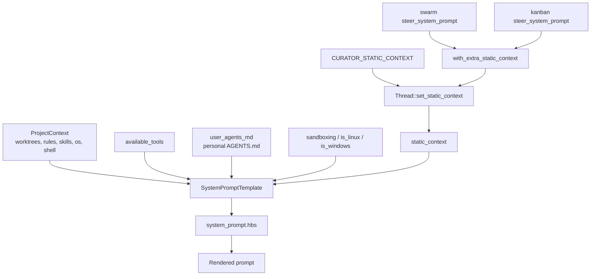

> **Scope:** the agent system prompt only. Verified against zed-kask `HEAD`
> (`47e1c3b1d5`) and upstream Zed `upstream/main` (`6bd93fc319`). Every claim
> here is traceable to a `file:line` or a named test.

## 1. Purpose

This document answers two questions an upstream rebase or a prompt edit has to
answer immediately: **what is the agent system prompt made of**, and **where does
zed-kask deviate from upstream Zed**. It exists because the prompt is a divergence
surface that `DIVERGENCE.md` covers only in passing — the base template is tracked
under D1/D2, but the three overlay prompts had no entry at all until 2026-08-12.

Treating a prompt as a versioned interface with an explicit change log follows
the same reasoning that motivates architecture decision records: the cost of a
change is dominated not by writing it but by later readers reconstructing why it
was made[^nygard-adr]. Prompts are especially prone to this because their
"behaviour" is unobservable from the artifact alone.

## 2. The four prompt surfaces

Upstream Zed renders **one** system prompt. zed-kask renders that same prompt
plus **three overlays**, all delivered through a single channel.

| # | Surface | Location | Size | Scope |
|---|---------|----------|------|-------|
| 1 | Base template | `crates/agent/src/templates/system_prompt.hbs` | 23,949 B / 313 lines | Every thread |
| 2 | Curator overlay | `crates/agent/src/curator_agent_server.rs:37-59` (`CURATOR_STATIC_CONTEXT`) | ~1.1 KB | Curator threads |
| 3 | Swarm Steer overlay | `crates/swarm_panel/src/swarm_panel.rs:126-299` (`steer_system_prompt`) | ~9.7 KB | Swarm panel, Steer mode |
| 4 | Kanban Steer overlay | `crates/kanban_panel/src/kanban_panel.rs:210-245` (`steer_system_prompt`) | ~2.2 KB | Kanban panel, Steer mode |

Upstream's base template is 19,815 B, so zed-kask carries **+4.1 KB** of
fork-specific instruction in the base plus up to ~9.7 KB more when an overlay is
active. The swarm overlay is the largest single instruction block in the system —
roughly 40 % of the base prompt's size.

Overlays are **appended, never substituted**: the Zed coding instructions remain
intact and the overlay adds role and scope on top. `CuratorAgentServer` documents
this explicitly (`curator_agent_server.rs:33-36`). Composing a specialisation onto
a stable base, rather than forking a second full prompt, is the open/closed
principle applied to instruction text — the base is extended without being
modified, so upstream changes to it keep flowing through[^martin-ocp].

## 3. Rendering pipeline

`SystemPromptTemplate` (`crates/agent/src/templates.rs:36-65`) is the Handlebars
render context; `TEMPLATE_NAME` pins it to `system_prompt.hbs` (`:67-69`).



The overlay path is the load-bearing detail: **all three overlays converge on the
single `static_context` field**, so a defect in that one field disables all three
at once. That is exactly what happened (§5.1).

### 3.1 Conditional sections

The prompt is not a static string. Sections appear or vanish based on the render
context, so the model is never told about a capability it does not have — an
application of the principle that an interface should not advertise operations it
cannot honour[^parnas-1972].

| Guard | Line | Effect when false |
|-------|------|-------------------|
| `(gt (len available_tools) 0)` | `:34` | Entire tool-use half is replaced by a no-tools instruction (`:139-145`) |
| `(contains available_tools 'grep')` | `:63` | Drops the grep/find_path search guidance |
| `(contains available_tools 'spawn_agent')` | `:117` | Drops `## Multi-agent delegation` |
| `sandboxing` + `(contains available_tools 'terminal')` | `:159-160` | Drops `## Terminal sandbox` entirely |
| `is_linux` / `is_windows` | `:166`, `:173`, `:190` | Selects the platform-correct writable-temp and network story |
| `model_name` | `:217` | Drops `## Model Information` |
| `has_skills` | `:223` | Drops `## Agent Skills` and the `<available_skills>` catalog |
| `(or user_agents_md has_rules)` | `:271` | Drops `## User's Custom Instructions` |
| `static_context` | `:305` | Drops `## Session Context` |

## 4. Section inventory

Section headings are **identical to upstream** except for two additions. The
divergence is in section *contents*, not structure.

*Scope-exempt from the Sourced-Ideas Mandate: this section is a traceability
matrix over §5's divergences and the template's own headings; it decides nothing.*

| Section | Line | Status vs. upstream |
|---------|------|---------------------|
| Communication | `:3` | Identical |
| Formatting Responses | `:13` | **Modified** (§5.3) |
| Tool Use | `:35` | **Modified** (§5.4) |
| Task Execution | `:49` | **Modified** (§5.2) |
| Searching and Reading | `:56` | Identical |
| Making Code Changes | `:69` | Identical |
| Ambition vs. Precision | `:82` | Identical |
| Validation | `:88` | Identical |
| Fixing Diagnostics | `:96` | Identical |
| Debugging | `:101` | Identical |
| Calling External APIs | `:110` | Identical |
| Multi-agent delegation | `:118` | Identical |
| Final Message | `:133` | Identical |
| System Information | `:147` | Identical |
| Terminal sandbox | `:161` | Identical |
| Model Information | `:218` | Identical |
| Agent Skills | `:224` | **Rewritten** (§5.5) |
| → Multi-skill composition with `skill_bundle` | `:255` | **New section** (§5.6) |
| User's Custom Instructions | `:272` | Identical |
| → Personal `AGENTS.md` | `:277` | Identical |
| → Project Rules | `:287` | Identical |
| Session Context | `:305` | **New section** (§5.1) |

## 5. Divergences from upstream

`git diff upstream/main -- crates/agent/src/templates/system_prompt.hbs` reports
**40 insertions, 6 deletions across 5 hunks**. Each is catalogued below with its
D-seam and its pinning test. Every zed-kask deviation that disables or replaces
upstream behaviour carries a test, per the repo's divergence rule.

### 5.1 `## Session Context` — new section (D2 / D6)

- **zed-kask** `:305-313` renders `{{{static_context}}}`. Field declared at
  `templates.rs:49`.
- **Upstream** has no such block and no `static_context` field.
- **Why:** it is the render target for all three overlays (§2) and for
  `ContextInjector::inject_static_context` (`agent.rs:3007-3015`).
- **Pinned by** `test_system_prompt_renders_session_context_without_rules_or_agents_md`.

**Defect fixed 2026-08-12 — the reason the test exists.** The block was
originally nested *inside* the `{{#if (or user_agents_md has_rules)}}` guard at
`:271`. For any project with no `.rules` file **and** no personal `AGENTS.md`,
`static_context` rendered as nothing — silently dropping the Curator, swarm Steer,
and kanban Steer prompts. It went unnoticed because this repo has a `.rules` file
(making `has_rules` true) and because all eleven pre-existing template tests
passed `static_context: None`. The block is now a **sibling** of that guard. This
is the class of failure that motivates asserting on observable behaviour rather
than on the presence of code: the overlay existed, was wired, and never
arrived[^hunt-thomas-1999].

### 5.2 Loop-termination guardrail — new bullet

- **zed-kask** `:54`: *"If a tool loop repeats without measurable progress (the
  same error recurring or no new state appearing) **three times**, stop, summarize
  what you tried, and ask the user rather than continuing indefinitely."*
- **Upstream** `## Task Execution` ends at its `:51` with no loop bound.
- **Why:** upstream pairs a strong autonomy injunction (`:51-52`, "keep going
  until… completely resolved") with no termination signal. A control loop with no
  bound on corrective action is an unregulated loop; the bound is what makes the
  autonomy safe rather than open-ended[^ashby-1956]. The threshold is a concrete
  count deliberately — "several iterations" left the stop point to model
  discretion, which varied by model.
- **Pinned by** `test_system_prompt_contains_loop_termination_guardrail`, which
  asserts both the sentence and the literal `three times`.

### 5.3 Mermaid diagram-type list (D18)

- **zed-kask** `:26` names the exact directives the renderer accepts —
  `sankey-beta`, `xychart-beta`, `architecture-beta`, `radar-beta`, `treemap`,
  `block`, `kanban` — and separately notes that ` ```graph `, ` ```media `,
  ` ```portfolio `, ` ```scenarios ` fenced blocks are kask viz widgets, not
  mermaid.
- **Upstream** `:26` lists only its thirteen core types.
- **Why:** the renderer's allowlist is `crates/markdown/src/mermaid.rs:428-451`,
  whose comment asked for manual sync with the prompt — and drifted anyway. The
  prompt had advertised bare `sankey`/`xychart`, which the renderer silently
  drops, while denying `kanban` was a mermaid type at all (it is; `mermaid.rs:445`).
- **Pinned by** `test_system_prompt_advertises_every_supported_diagram_type`
  (`mermaid.rs:1252`) — an exhaustive prompt-vs-allowlist check living next to
  the constant, replacing the manual-sync comment. Also
  `test_system_prompt_mermaid_list_uses_renderer_directives` in `templates.rs`.

**Note on `kanban`:** it is *both* a valid mermaid directive *and* a viz-widget
fenced tag. The prompt must disambiguate the two, not deny either.

### 5.4 Media display-hint bullets (D18)

- **zed-kask** `:46-47`: copy the ` ```media ` block from a `display_hint` /
  `display_hints` tool-result field verbatim into the reply.
- **Upstream** has neither bullet.
- **Why load-bearing:** the media block *renderer* lives in
  `hkask_viz_core::block_renderer()` (wired at
  `crates/agent_ui/src/conversation_view.rs:3516`), so the prompt bullets
  remain live for any tool that emits the ` ```media ` fenced block.

### 5.5 `## Agent Skills` — body injection (D1)

This is the largest behavioural divergence in the prompt.

| | Upstream | zed-kask |
|---|---|---|
| What `skill` returns | "the full instructions" (`upstream:223`) | the SKILL.md body, injected via `render_skill_envelope` (`:228`) |
| Model's job | "Follow the instructions in the Skill" (`upstream:244`) | read the injected body and follow it (`:253`) |
| `SKILL.md` body | read it; `read_file` referenced files (`upstream:245`) | **never** read it via `read_file`; `read_file` refuses (`:250`) |

Upstream's step 4 instructs precisely the behaviour zed-kask's `:250` prohibits.
`SKILL.md` in zed-kask is a discovery-only catalog entry; the body is injected via
`render_skill_envelope` when the `skill` tool is invoked — not read via `read_file`.

**This is the progressive disclosure pattern.** Anthropic's Agent Skills use *progressive
disclosure*: only `name` and `description` are preloaded into the system prompt, and
the `SKILL.md` body loads only when judged relevant[^anthropic-skills]. zed-kask
keeps the catalog-in-prompt half and injects the body via the `skill` tool when the
model invokes it. Skill execution is upstream-Zed body injection via `SkillTool::run`
(`crates/agent/src/tools/skill_tool.rs:266`).

**The cost of being one step ahead** is that the model's trained prior — every
other major agent system loads skill bodies as prose — actively pushes against the
invariant. Prompt text alone could not hold it, which is why the prohibition is
now backed by a runtime gate:

- `refuse_skill_catalog_read` (`crates/agent/src/tools/read_file_tool.rs`) returns
  a tool error redirecting the model to the `skill` tool, wired into **both** the
  global-skills fast path and the project-path path.
- Resource files *inside* a skill directory stay readable, so a cascade result can
  legitimately point at a template or reference.
- Blocked attempts log `skill.catalog_read_blocked`. That key is deliberately
  **not** in the `reg.skill.*` namespace, which is reserved for per-skill feedback
  spans and CI-enforced by `kask/scripts/check-skill-span-namespace.sh`.
- Pinned by `test_refuse_skill_catalog_read_redirects_to_skill_tool`,
  `test_refuse_skill_catalog_read_allows_skill_resources_and_other_files`,
  `test_read_file_refuses_global_skill_catalog_entry`, and
  `test_blocked_read_telemetry_key_avoids_reserved_skill_span_namespace`.

Installing the gate is what made it safe to trim ~400 B of justification prose
from this section while making the prohibition *stronger* — a statement of fact
("`read_file` refuses it") rather than a request. The general rule this yielded:
**when prose is the only enforcement of an invariant, the move is never "delete"
or "keep" — it is "install the gate, then delete."** This mirrors the finding that
runtime permission enforcement belongs outside the model's instructions, and that
vendors are explicit about where such enforcement does *not* apply[^augment-permissions].

`:251` retains the no-body fallback for skills with no `SKILL.md` file. It is
unreachable for shipped skills — 60 SKILL.md directories exist in `.agents/skills/`
— but still live for a user-authored or marketplace skill with no body
(`skill_tool.rs:544`).

**Pinned by** `test_system_prompt_skills_section_describes_body_injection`,
which asserts on the *invariant* (a prohibition naming `read_file` and
`SKILL.md`, plus the enforcement claim) rather than one exact sentence, so prose
can be tightened without a false failure.

### 5.6 `skill_bundle` composition — new section (D1)

- **zed-kask** `:255-268` documents `skill_bundle`: use it once for **three or
  more peer-level skills**; use `skill` individually for one, two, or a delegation
  relationship. Output carries `<composition_score>` and `<bundle_manifest>`.
- **Upstream** has no such tool or section.

## 6. Divergence-free sections

Fourteen of the sixteen upstream `##` sections are byte-identical, including all
of `## Terminal sandbox` (`:161-215`) with its platform matrix. This is
deliberate: the fork's leverage is in skill execution and context injection, not
in re-litigating upstream's coding guidance. Keeping unrelated sections identical
is what makes `git merge upstream/main` tractable on this file — every additional
edited line is a future conflict.

*Scope-exempt from the Sourced-Ideas Mandate: this section decides nothing, it
records the absence of change relative to §4's inventory.*

## 7. Rebase procedure for this file

`system_prompt.hbs` is a **shared upstream file with zed-kask edits**, the
highest-conflict category in `DIVERGENCE.md`. The procedure below treats the
pinning tests as the executable record of intent: a merge that silently drops a
divergence fails a named test instead of shipping, which is the regression-test
discipline applied to a vendor-branch merge[^fowler-vendor-branch]. On upstream
sync:

1. Merge normally. Conflicts will land in the five hunks of §5.
2. Re-apply each §5 divergence. The pinning tests are the checklist — run
   `cargo test -p agent --lib templates::` (14 tests) and
   `cargo test -p markdown --lib mermaid` (21 tests). A dropped divergence fails a
   named test rather than silently reverting.
3. If upstream restructures `## Agent Skills`, treat §5.5 as a **re-application**,
   not a merge: the two versions state opposite instructions, so a textual merge
   can produce a prompt that both forbids and requires reading `SKILL.md`.
4. Check `mermaid.rs:428-451` against `:26` — upstream adds diagram types, and the
   drift test will fail until the prompt is updated.

## 8. Verification

Every claim above is checkable. Reproducible commands are given rather than
asserted results, so a reader can falsify this document rather than trust
it[^popper-1959].

```sh
# Structure and size
wc -c crates/agent/src/templates/system_prompt.hbs          # 23949
git show upstream/main:crates/agent/src/templates/system_prompt.hbs | wc -c  # 19815

# The complete divergence
git diff upstream/main -- crates/agent/src/templates/system_prompt.hbs

# The pinning tests
cargo test -p agent --lib templates::                        # 14 pass
cargo test -p agent --lib read_file_tool                     # 27 pass
cargo test -p markdown --lib mermaid                         # 21 pass

# The skill count (60 SKILL.md directories in .agents/skills/)
ls .agents/skills/ | wc -l                                    # 60
```

## References

[^nygard-adr]: Nygard, M. (2011). *Documenting architecture decisions*. https://cognitect.com/blog/2011/11/15/documenting-architecture-decisions.
    Cited for the practice of recording the *why* of a structural decision alongside the artifact; applied here to prompt divergences, which are otherwise unrecoverable from the template alone.

[^parnas-1972]: Parnas, D. L. (1972). On the criteria to be used in decomposing systems into modules. *Communications of the ACM*, 15(12), 1053–1058. https://doi.org/10.1145/361598.361623.
    Cited for information hiding: a module's interface should expose only what callers can act on. The conditional sections apply this to the prompt — the model is told about a tool or sandbox only when it actually has one.

[^ashby-1956]: Ashby, W. R. (1956). *An introduction to cybernetics*. Chapman & Hall. http://pespmc1.vub.ac.be/books/IntroCyb.pdf.
    Cited for regulation requiring a bounded corrective response; the loop-termination guardrail is the bound on an otherwise open-ended autonomy injunction.

[^anthropic-skills]: Anthropic. (2025). *Equipping agents for the real world with Agent Skills*. https://www.anthropic.com/engineering/equipping-agents-for-the-real-world-with-agent-skills.
    Cited for progressive disclosure (name + description preloaded, body loaded on relevance). zed-kask's body injection is this pattern with the body-loading step replaced rather than removed.

[^augment-permissions]: Augment Code. (2025). *Tool permissions*. https://docs.augmentcode.com/cli/permissions.
    Cited for runtime tool-permission enforcement applied per tool call, and for the explicit statement that it is "not enforced in the Augment code extension" — the precedent for backing a prompt-stated invariant with a runtime gate rather than prose.

[^hunt-thomas-1999]: Hunt, A., & Thomas, D. (1999). *The pragmatic programmer: From journeyman to master*. Addison-Wesley.
    Cited for the discipline of testing observable behaviour over implementation presence; §5.1's defect was wired code that produced no output, invisible to every existing test.

[^martin-ocp]: Martin, R. C. (1996). The open-closed principle. *C++ Report*, 8(1). https://web.archive.org/web/20150905081105/http://www.objectmentor.com/resources/articles/ocp.pdf.
    Cited for extension without modification. The overlay channel specialises the base prompt without editing it, which is what keeps upstream's base changes mergeable.

[^fowler-vendor-branch]: Fowler, M. (2020). *Patterns for managing source code branches: Vendor branch*. https://martinfowler.com/articles/branching-patterns.html#vendor-branch.
    Cited for the vendor-branch pattern and the practice of making local deviations from an upstream baseline explicit and re-applicable; §7's per-divergence pinning tests are the mechanical form of that record.

[^popper-1959]: Popper, K. (1959). *The logic of scientific discovery*. Hutchinson. https://doi.org/10.4324/9780203994627.
    Cited for falsifiability as the test of a claim's content. §8 gives commands that can refute this document's assertions rather than restating them as conclusions.
