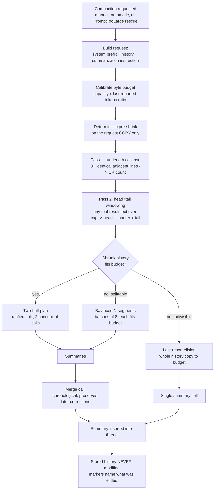

# Compaction Pipeline Specification

Status: ratified 2026-09-29 (operator direction: the deterministic
pre-screening stage must do real work — "use basic logic to create
deterministic steps to clean up… the deterministic linguistic capabilities
are underutilized"). Supersedes the `ThreadCondenser` manual-precompression
hook (D8, `46f9c476a2`), which measurably shrank nothing on real coding
threads: the incident thread's manual compaction request carried 3,187,749
of the turn's 3,247,298 text-input tokens (a 1.8% reduction), because every
deterministic policy exempted exactly the content a coding thread is made
of (protected code-reading tools, JSON, error results, the latest
exchange), and automatic compaction skipped the deterministic stage
entirely.

## Purpose

Compaction replaces a thread's history with an LLM-written summary so the
thread can continue inside the model's context window. The pipeline's job
is to make that rescue **always succeed** (any history size) and **cheap**
(the deterministic stage, not the LLM, removes the bulk). After a
successful compaction, subsequent requests carry the summary instead of
the history — this is what accelerates everything downstream.

## Pipeline

Three entry points trigger the same pipeline:

1. **Manual** — the operator invokes `/compact` (`Thread::compact`, the
   unconditional target).
2. **Automatic** — the threshold check before each request in a turn
   (`perform_compaction_if_needed`, keyed off the last completed request's
   usage vs the effective input ceiling).
3. **PromptTooLarge rescue** (`perform_prompt_too_large_rescue`, 2026-09-29)
   — the provider rejected a turn request because input + output reserve
   exceeded the context window. The threshold check is discrete (it sees the
   *previous* request's usage), so one round whose growth exceeds the
   remaining headroom sails past it; the rescue runs one forced compaction
   and the turn retries against the compacted history. Bounded to one rescue
   episode per turn; gated on auto-compaction being enabled; the turn's
   not-yet-answered prompt stays verbatim after the summary. The rejection's
   reported input-token count is the rescue compaction's calibration
   denominator — at rescue time the last completed request's usage predates
   the growth that caused the rejection, and the 2.0 fallback can
   over-budget token-dense content. Transient failures of the rescue
   compaction retry inside the rescue (the shared `RetryStrategy`
   machinery — the threshold path retries through the turn loop, which the
   rescue cannot use without re-sending the known-oversized request);
   the whole episode is the turn's one rescue. The rescue does
   NOT mark token-limit-exceeded — the synthesized usage would re-fire the
   threshold check on the next loop iteration, and a successful rescue
   refreshes the usage indicator with the retry's real report. Every
   fall-through path (disabled, nothing to summarize, rescue compaction
   failed) keeps the old fatal behavior, including the marking.



## Stage specification

### Stage 0 — Request construction (native, `thread.rs`)

`build_compaction_request` renders the system prefix, the history, and
`COMPACTION_PROMPT` (`crates/agent_settings/src/prompts/compaction_prompt.txt`).
No tools are attached. `thinking_allowed` follows the compaction model's
`supports_thinking` (D38).

### Stage 1 — Budget calibration (`kask_compaction` §2)

- Input capacity: `compaction_input_capacity(max_input_tokens,
  max_total_tokens, max_output_tokens)` of the compaction model.
- Bytes-per-token: the current history's model-visible bytes over the last
  completed request's reported input tokens (cache reads included) — the
  provider's own count of roughly the same content. Trusted only within
  **[1.0, 4.0] bytes/token**; outside that window the denominator is stale
  (e.g. a thread rescued after growing past its window) and the measured
  fallback **2.0** applies (live zed-kask tool output measured 2.0; prose
  runs ~4).
- Budget: `capacity x ratio x 0.85` (safety factor), minus the measured
  per-request overhead (system prefix + instruction + segment-context
  allowance).
- Property: the ratio cancels out of the fit decision — a history is
  segmented exactly when its token count exceeds ~85% of capacity,
  independent of content density. The asymmetry that picks the dense end
  for the fallback: an over-large budget produces a request the provider
  rejects (the failure this pipeline exists to prevent); an over-small
  budget only adds concurrent segments (cheap wall time).
- A capacity below `MIN_COMPACTION_CONTEXT_WINDOW` (80,000 tokens) is not
  a usable budget: no shrink, legacy two-half split, no fit guarantee.

### Stage 2 — Deterministic pre-shrink (`kask_compaction` §1)

Runs on the **request copy only** — the stored thread history is never
modified. Two passes, in order, over every tool-result text between the
system prefix and the instruction:

| Pass | Transform | Policy | Marker |
|------|-----------|--------|--------|
| 1. Run-length collapse | 3+ identical adjacent non-blank lines → one line + exact count | threshold 3; blank runs and unique lines verbatim | `[preceding line repeated N more times]` |
| 2. Head+tail windowing | text over the per-result cap → head half + marker + tail half | cap = `clamp(budget/32, 8 KiB, 64 KiB)`; **no exemptions** — tool name, JSON shape, error state, and position do not change the policy | `[… compaction elided N bytes to fit the context budget; the full text remains in the thread history …]` |

Why windowing and not the condenser's line-selection algorithms: the
flashrank-style mid-content `...` elision corrupts structured output (the
reason `NO_COMPRESS_TOOLS` exists for ingestion), while head+tail
windowing cannot corrupt structure — it is the bounded-display idiom, and
the marker states exactly what was removed and where the full text
remains. The summarizer needs the gist of a 500-line `read_file`, not
every line.

Why no exemptions: the previous policy exempted protected tools, JSON,
errors, and the latest exchange — and thereby exempted ~everything a
coding thread contains, which is why it shrank 1.8% on the incident
thread. On a copy with honest markers, uniform windowing is safe; the
stored original is the ground truth.

### Stage 3 — Planning (`kask_compaction` §3–§5)

Against the **shrunken** layout, at safe boundaries only (a tool call is
never separated from its result; no outstanding tool use at a cut):

- Fits budget → the ratified **two-half** split (byte-midpoint cut).
- Over budget, splittable → **balanced N segments**: with
  `n = ceil(remaining/budget)` segments left, a segment closes at the
  first safe boundary past `remaining/n` bytes, never past budget — no
  single request is near-window when boundaries allow a finer split.
- Over budget, indivisible → **last-resort elision** of the whole history
  copy to budget (the same head+tail primitive).

### Stage 4 — Dispatch and merge (native lifecycle, `thread.rs`)

Segments summarize concurrently in batches of ≤ 8
(`MAX_CONCURRENT_SEGMENT_SUMMARIES`); summaries merge chronologically
through one merge request regardless of completion order. Per-call
high-water usage accounting prevents concurrent streams from being
conflated. Truncation (`StopReason::MaxTokens`) drains final usage but
rejects the summary; empty/failed/cancelled phases never commit a marker.

## Invariants

1. The stored thread history is never modified by planning, shrinking, or
   elision — every transform applies to a request copy.
2. Every elision carries an in-band marker naming the elided byte count
   and where the full text remains.
3. A tool call is never separated from its result.
4. Summaries merge chronologically, preserving later corrections and
   unresolved conflicts (the merge instruction).
5. Failure, cancellation, or truncation at any phase commits nothing.
6. Below the 80K-token compaction floor, behavior is the documented
   legacy two-half split (bytes balance, no token-fit guarantee).

## Observability

`stream_compaction` logs the shrink outcome when it reduced anything:

```
Compaction deterministic pre-shrink: 6_412_331 -> 1_204_882 bytes (81% reduction; 23 results windowed, 4 repeat runs collapsed)
```

A near-zero reduction on a large history is a policy smell an operator
can see directly — the failure mode that hid the previous no-op stage.

## Failure modes

| Mode | Behavior |
|------|----------|
| No usable budget (capacity < 80K tokens) | Legacy two-half split; may exceed the provider limit (documented) |
| Stale calibration denominator | Ratio outside trust window → discarded → 2.0 fallback |
| Content-mix drift after calibration | 0.85 safety factor absorbs it; a segment 400 would surface as a compaction error |
| Segment cannot fit even fully elided | Typed error, surfaced; compaction fails without committing |
| Indivisible history | Single elided call (last resort) |
| Single message larger than the whole window | Unrescuable by design: stored history is never modified and the trailing prompt is preserved verbatim, so the rescue fires, the retry is rejected again, the once-per-turn bound stops a second rescue, and the turn dies with the usage marking |
| Transient failure of the rescue compaction | Retries inside the rescue, bounded by the shared `RetryStrategy` machinery (the threshold path retries through the turn loop; the rescue cannot — the loop-top check will not re-fire, and routing through the loop would re-send the known-oversized request). Permanent errors fail the rescue immediately |

### Interaction inventory

The triggers, the usage marking, and the threshold check interact; these
edges are designed, not accidental:

- **Marking → threshold (fall-through path):** a dead PromptTooLarge turn
  marks synthesized usage; the NEXT turn's threshold check sees it and
  auto-compacts before its first request — the thread self-heals one turn
  later (pinned by `test_prompt_too_large_marking_self_heals_next_turn`).
- **Marking → threshold (rescue path):** the rescue deliberately does NOT
  mark — the synthesized usage would re-fire the threshold check at the top
  of the next loop iteration, compacting a second time over the
  just-compacted window.
- **Reported tokens → calibration (rescue path):** the rejection's parsed
  input-token count is the calibration denominator for the rescue
  compaction; without it the 2.0 fallback can over-budget token-dense
  content and the rescue's own summarization request would be rejected
  (pinned by `reported_token_count_keeps_dense_history_segments_within_capacity`).
- **Rescue → threshold (post-compaction):** the inserted Compaction message
  guards the loop-top check (`compaction_ix > usage_ix` → no-op), so a
  successful rescue cannot trigger an immediate second compaction.

## Reference models

The pipeline is a composition of published techniques; each stage names
its analytical basis:

- **Run-length encoding (RLE)** — the adjacent-repeat collapse is RLE over
  lines: a run of identical symbols becomes one symbol plus a count. The
  count marker preserves the exact repetition magnitude, unlike lossy
  deduplication.
- **Head/tail windowing (bounded-display truncation)** — the per-result
  cap is the standard `head`/`tail` composition used for bounded display
  of bulk text (logs, streams). Chosen over mid-content extractive
  selection because it cannot corrupt structure; the marker carries the
  provenance.
- **Extractive-before-abstractive staging** — the deterministic passes are
  lossy-extractive (they select what the summarizer will see); the LLM
  pass is abstractive (it writes the summary). The staging principle —
  cheap deterministic selection before expensive semantic compression —
  follows the classic extractive-summarization line (Luhn, 1958, "The
  Automatic Creation of Literature Abstracts"), with windowing replacing
  word-frequency saliency because the content is structured, not prose.
- **Map-reduce hierarchical summarization** — segments summarize
  independently (map) and merge chronologically (reduce): the
  divide-and-conquer summarization pattern for documents exceeding a
  model's window (the map-reduce computation pattern: Dean & Ghemawat,
  2004; hierarchical/recursive summarization as used by LLM chaining
  frameworks for long documents).
- **Balanced partitioning / LPT scheduling** — balanced segment packing
  minimizes the largest request (wall time is bounded by the largest
  concurrent call), in the spirit of list-scheduling bounds for
  multiprocessor scheduling (Graham's LPT analysis).
- **Empirical ratio calibration** — the bytes-per-token ratio is fitted
  from the provider's own usage reports rather than assumed, with a
  trust window to reject stale measurements: constant-fitting against
  the authoritative oracle (the provider's tokenizer) instead of a
  guessed constant.

Internal references: `DIVERGENCE.md` D8 (the seam record and its
supersession history), `MIN_COMPACTION_CONTEXT_WINDOW` (the native
auto-compaction floor), the upstream Zed compaction lifecycle
(`stream_compaction` keeps streaming, usage accounting, cancellation,
and summary insertion native), and `hkask-condenser` (the ingestion-time
compressor — a separate consumer with its own protected-tools policy,
`NO_COMPRESS_TOOLS`; it no longer participates in compaction).

## Pins

- `kask_compaction.rs` planner suite: `pre_shrink_windows_oversized_results_and_keeps_small_ones`,
  `pre_shrink_collapses_adjacent_repeats_with_counts`,
  `pre_shrink_has_no_exemptions_on_the_summarizer_copy`,
  `calibration_decides_segmentation_in_tokens_not_bytes`,
  `below_floor_capacity_keeps_legacy_two_half_plan`,
  `replay_only_raw_output_does_not_distort_planning`,
  `two_half_plan_balances_bytes_and_keeps_indivisible_history_single_pass`,
  `sub_cap_over_budget_history_plans_budget_fitting_segments`,
  `oversized_tool_result_is_windowed_not_split`,
  `oversized_indivisible_prose_elides_for_summarizer_only`,
  `balanced_packing_keeps_the_largest_segment_small`,
  `merge_request_lists_summaries_in_chronological_order`.
- `thread.rs` integration (real `Thread::compact` path):
  `test_compaction_pre_shrinks_oversized_tool_results`,
  `test_segmented_compaction_over_budget_history`,
  `test_oversized_indivisible_history_compacts_via_elision`,
  `test_two_half_compaction_runs_concurrently_then_merges_in_order`,
  `test_two_half_compaction_failure_or_cancellation_saves_nothing`,
  `test_manual_compact_forces_summary` (now also proves compaction no
  longer consults the condenser).
- `thread.rs` PromptTooLarge rescue (real `run_turn_internal` path):
  `test_prompt_too_large_rescue_compacts_and_retries` (the rescue fires, the
  turn retries against the compacted history, the turn's prompt stays
  verbatim), `test_prompt_too_large_rescue_is_bound_to_once_per_turn`,
  `test_prompt_too_large_rescue_respects_disabled_auto_compact`,
  `test_prompt_too_large_rescue_retries_transient_compaction_failure`
  (a transient summarization failure retries inside the rescue and the
  turn still completes), `test_prompt_too_large_marking_self_heals_next_turn`
  (the dead-turn marking makes the next turn's threshold check compact
  first).
- `kask_compaction.rs` rescue calibration:
  `reported_token_count_keeps_dense_history_segments_within_capacity`
  (the reported count's plan fits the token capacity on dense content;
  the 2.0 fallback over-plans — the datum is load-bearing).
- `tests/mod.rs` dead-turn marking (fall-through path, auto-compact
  disabled): `test_prompt_too_large_marks_token_usage_exceeded`,
  `test_prompt_too_large_uses_reported_token_count`.
