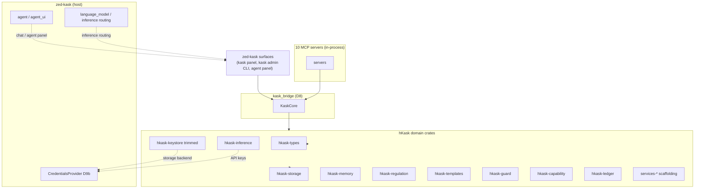

> **Restoration note (2026-07-27):** This file was deleted in commit
> `a32a7847a4` (2026-07-25) and restored from git history on 2026-07-27
> because `DIAGRAMS_INDEX.md`, `corpus.yaml`, and the `tdd`/`diagnose`
> skills cite it as authoritative. Version bumped to 0.31.1 to mark the
> restoration. The file was deleted a second time by another agent and
> restored again.

# MDS — Minimal Domain Specification

**Purpose:** A minimal, capability-driven specification framework for hKask. Specs are grants ("CAN verb on resource via interface"), not fences ("MUST NOT"). Five categories, five tools, one completeness predicate.

**Supersedes:** The previous 9-category DDMVSS. All MDS references in the codebase should be updated.

**Architecture anchor:** [`zed-host-architecture-plan.md`](../zed-host-architecture-plan.md) §2 (essentialist split). hKask is compiled in-process inside zed-kask. The standalone `hkask-api`, `hkask-cli`, `hkask-repl`, `hkask-identity`, `hkask-communication`, `hkask-acp`, and the deleted `hkask-services-*` subcrates (`chat`, `onboarding`, `skill`, `wallet`) are **removed**. Their jobs move to zed-kask surfaces: zed's agent panel (chat), zed's first-launch (onboarding), `hkask-templates`/`ManifestExecutor` (skill execution), and in-process wallet primitives (no service layer). The 29 surviving hKask crates and 10 MCP servers are listed in the architecture plan §2.2/§2.4.

**Related:** [`PRINCIPLES.md`](PRINCIPLES.md), [`magna-carta.md`](magna-carta.md)

---

## 1. Domain Ontology

The domain ontology is grounded in **Ontology Design Pattern (ODP) methodology** as described by Norouzi et al. (2025, arXiv:2509.23776): compact, requirement-driven extraction patterns rather than navigating entire complex ontologies.[^norouzi-odp]

The ontology is re-anchored to the **29 surviving hKask crates** compiled in-process inside zed-kask (see [`zed-host-architecture-plan.md`](../zed-host-architecture-plan.md) §2.2). Deleted crates are not referenced as current; where a deleted crate's job moved to a zed-kask surface, the entity is mapped to that surface.

### 1.1 Core Entities

| Entity | Crate / Surface | Description | Goal Principle |
|--------|-------|-------------|---------------|
| `HumanUser` | zed account (replaces deleted `hkask-identity` user store) | Human identity, role, provider link — owned by zed-kask, not a parallel hKask identity store | P1 |
| `UserPod` | `hkask-types` | Agent identity with persona, voice, wallet link | P6 |
| Per-user data directory | zed-kask (replaces deleted `hkask-pods` `AgentPod`) | Runtime container for a userpod (Inactive\|Active\|ServerMode) — pod abstraction deleted in 2026-07-25 cleanup | P1 |
| `Wallet` | `hkask-regulation::WalletManager` (replaces deleted `hkask-wallet`) | rJoule balance, encumbrance, multi-chain deposits — in-process, no service layer. `gas_per_rjoule` now lives in `regulation::WalletManager` which implements `WalletBudgetPort`. | P9 |
| `ApiKey` | `hkask-types` (wallet types; replaces deleted `hkask-wallet`) | Scoped API key with spending limits and expiry | P1 |
| `hMem` | `hkask-storage` | Entity-Attribute-Value knowledge representation, bitemporal | P3 |
| `RegulationLedger` | `hkask-regulation` | Cybernetic nervous system — variety monitoring, alerts, gas budgets | P9 |
| `GasBudget` | `hkask-regulation` | Per-agent gas budget with cap, replenish rate, hold-settle pattern | P9 |
| `KaskCore` | `kask_bridge` (D8) | In-process handle that MCP servers and zed-kask surfaces use to reach hKask primitives (replaces the deleted `AgentService` orchestration layer) | P5 |

### 1.2 Kata-Kanban Domain

**Crate:** `hkask-services-kata-kanban` | **Goal Principle:** P3 (Generative Space) — Toyota Kata scientific thinking applied through headless kanban task boards. PDCA phases map to task statuses: Plan→Backlog, Do→InProgress, Check→Review, Act→Done.

| Entity | Description | Key Attributes |
|--------|-------------|---------------|
| `Board` | Named task board scoped to owner WebID | `board_id: BoardId`, `name`, `owner: WebID`, `columns: Vec<ColumnDef>` |
| `ColumnDef` | Ordered column on a board representing a workflow phase | `column_id: ColumnId`, `name`, `status: TaskStatus`, `wip_limit: Option<u32>` |
| `Task` | Unit of work with status lifecycle, priority, verification criteria | `task_id: TaskId`, `title`, `status: TaskStatus`, `priority: Priority`, `owner: WebID`, `board_id: BoardId` |
| `Priority` | Task urgency level | `Low \| Medium \| High \| Critical` |
| `TaskStatus` | Strict column-ordered lifecycle state | `Backlog → Ready → InProgress → Review → Done` |
| `VerificationCriterion` | Acceptance spec with optional LLM evaluation prompt | `description: String`, `llm_prompt: Option<String>` |
| `KataEngine` | Orchestrates kata cycles (starter, improvement, coaching) | `state: KataState`, `manifest: KataManifest` |
| `KataState` | Current state of a kata practice cycle | `step_outputs: HashMap`, `learner_bot: String`, `context: HashMap` |
| `KataManifest` | Declarative definition of a kata (steps, coaching questions, routines) | `manifest: ManifestMeta`, `gas: KataGasConfig`, `steps: Vec<KataStep>` |
| `KataStep` | A single step in a kata improvement cycle | `ordinal: u32`, `action: String`, `description: String` |

**5 coaching kata questions:** (1) Target condition? (2) Actual condition now? (3) What obstacles? Which ONE? (4) Next step? What do you expect? (5) How quickly can we go and see?

**Regulation spans:** `reg.kata` — KataImprovEffectiveness, coaching loop events; `reg.kanban` — TaskCreated, TaskMoved, TaskAssigned, TaskVerified, BoardCreated

**Key contracts:** 34 `KAN-SVC-*` IDs (migration in progress), 27 `P{N}-svc-kata-*` IDs

### 1.3 Adapter Domain

**Crate:** `hkask-mcp-training::adapter` | **Goal Principle:** P3 (Generative Space) — LoRA adapter lifecycle management for agent-specialized inference

| Entity | Description | Key Attributes |
|--------|-------------|---------------|
| `TrainedLoRAAdapter` | A trained LoRA adapter with provenance metadata | `id: Uuid`, `source: AdapterSource`, `checksum: Checksum`, `expertise: Expertise`, `owner: WebID`, `skill_name: Option<String>`, `lifecycle: AdapterLifecycle` |
| `AdapterSource` | Provenance of the adapter | `HuggingFace { repo }` |
| `AdapterStore` | CRUD store for trained adapters with checksum verification | Store, get_by_id, get_by_expertise, get_by_skill_name, list_all, list_owner, delete, store_blob, get_blob |
| `AdapterRouter` | Routes inference requests to the best-matching adapter | CompositionEstimate, provider selection, endpoint guard |
| `EndpointLifecycle` | State machine for inference endpoint lifecycle | `EndpointPhase`: `Cold \| Warming \| Active \| Draining \| Removed` |
| `EndpointPhase` | Lifecycle phase of a deployed inference endpoint | `Cold → Warming → Active → Draining → Removed` |
| `AdapterConfig` | Configuration for adapter deployment | `model_id`, `base_url`, `timeout_secs`, `max_concurrency` |
| `Expertise` | Describes the domain expertise of a trained adapter | `domains: Vec<MdsDomain>`, `provenance: TrainingProvenance`, `capabilities: Vec<String>` |
| `CompositionEstimate` | Cost/time estimate for adapter composition | `estimated_cost_rj: f64`, `estimated_latency_ms: u64` |
| `ProviderSelection` | Selected inference provider for an adapter endpoint | `provider: String`, `model: String`, `cost_per_token_rj: f64` |

**Regulation spans:** `reg.adapter` — AdapterStored, AdapterRetrieved, AdapterDeleted, endpoint lifecycle transitions

**Key contracts:** 44 pub fns with `expect:` + `[P{N}]` annotations

### 1.4 Service Layer Subsystems (in-process)

**Crate:** `hkask-services-core` + surviving specialized subcrates | **Goal Principle:** P5 (Essentialism) — thin scaffolding the in-process MCP servers depend on until the T3.0 refactor lands, at which point MCP servers take direct `KaskCore` handles and these dissolve.

The deleted subcrates (`hkask-services-chat`, `hkask-services-onboarding`, `hkask-services-skill`, `hkask-services-wallet`) are **removed**. Their jobs moved to zed-kask surfaces:

| Deleted subcrate | Job moved to |
|------------------|--------------|
| `hkask-services-chat` | zed's agent panel (`crates/agent`, `agent_ui`) — zed owns chat |
| `hkask-services-onboarding` | zed's first-launch flow — zed owns onboarding |
| `hkask-services-skill` | `hkask-templates` / `ManifestExecutor` (D1) — skill execution is native, no service layer |
| `hkask-services-wallet` | In-process wallet primitives (`hkask-regulation::WalletManager` + `hkask-ledger`); no service layer — consumers compose `WalletManager` + `ApiKeyIssuer` + Regulation directly (`hkask-wallet` deleted; `gas_per_rjoule` moved to `regulation::WalletManager`) |

Surviving subcrates (kept temporarily while MCP servers depend on them; dissolve at T3.0):

| Subcrate | Domain | Contract Prefix | Count | Status |
|----------|--------|----------------|-------|--------|
| `hkask-services-core` | Foundation: config, error types, settings | — | — | ✅ Decomposed |
| `hkask-services-compose` | Template composition | — | — | ✅ Decomposed |
| `hkask-services-context` | Service context and contract monitoring (stripped: identity/communication/matrix/daemon modules deleted; governance + guards kept) | `P{N}-svc-context-*` | 31 | ✅ Realigned |
| `hkask-services-corpus` | Content corpus: discovery + embed | `P{N}-svc-corpus-*` | 30 | ✅ Realigned |
| `hkask-services-kata-kanban` | Toyota Kata + Kanban board coordination | `P{N}-svc-kata-*` / `KAN-SVC-*` | 61 | ⚠️ Migration in progress |
| `hkask-services-runtime` | Runtime services: classify + guard + provider_intel (daemon_impl module deleted) | `P{N}-svc-runtime-*` | 13 | ✅ Realigned |
| ~~`hkask-services-self-heal`~~ (deleted) | Cross-domain self-healing coordination — deleted in 2026-07-25 cleanup | — | — | ✅ Deleted |
| `hkask-services-inference` | Inference orchestration scaffolding | `P{N}-svc-inference-*` | 7 | ✅ Realigned |
| `hkask-inference` | Inference routing primitives (InferenceRouter, EmbeddingRouter, ProviderId) — reads API keys from zed `CredentialsProvider` (D9b) (MCP-server-internal only; user-facing inference is zed's `LanguageModelRegistry` via `kask_bridge` D4/D8) | `P{N}-svc-inference-*` | 7 | ✅ Realigned |

---

## 2. Five Categories

| # | Category | Completeness Predicate | Min Artifacts | Cross-References |
|---|----------|----------------------|---------------|-----------------|
| 1 | **Domain** | Every entity has a named term and a bounded-context map | Domain ontology sketch | → Composition (verbs), → Lifecycle (persistence) |
| 2 | **Composition** | Every domain verb has a granted composition, registered interface, and composable path | Capability grant table, interface equivalence matrix, registry schema | → Domain (ontology), → Trust (tokens) |
| 3 | **Trust** | Every capability operation has a threat-model entry and an OCAP-bound mitigation | Threat model, keystore config, capability attenuation policy | → Composition (capabilities), → Lifecycle (audit) |
| 4 | **Lifecycle** | Bootstrap, evolution, deprecation, lifecycle, and persistence are expressible as spec transitions | Bootstrap manifest, evolution rules, deprecation policy, Regulation span registry | → Domain (entities), → Trust (audit) |
| 5 | **Curation** | Every spec artifact has been evaluated for coherence by a curator with documented rationale | Curation decision log, coherence score | → Domain (grounding), → Lifecycle (health) |

[^evans-ddd]: Evans, Eric. *Domain-Driven Design: Tackling Complexity in the Heart of Software.* Addison-Wesley, 2003. — Bounded contexts, ubiquitous language, and the domain model that MDS categories extend.

---

## 3. Completeness Predicate

```
complete?(G, category) :=
  ∀ goal ∈ G[category]:
    ∃ criterion ∈ goal.criteria:
      criterion.satisfied = true
  ∧ ∀ cross_ref ∈ G[category].cross_references:
    complete?(G, cross_ref.target_category)

curated?(G) :=
  coherence_score(G.artifacts) ≥ threshold
  ∧ ∀ artifact ∈ G.artifacts:
    curation_decision ∈ {Accept, Revise, Reject}
    ∧ decision.rationale documented
```

A goal-set G is **MDS-complete** iff `complete?(G, c)` holds for all 5 categories **and** `curated?(G)` holds.

Curation decisions (Accept/Revise/Reject) are made by the Curator or human — not by any automated tool. The QA system validates coherence; the Curator makes decisions.

[^hoare-triple]: Hoare, C.A.R. "An Axiomatic Basis for Computer Programming." *Communications of the ACM*, 1969. — The {P} C {Q} Hoare triple that inspires MDS's completeness predicate: precondition → command → postcondition.

---

## 4. Spec Operations & QA Integration

Specifications are managed through in-process surfaces plus QA validation. The standalone `hkask-cli` `kask spec` subcommands and the `hkask-api` REST endpoints are **deleted**. Spec capture/list/validate/cultivate now run through the in-process `kask` admin CLI and the curator MCP server; MCP does not expose spec capture/list/validate/cultivate beyond surfacing spec drift via the Curator server.

### 4.1 In-Process CLI Surface (`kask spec`)

Thin passthrough to `SpecStore` in `hkask-storage`. No intermediate service layer — the in-process `kask` admin CLI builds `Spec` domain objects and persists them directly. (This is **not** the deleted `hkask-cli` — it is the slimmer zed-kask `kask` admin CLI for backup/wallet/repair/admin, which also exposes spec operations.)

| Command | Operation | Delegate |
|---------|-----------|----------|
| `kask spec capture` | Create a spec with name, category, domain, criteria | `SpecStore::save()` |
| `kask spec list` | List specs, optionally filtered by MDS category | `SpecStore::list_all()` / `list_by_category()` |
| `kask spec validate` | Evaluate a single spec via `DefaultSpecCurator::evaluate()` | Curator agent |
| `kask spec cultivate` | Validate + display per-category coherence requirements | Curator agent |
| `kask spec render` | Render a spec through a Jinja2 template | `minijinja` + `SpecStore::load()` |

### 4.2 In-Process Surface (no HTTP API)

The deleted `hkask-api` REST endpoints (`GET /api/specs`, `POST /api/specs/capture`, etc.) are **removed**. There is no standalone HTTP API server in zed-kask. Spec reads/writes go through the in-process `SpecStore` directly, invoked by:

- the `kask` admin CLI (above),
- the curator MCP server (for drift surfacing),
- zed-kask surfaces (kask panel) that hold an in-process handle.

All consumers share the same `SpecStore` backend and the same `Spec` / `GoalSpec` / `SpecCategory` / `SpecId` domain types from `hkask-storage::spec_types` — no service-layer intermediary, no HTTP transport.

### 4.3 QA Integration (planned)

Spec validation, coherence checking, and quality assessment will move into the QA system when `kask qa spec-check` is built. Currently, spec validation runs through `DefaultSpecCurator::evaluate()` directly.

| Command | Operation | Status |
|---------|----------|--------|
| `kask qa spec-check` | Full collection check: category coverage + per-spec quality | Not yet built |
| `kask qa spec-check --spec-id <uuid>` | Single-spec validation via `DefaultSpecCurator::evaluate()` | Not yet built |

### 4.4 Replica Integration (`corpus_rewrite`)

The Gentle-Lovelace prose rewriting capability lives in `hkask-mcp-corpus` as the `corpus_rewrite` tool. It takes a passage/code snippet + quality dimension (gentle/schriver/hopper/lovelace/composite) and delegates to `ComposeService::compose()` with dimension-specific prompts.

| Tool | Server | Description |
|------|--------|-------------|
| `corpus_rewrite` | `hkask-mcp-corpus` | Rewrite prose optimized for a Gentle Lovelace quality dimension |
| `corpus_compose` | `hkask-mcp-corpus` | Generate prose in any author's style (underlying engine) |
| `corpus_compare` | `hkask-mcp-corpus` | Evaluate document against persona centroids (per-dimension scoring) |

### 4.5 The Spec Store

The canonical persistence surface is `hkask_storage::SpecStore` (implemented by `SqliteSpecStore`). All spec operations — in-process CLI, curator MCP, and QA — read and write through this single interface. Domain types (`Spec`, `GoalSpec`, `SpecCategory`, `SpecId`) live in `hkask-storage::spec_types`.

```
kask CLI ──→ SpecStore ──→ SQLite
Curator MCP ──→ SpecStore ──→ SQLite
QA  ──→ SpecStore ──→ SQLite  (spec-check)
     ──→ DefaultSpecCurator  (validation)
```

---

### 4.6 Replica Server Tools

The replica server provides 9 tools for style corpus management, prose generation, and author comparison:

| Server | Tools | Domain | Status |
|--------|-------|--------|--------|
| `hkask-mcp-corpus` | `corpus_build_persona`, `corpus_compose`, `corpus_rewrite`, `corpus_mashup`, `corpus_compare`, `corpus_registry`, `corpus_explain`, `corpus_discover`, `corpus_cache_work`, `corpus_convert`, `corpus_ocr`, `corpus_chunk`, `corpus_tag_chunks`, `corpus_embed`, `corpus_extract_triples`, `corpus_dedup_chunks`, `corpus_consolidate_chunks`, `corpus_build_prompts`, `corpus_generate_qa`, `corpus_generate_qa_batch`, `corpus_ingest_qa`, `corpus_prepare_training_dataset`, `corpus_cache`, `corpus_query`, `corpus_clear_index`, `corpus_purge_qa` | Corpus gathering + processing + QA generation + style replication | ✅ Implemented |

### 4.7 Replica Exemplar Architecture

The replica system models a **human exemplar** — a named individual whose body of work constitutes a representational corpus. The logical validity of the replica derives from the relationship between the human and their work: the corpus *is* the evidence of their voice, style, and intellectual framework. Each passage is a sample of that relationship.

**Corpus sources by exemplar type:**

| Exemplar type | Discovery | Source examples | Status |
|--------------|-----------|----------------|--------|
| Public domain author | Static YAML (`works:` list pointing to Gutenberg URLs) | Hemingway, Woolf, Austen, Wilde, Twain, Grant, Christie, Eliot | ✅ Implemented |
| Mashup persona | Two-author centroid interpolation; exemplars drawn from both source corpora | Jane Wilde (Austen×Wilde), Ulysses S. Twain (Grant×Twain), Agatha Eliot (Christie×Eliot) | ✅ Implemented |
| Academic author | Dynamic corpus discovery via research MCP tools; disambiguation required | "David Dunning" → "David Dunning, University of Michigan" | 🔮 Planned |

### Academic Author Pipeline (Planned)

For academic exemplars, the corpus is not statically declared — it is discovered dynamically through the existing research infrastructure. The research MCP server (`hkask-mcp-research`) provides tools that can discover, extract, and cache academic content without replicating infrastructure:

| Research tool | Role in corpus discovery |
|--------------|--------------------------|
| `web_search` | Find the author's papers, talks, interviews, and profiles across the open web |
| `web_extract` | Download full-text content from discovered URLs (papers, transcripts, blog posts) |
| `web_find_similar` | Expand the corpus by finding related work and responses to the author |
| `web_browse` | Navigate academic profiles (Google Scholar, Semantic Scholar, arXiv author pages) to enumerate works |

The planned `corpus_discover` tool would orchestrate this pipeline:

1. **Name disambiguation**: Given a name (e.g., "David Dunning"), search academic and open sources, present candidate matches to the Curator for confirmation. This is a consent boundary — the Curator selects *which* David Dunning.
2. **Work enumeration**: From the confirmed identity, enumerate their known works across sources (arXiv, Semantic Scholar, open web, institutional pages, conference proceedings, transcripts).
3. **Content acquisition**: Download and cache each work via `web_extract`, producing `.cache/{slug}.txt` files mirroring the public-domain author pattern.
4. **Corpus config generation**: Produce a `corpus.yaml` with the discovered works, ready for `corpus_build_persona`.
5. **Embedding and replication**: Standard pipeline from this point forward — chunk, tag, embed, store hMems, compute centroid.


---

## 5. Capability-Driven Model

MDS is capability-driven, not constraint-driven:

| Aspect | Constraint-Driven | MDS (Capability-Driven) |
|--------|-------------------|-------------------------|
| Spec as | Fence ("MUST NOT") | Grant ("CAN verb on resource via interface") |
| Validation | Static checks, lints | Composability test, POLA audit |
| Growth | Add constraints | Compose capabilities |
| Lifecycle | Governed (gates) | Curated (invitations) |
| Failure mode | Over-constrained | Under-governed |
| hKask alignment | — | OCAP, capability tokens, attenuation |

[^ocap]: Miller, M. (2006). *Robust Composition: Towards a National Research Agenda for Object Capability Security.* HP Labs. — Object capability model: access is granted by possession of a capability token.

---

## 6. MDS Cycle

```
MDS_cycle(S, D) :=
  let spec = capture(D)            // Build Spec from domain description
  store.save(spec)                 // Persist via SpecStore
  curate(spec)                     // Validate via DefaultSpecCurator
  qa spec-check                    // Category coverage + quality gate
  human_or_curator decides:        // External governance
    Accept | Revise | Reject
```

Spec capture and listing go through `SpecStore` directly. Validation and curation delegate to `DefaultSpecCurator`. Collection-wide health checks run through `kask qa spec-check`. Curation decisions remain external.

[^beck-tdd]: Beck, Kent. *Test-Driven Development: By Example.* Addison-Wesley, 2003. — The red-green-refactor cycle that MDS's capture→decompose→validate→curate cycle parallels.

---

## 7. Template Manifests

Each category has a minimal YAML template. All use `schema_version: "0.30.0"`.

### 7.1 Domain Spec Template

```yaml
schema_version: "0.30.0"
category: domain
domain_anchor: hkask
bounded_context: "..."

ontology:
  entities:
    - name: Agent
      attributes: [webid, capabilities, persona]

focusing_assumptions:
  - id: FA-D1
    statement: "..."
    rationale: "..."

completeness_checklist:
  - "Every entity has a named term"
  - "Bounded-context map exists"

cross_references:
  - category: composition
    relation: "Entities expose composable verbs"
  - category: lifecycle
    relation: "Entity state persisted across lifecycle"
```

### 7.2 Composition Spec Template

```yaml
schema_version: "0.30.0"
category: composition
domain_anchor: hkask

verb_inventory:
  - verb: invoke_tool
    resource: McpServer
    interface: [mcp, cli, in_process]
  - verb: render_template
    resource: Template
    interface: [mcp, cli, in_process]

interface_equivalence:
  mcp: true
  cli: true
  in_process: true
  equivalent: true  # All three exercise same functional core

registry:
  type: unified
  discriminator: template_type
  cascade_depth_max: 7

ocap_policy:
  attenuation_max: 7
  token_ttl_seconds: 3600
```

> **Note:** The `api` interface column from the pre-fork template is **removed** (the standalone `hkask-api` HTTP server is deleted). It is replaced by `in_process`, reflecting zed-kask's in-process composition root. MCP and CLI remain as equivalent surfaces to the same functional core.

### 7.3 Trust Spec Template

```yaml
schema_version: "0.30.0"
category: trust
domain_anchor: hkask

threat_model:
  adversaries:
    - name: malicious_template_author
      vector: template_injection
      mitigation: `minijinja` Rust sandbox (no filesystem/Python access, unlike Python Jinja2) + capability_gating[^minijinja]
    - name: compromised_dependency
      vector: supply_chain
      mitigation: cargo_deny + pinned_versions

ocap_boundaries:
  - "Every resource access passes through require_capability + require_sovereignty"
  - "Tokens are unforgeable, attenuating, no admin override"

keystore:
  encryption: AES-256-GCM
  key_derivation: Argon2id + HKDF-SHA256
  storage: OS_keychain + SQLCipher
  sovereignty_backend: zed CredentialsProvider (kask namespace, D9b)
```

### 7.4 Lifecycle Spec Template

```yaml
schema_version: "0.30.0"
category: lifecycle
domain_anchor: hkask

bootstrap:
  sequence: [resolve_secrets, open_databases, build_kask_core, start_loops]

evolution:
  versioning: git_sha_only
  migration: "Schema migrations run on version bump"

deprecation:
  policy: "Prefer deletion over deprecation (P5)"

observability:
  reg_spans:
    - namespace: reg.tool
      covers: "Tool invocation governance"
    - namespace: reg.inference
      covers: "Inference budget tracking"
  variety_counters:
    - counter: tool_diversity
      threshold: 50
    - counter: template_diversity
      threshold: 30
  algedonic:
    trigger: "variety_deficit > threshold"
    escalation: "Curator → Human"

persistence:
  engine: SQLite + SQLCipher
  schema: bitemporal_triples
  vector_store: sqlite-vec
  memory_pipelines:
    - name: episodic
      visibility: private
    - name: semantic
      visibility: public
```

> **Note:** The bootstrap sequence's `build_service_context` step is renamed `build_kask_core` to reflect the in-process `KaskCore` composition root (replacing the deleted `AgentService` orchestration layer). No daemon, no Matrix transport, no HTTP server in the bootstrap path.

### 7.5 Curation Spec Template

```yaml
schema_version: "0.30.0"
category: curation
domain_anchor: hkask

curation_model:
  decisions: [Accept, Revise, Reject]
  curator:
    type: Daemon
    authority: "Human-augmented — curator proposes, human decides"
  guidance: |
    Accept — spec is coherent and complete, publish it.
    Revise — spec needs work, return with rationale.
    Reject — spec is not useful, remove it.

coherence_metric:
  method: "Jaccard similarity of declared vs. registered verbs"
  threshold: 0.7
```

[^fowler-poeaa]: Fowler, M. (2002). *Patterns of Enterprise Application Architecture.* Addison-Wesley. — Template pattern: a standard structure that captures domain knowledge in a reusable form.

---

## 8. Testing Protocol

### Principles

1. **Contract-anchored:** Every test verifies a behavioral contract via `expect:` + `[P{N}]` annotations.
2. **Public seam only:** Tests verify behavior through public interfaces, not implementation.
3. **Tracer bullet:** One RED→GREEN cycle per behavior. No horizontal slicing.
4. **Category coverage:** Each MDS category has at least one integration test.

### Category → Test Strategy

| Category | Test Strategy |
|----------|--------------|
| Domain | Entity definition + term validation |
| Composition | Capability composition + interface equivalence verification |
| Trust | OCAP boundary enforcement + threat model audit |
| Lifecycle | Bootstrap + evolution + deprecation + Regulation span emission |
| Curation | Coherence scoring + decision rationale documentation |

[^principles-p8]: hKask Team. (2026). *Architecture Principles — P8.* `docs/architecture/core/PRINCIPLES.md` (P8) — Every `#[test]` verifies a stated behavioral property of a public seam.

---

## 9. Documentation Structure

> **Incorporated from:** `docs/specifications/specs/MDS_SCAFFOLD.md`

### 9.1 Category → Directory Mapping

Where each MDS category's authoritative documents live:

| # | MDS Category | Primary Directory | Key Documents |
|---|--------------|-------------------|---------------|
| 1 | **Domain** | `architecture/` | MDS.md, zed-host-architecture-plan.md |
| 2 | **Composition** | `architecture/` | MDS.md, zed-host-architecture-plan.md §Four-Loop Architecture |
| 3 | **Trust** | `architecture/` | magna-carta.md, PRINCIPLES.md |
| 4 | **Lifecycle** | `architecture/` + `plans/` | MDS.md, deployment-and-backup.md |
| 5 | **Curation** | `architecture/` + `specifications/` | WRITING_EXCELLENCE.md, DOCUMENTATION_STANDARDS.md |

**Rule:** New documents go in the directory of their primary MDS category. Cross-cutting documents go in the directory of their dominant category.

### 9.2 Document Lifecycle

```
Draft → Active → Deprecated → Superseded → Removed
```

| State | Rule |
|-------|------|
| **Active** | Must map to ≥1 MDS category via `mds_categories` frontmatter |
| **Deprecated** | Move to `docs/archive/YYYY-MM-DD-<label>/` |
| **Superseded** | Move to archive; successor must reference it |
| **Removed** | `git rm` from working tree; git history is archive of record |

### 9.3 Verification

```bash
bash docs/ci/check-links.sh    # Zero broken cross-references
```

---

## 10. References

[^w3c-rdf]: W3C. (2014). *RDF 1.1 Concepts and Abstract Syntax*. <https://www.w3.org/TR/rdf11-concepts/>.
[^miller-robust]: Miller, M. S. (2006). *Robust Composition: Towards a Unified Approach to Access Control and Concurrency Control*. Johns Hopkins University.
[^cockburn-hexagonal]: Cockburn, A. (2005). *Hexagonal Architecture*. <https://alistair.cockburn.us/hexagonal-architecture/>.
[^shostack-threat]: Shostack, A. (2014). *Threat Modeling: Designing for Security*. Wiley.
[^ronacher-jinja2]: Ronacher, A. (2026). *Jinja2 Template Designer Reference*. <https://jinja.palletsprojects.com/>.
[^norouzi-odp]: Norouzi, M. et al. (2025). "STAR: Seed Terms And Relationships — Ontology Design Pattern Extraction." arXiv:2509.23776.
[^minijinja]: minijinja crate. <https://crates.io/crates/minijinja>. Rust-native Jinja2-compatible template engine with sandbox by default — no Python runtime, no filesystem access, no network access.
[^fowler-strangler]: Fowler, M. (2004). "StranglerFigApplication." martinfowler.com. <https://martinfowler.com/bliki/StranglerFigApplication.html>.
[^conway]: Conway, M. E. (1968). "How Do Committees Invent?" Datamation, 14(4), 28-31.
[^ousterhout]: Ousterhout, J. (2018). *A Philosophy of Software Design*. Yaknyam Press.

---

*MDS v0.31.0 — five categories, SpecStore + QA. Re-anchored to the 29 surviving hKask crates compiled in-process inside zed-kask; standalone `hkask-api` / `hkask-cli` / deleted `hkask-services-*` subcrates removed from the ontology.*

---

## KaskCore Composition Root (replaces the deleted AgentService specification)

> **Supersedes:** the pre-fork `AgentService Specification` (incorporated from `docs/specifications/specs/MDS-agent-service.md`). The standalone `AgentService` orchestration layer, the `hkask-cli` `ReplState` wrapper, and the `hkask-api` `ApiState` wrapper are **deleted**. In zed-kask, the in-process composition root is `KaskCore`, exposed via `kask_bridge` (D8).

**Purpose:** `KaskCore` is the in-process handle that zed-kask surfaces (kask panel, `kask` admin CLI) and MCP servers use to reach hKask primitives. It owns shared infrastructure (storage, regulation, memory, templates, wallet primitives) and exposes them through a small interface. There is no daemon, no HTTP server, no Matrix transport, no REPL state wrapper.

### Bounded Context

`KaskCore` is the **single in-process source of truth** for shared hKask infrastructure inside zed-kask. **Boundary:** In-process only. MCP servers reach it via `kask_bridge` (D8) — they do **not** link zed-kask crates directly (P1 Prohibition — out-of-process isolation preserved at the MCP boundary). zed-kask surfaces reach it via the guard layer (D4) and the in-process transport (D1–D3).

### Public Surface (grouped by concern)

| Group | Members | Notes |
|-------|---------|-------|
| **Construction** | `KaskCore::build(config)` | Assembles storage, regulation, memory, templates, wallet primitives, MCP runtime |
| **Storage** | `storage()`, `spec_store()` | `hkask-storage` handles (SQLCipher-encrypted) |
| **Regulation** | `ledger()`, `cybernetics()`, `loops()`, `energy()`, `tool_stats()` | `hkask-regulation` handles |
| **Memory** | `build_per_agent_memory(db, sink)`, `per_agent_memory(agent)`, `consolidate_agent_memory(agent, request)`, `consolidation_status_for(agent)` | `hkask-memory` handles — single OCAP-gated, consent-checked consolidation entry point |
| **Templates** | `templates()`, `manifest_executor()` | `hkask-templates` — skill execution (D1) |
| **Wallet** | `wallet_manager()`, `api_key_issuer()` | `hkask-regulation::WalletManager` primitives (replaces deleted `hkask-wallet`) — no service layer; consumers compose directly. `gas_per_rjoule` now lives in `regulation::WalletManager` which implements `WalletBudgetPort`. |
| **Identity** | `webid()` | WebID for the active user/curator data directory |
| **Inference** | `inference_port()`, `gas_remaining()`, `gas_cap()` | `hkask-inference` — reads API keys from zed `CredentialsProvider` (D9b) |
| **Guard** | `governed_tool(webid)`, `guard_strategy()` | `hkask-guard` (D4) — Magna Carta floor in the inference path |

**Design rationale:** `KaskCore` groups domain-coherent infrastructure into deep modules (Ousterhout). Cross-cutting concerns (gas, governed tool, per-agent memory consolidation) remain direct methods because they span multiple sub-systems or require coordination logic. The deleted `AgentService`'s nested sub-context structs (`InfraContext`, `GovernanceContext`, `StorageContext`) are absorbed into `KaskCore`'s grouped accessors — the daemon/Matrix/a2a fields that existed only for the deleted standalone surfaces are **removed**. The `RegulationContext` struct was also deleted in the 2026-07-25 cleanup.

### Crate-to-Domain Mappings (surviving crates only)

| Crate | MDS Category | Key Entities |
|-------|-------------|-------------|
| `hkask-types` | Domain | IDs, `InferencePort` trait, `RegulationSpan`, vocab, `UserPod` |
| `hkask-storage` | Domain, Lifecycle | `hMem`, `SpecStore`, `WalletStore`, per-user SQLCipher private sphere |
| `hkask-memory` | Domain, Curation | Semantic/episodic memory, consolidation, hMem coherence |
| `hkask-regulation` | Lifecycle, Trust | `RegulationLedger`, `GasBudget`, `CyberneticsLoop`, variety/algedonic, `WalletManager` (implements `WalletBudgetPort`; `gas_per_rjoule` tracking) |
| `hkask-templates` | Composition | `ManifestExecutor`, registry, cascade, PDCA — skill execution (D1) |
| ~~`hkask-pods`~~ (deleted) | Domain | `AgentPod`, Curator, deployment — deleted in 2026-07-25 cleanup; `VoiceDesign` moved to `hkask-types`; Curator agent now lives in zed-kask |
| `hkask-guard` | Trust | Magna Carta floor (P3.1) — guard layer in zed-kask's inference path (D4) |
| `hkask-capability` | Trust | OCAP — sovereignty enforcement, capability tokens |
| `hkask-keystore` (trimmed) | Trust | Sovereignty crypto only: OCAP signing, DB passphrase, internal-secret derivation. Storage backend → zed `CredentialsProvider` (D9b) |
| ~~`hkask-wallet`~~ (deleted) | Trust | `WalletManager`, `ApiKeyIssuer`, rJoule balance, deposits, withdrawals — deleted in 2026-07-25 cleanup; `gas_per_rjoule` moved to `regulation::WalletManager` which implements `WalletBudgetPort`; wallet types live in `hkask-types` |
| `hkask-ledger` | Trust, Lifecycle | hMem accounting, double-entry ledger |
| `hkask-inference` | Composition | `InferenceRouter`, `EmbeddingRouter`, `ProviderId` — reads keys from `CredentialsProvider` (D9b) (MCP-server-internal only; user-facing inference is zed's `LanguageModelRegistry` via `kask_bridge` D4/D8) |
| `hkask-mcp-server` (framework) | Composition | `reg.tool.*` + OCAP gating for the 10 MCP servers |
| `hkask-forecast` | Domain | Forecast domain logic |
| `hkask-goal` | Domain | Goal analysis, completion verification |
| `hkask-condenser` | Curation | Context condensation |
| ~~`hkask-git-cas`~~ (deleted) | Lifecycle | Content-addressed storage over git — deleted in 2026-07-25 cleanup; `GitCASPort` trait deleted from `hkask-types`; `HMemEntry` moved to `hkask-types` |
| `hkask-bridge-dublincore` | Curation | Dublin Core metadata bridging |
| ~~`hkask-test-harness`~~ (deleted) | (test infra) | Test infrastructure — deleted in 2026-07-25 cleanup; `ExpectProposal` moved to `hkask-types` |
| `hkask-mcp` | Composition | MCP governance |
| `hkask-services-core` | Domain | Foundation: config, error types, settings (dissolves at T3.0) |
| ~~`hkask-services-self-heal`~~ (deleted) | Lifecycle | Cross-domain self-healing coordination — deleted in 2026-07-25 cleanup |
| `hkask-services-inference` | Composition | Inference orchestration scaffolding (dissolves at T3.0) |
| `hkask-services-kata-kanban` | Domain, Curation | `KataEngine`, `KataManifest`, `Board`, `Task`, Kanban coordination |
| `hkask-services-runtime` | Lifecycle | `ClassifyService`, guard, provider_intel (daemon_impl deleted; dissolves at T3.0) |
| `hkask-services-corpus` | Domain | `CorpusService`, embedding pipelines (dissolves at T3.0) |
| `hkask-services-context` | Lifecycle | `ContextService`, contract monitoring (stripped; dissolves at T3.0) |
| `hkask-services-compose` | Composition | Template composition (dissolves at T3.0) |
| `kask_bridge` | Composition | D8 — in-process bridge exposing `KaskCore` to MCP servers and zed-kask surfaces |
| 10 MCP servers | Composition | The tools — hosted in-process: codegraph, companies, condenser, corpus, curator, kata-kanban, media, research, scenarios, training |

> **Deleted crates (not mapped):** `hkask-identity` (→ zed account), `hkask-communication` (→ zed voip), `hkask-mcp-cloud-gateway`, `hkask-acp`, `hkask-api`, `hkask-cli`, `hkask-repl`, `hkask-services-chat` (→ zed agent panel), `hkask-services-onboarding` (→ zed first-launch), `hkask-services-skill` (→ `hkask-templates`/`ManifestExecutor`), `hkask-services-wallet` (→ in-process wallet primitives), `hkask-mcp-communication`, `hkask-mcp-filesystem`, `hkask-mcp-memory`, `hkask-mcp-skill`, `hkask-mcp-regulation`.

### Dependency Direction


<!-- DIAGRAM_ALIGNMENT
id: DIAG-MDS-001
verified_date: 2026-07-24
verified_against: kask/docs/architecture/zed-host-architecture-plan.md, kask/crates/hkask-services-context/src/context_impl.rs
status: VERIFIED
-->

Domain crates **never** depend on service-layer subcrates. MCP servers **never** link zed-kask crates directly — they reach `KaskCore` via `kask_bridge` (D8), preserving the P1 out-of-process isolation boundary at the MCP seam. zed-kask surfaces reach `KaskCore` through the guard layer (D4) and in-process transport (D1–D3).

### OCAP Boundaries

| Boundary | Enforcement | Principle |
|----------|-------------|-----------|
| Tool invocation | `CapabilityChecker` gating via `governed_tool` (D4 guard layer) | P4 |
| Inference calls | `governed_inference` membrane with gas budget checks | P4 |
| MCP server isolation | In-process via `kask_bridge` (D8); MCP servers do not link zed-kask crates | P1 |
| Capability attenuation | Max depth limit, TTL expiry on tokens | P4 |
| Sovereignty keys | Trimmed `hkask-keystore` derives crypto only; at-rest storage in zed `CredentialsProvider` kask namespace (D5/D9b) | P1 |

### Bootstrap Sequence

1. `KaskCore::build(config)` assembles shared hKask infrastructure (storage, regulation, memory, templates, wallet primitives, MCP runtime).
2. Sovereignty keys are resolved from zed's `CredentialsProvider` kask namespace (D5/D9b) via the trimmed `hkask-keystore`.
3. Per-agent memory is created via `KaskCore::build_per_agent_memory(db)`.
4. Consolidation is routed through `KaskCore::consolidate_agent_memory(agent_name, request)` — the single OCAP-gated, consent-checked entry point.
5. zed-kask surfaces (kask panel, `kask` admin CLI) hold a `KaskCore` handle directly.
6. MCP servers receive a `KaskCore` handle via `kask_bridge` (D8).

> **Removed from the pre-fork bootstrap:** the `ReplState` (= `AgentService` + REPL fields) and `ApiState` (= `Arc<AgentService>` + HTTP fields) wrappers, the daemon handler, and the Matrix transport. None of these have successors in zed-kask — their jobs either moved to zed-kask surfaces (chat → agent panel) or were deleted (HTTP API, Matrix, daemon).

### Interface Equivalence

The `kask` admin CLI, the curator MCP server, and zed-kask surfaces (kask panel) all use identical `KaskCore` accessors and the same `consolidate_agent_memory` entry point. All public methods are equivalent across surfaces — surface-specific state is composed at the surface, not threaded through `KaskCore`. The deleted `hkask-api` REST surface and `hkask-cli` REPL surface have no successors; their spec operations are absorbed by the in-process `kask` admin CLI and the curator MCP server.
