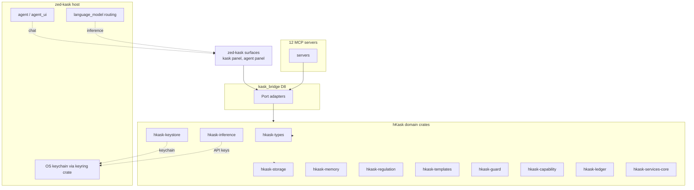

# MDS — Minimal Domain Specification

**Purpose:** A minimal, capability-driven specification framework for hKask. Specs are grants ("CAN verb on resource via interface"), not fences ("MUST NOT"). Five categories, five tools, one completeness predicate.


**Architecture anchor:** [`zed-host-architecture-plan.md`](../zed-host-architecture-plan.md) §2 (essentialist split). hKask is compiled in-process inside zed-kask. The standalone `hkask-api`, `hkask-cli`, `hkask-repl`, `hkask-identity`, `hkask-communication`, `hkask-acp`, and the deleted `hkask-services-*` subcrates (`chat`, `onboarding`, `skill`, `wallet`) are **removed**. Their jobs move to zed-kask surfaces: zed's agent panel (chat), zed's first-launch (onboarding), `hkask-templates`/`ManifestExecutor` (skill execution), and in-process wallet primitives (no service layer). The 19 surviving hKask crates (18 `hkask-*` + `kask_bridge`) and 11 MCP servers are listed in the architecture plan §2.2/§2.4. (Corrected 2026-07-29 from a stale "29 surviving crates" claim — verified by `ls kask/crates/`.)

**Related:** [`PRINCIPLES.md`](PRINCIPLES.md), [`magna-carta.md`](magna-carta.md)

---

## 1. Domain Ontology

The domain ontology is grounded in **Ontology Design Pattern (ODP) methodology** as described by Norouzi et al. (2025, arXiv:2509.23776): compact, requirement-driven extraction patterns rather than navigating entire complex ontologies.[^norouzi-odp]

The ontology is re-anchored to the **19 surviving hKask crates** (18 `hkask-*` + `kask_bridge`) compiled in-process inside zed-kask (see [`zed-host-architecture-plan.md`](../zed-host-architecture-plan.md) §2.2). Deleted crates are not referenced as current; where a deleted crate's job moved to a zed-kask surface, the entity is mapped to that surface.

### 1.1 Core Entities

| Entity | Crate / Surface | Description | Goal Principle |
|--------|-------|-------------|---------------|
| `HumanUser` | zed account (replaces deleted `hkask-identity` user store) | Human identity, role, provider link — owned by zed-kask, not a parallel hKask identity store | P1 |
| Per-user data directory | zed-kask (replaces deleted `hkask-pods` `AgentPod`) | Runtime container for a user's agent identity (persona, voice). The `UserPod` type does not exist in `hkask-types` — the per-user data directory *is* the agent identity container post-pivot. Pod abstraction deleted in 2026-07-25 cleanup. | P6, P1 |
| `hMem` | `hkask-storage` | Entity-Attribute-Value knowledge representation, bitemporal | P3 |
| `RegulationLedger` | `hkask-regulation` | Cybernetic nervous system — variety monitoring, alerts, per-agent call caps | P9 |
| `CallCap` | `hkask-regulation` | Per-agent hard ceiling on governed tool calls per regulation tick; one call charged per `McpRuntime::invoke`; resets to the ceiling each tick (replaces the former gas hold-settle `GasBudget`, deleted 2026-08-03) | P9 |


### 1.2 Kata-Kanban Domain

**Crate:** `hkask-mcp-kata-kanban` (folded from `hkask-services-kata-kanban`) | **Goal Principle:** P3 (Generative Space) — Toyota Kata scientific thinking applied through headless kanban task boards. PDCA phases map to task statuses: Plan→Backlog, Do→InProgress, Check→Review, Act→Done.

| Entity | Description | Key Attributes |
|--------|-------------|---------------|
| `Board` | Named task board scoped to owner WebID | `board_id: BoardId`, `name`, `owner: WebID`, `columns: Vec<ColumnDef>` |
| `ColumnDef` | Ordered column on a board representing a workflow phase | `column_id: ColumnId`, `name`, `status: TaskStatus`, `wip_limit: Option<u32>` |
| `Task` | Unit of work with status lifecycle, priority, verification criteria | `task_id: TaskId`, `title`, `status: TaskStatus`, `priority: Priority`, `owner: WebID`, `board_id: BoardId` |
| `Priority` | Task urgency level | `Low \| Medium \| High \| Critical` |
| `TaskStatus` | Strict column-ordered lifecycle state | `Backlog → Ready → InProgress → Review → Done` |
| `VerificationCriterion` | Acceptance spec with optional LLM evaluation prompt | `description: String`, `llm_prompt: Option<String>` |
| `KataEngine` | Orchestrates kata cycles (starter, improvement, coaching) | `state: KataState`, `manifest: KataManifest` |
| `KataState` | Current state of a kata practice cycle | `step_outputs: HashMap`, `learner_bot: String`, `context: HashMap` |
| `KataManifest` | Declarative definition of a kata (steps, coaching questions, routines) | `manifest: ManifestMeta`, `gas: KataGasConfig`, `steps: Vec<KataStep>` |
| `KataStep` | A single step in a kata improvement cycle | `ordinal: u32`, `action: String`, `description: String` |

**5 coaching kata questions:** (1) Target condition? (2) Actual condition now? (3) What obstacles? Which ONE? (4) Next step? What do you expect? (5) How quickly can we go and see?

**Regulation spans:** `reg.kata` — KataImprovEffectiveness, coaching loop events; `reg.kanban` — TaskCreated, TaskMoved, TaskAssigned, TaskVerified, BoardCreated

**Key contracts:** 34 `KAN-SVC-*` IDs (migration in progress), 27 `P{N}-svc-kata-*` IDs

### 1.3 Adapter Domain

**Crate:** `hkask-mcp-training::adapter` | **Goal Principle:** P3 (Generative Space) — LoRA adapter lifecycle management for agent-specialized inference

| Entity | Description | Key Attributes |
|--------|-------------|---------------|
| `TrainedLoRAAdapter` | A trained LoRA adapter with provenance metadata | `id: Uuid`, `source: AdapterSource`, `checksum: Checksum`, `expertise: Expertise`, `owner: WebID`, `skill_name: Option<String>`, `lifecycle: AdapterLifecycle` |
| `AdapterSource` | Provenance of the adapter | `HuggingFace { repo }` |
| `AdapterStore` | CRUD store for trained adapters with checksum verification | Store, get_by_id, get_by_expertise, get_by_skill_name, list_all, list_owner, delete, store_blob, get_blob |
| `AdapterRouter` | Routes inference requests to the best-matching adapter | CompositionEstimate, provider selection, endpoint guard |
| `EndpointLifecycle` | State machine for inference endpoint lifecycle | `EndpointPhase`: `Cold \| Warming \| Active \| Draining \| Removed` |
| `EndpointPhase` | Lifecycle phase of a deployed inference endpoint | `Cold → Warming → Active → Draining → Removed` |
| `AdapterConfig` | Configuration for adapter deployment | `model_id`, `base_url`, `timeout_secs`, `max_concurrency` |
| `Expertise` | Describes the domain expertise of a trained adapter | `domains: Vec<MdsDomain>`, `provenance: TrainingProvenance`, `capabilities: Vec<String>` |
| `CompositionEstimate` | Cost/time estimate for adapter composition | `estimated_cost_rj: f64`, `estimated_latency_ms: u64` |
| `ProviderSelection` | Selected inference provider for an adapter endpoint | `provider: String`, `model: String`, `cost_per_token_rj: f64` |

**Regulation spans:** `reg.adapter` — AdapterStored, AdapterRetrieved, AdapterDeleted, endpoint lifecycle transitions

**Key contracts:** 44 pub fns with `expect:` + `[P{N}]` annotations

### 1.4 Service Layer Subsystems (in-process)

**Crate:** `hkask-services-core` (the only surviving `hkask-services-*` crate) | **Goal Principle:** P5 (Essentialism) — thin scaffolding (config, error types, settings) genuinely shared by 6 consumers. The other `hkask-services-*` subcrates were folded into their sole MCP server consumers (F6 refactor-architecture pass); the T3.0 refactor resolved by deleting the daemon transport outright (not by building `KaskCore` — `KaskCore` was never implemented; MCP servers run standalone with identity from `ServerContext.webid`).

The deleted subcrates (`hkask-services-chat`, `hkask-services-onboarding`, `hkask-services-skill`, `hkask-services-wallet`) are **removed**. Their jobs moved to zed-kask surfaces:

| Deleted subcrate | Job moved to |
|------------------|--------------|
| `hkask-services-chat` | zed's agent panel (`crates/agent`, `agent_ui`) — zed owns chat |
| `hkask-services-onboarding` | zed's first-launch flow — zed owns onboarding |
| `hkask-services-skill` | `hkask-templates` / `ManifestExecutor` (D1) — skill execution is native, no service layer |
| `hkask-services-wallet` | Deleted outright (2026-08-03). The crypto rJoule ledger (`hkask-storage::wallet`), `WalletManager`/`Well`/`agent_wallet_store`, and `hkask-types::wallet_types` were dead-in-production (zero callers); governed tool-call bounding now lives in `hkask-regulation::CallCapManager`, and the per-skill-cascade USD budget lives in `hkask-templates::BudgetTracker` |

Surviving subcrates (kept temporarily while MCP servers depend on them; dissolve at T3.0):

| Subcrate | Domain | Contract Prefix | Count | Status |
|----------|--------|----------------|-------|--------|
| `hkask-services-core` | Foundation: config, error types, settings | — | — | ✅ Kept (genuinely shared by 6 consumers) |
| ~~`hkask-services-compose`~~ (folded) | Template composition — folded into `hkask-mcp-corpus` (internal `compose` module) | — | — | ✅ Folded |
| ~~`hkask-services-context`~~ (folded) | Service context and contract monitoring — `governance.rs` moved to `hkask-mcp-curator`; `mcp_server_guard.rs` + `storage_guard.rs` were dead code | `P{N}-svc-context-*` | 31 | ✅ Folded |
| ~~`hkask-services-corpus`~~ (folded) | Content corpus: discovery + embed — folded into `hkask-mcp-corpus` (internal `corpus` module) | `P{N}-svc-corpus-*` | 30 | ✅ Folded |
| ~~`hkask-services-kata-kanban`~~ (folded) | Toyota Kata + Kanban board coordination — folded into `hkask-mcp-kata-kanban` | `P{N}-svc-kata-*` / `KAN-SVC-*` | 61 | ✅ Folded |
| ~~`hkask-services-runtime`~~ (folded) | Runtime services: classify + guard + provider_intel — folded into `hkask-mcp-corpus` (internal `runtime` module) | `P{N}-svc-runtime-*` | 13 | ✅ Folded |
| ~~`hkask-services-self-heal`~~ (deleted) | Cross-domain self-healing coordination — deleted in 2026-07-25 cleanup | — | — | ✅ Deleted |
| ~~`hkask-services-inference`~~ (folded) | Inference orchestration scaffolding — folded into `hkask-mcp-corpus` (internal `inference_svc` + `model_cache` modules) | `P{N}-svc-inference-*` | 7 | ✅ Folded |
| `hkask-inference` | Inference routing primitives (`MediaRouter`, `InferenceIpcClient`, `ProviderId`) — reads API keys via the `keyring` crate directly (MCP-server-internal only; user-facing inference is zed's `LanguageModelRegistry` via `kask_bridge` D4/D8; embeddings via `kask_bridge::LanguageModelEmbeddingPort`) | `P{N}-svc-inference-*` | 7 | ✅ Realigned |

---

## 2. Five Categories

| # | Category | Completeness Predicate | Min Artifacts | Cross-References |
|---|----------|----------------------|---------------|-----------------|
| 1 | **Domain** | Every entity has a named term and a bounded-context map | Domain ontology sketch | → Composition (verbs), → Lifecycle (persistence) |
| 2 | **Composition** | Every domain verb has a granted composition, registered interface, and composable path | Capability grant table, interface equivalence matrix, registry schema | → Domain (ontology), → Trust (tokens) |
| 3 | **Trust** | Every capability operation has a threat-model entry and a capability-match-gate mitigation | Threat model, keystore config, capability-match gate | → Composition (capabilities), → Lifecycle (audit) |
| 4 | **Lifecycle** | Bootstrap, evolution, deprecation, lifecycle, and persistence are expressible as spec transitions | Bootstrap manifest, evolution rules, deprecation policy, Regulation span registry | → Domain (entities), → Trust (audit) |
| 5 | **Curation** | Every spec artifact has been evaluated for coherence by a curator with documented rationale | Curation decision log, coherence score | → Domain (grounding), → Lifecycle (health) |

[^evans-ddd]: Evans, Eric. *Domain-Driven Design: Tackling Complexity in the Heart of Software.* Addison-Wesley, 2003. — Bounded contexts, ubiquitous language, and the domain model that MDS categories extend.

---

## 3. Completeness Predicate

```
complete?(G, category) :=
  ∀ goal ∈ G[category]:
    ∃ criterion ∈ goal.criteria:
      criterion.satisfied = true
  ∧ ∀ cross_ref ∈ G[category].cross_references:
    complete?(G, cross_ref.target_category)

curated?(G) :=
  coherence_score(G.artifacts) ≥ threshold
  ∧ ∀ artifact ∈ G.artifacts:
    curation_decision ∈ {Accept, Revise, Reject}
    ∧ decision.rationale documented
```

A goal-set G is **MDS-complete** iff `complete?(G, c)` holds for all 5 categories **and** `curated?(G)` holds.

Curation decisions (Accept/Revise/Reject) are made by the Curator or human — not by any automated tool. The QA system validates coherence; the Curator makes decisions.

[^hoare-triple]: Hoare, C.A.R. "An Axiomatic Basis for Computer Programming." *Communications of the ACM*, 1969. — The {P} C {Q} Hoare triple that inspires MDS's completeness predicate: precondition → command → postcondition.

---

## 4. Spec Operations & QA Integration

## 4. Spec Operations & QA Integration

> **Not yet implemented.** `SpecStore`, `SqliteSpecStore`, `DefaultSpecCurator`, and the `spec_types` module are not yet built in `hkask-storage`. The `kask spec` CLI subcommands and `kask qa spec-check` are likewise not yet built. Per `DOCUMENTATION_STANDARDS.md` §10 ("No aspirational content in `architecture/`"), the design specification for this surface has been removed. The MDS category framework (§1–§3, §5–§10) is independent of this surface and remains authoritative. The corpus/replica tools below ARE implemented.

### 4.4 Replica Integration (`corpus_rewrite`)

The Gentle-Lovelace prose rewriting capability lives in `hkask-mcp-corpus` as the `corpus_rewrite` tool. It takes a passage/code snippet + quality dimension (gentle/schriver/hopper/lovelace/composite) and delegates to `ComposeService::compose()` with dimension-specific prompts.

| Tool | Server | Description |
|------|--------|-------------|
| `corpus_rewrite` | `hkask-mcp-corpus` | Rewrite prose optimized for a Gentle Lovelace quality dimension |
| `corpus_compose` | `hkask-mcp-corpus` | Generate prose in any author's style (underlying engine) |
| `corpus_compare` | `hkask-mcp-corpus` | Evaluate document against persona centroids (per-dimension scoring) |


---

### 4.6 Replica Server Tools

The replica server provides 9 tools for style corpus management, prose generation, and author comparison:

| Server | Tools | Domain | Status |
|--------|-------|--------|--------|
| `hkask-mcp-corpus` | `corpus_build_persona`, `corpus_compose`, `corpus_rewrite`, `corpus_mashup`, `corpus_compare`, `corpus_registry`, `corpus_explain`, `corpus_discover`, `corpus_cache_work`, `corpus_convert`, `corpus_ocr`, `corpus_chunk`, `corpus_tag_chunks`, `corpus_embed`, `corpus_extract_triples`, `corpus_dedup_chunks`, `corpus_consolidate_chunks`, `corpus_build_prompts`, `corpus_generate_qa`, `corpus_generate_qa_batch`, `corpus_ingest_qa`, `corpus_prepare_training_dataset`, `corpus_cache`, `corpus_query`, `corpus_clear_index`, `corpus_purge_qa` | Corpus gathering + processing + QA generation + style replication | ✅ Implemented |

### 4.7 Replica Exemplar Architecture

The replica system models a **human exemplar** — a named individual whose body of work constitutes a representational corpus. The logical validity of the replica derives from the relationship between the human and their work: the corpus *is* the evidence of their voice, style, and intellectual framework. Each passage is a sample of that relationship.

**Corpus sources by exemplar type:**

| Exemplar type | Discovery | Source examples | Status |
|--------------|-----------|----------------|--------|
| Public domain author | Static YAML (`works:` list pointing to Gutenberg URLs) | Hemingway, Woolf, Austen, Wilde, Twain, Grant, Christie, Eliot | ✅ Implemented |
| Mashup persona | Two-author centroid interpolation; exemplars drawn from both source corpora | Jane Wilde (Austen×Wilde), Ulysses S. Twain (Grant×Twain), Agatha Eliot (Christie×Eliot) | ✅ Implemented |
| Academic author | Dynamic corpus discovery via research MCP tools; disambiguation required | "David Dunning" → "David Dunning, University of Michigan" | 🔮 Planned |

### Academic Author Pipeline (Planned)

For academic exemplars, the corpus is not statically declared — it is discovered dynamically through the existing research infrastructure. The research MCP server (`hkask-mcp-research`) provides tools that can discover, extract, and cache academic content without replicating infrastructure:

| Research tool | Role in corpus discovery |
|--------------|--------------------------|
| `web_search` | Find the author's papers, talks, interviews, and profiles across the open web |
| `web_extract` | Download full-text content from discovered URLs (papers, transcripts, blog posts) |
| `web_find_similar` | Expand the corpus by finding related work and responses to the author |
| `web_browse` | Navigate academic profiles (Google Scholar, Semantic Scholar, arXiv author pages) to enumerate works |

The planned `corpus_discover` tool would orchestrate this pipeline:

1. **Name disambiguation**: Given a name (e.g., "David Dunning"), search academic and open sources, present candidate matches to the Curator for confirmation. This is a consent boundary — the Curator selects *which* David Dunning.
2. **Work enumeration**: From the confirmed identity, enumerate their known works across sources (arXiv, Semantic Scholar, open web, institutional pages, conference proceedings, transcripts).
3. **Content acquisition**: Download and cache each work via `web_extract`, producing `.cache/{slug}.txt` files mirroring the public-domain author pattern.
4. **Corpus config generation**: Produce a `corpus.yaml` with the discovered works, ready for `corpus_build_persona`.
5. **Embedding and replication**: Standard pipeline from this point forward — chunk, tag, embed, store hMems, compute centroid.


---

## 5. Capability-Driven Model

MDS is capability-driven, not constraint-driven:

| Aspect | Constraint-Driven | MDS (Capability-Driven) |
|--------|-------------------|-------------------------|
| Spec as | Fence ("MUST NOT") | Grant ("CAN verb on resource via interface") |
| Validation | Static checks, lints | Composability test, POLA audit |
| Growth | Add constraints | Compose capabilities |
| Lifecycle | Governed (gates) | Curated (invitations) |
| Failure mode | Over-constrained | Under-governed |
| hKask alignment | — | capability tokens, capability-match gate |

[^ocap]: Miller, M. (2006). *Robust Composition: Towards a National Research Agenda for Object Capability Security.* HP Labs. — Object capability model: access is granted by possession of a capability token.

---

## 6. MDS Cycle

> **Not yet implemented.** The `SpecStore`, `DefaultSpecCurator`, and `kask spec` / `kask qa spec-check` CLI surfaces are not yet built (see §4 note). The cycle below is the intended design.

```
MDS_cycle(S, D) :=
  let spec = capture(D)            // Build Spec from domain description
  store.save(spec)                 // Persist via SpecStore (not yet built)
  curate(spec)                     // Validate via DefaultSpecCurator (not yet built)
  qa spec-check                    // Category coverage + quality gate (not yet built)
  human_or_curator decides:        // External governance
    Accept | Revise | Reject
```

The MDS category framework (§1–§3, §5, §7–§10) is independent of this cycle and remains authoritative. Curation decisions remain external.

[^beck-tdd]: Beck, Kent. *Test-Driven Development: By Example.* Addison-Wesley, 2003. — The red-green-refactor cycle that MDS's capture→decompose→validate→curate cycle parallels.

---

## 7. Template Manifests

Each category has a minimal YAML template. All use `schema_version: "0.30.0"`.

### 7.1 Domain Spec Template

```yaml
schema_version: "0.30.0"
category: domain
domain_anchor: hkask
bounded_context: "..."

ontology:
  entities:
    - name: Agent
      attributes: [webid, capabilities, persona]

focusing_assumptions:
  - id: FA-D1
    statement: "..."
    rationale: "..."

completeness_checklist:
  - "Every entity has a named term"
  - "Bounded-context map exists"

cross_references:
  - category: composition
    relation: "Entities expose composable verbs"
  - category: lifecycle
    relation: "Entity state persisted across lifecycle"
```

### 7.2 Composition Spec Template

```yaml
schema_version: "0.30.0"
category: composition
domain_anchor: hkask

verb_inventory:
  - verb: invoke_tool
    resource: McpServer
    interface: [mcp, cli, in_process]
  - verb: render_template
    resource: Template
    interface: [mcp, cli, in_process]

interface_equivalence:
  mcp: true
  cli: true
  in_process: true
  equivalent: true  # All three exercise same functional core

registry:
  type: unified
  discriminator: template_type
  cascade_depth_max: 7

```

> **Note:** The `api` interface column from the pre-fork template is **removed** (the standalone `hkask-api` HTTP server is deleted). It is replaced by `in_process`, reflecting zed-kask's in-process composition root. MCP and CLI remain as equivalent surfaces to the same functional core.

### 7.3 Trust Spec Template

```yaml
schema_version: "0.30.0"
category: trust
domain_anchor: hkask

threat_model:
  adversaries:
    - name: malicious_template_author
      vector: template_injection
      mitigation: `minijinja` Rust sandbox (no filesystem/Python access, unlike Python Jinja2) + capability_gating[^minijinja]
    - name: compromised_dependency
      vector: supply_chain
      mitigation: cargo_deny + pinned_versions

capability_gate:
  - "Tool invocation requires in-process DelegationToken with matching (resource, resource_id, action)"
  - "Tokens are minted and consumed in-process — no signature verification, no unforgeability, no expiry"

keystore:
  encryption: AES-256-GCM
  key_derivation: Argon2id + HKDF-SHA256
  storage: OS_keychain + SQLCipher
  sovereignty_backend: keyring crate (direct OS keychain; not zed CredentialsProvider)
```

### 7.4 Lifecycle Spec Template

```yaml
schema_version: "0.30.0"
category: lifecycle
domain_anchor: hkask

bootstrap:
  sequence: [resolve_secrets, open_databases, wire_composition_root, start_loops]

evolution:
  versioning: git_sha_only
  migration: "Schema migrations run on version bump"

deprecation:
  policy: "Prefer deletion over deprecation (P5)"

observability:
  reg_spans:
    - namespace: reg.tool
      covers: "Tool invocation governance"
    - namespace: reg.inference
      covers: "Inference budget tracking"
  variety_counters:
    - counter: tool_diversity
      threshold: 50
    - counter: template_diversity
      threshold: 30
  algedonic:
    trigger: "variety_deficit > threshold"
    escalation: "Curator → Human"

persistence:
  engine: SQLite + SQLCipher
  schema: bitemporal_triples
  vector_store: sqlite-vec
  memory_pipelines:
    - name: episodic
      visibility: private
    - name: semantic
      visibility: public
```

> **Note:** The bootstrap sequence no longer uses a `build_service_context` or `build_kask_core` step — `KaskCore` was never implemented. The zed-kask composition root (`crates/zed/src/main.rs`) constructs individual hKask components directly and wires them via `kask_bridge` (D8) adapters (see Composition Root section below). No daemon, no Matrix transport, no HTTP server in the bootstrap path.

### 7.5 Curation Spec Template

```yaml
schema_version: "0.30.0"
category: curation
domain_anchor: hkask

curation_model:
  decisions: [Accept, Revise, Reject]
  curator:
    type: Daemon
    authority: "Human-augmented — curator proposes, human decides"
  guidance: |
    Accept — spec is coherent and complete, publish it.
    Revise — spec needs work, return with rationale.
    Reject — spec is not useful, remove it.

coherence_metric:
  method: "Jaccard similarity of declared vs. registered verbs"
  threshold: 0.7
```

[^fowler-poeaa]: Fowler, M. (2002). *Patterns of Enterprise Application Architecture.* Addison-Wesley. — Template pattern: a standard structure that captures domain knowledge in a reusable form.

---

## 8. Testing Protocol

### Principles

1. **Contract-anchored:** Every test verifies a behavioral contract via `expect:` + `[P{N}]` annotations.
2. **Public seam only:** Tests verify behavior through public interfaces, not implementation.
3. **Tracer bullet:** One RED→GREEN cycle per behavior. No horizontal slicing.
4. **Category coverage:** Each MDS category has at least one integration test.

### Category → Test Strategy

| Category | Test Strategy |
|----------|--------------|
| Domain | Entity definition + term validation |
| Composition | Capability composition + interface equivalence verification |
| Trust | capability-match boundary enforcement + threat model audit |
| Lifecycle | Bootstrap + evolution + deprecation + Regulation span emission |
| Curation | Coherence scoring + decision rationale documentation |

[^principles-p8]: hKask Team. (2026). *Architecture Principles — P8.* `docs/architecture/core/PRINCIPLES.md` (P8) — Every `#[test]` verifies a stated behavioral property of a public seam.

---

## 9. Documentation Structure

### 9.1 Category → Directory Mapping

Where each MDS category's authoritative documents live:

| # | MDS Category | Primary Directory | Key Documents |
|---|--------------|-------------------|---------------|
| 1 | **Domain** | `architecture/` | MDS.md, zed-host-architecture-plan.md |
| 2 | **Composition** | `architecture/` | MDS.md, zed-host-architecture-plan.md §13 (Composition & Connection Surfaces) |
| 3 | **Trust** | `architecture/core/` | magna-carta.md, PRINCIPLES.md |
| 4 | **Lifecycle** | `architecture/` + `plans/` | MDS.md, zed-host-architecture-plan.md |
| 5 | **Curation** | `architecture/` | DOCUMENTATION_STANDARDS.md (includes Writing Excellence protocol in Appendix A) |

**Rule:** New documents go in the directory of their primary MDS category. Cross-cutting documents go in the directory of their dominant category.

### 9.2 Document Lifecycle

```
Draft → Active → Deprecated → Superseded → Removed
```

| State | Rule |
|-------|------|
| **Active** | Must map to ≥1 MDS category via `mds_categories` frontmatter |
| **Deprecated** | `git rm` from active tree at next review; git history is the archive of record |
| **Superseded** | `git rm`; successor carries the content forward |
| **Removed** | `git rm` from working tree; recoverable via `git log --diff-filter=D` |

### 9.3 Verification

Cross-references are verified by the link checker in CI (relative links within the repository). Broken links fail the verification gate.

---

## 10. References

[^w3c-rdf]: W3C. (2014). *RDF 1.1 Concepts and Abstract Syntax*. <https://www.w3.org/TR/rdf11-concepts/>.
[^miller-robust]: Miller, M. S. (2006). *Robust Composition: Towards a Unified Approach to Access Control and Concurrency Control*. Johns Hopkins University.
[^cockburn-hexagonal]: Cockburn, A. (2005). *Hexagonal Architecture*. <https://alistair.cockburn.us/hexagonal-architecture/>.
[^shostack-threat]: Shostack, A. (2014). *Threat Modeling: Designing for Security*. Wiley.
[^ronacher-jinja2]: Ronacher, A. (2026). *Jinja2 Template Designer Reference*. <https://jinja.palletsprojects.com/>.
[^norouzi-odp]: Norouzi, M. et al. (2025). "STAR: Seed Terms And Relationships — Ontology Design Pattern Extraction." arXiv:2509.23776.
[^minijinja]: minijinja crate. <https://crates.io/crates/minijinja>. Rust-native Jinja2-compatible template engine with sandbox by default — no Python runtime, no filesystem access, no network access.
[^fowler-strangler]: Fowler, M. (2004). "StranglerFigApplication." martinfowler.com. <https://martinfowler.com/bliki/StranglerFigApplication.html>.
[^conway]: Conway, M. E. (1968). "How Do Committees Invent?" Datamation, 14(4), 28-31.
[^ousterhout]: Ousterhout, J. (2018). *A Philosophy of Software Design*. Yaknyam Press.

---

*MDS v0.31.5 — five categories. Re-anchored to the 20 surviving hKask crates (19 `hkask-*` + `kask_bridge`) and 12 MCP servers compiled in-process inside zed-kask; standalone `hkask-api` / `hkask-cli` / deleted `hkask-services-*` subcrates removed from the ontology; `hkask-goal` deleted (`GoalState` retained in `hkask-types`). The SpecStore/QA surface (§4, §6) is not yet implemented.*

---

## Composition Root (replaces the deleted AgentService specification)

> The pre-fork `AgentService` orchestration layer, `hkask-cli` `ReplState` wrapper, and `hkask-api` `ApiState` wrapper are **deleted**. The proposed `KaskCore` singleton was **never implemented** — the zed-kask composition root (`crates/zed/src/main.rs`) constructs individual hKask components directly and wires them via `kask_bridge` (D8) adapters. See `zed-host-architecture-plan.md` §13.3 for the actual composition-root wiring.

**Boundary:** In-process only. MCP servers reach hKask primitives via `kask_bridge` (D8) — they do **not** link zed-kask crates directly (P1 Prohibition — out-of-process isolation preserved at the MCP boundary). zed-kask surfaces reach hKask through the guard layer (D4) and the in-process transport (D1–D3). There is no daemon, no HTTP server, no Matrix transport, no REPL state wrapper.

### Crate-to-Domain Mappings (surviving crates only)

| Crate | MDS Category | Key Entities |
|-------|-------------|-------------|
| `hkask-types` | Domain | IDs, `InferencePort` trait, `RegulationSpan`, vocab, `VoiceDesign` (moved from deleted `hkask-pods`), `HMemEntry` (moved from deleted `hkask-git-cas`), `ExpectProposal` (moved from `hkask-test-harness`) |
| `hkask-storage` | Domain, Lifecycle | `hMem`, per-user SQLCipher private sphere. (`SpecStore` is planned, not yet implemented — see §4 note.) The crypto `wallet` module and `WalletStore` were deleted 2026-08-03 (dead-in-production). |
| `hkask-memory` | Domain, Curation | Semantic/episodic memory, consolidation, hMem coherence |
| `hkask-regulation` | Lifecycle, Trust | `RegulationLedger`, `CallCapManager`/`CallCap` (per-agent tool-call ceiling, replaces deleted `GasBudget` hold-settle), `CyberneticsLoop`, variety/algedonic |
| `hkask-templates` | Composition | `ManifestExecutor`, registry, cascade, PDCA — skill execution (D1) |
| ~~`hkask-pods`~~ (deleted) | Domain | `AgentPod`, Curator, deployment — deleted in 2026-07-25 cleanup; `VoiceDesign` moved to `hkask-types`; Curator agent now lives in zed-kask |
| `hkask-guard` | Trust | Magna Carta floor (P3.1) — guard layer in zed-kask's inference path (D4) |
| `hkask-capability` | Trust | capability-match gate, capability tokens |
| `hkask-keystore` (trimmed) | Trust | Sovereignty crypto only: DB passphrase, internal-secret derivation. Uses the `keyring` crate directly for all keychain access (D5 — NOT zed's `CredentialsProvider`) |
| ~~`hkask-wallet`~~ (deleted) | Trust | `WalletManager`, `ApiKeyIssuer`, rJoule balance, deposits, withdrawals — deleted in 2026-07-25 cleanup. The residual `hkask-storage::wallet` crypto ledger, `hkask-regulation::WalletManager`/`Well`/`agent_wallet_store`, and `hkask-types::wallet_types` were also deleted 2026-08-03 (dead-in-production, zero callers). Tool-call bounding is now `hkask-regulation::CallCapManager`; per-cascade USD budgeting is `hkask-templates::BudgetTracker`. |
| `hkask-ledger` | Trust, Lifecycle | hMem accounting, double-entry ledger |
| `hkask-inference` | Composition | `MediaRouter`, `InferenceIpcClient`, `ProviderId` — reads keys via the `keyring` crate directly (MCP-server-internal only; user-facing inference is zed's `LanguageModelRegistry` via `kask_bridge` D4/D8; embeddings via `kask_bridge::LanguageModelEmbeddingPort`) |
| `hkask-mcp-server` (framework) | Composition | `reg.tool.* + capability-match gating for the 12 MCP servers |
| `hkask-forecast` | Domain | Forecast domain logic |
| `hkask-condenser` | Curation | Context condensation |
| ~~`hkask-git-cas`~~ (deleted) | Lifecycle | Content-addressed storage over git — deleted in 2026-07-25 cleanup; `GitCASPort` trait deleted from `hkask-types`; `HMemEntry` moved to `hkask-types` |
| `hkask-bridge-dublincore` | Curation | Dublin Core metadata bridging |
| `hkask-email` | Lifecycle | Curator email — outbound via MXroute SMTP API (alerts, notifications, test) |
| `hkask-lisp` | Composition | Sandboxed Lisp interpreter for deterministic manifest compute steps (bounded recursion, JSON-native, no I/O) |
| `hkask-test-harness` | (test infra) | Shared test fixtures, property-test generators, oracle taxonomy (`Oracle` trait), trace persistence (`write_trace`/`TraceEntry`). `ExpectProposal` was moved to `hkask-types`; the crate itself survives. |
| `hkask-mcp` | Composition | MCP governance |
| `hkask-services-core` | Domain | Foundation: `ServiceError`, `ServiceConfig`, `HkaskSettings`. Kept (genuinely shared by 6 crates); the other `hkask-services-*` crates were folded into their MCP server consumers |
| ~~`hkask-services-self-heal`~~ (deleted) | Lifecycle | Cross-domain self-healing coordination — deleted in 2026-07-25 cleanup |
| ~~`hkask-services-inference`~~ (folded) | Composition | Inference orchestration scaffolding — folded into `hkask-mcp-corpus` |
| ~~`hkask-services-kata-kanban`~~ (folded) | Domain, Curation | `KataEngine`, `KataManifest`, `Board`, `Task`, Kanban coordination — folded into `hkask-mcp-kata-kanban` |
| ~~`hkask-services-runtime`~~ (folded) | Lifecycle | `ClassifyService`, guard, provider_intel — folded into `hkask-mcp-corpus` |
| ~~`hkask-services-corpus`~~ (folded) | Domain | `CorpusService`, embedding pipelines — folded into `hkask-mcp-corpus` |
| ~~`hkask-services-context`~~ (folded) | Lifecycle | `ContextService`, contract monitoring — `governance.rs` moved to `hkask-mcp-curator`; guards were dead code |
| ~~`hkask-services-compose`~~ (folded) | Composition | Template composition — folded into `hkask-mcp-corpus` |
| `kask_bridge` | Composition | D8 — the bidirectional seam: in-process bridge exposing hKask port traits (InferencePort, ToolPort, MemoryPort, etc.) to MCP servers and zed-kask surfaces (no `KaskCore` singleton — composition root wires components directly) |
| 12 MCP servers | Composition | The tools — hosted in-process: codegraph, companies, condenser, corpus, curator, kata-kanban, media, prediction-markets, research, scenarios, swarm, training |

> **Deleted crates (not mapped):** `hkask-identity` (→ zed account), `hkask-communication` (→ zed voip), `hkask-mcp-cloud-gateway`, `hkask-acp`, `hkask-api`, `hkask-cli`, `hkask-repl`, `hkask-services-chat` (→ zed agent panel), `hkask-services-onboarding` (→ zed first-launch), `hkask-services-skill` (→ `hkask-templates`/`ManifestExecutor`), `hkask-services-wallet` (deleted outright — residual wallet primitives removed 2026-08-03), `hkask-mcp-communication`, `hkask-mcp-filesystem`, `hkask-mcp-memory`, `hkask-mcp-skill`, `hkask-mcp-regulation`.

### Dependency Direction


<!-- DIAGRAM_ALIGNMENT
id: DIAG-MDS-001
verified_date: 2026-08-01
verified_against: kask/docs/architecture/zed-host-architecture-plan.md §13.3, kask/crates/ directory listing, DIVERGENCE.md D5 (keystore uses keyring crate directly, not CredentialsProvider)
status: VERIFIED
-->

Domain crates **never** depend on zed-kask crates. MCP servers **never** link zed-kask crates directly — they reach the in-process components via `kask_bridge` (D8), preserving the P1 isolation boundary at the MCP seam. zed-kask surfaces reach hKask through the guard layer (D4) and in-process transport (D1–D3). Note: `KaskCore` was never implemented as a singleton; the composition root wires individual components directly (see `zed-host-architecture-plan.md` §13.3).

### Capability-Match Gate

| Boundary | Enforcement | Principle |
|----------|-------------|-----------|
| Tool invocation | `DelegationToken::is_valid_for` or `verify_capability_domain` via `McpRuntime::invoke` (gas gate via `CyberneticsLoop`) | P4 |
| Inference calls | `governed_inference` membrane with gas budget checks | P4 |
| MCP server isolation | In-process via `kask_bridge` (D8); MCP servers do not link zed-kask crates | P1 |
| Capability attenuation | Max depth limit, TTL expiry on tokens | P4 |
| Sovereignty keys | Trimmed `hkask-keystore` derives crypto only; at-rest storage via the `keyring` crate directly (D5 — not zed `CredentialsProvider`) | P1 |

### Bootstrap Sequence

The composition root (`crates/zed/src/main.rs`) constructs individual hKask components directly — there is no `KaskCore::build()` singleton. The actual wiring sequence is documented in `zed-host-architecture-plan.md` §13.3 (Composition root). Sovereignty keys are resolved via the trimmed `hkask-keystore` using the `keyring` crate directly (D5 — not zed's `CredentialsProvider`).

> **Removed from the pre-fork bootstrap:** the `ReplState` (= `AgentService` + REPL fields) and `ApiState` (= `Arc<AgentService>` + HTTP fields) wrappers, the daemon handler, and the Matrix transport. None of these have successors in zed-kask — their jobs either moved to zed-kask surfaces (chat → agent panel) or were deleted (HTTP API, Matrix, daemon).

### Interface Equivalence

The `kask` admin CLI, the curator MCP server, and zed-kask surfaces (kask panel) all reach hKask primitives through the same `kask_bridge` (D8) port-trait adapters. Surface-specific state is composed at the surface, not threaded through a shared singleton. The deleted `hkask-api` REST surface and `hkask-cli` REPL surface have no successors; their spec operations are absorbed by the in-process `kask` admin CLI and the curator MCP server.
