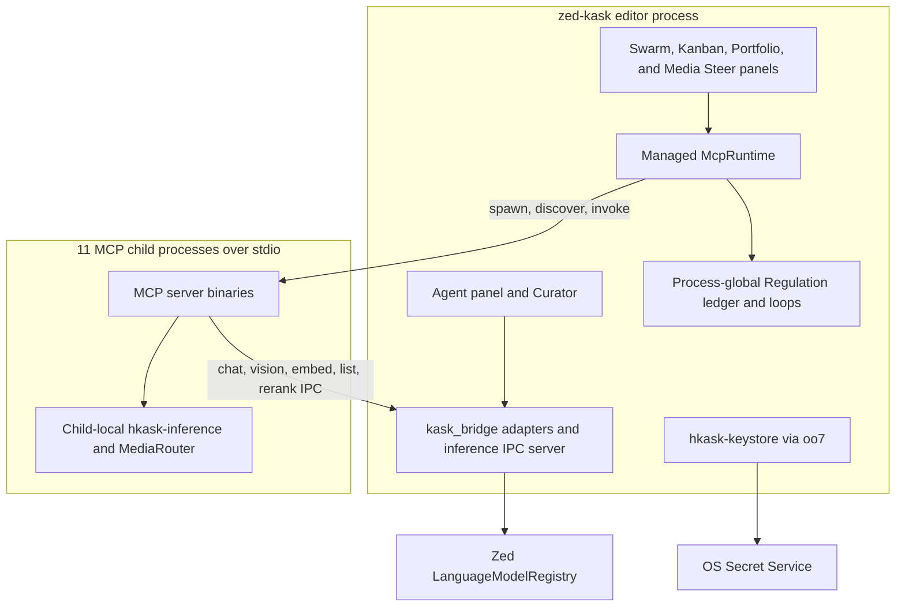

# MDS — Minimal Domain Specification

**Purpose:** A minimal, capability-driven specification framework for hKask. Specs are grants ("CAN verb on resource via interface"), not fences ("MUST NOT"). Five categories, five tools, one completeness predicate.


**Architecture anchor:** [`zed-host-architecture-plan.md`](../zed-host-architecture-plan.md) §2 (essentialist split). hKask is compiled in-process inside zed-kask. The standalone `hkask-api`, `hkask-cli`, `hkask-repl`, `hkask-identity`, `hkask-communication`, `hkask-acp`, and the `hkask-services-*` subcrates (`chat`, `onboarding`, `skill`, `wallet`) are **removed**. Their jobs move to zed-kask surfaces: zed's agent panel (chat), zed's first-launch (onboarding), upstream-Zed body injection via the project-aware `SkillTool` resolver → `render_skill_envelope` (skill execution — see `crates/agent/src/tools/skill_tool.rs:146-155,184-288`; resolver at `crates/agent/src/agent.rs:4339-4383`, registered at `:1016-1021`), and the wallet subsystem was deleted outright (2026-08-30) — governed tool-call bounding lives in `hkask-regulation::CallCapManager` (see §1.4). The 18 surviving hKask crates (17 `hkask-*` + `kask_bridge`) and 11 MCP servers are listed in the architecture plan §2.2/§2.4.

**Related:** [`PRINCIPLES.md`](PRINCIPLES.md), [`magna-carta.md`](magna-carta.md)

---

## 1. Domain Ontology

The domain ontology is grounded in **Ontology Design Pattern (ODP) methodology** as described by Norouzi et al. (2025, arXiv:2509.23776): compact, requirement-driven extraction patterns rather than navigating entire complex ontologies.[^norouzi-odp]

The ontology is re-anchored to the **18 surviving hKask crates** (17 `hkask-*` + `kask_bridge`) compiled in-process inside zed-kask (see [`zed-host-architecture-plan.md`](../zed-host-architecture-plan.md) §2.2). Deleted crates are not referenced as current; where a deleted crate's job moved to a zed-kask surface, the entity is mapped to that surface.

### 1.1 Core Entities

| Entity | Crate / Surface | Description | Goal Principle |
|--------|-------|-------------|---------------|
| `HumanUser` | zed account (replaces deleted `hkask-identity` user store) | Human identity, role, provider link — owned by zed-kask, not a parallel hKask identity store | P1 |
| Per-user data directory | zed-kask (replaces deleted `hkask-pods` `AgentPod`) | Runtime container for a user's agent identity (persona, voice). The `UserPod` type does not exist in `hkask-types` — the per-user data directory *is* the agent identity container post-pivot. Pod abstraction deleted in 2026-07-25 cleanup. | P6, P1 |
| `hMem` | `hkask-storage` | Entity-Attribute-Value knowledge representation, bitemporal | P3 |
| `RegulationLedger` | `hkask-regulation` | Cybernetic nervous system — variety monitoring, alerts, per-agent call caps | P9 |
| `CallCap` | `hkask-regulation` | Per-agent hard ceiling on governed tool calls per regulation tick; one call charged per `McpRuntime::invoke`; resets to the ceiling each tick (replaces the former gas hold-settle `GasBudget`, deleted 2026-08-03) | P9 |


### 1.2 Kata-Kanban Domain

**Crate:** `hkask-mcp-kata-kanban` (folded from `hkask-services-kata-kanban`) | **Goal Principle:** P3 (Generative Space) — Toyota Kata scientific thinking applied through headless kanban task boards. PDCA phases map to task statuses: Plan→Backlog, Do→InProgress, Check→Review, Act→Done.

| Entity | Description | Key Attributes |
|--------|-------------|---------------|
| `Board` | Named task board scoped to owner WebID | `board_id: BoardId`, `name`, `owner: WebID`, `columns: Vec<ColumnDef>` |
| `ColumnDef` | Ordered column on a board representing a workflow phase | `column_id: ColumnId`, `name`, `status: TaskStatus`, `wip_limit: Option<u32>` |
| `Task` | Unit of work with status lifecycle, priority, verification criteria | `task_id: TaskId`, `title`, `status: TaskStatus`, `priority: Priority`, `owner: WebID`, `board_id: BoardId` |
| `Priority` | Task urgency level | `Low \| Medium \| High \| Critical` |
| `TaskStatus` | Strict column-ordered lifecycle state (defined in `hkask-types`, not the server) | `Backlog → Ready → InProgress → Review → Done` (`hkask-types/src/kanban_status.rs:24`) |
| `VerificationCriterion` | Acceptance spec with optional LLM evaluation prompt | `description: String`, `llm_prompt: Option<String>` |
| `Goal` | Functional target persisted in the kanban database until resolution: text, observable criteria, and optional intake prediction | `goal_id`, `goal_text`, `criteria`, `prediction` (`kask/mcp-servers/hkask-mcp-kata-kanban/src/kanban/types/goal.rs:20-40`; persistence contract at `kanban/service_impl/goals.rs:9-15,40-50`) |
| `GoalVerdict` | Persisted judge verdict with confidence and exactly one result for every criterion | `kask/mcp-servers/hkask-mcp-kata-kanban/src/kanban/types/goal.rs:145-160`; write at `kanban/service_impl/goals.rs:240-244` |
| `GoalResolution` | Brier-scored closure; scoring removes the resolved goal while curator memory retains the outcome record | `kask/mcp-servers/hkask-mcp-kata-kanban/src/kanban/types/goal.rs:163-175`; lifecycle contract at `kanban/service_impl/goals.rs:9-15` |

**5 coaching kata questions:** (1) Target condition? (2) Actual condition now? (3) What obstacles? Which ONE? (4) Next step? What do you expect? (5) How quickly can we go and see? — carried by the `kata-coaching` skill (`.agents/skills/kata-coaching/`); the former server-side `KataEngine`/`KataState`/`KataManifest`/`KataStep` entities are deleted (zero hits in `hkask-mcp-kata-kanban/src/`, verified 2026-09-04).

**Regulation spans:** `reg.kata` — coaching-prompt generation (`kanban/service_impl/kata.rs:44`). No `reg.kanban` namespace exists (zero hits in `kask/`, verified 2026-09-04).

### 1.3 Adapter Domain

**Crate:** `hkask-mcp-training::adapter` | **Goal Principle:** P3 (Generative Space) — LoRA adapter lifecycle management for agent-specialized inference

| Entity | Description | Key Attributes |
|--------|-------------|---------------|
| `TrainedLoRAAdapter` | A trained LoRA adapter with provenance metadata | `id: Uuid`, `source: AdapterSource`, `checksum: Checksum`, `expertise: Expertise`, `owner: WebID`, `skill_name: Option<String>`, `lifecycle: AdapterLifecycle` (`adapter/adapter_store.rs:103`) |
| `AdapterSource` | Provenance of the adapter | `HuggingFace { repo }` |
| `AdapterStore` | CRUD store for trained adapters with checksum verification | Store, get_by_id, get_by_expertise, get_by_skill_name, list_all, list_owner, delete, store_blob, get_blob |
| `Expertise` | Describes the domain expertise of a trained adapter | `domains: Vec<MdsDomain>`, `provenance: TrainingProvenance`, `capabilities: Vec<String>` (`adapter/expertise.rs`) |
| `AdapterLifecycle` | Lifecycle state of a stored adapter | `adapter/expertise.rs:85` |

> The former `AdapterRouter`, `EndpointLifecycle`/`EndpointPhase`, `AdapterConfig`, `CompositionEstimate`, and `ProviderSelection` entities are deleted: the prior `AdapterPort` trait + `AdapterRouter` impl were removed, and the tools use `AdapterStore` (CRUD) and `InferencePort` (inference) directly (`adapter.rs:18-20`, verified 2026-09-04).

**Regulation spans:** `reg.adapter` — store/get/delete operations (`adapter/adapter_store.rs:275,347`)

**Key contracts:** 8 `expect:` contract annotations across the adapter modules (`adapter/adapter_store.rs`, `adapter/expertise.rs`, `adapters.rs`; verified 2026-09-04)

### 1.4 Service and runtime subsystems

**Crate:** `hkask-services-core` is the only surviving `hkask-services-*` crate, a thin shared library used by corpus and curator. The editor process owns one `McpRuntime`; it spawns the 11 MCP binaries as child processes over stdio, discovers their tools, and governs dispatch (`kask/crates/hkask-mcp/src/runtime.rs:4-12,445-455,576-580`; registry at `kask/crates/kask_bridge/src/mcp_servers.rs:55-506`). There is no daemon or `KaskCore` singleton.

The deleted subcrates (`hkask-services-chat`, `hkask-services-onboarding`, `hkask-services-skill`, `hkask-services-wallet`) are **removed**. Their jobs moved to zed-kask surfaces:

| Deleted subcrate | Job moved to |
|------------------|--------------|
| `hkask-services-chat` | zed's agent panel (`crates/agent`, `agent_ui`) — zed owns chat |
| `hkask-services-onboarding` | zed's first-launch flow — zed owns onboarding |
| `hkask-services-skill` | Project-aware body injection via `SkillTool::with_body_resolver` → `render_skill_envelope` (`crates/agent/src/tools/skill_tool.rs:146-155,184-288`; resolver at `crates/agent/src/agent.rs:4339-4383`, registered at `:1016-1021`) — skill execution is native, no service layer. |
| `hkask-services-wallet` | Removed. Governed tool-call bounding now lives in `hkask-regulation::CallCapManager`. |

Surviving subcrates (kept temporarily while MCP servers depend on them; dissolve at T3.0):

| Subcrate | Domain | Contract Prefix | Count | Status |
|----------|--------|----------------|-------|--------|
| `hkask-services-core` | Foundation: config, error types, settings | — | — | ✅ Kept (shared by 2 consumers: corpus, curator) |
| ~~`hkask-services-compose`~~ (folded) | Template composition — folded into `hkask-mcp-corpus` (internal `compose` module) | — | — | ✅ Folded |
| ~~`hkask-services-context`~~ (folded) | Service context and contract monitoring — `governance.rs` moved to `hkask-mcp-curator`; `mcp_server_guard.rs` + `storage_guard.rs` were dead code | `P{N}-svc-context-*` | 31 | ✅ Folded |
| ~~`hkask-services-corpus`~~ (folded) | Content corpus: discovery + embed — folded into `hkask-mcp-corpus` (internal `corpus` module) | `P{N}-svc-corpus-*` | 30 | ✅ Folded |
| ~~`hkask-services-kata-kanban`~~ (folded) | Toyota Kata + Kanban board coordination — folded into `hkask-mcp-kata-kanban` | `P{N}-svc-kata-*` / `KAN-SVC-*` | 61 | ✅ Folded |
| ~~`hkask-services-runtime`~~ (folded) | Runtime services: classify + guard + provider_intel — folded into `hkask-mcp-corpus` (internal `runtime` module) | `P{N}-svc-runtime-*` | 13 | ✅ Folded |
| ~~`hkask-services-self-heal`~~ (deleted) | Cross-domain self-healing coordination — deleted in 2026-07-25 cleanup | — | — | ✅ Deleted |
| ~~`hkask-services-inference`~~ (folded) | Inference orchestration scaffolding — folded into `hkask-mcp-corpus` (internal `inference_svc` + `model_cache` modules) | `P{N}-svc-inference-*` | 7 | ✅ Folded |
| `hkask-inference` | Inference routing primitives (`MediaRouter`, `InferenceIpcClient`, `ProviderId`). `InferenceConfig::from_env` reads provider configuration from the child process environment only (`kask/crates/hkask-inference/src/config.rs:109-129,218-228`). Chat, vision, embedding, rerank, and model listing can use IPC; media generation is child-local (`hkask_inference.rs:356-383`). | `P{N}-svc-inference-*` | 7 | ✅ Current |

---

## 2. Five Categories

| # | Category | Completeness Predicate | Min Artifacts | Cross-References |
|---|----------|----------------------|---------------|-----------------|
| 1 | **Domain** | Every entity has a named term and a bounded-context map | Domain ontology sketch | → Composition (verbs), → Lifecycle (persistence) |
| 2 | **Composition** | Every domain verb has a granted composition, registered interface, and composable path | Capability grant table, interface equivalence matrix, registry schema | → Domain (ontology), → Trust (tokens) |
| 3 | **Trust** | Every capability operation has a threat-model entry and a mitigation naming its actual enforcement point | Threat model, keystore config, capability separation boundaries | → Composition (capabilities), → Lifecycle (audit) |
| 4 | **Lifecycle** | Bootstrap, evolution, deprecation, lifecycle, and persistence are expressible as spec transitions | Bootstrap manifest, evolution rules, deprecation policy, Regulation span registry | → Domain (entities), → Trust (audit) |
| 5 | **Curation** | Every spec artifact has been evaluated for coherence by a curator with documented rationale | Curation decision log, coherence score | → Domain (grounding), → Lifecycle (health) |

[^evans-ddd]: Evans, Eric. *Domain-Driven Design: Tackling Complexity in the Heart of Software.* Addison-Wesley, 2003. — Bounded contexts, ubiquitous language, and the domain model that MDS categories extend.

---

## 3. Completeness Predicate

```
complete?(G, category) :=
  ∀ goal ∈ G[category]:
    ∃ criterion ∈ goal.criteria:
      criterion.satisfied = true
  ∧ ∀ cross_ref ∈ G[category].cross_references:
    complete?(G, cross_ref.target_category)

curated?(G) :=
  coherence_score(G.artifacts) ≥ threshold
  ∧ ∀ artifact ∈ G.artifacts:
    curation_decision ∈ {Accept, Revise, Reject}
    ∧ decision.rationale documented
```

A goal-set G is **MDS-complete** iff `complete?(G, c)` holds for all 5 categories **and** `curated?(G)` holds.

Curation decisions (Accept/Revise/Reject) are made by the Curator or human — not by any automated tool. The QA system validates coherence; the Curator makes decisions.

[^hoare-triple]: Hoare, C.A.R. "An Axiomatic Basis for Computer Programming." *Communications of the ACM*, 1969. — The {P} C {Q} Hoare triple that inspires MDS's completeness predicate: precondition → command → postcondition.

---

## 4. Spec Operations & QA Integration

> **Not yet implemented.** `SpecStore`, `SqliteSpecStore`, `DefaultSpecCurator`, and the `spec_types` module are not yet built in `hkask-storage`. The `kask spec` CLI subcommands and `kask qa spec-check` are likewise not yet built. Per `DOCUMENTATION_STANDARDS.md` §10 ("No aspirational content in `architecture/`"), the design specification for this surface has been removed. The MDS category framework (§1–§3, §5–§10) is independent of this surface and remains authoritative. The corpus tools below ARE implemented.

### 4.1 Style Composition Integration (`corpus_rewrite`)

The Gentle-Lovelace prose rewriting capability lives in `hkask-mcp-corpus` as the `corpus_rewrite` tool. It takes a passage/code snippet + quality dimension (gentle/schriver/hopper/lovelace/composite) and delegates to `ComposeService::compose()` with dimension-specific prompts.

| Tool | Server | Description |
|------|--------|-------------|
| `corpus_rewrite` | `hkask-mcp-corpus` | Rewrite prose optimized for a Gentle Lovelace quality dimension |
| `corpus_compose` | `hkask-mcp-corpus` | Generate prose in any author's style (underlying engine) |


---

### 4.2 Corpus Server Tools

The corpus server provides tools for style corpus management, prose generation, and QA training:

| Server | Tools | Domain | Status |
|--------|-------|--------|--------|
| `hkask-mcp-corpus` | Gather: `corpus_discover`, `corpus_cache_work`, `corpus_discover_company`; process: `corpus_convert`, `corpus_ocr`, `corpus_is_complex`, `corpus_chunk`, `corpus_tag_chunks`, `corpus_embed`, `corpus_extract_assertions`, `corpus_dedup_chunks`, `corpus_consolidate_chunks`; QA: `corpus_build_prompts`, `corpus_generate_qa_batch`, `corpus_ingest_qa`, `corpus_prepare_training_dataset`, `corpus_purge_qa`; compose: `corpus_compose`, `corpus_rewrite`, `corpus_centroid`; manage: `corpus_cache`, `corpus_query`, `corpus_clear_index` | Corpus gathering + processing + QA generation + style exemplar composition | ✅ Implemented: 23 tools, enumerated at `kask/mcp-servers/hkask-mcp-corpus/src/hkask_mcp_corpus.rs:10-18` and pinned by `tool_surface_is_exactly_23_registered_tools` at `:268-278` |

### 4.3 Style Exemplar Architecture

The style exemplar system models a **human exemplar** — a named individual whose body of work constitutes a representational corpus. The logical validity of the exemplar derives from the relationship between the human and their work: the corpus *is* the evidence of their voice, style, and intellectual framework. Each passage is a sample of that relationship.

**Corpus sources by exemplar type:**

| Exemplar type | Discovery | Source examples | Status |
|--------------|-----------|----------------|--------|
| Public domain author | Static YAML (`works:` list pointing to Gutenberg URLs) | Named public-domain works | ✅ Implemented |
| Mashup exemplar | Two-author centroid interpolation over source corpora | Registry-defined mashups | ✅ Implemented |
| Academic author | `corpus_discover` in curated or agentic mode | Semantic Scholar, arXiv, web, and optional transcripts | ✅ Implemented (`kask/mcp-servers/hkask-mcp-corpus/src/tools/gather.rs:44-54,78-84`) |
| Company corpus | `corpus_discover_company` from an approved-source manifest | SEC filings plus channel-allowlisted transcripts | ✅ Implemented (`kask/mcp-servers/hkask-mcp-corpus/src/tools/gather.rs:230-235,480-490`) |

### Discovery pipelines

`corpus_discover` accepts an author name, mode, work limit, transcript/web switches, and optional output path; it delegates multi-source enumeration and emits a `corpus.yaml` for the processing pipeline (`tools/gather.rs:44-54,78-84`). `corpus_discover_company` starts from an approved company-source manifest, records excluded non-allowlisted sources, and emits coverage by source tier (`tools/gather.rs:230-235,480-529`). Both are current gather-stage tools, not planned wrappers around the research server.


---

## 5. Capability-Driven Model

MDS is capability-driven, not constraint-driven:

| Aspect | Constraint-Driven | MDS (Capability-Driven) |
|--------|-------------------|-------------------------|
| Spec as | Fence ("MUST NOT") | Grant ("CAN verb on resource via interface") |
| Validation | Static checks, lints | Composability test, POLA audit |
| Growth | Add constraints | Compose capabilities |
| Lifecycle | Governed (gates) | Curated (invitations) |
| Failure mode | Over-constrained | Under-governed |
| hKask alignment | — | capability separation via caller-external tool allowlists |

[^ocap]: Miller, M. (2006). *Robust Composition: Towards a National Research Agenda for Object Capability Security.* HP Labs. — Object capability model. hKask adopts the separation principle (authority only attenuates; a caller reaches only what a list it did not write allows) — see the [Capability Separation Boundaries](#capability-separation-boundaries) table.

---

## 6. MDS Cycle

> **Not yet implemented.** The `SpecStore`, `DefaultSpecCurator`, and `kask spec` / `kask qa spec-check` CLI surfaces are not yet built (see §4 note). The cycle below is the intended design.

```
MDS_cycle(S, D) :=
  let spec = capture(D)            // Build Spec from domain description
  store.save(spec)                 // Persist via SpecStore (not yet built)
  curate(spec)                     // Validate via DefaultSpecCurator (not yet built)
  qa spec-check                    // Category coverage + quality gate (not yet built)
  human_or_curator decides:        // External governance
    Accept | Revise | Reject
```

The MDS category framework (§1–§3, §5, §7–§10) is independent of this cycle and remains authoritative. Curation decisions remain external.

[^beck-tdd]: Beck, Kent. *Test-Driven Development: By Example.* Addison-Wesley, 2003. — The red-green-refactor cycle that MDS's capture→decompose→validate→curate cycle parallels.

---

## 7. Template Manifests

Each category has a minimal YAML template. All use `schema_version: "0.30.0"`.

### 7.1 Domain Spec Template

```yaml
schema_version: "0.30.0"
category: domain
domain_anchor: hkask
bounded_context: "..."

ontology:
  entities:
    - name: Agent
      attributes: [webid, capabilities, persona]

focusing_assumptions:
  - id: FA-D1
    statement: "..."
    rationale: "..."

completeness_checklist:
  - "Every entity has a named term"
  - "Bounded-context map exists"

cross_references:
  - category: composition
    relation: "Entities expose composable verbs"
  - category: lifecycle
    relation: "Entity state persisted across lifecycle"
```

### 7.2 Composition Spec Template

```yaml
schema_version: "0.30.0"
category: composition
domain_anchor: hkask

verb_inventory:
  - verb: invoke_tool
    resource: McpServer
    interface: [mcp, cli, in_process]
  - verb: render_template
    resource: Template
    interface: [mcp, cli, in_process]

interface_equivalence:
  mcp: true
  cli: true
  in_process: true
  equivalent: true  # All three exercise same functional core

registry:
  type: unified
  discriminator: template_type
  cascade_depth_max: 7

```

> **Note:** The `api` interface column from the pre-fork template is **removed** (the standalone `hkask-api` HTTP server is deleted). It is replaced by `in_process`, reflecting zed-kask's in-process composition root. MCP and CLI remain as equivalent surfaces to the same functional core.

### 7.3 Trust Spec Template

```yaml
schema_version: "0.30.0"
category: trust
domain_anchor: hkask

threat_model:
  adversaries:
    - name: malicious_template_author
      vector: template_injection
      mitigation: `minijinja` Rust sandbox (no filesystem/Python access, unlike Python Jinja2) + tool_allowlist_separation[^minijinja]  # NOT information flow control (RR-0053)
    - name: compromised_dependency
      vector: supply_chain
      mitigation: cargo_deny + pinned_versions

capability_separation:
  - "Tool authority is a list the calling party does not write: the per-request `tool_allowlist` on the inference IPC `tool_invoke` dispatch (fail-closed on missing/empty), each swarm agent card's `mcp_tools` allowlist, and the per-server MCP env/credential allowlists"
  - "`McpRuntime::invoke` performs NO per-call authorization — it meters the call against the agent's per-tick runaway ceiling, dispatches, and emits the span. Its `agent: WebID` is an accounting identity, not a credential"
  - "Information flow is NOT gated. Defense Layer 5 is absent by decision (RR-0053), as Layer 3 is (RR-0010) — treat every tool path as taint-unaware"
  - "Removed 2026-08-12: the per-call DelegationToken capability match (RR-0056 — it compared a caller-supplied value against itself). Do not re-add a per-call authorization argument to `ToolPort::invoke`"
  - "Removed 2026-08-12: the FIDES Source→Sink taint check on `ToolInfo.taint` (RR-0053 — both inputs were constants, so it could not deny). RR-0053 is now an absence check; do not re-add the machinery without live inputs and a test proving a real block"

keystore:
  encryption: AES-256-GCM
  key_derivation: Argon2id + HKDF-SHA256
  storage: OS_keychain + SQLCipher
  sovereignty_backend: oo7 (direct Secret Service access; not zed CredentialsProvider)
```

### 7.4 Lifecycle Spec Template

```yaml
schema_version: "0.30.0"
category: lifecycle
domain_anchor: hkask

bootstrap:
  sequence: [resolve_secrets, open_databases, wire_composition_root, start_loops]

evolution:
  versioning: git_sha_only
  migration: "Schema migrations run on version bump"

deprecation:
  policy: "Prefer deletion over deprecation (P5)"

observability:
  reg_spans:
    - namespace: reg.tool
      covers: "Child-process tool outcome tracing; observability only"
    - namespace: reg.mcp
      covers: "Managed-runtime persistence diagnostics; completed calls are typed ToolCompleted Regulation records"
    - namespace: reg.inference
      covers: "Inference circuit transitions, permanent failures, and observed recovery"
  variety_counters:
    - counter: tool_diversity
      threshold: 50
    - counter: template_diversity
      threshold: 30
  algedonic:
    trigger: "variety_deficit > threshold"
    escalation: "Curator → Human"

persistence:
  engine: SQLite + SQLCipher
  schema: bitemporal_triples
  vector_store: sqlite-vec
  memory_pipelines:
    - name: unified   # the episodic/semantic type distinction was removed (D6) — one store, per-h_mem Visibility
      visibility: per_h_mem_private_shared_public
```

> **Note:** The bootstrap sequence no longer uses a `build_service_context` or `build_kask_core` step — `KaskCore` was never implemented. The zed-kask composition root (`crates/zed/src/main.rs`) constructs individual hKask components directly and wires them via `kask_bridge` (D8) adapters (see Composition Root section below). No daemon, no Matrix transport, no HTTP server in the bootstrap path.

### 7.5 Curation Spec Template

```yaml
schema_version: "0.30.0"
category: curation
domain_anchor: hkask

curation_model:
  decisions: [Accept, Revise, Reject]
  curator:
    type: NativeInProcessAgent   # daemon deleted 2026-07-25; the Curator is a native in-process agent (D2)
    authority: "Human-augmented — curator proposes, human decides"
  guidance: |
    Accept — spec is coherent and complete, publish it.
    Revise — spec needs work, return with rationale.
    Reject — spec is not useful, remove it.

coherence_metric:
  method: "Jaccard similarity of declared vs. registered verbs"
  threshold: 0.7
```

[^fowler-poeaa]: Fowler, M. (2002). *Patterns of Enterprise Application Architecture.* Addison-Wesley. — Template pattern: a standard structure that captures domain knowledge in a reusable form.

---

## 8. Testing Protocol

### Principles

1. **Contract-anchored:** Every test verifies a behavioral contract via `expect:` + `[P{N}]` annotations.
2. **Public seam only:** Tests verify behavior through public interfaces, not implementation.
3. **Tracer bullet:** One RED→GREEN cycle per behavior. No horizontal slicing.
4. **Category coverage:** Each MDS category has at least one integration test.

### Category → Test Strategy

| Category | Test Strategy |
|----------|--------------|
| Domain | Entity definition + term validation |
| Composition | Capability composition + interface equivalence verification |
| Trust | capability separation boundary enforcement + threat model audit |
| Lifecycle | Bootstrap + evolution + deprecation + Regulation span emission |
| Curation | Coherence scoring + decision rationale documentation |

[^principles-p8]: hKask Team. (2026). *Architecture Principles — P8.* `docs/architecture/core/PRINCIPLES.md` (P8) — Every `#[test]` verifies a stated behavioral property of a public seam.

---

## 9. Documentation Structure

### 9.1 Category → Directory Mapping

Where each MDS category's authoritative documents live:

| # | MDS Category | Primary Directory | Key Documents |
|---|--------------|-------------------|---------------|
| 1 | **Domain** | `architecture/` | MDS.md, zed-host-architecture-plan.md |
| 2 | **Composition** | `architecture/` | MDS.md, zed-host-architecture-plan.md §13 (Composition & Connection Surfaces) |
| 3 | **Trust** | `architecture/core/` | magna-carta.md, PRINCIPLES.md |
| 4 | **Lifecycle** | `architecture/` (lifecycle ledger in `README.md`) | MDS.md, zed-host-architecture-plan.md |
| 5 | **Curation** | `architecture/` | DOCUMENTATION_STANDARDS.md (includes Writing Excellence protocol in Appendix A) |

**Rule:** New documents go in the directory of their primary MDS category. Cross-cutting documents go in the directory of their dominant category.

### 9.2 Document Lifecycle

```
Draft → Active → Deprecated → Superseded → Removed
```

| State | Rule |
|-------|------|
| **Active** | Must map to ≥1 MDS category via `mds_categories` frontmatter |
| **Deprecated** | `git rm` from active tree at next review; git history is the archive of record |
| **Superseded** | `git rm`; successor carries the content forward |
| **Removed** | `git rm` from working tree; recoverable via `git log --diff-filter=D` |

### 9.3 Verification

Cross-references are verified by the link checker in CI (relative links within the repository). Broken links fail the verification gate.

---

## 10. References

[^w3c-rdf]: W3C. (2014). *RDF 1.1 Concepts and Abstract Syntax*. <https://www.w3.org/TR/rdf11-concepts/>.
[^miller-robust]: Miller, M. S. (2006). *Robust Composition: Towards a Unified Approach to Access Control and Concurrency Control*. Johns Hopkins University.
[^cockburn-hexagonal]: Cockburn, A. (2005). *Hexagonal Architecture*. <https://alistair.cockburn.us/hexagonal-architecture/>.
[^shostack-threat]: Shostack, A. (2014). *Threat Modeling: Designing for Security*. Wiley.
[^ronacher-jinja2]: Ronacher, A. (2026). *Jinja2 Template Designer Reference*. <https://jinja.palletsprojects.com/>.
[^norouzi-odp]: Norouzi, M. et al. (2025). "STAR: Seed Terms And Relationships — Ontology Design Pattern Extraction." arXiv:2509.23776.
[^minijinja]: minijinja crate. <https://crates.io/crates/minijinja>. Rust-native Jinja2-compatible template engine with sandbox by default — no Python runtime, no filesystem access, no network access.
[^fowler-strangler]: Fowler, M. (2004). "StranglerFigApplication." martinfowler.com. <https://martinfowler.com/bliki/StranglerFigApplication.html>.
[^conway]: Conway, M. E. (1968). "How Do Committees Invent?" Datamation, 14(4), 28-31.
[^ousterhout]: Ousterhout, J. (2018). *A Philosophy of Software Design*. Yaknyam Press.

---

*MDS v0.41.0 — five categories. Re-anchored to the 18 surviving hKask crates (17 `hkask-*` + `kask_bridge`) loaded into the editor process and 11 governed MCP child binaries. Goal entities live in `hkask-mcp-kata-kanban` and persist until resolved. The SpecStore surface in §4 is not implemented.*

---

## Composition Root

> The pre-fork `AgentService` orchestration layer, `hkask-cli` `ReplState` wrapper, and `hkask-api` `ApiState` wrapper are not present. The zed-kask composition root (`crates/zed/src/main.rs`) constructs individual hKask components directly and wires them via `kask_bridge` (D8) adapters. See `zed-host-architecture-plan.md` §13.3 for the actual composition-root wiring.

**Boundary:** The Regulation ledger, bridge adapters, and managed `McpRuntime` are process-global in the editor process (`crates/zed/src/main.rs:772-896`). The 11 MCP servers are separate child processes over stdio (`kask/crates/hkask-mcp/src/runtime.rs:4-12,576-580`). They link hKask libraries but never Zed crates; Zed-facing access crosses `kask_bridge`. There is no daemon, HTTP server, Matrix transport, or REPL state wrapper.

### Crate-to-Domain Mappings

| Crate | MDS Category | Key Entities |
|-------|-------------|-------------|
| `hkask-types` | Domain | IDs, `InferencePort` trait, `RegulationSpan`, vocab, `VoiceDesign`, `ExpectProposal` |
| `hkask-storage` | Domain, Lifecycle | `hMem`, per-user SQLCipher private sphere. (`SpecStore` is planned, not yet implemented — see §4 note.) |
| `hkask-memory` | Domain, Curation | Semantic/episodic memory, consolidation, hMem coherence |
| `hkask-regulation` | Lifecycle, Trust | `RegulationLedger`, `CallCapManager`/`CallCap` (per-agent tool-call ceiling), `CyberneticsLoop`, variety/algedonic |
| `hkask-tool-port` | Trust | `ToolPort` dispatch seam (`ToolPort`, `ToolInfo`, `ToolFuture`, `ToolPortError`). Holds no tokens, no authorization check (RR-0056), and no taint labels (RR-0053). The former `SYSTEM_MAX_RECURSION` cascade-depth bound was removed with the `hkask-templates` crate (2026-08-20, commit `80e466c1a5`) |
| `hkask-keystore` (trimmed) | Trust | Sovereignty crypto only: DB passphrase, internal-secret derivation. Uses `oo7` (async Secret Service API) directly for all keychain access (D5 — NOT zed's `CredentialsProvider`; `hkask-keystore/Cargo.toml:14`, `keychain.rs:104`) |
| `hkask-steer-core` | Composition | The zed-free half of the Steer prompt surface: rendering and verification of the tool-advertisement contract against the server's build.rs-generated `TOOL_NAMES` (`advertised_tool_names`, `render_tool_names`). Split from `crates/hkask-steer` (2026-09-07) so the prompt-truth logic builds without the zed closure; `hkask-steer` (zed-side) keeps the `ConversationView` lifecycle and re-exports everything here. |
| `hkask-inference` | Composition | `MediaRouter`, `InferenceIpcClient`, `ProviderId` — reads API keys from env vars injected into MCP children (`config.rs:109-129,218-228`); media generation is child-local while chat/vision/embed/list/rerank may cross the IPC bridge (`hkask_inference.rs:190-383`). The `InferencePort` has no `generate_batch` method, and the IPC protocol has no media-generation route. |
| `hkask-mcp-server` (framework) | Composition | Per-tool child-process observability at tracing target `reg.tool` through `ToolSpanGuard` (`kask/crates/hkask-mcp-server/src/server/tool_span.rs:10-27,92-119`). These stderr events are not Regulation-ledger records (`:128-131`). |
| `hkask-forecast` | Domain | Forecast domain logic |
| `hkask-condenser` | Curation | Context condensation — pure domain crate (compression algorithms, ontology-aware saliency, `CondenserEngine`). Consumed by `kask_bridge::BridgeThreadCondenser` for in-process thread condensation. |
| `hkask-bridge-ontology` | Curation | Ontology bridge — Dublin Core + BIBO + CiTO + PKO core vocabulary and domain supplements (FIBO, SEPIO, GOLEM, ML-Schema). Single source of truth for ontology URIs and the dual-axis domain-selection logic. |
| `hkask-email` | Lifecycle | Curator email — outbound via MXroute SMTP API (alerts, notifications, test) |
| `hkask-lisp` | Composition | Sandboxed Lisp interpreter (`hkask_lisp::eval_sandboxed_with_budget`) for deterministic compute steps invoked by skills via the `lisp_eval` tool — bounded recursion, JSON-native, no I/O, no `eval`, no network. |
| `hkask-mcp` | Composition | Child-process lifecycle, tool discovery, metering, and dispatch. Governed completion writes a `SpanKind::ToolCompleted` record to the injected sink and warns at tracing target `reg.mcp` if persistence fails (`kask/crates/hkask-mcp/src/runtime.rs:1534-1543`). |
| `hkask-event-store` | Lifecycle, Composition | Append-only event log for agent rollouts (`EventStore`, `EventRecord`, `EventFilter`, `VerdictSource`, `RolloutKind`). Data-plane substrate for agent evaluation, training-data generation, and regulation. Wired via `kask_bridge/src/rollout_event_bridge.rs`; consumed by `hkask-regulation/src/cybernetics_loop.rs`. |
| `hkask-services-core` | Domain | Foundation: `ServiceError`, `ServiceConfig`, `HkaskSettings`. Kept (shared by 2 crates: `hkask-mcp-corpus`, `hkask-mcp-curator`). |
| `kask_bridge` | Composition | D8 — the bidirectional seam: in-process bridge exposing hKask port traits (InferencePort, ToolPort, MemoryPort, etc.) to MCP servers and zed-kask surfaces (composition root wires components directly) |
| 11 MCP servers | Composition | The tools — child processes over stdio (D3), governed by the in-process `McpRuntime`: companies, corpus, curator, kata-kanban, media, portfolio, prediction-markets, research, scenarios, swarm, training. |

> **Deleted crates:** see git history.

### Dependency Direction


<!-- DIAGRAM_ALIGNMENT
id: DIAG-MDS-001
verified_date: 2026-09-15
verified_against: crates/zed/src/main.rs:772-896; kask/crates/hkask-mcp/src/runtime.rs:4-12,445-455,576-580; kask/crates/kask_bridge/src/mcp_servers.rs:55-506; kask/crates/hkask-inference/src/hkask_inference.rs:190-383; kask/crates/hkask-keystore/Cargo.toml:12-16; crates/media_panel/src/media_panel.rs:235-247
status: VERIFIED
-->

Domain and MCP crates never depend on Zed crates. The editor-side `kask_bridge` is the only adapter allowed to cross that dependency boundary; `McpRuntime` crosses the process boundary over stdio and the inference IPC client crosses it over the configured socket (`kask/crates/hkask-mcp/src/runtime.rs:576-680`; `kask/crates/hkask-inference/src/hkask_inference.rs:61-83`).

### Capability Separation Boundaries

**`McpRuntime::invoke` is not on this list.** It meters the call and dispatches;
it performs no per-call authorization. The capability-match gate that this table
previously named was removed on 2026-08-12 because every production mint site
derived the token's `resource_id` from the same tool name it passed to `invoke`
— the check compared a caller-supplied value against itself (RR-0056). A
capability check is a boundary only when the authority list is written by someone
other than the caller being checked; the rows below satisfy that.

| Boundary | Enforcement | Principle |
|----------|-------------|-----------|
| Delegated tool dispatch | Per-request `tool_allowlist` on the inference IPC `tool_invoke` dispatch (`kask_bridge/src/inference_ipc_server.rs`), fail-closed on missing/empty, enforced before dispatch | P4 |
| Per-agent tool reach | Each swarm agent card's declared `mcp_tools` allowlist (`hkask-mcp-swarm/src/agent_executor.rs`) | P4 |
| Per-server credentials | Per-server MCP env / credential allowlists (`kask_bridge/src/mcp_servers.rs`, RR-0038) | P1 |
| Information flow | **None — absent by decision (RR-0053).** Defense Layer 5 (information-flow control) is not implemented; treat every tool path as taint-unaware | P4 |
| MCP server isolation | Child processes over stdio, owned by `McpRuntime`; server crates do not link Zed crates (`kask/crates/hkask-mcp/src/runtime.rs:445-455,576-680`) | P1 |
| Runaway-loop bounds | Per-tick call ceiling charged in `McpRuntime::invoke` (`EnergyBudgetExceeded`, fail-open on an unseeded agent — RR-0057). Breakers and meters, **not** authorization. The former `SYSTEM_MAX_RECURSION` (7) cascade-depth bound no longer exists (removed 2026-08-20 with the `hkask-templates` crate) | P4 |
| Sovereignty keys | `hkask-keystore` uses `oo7::Keyring` directly for its `kask://credentials/` entries (`kask/crates/hkask-keystore/Cargo.toml:12-16`; `src/keychain.rs:36-38,133-161`) | P1 |

### Bootstrap Sequence

The composition root constructs one shared `RegulationLedger`, one governed `McpRuntime`, and the bridge adapters in the editor process (`crates/zed/src/main.rs:772-896`). Deferred provisioning does not wait for Zed account resolution: it uses the current username when available and otherwise proceeds with fallback identity `kask` (`crates/zed/src/main.rs:1552-1571`). MCP children independently resolve `HKASK_WEBID` and warn before falling back to anonymous (`kask/crates/hkask-mcp-server/src/server/transport.rs:89-103`). Sovereignty-key access uses `oo7`, not the `keyring` crate (`kask/crates/hkask-keystore/src/keychain.rs:36-38,133-161`).

### Interface Equivalence

The agent panel, four Steer panels, and the managed MCP children reach hKask through distinct adapters and transports. The former Kask panel and admin CLI do not exist; inline D18 widgets provide visualization, while panel conversations dispatch through the process-global managed runtime. Regulation is intentionally shared process-wide through the single ledger and loop graph wired in `crates/zed/src/main.rs:772-896,922-1012`.
