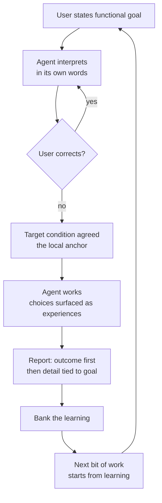

# Functional Interaction Specification

> **Provenance.** This document distills a design conversation held
> 2026-08-29 between the operator (product manager, keeper of functional
> requirements) and the coding agent. The reasoning chain is preserved in
> full — including the rejected approaches — because the rejections are
> as load-bearing as the agreements: each one names a failure mode that
> any future implementation must not reintroduce.

## 1. The problem (universal, not personal)

The interaction between LLM agents and humans has a structural asymmetry:

- The **human plane** is functional: goals are purposes, experiences,
  capabilities — expressed in natural language and images.
- The **agent plane** is technical: code, diffs, APIs, artifacts — the
  agent's training distribution and native register.

Current agent architecture puts both planes in one context window with
one attention budget. The executor role generates the overwhelming
majority of tokens (tool results, code, diffs), so executor cognition
crowds out interpreter cognition. The functional requirement — the
human's actual goal — is consumed at translation time and discarded.
The technical proxy becomes the objective. This is proxy capture in the
sense of the reward-hacking literature[^proxies]: the optimized proxy
ceases to track the true objective precisely because the optimizer only
sees the proxy.

This severance is **universal to LLM-human interaction**, not a defect
of any one user, model, or prompt. Any fix that lives inside the context
window (prompt text, injected reminders) is subject to the same
crowding-out it is meant to prevent — it is made of the same melting
medium. The fix must change the *structure of the interaction*, not the
*content of the window*.

## 2. The division of responsibilities

- The **user** is in the role of **product manager**: keeper of the
  functional requirements, speaker and thinker in terms of the user, a
  technically literate user advocate. The user's decision criteria and
  contact surface are the functional requirements, functional
  specifications, and functional descriptions of the code.
- The **coding agent** is responsible for **fitting the technical
  implementation** to those functional descriptions and requirements.

The agent interprets the functional requirement; it never revises it.
The user keeps authorship; the agent demonstrates comprehension.

## 3. Design principles (with the reasoning chain)

Each principle below was reached by rejecting its predecessor. The
rejections are recorded so they are not re-proposed.

| Approach | Why rejected |
|----------|--------------|
| Role text in the system prompt ("do not decide unilaterally") | Constraints are statements *about the agent*; they habituate and get crowded out by the same token flood they oppose. The melting umbrella. |
| Periodic re-injection of the requirement as a system message | More tokens in the same medium; after a few cycles the model habituates to the repeated message as background noise. |
| Hard gates at every decision point (loop-enforced checks) | Hard constraints on an optimizer provoke escape-seeking — the agent reasons about the wall, not the goal[^proxies]. Compliance in letter, violation in spirit. |
| Spec-driven development (global machine-enforced specs) | Too rigid; global constraints are a system to game. Agents logically search for escape from constraint systems. |

**P1 — Gradients over constraints.** A constraint says "you may not" —
a wall to probe. A gradient says "this is what the choice is between" —
the shape of the terrain at the decision point. The model cannot
habituate to the structure of the actual choice in front of it, because
each choice is new. You do not fence the optimizer; you set what it
optimizes.

**P2 — The gradient is created by anchoring reward on the local
functional goal.** In an agent system with a frozen base model, the
effective reward function is the *feedback structure*: what is measured,
scored, remembered, and fed back at each cycle. Anchoring those
structures on the local functional goal creates a mechanical gradient —
work that serves the goal is reinforced (progress recorded, prediction
validated, lesson ingested); work that does not is corrected by the
loop's own feedback.

**P3 — Local anchors, not global specs.** One specific functional goal
per bit of work, in the user's words, established through a single
interpretation round (agent states its understanding; user corrects).
Scoped to the task; expires with the task; accumulates nothing into a
spec-edifice to escape from.

**P4 — Constraints demoted to basin-nudges.** A minimal set of cheap
checks that fire only at the basin's edge (turn boundaries: anchor
exists before work starts; report references the outcome). Their job is
steering into the zone where the gradient acts — never governing
behavior inside it. More carrot than stick.

**P5 — The kata mapping.** The architecture maps exactly onto the
Improvement Kata PDCA loop, which is the work logic of human teams[^kata]:

| Kata concept | Gradient architecture |
|---|---|
| Target condition | The local functional goal (the anchor) |
| Grasp current condition | The interpretation round |
| Experiment (PDCA) | The agent's work, as moves toward the target |
| Reflection step | Gradient application — deviation measured, next step adjusted |
| Iterated cycles | The series of prompts; convergence is actual condition approaching target condition |

This connects LLM work directly to how human businesses run work —
target, experiment, learn, adjust — rather than leaving technical
optimization loops (tests green, linters clean) as self-referential
rewards stranded from any human goal. The technical loop becomes a
sub-loop of the functional loop: tests exist to serve the target
condition, not as goals in themselves.

**P6 — Carrot-dominance.** Progress toward the target condition is the
reinforcement; a failed experiment is information, not a violation.
Deviation is not punished by rules — it is visible motion away from the
target, corrected by the loop's next cycle. You cannot hack a slope; you
can only walk uphill pointlessly, and the loop shows you that.

## 4. The four moves (the confirmed way of working)

The functional expression of the architecture — what the user
experiences in every bit of work:

1. **Point at the same target.** Before work starts, the agent states
   its understanding of the goal — what the user will be able to do, or
   what stops being a problem — and the user corrects it if wrong. One
   exchange; then both know what "done" means, in the user's words.
2. **Bring choices to the user as experiences.** When a choice changes
   what the user will experience, the agent frames it as the experience
   ("if X, you'll see Y; if Z, you'll see W; I recommend Z because
   [goal]"), with options and a recommendation. The user decides; the
   agent implements.
3. **Report outcomes, not artifacts.** Work reports lead with what the
   user can now do, or what no longer breaks. Technical detail follows,
   each piece tied to the part of the goal it serves. The user never
   reverse-engineers what the work means for them.
4. **Bank the learning.** Each bit of work ends by naming what was
   learned — about the goal, the approach, each other — and the next bit
   of work starts from that learning instead of from scratch.

None of this requires the user to enforce it. It is how the system
works by default.

## 5. Target condition (the agreed experience)

When a user works with the agent:

- The agent opens by stating its understanding of what the user wants —
  and the user never discovers a misread at the diff.
- Choices that change the user's experience arrive as experiences, with
  options and a recommendation; the user decides.
- Reports lead with what the user can now do or what no longer breaks.
- Learning carries forward between sessions.
- None of it requires enforcement by the user.

## 6. Implementation direction: A then B

- **Phase A — the conversational loop (landed 2026-08-29, D40).** The four
  moves wired into the agent's turn structure: the `## Division of
  Responsibilities (kask)` section in `system_prompt.hbs` (intake
  interpretation, functional-first reporting, choice surfacing), plus the
  amended autonomy, ambition, and Final Message bullets. Pinned by five
  template tests.
- **Phase B — the work-tracking layer (goal slice landed 2026-08-29;
  ephemerality ruling applied same day).** The native goal system in the
  kata-kanban MCP server: `kanban_goal_create` (functional goal +
  observable criteria + intake prediction), `kanban_goal_judge`
  (recorded verdicts with confidence — the history IS the learning),
  `kanban_goal_score` (resolution + Brier of the intake prediction;
  `null` surfaced when no prediction was recorded), and
  `kanban_goal_list` (session recall). Schema lifted from the validated
  `goal-analysis` skill; Brier via `hkask_forecast::brier_score`. The
  kanban Steer prompt advertises all four tools (the
  `server_tools_are_all_advertised` gate).

  **Goals are ephemeral; curator memory is the vehicle (operator ruling
  2026-08-29).** The goal store is in-memory and dies with the process —
  conversational goals leave no persistent clutter. Replay protection for
  `kanban_goal_create` is likewise process-local (a separate
  `goal_idempotency` store on the server, never the durable kanban-DB
  idempotency store): a durable replay cache would return a stale success —
  the dead goal's id — after a restart, handing the agent a ghost pointer
  whose next `kanban_goal_judge` fails NotFound. Pinned by
  `goal_replay_protection_does_not_survive_a_restart`. The durable record is
  the curator's memory: every `kanban_goal_*` tool result in a turn is
  extracted by the thread-side record builder
  (`ThreadTurnRecord.goal_events`) and written by the bridge's ingestion
  path (`kask_bridge/src/memory/ingest.rs`) as first-class goal h_mems —
  curator-perspective Private for curator turns ("the curator remembers all
  goals it is involved with"), shared copy for zed-agent turns (recallable,
  not sovereign). Lessons are learned in `therapy` and `algedonic-review`
  sessions with the curator, not from a persistent goal store.

  **Criterion-coupling layer (2026-08-30).** Two seams closed the
  functional–technical join — the mapping between the technical plan and
  the functional goal it serves. (1) `kanban_goal_judge` requires a result
  for **every** criterion, exactly once: the per-criterion results are the
  explicit obligation the Brier score discharges, so a verdict with missing
  or duplicate results is an unanchored claim and is rejected with an
  error naming the missing indices. (2) `kanban_task_create` accepts
  `advances`: citations of the form `{goal_id, criterion_index,
  criterion_text}` declaring which goal criterion the task advances.
  Citations are **documentation-grade** (per-session re-anchoring, extending
  the ephemerality ruling): validated against the live goal at creation —
  the goal must exist, the index must be in range, and the text must match
  verbatim — and the captured text keeps the citation readable after the
  ephemeral goal is gone. Tasks are the durable side, so the citation is
  captured data on the task, never a foreign key into the in-memory goal
  store. `advances_count` is surfaced on task create/list/update responses
  so the citation rate is observable. `kanban_task_update` accepts
  `advances` as a full-list replacement, re-anchoring every citation
  against the live goal store at each write — an invalid replacement is
  rejected and leaves the task's existing citations untouched.

  **Criterion-instrument rule (2026-08-30, operator ruling).** A goal
  criterion must name its resolution instrument — a test outcome, a
  tool result, a file state, a market resolution, a log line, a date.
  A criterion that cannot name one is a preference, not a criterion:
  preferences live in the goal text, never the criteria. The Brier
  signal is only as empirical as the criteria it resolves against.

- **Loop closed (2026-08-29):** the Division section now wires the moves
  to the native tools — conditionally on `kanban_goal_create` being in
  the turn's tool registry (Move 1 → `kanban_goal_create` at intake,
  Move 3 → `kanban_goal_judge` at report, Move 4 → `kanban_goal_score`
  at resolution). When the kata-kanban server is connected, the loop
  runs on the native system; when it isn't, the wiring vanishes and the
  four moves survive as conversational discipline.

- A without B stays per-conversation; B without A changes tracking but
  not the conversation the user sits in. Both are landed and wired;
  the behavioral probe has run (2026-08-30) — its record is §7.

## 7. Verification

The pinning is behavioral, not textual: a session probe in which a task
with an embedded functional decision is run fresh, checking that the
interpretation arrives before code, choices arrive as experiences, and
the report leads with the outcome. Longitudinally: convergence across
the series — the user's goal-statements sharpen and the agent's language
drifts functional. Gradient strength is an empirical parameter; the
series of prompts is what accumulates the pressure.

### Probe record (2026-08-30)

The probe ran live. Two defects blocked it across three prior sessions —
both found by the probe's own attempts, and recorded here because they
are failure modes a future probe must not reintroduce:

- **The thread-stop defect (D42):** hardcoded 4096-token thinking budgets
  in provider model modes silently killed reasoning-heavy turns —
  `finish_reason: "length"` mapped to `StopReason::MaxTokens`, the turn
  ended with no operator-visible error, and six consecutive probe turns
  died after announcing tool calls. Fixed in the provider layer
  (`budget_tokens: None`); D43 additionally logs MaxTokens turn-ends
  with the stop reason and content state.
- **Per-turn tool pruning (D44):** the LazyToolRouter removed
  `kanban_goal_create` from every probe turn — the probe could not run
  its own instrument. Removed outright (2026-08-30): the full registered
  MCP surface is presented every turn, a system-prompt visibility
  marker names the count of tools hidden by the remaining filter layers
  (agent-profile allowlists, per-tab server scope, curator edit-tool
  gating), and the `list_mcp_tools` meta-tool enumerates the registered
  surface on demand.

**Verified live (2026-08-30):**

- The goal tools instantiate and loop on the native system: a goal
  created with 4 criteria and an intake prediction (0.75) before any
  work — the first session of the mission with the full MCP surface
  present.
- The ephemerality architecture works end-to-end: prior sessions' goals
  died with their processes, and the mission's predictions returned
  from curator memory — the durable vehicle carried the record across
  the restart. Write leg (turn → memory ingest, 26+ ingests) verified
  2026-08-30; read leg verified in both forms:
  `curator_semantic_search` (5 results) and entity recall on
  `curator:thread:<uuid>` (17 h_mems).
- **The score did not fire — the ephemeral goal store died with a
  mid-session server restart.** The concurrent session's rebuild landed
  between turns; `kanban_goal_judge` and `kanban_goal_score` return
  not-found on the dead goal (fix A's no-ghost-replay design working as
  intended — the fresh store already carries another session's goal,
  created post-restart). The outcome resolves from the durable record,
  per criterion: goal-create ✓, recall leg ✓, spec §7 ✓, judge/score ✗
  — the instrument died before it could record. Intake prediction
  0.75, committed before the work. Strict reading: achieved=false →
  Brier 0.5625. **Operator ground truth (2026-08-30): goal achieved**
  — C3's failure was the instrument's death, not the work's — so the
  recorded score is **Brier 0.0625**, computed from the record, not
  instrument-scored. Two
  calibration lessons: (1) the 0.75 did not price the mid-session
  restart hazard (concurrent commits landing, a rebuild expected) —
  intake predictions price environmental liveness; (2) a criterion's
  resolution instrument must outlive the work, or the score fires
  before the instrument dies. The first live instrument-scored Brier
  awaits the next goal that closes within its process's life.

**Operational findings (the recall surface):**

- Turn records are keyed under `curator:thread:<uuid>` entities; recall
  on topic names returns 0. An agent that does not know its thread uuid
  should use semantic search.
- Zed-agent turns are ingested as shared, perspective-free copies:
  `perspective_scoped` recall returns 0 on agent threads while
  `entity_wide` returns the records — consistent with the design
  (shared, not sovereign).
- This session's own turns were not surfaced by semantic search at
  close: the query naming the goal id and its prediction returned only
  prior-session turns (top-3). Either this thread's turns have not
  ingested since the restart, or their embeddings lag the searchable
  surface. The write leg was verified on the prior session's thread
  (26+ ingests); this session's thread is unresolved — discriminator:
  entity recall on this thread's uuid, or a later search once
  embeddings settle. Reported, not chased.

**Design lesson (operator corrections, 2026-08-30, two steps):** the
probe's scoring basis was corrected twice, each step deeper. First:
the scoring basis must be the operator's own observation channel — an
agent's evidence table is self-report, not ground truth. Then the
deeper correction: no subjective reading of a long text stream is a
stable optimization target — optimizing to it optimizes to reading
comprehension, attention, and mood. The calibration signal must be
empirical and out-of-sample: predictions committed before observation,
resolved by the world (a test outcome, a tool result, a file state, a
market resolution, a log line, a date), Brier-scored against the
resolution. The operator's subjective experience is the requirements
signal and a longitudinal check across the series — never a per-turn
scoring instrument. Behavioral properties of the interaction are
pinned structurally (the D40 template tests), not scored by reading.
The behavioral predictions P1 = 0.75 (report leads with the functional
outcome), P2 = 0.60 (interpretation before code), P4 = 0.65 (choices as
experiences with options + recommendation) are retired as scored
instruments; P3 was structural (the wiring) all along. The reference
models were anchored precisely so the loop inherits their empirical
validation instead of inventing homegrown signals — the behavioral
probe invented one anyway; this correction retires it.

## 8. Stewardship

- **Shared goal (PS-01):** agent work that serves the user's functional
  goals, with the severance of function from technique eliminated.
- **Bounded lexicon (PS-02):** *anchor* (local functional goal),
  *gradient* (directional pull created by reward anchoring), *nudge*
  (basin-edge constraint), *target condition* (kata term for the
  anchor), *four moves* (the interaction loop).
- **Mode of play (PS-03):** collaborative design conversation between
  product manager and implementer.
- **Voice (PS-12):** invitational throughout.

[^proxies]: Cassidy Laidlaw, Shivam Singhal, Anca Dragan. *Correlated
Proxies: A New Definition and Improved Mitigation for Reward Hacking.*
arXiv:2403.03185. https://arxiv.org/abs/2403.03185 — formal treatment
of proxy optimization producing escape-from-constraint behavior.

[^kata]: Mike Rother. *Toyota Kata: Managing People for Improvement,
Adaptiveness, and Superior Results.* McGraw-Hill, 2010 — the
Improvement Kata / Coaching Kata as the human-team work loop this
architecture maps onto.
