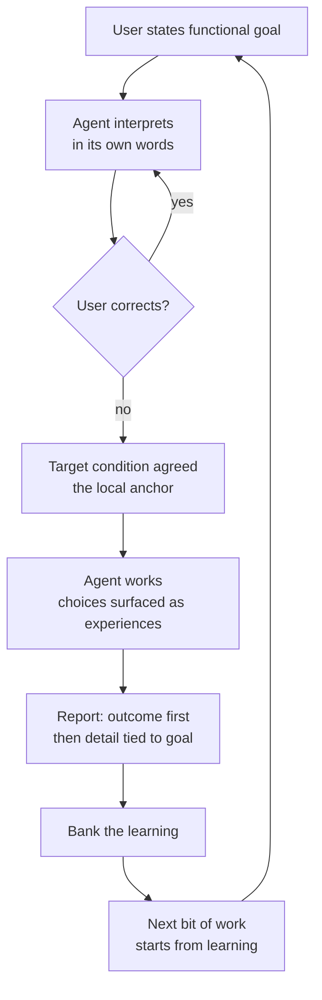

# Functional Interaction Specification

> **Provenance.** This document distills a design conversation held
> 2026-08-29 between the operator (product manager, keeper of functional
> requirements) and the coding agent. The reasoning chain is preserved in
> full — including the rejected approaches — because the rejections are
> as load-bearing as the agreements: each one names a failure mode that
> any future implementation must not reintroduce.

## 1. The problem (universal, not personal)

The interaction between LLM agents and humans has a structural asymmetry:

- The **human plane** is functional: goals are purposes, experiences,
  capabilities — expressed in natural language and images.
- The **agent plane** is technical: code, diffs, APIs, artifacts — the
  agent's training distribution and native register.

Current agent architecture puts both planes in one context window with
one attention budget. The executor role generates the overwhelming
majority of tokens (tool results, code, diffs), so executor cognition
crowds out interpreter cognition. The functional requirement — the
human's actual goal — is consumed at translation time and discarded.
The technical proxy becomes the objective. This is proxy capture in the
sense of the reward-hacking literature[^proxies]: the optimized proxy
ceases to track the true objective precisely because the optimizer only
sees the proxy.

This severance is **universal to LLM-human interaction**, not a defect
of any one user, model, or prompt. Any fix that lives inside the context
window (prompt text, injected reminders) is subject to the same
crowding-out it is meant to prevent — it is made of the same melting
medium. The fix must change the *structure of the interaction*, not the
*content of the window*.

## 2. The division of responsibilities

- The **user** is in the role of **product manager**: keeper of the
  functional requirements, speaker and thinker in terms of the user, a
  technically literate user advocate. The user's decision criteria and
  contact surface are the functional requirements, functional
  specifications, and functional descriptions of the code.
- The **coding agent** is responsible for **fitting the technical
  implementation** to those functional descriptions and requirements.

The agent interprets the functional requirement; it never revises it.
The user keeps authorship; the agent demonstrates comprehension.

## 3. Design principles (with the reasoning chain)

Each principle below was reached by rejecting its predecessor. The
rejections are recorded so they are not re-proposed.

| Approach | Why rejected |
|----------|--------------|
| Role text in the system prompt ("do not decide unilaterally") | Constraints are statements *about the agent*; they habituate and get crowded out by the same token flood they oppose. The melting umbrella. |
| Periodic re-injection of the requirement as a system message | More tokens in the same medium; after a few cycles the model habituates to the repeated message as background noise. |
| Hard gates at every decision point (loop-enforced checks) | Hard constraints on an optimizer provoke escape-seeking — the agent reasons about the wall, not the goal[^proxies]. Compliance in letter, violation in spirit. |
| Spec-driven development (global machine-enforced specs) | Too rigid; global constraints are a system to game. Agents logically search for escape from constraint systems. |

**P1 — Gradients over constraints.** A constraint says "you may not" —
a wall to probe. A gradient says "this is what the choice is between" —
the shape of the terrain at the decision point. The model cannot
habituate to the structure of the actual choice in front of it, because
each choice is new. You do not fence the optimizer; you set what it
optimizes.

**P2 — The gradient is created by anchoring reward on the local
functional goal.** In an agent system with a frozen base model, the
effective reward function is the *feedback structure*: what is measured,
scored, remembered, and fed back at each cycle. Anchoring those
structures on the local functional goal creates a mechanical gradient —
work that serves the goal is reinforced (progress recorded, prediction
validated, lesson ingested); work that does not is corrected by the
loop's own feedback.

**P3 — Local anchors, not global specs.** One specific functional goal
per bit of work, in the user's words, established through a single
interpretation round (agent states its understanding; user corrects).
Scoped to the task; expires with the task; accumulates nothing into a
spec-edifice to escape from.

**P4 — Constraints demoted to basin-nudges.** A minimal set of cheap
checks that fire only at the basin's edge (turn boundaries: anchor
exists before work starts; report references the outcome). Their job is
steering into the zone where the gradient acts — never governing
behavior inside it. More carrot than stick.

**P5 — The kata mapping.** The architecture maps exactly onto the
Improvement Kata PDCA loop, which is the work logic of human teams[^kata]:

| Kata concept | Gradient architecture |
|---|---|
| Target condition | The local functional goal (the anchor) |
| Grasp current condition | The interpretation round |
| Experiment (PDCA) | The agent's work, as moves toward the target |
| Reflection step | Gradient application — deviation measured, next step adjusted |
| Iterated cycles | The series of prompts; convergence is actual condition approaching target condition |

This connects LLM work directly to how human businesses run work —
target, experiment, learn, adjust — rather than leaving technical
optimization loops (tests green, linters clean) as self-referential
rewards stranded from any human goal. The technical loop becomes a
sub-loop of the functional loop: tests exist to serve the target
condition, not as goals in themselves.

**P6 — Carrot-dominance.** Progress toward the target condition is the
reinforcement; a failed experiment is information, not a violation.
Deviation is not punished by rules — it is visible motion away from the
target, corrected by the loop's next cycle. You cannot hack a slope; you
can only walk uphill pointlessly, and the loop shows you that.

## 4. The four moves (the confirmed way of working)

The functional expression of the architecture — what the user
experiences in every bit of work:

1. **Point at the same target.** Before work starts, the agent states
   its understanding of the goal — what the user will be able to do, or
   what stops being a problem — and the user corrects it if wrong. One
   exchange; then both know what "done" means, in the user's words.
2. **Bring choices to the user as experiences.** When a choice changes
   what the user will experience, the agent frames it as the experience
   ("if X, you'll see Y; if Z, you'll see W; I recommend Z because
   [goal]"), with options and a recommendation. The user decides; the
   agent implements.
3. **Report outcomes, not artifacts.** Work reports lead with what the
   user can now do, or what no longer breaks. Technical detail follows,
   each piece tied to the part of the goal it serves. The user never
   reverse-engineers what the work means for them.
4. **Bank the learning.** Each bit of work ends by naming what was
   learned — about the goal, the approach, each other — and the next bit
   of work starts from that learning instead of from scratch.

None of this requires the user to enforce it. It is how the system
works by default.

## 5. Target condition (the agreed experience)

When a user works with the agent:

- The agent opens by stating its understanding of what the user wants —
  and the user never discovers a misread at the diff.
- Choices that change the user's experience arrive as experiences, with
  options and a recommendation; the user decides.
- Reports lead with what the user can now do or what no longer breaks.
- Learning carries forward between sessions.
- None of it requires enforcement by the user.

## 6. Implementation direction: A then B

- **Phase A — the conversational loop.** The four moves wired into the
  agent's turn structure: anchor interpretation at turn start,
  functional-first reporting, choice surfacing. Felt in the next
  session. Smaller change; per-conversation.
- **Phase B — the work-tracking layer.** The four moves anchored in the
  kata/kanban machinery: functional target conditions, experiments,
  banked learning, visible on the board. Deeper change; the loop
  persists and accumulates across sessions.
- A without B stays per-conversation; B without A changes tracking but
  not the conversation the user sits in. A first, then B.

## 7. Verification

The pinning is behavioral, not textual: a session probe in which a task
with an embedded functional decision is run fresh, checking that the
interpretation arrives before code, choices arrive as experiences, and
the report leads with the outcome. Longitudinally: convergence across
the series — the user's goal-statements sharpen and the agent's language
drifts functional. Gradient strength is an empirical parameter; the
series of prompts is what accumulates the pressure.

## 8. Stewardship

- **Shared goal (PS-01):** agent work that serves the user's functional
  goals, with the severance of function from technique eliminated.
- **Bounded lexicon (PS-02):** *anchor* (local functional goal),
  *gradient* (directional pull created by reward anchoring), *nudge*
  (basin-edge constraint), *target condition* (kata term for the
  anchor), *four moves* (the interaction loop).
- **Mode of play (PS-03):** collaborative design conversation between
  product manager and implementer.
- **Voice (PS-12):** invitational throughout.

[^proxies]: Cassidy Laidlaw, Shivam Singhal, Anca Dragan. *Correlated
Proxies: A New Definition and Improved Mitigation for Reward Hacking.*
arXiv:2403.03185. https://arxiv.org/abs/2403.03185 — formal treatment
of proxy optimization producing escape-from-constraint behavior.

[^kata]: Mike Rother. *Toyota Kata: Managing People for Improvement,
Adaptiveness, and Superior Results.* McGraw-Hill, 2010 — the
Improvement Kata / Coaching Kata as the human-team work loop this
architecture maps onto.
