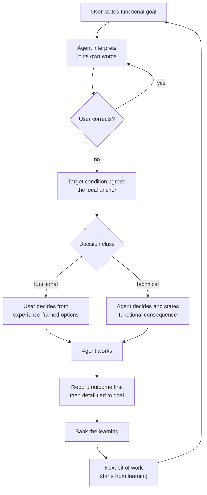

# Functional Interaction Specification

> **Provenance.** This document distills a design conversation held
> 2026-08-29 between the operator (product manager, keeper of functional
> requirements) and the coding agent. The reasoning chain is preserved in
> full — including the rejected approaches — because the rejections are
> as load-bearing as the agreements: each one names a failure mode that
> any future implementation must not reintroduce.

## 1. The problem (universal, not personal)

The interaction between LLM agents and humans has a structural asymmetry:

- The **human plane** is functional: goals are purposes, experiences,
  capabilities — expressed in natural language and images.
- The **agent plane** is technical: code, diffs, APIs, artifacts — the
  agent's training distribution and native register.

Current agent architecture puts both planes in one context window with
one attention budget. The executor role generates the overwhelming
majority of tokens (tool results, code, diffs), so executor cognition
crowds out interpreter cognition. The functional requirement — the
human's actual goal — is consumed at translation time and discarded.
The technical proxy becomes the objective. This is proxy capture in the
sense of the reward-hacking literature[^proxies]: the optimized proxy
ceases to track the true objective precisely because the optimizer only
sees the proxy.

This severance is **universal to LLM-human interaction**, not a defect
of any one user, model, or prompt. Any fix that lives inside the context
window (prompt text, injected reminders) is subject to the same
crowding-out it is meant to prevent — it is made of the same melting
medium. The fix must change the *structure of the interaction*, not the
*content of the window*.

## 2. The division of responsibilities

- The **user** is in the role of **product manager**: keeper of the
  functional requirements, speaker and thinker in terms of the user, a
  technically literate user advocate. The user's decision criteria and
  contact surface are the functional requirements, functional
  specifications, and functional descriptions of the code.
- The **coding agent** is responsible for **fitting the technical
  implementation** to those functional descriptions and requirements.

The agent interprets the functional requirement; it never revises it.
The user keeps authorship; the agent demonstrates comprehension.

*Operationalization (2026-09-04, operator-ratified):* each side of this
division now has a skill as its working rubric — the `program-manager`
skill for the agent's side (spec recovery, design-before-coding,
definition of done, closure ledger) and the `product-manager` skill for
the user's side (the intake contract: requirement, spec provenance,
acceptance criteria, constraints, decisions, confirmation). The system
prompt's Division of Responsibilities section names both and routes
underspecified intake to the product-manager skill rather than
improvisation. The skills do not change the division — they make each
side's deliverables explicit so the collaboration fails less often at
the handoff points.

## 3. Design principles (with the reasoning chain)

Each principle below was reached by rejecting its predecessor. The
rejections are recorded so they are not re-proposed.

| Approach | Why rejected |
|----------|--------------|
| Role text in the system prompt ("do not decide unilaterally") | Constraints are statements *about the agent*; they habituate and get crowded out by the same token flood they oppose. The melting umbrella. |
| Periodic re-injection of the requirement as a system message | More tokens in the same medium; after a few cycles the model habituates to the repeated message as background noise. |
| Hard gates at every decision point (loop-enforced checks) | Hard constraints on an optimizer provoke escape-seeking — the agent reasons about the wall, not the goal[^proxies]. Compliance in letter, violation in spirit. |
| Spec-driven development (global machine-enforced specs) | Too rigid; global constraints are a system to game. Agents logically search for escape from constraint systems. |

**P1 — Gradients over constraints.** A constraint says "you may not" —
a wall to probe. A gradient says "this is what the choice is between" —
the shape of the terrain at the decision point. The model cannot
habituate to the structure of the actual choice in front of it, because
each choice is new. You do not fence the optimizer; you set what it
optimizes.

**P2 — The gradient is created by anchoring reward on the local
functional goal.** In an agent system with a frozen base model, the
effective reward function is the *feedback structure*: what is measured,
scored, remembered, and fed back at each cycle. Anchoring those
structures on the local functional goal creates a mechanical gradient —
work that serves the goal is reinforced (progress recorded, prediction
validated, lesson ingested); work that does not is corrected by the
loop's own feedback.

**P3 — Local anchors, not global specs.** One specific functional goal
per bit of work, in the user's words, established through a single
interpretation round (agent states its understanding; user corrects).
Scoped to the task; expires with the task; accumulates nothing into a
spec-edifice to escape from.

**P4 — Constraints demoted to basin-nudges.** A minimal set of cheap
checks that fire only at the basin's edge (turn boundaries: anchor
exists before work starts; report references the outcome). Their job is
steering into the zone where the gradient acts — never governing
behavior inside it. More carrot than stick.

**P5 — The kata mapping.** The architecture maps exactly onto the
Improvement Kata PDCA loop, which is the work logic of human teams[^kata]:

| Kata concept | Gradient architecture |
|---|---|
| Target condition | The local functional goal (the anchor) |
| Grasp current condition | The interpretation round |
| Experiment (PDCA) | The agent's work, as moves toward the target |
| Reflection step | Gradient application — deviation measured, next step adjusted |
| Iterated cycles | The series of prompts; convergence is actual condition approaching target condition |

This connects LLM work directly to how human businesses run work —
target, experiment, learn, adjust — rather than leaving technical
optimization loops (tests green, linters clean) as self-referential
rewards stranded from any human goal. The technical loop becomes a
sub-loop of the functional loop: tests exist to serve the target
condition, not as goals in themselves.

**P6 — Carrot-dominance.** Progress toward the target condition is the
reinforcement; a failed experiment is information, not a violation.
Deviation is not punished by rules — it is visible motion away from the
target, corrected by the loop's next cycle. You cannot hack a slope; you
can only walk uphill pointlessly, and the loop shows you that.

## 4. The four moves (the confirmed way of working)

The functional expression of the architecture — what the user
experiences in every bit of work:

1. **Point at the same target.** Before work starts, the agent states
   its understanding of the goal — what the user will be able to do, or
   what stops being a problem — and the user corrects it if wrong. One
   exchange; then both know what "done" means, in the user's words.
2. **Decide by class.** Functional decisions — what should be true and
   what the user will experience — belong to the user; the agent presents
   them as experiences with a recommendation. Technical decisions — design,
   structure, naming, and implementation — belong to the agent; it decides
   and presents the result with its functional consequence. A technical
   choice that genuinely needs user input is framed by what each option lets
   the user do, with technical detail attached as context.
3. **Report outcomes, not artifacts.** Work reports lead with what the
   user can now do, or what no longer breaks. Technical detail follows,
   each piece tied to the part of the goal it serves. The user never
   reverse-engineers what the work means for them.
4. **Bank the learning.** Each bit of work ends by naming what was
   learned — about the goal, the approach, each other — and the next bit
   of work starts from that learning instead of from scratch.

None of this requires the user to enforce it. It is how the system
works by default.

<!-- DIAGRAM_ALIGNMENT
id: DIAG-FUNCTIONAL-001
verified_date: 2026-09-15
verified_against: crates/agent/src/templates/system_prompt.hbs:1-20,304-343; crates/agent/src/templates.rs (division-of-responsibilities pin tests); kask/mcp-servers/hkask-mcp-kata-kanban/src/hkask_mcp_kata_kanban.rs:393-429,541-543
status: VERIFIED
-->

## 5. Target condition (the agreed experience)

When a user works with the agent:

- The agent opens by stating its understanding of what the user wants —
  and the user never discovers a misread at the diff.
- Functional choices arrive as experiences with a recommendation; the user
  decides them. Technical choices arrive as agent decisions with their
  functional consequences.
- Reports lead with what the user can now do or what no longer breaks.
- Learning carries forward between sessions.
- None of it requires enforcement by the user.

## 6. Implemented architecture

The interaction is implemented as two coupled layers.[^kata]

- **Conversation layer (D40).** The prompt opening fixes the roles; the
  `Division of Responsibilities` section implements the four moves; move 2 is
  **Decide by class**. Functional questions remain with the user, while the
  agent decides technical questions and reports their functional consequence
  (`crates/agent/src/templates/system_prompt.hbs:1-20,304-343`). Template tests
  pin the opening roles, decision classification, goal-tool wiring, and
  functional-first closeout (`crates/agent/src/templates.rs`).
- **Persistent goal layer.** `kanban_goal_create`, `kanban_goal_judge`,
  `kanban_goal_list`, and `kanban_goal_score` use the kanban service's DB-backed
  goal store. Goals survive server restarts until scoring resolves and removes
  them; the score remains the Brier closure and curator memory remains the
  durable outcome record
  (`kask/mcp-servers/hkask-mcp-kata-kanban/src/kanban/service_impl/goals.rs:9-15,40-50,176-244`;
  `kask/mcp-servers/hkask-mcp-kata-kanban/src/hkask_mcp_kata_kanban.rs:393-429,541-543`).
- **Criterion coupling.** A judge result covers every criterion exactly once.
  Task `advances` citations bind technical work to a goal criterion and remain
  readable after the goal is resolved. The citation is captured task data, not
  a foreign key to an ephemeral store.
- **Conditional use.** The prompt advertises native goal-tool steps only when
  `kanban_goal_create` is available. Without the server, the conversational
  discipline remains but no persistence capability is claimed.

## 7. Verification

The current definition of done is structural and falsifiable:

1. `test_system_prompt_contains_division_of_responsibilities` and its sibling
   template tests verify the role opening, Decide-by-class rule, and
   functional-outcome reporting in the rendered prompt
   (`crates/agent/src/templates.rs`).
2. `goal_replay_protection_survives_a_restart_and_replays_the_live_goal`
   verifies that an idempotent create returns the same still-live persistent
   goal after a server restart
   (`kask/mcp-servers/hkask-mcp-kata-kanban/tests/idempotent_creates.rs`).
3. Goal service tests exercise create, judge, list, score, owner isolation, and
   removal on resolution through the DB-backed service
   (`kask/mcp-servers/hkask-mcp-kata-kanban/src/kanban/service_impl/goals.rs`).
4. Outcome quality is resolved against each criterion's named instrument — a
   test result, tool result, file state, market resolution, log line, or date —
   rather than an agent's self-report. The operator supplies final ground truth;
   `kanban_goal_score` records the achieved/not-achieved outcome and Brier-scores
   the intake prediction.

*Scope-exempt from the Sourced-Ideas Mandate: this section indexes executable
verification for the design in §§3–6.*

## 8. Stewardship

- **Shared goal (PS-01):** agent work that serves the user's functional
  goals, with the severance of function from technique eliminated.
- **Bounded lexicon (PS-02):** *anchor* (local functional goal),
  *gradient* (directional pull created by reward anchoring), *nudge*
  (basin-edge constraint), *target condition* (kata term for the
  anchor), *four moves* (the interaction loop).
- **Mode of play (PS-03):** collaborative design conversation between
  product manager and implementer.
- **Voice (PS-12):** invitational throughout.

[^proxies]: Cassidy Laidlaw, Shivam Singhal, Anca Dragan. *Correlated
Proxies: A New Definition and Improved Mitigation for Reward Hacking.*
arXiv:2403.03185. https://arxiv.org/abs/2403.03185 — formal treatment
of proxy optimization producing escape-from-constraint behavior.

[^kata]: Mike Rother. *Toyota Kata: Managing People for Improvement,
Adaptiveness, and Superior Results.* McGraw-Hill, 2010 — the
Improvement Kata / Coaching Kata as the human-team work loop this
architecture maps onto.
