> **DEPRECATED 2026-08-10:** The `hkask-guard` crate and all components documented here (`ContentGuard`, `GuardedInferencePort`, `Spotlighter`, `CanaryToken`) have been removed from the codebase. The `RoleOverride` scanner's bare `system:` substring pattern produced false positives that blocked legitimate skill cascade template rendering, making the guard a net-negative failure mode. This document is retained for historical reference only.
>
> **FIDES taint layer — NOT YET ENFORCED (2026-08-11):** The guard layer above is gone, but the FIDES tool-taint lattice below is structurally present yet operationally inert. `ToolTaint`/`can_flow_to` (`hkask-capability/src/tool_taint.rs:34`) and `DefaultPolicy::check` (`hkask-regulation/src/runtime_policy.rs:71`) are live, but two gaps defeat the gate: (1) `check_untrusted_input` (`step_actions.rs:705`) reads taint from legacy `__taint__{key}` map markers that the write side (`StepContext::store_result`/`store_named`) no longer emits, so `has_untrusted_input` is always `false`; (2) `McpRuntime::get_tool_info` hardcodes `ToolTaint::Pure` for every MCP tool (`hkask-mcp/src/runtime.rs:370`), so the `Sink` arm never matches. Taint is now a field on `StepResult.taint` (`step_context.rs:40`). The legacy `propagate_taint_for_binding` function was removed when `executor.rs` was refactored into `step_actions.rs`/`step_context.rs`/`step_machine.rs`. Restoration is tracked as findings KS-01 (bridge the read path) and KS-02 (per-tool taint labels) in `kask/research/seam-audit/security-review.md`.

# Guard and Taint Pipeline

How untrusted content is marked, scanned, and gated as it crosses hKask's two
boundaries: the LLM I/O boundary (prompts in, completions out) and the tool
invocation boundary (context values into MCP tool arguments). The pipeline
combines two mechanisms — `ContentGuard` scanning (llm-guard pipelines) and
FIDES[^fides] information-flow taint labels — plus spotlighting[^spotlighting]
of tool outputs before they re-enter the LLM context.

## Components

| Component                         | Source                                                          | Role                                                                                                                                                      |
| --------------------------------- | --------------------------------------------------------------- | --------------------------------------------------------------------------------------------------------------------------------------------------------- |
| `ContentGuard`                    | `kask/crates/hkask-guard/src/pipeline.rs:126`                   | mandatory input/output scanner pair (injection, role override, token limit in; secrets + canary out)                                                      |
| `GuardConfig` / `from_env`        | `pipeline.rs:70` / `:89`                                        | scanner parameters (`HKASK_GUARD_TOKEN_LIMIT`, default 32 000) — presence is not configurable                                                             |
| `CanaryToken`                     | `pipeline.rs:23`                                                | per-session 32-byte hex token embedded in system prompts; its appearance in output signals prompt exfiltration (OWASP LLM07)                              |
| `GuardedInferencePort`            | `kask/crates/hkask-guard/src/guarded_inference.rs:1`            | `InferencePort` decorator: scans input before delegation and output after; wraps the primary port at the composition root (`crates/zed/src/main.rs:1812`) |
| `GuardedStream`                   | `guarded_inference.rs:46`                                       | streaming output accumulator; scans on stream end and emits a `finish_reason: "redacted"` chunk with sanitized text                                       |
| `Spotlighter` / `SpotlightMode`   | `kask/crates/hkask-guard/src/spotlight.rs:33` / `:19`           | transforms untrusted tool output (`Delimit` default; `Datamark`; `Encode`) so the LLM treats it as data, not instructions                                 |
| `ToolTaint`                       | `kask/crates/hkask-types/src/tool_taint.rs:14`                  | FIDES label lattice: `Source` / `Sink` / `Pure` / `Endorser`; `can_flow_to` blocks only `Source → Sink` (`tool_taint.rs:35`)                              |
| `DefaultPolicy` / `PolicyVerdict` | `kask/crates/hkask-regulation/src/runtime_policy.rs:49` / `:14` | pre-execution gate: Allow / Block / RequireHuman / Log                                                                                                    |
| `ManifestExecutor` taint fields   | `kask/crates/hkask-templates/src/executor.rs:143–160`           | `spotlighter`, `runtime_policy`, `taint_labels`, `terminal_check` — the executor-side wiring of the pipeline                                              |

## Mechanism

### LLM boundary — GuardedInferencePort

`GuardedInferencePort` (`guarded_inference.rs:1`) wraps any `InferencePort`.
The composition root wraps the primary inference port once
(`crates/zed/src/main.rs:1812`–`:1820`, built from
`GuardConfig::from_env` + `ContentGuard::mandatory`), making the boundary
universal by construction rather than per-caller opt-in. The manifest
executor is wired with the guarded port (`main.rs:1927`).

- **Non-streaming** (`generate`, `generate_with_model`, …): input is scanned
  via `ContentGuard::scan_input` (`pipeline.rs:257`) before delegation —
  prompt injection, role override, deobfuscated injection patterns, and the
  token limit; a violation returns `InferenceError::Generation` and emits
  `reg.guard.input`. Output is scanned via `scan_output` (`pipeline.rs:310`):
  secret leakage and canary appearance; secret-bearing output is **redacted
  in place**, not rejected, and emits `reg.guard.output`.
- **Streaming** (`generate_stream*`): input is scanned before delegation.
  Output scanning is **post-hoc**: `GuardedStream` (`guarded_inference.rs:46`)
  forwards chunks unchanged (preserving latency), accumulates up to
  `GUARD_ACCUMULATION_LIMIT = 256 KB` (`guarded_inference.rs:35`), and on
  stream end scans the accumulated text, emitting a final
  `finish_reason: "redacted"` chunk containing the sanitized replacement
  (`guarded_inference.rs:101`–`:116`).

> **Known limitation (do not over-claim):** `GuardedStream` is post-hoc
> redaction, not real-time blocking. The consumer may have already rendered
> the leaked text in real-time chunks; only the _stored_ version is sanitized.
> This is the `.rules` "GuardedStream is post-hoc redaction" trap, and the
> replace-not-append delta semantics are documented at
> `guarded_inference.rs:79`–`:100`.

### Tool boundary — FIDES taint + DefaultPolicy

Every MCP tool carries a `ToolTaint` label (`tool_taint.rs:14`). The FIDES
policy is a single lattice rule: `Source → Sink` is blocked
(`can_flow_to`, `tool_taint.rs:35`); every other flow is allowed. The full
4×4 matrix is pinned by `can_flow_to_matrix` (`tool_taint.rs:57`).

Inside the manifest executor:

1. **Labeling.** `invoke_tool` returns each tool result together with the
   tool's taint label (`executor.rs:444`–`:447`), and the label is stored in
   `taint_labels` under `step_{ordinal}_result`.
2. **Spotlighting.** Before the result enters the LLM context, it is passed
   through `spotlight_tool_output` (`executor.rs:1904`), which applies the
   executor's `Spotlighter` (constructed with `SpotlightMode::Delimit` at
   `executor.rs:183`).
3. **Propagation (currently inert).** Taint is now carried as a field on
   `StepResult.taint` (`step_context.rs:40`), written by
   `StepContext::store_result`/`store_named` and read via
   `StepContext::taint_of` (`step_context.rs:135`). The legacy
   `propagate_taint_for_binding` function (`executor.rs:282`) was **removed**
   when `executor.rs` was refactored into `step_actions.rs`/`step_context.rs`/
   `step_machine.rs`. The gate (`check_untrusted_input`, `step_actions.rs:705`)
   still reads taint from legacy `__taint__{key}` map markers, but the write side
   no longer emits those markers, so `has_untrusted_input` is always `false`.
   **Not yet enforced — pending KS-01 (bridge the read path to `StepResult.taint`)
   and KS-02 (per-tool taint labels).**
4. **Gating (currently inert).** Before each tool invocation,
   `check_untrusted_input` (`step_actions.rs:705`) scans the bound input JSON
   for both `{"$ref": ...}` objects and inline-Jinja `{{ step_N_result }}`
   strings, consulting the legacy `__taint__{key}` markers. When untrusted input
   is detected, `invoke_tool` (`step_actions.rs:768`) calls `DefaultPolicy::check`
   (`hkask-regulation/src/runtime_policy.rs:71`): `Block`/`RequireHuman` abort
   the step, `Log` emits a `reg.guard.runtime_policy` span, `Allow` proceeds
   (Rule 2, `runtime_policy.rs:86`). Because propagation is inert (§3),
   `has_untrusted_input` is always `false` and the `Sink` arm never fires.
   **Not yet enforced — pending KS-01/KS-02.**

```mermaid
flowchart TD
    subgraph LLM boundary
        A[Prompt input] --> G1[ContentGuard.scan_input<br/>pipeline.rs:257]
        G1 -->|violation| REJ[InferenceError::Generation<br/>reg.guard.input]
        G1 -->|clean| LLM[InferencePort]
        LLM --> G2[scan_output / GuardedStream<br/>pipeline.rs:310 / guarded_inference.rs:46]
        G2 -->|secret or canary| RED[redacted stored version<br/>reg.guard.output]
        G2 -->|clean| OUT[completion]
    end
    subgraph Tool boundary
        TOOL[MCP tool result] --> LAB[label with ToolTaint<br/>executor.rs:444]
        LAB --> SPOT[Spotlighter Delimit<br/>executor.rs:1904]
        SPOT --> CTX[(cascade context<br/>taint_labels)]
        CTX --> PROP[propagate_taint_for_binding<br/>executor.rs:282]
        PROP --> INS[context.insert]
        INS --> GATE[check_untrusted_input<br/>executor.rs:233]
        GATE --> POL{DefaultPolicy<br/>runtime_policy.rs:49}
        POL -->|Block / RequireHuman| STOP[step aborted]
        POL -->|Allow / Log| CALL[tool invoke]
    end
```

## Invariants and their enforcement points

Per the `.rules` rule "advertised invariants need enforcement points", each
invariant below names the exact code that enforces it.

| Invariant                                                  | Enforcement point                                                                                                                                                                                                                                               |
| ---------------------------------------------------------- | --------------------------------------------------------------------------------------------------------------------------------------------------------------------------------------------------------------------------------------------------------------- |
| Core scanners always active (not configurable off)         | `ContentGuard::mandatory` (`pipeline.rs:195`); `GuardConfig` controls parameters only (`pipeline.rs:70`)                                                                                                                                                        |
| `Source → Sink` flow blocked                               | **Structurally present, not yet enforced.** `ToolTaint::can_flow_to` (`hkask-capability/src/tool_taint.rs:34`) + `DefaultPolicy::check` consumed in `invoke_tool` (`step_actions.rs:786`); matrix pinned by `can_flow_to_matrix` (`tool_taint.rs:57`). Inert: `has_untrusted_input` is always `false` (KS-01) and every tool is labeled `Pure` (KS-02, `hkask-mcp/src/runtime.rs:370`). |
| Taint survives `input_mapping` binding                     | **Not yet enforced.** The legacy `propagate_taint_for_binding` was removed; taint is now a field on `StepResult.taint` (`step_context.rs:40`) read via `StepContext::taint_of` (`step_context.rs:135`), but the binding-path propagation is not wired to the gate. Pending KS-01. |
| Gate and propagation scan the same reference grammar       | `check_untrusted_input` (`step_actions.rs:705`) handles both `$ref` objects and inline-Jinja strings, but reads legacy `__taint__{key}` markers that are never written. Pending KS-01. |
| Unscanned streaming output never treated as clean          | `GuardedStream` scans on stream end (`guarded_inference.rs:66`–`:70`) and caps accumulation at 256 KB (`guarded_inference.rs:35`)                                                                                                                               |
| Malformed `HKASK_GUARD_TOKEN_LIMIT` is visible, not silent | `GuardConfig::from_env` warns with the raw value (`pipeline.rs:100`–`:107`)                                                                                                                                                                                     |

## Not yet enforced (honest notes)

- **Real-time streaming blocking.** As above: `GuardedStream` redacts the
  stored version only; text already forwarded to the consumer is not recalled
  (`guarded_inference.rs:79`–`:100`).
- **Canary reaction.** The canary detects exfiltration (output scan) but
  nothing downstream of `scan_output` currently halts the session on canary
  leakage; detection is span-level (`reg.guard.output`).
- **Taint labels outside the manifest executor.** The FIDES lattice is
  enforced for cascade tool invocations via `ManifestExecutor`. Other tool
  invocation paths (e.g. the agent's direct tool loop) rely on the
  `ContentGuard` boundary and OCAP gating, not on `taint_labels`.

---

[^fides]: Microsoft Research. (2025). _FIDES: Information flow control for LLM agents_ (arXiv:2505.23643). The Source/Sink/Pure/Endorser taint lattice and the Source→Sink endorsement rule implemented in `hkask-types/src/tool_taint.rs`.

[^spotlighting]: Microsoft Research. (2024). _Defending LLMs against prompt injection with spotlighting_ (arXiv:2403.14720). The delimit/datamark/encode transforms implemented in `hkask-guard/src/spotlight.rs`.

[^rlm-overthinking]: Wang, D. (2026). _Think, But Don't Overthink: Reproducing Recursive Language Models_ (arXiv:2603.02615v1). Documents the "parametric hallucination" failure mode at RLM recursion depth=2: models abandon input context and emit pre-trained constants from parametric memory. This is the empirical evidence justifying the taint-propagation requirement (now carried by `StepResult.taint`, `step_context.rs:40` — the legacy `propagate_taint_for_binding` was removed): without taint surviving `input_mapping` binding, deeper cascades lose context anchoring and hallucinate from parametric memory, the exact failure mode documented in §4.4. The paper also documents the `<thinking>` tag format-collapse failure (Appendix A.4) that `normalize_model_output` defends against.
