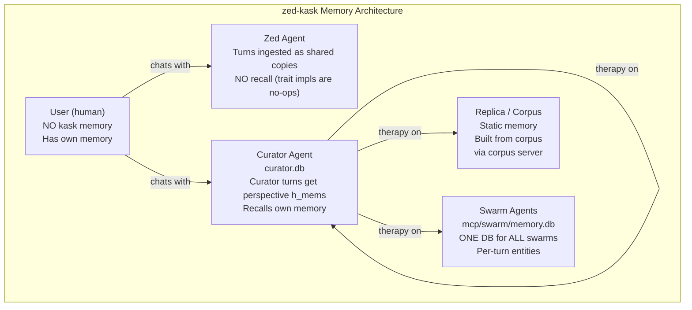
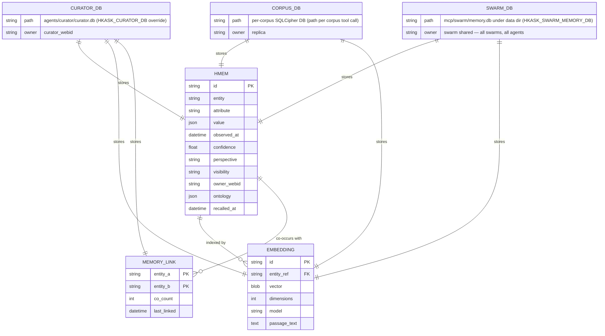
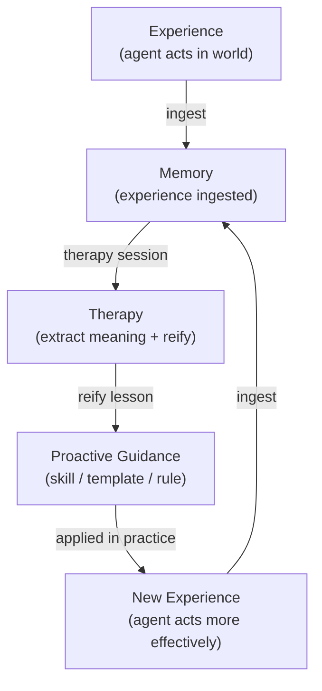
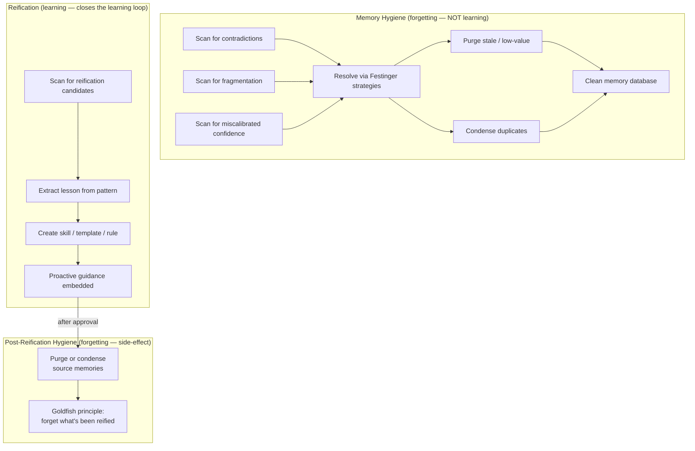
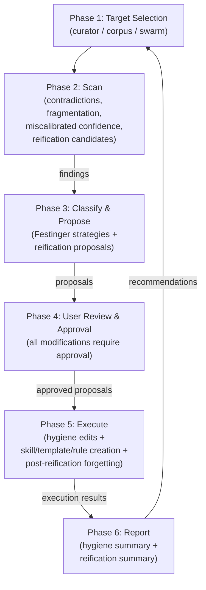
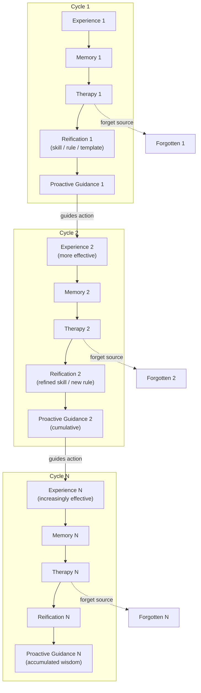
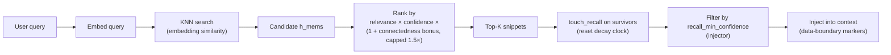
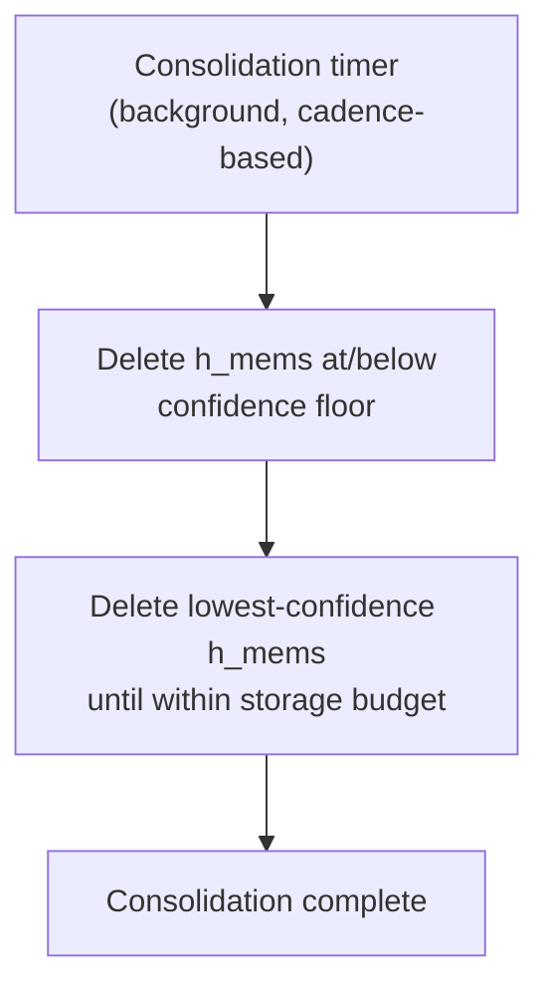
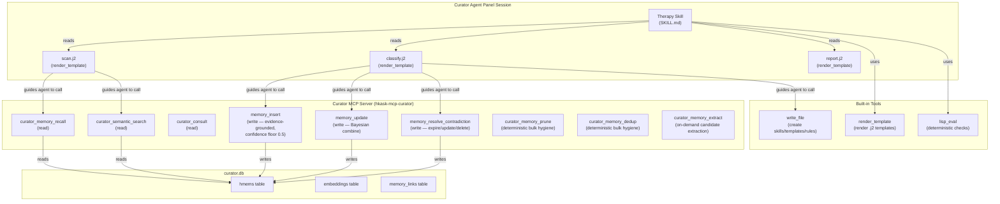

# Memory System Architecture & Recursive Self-Improvement Framework

**Status**: Reference document for the zed-kask memory system, therapy skill, and the recursive self-improvement framework. Updated 2026-08-28.

## Academic Grounding

### Computational models of memory

- **Cox & Shiffrin (2026)**, "Computational Models of Memory," *Open Encyclopedia of Cognitive Science* (OECS), MIT Press, DOI: 10.1162/oecs_8c02n2f1. Memory traces can be altered once retrieved; distorted traces produce retrieval noise; traces coevolve across events (Nelson & Shiffrin, 2013). The REM model (Shiffrin & Steyvers, 1997) parameters: `u` (transfer probability), `c` (correct storage probability), `g` (distinctiveness). Low `c` produces error-prone traces — therapy identifies and corrects these.

- **Atkinson & Shiffrin (1968)**, "Human memory: A proposed system and its control processes," *Psychology of Learning and Motivation*. The multi-store model: short-term (active, limited capacity) → long-term (permanent storehouse). Retrieval is a probe-activation process: traces activate in proportion to similarity to the probe.

- **Tulving (1972)**, "Episodic and semantic memory," *Organization of Memory*. The original episodic/semantic distinction — not implemented as a type system in zed-kask. All h_mems are unified; the ontology blob carries dual-axis anchoring (PKO process + DC state, `kask/crates/hkask-storage/src/hmem.rs:53-58`) but there is no type distinction.

### Cognitive dissonance and resolution

- **Festinger (1957)**, *A Theory of Cognitive Dissonance*. Three resolution strategies: reduce importance (lower confidence), add consonant (insert reconciling memory), remove dissonant (expire/delete). Therapy classifies contradictions by strategy. The `memory_resolve_contradiction` tool implements exactly these three strategies — `expire` (soft-delete), `update_confidence`, `delete` (`kask/mcp-servers/hkask-mcp-curator/src/hkask_mcp_curator.rs:1173-1177`).

- **Lidwell, W., Holden, K., & Butler, J. (2010)**, *Universal Principles of Design*. "People alleviate cognitive dissonance in one of three ways: by reducing the importance of dissonant cognitions, adding consonant cognitions, or removing or changing dissonant cognitions" (p. 39).

### Self-knowledge and calibration

- **Kruger, J. & Dunning, D. (1999)**, "Unskilled and Unaware of It," *Journal of Personality and Social Psychology* 77(6), 1121–1134. The double curse: the same skills needed to produce correct answers are needed to evaluate whether answers are correct. Implication: a model that writes its own confidence scores will miscalibrate. This is why `memory_insert` starts confidence at 0.5 — calibrated by outcomes, not self-assessment (`hkask_mcp_curator.rs:1035-1039`) — and why `memory_update` combines rather than replaces confidence (`hkask_mcp_curator.rs:1106-1110`).

- **Dunning, D. (2011)**, "The Dunning-Kruger Effect: On Being Ignorant of One's Own Ignorance," *Advances in Experimental Social Psychology* 44, 247–296. The feedback gap: without feedback, incorrect self-assessments persist. The Cassandra quandary: poor performers can't evaluate the expertise of others.

- **Ehrlinger, J. & Dunning, D. (2003)**, "How chronic self-views influence estimates of performance," *JPSP* 84(1), 5–17. Naive realism: people treat their own model as ground truth.

- **Dunning, D. (2018)**, "The Trouble of Not Knowing What You Do Not Know," *Reason, Bias, and Inquiry*, Oxford University Press. Hypocognition: lacking a cognitive representation for something. Overclaiming: claiming knowledge of nonexistent concepts. The recall absence-message guard implements this (`kask/crates/kask_bridge/src/context_injector.rs:285-311`).

- **Jansen, R. A., Rafferty, A. N. & Griffiths, T. L. (2021)**, "A rational model of the Dunning-Kruger effect," *Nature Human Behaviour* 5(6), 756–757. Insensitivity to evidence in low performers.

- **Dunning, D. & Helzer, E. G. (2014)**, "Beyond the Correlation Coefficient," *Perspectives on Psychological Science* 9(2), 126–130. "Make everybody better performers" — fix the underlying capability, not the metacognition.

### Forecasting and calibration

- **Brier, G. W. (1950)**, "Verification of forecasts expressed in terms of probability," *Monthly Weather Review*. The proper scoring rule for probabilistic forecasts.

- **Tetlock, P. & Gardner, D. (2015)**, *Superforecasting: The Art and Science of Prediction*. Brier scoring as the calibration mechanism. "Fuzzy thinking can never be proven wrong" (p. 274). "Not all practice improves skill. It needs to be informed practice" (p. 195). The dilution effect: irrelevant information weakens judgment (p. 178) — the rationale for the connectedness bonus cap in recall ranking (`kask/crates/kask_bridge/src/memory.rs:830-845`).

### AI memory systems

- **Park, J. S. et al. (2023)**, "Generative Agents: Interactive Simulacra of Human Behavior," arXiv:2304.03442. Observation → reflection → retrieval pipeline. In zed-kask, the reflection step is therapy (user-initiated), not a background loop.

- **Packer, C. et al. (2023)**, "MemGPT: Towards LLMs as Operating Systems," arXiv:2310.08560. OS-style hierarchical memory with permission boundaries. zed-kask's analogue is the per-owner SQLCipher DB with visibility scoping (`private`/`shared`/`public`, `kask/crates/hkask-storage/src/hmem.rs:105-108`).

- **Gallego, M. (2026)**, "Distilling Feedback into Memory-as-a-Tool," arXiv:2601.05960. Feedback distilled through a structured process; model proposes, rubric filters.

### The goldfish principle

- **Vardy, M. (2020)**, "Be a Goldfish," *Medium*. "Be a goldfish. Got a 10 second memory." The principle: don't let the past own the present. Applied to memory therapy: forgetting is a feature, not a bug. Once a lesson is reified into proactive guidance, the episodic memory can be forgotten.

---

## Architecture: Who Has Memory



<!-- DIAGRAM_ALIGNMENT
id: DIAG-MEM-WHO
verified_date: 2026-08-28
verified_against: kask/crates/kask_bridge/src/memory/ingest.rs:39-57 (all turns ingested, curator turns get perspective h_mem), kask/crates/kask_bridge/src/memory.rs:499-519 (zed-agent recall no-ops), kask/crates/kask_bridge/src/memory/curator_stores.rs:20-29 (curator.db path), kask/mcp-servers/hkask-mcp-swarm/src/config.rs:118-122 (swarm memory DB path), kask/mcp-servers/hkask-mcp-swarm/src/local_knowledge.rs:304-320 (one shared DB, per-turn entities)
status: VERIFIED
-->

**Key principle**: The user is human and has their own memory. Every completed turn — zed agent and curator alike — is ingested into the curator's sovereign `curator.db` as a shared copy, so the curator can recall what happened across all agents (`kask/crates/kask_bridge/src/memory/ingest.rs:39-57`). Recall is curator-only: the `MemoryPort` trait impls (`recall_context` / `recall_thread`) return empty vecs, and actual recall runs through the inherent `recall_context_curator` / `recall_thread_curator` methods (`kask/crates/kask_bridge/src/memory.rs:499-519`, `:568-614`). Swarm memory lives in the swarm MCP server, not the bridge — one shared DB for all swarms and agents (`local_knowledge.rs:304-320`).

### User sovereignty and transparency

The memory system is transparent to the user and respects user sovereignty:

- **The user can see what's in memory.** The curator MCP server's `curator_memory_recall` (`hkask_mcp_curator.rs:558`) and `curator_semantic_search` (`:483`) tools are read-only and available to all threads — the user can query the curator's memory at any time to see what's stored.

- **The user approves all memory modifications.** Therapy requires user approval for every modification — no autonomous memory editing. The curator proposes; the user approves. The three write tools (`memory_insert`, `memory_update`, `memory_resolve_contradiction`) are additionally restricted to curator threads by the thread's tool classification (`crates/agent/src/thread.rs:4903-4907`, pinned by `test_curator_memory_edit_tool_classification` at `thread.rs:11049`).

- **The user can run without recall.** The zed agent (the default coding agent) has no recall — the `MemoryPort` trait impls are no-ops (`memory.rs:499-519`). Its turns are ingested as shared copies only, so the curator observes them, but the zed agent itself never injects recalled memory. Setting `kask.memory.auto_inject` to false disables recall globally (`context_injector.rs:213-217`).

- **The user controls what the curator remembers.** All turns are ingested (shared copies), but only curator-panel turns produce curator-perspective h_mems — the curator's private memory of its own turns (`ingest.rs:100-130`). The user decides what enters the curator's private memory by choosing to work in the curator panel.

- **The user can purge memory.** The `memory_resolve_contradiction` tool (curator-only) allows the user to expire, de-confidence, or delete any h_mem (`hkask_mcp_curator.rs:1173`). `curator_memory_prune` (`:1278`) and `curator_memory_dedup` (`:1317`) provide deterministic bulk hygiene. The user is never trapped by accumulated memory.

- **Forgetting is deliberate, not automatic.** Consolidation (automatic) only deletes low-confidence h_mems and prunes to budget — it never deletes memories the user might want (`kask/crates/hkask-memory/src/consolidation_service.rs:29-33`). Therapy (user-initiated) is the deliberate forgetting process — the user chooses what to forget and why. The goldfish principle applies: forgetting is a feature, but only when done with awareness and purpose.

This design respects the principle that the system serves the user, not the other way around. Memory is a tool the user can use, inspect, modify, or disable — not a surveillance system that records the user without their knowledge or consent.

---

## Entity Relationships: Memory Storage



<!-- DIAGRAM_ALIGNMENT
id: DIAG-MEM-THERAPY-ERD
verified_date: 2026-08-28
verified_against: kask/crates/hkask-storage/src/core/sql/schema.sql:1 (hmems), :5 (embeddings incl. passage_text), :6 (vec_embeddings), :23-29 (memory_links); kask/crates/kask_bridge/src/memory/curator_stores.rs:20-29 (curator DB path); kask/mcp-servers/hkask-mcp-swarm/src/config.rs:118-122 (swarm DB path); kask/mcp-servers/hkask-mcp-corpus/src/tools/storage.rs (per-call db_path)
status: VERIFIED
-->

**Key**: All h_mems are unified — no episodic/semantic type distinction. The `ontology` blob carries dual-axis anchoring (PKO process + DC state, `hmem.rs:53-58`) but there is no type distinction. `MEMORY_LINK` tracks co-occurrence connectedness — recorded by the context injector after every non-empty recall (`context_injector.rs:324-335`) and read as a capped ranking bonus (`memory.rs:839-845`).

---

## The Learning Loop

The goal isn't for memory to accrete. The goal is for experiences to be saved in memory and then reified into skills, rules, or templates for **prospective, prescriptive, or expectational** practices and intelligence — rather than descriptive, retrospective, or reflective intelligence which memory is a part of.



<!-- DIAGRAM_ALIGNMENT
id: DIAG-MEM-LEARNING-LOOP
verified_date: 2026-08-28
verified_against: kask/crates/kask_bridge/src/memory/ingest.rs:58-235 (ingest step); .agents/skills/therapy/SKILL.md (therapy process); kask/registry/templates/therapy/ (scan.j2, classify.j2, report.j2)
status: VERIFIED
-->

**Therapy is the step that closes the learning loop.** Without therapy, memory accumulates but never becomes learning — the past is stored but not applied. Therapy extracts meaning from accumulated experience and reifies it into proactive guidance that shapes future action.

**Memory is retrospective/descriptive/reflective.** Skills, rules, and templates are prospective/prescriptive/expectational. Therapy is the bridge between the two.

---

## Memory Hygiene vs. Reification

Therapy runs two distinct processes. Do not conflate them.



<!-- DIAGRAM_ALIGNMENT
id: DIAG-MEM-HYGIENE-VS-REIFICATION
verified_date: 2026-08-28
verified_against: .agents/skills/therapy/SKILL.md (Phase 2 scan categories: contradictions, fragmentation, miscalibrated confidence, reification candidates); kask/mcp-servers/hkask-mcp-curator/src/hkask_mcp_curator.rs:1173 (resolve strategies), :1278 (prune), :1317 (dedup)
status: VERIFIED
-->

**Forgetting is NOT learning.** Purging and condensing source memories after reification is a hygiene side-effect — shedding low-value information so it doesn't obstruct future learning. The goldfish principle: once a lesson is reified into proactive guidance, the episodic memory that produced the lesson can be forgotten.

---

## Therapy Process Flow



<!-- DIAGRAM_ALIGNMENT
id: DIAG-MEM-THERAPY-FLOW
verified_date: 2026-08-28
verified_against: .agents/skills/therapy/SKILL.md (Phase 1–6 process); kask/registry/templates/therapy/scan.j2, classify.j2, report.j2 (template scaffolding)
status: VERIFIED
-->

**Therapy must run from a Curator agent panel session** (for curator memory). The memory-edit tools are classified curator-only by the thread (`crates/agent/src/thread.rs:4903-4907`) — a therapy session run from the zed agent cannot write curator memory. The curator must remember the act of therapy — the forgetting, the reification, the lessons learned — so the cybernetic loop closes (curator turns are ingested with the curator's perspective, `ingest.rs:100-130`).

---

## Recursive Self-Improvement Framework



<!-- DIAGRAM_ALIGNMENT
id: DIAG-MEM-RECURSIVE
verified_date: 2026-08-28
verified_against: .agents/skills/therapy/SKILL.md (therapy as the reification step); kask/crates/kask_bridge/src/memory/ingest.rs:58-235 (experience → memory); kask/registry/templates/ (skills/templates/rules as reification targets)
status: VERIFIED
-->

**The framework is recursive**: each cycle produces proactive guidance that makes the next experience more effective. The next experience generates new memory, which therapy processes into refined guidance. The source memories are forgotten (goldfish principle) — what persists is the reified guidance, not the episodic detail.

**Memory does not accrete — it converts.** Experiences are saved in memory, then reified into skills/rules/templates for prospective intelligence. The episodic detail is shed; the proactive guidance accumulates. This is the difference between a system that remembers the past (descriptive/retrospective) and a system that learns from the past (prospective/prescriptive/expectational).

### User sovereignty in the recursive framework

The recursive self-improvement framework is opt-in, not automatic:

- **The user triggers therapy.** Therapy does not run automatically — the user initiates it from a curator panel session. There is no background LLM pass over memory: `curator_memory_extract` is on-demand and inserts nothing automatically (`hkask_mcp_curator.rs:1358-1362`).
- **The user approves each reification.** The user reviews the proposed skill/template/rule content before it is created. The user can modify, reject, or defer.
- **The user approves each forgetting.** The user approves purging or condensing source memories as a separate decision from reification. The user can reify a lesson but keep the source memories.
- **The user can exit the loop.** The zed agent (default mode) has no recall — the user can work without any memory injection. The recursive framework only runs when the user explicitly chooses to work in the curator panel and invoke therapy.

The framework respects user sovereignty: the system learns only when the user chooses to teach it, forgets only what the user chooses to forget, and applies guidance only through skills/rules/templates the user has approved.

---

## Memory Recall Ranking



<!-- DIAGRAM_ALIGNMENT
id: DIAG-MEM-RANKING
verified_date: 2026-08-28
verified_against: kask/crates/kask_bridge/src/memory.rs:821-850 (sort: relevance × confidence × capped connectedness bonus), :852-867 (touch survivors only); kask/crates/kask_bridge/src/context_injector.rs:240-243 (confidence filter), :324-335 (co-occurrence recording)
status: VERIFIED
-->

**Recall ranking function** (implemented at `memory.rs:839-849`):
```
score = relevance_score × confidence × (1 + min(connectedness × 0.1, 0.5))
```

- **Relevance**: embedding cosine similarity (`1.0 - distance`, semantic leg) or `0.5` constant (keyword leg) — `memory.rs:734`, `:813`
- **Confidence**: the outcome-calibrated signal, decayed by the Wozniak-Gorzelanczyk forgetting curve — used as a ranking multiplier, not just a threshold
- **Connectedness**: co-occurrence link density from `memory_links`, applied as a bonus capped at 50% (max 1.5× multiplier) so a highly-connected entity cannot crowd out fresh memories — the Tetlock dilution guard (`memory.rs:830-845`)

**Absence signaling** (implemented at `context_injector.rs:285-311`): when recall returns zero results, the context injector returns a system message: "No relevant memory found for this query. This may indicate a knowledge gap." This is the hypocognition guard (Dunning, 2018).

---

## Consolidation



<!-- DIAGRAM_ALIGNMENT
id: DIAG-MEM-CONSOLIDATION
verified_date: 2026-08-28
verified_against: kask/crates/hkask-memory/src/consolidation_service.rs:82-109 (confidence-floor deletion), :111-149 (budget pruning); kask/crates/kask_bridge/src/memory.rs:236-287 (timer)
status: VERIFIED
-->

**Consolidation is confidence-based cleanup only.** No promotion, no re-tagging, no reflection — the two phases are exactly the two boxes above (`consolidation_service.rs:29-33`). The storage budget (default 10_000, `memory_store.rs:112`) is the Ashby attenuator for unbounded memory growth; the curator store uses the default with no env override by design (`curator_stores.rs:225-233`).

Reflection (generating new abstractions from accumulated memory) is handled by the therapy skill, not by the consolidation timer. This separates the automatic hygiene process (consolidation) from the deliberate learning process (therapy).

---

## Tool Wiring



<!-- DIAGRAM_ALIGNMENT
id: DIAG-MEM-THERAPY-TOOLS
verified_date: 2026-08-28
verified_against: kask/mcp-servers/hkask-mcp-curator/src/hkask_mcp_curator.rs:483 (curator_semantic_search), :558 (curator_memory_recall), :690 (curator_consult), :1035 (memory_insert), :1106 (memory_update), :1173 (memory_resolve_contradiction), :1278 (curator_memory_prune), :1317 (curator_memory_dedup), :1358 (curator_memory_extract); kask/registry/templates/therapy/ (scan.j2, classify.j2, report.j2); crates/agent/src/thread.rs:4903-4907 (edit-tool restriction)
status: VERIFIED
-->

**Templates do NOT make tool calls.** They are prompt structures rendered by `render_template` that guide the agent on what to call and how to structure output. The agent reads the rendered template and makes the actual MCP tool calls.

**The curator remembers the therapy session** because curator turns are ingested to `curator.db` with the curator's perspective (`ingest.rs:100-130`, curator-turn detection at `:68`). This closes the cybernetic loop: the curator learns from the act of therapy.

---

## Implementation Status

| Priority | Change | Status |
|---|---|---|
| Episodic/semantic removal | Complete elimination of the type distinction | ✅ Done |
| User memory store removal | RealMemoryPort no longer holds a user store — all writes go to `curator.db` (`memory.rs:74-119`) | ✅ Done |
| 1 | Confidence in recall ranking | ✅ Done (`memory.rs:839-849`) |
| 2 | Absence signaling (hypocognition guard) | ✅ Done (`context_injector.rs:285-311`) |
| 3 | Connectedness tracking (co-occurrence links) | ✅ Done — schema (`schema.sql:23-29`), recording (`context_injector.rs:324-335`), ranking bonus (`memory.rs:839-845`) |
| 4 | Brier loop → memory confidence | Not started |
| 5 | Curator memory edit tools | ✅ Done (`hkask_mcp_curator.rs:1035-1177`) |
| 6 | Therapy process (skill) | ✅ Done (`.agents/skills/therapy/SKILL.md`) |
| 7 | Q3 reflection pass | Not started (reflection is therapy-only; no background pass) |

## Related Documents

- [Memory System Specification](memory-system-specification.md) — the reference spec
- [Therapy Skill](../../.agents/skills/therapy/SKILL.md) — the therapy skill process document

Retired companions (deleted; recoverable via `git log --diff-filter=D --
kask/docs/architecture/`): *Memory System Improvements* (implementation
plan), *Q3 + Q5 Design Analysis* (reflection and writable memory design),
*RAG Synthesis: Dunning & Memory Design* (corpus-grounded evidence).
