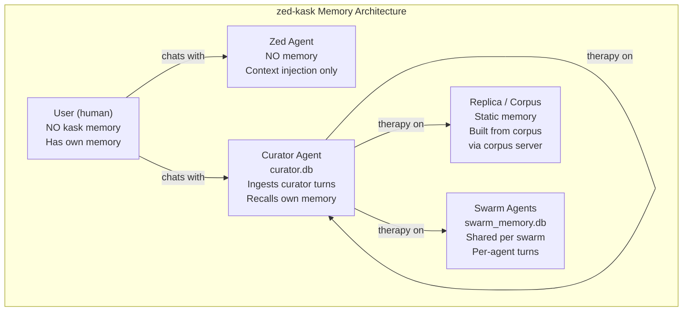
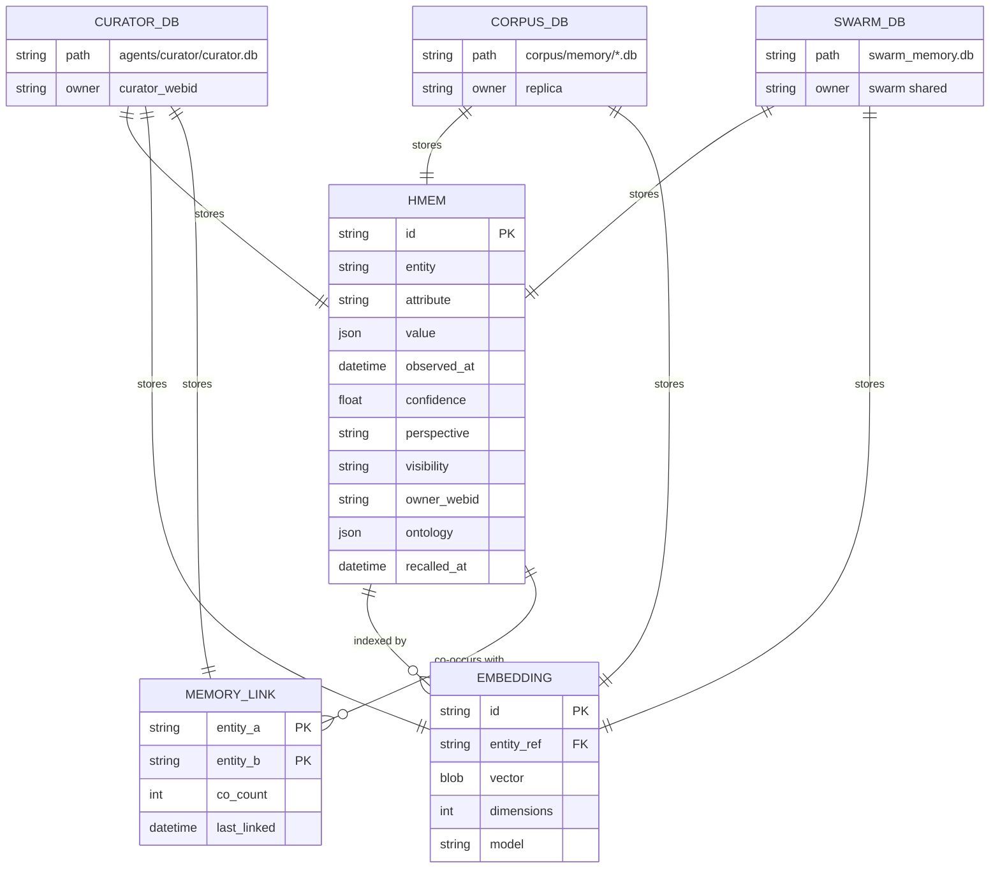
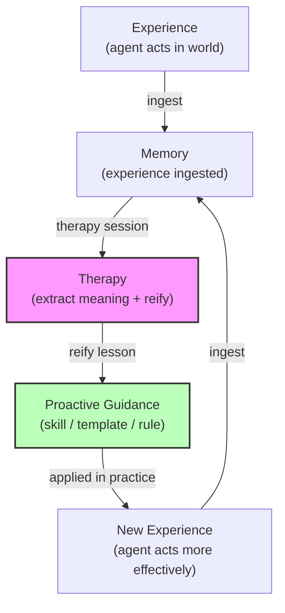
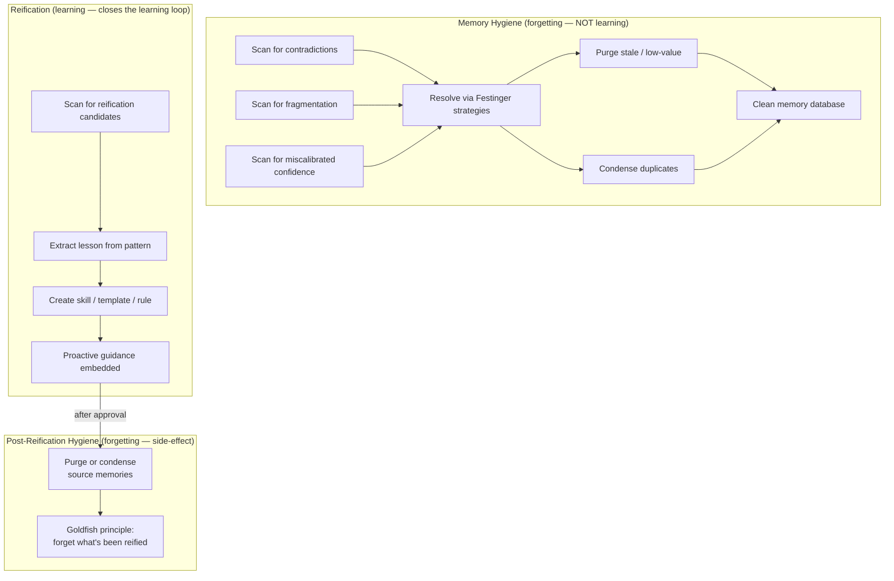
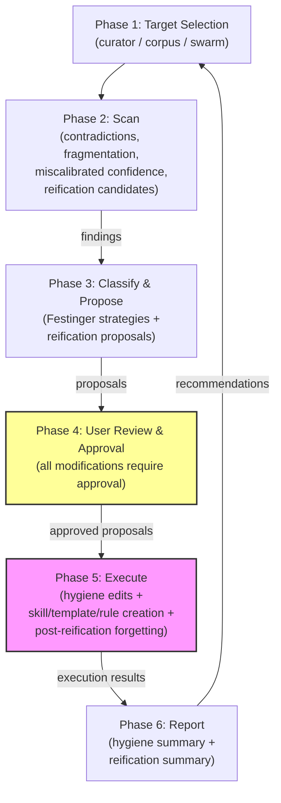
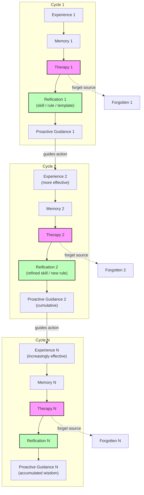
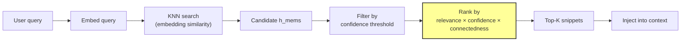
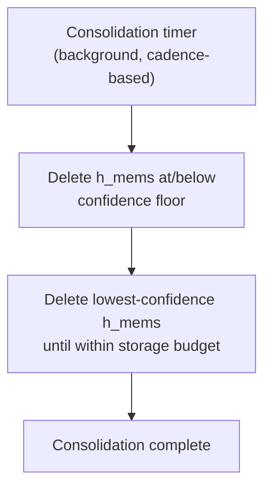
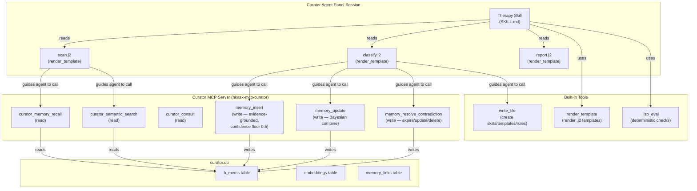

# Memory System Architecture & Recursive Self-Improvement Framework

**Status**: Reference document for the zed-kask memory system, therapy skill, and the recursive self-improvement framework. Updated 2026-08-25.

## Academic Grounding

### Computational models of memory

- **Cox & Shiffrin (2026)**, "Computational Models of Memory," *Open Encyclopedia of Cognitive Science* (OECS), MIT Press, DOI: 10.1162/oecs_8c02n2f1. Memory traces can be altered once retrieved; distorted traces produce retrieval noise; traces coevolve across events (Nelson & Shiffrin, 2013). The REM model (Shiffrin & Steyvers, 1997) parameters: `u` (transfer probability), `c` (correct storage probability), `g` (distinctiveness). Low `c` produces error-prone traces — therapy identifies and corrects these.

- **Atkinson & Shiffrin (1968)**, "Human memory: A proposed system and its control processes," *Psychology of Learning and Motivation*. The multi-store model: short-term (active, limited capacity) → long-term (permanent storehouse). Retrieval is a probe-activation process: traces activate in proportion to similarity to the probe.

- **Tulving (1972)**, "Episodic and semantic memory," *Organization of Memory*. The original episodic/semantic distinction — now removed from zed-kask's architecture. All h_mems are unified; the ontology blob carries dual-axis anchoring (PKO process + DC state) but there is no type distinction.

### Cognitive dissonance and resolution

- **Festinger (1957)**, *A Theory of Cognitive Dissonance*. Three resolution strategies: reduce importance (lower confidence), add consonant (insert reconciling memory), remove dissonant (expire/delete). Therapy classifies contradictions by strategy.

- **Lidwell, W., Holden, K., & Butler, J. (2010)**, *Universal Principles of Design*. "People alleviate cognitive dissonance in one of three ways: by reducing the importance of dissonant cognitions, adding consonant cognitions, or removing or changing dissonant cognitions" (p. 39).

### Self-knowledge and calibration

- **Kruger, J. & Dunning, D. (1999)**, "Unskilled and Unaware of It," *Journal of Personality and Social Psychology* 77(6), 1121–1134. The double curse: the same skills needed to produce correct answers are needed to evaluate whether answers are correct. Implication: a model that writes its own confidence scores will miscalibrate.

- **Dunning, D. (2011)**, "The Dunning-Kruger Effect: On Being Ignorant of One's Own Ignorance," *Advances in Experimental Social Psychology* 44, 247–296. The feedback gap: without feedback, incorrect self-assessments persist. The Cassandra quandary: poor performers can't evaluate the expertise of others.

- **Ehrlinger, J. & Dunning, D. (2003)**, "How chronic self-views influence estimates of performance," *JPSP* 84(1), 5–17. Naive realism: people treat their own model as ground truth.

- **Dunning, D. (2018)**, "The Trouble of Not Knowing What You Do Not Know," *Reason, Bias, and Inquiry*, Oxford University Press. Hypocognition: lacking a cognitive representation for something. Overclaiming: claiming knowledge of nonexistent concepts.

- **Jansen, R. A., Rafferty, A. N. & Griffiths, T. L. (2021)**, "A rational model of the Dunning-Kruger effect," *Nature Human Behaviour* 5(6), 756–757. Insensitivity to evidence in low performers.

- **Dunning, D. & Helzer, E. G. (2014)**, "Beyond the Correlation Coefficient," *Perspectives on Psychological Science* 9(2), 126–130. "Make everybody better performers" — fix the underlying capability, not the metacognition.

### Forecasting and calibration

- **Brier, G. W. (1950)**, "Verification of forecasts expressed in terms of probability," *Monthly Weather Review*. The proper scoring rule for probabilistic forecasts.

- **Tetlock, P. & Gardner, D. (2015)**, *Superforecasting: The Art and Science of Prediction*. Brier scoring as the calibration mechanism. "Fuzzy thinking can never be proven wrong" (p. 274). "Not all practice improves skill. It needs to be informed practice" (p. 195). The dilution effect: irrelevant information weakens judgment (p. 178).

### AI memory systems

- **Park, J. S. et al. (2023)**, "Generative Agents: Interactive Simulacra of Human Behavior," arXiv:2304.03442. Observation → reflection → retrieval pipeline. Reflections are higher-level abstractions generated periodically.

- **Packer, C. et al. (2023)**, "MemGPT: Towards LLMs as Operating Systems," arXiv:2310.08560. OS-style hierarchical memory with permission boundaries.

- **Gallego, M. (2026)**, "Distilling Feedback into Memory-as-a-Tool," arXiv:2601.05960. Feedback distilled through a structured process; model proposes, rubric filters.

### The goldfish principle

- **Vardy, M. (2020)**, "Be a Goldfish," *Medium*. "Be a goldfish. Got a 10 second memory." The principle: don't let the past own the present. Applied to memory therapy: forgetting is a feature, not a bug. Once a lesson is reified into proactive guidance, the episodic memory can be forgotten.

---

## Architecture: Who Has Memory



**Key principle**: The user is human and has their own memory. The zed agent has NO kask memory — no ingestion, no recall. Only the curator, replicas, and swarm agents have kask memory. Context injection (system prompt, project rules) continues for the zed agent, but no memory is generated or recalled.

### User sovereignty and transparency

The memory system is transparent to the user and respects user sovereignty:

- **The user can see what's in memory.** The curator MCP server's `curator_memory_recall` and `curator_semantic_search` tools are read-only and available to all threads — the user can query the curator's memory at any time to see what's stored.

- **The user approves all memory modifications.** Therapy requires user approval for every modification — no autonomous memory editing. The curator proposes; the user approves.

- **The user can run without memory loops.** The zed agent (the default coding agent) has no memory — no ingestion, no recall, no consolidation timer, no therapy. The user can work in the zed agent with zero memory system activity. Memory only activates when the user explicitly switches to the Curator agent. This is a usage mode that avoids the memory loops entirely — the user is never forced into the cybernetic system.

- **The user controls what the curator remembers.** Only curator turns (when the user is in a curator panel session) are ingested. The user's zed agent conversations are NOT ingested. The user decides what enters the curator's memory by choosing to work in the curator panel.

- **The user can purge memory.** The `memory_resolve_contradiction` tool (curator-only) allows the user to expire or delete any h_mem. The `corpus_purge` tool allows bulk deletion of corpus memory by prefix. The user is never trapped by accumulated memory.

- **Forgetting is deliberate, not automatic.** Consolidation (automatic) only deletes low-confidence h_mems and prunes to budget — it never deletes memories the user might want. Therapy (user-initiated) is the deliberate forgetting process — the user chooses what to forget and why. The goldfish principle applies: forgetting is a feature, but only when done with awareness and purpose.

This design respects the principle that the system serves the user, not the other way around. Memory is a tool the user can use, inspect, modify, or disable — not a surveillance system that records the user without their knowledge or consent.

---

## Entity Relationships: Memory Storage



**Key**: All h_mems are unified — no episodic/semantic distinction. The `ontology` blob carries dual-axis anchoring (PKO process + DC state) but there is no type distinction. `MEMORY_LINK` tracks co-occurrence connectedness (Priority 3 — co-occurrence links recorded during recall).

---

## The Learning Loop

The goal isn't for memory to accrete. The goal is for experiences to be saved in memory and then reified into skills, rules, or templates for **prospective, prescriptive, or expectational** practices and intelligence — rather than descriptive, retrospective, or reflective intelligence which memory is a part of.



**Therapy is the step that closes the learning loop.** Without therapy, memory accumulates but never becomes learning — the past is stored but not applied. Therapy extracts meaning from accumulated experience and reifies it into proactive guidance that shapes future action.

**Memory is retrospective/descriptive/reflective.** Skills, rules, and templates are prospective/prescriptive/expectational. Therapy is the bridge between the two.

---

## Memory Hygiene vs. Reification

Therapy runs two distinct processes. Do not conflate them.



**Forgetting is NOT learning.** Purging and condensing source memories after reification is a hygiene side-effect — shedding low-value information so it doesn't obstruct future learning. The goldfish principle: once a lesson is reified into proactive guidance, the episodic memory that produced the lesson can be forgotten.

---

## Therapy Process Flow



**Therapy must run from a Curator agent panel session** (for curator memory). The curator must remember the act of therapy — the forgetting, the reification, the lessons learned — so the cybernetic loop closes. Therapy run from the zed agent would modify curator memory without the curator's awareness, defeating the cybernetic design.

---

## Recursive Self-Improvement Framework



**The framework is recursive**: each cycle produces proactive guidance that makes the next experience more effective. The next experience generates new memory, which therapy processes into refined guidance. The source memories are forgotten (goldfish principle) — what persists is the reified guidance, not the episodic detail.

**Memory does not accrete — it converts.** Experiences are saved in memory, then reified into skills/rules/templates for prospective intelligence. The episodic detail is shed; the proactive guidance accumulates. This is the difference between a system that remembers the past (descriptive/retrospective) and a system that learns from the past (prospective/prescriptive/expectational).

### User sovereignty in the recursive framework

The recursive self-improvement framework is opt-in, not automatic:

- **The user triggers therapy.** Therapy does not run automatically — the user initiates it from a curator panel session. The user decides when to extract lessons and reify them.
- **The user approves each reification.** The user reviews the proposed skill/template/rule content before it is created. The user can modify, reject, or defer.
- **The user approves each forgetting.** The user approves purging or condensing source memories as a separate decision from reification. The user can reify a lesson but keep the source memories.
- **The user can exit the loop.** The zed agent (default mode) has no memory — the user can work without any memory system activity. The recursive framework only runs when the user explicitly chooses to work in the curator panel and invoke therapy.

The framework respects user sovereignty: the system learns only when the user chooses to teach it, forgets only what the user chooses to forget, and applies guidance only through skills/rules/templates the user has approved.

---

## Memory Recall Ranking



**Recall ranking function** (Priority 1 — done):
```
recall_score = relevance_score × decayed_confidence × connectedness
```

- **Relevance**: embedding cosine similarity (existing)
- **Confidence**: outcome-calibrated, decayed by Wozniak-Gorzelanczyk forgetting curve (existing, now used as ranking signal, not just threshold)
- **Connectedness**: graph co-occurrence link density (Priority 3 — schema added, wiring pending)

**Absence signaling** (Priority 2 — done): when recall returns zero results, the context injector returns a system message: "No relevant memory found for this query. This may indicate a knowledge gap." This is the hypocognition guard (Dunning, 2018).

---

## Consolidation



**Consolidation is confidence-based cleanup only.** No episodic→semantic promotion, no re-tagging, no reflection. The promotion pipeline was removed when the episodic/semantic distinction was eliminated. Consolidation deletes low-confidence h_mems and prunes to the storage budget — that's it.

Reflection (generating new abstractions from accumulated memory) is handled by the therapy skill, not by the consolidation timer. This separates the automatic hygiene process (consolidation) from the deliberate learning process (therapy).

---

## Tool Wiring



**Templates do NOT make tool calls.** They are prompt structures rendered by `render_template` that guide the agent on what to call and how to structure output. The agent reads the rendered template and makes the actual MCP tool calls.

**The curator remembers the therapy session** because curator turns are ingested to `curator.db` (agent_id == CURATOR_AGENT_ID). This closes the cybernetic loop: the curator learns from the act of therapy.

---

## Implementation Status

| Priority | Change | Status |
|---|---|---|
| Episodic/semantic removal | Complete elimination of the distinction | ✅ Done |
| User memory store removal | RealMemoryPort no longer holds user store | ✅ Done |
| 1 | Confidence in recall ranking | ✅ Done |
| 2 | Absence signaling (hypocognition guard) | ✅ Done |
| 3 | Connectedness tracking (co-occurrence links) | Schema added, wiring pending |
| 4 | Brier loop → memory confidence | Not started |
| 5 | Curator memory edit tools | ✅ Done |
| 6 | Therapy process (skill) | ✅ Done |
| 7 | Q3 reflection pass | Not started |

## Related Documents

- [Memory System Improvements](memory-system-improvements.md) — implementation plan with priorities
- [Q3 + Q5 Design Analysis](q3-q5-reflection-writable-memory.md) — reflection and writable memory design
- [RAG Synthesis: Dunning & Memory Design](rag-synthesis-dunning-memory-design.md) — corpus-grounded evidence
- [Therapy Skill](../../.agents/skills/therapy/SKILL.md) — the therapy skill process document
