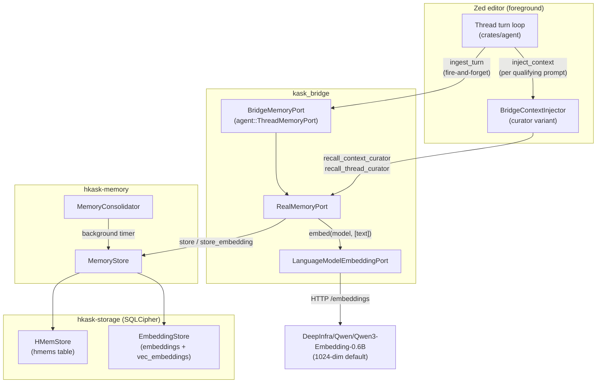

# Memory System Specification

> **Scope:** `kask/crates/hkask-memory/` (unified store + consolidation),
> `kask/crates/hkask-storage/` (`hmem.rs`, schema), and
> `kask/crates/kask_bridge/src/memory.rs` + `src/memory/` (the
> `RealMemoryPort` bridge that wires thread turns into memory). This is the
> D6 seam. Swarm-side memory (`hkask-mcp-swarm` `local_knowledge`) is
> referenced but specified in its own server.

## 1. Overview

The memory system is a **vector embedding + relational lookup** store. One
`entity_ref` string links each embedding vector to its relational row, so
KNN search results can be joined back to the full text. There is exactly one
store type: every h_mem — chat turn, curator fact, swarm delegation — flows
through the same `MemoryStore` (`kask/crates/hkask-memory/src/memory_store.rs:128`).
The ontology blob on each h_mem carries dual-axis anchoring (PKO process
axis + Dublin Core state axis, `kask/crates/hkask-storage/src/hmem.rs:53-58`);
it is a discriminator for recall queries, not a type system. There are no
separate episodic/semantic store structs, no consent manager, and no
narrative generation loop.

### What it does

1. **Ingests** every completed thread turn (curator and zed-agent turns
   alike) into the curator's sovereign `curator.db`
   (`kask/crates/kask_bridge/src/memory/ingest.rs:39-57`):
   - Curator turns: a curator-perspective h_mem (Private) at entity
     `chat:thread:{thread_id}` (`ingest.rs:100-130`)
   - Every turn: a shared copy (Shared) at entity
     `curator:thread:{thread_id}` (`ingest.rs:132-154`)
   - Every turn: an embedding of the user prompt stored under the shared
     copy's entity (`ingest.rs:156-225`)
2. **Recalls** relevant memories on every qualifying prompt by:
   - Embedding the query and searching stored embeddings (KNN)
   - Loading `chat:thread:*` h_mems by prefix and filtering by keyword overlap
   - Merging, ranking by relevance × confidence × connectedness, and
     injecting the top results into the model's context
   (`kask/crates/kask_bridge/src/memory.rs:655-882`)
3. **Consolidates** on a background timer — confidence-floor cleanup plus
   budget pruning only (`kask/crates/hkask-memory/src/consolidation_service.rs:29-33`).

### What it does NOT do

- No promotion, re-tagging, or reflection in consolidation — the
  episodic→semantic promotion pipeline does not exist
  (`consolidation_service.rs:1-8`; enforced by the absence of any such phase
  in `consolidate`, `consolidation_service.rs:34-162`)
- No query-embedding cache — every recall embeds the query fresh
  (`memory.rs:673-691`)
- No zed-agent recall — the `MemoryPort` trait impls `recall_context` /
  `recall_thread` are no-ops returning empty vecs; recall is curator-only
  via the inherent `recall_context_curator` / `recall_thread_curator`
  methods (`memory.rs:499-519`, `memory.rs:568-614`)

## 2. Architecture



<!-- DIAGRAM_ALIGNMENT
id: DIAG-MEM-ARCH
verified_date: 2026-08-28
verified_against: kask/crates/kask_bridge/src/memory.rs:454-520 (BridgeMemoryPort→RealMemoryPort ingest, no-op trait recall), kask/crates/kask_bridge/src/memory.rs:568-614 (recall_context_curator), kask/crates/kask_bridge/src/memory/ingest.rs:58-235 (write path), kask/crates/hkask-memory/src/memory_store.rs:128-184 (MemoryStore), kask/crates/hkask-inference/src/model_constants.rs:35 (DEFAULT_EMBEDDING_MODEL), kask/crates/hkask-storage/src/core/sql/schema.sql:1-6
status: VERIFIED
-->

### Components

| Component                    | Crate           | Role                                                                                      |
| ---------------------------- | --------------- | ----------------------------------------------------------------------------------------- |
| `Thread` turn loop           | `agent`         | Calls `ingest_turn` on turn completion; calls `inject_context` per prompt                   |
| `BridgeMemoryPort`           | `kask_bridge`   | Adapts `agent::ThreadMemoryPort` (`crates/agent/src/agent.rs:2924`) → `RealMemoryPort`     |
| `RealMemoryPort`             | `kask_bridge`   | The real implementation: ingestion, curator recall, consolidation timer (`memory.rs:74`)   |
| `BridgeContextInjector`      | `kask_bridge`   | Implements `agent::ContextInjector`; curator variant calls `recall_*_curator` (`context_injector.rs:164`) |
| `CuratorStore`               | `kask_bridge`   | Self-healing handle over the curator's `MemoryStore` (`memory/curator_stores.rs:52`)       |
| `MemoryStore`                | `hkask-memory`  | Wraps `HMemStore` + `EmbeddingStore`; `store`, `query_deduped`, `search_similar` (`memory_store.rs:128`) |
| `MemoryConsolidator`         | `hkask-memory`  | Confidence cleanup + budget pruning (`consolidation_service.rs:20`)                        |
| `HMemStore`                  | `hkask-storage` | Relational EAV table (`hmems`, `hmem.rs:135`)                                              |
| `EmbeddingStore`             | `hkask-storage` | Vector table (`embeddings` + `vec_embeddings` via sqlite-vec)                              |
| `LanguageModelEmbeddingPort` | `kask_bridge`   | OpenAI-compatible `/embeddings` HTTP client over zed's credentials                         |

## 3. Storage schema

Tables live in a single SQLCipher DB per store owner. The curator's DB is
`agents/curator/curator.db` under the hKask data dir
(`kask/crates/kask_bridge/src/memory/curator_stores.rs:20-29`, override
`HKASK_CURATOR_DB`). The schema is owned by
`kask/crates/hkask-storage/src/core/sql/schema.sql` and applied on every pool
creation (`hmem.rs:141-149`).

### `hmems` (relational EAV — `schema.sql:1`)

| Column        | Type    | Description                                    |
| ------------- | ------- | ---------------------------------------------- |
| `id`          | TEXT PK | UUID                                           |
| `entity`      | TEXT    | The entity (e.g., `curator:thread:{thread_id}`)|
| `attribute`   | TEXT    | The attribute (e.g., `turn`)                   |
| `value`       | TEXT    | JSON string of the turn content               |
| `valid_from`  | TEXT    | Creation timestamp (`observed_at`)            |
| `valid_to`    | TEXT    | Soft-delete timestamp (set by dedup/resolve)   |
| `recalled_at` | TEXT    | Last recall time (decay clock, `NOT NULL DEFAULT datetime('now')`) |
| `confidence`  | REAL    | Confidence score (0.0–1.0, default 1.0)        |
| `perspective` | TEXT    | The WebID of the agent who wrote this          |
| `visibility`  | TEXT    | `private` / `shared` / `public` (default `private`) |
| `owner_webid` | TEXT    | The owning WebID                               |
| `ontology`    | TEXT    | JSON blob: dual-axis anchoring (PKO process + DC state) |

### `embeddings` (vector metadata — `schema.sql:5`)

| Column        | Type    | Description                                        |
| ------------- | ------- | -------------------------------------------------- |
| `id`          | TEXT PK | UUID                                               |
| `entity_ref`  | TEXT    | **MUST equal the h_mem's `entity`** — the join key |
| `vector`      | BLOB    | Encoded float vector                               |
| `dimensions`  | INTEGER | Vector dimension (default 1024)                   |
| `model`       | TEXT    | Embedding model name                               |
| `passage_text`| TEXT    | Chunk text stored alongside the vector (corpus writes; memory writes pass `None`) |
| `created_at`  | TEXT    | Creation timestamp                                 |

### `vec_embeddings` (virtual, sqlite-vec — `schema.sql:6`)

```sql
CREATE VIRTUAL TABLE IF NOT EXISTS vec_embeddings USING vec0(embedding float[$DIM] distance_metric=cosine);
```

Keyed on `rowid` (mirrors `embeddings.rowid`). KNN search via the `MATCH`
operator returns nearest neighbors ordered by cosine distance.

### `memory_links` (co-occurrence — `schema.sql:23-29`)

`entity_a`, `entity_b`, `co_count`, `last_linked`, `PRIMARY KEY (entity_a,
entity_b) WITHOUT ROWID`. Populated by `record_co_occurrence`
(`memory_store.rs:924-951`), called from the context injector after every
non-empty recall (`context_injector.rs:324-335`). Read by `connectedness`
(`memory_store.rs:957-969`) as the recall-ranking salience signal.

### The entity_ref invariant

The embedding's `entity_ref` and the h_mem's `entity` are plain `TEXT`
columns with no foreign key. The invariant (`entity_ref == entity`) is
enforced by:

1. The ingestion call site: `let embedding_entity = curator_entity.clone()`
   (`kask/crates/kask_bridge/src/memory/ingest.rs:168`) — the embedding is
   stored under the **shared copy** entity `curator:thread:{id}`, which is
   written for every turn; the `chat:thread:` h_mem only exists for curator
   turns, so an embedding under it would join to nothing for zed-agent turns
   (`ingest.rs:160-167`).
2. The regression test `recall_context_finds_turn_by_embedding_only`
   (`kask/crates/kask_bridge/src/memory.rs:1681`).

See [Memory Store ERD](../diagrams/erd-memory-store.md).

## 4. Ingestion

**Source:** `kask/crates/kask_bridge/src/memory.rs:454-497` (trait impl,
semaphore) and `kask/crates/kask_bridge/src/memory/ingest.rs:58-235`
(`write_turn`).

When a thread turn completes, the turn loop calls
`BridgeMemoryPort::ingest_turn(TurnRecord)` fire-and-forget. The
`TurnRecord` carries `thread_id`, `user_input`, `agent_response`, `model`,
`thread_title`, and `agent_id`
(`kask/crates/hkask-types/src/ports/memory_port.rs:27-50`).

### What gets stored (per turn, all in `curator.db`)

| Store                        | Entity                | Attribute | Visibility | Perspective     | Content                     |
| ---------------------------- | --------------------- | --------- | ---------- | --------------- | --------------------------- |
| Curator store (curator turns only) | `chat:thread:{id}` | `chatted` | Private | `curator_webid` | Turn JSON, PKO process ontology |
| Curator store (every turn)   | `curator:thread:{id}` | `turn`    | Shared     | `curator_webid` | Turn JSON, DC state ontology |
| Curator store (embedding, every turn) | `curator:thread:{id}` | —  | —          | —               | Vector of `user_input`      |

Curator-turn detection is `agent_id.as_deref() == Some("Curator")`
(`ingest.rs:68`). The curator store is behind the self-healing
`CuratorStore` handle — a failed initial open leaves the store `None`, and
every `get()` re-attempts the open (`curator_stores.rs:104-160`); a
successful re-open also rebuilds the consolidation service
(`ingest.rs:80-95`).

### Ingestion semaphore

A `tokio::sync::Semaphore` (default 1 permit, configurable via
`HKASK_MEMORY_INGEST_CONCURRENCY`, malformed values warn and fall back —
`memory.rs:290-331`) serializes concurrent ingestions so they don't contend
with the recall path for the SQLite pool. Pinned by
`ingestion_semaphore_serializes_concurrent_ingestions` (`memory.rs:1927`).

See [Memory Ingest Sequence](../diagrams/sequence-memory-ingest.md).

## 5. Recall

**Source:** `kask/crates/kask_bridge/src/memory.rs:655-882` (`recall_from`),
`memory.rs:884-991` (`recall_thread_from`), and
`kask/crates/kask_bridge/src/context_injector.rs:185-345`
(`inject_context`).

### When recall fires

- `kask.memory.auto_inject` is true (`context_injector.rs:215`)
- The prompt is ≥ 20 chars AND ≥ 3 words (`should_recall`,
  `context_injector.rs:38-42`, `:85-90`)
- The `ContextInjector` hook is wired (deferred startup task)

### The two legs

1. **Semantic (embedding KNN):** Embed the query → `search_similar` → for
   each neighbor, `query_deduped_untouched(entity_ref)` → h_mem text.
   Relevance = `1.0 - cosine_distance` (`memory.rs:673-752`).

2. **Keyword (prefix + word overlap):** Load `chat:thread:*` h_mems for the
   curator's perspective in a single prefix query (capped at
   `limit × 10`, minimum 50) → filter by query-word substring overlap
   (words > 3 chars, first 5 words) → relevance = `0.5` constant
   (`memory.rs:754-819`).

### Merge, rank, inject

Candidates from both legs are merged (the keyword leg skips texts already
present, so the semantic candidate wins on collision — `memory.rs:804-807`),
sorted by `relevance × confidence × (1 + min(connectedness × 0.1, 0.5))`
(`memory.rs:821-850`), truncated to `recall_limit`, and only the survivors
are `touch_recall`-ed (resetting their decay clocks — `memory.rs:852-867`).
The injector then filters by `recall_min_confidence` (prompt snippets) and
`recall_min_confidence + 0.1` (thread snippets), wraps each snippet in
data-boundary markers with the closing marker neutralized against injection
(`context_injector.rs:56-77`, `:240-243`, `:266-269`), and injects the
result as a `Role::System` message. Zero-result recalls return an explicit
absence message (the hypocognition guard, `context_injector.rs:285-311`).

### Thread-scoped recall (per turn)

`inject_context` also calls `recall_thread_curator(thread_id)` on every
turn (fresh, not session-cached), which recalls by exact entity match —
`chat:thread:{id}` perspective-scoped plus `curator:thread:{id}` — not
embedding KNN (`memory.rs:884-991`).

See [Memory Recall Flow](../diagrams/flowchart-memory-recall.md).

## 6. Consolidation

**Source:** `kask/crates/hkask-memory/src/consolidation_service.rs:34-162`

A background timer (cadence from `kask.memory.consolidation_cadence_secs`,
default 300s, 0 = disabled — `memory.rs:236-287`) runs
`MemoryConsolidator::consolidate`, which does exactly two things:

1. Delete h_mems at or below the confidence floor (if specified)
   (`consolidation_service.rs:82-109`)
2. Delete lowest-confidence h_mems until within the storage budget
   (default 10_000, `memory_store.rs:112`; the curator store uses the
   default with no override — `curator_stores.rs:225-233`)
   (`consolidation_service.rs:111-149`)

There is no promotion, no re-tagging, no Bayesian combination in the
consolidation path. `combine_confidences` (log-odds pooling,
`kask/crates/hkask-memory/src/bayesian.rs:86-101`) is used by the curator
MCP server's `memory_update` tool, not by consolidation. Consolidation is
decoupled from ingestion — it runs on the timer, never in the
`ingest_turn` path.

## 7. Decay

**Source:** `kask/crates/hkask-memory/src/bayesian.rs:1-47`,
`memory_store.rs:121-123`, `:458-467`

Confidence decays by the Wozniak-Gorzelanczyk forgetting curve[^wg95]:
`R(t) = exp(-t / S)` where `S` is `memory_life_days` (default 180) and `t`
is days since `recalled_at`. Decay is applied at recall time (`decayed`,
`memory_store.rs:458-467`), not at write time. At recall, `touch_recall`
resets the decay clock (`hmem.rs:501-507`). Only h_mems that survive the
`recall_limit` truncation are touched — this prevents a write storm under
concurrent recall (`memory.rs:852-867`).

## 8. Passphrases and provisioning

All SQLCipher DBs (curator, corpus, swarm memory, kata-kanban, training)
share one passphrase architecture:

- **Default:** `"allostery"` on first run
  (`kask/crates/hkask-keystore/src/passphrase.rs:17`) — fixed by design so
  first-run provisioning always produces a DB the user can open; the
  keychain is the security boundary, not the default.
- **Provisioning:** `provision_agent` resolves env override → existing
  keychain entry → default-and-store
  (`kask/crates/kask_bridge/src/identity.rs:92-132`, `:157-182`). The
  username-independent half (`provision_db_passphrase`, `identity.rs:145`)
  is called by `build_mcp_server_env` at MCP launch time so servers get a
  passphrase even before login (`kask/crates/kask_bridge/src/mcp_servers.rs:684-688`).
  The swarm memory passphrase is provisioned by
  `provision_swarm_memory_passphrase` (`identity.rs:208-242`), spawned as a
  background task in `crates/zed/src/main.rs:1475-1477`.
- **Keychain namespace:** unified `kask://credentials/<key>` with label
  `zed-github-account` — the same schema zed's `CredentialsProvider` uses.
  The legacy `service=hkask` namespace is dead surface, purged at startup
  (`kask/crates/hkask-keystore/src/keychain.rs:1-12`). Keys:
  `hkask_db_passphrase`, `hkask_swarm_memory_passphrase`
  (`kask/crates/hkask-keystore/src/keychain_keys.rs:14`, `:24`).
- **MCP-server resolution:** the canonical helper is
  `hkask_mcp_server::server::resolve_db_passphrase(&credentials)` — a
  2-tier chain (credentials map → `resolve_credential`, which for
  `HKASK_DB_PASSPHRASE` delegates to the keystore's env → keychain chain)
  (`kask/crates/hkask-mcp-server/src/server/credentials.rs:80-90`,
  `:27-30`; keystore chain `keychain.rs:318-321`).
- **Rotation ordering invariant:** `rotate_curator_db_passphrase` /
  `rotate_swarm_memory_db_passphrase` must complete before the new
  passphrase is written to the keychain; on failure the old DB is untouched
  and the caller must NOT save (`identity.rs:316-344`, `:362-389`).

## 9. Configuration

### Settings (`kask.memory` section in settings.json)

Defined in `kask/crates/kask_bridge/src/settings.rs:211-234`; defaults at
`:237-244`:

| Setting                      | Default | Description                                           |
| ---------------------------- | ------- | ----------------------------------------------------- |
| `consolidation_cadence_secs` | 300     | Consolidation timer cadence (0 = disabled)            |
| `confidence_floor`           | 0.3     | Confidence floor for consolidation pruning            |
| `recall_limit`               | 5       | Max snippets to retrieve per recall                   |
| `recall_min_confidence`      | 0.3     | Min confidence for a snippet to be injected           |
| `auto_inject`                | true    | Whether to auto-inject recalled memories into prompts |
| `memory_life_days`           | 180     | Decay constant S — **not yet wired to the curator store** (see below) |

**Advertised-but-unwired:** `memory_life_days` exists in settings and the
UI, but no production caller invokes `MemoryStore::with_memory_life_days`
(only `memory_store.rs:208-212` defines it; zero call sites) — the curator
store always uses the 180-day default. Likewise
`HKASK_MEMORY_STORAGE_BUDGET` and `HKASK_MEMORY_LIFE_DAYS` appear in doc
comments (`memory_store.rs:137-154`, `:215-219`) but no code reads them;
the curator store intentionally uses the default budget with no env
override (`curator_stores.rs:225-233`).

### Environment variables (live — read via `std::env::var`)

| Variable                          | Default                               | Description                            |
| --------------------------------- | ------------------------------------- | -------------------------------------- |
| `HKASK_MEMORY_INGEST_CONCURRENCY`  | 1                                     | Ingestion semaphore permits (`memory.rs:326-331`) |
| `HKASK_EMBEDDING_MODEL`            | `DeepInfra/Qwen/Qwen3-Embedding-0.6B` | Embedding model (`kask/crates/hkask-inference/src/model_constants.rs:35`, `:78-80`) |
| `HKASK_EMBEDDING_DIM`             | 1024                                  | Embedding vector dimension (`kask/crates/hkask-storage/src/core/connection.rs:25-35`) |
| `HKASK_CURATOR_DB`                | `agents/curator/curator.db` under data dir | Curator DB path override (`curator_stores.rs:20-29`) |
| `HKASK_DB_PASSPHRASE`             | keychain / `"allostery"`              | SQLCipher passphrase override (`identity.rs:115-123`) |
| `HKASK_SWARM_MEMORY_PASSPHRASE`   | keychain / `"allostery"`              | Swarm memory passphrase override (`identity.rs:210-214`) |

### Settings UI

`crates/settings_ui/src/pages/kask_page/memory.rs` — the Memory sub-page
exposes cadence, confidence floor, recall limit, recall min confidence,
memory life, and the auto-inject toggle.

## 10. Testing

### End-to-end semantic recall

`recall_context_finds_turn_by_embedding_only`
(`kask/crates/kask_bridge/src/memory.rs:1681`) — isolates the semantic leg
from the keyword leg by using a constant stub embedding (every text → same
vector, so KNN always matches) and a query with zero word overlap.

### Degradation and ranking

- `recall_degrades_to_keyword_leg_when_embedding_fails` (`memory.rs:1577`)
- `recall_context_ranks_by_confidence_weighted_relevance` (`memory.rs:1772`)
- `recall_context_touches_only_injected_h_mems` (`memory.rs:1855`)
- `curator_store_heals_after_outage` (`memory.rs:2233`)

### Test infrastructure

`in_memory_port_with_embed_fn` (`memory.rs:1172`) — constructs a
`RealMemoryPort` from in-memory stores plus a deterministic embed closure,
without a DB open, passphrase, or consolidation timer.

## 11. Related

- [Memory Ingest Sequence](../diagrams/sequence-memory-ingest.md)
- [Memory Recall Flow](../diagrams/flowchart-memory-recall.md)
- [Memory Store ERD](../diagrams/erd-memory-store.md)
- [Memory System — Why It Works This Way](../explanation/memory-system.md)
- [D6: Thread → memory](../../../DIVERGENCE.md) — the divergence seam
- [hkask-memory README](../../crates/hkask-memory/README.md) — crate-level docs

[^wg95]: Wozniak, P. A., & Gorzelanczyk, E. J. (1995). *Two components of
    long-term memory*. Acta Neurobiologiae Experimentalis. Equation (3):
    R(t) = exp(-t/S). The decay implementation cites this at
    `kask/crates/hkask-memory/src/bayesian.rs:3-7`.
