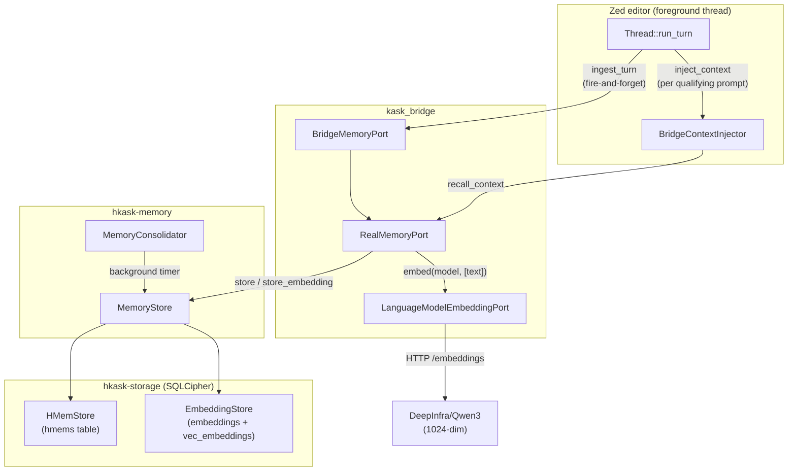

# Memory System Specification

> **Scope:** `kask/crates/hkask-memory/` (storage + consolidation) and
> `kask/crates/kask_bridge/src/memory.rs` (the `RealMemoryPort` bridge that
> wires thread turns into memory). This is the D6 seam.

## 1. Overview

The memory system is a **vector embedding + relational lookup** store. It
follows the ABW/OpenClaw model: one entity_ref string links each embedding
vector to its relational row, so KNN search results can be joined back to
the full text. The system is deliberately simple — no separate episodic/
semantic store structs, no consent manager, no narrative generation loop.
Those abstractions were removed when the standalone daemon was deleted.

### What it does

1. **Ingests** every completed thread turn as:
   - An episodic h_mem (relational EAV row) at entity `chat:thread:{thread_id}`
   - A prompt embedding (1024-dim vector) at the same entity_ref
   - A curator-accessible semantic copy in the curator's sovereign DB
2. **Recalls** relevant memories on every qualifying prompt by:
   - Embedding the query and searching for similar stored embeddings (KNN)
   - Loading episodic h_mems by prefix and filtering by keyword overlap
   - Merging, deduping, and injecting the top results into the model's context
3. **Consolidates** episodic → semantic h_mems on a background timer
   (Bayesian confidence combine, budget-gated pruning)

### What it does NOT do

- No real-time streaming output scanning (guard is post-hoc redaction)
- No token expiry or signature verification (tokens are in-process)
- No separate episodic/semantic store types (the `HMemOntology` blob on each
  h_mem carries the episodic/semantic distinction)
- No query-embedding cache (every recall embeds the query fresh)

## 2. Architecture



### Components

| Component                    | Crate           | Role                                                                                      |
| ---------------------------- | --------------- | ----------------------------------------------------------------------------------------- |
| `Thread`                     | `agent`         | Calls `ingest_turn` on turn completion; calls `inject_context` per prompt                 |
| `BridgeMemoryPort`           | `kask_bridge`   | Adapts `agent::ThreadMemoryPort` → `hkask_types::MemoryPort`                              |
| `RealMemoryPort`             | `kask_bridge`   | The real implementation: ingestion, recall, consolidation trigger                         |
| `BridgeContextInjector`      | `kask_bridge`   | Implements `agent::ContextInjector`; calls `recall_context` / `recall_thread`             |
| `MemoryStore`                | `hkask-memory`  | Wraps `HMemStore` + `EmbeddingStore`; provides `store`, `query_deduped`, `search_similar` |
| `MemoryConsolidator`         | `hkask-memory`  | Background episodic → semantic promotion + budget pruning                                 |
| `HMemStore`                  | `hkask-storage` | Relational EAV table (`hmems`)                                                            |
| `EmbeddingStore`             | `hkask-storage` | Vector table (`embeddings` + `vec_embeddings` via sqlite-vec)                             |
| `LanguageModelEmbeddingPort` | `kask_bridge`   | OpenAI-compatible `/embeddings` HTTP client over zed's credentials                        |

## 3. Storage schema

Three tables in a single SQLCipher DB (`memory.db` per user,
`agents/curator/pod.db` for the curator):

### `hmems` (relational EAV)

| Column        | Type    | Description                                    |
| ------------- | ------- | ---------------------------------------------- |
| `id`          | TEXT PK | UUID                                           |
| `entity`      | TEXT    | The entity (e.g., `chat:thread:{thread_id}`)   |
| `attribute`   | TEXT    | The attribute (e.g., `chatted`)                |
| `value`       | TEXT    | JSON string of the turn content                |
| `valid_from`  | TEXT    | Creation timestamp                             |
| `valid_to`    | TEXT    | Soft-delete timestamp (for consolidation)      |
| `recalled_at` | TEXT    | Last recall time (for decay)                   |
| `confidence`  | REAL    | Confidence score (0.0–1.0, decayed over time)  |
| `perspective` | TEXT    | The WebID of the agent who wrote this          |
| `visibility`  | TEXT    | `private` / `shared` / `public`                |
| `owner_webid` | TEXT    | The owning WebID                               |
| `ontology`    | TEXT    | JSON blob carrying episodic/semantic axis tags |

### `embeddings` (vector metadata)

| Column       | Type    | Description                                        |
| ------------ | ------- | -------------------------------------------------- |
| `id`         | TEXT PK | UUID                                               |
| `entity_ref` | TEXT    | **MUST equal the h_mem's `entity`** — the join key |
| `vector`     | BLOB    | Encoded float vector                               |
| `dimensions` | INTEGER | Vector dimension (default 1024)                    |
| `model`      | TEXT    | Embedding model name                               |
| `created_at` | TEXT    | Creation timestamp                                 |

### `vec_embeddings` (virtual, sqlite-vec)

```sql
CREATE VIRTUAL TABLE vec_embeddings USING vec0(embedding float[$DIM] distance_metric=cosine);
```

Keyed on `rowid` (mirrors `embeddings.rowid`). KNN search via the `MATCH`
operator returns nearest neighbors ordered by cosine distance.

### The entity_ref invariant

The embedding's `entity_ref` and the h_mem's `entity` are plain `TEXT`
columns with no foreign key. The invariant (`entity_ref == entity`) is
enforced by:

1. The ingestion call site: `let embedding_entity = entity.clone()`
2. The regression test: `recall_context_finds_turn_by_embedding_only`

See [Memory Store ERD](../diagrams/erd-memory-store.md).

## 4. Ingestion

**Source:** `kask_bridge/src/memory.rs:RealMemoryPort::ingest_turn`

When a thread turn completes, `Thread::run_turn` calls
`BridgeMemoryPort::ingest_turn(TurnRecord)` fire-and-forget via
`cx.background_spawn()`. The `TurnRecord` carries `thread_id`,
`user_input`, `agent_response`, `model`, `thread_title`, and `agent_id`.

### What gets stored (per turn)

| Store                        | Entity                | Attribute | Visibility | Perspective     | Content                          |
| ---------------------------- | --------------------- | --------- | ---------- | --------------- | -------------------------------- |
| User `memory.db`             | `chat:thread:{id}`    | `chatted` | Private    | `user_webid`    | Turn JSON                        |
| Curator `pod.db` (episodic)  | `chat:thread:{id}`    | `chatted` | Private    | `curator_webid` | Turn JSON                        |
| Curator `pod.db` (semantic)  | `curator:thread:{id}` | `turn`    | Shared     | `curator_webid` | Turn JSON                        |
| User `memory.db` (embedding) | `chat:thread:{id}`    | —         | —          | —               | 1024-dim vector of `user_input`  |
| Curator `pod.db` (embedding) | `chat:thread:{id}`    | —         | —          | —               | Same vector (curator turns only) |

### Ingestion semaphore

An `tokio::sync::Semaphore` (default 1 permit, configurable via
`HKASK_MEMORY_INGEST_CONCURRENCY`) serializes concurrent ingestions so they
don't contend with the recall path for the SQLite pool.

See [Memory Ingest Sequence](../diagrams/sequence-memory-ingest.md).

## 5. Recall

**Source:** `kask_bridge/src/memory.rs:RealMemoryPort::recall_from` and
`kask_bridge/src/context_injector.rs:BridgeContextInjector::inject_context`

### When recall fires

- `kask.memory.auto_inject` is true (settings)
- The prompt is ≥ 20 chars AND ≥ 3 words (`should_recall` gate)
- The `ContextInjector` hook is wired (deferred post-login task)

### The two legs

1. **Semantic (embedding KNN):** Embed the query → `search_similar` → for
   each neighbor, `query_deduped_untouched(entity_ref)` → h_mem text.
   Relevance = `1.0 - cosine_distance`.

2. **Keyword (episodic overlap):** Load `chat:thread:*` h_mems by prefix
   (capped at `limit × 10`) → filter by query-word substring overlap →
   relevance = `0.5`.

### Merge + inject

Candidates from both legs are merged, deduped by text (semantic wins on
collision), sorted by relevance descending, truncated to `recall_limit`,
filtered by `recall_min_confidence` (default 0.3), wrapped in data-boundary
markers, and injected as a `Role::System` message after the system prompt.

### Static context (once per session)

`inject_static_context` calls `recall_thread(thread_id)` once per session,
which recalls by exact entity match (not embedding KNN). This loads the
thread's prior turns into the system prompt.

See [Memory Recall Flow](../diagrams/flowchart-memory-recall.md).

## 6. Consolidation

**Source:** `hkask-memory/src/consolidation_service.rs:MemoryConsolidator`

A background timer (cadence from `kask.memory.consolidation_cadence_secs`,
default 300s, 0 = disabled) promotes episodic h_mems to semantic:

1. Select oldest, lowest-confidence episodic candidates
2. Re-tag ontology from episodic (PKO) to semantic (DC+BIBO)
3. Set visibility to Shared
4. Bayesian combine with existing semantic h_mems (log-odds pooling) or
   seed as new
5. Soft-delete the episodic source (`valid_to` set)
6. Prune by confidence floor and storage budget (default 10,000 h_mems)

Consolidation is decoupled from ingestion — it runs on the timer, not in
the `ingest_turn` path.

## 7. Decay

**Source:** `hkask-memory/src/bayesian.rs` (Wozniak-Gorzelanczyk 1995)

Confidence decays by the forgetting curve: `R(t) = exp(-t / S)` where `S`
is `memory_life_days` (default 180). At recall, `touch_recall` resets the
decay clock (`recalled_at` = now). Only h_mems that survive the
`recall_limit` truncation are touched — this prevents a write storm under
concurrent recall.

## 8. Configuration

### Settings (`kask.memory` section in settings.json)

| Setting                      | Default | Description                                           |
| ---------------------------- | ------- | ----------------------------------------------------- |
| `consolidation_cadence_secs` | 300     | Consolidation timer cadence (0 = disabled)            |
| `confidence_floor`           | 0.3     | Confidence floor for consolidation pruning            |
| `recall_limit`               | 5       | Max snippets to retrieve per recall                   |
| `recall_min_confidence`      | 0.3     | Min confidence for a snippet to be injected           |
| `auto_inject`                | true    | Whether to auto-inject recalled memories into prompts |

### Environment variables

| Variable                          | Default                               | Description                            |
| --------------------------------- | ------------------------------------- | -------------------------------------- |
| `HKASK_MEMORY_LIFE_DAYS`          | 180                                   | Memory life S in days (decay constant) |
| `HKASK_MEMORY_STORAGE_BUDGET`     | 10000                                 | Max h_mems before consolidation prunes |
| `HKASK_MEMORY_INGEST_CONCURRENCY` | 1                                     | Ingestion semaphore permits            |
| `HKASK_EMBEDDING_MODEL`           | `DeepInfra/Qwen/Qwen3-Embedding-0.6B` | Embedding model                        |
| `HKASK_EMBEDDING_DIM`             | 1024                                  | Embedding vector dimension             |

### Settings UI

`settings_ui/src/pages/kask_page/memory.rs` — the Memory sub-page exposes
cadence, confidence floor, recall limit, recall min confidence, and
auto-inject toggle.

## 9. Testing

### End-to-end semantic recall

`recall_context_finds_turn_by_embedding_only` (`kask_bridge/src/memory.rs`)
— isolates the semantic leg from the keyword leg by using a constant stub
embedding (every text → same vector, so KNN always matches) and a query
with zero word overlap. This test **fails on the old entity_ref bug** and
**passes after the fix**.

### Test infrastructure

`LanguageModelEmbeddingPort::for_tests_with_embed_fn` — a test constructor
that spawns a receiver task answering `embed` calls via a deterministic
closure. Without this, every test used `for_tests()` (a channel-closed
no-op stub) and the embedding path was silently skipped.

## 10. Related

- [Memory Ingest Sequence](../diagrams/sequence-memory-ingest.md)
- [Memory Recall Flow](../diagrams/flowchart-memory-recall.md)
- [Memory Store ERD](../diagrams/erd-memory-store.md)
- [D6: Thread → memory](../../DIVERGENCE.md) — the divergence seam
- [hkask-memory README](../crates/hkask-memory/README.md) — crate-level docs
- [hkask-storage Diataxis](../diataxis/hkask-storage/reference.md) — full schema
