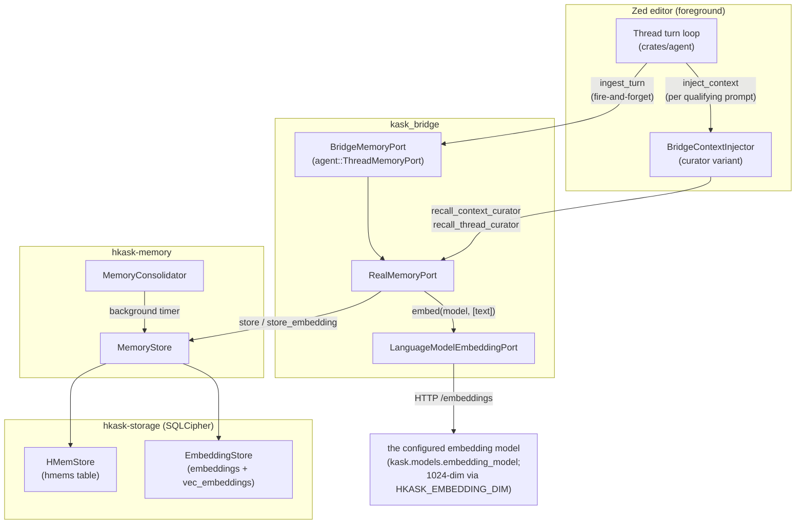
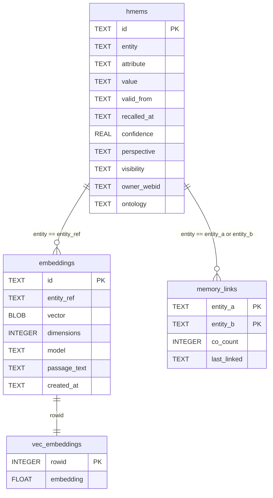
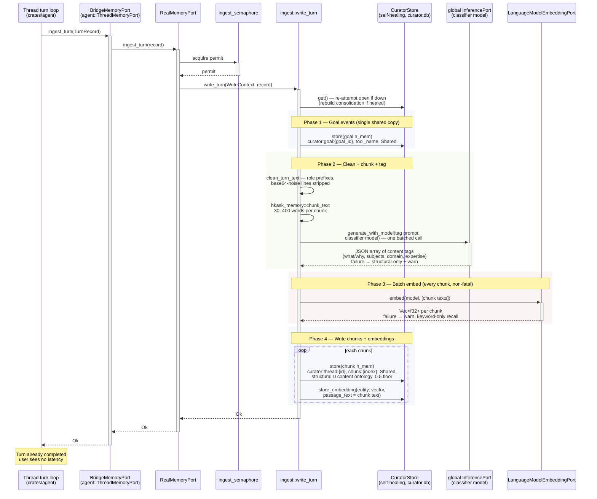
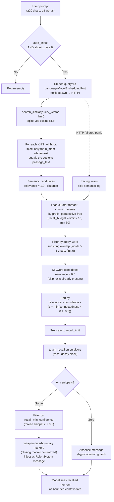
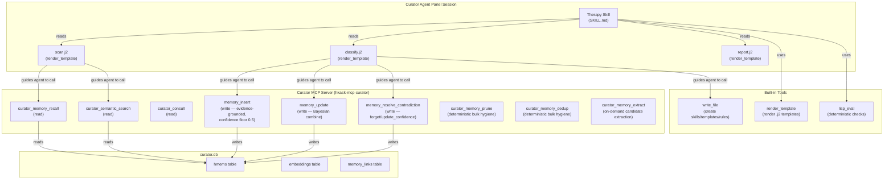
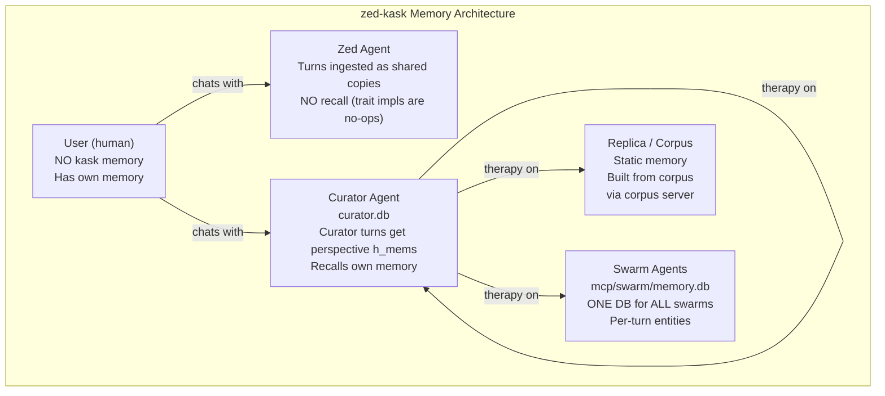

# Memory System Specification

> **Design decision 2026-09-04 (operator-ratified) — chunked content
> pipeline; supersedes the whole-turn dump design.** Threads are chunked
> and those chunks embedded and ontologically tagged along the way, in a
> process mirroring the corpus pipeline (chunk → embed → tag) with an
> added cleaning step at write time. One shared copy per turn — the
> curator-perspective duplicate (`chat:thread:`) and the goal perspective
> duplicate (`goal:{id}`) are retired, and with them every dual-write code
> path in this document's former §4. No backward compatibility requirement
> exists (operator ruling, restated 2026-09-04): legacy whole-turn rows and
> their envelope values are deleted by the therapy hygiene pass and the
> forgetting pass, not accommodated in code. Ratified package: inline LLM
> tagging via the classifier model / single copy under `curator:thread:` /
> rule-based clean / no migration of old rows.

> **Scope:** `kask/crates/hkask-memory/` (unified store + consolidation),
> `kask/crates/hkask-storage/` (`hmem.rs`, schema), and
> `kask/crates/kask_bridge/src/memory.rs` + `src/memory/` (the
> `RealMemoryPort` bridge that wires thread turns into memory). This is the
> D6 seam. Swarm-side memory (`hkask-mcp-swarm` `local_knowledge`) is
> referenced but specified in its own server.
>
> This is the canonical memory-family document. It folds in the former
> companion docs (architecture/therapy framework, design-rationale
> explanation, and the ERD / recall / ingest diagrams) — retired
> 2026-08-28; recoverable via `git log --diff-filter=D -- kask/docs/`.

## 1. Overview

The memory system is a **vector embedding + relational lookup** store. One
`entity_ref` string links each embedding vector to its relational row, so
KNN search results can be joined back to the full text. There is exactly one
store type: every h_mem — chat turn, curator fact, swarm delegation — flows
through the same `MemoryStore` (`kask/crates/hkask-memory/src/memory_store.rs:128`).
The ontology blob on each h_mem carries dual-axis anchoring (PKO process
axis + Dublin Core state axis, `kask/crates/hkask-storage/src/hmem.rs:53-58`);
it is a discriminator for recall queries, not a type system. There are no
separate episodic/semantic store structs, no consent manager, and no
narrative generation loop.

### What it does

1. **Ingests** every completed thread turn (curator and zed-agent turns
   alike) into the curator's sovereign `curator.db` as a chunked content
   pipeline (`kask/crates/kask_bridge/src/memory/ingest.rs`):
   - Clean: role-prefixed text (`user:` / `assistant:`), base64-noise
     lines stripped
   - Chunk: word-bounded passages (30–400 words) via
     `hkask_memory::chunk_text` — one h_mem per chunk under
     `curator:thread:{thread_id}`, attribute `chunk:{index}`
   - Tag: structural 5W1H dimensions (who/when/where/how) deterministically;
     content dimensions (what/why), subjects, domain concepts, and
     expertise via one batched classifier-model call per turn
   - Embed: every chunk in one batched call; each vector stored under the
     thread entity with its `passage_text`, so KNN pinpoints the matched
     chunk
   - Single copy per turn (2026-09-04 ruling): no perspective duplicate,
     no goal duplicate
2. **Recalls** relevant memories on every qualifying prompt by:
   - Embedding the query and searching stored embeddings (KNN), injecting
     only the chunk whose text the matched vector names
   - Loading `curator:thread:*` chunk h_mems by prefix and filtering by
     keyword overlap
   - Merging, ranking by relevance × confidence × connectedness, and
     injecting the top results into the model's context
   (`kask/crates/kask_bridge/src/memory.rs`)
3. **Consolidates** on a background timer — confidence-floor cleanup plus
   budget pruning only (`kask/crates/hkask-memory/src/consolidation_service.rs:29-33`).

### What it does NOT do

- No promotion, re-tagging, or reflection in consolidation — the
  episodic→semantic promotion pipeline does not exist
  (`consolidation_service.rs:1-8`; enforced by the absence of any such phase
  in `consolidate`, `consolidation_service.rs:34-162`)
- No query-embedding cache — every recall embeds the query fresh
  (`memory.rs:673-691`)
- No zed-agent recall — the `MemoryPort` trait impls `recall_context` /
  `recall_thread` are no-ops returning empty vecs; recall is curator-only
  via the inherent `recall_context_curator` / `recall_thread_curator`
  methods (`memory.rs:499-519`, `memory.rs:568-614`)

## 2. Architecture



<!-- DIAGRAM_ALIGNMENT
id: DIAG-MEM-ARCH
verified_date: 2026-09-04
verified_against: kask/crates/kask_bridge/src/memory.rs:454-520 (BridgeMemoryPort→RealMemoryPort ingest, no-op trait recall), kask/crates/kask_bridge/src/memory.rs:568-614 (recall_context_curator), kask/crates/kask_bridge/src/memory/ingest.rs:58-235 (write path), kask/crates/hkask-memory/src/memory_store.rs:128-184 (MemoryStore), kask/crates/kask_bridge/src/settings.rs:647 (effective_embedding_model — no constant fallback), kask/crates/hkask-storage/src/core/sql/schema.sql:1-6
status: VERIFIED
-->

### Components

| Component                    | Crate           | Role                                                                                      |
| ---------------------------- | --------------- | ----------------------------------------------------------------------------------------- |
| `Thread` turn loop           | `agent`         | Calls `ingest_turn` on turn completion; calls `inject_context` per prompt                   |
| `BridgeMemoryPort`           | `kask_bridge`   | Adapts `agent::ThreadMemoryPort` (`crates/agent/src/agent.rs:2924`) → `RealMemoryPort`     |
| `RealMemoryPort`             | `kask_bridge`   | The real implementation: ingestion, curator recall, consolidation timer (`memory.rs:74`)   |
| `BridgeContextInjector`      | `kask_bridge`   | Implements `agent::ContextInjector`; curator variant calls `recall_*_curator` (`context_injector.rs:164`) |
| `CuratorStore`               | `kask_bridge`   | Self-healing handle over the curator's `MemoryStore` (`memory/curator_stores.rs:52`)       |
| `MemoryStore`                | `hkask-memory`  | Wraps `HMemStore` + `EmbeddingStore`; `store`, `query_deduped`, `search_similar` (`memory_store.rs:128`) |
| `MemoryConsolidator`         | `hkask-memory`  | Confidence cleanup + budget pruning (`consolidation_service.rs:20`)                        |
| `HMemStore`                  | `hkask-storage` | Relational EAV table (`hmems`, `hmem.rs:135`)                                              |
| `EmbeddingStore`             | `hkask-storage` | Vector table (`embeddings` + `vec_embeddings` via sqlite-vec)                              |
| `LanguageModelEmbeddingPort` | `kask_bridge`   | OpenAI-compatible `/embeddings` HTTP client over zed's credentials                         |

## 3. Storage schema

Tables live in a single SQLCipher DB per store owner. The curator's DB is
`agents/curator/curator.db` under the hKask data dir
(`kask/crates/kask_bridge/src/memory/curator_stores.rs:20-29`, override
`HKASK_CURATOR_DB`). The schema is owned by
`kask/crates/hkask-storage/src/core/sql/schema.sql` and applied on every pool
creation (`hmem.rs:141-149`).

### `hmems` (relational EAV — `schema.sql:1`)

| Column        | Type    | Description                                    |
| ------------- | ------- | ---------------------------------------------- |
| `id`          | TEXT PK | UUID                                           |
| `entity`      | TEXT    | The entity (e.g., `curator:thread:{thread_id}`)|
| `attribute`   | TEXT    | The attribute (e.g., `turn`)                   |
| `value`       | TEXT    | JSON string of the turn content               |
| `valid_from`  | TEXT    | Creation timestamp (`observed_at`)            |

| `recalled_at` | TEXT    | Last recall time (decay clock, `NOT NULL DEFAULT datetime('now')`) |
| `confidence`  | REAL    | Confidence score (0.0–1.0, default 1.0)        |
| `perspective` | TEXT    | The WebID of the agent who wrote this          |
| `visibility`  | TEXT    | `private` / `shared` / `public` (default `private`) |
| `owner_webid` | TEXT    | The owning WebID                               |
| `ontology`    | TEXT    | JSON blob: dual-axis anchoring (PKO process + DC state) |

### `embeddings` (vector metadata — `schema.sql:5`)

| Column        | Type    | Description                                        |
| ------------- | ------- | -------------------------------------------------- |
| `id`          | TEXT PK | UUID                                               |
| `entity_ref`  | TEXT    | **MUST equal the h_mem's `entity`** — the join key |
| `vector`      | BLOB    | Encoded float vector                               |
| `dimensions`  | INTEGER | Vector dimension (default 1024)                   |
| `model`       | TEXT    | Embedding model name                               |
| `passage_text`| TEXT    | Chunk text stored alongside the vector (corpus writes; memory writes pass `None`) |
| `created_at`  | TEXT    | Creation timestamp                                 |

### `vec_embeddings` (virtual, sqlite-vec — `schema.sql:6`)

```sql
CREATE VIRTUAL TABLE IF NOT EXISTS vec_embeddings USING vec0(embedding float[$DIM] distance_metric=cosine);
```

Keyed on `rowid` (mirrors `embeddings.rowid`). KNN search via the `MATCH`
operator returns nearest neighbors ordered by cosine distance.

### `memory_links` (co-occurrence — `schema.sql:23-29`)

`entity_a`, `entity_b`, `co_count`, `last_linked`, `PRIMARY KEY (entity_a,
entity_b) WITHOUT ROWID`. Populated by `record_co_occurrence`
(`memory_store.rs:924-951`), called from the context injector after every
non-empty recall (`context_injector.rs:324-335`). Read by `connectedness`
(`memory_store.rs:957-969`) as the recall-ranking salience signal.

### The entity_ref invariant

The embedding's `entity_ref` and the h_mem's `entity` are plain `TEXT`
columns with no foreign key. The invariant (`entity_ref == entity`) is
enforced by:

1. The ingestion call site: every chunk h_mem and its embedding are
   written under the same `curator:thread:{id}` entity in the same loop
   iteration (`kask/crates/kask_bridge/src/memory/ingest.rs`), and the
   vector's `passage_text` is set to the chunk's value text — the KNN
   join always resolves and pinpoints the matched chunk.
2. The regression test `recall_context_finds_turn_by_embedding_only`
   plus the round-trip pin
   `ingest_turn_embeds_every_chunk_with_passage_text`
   (`kask/crates/kask_bridge/src/memory.rs`).

A future `EntityRef(String)` newtype shared between `HMemStore` and
`EmbeddingStore` would make this compile-time-enforced, but that is a
cross-crate refactor deferred until a third embedding call site appears.

### Memory Store ERD

Entity-relationship diagram of the four SQLCipher tables that form the
unified `MemoryStore` — the relational EAV side (`hmems`), the embedding
metadata side (`embeddings`), the KNN virtual table (`vec_embeddings`), and
the co-occurrence side (`memory_links`). The join key between the relational
and vector sides is the `entity_ref` / `entity` string.



<!-- DIAGRAM_ALIGNMENT
id: DIAG-PL-MEMORY-ERD
verified_date: 2026-08-28
verified_against: kask/crates/hkask-storage/src/core/sql/schema.sql:1 (hmems), :5 (embeddings incl. passage_text), :6 (vec_embeddings), :23-29 (memory_links)
status: VERIFIED
-->

#### Indexes

| Table | Index | Columns |
|-------|-------|---------|
| `hmems` | `idx_hmems_entity` | `entity` |
| `hmems` | `idx_hmems_attribute` | `attribute` |
| `hmems` | `idx_hmems_entity_attribute` | `entity, attribute` |
| `embeddings` | `idx_embeddings_entity_ref` | `entity_ref` |
| `vec_embeddings` | (implicit) | `rowid` (B-tree) + `embedding` (vec0 virtual) |
| `memory_links` | (implicit) | `PRIMARY KEY (entity_a, entity_b) WITHOUT ROWID` |

All index definitions live in `kask/crates/hkask-storage/src/core/sql/schema.sql:2-4`,
`:7`, `:23-29`.

## 4. Ingestion

**Source:** `kask/crates/kask_bridge/src/memory.rs:454-497` (trait impl,
semaphore) and `kask/crates/kask_bridge/src/memory/ingest.rs:58-235`
(`write_turn`).

When a thread turn completes, the turn loop calls
`BridgeMemoryPort::ingest_turn(TurnRecord)` fire-and-forget. The
`TurnRecord` carries `thread_id`, `user_input`, `agent_response`, `model`,
`thread_title`, and `agent_id`
(`kask/crates/hkask-types/src/ports/memory_port.rs:27-50`).

### What gets stored (per turn, all in `curator.db`)

| Store | Entity | Attribute | Visibility | Content |
| ----- | ------ | --------- | ---------- | ------- |
| Curator store (every turn, one row per chunk) | `curator:thread:{id}` | `chunk:{index}` | Shared | Cleaned chunk text (plain string, role prefixes inline), structural + content ontology blob |
| Curator store (embedding, every chunk) | `curator:thread:{id}` | — | — | Vector of the chunk text + `passage_text` = the chunk text |
| Curator store (goal events, one row per event) | `curator:goal:{goal_id}` | tool name | Shared | The goal tool result JSON |

Curator-turn detection is `agent_id.as_deref() == Some("Curator")`
(`ingest.rs`) — used for logging only; the write path is identical for
every agent. The curator store is behind the self-healing `CuratorStore`
handle — a failed initial open leaves the store `None`, and every `get()`
re-attempts the open (`curator_stores.rs`); a successful re-open also
rebuilds the consolidation service.

### Brier loop → memory confidence (goal scores)

A `kanban_goal_score` goal event is the one outcome the memory system
observes automatically, and it closes the calibration loop (spec §11
item 4): the Brier it carries is mapped to a confidence signal —
`(1 − 2·Brier)` clamped to [0.05, 0.95], so a binary no-skill prediction
(Brier 0.25) is the neutral point — and Bayesian-combined
(`hkask_memory::combine_confidences`, the same log-odds pooling
`memory_update` uses) into the confidence of the goal's prediction record
(the `kanban_goal_create` h_mem under the same `curator:goal:{id}`
entity). Never a raw confidence write. A disconfirming score drops the
record below the 0.5 floor, where the consolidation service's floor-delete
cleans it up — calibration by outcome, cleanup by floor. A null Brier (no
intake prediction recorded) calibrates nothing. Pinned by
`goal_score_brier_calibrates_goal_create_confidence`,
`goal_score_without_brier_leaves_create_confidence_at_floor`, and
`goal_score_high_brier_disconfirms_below_the_consolidation_floor`
(`kask_bridge/src/memory.rs`).

### Ingestion semaphore

A `tokio::sync::Semaphore` (default 1 permit, configurable via
`HKASK_MEMORY_INGEST_CONCURRENCY`, malformed values warn and fall back —
`memory.rs:290-331`) serializes concurrent ingestions so they don't contend
with the recall path for the SQLite pool. Pinned by
`ingestion_semaphore_serializes_concurrent_ingestions` (`memory.rs:1927`).

### Memory Ingest Sequence

The write side, end to end — from a completed thread turn to stored chunk
h_mems plus per-chunk embeddings in `curator.db`:



<!-- DIAGRAM_ALIGNMENT
id: DIAG-PL-MEMORY-INGEST
verified_date: 2026-09-04
verified_against: kask/crates/kask_bridge/src/memory.rs (ingest_turn: semaphore + WriteContext), kask/crates/kask_bridge/src/memory/ingest.rs (write_turn: heal/rebuild, goal events, clean_turn_text, chunk_text, tag_chunks_with_llm, batch embed, chunk writes + store_embedding with passage_text), kask/crates/kask_bridge/src/inference_chat.rs (global_inference_port), crates/zed/src/main.rs (classifier model resolution, set_global_inference_port)
status: VERIFIED
-->

#### Key invariants (write side)

1. **The embedding's `entity_ref` equals the chunk h_mem's `entity`**
   (`curator:thread:{thread_id}`) and its `passage_text` equals the chunk's
   value text — the KNN join always resolves and pinpoints the matched
   chunk. A vector that cannot name its passage injects nothing (no
   whole-entity fallback — that was the 500KB-blob behavior the pipeline
   replaces). See [the entity_ref invariant](#the-entity_ref-invariant).
2. **All writes go to the curator's `curator.db`, one copy per turn.** There
   is no user memory store and no perspective duplicate — `RealMemoryPort`
   holds only the `CuratorStore`. Goal events are single-keyed under
   `curator:goal:{goal_id}`.
3. **Embedding and tagging failures are non-fatal.** The h_mems are pure
   SQL; recall degrades to keyword-only (embedding) or structural-only
   tags (classifier) with a `tracing::warn!` — never silently.
4. **Curator-store failures are non-fatal and self-healing.** A failed
   initial open leaves the store `None`; every `get()` re-attempts the
   open, and a successful re-open rebuilds the consolidation service.
   Persistent failure warns once per healing attempt — never silently.
5. **Consolidation is decoupled.** It runs on the background timer
   (`start_consolidation_timer`), never in the ingestion path. Write-time
   LLM tagging is creation metadata, not consolidation — it does not
   modify existing h_mems (the sovereignty line).
6. **Every write enters at the 0.5 confidence floor** — chunks and goal
   events alike. `HMem::new`'s 1.0 default starves recall ranking and the
   cleanup consolidator.

## 5. Recall

**Source:** `kask/crates/kask_bridge/src/memory.rs:655-882` (`recall_from`),
`memory.rs:884-991` (`recall_thread_from`), and
`kask/crates/kask_bridge/src/context_injector.rs:185-345`
(`inject_context`).

### When recall fires

- `kask.memory.auto_inject` is true (`context_injector.rs:215`)
- The prompt is ≥ 20 chars AND ≥ 3 words (`should_recall`,
  `context_injector.rs:38-42`, `:85-90`)
- The `ContextInjector` hook is wired (deferred startup task)

### The two legs

1. **Semantic (embedding KNN):** Embed the query → `search_similar` → for
   each neighbor, inject only the h_mem whose value text equals the
   vector's `passage_text` — the chunk the vector embedded. A vector with
   no `passage_text` injects nothing (no whole-entity fallback).
   Relevance = `1.0 - cosine_distance`.

2. **Keyword (prefix + word overlap):** Load `curator:thread:*` chunk
   h_mems in a single perspective-free prefix query (capped at
   `limit × 10`, minimum 50) → filter by query-word substring overlap
   (words > 3 chars, first 5 words) → relevance = `0.5` constant.

### Merge, rank, inject

Candidates from both legs are merged (the keyword leg skips texts already
present, so the semantic candidate wins on collision — `memory.rs:804-807`),
sorted by `relevance × confidence × (1 + min(connectedness × 0.1, 0.5))`
(`memory.rs:821-850`), truncated to `recall_limit`, and only the survivors
are `touch_recall`-ed (resetting their decay clocks — `memory.rs:852-867`).
The injector then filters by `recall_min_confidence` (prompt snippets) and
`recall_min_confidence + 0.1` (thread snippets), wraps each snippet in
data-boundary markers with the closing marker neutralized against injection
(`context_injector.rs:56-77`, `:240-243`, `:266-269`), and injects the
result as a `Role::System` message. Zero-result recalls return an explicit
absence message (the hypocognition guard, `context_injector.rs:285-311`).

### Thread-scoped recall (per turn)

`inject_context` also calls `recall_thread_curator(thread_id)` on every
turn (fresh, not session-cached), which recalls by exact entity match —
`curator:thread:{id}`, the single shared copy — not embedding KNN.

### Memory Recall Flow

The read side, end to end — from a user prompt to recalled memory snippets
injected into the model's context:



<!-- DIAGRAM_ALIGNMENT
id: DIAG-PL-MEMORY-RECALL
verified_date: 2026-09-04
verified_against: kask/crates/kask_bridge/src/context_injector.rs (prompt gate, should_recall, auto_inject gate, confidence filters, absence message, data-boundary markers); kask/crates/kask_bridge/src/memory.rs (recall_from: KNN passage_text pinpointing, keyword leg curator:thread: prefix via query_deduped_untouched_by_prefix, sort, touch; recall_thread_from: single-entity)
status: VERIFIED
-->

A failed embed degrades recall to keyword-only with a `tracing::warn!` —
the operator can distinguish "no memory found" from "embedding endpoint
down" (`memory.rs:693-716`). The embedding HTTP call adds ~100–300ms to
recall on every qualifying prompt; there is no query-embedding cache (see
[Design rationale](#8-design-rationale)).

## 6. Consolidation

**Source:** `kask/crates/hkask-memory/src/consolidation_service.rs:34-162`

A background timer (cadence from `kask.memory.consolidation_cadence_secs`,
default 300s, 0 = disabled — `memory.rs:236-287`) runs
`MemoryConsolidator::consolidate`, which does exactly two things:

1. Delete h_mems at or below the confidence floor (if specified)
   (`consolidation_service.rs:82-109`)
2. Delete lowest-confidence h_mems until within the storage budget
   (default 10_000, `memory_store.rs:112`; the curator store uses the
   default with no override — `curator_stores.rs:225-233`)
   (`consolidation_service.rs:111-149`)

There is no promotion, no re-tagging, no Bayesian combination in the
consolidation path. `combine_confidences` (log-odds pooling,
`kask/crates/hkask-memory/src/bayesian.rs:86-101`) is used by the curator
MCP server's `memory_update` tool, not by consolidation. Consolidation is
decoupled from ingestion — it runs on the timer, never in the
`ingest_turn` path.

**Why cleanup only:**

1. **Latency.** Consolidation performs potentially many DB writes. Running
   it in the ingestion path would add unpredictable latency to turn
   completion.
2. **Contention.** Consolidation writes to the same SQLite pool as
   ingestion and recall. Running it on a timer spreads the load.
3. **Ashby's Law.** The storage budget (default 10,000 h_mems,
   `memory_store.rs:112`) is the attenuator for unbounded memory
   growth[^ashby]. Decoupling pruning from ingestion means the pruning
   decision is made on a schedule, not under write pressure.
4. **Editing is deliberate.** Reflection that *modifies* memory —
   promotion, re-tagging, contradiction resolution — is the therapy
   skill's job: user-initiated, user-approved. Automatic *additive*
   distillation (below) inserts candidate lessons without touching
   existing h_mems; the sovereignty line is drawn at modification, not
   addition.

### Distillation pass (ALWAYS-mode)

**Source:** `kask/mcp-servers/hkask-mcp-curator/src/distillation.rs`
(spawn `:123`, core `distill_store` `:208`), started from the server
factory (`hkask_mcp_curator.rs:1498`).

The `curator_memory_extract` tool is on-demand ALWAYS-mode learning: an
agent lists a thread's turns and inserts the lessons worth keeping. The
distillation pass is the closed-loop version (operator decision
2026-09-01, "Option A"): a background timer in the curator MCP server
distills **finished threads** into candidate lesson h_mems automatically,
so lessons survive the session without anyone choosing to save them.

- **Finished means idle.** A thread is distilled when its newest turn is
  at least `distillation_idle_secs` old (default 300s) — an active
  conversation is never distilled mid-flight.
- **Additive-only.** The pass's only store mutation is `store(h_mem)`. It
  inserts lesson h_mems (Shared visibility, the 0.5 confidence floor,
  every cited evidence h_mem verified to exist — the same invariants
  `memory_insert` enforces) plus one Private watermark h_mem per
  distilled thread. It never edits, expires, or deletes anything. Pinned
  by `distillation_pass_is_additive_only`.
- **Idempotent by watermark.** Each thread carries
  `curator:distilled:{thread_id}` / `distilled_through` watermark h_mems;
  a pass distills only turns newer than the newest watermark, so
  restarts and re-runs insert no duplicates. The watermark advances
  BEFORE lessons insert — a failure after insertion would duplicate
  lessons on retry, the exact redundancy this pass exists to end; a
  failure before insertion loses them once, loudly, with the raw turns
  still in memory. Pinned by `distillation_pass_respects_watermark`.
- **Lessons are semantically recallable.** Each lesson's text is
  embedded under the lesson's entity (the entity_ref invariant, §3), so
  future sessions find them by meaning, not just by entity name.
- **Observable.** Every pass emits a module-target `tracing::info!`
  summary and a `RegulationSpan::Curation` "memory_distilled" span, and
  its outputs are queryable via `curator_memory_recall` /
  `curator_semantic_search`. The consolidation timer's lesson applies:
  a loop whose events go nowhere readable is indistinguishable from a
  broken one.
- **Turn discovery** scans the shared-copy prefix (`curator:thread:{id}`)
  via `thread_turns::shared_turns_by_thread_since` (`thread_turns.rs`) —
  the one turn-discovery contract, shared with `curator_memory_extract`.
  The scan is complete because ingest writes a shared copy for **every**
  turn, curator and non-curator alike; the time-bounded prefix query
  means the pass never loads the whole store. The first pass after
  startup looks back 6 hours; turns older than that which were never
  distilled are missed (raw transcript remains; therapy can still
  distill them).
- **Configuration.** `kask.memory.distillation_cadence_secs` (default
  600, 0 = disabled) and `kask.memory.distillation_idle_secs` (default
  300) — `settings.rs:241`, defaults in `Default` (`:257`), emitted to
  the curator server only via `emit_curator_distillation_env`
  (`mcp_env.rs:62`), allowlisted at `mcp_servers.rs:217-218`, read from
  `HKASK_MEMORY_DISTILLATION_CADENCE_SECS` /
  `HKASK_MEMORY_DISTILLATION_IDLE_SECS` with malformed values warned and
  defaulted.

### Distillation-gated forgetting pass

**Source:** `kask/mcp-servers/hkask-mcp-curator/src/forgetting.rs`,
riding the distillation timer (`distillation.rs` — same cadence;
cadence 0 disables both), started from the server factory alongside
the distillation pass.

The goldfish principle's automatic leg (operator ruling 2026-09-04;
naming ruling the same day: one *forgets* memories — "retirement" was
rejected as a workplace metaphor. Distinct from §7 decay, which is the
confidence curve R(t) = exp(-t/S): two mechanisms, two names). A
thread's shared-copy turns are deleted — along with their embeddings
— once the thread's newest distillation watermark is older than
`forgetting_days`. The watermark proves the lessons were extracted; the
age grace keeps recent conversations recallable. Time-based and
distillation-gated, never count-based (budgets are deprecated, operator
ruling 2026-09-04).

- **Scope:** shared copies only (`curator:thread:{id}`). Since the
  2026-09-04 single-copy ruling there is no separate perspective original
  to preserve — a turn's content lives only in its shared chunks, so
  forgetting the shared copies forgets the turn (the lessons stay). The
  legacy `chat:thread:` rows that predate the ruling were deleted by the
  therapy hygiene pass, not by this pass. Watermarks are never deleted
  (idempotence markers). A never-distilled thread is never forgotten (no
  watermark, no proof of extraction). Pinned by
  `forgetting_deletes_only_aged_distilled_shared_turns`.
- **Idempotent:** deleted turns stay deleted; a thread counts as
  forgotten only when work was done. Pinned by `forgetting_is_idempotent`.
- **Orphan sweep:** each pass deletes vector rows whose metadata row is
  gone (KNN's inner join already ignores them; the sweep reclaims space
  and cleans up after therapy SQL passes that delete metadata without
  vec access). Pinned by `forgetting_sweeps_orphaned_vectors`.
- **Observable:** a per-pass `tracing::info!` summary and a
  `RegulationSpan::Curation` "memory_forgotten" span.
- **Configuration.** `kask.memory.forgetting_days` (default 7, 0 =
  disabled) — same plumbing as the distillation settings (`settings.rs`
  Default, `emit_curator_distillation_env`, allowlist), read from
  `HKASK_MEMORY_FORGETTING_DAYS` with malformed values warned and
  defaulted.

## 7. Decay

**Source:** `kask/crates/hkask-memory/src/bayesian.rs:1-47`,
`memory_store.rs:121-123`, `:458-467`

Confidence decays by the Wozniak-Gorzelanczyk forgetting curve[^wg95]:
`R(t) = exp(-t / S)` where `S` is `memory_life_days` (default 180) and `t`
is days since `recalled_at`. Decay is applied at recall time (`decayed`,
`memory_store.rs:458-467`), not at write time. At recall, `touch_recall`
resets the decay clock (`hmem.rs:501-507`). Only h_mems that survive the
`recall_limit` truncation are touched — this prevents a write storm under
concurrent recall (`memory.rs:852-867`).

**Why this curve:** it is a single parameter (`S`, memory life in days —
no multi-exponential decay, no spaced-repetition scheduling); it is
well-validated (SuperMemo has decades of empirical data behind it); and it
is touchable — `touch_recall` resets `recalled_at` to now, which resets
`t` to 0, which resets `R` to 1.0. "Memory that gets used stays fresh."
Applying decay at recall time (not write time) means a memory's effective
confidence depends on when you ask, not when it was stored — the right
model for a memory that degrades with disuse.

## 8. Design rationale

The "why" behind the design, folded from the former explanation doc.

### Vector + relational, linked by string key

The memory system pairs a **vector embedding** for semantic similarity
search with a **relational lookup table** for the full text, linked by a
shared string key (`entity_ref` / `entity`). This is the standard
retrieval-augmented pattern: an ANN index for "find me similar" plus a
record store for "give me the full document," joined by a stable
key[^vespa-hybrid].

Why a string key, not a foreign key? Both columns are `TEXT` with no FK
constraint (`schema.sql:1`, `:5`). A normalized design would use an integer
FK. But the string-key design has three advantages:

1. **Debuggability** — you can `SELECT * FROM embeddings WHERE entity_ref
   LIKE 'curator:thread:%'` and immediately see what's stored. An integer
   FK requires a join to interpret.
2. **No schema migration** — the `EmbeddingStore` and `HMemStore` are in
   the same DB but different tables with different APIs. A FK would
   require coordinating the two stores' schemas.
3. **Simplicity** — one store type, one join rule, no type system to keep
   in sync with the ontology blob.

The trade-off: the invariant (`entity_ref == entity`) is enforced by a
comment + test, not by the type system. A future `EntityRef(String)`
newtype would make it compile-time-enforced, but that's deferred until a
third embedding call site appears (YAGNI).

### Why the embedding lives under the shared-copy entity

The embedding is stored under `curator:thread:{thread_id}` — the same
entity as every chunk h_mem of the turn. The chunk rows are written for
**every** turn, curator and zed-agent alike, so the join key always
resolves; and since the 2026-09-04 single-copy ruling there is no other
copy the embedding could live under. The vector's `passage_text` names
the exact chunk it embedded, so the KNN leg injects that chunk — not
every h_mem under the entity (the 500KB-blob behavior the chunk pipeline
replaces).

### Why two recall legs?

The semantic leg (embedding KNN) catches paraphrased follow-ups and
conceptually related questions that share no words with the stored turn.
The keyword leg catches exact-term matches that the embedding model might
not rank highly (e.g., rare proper nouns). Neither leg alone is
sufficient — the semantic leg misses exact terms, the keyword leg misses
paraphrases. Together they cover the space[^hybrid-retrieval].

The semantic leg ranks above the keyword leg when cosine distance < 0.5
(relevance > 0.5), and below it when distance > 0.5 — the keyword leg's
relevance is the constant `0.5` (`kask/crates/kask_bridge/src/memory.rs:813`).
This is the right default: a strong semantic match is more relevant than a
keyword match, but a weak semantic match is less relevant than a keyword
match.

### Why fire-and-forget ingestion?

The user has already seen the turn's response. The memory ingestion
(h_mem store + embedding HTTP call) adds latency that the user shouldn't
pay. So `ingest_turn` is spawned in the background and the thread moves
on. The ingestion semaphore (default 1 permit) serializes concurrent
ingestions so they don't contend with the recall path for the SQLite pool
(`kask/crates/kask_bridge/src/memory.rs:459-481`).

### Why no query-embedding cache?

Every recall embeds the query fresh via an HTTP call to the embedding
provider (~100–300ms). A query-embedding LRU cache would eliminate repeat
embeddings for identical prompts. But:

1. The `should_recall` gate already skips short prompts (< 20 chars or
   < 3 words, `kask/crates/kask_bridge/src/context_injector.rs:38-42`),
   which are the most common repeat prompts ("yes", "continue", "ok").
2. The latency is acceptable for the simplicity model.
3. A cache adds invalidation complexity (when should a cached query
   embedding be evicted?).

If latency becomes an issue, a small `query → query_vector` LRU is the
right first step. Not needed now.

### Why the ranking multiplies by confidence and connectedness

Candidates are sorted by `relevance × confidence × (1 +
min(connectedness × 0.1, 0.5))` (`memory.rs:839-849`), not by relevance
alone. Two reasons, both grounded in the calibration literature[^tetlock]:

1. **Confidence is the outcome-calibrated signal.** Dunning's double
   curse: the model can't self-evaluate, but confidence that's been
   calibrated by outcomes IS meaningful. Using it as a ranking multiplier
   — not just a threshold filter — means a memory that has been recalled
   many times and never contradicted outranks a fresh, untested memory
   with similar embedding similarity.
2. **Connectedness is a structural prior.** Entities that co-occur
   frequently across recall contexts are more salient — they've been
   tested against more contexts. The bonus is capped at 50% (max 1.5×)
   so a highly-connected entity cannot crowd out fresh memories — the
   dilution-effect guard.

## 9. Memory hygiene and editing tools

The curator MCP server (`kask/mcp-servers/hkask-mcp-curator/src/hkask_mcp_curator.rs`)
exposes the memory surface. Read tools (available to all threads):
`curator_semantic_search` (`:557`), `curator_memory_recall` (`:632`),
`curator_consult` (`:764`). Write tools (available to all threads since
2026-09-01, when the curator-thread gate was removed by operator
decision — models cannot reliably emit calls to tools absent from their
visible list; the write invariants — evidence citation, 0.5 confidence
floor — live in the curator server, pinned by
`test_curator_memory_edit_tools_available_to_non_curator_threads` in
`crates/agent/src/tests/mod.rs`):

- **`memory_insert`** (`:1145`) — evidence-grounded insert; confidence
  starts at 0.5, calibrated by outcomes, not self-assessment; the value's
  text is embedded under the entity (the entity_ref invariant) so semantic
  recall finds it by meaning — embedding failure is non-fatal and surfaced
  in the output, via the shared insert-path contract
  `embed_for_semantic_recall` (`:1578`).
- **`memory_update`** (`:1249`) — Bayesian combine (log-odds pooling),
  never replace (`:1249-1253`).
- **`memory_resolve_contradiction`** — `forget` physically deletes the
  dissonant h_mem; `update_confidence` reduces its importance. No `expire`
  compatibility strategy is supported (operator reaffirmation 2026-09-04).
- **`curator_memory_prune`** (`:1424`) — deterministic bulk hygiene:
  delete curator h_mems older than `max_age_days`, optionally sparing
  those recalled within a recent window.
- **`curator_memory_dedup`** (`:1463`) — deterministic bulk hygiene:
  condense duplicate h_mems.
- **`curator_memory_extract`** (`:1507`) — on-demand reification-candidate
  extraction; inserts nothing automatically (`:1507-1511`).
- **`curator_report_skill_use_issue`** (`:1045`) — skill-reported tool
  issues stored at the 0.5 floor under `skill_use_issue:<skill_name>`,
  with the report text embedded under the entity (the same shared
  contract) so the reports are semantically recallable.



<!-- DIAGRAM_ALIGNMENT
id: DIAG-MEM-THERAPY-TOOLS
verified_against: kask/mcp-servers/hkask-mcp-curator/src/hkask_mcp_curator.rs:557 (curator_semantic_search), :632 (curator_memory_recall), :764 (curator_consult), :1045 (curator_report_skill_use_issue), :1145 (memory_insert), :1249 (memory_update), :1319 (memory_resolve_contradiction), :1424 (curator_memory_prune), :1463 (curator_memory_dedup), :1507 (curator_memory_extract), :1578 (embed_for_semantic_recall); kask/registry/templates/therapy/ (scan.j2, classify.j2, report.j2); crates/agent/src/tests/mod.rs:5488 (edit-tools-available pin — the curator-thread gate itself was removed 2026-09-01)
verified_date: 2026-09-04
status: VERIFIED
-->

Templates do NOT make tool calls — they are prompt structures rendered by
`render_template` that guide the agent on what to call. The therapy process
itself (scan → classify → propose → user approval → execute → report) is
specified in the [Therapy Skill](../../../.agents/skills/therapy/SKILL.md).
The curator remembers the therapy session because curator turns are
ingested to `curator.db` with the curator's perspective (`ingest.rs:100-130`,
curator-turn detection at `:68`) — the cybernetic loop closes: the curator
learns from the act of therapy.

## 10. User sovereignty

The memory system is transparent to the user and respects user
sovereignty:

- **The user can see what's in memory.** The curator MCP server's
  `curator_memory_recall` (`hkask_mcp_curator.rs:560`) and
  `curator_semantic_search` (`:485`) tools are read-only and available to
  all threads — the user can query the curator's memory at any time to see
  what's stored.

- **The user approves all memory modifications.** Therapy requires user
  approval for every modification — no autonomous memory editing. The
  curator proposes; the user approves. The three write tools
  (`memory_insert`, `memory_update`, `memory_resolve_contradiction`) are
  available to all threads (the curator-thread gate was removed 2026-09-01
  by operator decision, pinned by
  `test_curator_memory_edit_tools_available_to_non_curator_threads`); the
  write invariants — evidence citation, 0.5 confidence floor — are
  enforced by the curator server regardless of caller. The distillation
  pass (§6) is additive-only by the same ruling: it inserts candidates
  without a consent gate but never modifies — the sovereignty line is
  drawn at modification, not addition.

- **The user can run without recall.** The zed agent (the default coding
  agent) has no recall — the `MemoryPort` trait impls are no-ops
  (`memory.rs:499-519`). Its turns are ingested as shared copies only, so
  the curator observes them, but the zed agent itself never injects
  recalled memory. Setting `kask.memory.auto_inject` to false disables
  recall globally (`context_injector.rs:213-217`).

- **The user controls what the curator remembers.** All turns are ingested
  identically — shared chunk h_mems under `curator:thread:{id}` (the
  2026-09-04 single-copy ruling retired the curator's private-perspective
  copy). The user decides what the curator observes by choosing which
  agent to work with; the curator's durable memory of a conversation is
  its distilled lessons, not a private transcript copy.

- **The user can purge memory.** The `memory_resolve_contradiction` tool
  allows the user to forget or reduce confidence in a memory
  (`hkask_mcp_curator.rs:1175`). `curator_memory_prune` (`:1280`)
  and `curator_memory_dedup` (`:1319`) provide deterministic bulk hygiene.
  The user is never trapped by accumulated memory.

- **Forgetting is deliberate, not automatic.** Consolidation (automatic)
  only deletes low-confidence h_mems and prunes to budget — it never
  deletes memories the user might want
  (`kask/crates/hkask-memory/src/consolidation_service.rs:29-33`). Therapy
  (user-initiated) is the deliberate forgetting process — the user chooses
  what to forget and why. The distillation pass (§6) only adds —
  automatic forgetting remains out of bounds.



<!-- DIAGRAM_ALIGNMENT
id: DIAG-MEM-WHO
verified_date: 2026-08-28
verified_against: kask/crates/kask_bridge/src/memory/ingest.rs:39-57 (all turns ingested, curator turns get perspective h_mem), kask/crates/kask_bridge/src/memory.rs:499-519 (zed-agent recall no-ops), kask/crates/kask_bridge/src/memory/curator_stores.rs:20-29 (curator.db path), kask/mcp-servers/hkask-mcp-swarm/src/config.rs:118-122 (swarm memory DB path), kask/mcp-servers/hkask-mcp-swarm/src/local_knowledge.rs:304-320 (one shared DB, per-turn entities)
status: VERIFIED
-->

This design respects the principle that the system serves the user, not
the other way around. Memory is a tool the user can use, inspect, modify,
or disable — not a surveillance system that records the user without their
knowledge or consent.

## 11. Implementation status

| Priority | Change | Status |
|---|---|---|
| Episodic/semantic removal | Complete elimination of the type distinction | ✅ Done |
| User memory store removal | RealMemoryPort no longer holds a user store — all writes go to `curator.db` (`memory.rs:74-119`) | ✅ Done |
| 1 | Confidence in recall ranking | ✅ Done (`memory.rs:839-849`) |
| 2 | Absence signaling (hypocognition guard) | ✅ Done (`context_injector.rs:285-311`) |
| 3 | Connectedness tracking (co-occurrence links) | ✅ Done — schema (`schema.sql:23-29`), recording (`context_injector.rs:324-335`), ranking bonus (`memory.rs:839-845`) |
| 4 | Brier loop → memory confidence | ✅ Done (2026-09-05) — a `kanban_goal_score` event's Brier Bayesian-combines into the goal's `kanban_goal_create` record at ingestion (§4); disconfirmed records drop below the consolidation floor |
| 5 | Curator memory edit tools | ✅ Done (`hkask_mcp_curator.rs:1037-1179`) |
| 6 | Therapy process (skill) | ✅ Done (`.agents/skills/therapy/SKILL.md`) |
| 7 | Q3 reflection pass | Partial — the additive distillation pass landed 2026-09-01 (§6, operator "Option A" ruling); modification-reflection remains therapy-only |
| 8 | ALWAYS-mode distillation pass | ✅ Done (2026-09-01) — `distillation.rs`, additive-only + watermark-idempotent, 6 pins |

## 12. Passphrases and provisioning

All SQLCipher DBs (curator, corpus, swarm memory, kata-kanban, training)
share one passphrase architecture:

- **Default:** `"allostery"` on first run
  (`kask/crates/hkask-keystore/src/passphrase.rs:17`) — fixed by design so
  first-run provisioning always produces a DB the user can open; the
  keychain is the security boundary, not the default.
- **Provisioning:** `provision_agent` resolves env override → existing
  keychain entry → default-and-store via the one canonical keystore chain
  (`kask/crates/kask_bridge/src/identity.rs:106-110`, backed by
  `hkask_keystore::provision_db_passphrase_string`,
  `kask/crates/hkask-keystore/src/keychain.rs:357`). The username-independent
  half (`provision_db_passphrase`, `identity.rs:132`) is spawned by
  `build_mcp_server_env` at MCP launch time so servers get a passphrase
  even before login (`kask/crates/kask_bridge/src/mcp_servers.rs:780`).
  There is no swarm-memory provisioning step: the separate
  `HKASK_SWARM_MEMORY_PASSPHRASE` and its spawn site were removed — the
  swarm memory DB opens with the ONE shared passphrase, resolved inside
  the swarm server by the canonical helper (below).
- **Keychain namespace:** unified `kask://credentials/<key>` with label
  `zed-github-account` — the same schema zed's `CredentialsProvider` uses.
  The legacy `service=hkask` namespace is dead surface, purged at startup
  (`kask/crates/hkask-keystore/src/keychain.rs:1-12`). One passphrase
  key: `hkask_db_passphrase`
  (`kask/crates/hkask-keystore/src/keychain_keys.rs:14`) — there is no
  per-DB `hkask_swarm_memory_passphrase` key.
- **MCP-server resolution:** the canonical helper is
  `hkask_mcp_server::server::resolve_db_passphrase(&credentials)` — a
  2-tier chain (credentials map → `resolve_credential`, which for
  `HKASK_DB_PASSPHRASE` delegates to the keystore's env → keychain chain)
  (`kask/crates/hkask-mcp-server/src/server/credentials.rs:80-90`,
  `:27-30`; keystore chain `keychain.rs:318-321`).
- **Rotation ordering invariant:** `rotate_all_kask_db_passphrases`
  (`kask/crates/kask_bridge/src/identity.rs:219`) must complete — every
  shared-passphrase DB rotated, with rollback of already-rotated DBs on
  failure — before the new passphrase is written to the keychain; on
  failure the old passphrase remains in effect and the caller must NOT
  save.

## 13. Configuration

### Settings (`kask.memory` section in settings.json)

Defined in `kask/crates/kask_bridge/src/settings.rs:211-234`; defaults at
`:237-244`:

| Setting                      | Default | Description                                           |
| ---------------------------- | ------- | ----------------------------------------------------- |
| `consolidation_cadence_secs` | 300     | Consolidation timer cadence (0 = disabled)            |
| `confidence_floor`           | 0.3     | Confidence floor for consolidation pruning            |
| `recall_limit`               | 5       | Max snippets to retrieve per recall                   |
| `recall_min_confidence`      | 0.3     | Min confidence for a snippet to be injected           |
| `auto_inject`                | true    | Whether to auto-inject recalled memories into prompts |
| `memory_life_days`           | 180     | Decay constant S — **not yet wired to the curator store** (see below) |

**Advertised-but-unwired:** `memory_life_days` exists in settings and the
UI, but no production caller invokes `MemoryStore::with_memory_life_days`
(only `memory_store.rs:208-212` defines it; zero call sites) — the curator
store always uses the 180-day default. Likewise
`HKASK_MEMORY_STORAGE_BUDGET` and `HKASK_MEMORY_LIFE_DAYS` appear in doc
comments (`memory_store.rs:137-154`, `:215-219`) but no code reads them;
the curator store intentionally uses the default budget with no env
override (`curator_stores.rs:225-233`).

### Environment variables (live — read via `std::env::var`)

| Variable                          | Default                               | Description                            |
| --------------------------------- | ------------------------------------- | -------------------------------------- |
| `HKASK_MEMORY_INGEST_CONCURRENCY`  | 1                                     | Ingestion semaphore permits (`memory.rs:326-331`) |
| `HKASK_EMBEDDING_MODEL`            | (none — must be configured) | Embedding model, injected from `kask.models.embedding_model` / `kask.corpus.embedding_model` (`kask/crates/kask_bridge/src/settings.rs:647`); empty = embedding-dependent calls fail visibly naming the setting — no constant fallback (the operator's no-hidden-models spec) |
| `HKASK_EMBEDDING_DIM`             | 1024                                  | Embedding vector dimension (`kask/crates/hkask-storage/src/core/connection.rs:25-35`) |
| `HKASK_CURATOR_DB`                | `agents/curator/curator.db` under data dir | Curator DB path override (`curator_stores.rs:20-29`) |
| `HKASK_DB_PASSPHRASE`             | keychain / `"allostery"`              | SQLCipher passphrase override — the ONE passphrase for every kask SQLCipher DB, swarm memory included (`hkask-keystore/src/keychain.rs:321`) |

### Settings UI

`crates/settings_ui/src/pages/kask_page/memory.rs` — the Memory sub-page
exposes cadence, confidence floor, recall limit, recall min confidence,
memory life, and the auto-inject toggle.

## 14. Testing

### End-to-end semantic recall

`recall_context_finds_turn_by_embedding_only`
(`kask/crates/kask_bridge/src/memory.rs:1681`) — isolates the semantic leg
from the keyword leg by using a constant stub embedding (every text → same
vector, so KNN always matches) and a query with zero word overlap.

### Degradation and ranking

- `recall_degrades_to_keyword_leg_when_embedding_fails` (`memory.rs:1577`)
- `recall_context_ranks_by_confidence_weighted_relevance` (`memory.rs:1772`)
- `recall_context_touches_only_injected_h_mems` (`memory.rs:1855`)
- `curator_store_heals_after_outage` (`memory.rs:2233`)

### Test infrastructure

`in_memory_port_with_embed_fn` (`memory.rs:1172`) — constructs a
`RealMemoryPort` from in-memory stores plus a deterministic embed closure,
without a DB open, passphrase, or consolidation timer.

## 15. Related

- [Therapy Skill](../../../.agents/skills/therapy/SKILL.md) — the therapy process document
- [D6: Thread → memory](../../../DIVERGENCE.md) — the divergence seam
- [hkask-memory README](../../crates/hkask-memory/README.md) — crate-level docs
- [hkask-storage Diataxis Reference](../diataxis/hkask-storage/reference.md) — the full schema (includes regulation, audit, kata tables)

[^ashby]: Ashby, W. R. (1956). *An Introduction to Cybernetics*. Chapman &
    Hall. The Law of Requisite Variety: a regulator must be able to
    attenuate the variety it receives. The storage budget is the
    attenuator for unbounded memory growth.

[^vespa-hybrid]: Vespa. (2024). *Hybrid search — combining text and vector
    search*. https://docs.vespa.ai/en/hybrid-search.html. Reference
    implementation of the vector + lexical join pattern the memory store
    follows (one ANN index, one record store, joined by a stable key).

[^hybrid-retrieval]: Chen, D., et al. (2023). *Towards Understanding
    Hybrid Retrieval*. https://arxiv.org/abs/2305.15252. Evidence that
    dense and sparse retrieval legs have complementary failure modes —
    the rationale for running both legs and merging.

[^tetlock]: Tetlock, P., & Gardner, D. (2015). *Superforecasting: The Art
    and Science of Prediction*. Broadway Books. The dilution effect
    (irrelevant information weakens judgment) grounds the connectedness
    bonus cap; the ranking rationale is cited in-code at
    `kask/crates/kask_bridge/src/memory.rs:830-845`.

[^wg95]: Wozniak, P. A., & Gorzelanczyk, E. J. (1995). *Two components of
    long-term memory*. Acta Neurobiologiae Experimentalis. Equation (3):
    R(t) = exp(-t/S). The decay implementation cites this at
    `kask/crates/hkask-memory/src/bayesian.rs:3-7`.
