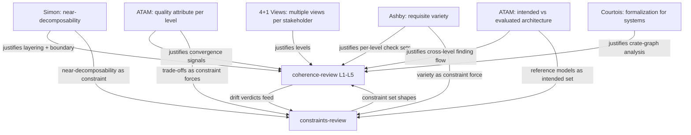

# Review Reference Models

> **Purpose:** the calibration anchor for `coherence-review` and
> `constraints-review`. Every drift measurement those skills produce is
> measured against the references documented here. When a skill's drift
> verdict disagrees with operator intuition, this doc is the arbiter: did
> the skill drift, or did the intuition?
>
> **Rule:** references here are load-bearing. Adding a reference requires
> a primary-source citation verified by fetch or by a copy in
> `kask/research/`. Removing a reference requires updating every skill
> that cites it. The doc is the benchmark; the skills are the instruments.

## Why reference models at all

Two failure modes the reference models exist to prevent:

1. **Drift without detection.** A review skill that evolves its own
   criteria over time will, by default, converge on whatever is easy to
   measure rather than what matters. A fixed external benchmark makes
   drift visible: the skill's verdict either matches the reference or it
   doesn't, and the gap is quantifiable.
2. **Justification after the fact.** A review framework invented from
   first principles can always be rationalized post-hoc as "obviously
   correct." Anchoring to established work means the framework's shape is
   justified *before* it's applied — the burden is to justify deviations,
   not the baseline.

The references below were chosen because each one grounds a specific
design decision in the two review skills. They are not a literature
review; they are the load-bearing citations.

## The reference set

### 1. Kruchten 4+1 View Model

- **Citation:** Kruchten, Philippe (1995). "Architectural Blueprints — The
  '4+1' View Model of Software Architecture." *IEEE Software* 12(6),
  pp. 42–50.
- **Verified:** Wikipedia, "4+1 architectural view model," retrieved
  2026-08-16.
- **What it provides:** the justification for *multiple concurrent views*
  rather than one. Different stakeholders (operator, maintainer,
  security reviewer) need different views of the same system. No single
  view is "the architecture."
- **What it grounds in our skills:** the L1–L5 level structure of
  `coherence-review`. Each level is a view (Boundary, Crate graph,
  Module, Surface, Code). The "+1" (scenarios) maps to L5, where concrete
  scenarios (tests, review verdicts) validate the other four views.
- **Where we deviate:** Kruchten's four views are Logical / Process /
  Development / Physical. Our five levels are Boundary / Crate graph /
  Module / Surface / Code. The deviation is justified: kask's
  architecture has a hard kask/upstream boundary (DIVERGENCE.md) that
  Kruchten's model has no analogue for, and "Surface" (MCP/CLI/API) is a
  distinct view in a system with multiple delivery surfaces. The
  deviation is documented here so it is a choice, not drift.

### 2. SEI Architecture Tradeoff Analysis Method (ATAM)

- **Citation:** Kazman, Rick; Klein, Mark; Clements, Paul. "ATAM: Method
  for Architecture Evaluation." CMU/SEI. Bass, Len; Clements, Paul;
  Kazman, Rick (2003). *Software Architecture in Practice*, 2nd ed.
  Addison-Wesley.
- **Verified:** Wikipedia, "Architecture tradeoff analysis method,"
  retrieved 2026-08-16.
- **What it provides:** quality-attribute scenarios drive the analysis;
  the output is trade-offs, sensitivity points, and risks. The method
  proceeds from general to specific across cycles.
- **What it grounds in our skills:** the per-level convergence signal in
  `coherence-review`. Each level maps to a quality attribute (L1 →
  modifiability/upstream-sync-cost, L2 → modifiability + maintainability,
  L3 → modifiability + testability, L4 → modifiability + consistency, L5
  → correctness + security). The convergence signal at each level is the
  ATAM "risk/non-risk" verdict for that attribute.
- **Where we deviate:** ATAM is a stakeholder-workshop method; our skills
  are single-agent. The deviation is justified: the agent plays the
  stakeholder roles sequentially rather than concurrently. The
  quality-attribute → level mapping is preserved.

### 3. Simon, "The Architecture of Complexity"

- **Citation:** Simon, Herbert A. (1962). "The Architecture of
  Complexity." *Proceedings of the American Philosophical Society* 106(6),
  pp. 467–482.
- **Verified:** Wikipedia, "Herbert A. Simon" (cites the 1962 paper in
  External Links), retrieved 2026-08-16.
- **What it provides:** near-decomposability — hierarchic systems where
  intra-component links are stronger than inter-component links evolve
  faster and are more robust. The formal property: in a
  near-decomposable system, the short-run behavior of each component is
  approximately independent of the others; in the long run, the
  components' behaviors depend on each other but in a coarse way.
- **What it grounds in our skills:** the L1–L5 layering itself, and the
  DIVERGENCE.md "near-zero merge conflict" claim. Kask is designed as a
  near-decomposable system: intra-`kask/` links are strong, kask↔upstream
  links are weak and named (D-seams). `coherence-review` L1 and L2
  measure whether this property holds. `constraints-review` treats
  near-decomposability as a constraint the system must satisfy.
- **Where we deviate:** Simon's claim is about *evolutionary* advantage
  (near-decomposable systems evolve faster). We apply it as a
  *structural* invariant. The deviation is justified: in a fork that
  tracks upstream, the evolutionary advantage *is* the structural
  invariant — the point of the D-seams is to keep merge cost low across
  upstream rebases.

### 4. Courtois, *Decomposability*

- **Citation:** Courtois, P.J. (1977). *Decomposability: Queueing and
  Computer System Applications.* Academic Press.
- **Verified:** cited in Simon's Wikipedia "Further reading" as the
  formalization of Simon and Ando's near-decomposability for computer
  systems, retrieved 2026-08-16.
- **What it provides:** the mathematical formalization of
  near-decomposability applied to computer systems (originally queueing
  models). Gives the conditions under which a system can be analyzed as
  nearly-decomposable.
- **What it grounds in our skills:** the L2 crate-graph analysis in
  `coherence-review`. The crate graph is the computer-system analogue of
  Simon's hierarchic system; the dependency edges are the links. L2
  checks the near-decomposability conditions: are intra-tier links
  stronger than inter-tier links? Are there surface-to-surface links
  that violate the layering?
- **Where we deviate:** Courtois's formalization is quantitative
  (eigenvalue separation). Our L2 check is structural (cycle detection,
  fan-in, layering violations). The deviation is justified: the crate
  graph is small enough (18 crates + 13 servers) that structural checks
  are sufficient and more actionable than eigenvalue analysis.

### 5. Ashby's Law of Requisite Variety

- **Citation:** Ashby, W. Ross (1956). *An Introduction to Cybernetics.*
  Chapman & Hall. The law: "only variety can destroy variety" — a
  regulator must have at least as many distinguishable states as the
  disturbance it regulates.
- **Verified:** Wikipedia, "Variety (cybernetics)," retrieved
  2026-08-16.
- **What it provides:** the justification for per-level convergence
  *thresholds*. A review at level N must have enough variety (enough
  distinct checks, enough signal) to detect the failure modes that
  occur at level N. A single check at L2 cannot detect the variety of
  crate-graph pathologies; a single check at L5 cannot detect the
  variety of code-level bugs.
- **What it grounds in our skills:** the convergence signal at each
  level of `coherence-review` is a *set* of checks, not one. L2 checks
  cycles, fan-in, surface-to-surface deps, god-crates. L5 checks
  correctness, silent-error patterns, test pass. The variety of the
  check set must match the variety of the failure modes. In
  `constraints-review`, the constraint set's variety must match the
  failure-mode variety at each level — this is the floor/ceiling/maturity
  gate.
- **Where we deviate:** Ashby's law is about a regulator and a
  disturbance in a formal game. We apply it to a review instrument and a
  pathology set. The deviation is justified: the review instrument *is*
  a regulator (it detects and reports deviations), and the pathology
  set *is* the disturbance (the things that go wrong).

### 6. SEI ATAM — Intended vs Evaluated Architecture (IS/OUGHT framing)

- **Citation:** Kazman, Rick; Klein, Mark; Clements, Paul. "ATAM: Method
  for Architecture Evaluation." CMU/SEI. Bass, Len; Clements, Paul;
  Kazman, Rick (2003). *Software Architecture in Practice*, 2nd ed.
  Addison-Wesley. (Same citation as reference #2 — ATAM provides both
  the quality-attribute framing and the intended-vs-evaluated framing.)
- **Verified:** Wikipedia, "Architecture tradeoff analysis method,"
  retrieved 2026-08-16.
- **What it provides:** the IS/OUGHT structure for comparing an
  *intended* architecture (the design as documented) against an
  *evaluated* architecture (the design as built) to surface trade-offs,
  sensitivity points, and risks. ATAM's process explicitly produces an
  analysis of where the evaluated architecture diverges from the
  intended one.
- **What it grounds in our skills:** the IS/OUGHT structure of
  `coherence-review`. DIVERGENCE.md is the *intended* architecture (the
  kask side is ours, the D-seams are the named divergences). The
  extracted crate graph is the *evaluated* architecture. The
  cross-level finding flow is the ATAM divergence analysis: L2 says
  "servers should be leaves" (intended), L3 finds domain logic in a
  server (evaluated) — the divergence is the finding. In
  `constraints-review`, the reference models in this doc are the
  *intended* constraint set; the live `.rules` + `DIVERGENCE.md` are the
  *evaluated* — drift is the divergence.
- **Where we deviate:** ATAM is a stakeholder-workshop method that
  produces the intended-vs-evaluated comparison interactively. Our
  intended model (DIVERGENCE.md) is maintained continuously; our
  evaluated model (crate graph) is extracted automatically. The
  deviation is justified: in a living codebase, the intended model must
  be version-controlled, not produced on demand.
- **Note on Murphy et al.:** an earlier version of this doc cited
  Murphy, Notkin, Sullivan (1995/2001) "Software Reflexion Models" for
  the IS/OUGHT framing. That citation could not be verified by
  primary-source fetch (CMU/UBC PDFs returned 404; IEEE/ACM paywalled).
  The IS/OUGHT structure is preserved by re-grounding in ATAM's
  intended-vs-evaluated framing, which is verified. If a primary source
  for Murphy et al. is later placed in `kask/research/`, the framing
  can be re-grounded there — the structure is the same, only the
  citation changes.

### 7. Atkins & Murphy — Reflection: a review of the literature

- **Citation:** Atkins, S.; Murphy, K. (1993). "Reflection: a review of
  the literature." *Journal of Advanced Nursing* 18(8), pp. 1188–1192.
  doi:10.1046/j.1365-2648.1993.18081188.x. PMID: 8376656.
- **Verified:** PubMed PMID 8376656, retrieved 2026-08-16 via NCBI
  E-utilities (esummary + efetch). Abstract confirmed.
- **What it provides:** a literature review of reflective processes that
  identifies the key stages of reflection and the skills required to
  engage in it. The review finds that differences between authors'
  accounts are largely those of terminology, detail, and the extent to
  which processes are arranged in a hierarchy. The staged-process model
  of reflection grounds the PDCA shape of both review skills: reflection
  is not a single act but a sequence of stages, each building on the
  last.
- **What it grounds in our skills:** the methodological shape. Both
  `coherence-review` and `constraints-review` are staged reflective
  processes — elicit/classify/gate/drift and L1→L5 traversal are
  reflection stages. Atkins & Murphy justify the staged structure (as
  opposed to a single-pass review) and the hierarchy of stages (as
  opposed to a flat checklist). This is a methodological reference,
  not a structural one; it grounds *why* the skills are staged, not
  *what* they check.
- **Where we deviate:** Atkins & Murphy's context is professional
  education (nursing); our context is software architecture review. The
  deviation is the application domain, not the process structure. The
  staged-reflection model transfers directly.

## How the references compose

## Drift measurement protocol

`constraints-review` measures drift of the live constraint set against
the references in this doc. Each constraint gets a drift score:

| Score | Meaning | Action |
|---|---|---|
| `0` | Aligns with a reference model | None |
| `1` | Neutral — no reference applies | None |
| `2` | Diverges from a reference, exception documented in this doc | None (the deviation is a recorded choice) |
| `3` | Diverges from a reference, no documented exception | **Actionable: add an exception to this doc or change the constraint** |

A score-3 finding is the drift signal. The fix is either (a) document
the exception in the "Where we deviate" section of the relevant
reference above, making it a score-2, or (b) change the constraint to
align with the reference. The operator chooses; the skill reports.

## Maintenance

- **Adding a reference:** requires a primary-source citation, verified
  by fetch or by a copy in `kask/research/`. Add a "What it grounds"
  section explaining which design decision it justifies. Update any
  skill manifest that should cite it.
- **Removing a reference:** grep the skill manifests for the citation.
  If any skill cites it, either keep the reference or update the skill
  to cite a replacement (as documented for Murphy above).
- **Updating a deviation:** when a skill's drift verdict reveals a new
  deviation, add it to the "Where we deviate" section of the relevant
  reference with justification. This is how the doc evolves without
  becoming drift itself.

## Version

- **v1.1** (2026-08-16): added Atkins & Murphy 1993 (reflection
  literature review) as reference #7, grounding the staged-process shape
  of both review skills. Verified via PubMed PMID 8376656. Six
  structural references (Kruchten 4+1, SEI ATAM ×2 framings, Simon
  1962, Courtois 1977, Ashby 1956) plus one methodological reference
  (Atkins & Murphy 1993). All seven verified by fetch.
