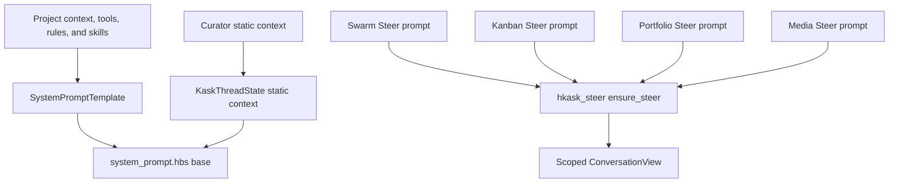

This document consolidates the two surfaces that instruct the zed-kask agent:
the system prompt (base template + four overlays, and its divergences from
upstream Zed) and the skill system (SKILL.md body injection, composition
principles, testing). Formerly two documents — `AGENT_SYSTEM_PROMPT.md` and
`explanation/skills-and-composition.md` — folded 2026-08-28 during the docs
condensation; git history preserves the originals.

# Part I — The Agent System Prompt

> **Scope:** the agent system prompt only. Verified against zed-kask `HEAD`
> (`e510ec4a92`) and upstream Zed `upstream/main` (`e3adf43f37`) on
> 2026-08-28. Every claim here is traceable to a `file:line` or a named test.

## 1. Purpose

This document answers two questions an upstream rebase or a prompt edit has to
answer immediately: **what is the agent system prompt made of**, and **where does
zed-kask deviate from upstream Zed**. It exists because the prompt is a divergence
surface that `DIVERGENCE.md` covers only in passing — the base template is tracked
under D1/D2, but the three overlay prompts had no entry at all until 2026-08-12.

Treating a prompt as a versioned interface with an explicit change log follows
the same reasoning that motivates architecture decision records: the cost of a
change is dominated not by writing it but by later readers reconstructing why it
was made[^nygard-adr]. Prompts are especially prone to this because their
"behaviour" is unobservable from the artifact alone.

## 2. The base prompt and five overlays

Upstream Zed renders one base system prompt. zed-kask keeps that shared file and
adds five scoped contexts:

| # | Surface | Location | Scope |
|---|---------|----------|-------|
| 1 | Base template | `crates/agent/src/templates/system_prompt.hbs` | Every thread |
| 2 | Curator overlay | `crates/agent/src/curator_agent_server.rs` (`CURATOR_STATIC_CONTEXT`) | Curator threads |
| 3 | Swarm Steer overlay | `crates/swarm_panel/src/swarm_panel.rs` (`steer_system_prompt`) | Swarm panel |
| 4 | Kanban Steer overlay | `crates/kanban_panel/src/kanban_panel.rs` (`steer_system_prompt`) | Kanban panel |
| 5 | Portfolio Steer overlay | `crates/portfolio_panel/src/portfolio_panel.rs` (`steer_system_prompt`) | Portfolio panel |
| 6 | Media Steer overlay | `crates/media_panel/src/media_panel.rs:235-314` (`ensure_steer`, `steer_system_prompt`) | Media panel |

The four panel overlays all use `hkask_steer::ensure_steer`; their advertised
tool names are rendered from each server's generated `TOOL_NAMES` and checked
before the conversation is created (`crates/hkask-steer/src/hkask_steer.rs:174-184`;
media coverage pins at `crates/media_panel/src/media_panel.rs:500-541`).

Overlays are **appended, never substituted**: the Zed coding instructions remain
intact and the overlay adds role and scope on top. `CuratorAgentServer` documents
this explicitly (`curator_agent_server.rs:33-36`). Composing a specialisation onto
a stable base, rather than forking a second full prompt, is the open/closed
principle applied to instruction text — the base is extended without being
modified, so upstream changes to it keep flowing through[^martin-ocp].

## 3. Rendering pipeline

`SystemPromptTemplate` (`crates/agent/src/templates.rs:37-65`) is the Handlebars
render context; `TEMPLATE_NAME` pins it to `system_prompt.hbs` (`:67-69`).



<!-- DIAGRAM_ALIGNMENT
id: DIAG-PROMPT-001
verified_date: 2026-09-16
verified_against: crates/agent/src/templates.rs; crates/agent/src/curator_agent_server.rs; crates/agent/src/kask_thread_state.rs; crates/hkask-steer/src/hkask_steer.rs:174-184; crates/media_panel/src/media_panel.rs:235-314
status: VERIFIED
-->

The Curator context is stored on `KaskThreadState`. Panel Steer overlays construct
cross-domain conversation views through the shared `hkask_steer` lifecycle;
changing panel state invalidates and rebuilds that conversation. The overlay frames
the workflow but does not filter the MCP tool surface.

### 3.1 Conditional sections

The prompt is not a static string. Sections appear or vanish based on the render
context, so the model is never told about a capability it does not have — an
application of the principle that an interface should not advertise operations it
cannot honour[^parnas-1972].

| Guard | Line | Effect when false |
|-------|------|-------------------|
| `(gt (len available_tools) 0)` | `:34` | Entire tool-use half is replaced by a no-tools instruction |
| `(gt mcp_tools_hidden 0)` | `:49` | Drops the hidden-tools visibility marker (D44) — the count of registered-but-filtered MCP tools, with the `list_mcp_tools` recovery path |
| `(contains available_tools 'grep')` | `:67` | Drops the grep/find_path search guidance |
| `(contains available_tools 'spawn_agent')` | `:121` | Drops `## Multi-agent delegation` |
| `sandboxing` + `(contains available_tools 'terminal')` | `:163-164` | Drops `## Terminal sandbox` entirely |
| `is_linux` / `is_windows` | `:170`, `:177`, `:194` | Selects the platform-correct writable-temp and network story |
| `model_name` | `:221` | Drops `## Model Information` |
| `has_skills` | `:227` | Drops `## Agent Skills` and the `<available_skills>` catalog |
| `(or user_agents_md has_rules)` | `:255` | Drops `## User's Custom Instructions` |
| `(contains available_tools 'kanban_goal_create')` | `:337` | Drops the four-moves → goal-tools wiring inside `## Division of Responsibilities` (D40) |
| `static_context` | `:358` | Drops `## Session Context` |

## 4. Section inventory

Section headings are **identical to upstream** except for two additions. The
divergence is in section *contents*, not structure.

*Scope-exempt from the Sourced-Ideas Mandate: this section is a traceability
matrix over §5's divergences and the template's own headings; it decides nothing.*

| Section | Line | Status vs. upstream |
|---------|------|---------------------|
| Communication | `:3` | Identical |
| Formatting Responses | `:13` | **Modified** (§5.3, §5.4) |
| Tool Use | `:35` | **Modified** (structured tool-call bullet; D44 hidden-tools marker bullet at `:49-50`) |
| Task Execution | `:53` | **Modified** (§5.2, §5.7) |
| Searching and Reading | `:60` | Identical |
| Making Code Changes | `:73` | Identical |
| Ambition vs. Precision | `:86` | **Modified** (§5.7, D40 — "creative touches when scope is vague" replaced with "resolve the vagueness with the user") |
| Validation | `:92` | Identical |
| Fixing Diagnostics | `:100` | Identical |
| Debugging | `:105` | Identical |
| Calling External APIs | `:114` | Identical |
| Multi-agent delegation | `:122` | Identical |
| Final Message | `:137` | **Modified** (§5.7, D40 — functional-outcome-first bullet) |
| System Information | `:151` | Identical |
| Terminal sandbox | `:165` | Identical |
| Model Information | `:222` | Identical |
| Agent Skills | `:228` | **Modified** — em-dash only (§5.5) |
| User's Custom Instructions | `:256` | Identical |
| → Personal `AGENTS.md` | `:263` | Identical |
| → Project Rules | `:274` | Identical |
| Opening identity + roles (kask) | `:1`–`:3` | **Amended upstream opening** (§5.7, D40 evolution — agent renamed Z-K; roles fixed at the top) |
| Redeemable-claims bullet (kask) | `:10` | **Amended upstream section** (§5.9 — claims carry their ground) |
| Feature-justification bullet (kask) | `:84` | **Amended upstream section** (§5.7 — every feature names its functional requirement) |
| Tool failure-mode warnings (kask) | `:293` | **New section** (§5.1) |
| Division of Responsibilities (kask) | `:301` | **New section** (§5.7, D40 — now the working loop; roles live in the opening) |
| Ontology anchoring bullet in Tool Use (kask) | `:47` | **Amended upstream section** (§5.8, D53 de-ghettoized + D54 — names the `onto_anchor` tool) |
| Session Context | `:359` | **New section** (§5.1) |

## 5. Divergences from upstream

`git diff upstream/main -- crates/agent/src/templates/system_prompt.hbs` reports
**73 insertions, 2 deletions across 7 hunks** (verified 2026-09-04). Each is catalogued below with its
D-seam and its pinning test, except the structured tool-call bullet (`:39`, a
single added line in `## Tool Use` instructing the model to emit tool calls via
the structured tool-call mechanism rather than narrating parameters as text).
Every zed-kask deviation that disables or replaces upstream behaviour carries a
test, per the repo's divergence rule.

### 5.1 `## Session Context` — new section (D2 / D6)

- **zed-kask** renders `{{{static_context}}}`. Field declared at
  `templates.rs:49`.
- **Upstream** has no such block and no `static_context` field.
- **Why:** it is the render target for agent overlays (Curator role, Steer
  panel prompts). Memory recall is per-turn via `inject_context`
  (`Role::System` message), not via this block.
- **Pinned by** `test_system_prompt_renders_session_context_without_rules_or_agents_md`.

**Defect fixed 2026-08-12 — the reason the test exists.** The block was
originally nested *inside* the `{{#if (or user_agents_md has_rules)}}` guard.
For any project with no `.rules` file **and** no personal `AGENTS.md`,
`static_context` rendered as nothing — silently dropping the Curator, swarm Steer,
and kanban Steer prompts. It went unnoticed because this repo has a `.rules` file
(making `has_rules` true) and because all eleven pre-existing template tests
passed `static_context: None`. The block is now a **sibling** of that guard. This
is the class of failure that motivates asserting on observable behaviour rather
than on the presence of code: the overlay existed, was wired, and never
arrived[^hunt-thomas-1999].

**Refactored 2026-08-25 — `inject_static_context` deleted.** The
`ContextInjector::inject_static_context` method and `Thread.static_context` /
`static_context_loaded` fields were removed. Tool-use warnings moved into the
`system_prompt.hbs` template as an unconditional `## Tool failure-mode warnings
(kask)` section. Thread-scoped memory recall (`recall_thread` /
`recall_thread_curator`) was folded into the per-turn `inject_context` path so
memory is fresh at decision time rather than snapshotted once per session. The
`## Session Context` block now carries only agent overlays (Curator role + Steer
prompts). Pinned by `test_system_prompt_contains_tool_failure_mode_warnings`.

### 5.2 Loop-termination guardrail — new bullet

- **zed-kask** `:53`: *"If a tool loop repeats without measurable progress (the
  same error recurring or no new state appearing) **three times**, stop, summarize
  what you tried, and ask the user rather than continuing indefinitely."*
- **Upstream** `## Task Execution` ends at its `:51` with no loop bound.
- **Why:** upstream pairs a strong autonomy injunction (`:49`, "keep going
  until… completely resolved") with no termination signal. A control loop with no
  bound on corrective action is an unregulated loop; the bound is what makes the
  autonomy safe rather than open-ended[^ashby-1956]. The threshold is a concrete
  count deliberately — "several iterations" left the stop point to model
  discretion, which varied by model.
- **Pinned by** `test_system_prompt_contains_loop_termination_guardrail`, which
  asserts both the sentence and the literal `three times`.

### 5.3 Mermaid diagram-type list (D18)

- **zed-kask** `:26` names the exact directives the renderer accepts —
  `sankey-beta`, `xychart-beta`, `architecture-beta`, `radar-beta`, `treemap`,
  `block`, `kanban` — and separately notes that the ` ```media `, ` ```graph `,
  ` ```kanban `, ` ```portfolio `, ` ```scenarios `, and
  ` ```swarm_delegate_results ` fenced blocks are kask viz widgets, not
  mermaid.
- **Upstream** `:26` lists only its thirteen core types.
- **Why:** the renderer's allowlist is `crates/markdown/src/mermaid.rs:428-451`,
  whose comment asked for manual sync with the prompt — and drifted anyway. The
  prompt had advertised bare `sankey`/`xychart`, which the renderer silently
  drops, while denying `kanban` was a mermaid type at all (it is; `mermaid.rs:445`).
- **Pinned by** `test_system_prompt_advertises_every_supported_diagram_type`
  (`mermaid.rs:1252`) — an exhaustive prompt-vs-allowlist check living next to
  the constant, replacing the manual-sync comment. Also
  `test_system_prompt_mermaid_list_uses_renderer_directives` in `templates.rs`.

**Note on `kanban`:** it is *both* a valid mermaid directive *and* a viz-widget
fenced tag. The prompt must disambiguate the two, not deny either.

### 5.4 Display-hint bullets (D18)

- **zed-kask** `:51`: copy the ` ```media ` block from a `display_hint`
  tool-result field verbatim into the reply.
- **zed-kask** `:52`: copy the ` ```spreadsheet ` block from a
  `spreadsheet`/`portfolio` tool result's `display_hint` verbatim into the
  reply — an editable workbook what-if from `spreadsheet_apply` or
  `portfolio_what_if`.
- **zed-kask** `:53`: copy the ` ```media ` blocks from a `display_hints`
  array verbatim into the reply.
- **Upstream** has none of these bullets.
- **Why load-bearing:** the block *renderers* live in
  `hkask_viz_core::block_renderer()` (wired at
  `crates/agent_ui/src/conversation_view.rs:3584`), so the prompt bullets
  remain live for any tool that emits a display-hint fenced block.

### 5.5 `## Agent Skills` — project-aware body injection (D1)

The prompt uses progressive disclosure: skill name, description, and location are
listed up front; the body is loaded only when the model invokes `skill`.[^anthropic-skills]
The live execution path is project-aware rather than filesystem-only:

- `NativeAgent::register_session` constructs `SkillTool::with_body_resolver`
  with `skill_body_resolver_for_project` (`crates/agent/src/agent.rs:1016-1021`).
- Project-local skill bodies are opened through the project buffer, so remote
  workspaces and unsaved buffer edits are visible (`crates/agent/src/agent.rs:4339-4373`).
- Global skills still resolve through `agent_skills::read_skill_body` on the
  filesystem (`crates/agent/src/agent.rs:4376-4380`).
- Slash activation uses the same resolver, preventing tool and slash invocation
  from reading different bodies (`crates/agent/src/agent.rs:2317-2342`).

`test_project_skill_body_resolves_through_buffer` proves the distinction by
changing a buffer without saving it and asserting that the resolver returns the
buffer content rather than the disk content (`crates/agent/src/agent.rs:6781-6835`).
The Kask authorization, dependency, and outcome-recording behavior remains around
this upstream resolver seam; unreadable bodies and missing dependencies surface as
errors rather than no-body fallbacks.

### 5.6 `skill_bundle` composition — removed section (D1)

**Removed 2026-08-20 (commit `e7503c0cf4`, "revert skill cascade").** The
`## Multi-skill composition with skill_bundle` prompt section and the
`skill_bundle` tool no longer exist: the template carries no `skill_bundle`
text, and no `skill_bundle` tool is registered in `crates/agent/src`. Bundle
composition is now driven by the **skill-bundler** skill (see Part II,
"Composing Skill Bundles").

### 5.7 `## Division of Responsibilities (kask)` — new section (D40)

- **zed-kask** `:294-319` carries the four-moves interaction loop from the
  functional-interaction spec
  ([`functional-interaction-spec.md`](functional-interaction-spec.md)):
  point at the same target (intake interpretation, user corrects), bring
  choices to the user as experiences (options + recommendation, user
  decides), report outcomes not artifacts (functional outcome first),
  bank the learning. Three shared-section bullets are amended alongside:
  the `## Task Execution` autonomy bullet's ask-trigger gains "a choice
  changes what the user will experience" and its "prematurely" is
  reframed to "for information you can find yourself"; the
  `## Ambition vs. Precision` bullet replaces "creative touches when
  scope is vague" with "resolve the vagueness with the user"; and
  `## Final Message` gains a functional-outcome-first bullet.
- **Upstream** has none of these; its autonomy bullet licenses unilateral
  functional decisions (the trigger is missing information, not authority),
  and its Final Message bullet rehearses a file-list summary format.
- **Why:** the severance of functional requirements from technical work is
  structural — technical tokens crowd out the functional frame in a shared
  context window. The section is deliberately **preference-framed** (an
  evaluation axis: "the user evaluates this work by what it lets them do")
  rather than prohibition-framed, per the spec's gradient-over-constraint
  principle: constraint walls habituate and provoke escape-seeking.
- **Loop-closing wiring (2026-08-29):** a conditional block inside the
  section — `{{#if (contains available_tools 'kanban_goal_create')}}` —
  maps the moves to the native goal tools (Move 1 → `kanban_goal_create`,
  Move 3 → `kanban_goal_judge`, Move 4 → `kanban_goal_score`) when the
  kata-kanban server is connected, and vanishes when it isn't (§3.1: never
  advertise a capability the turn doesn't have).
- **Skill rubrics (2026-09-04):** a paragraph after the four moves names
  each side's operational rubric — the `program-manager` skill (the
  agent's side: spec recovery, design-before-coding, definition of done,
  closure ledger) and the `product-manager` skill (the user's side: what
  to deliver at intake, decision points, and confirmation) — and directs
  underspecified intake to the product-manager skill rather than
  improvisation.
- **Evolution (operator ruling 2026-09-10):** the mid-prompt section
  underperformed — agents read it as an overlay and kept asking technical
  questions at intake while ignoring functional requirements (observed
  live in the companies-fix session). Roles now live in the OPENING: the
  first line renames the agent ("You are the Z-K agent running inside the
  Zed-Kask fork of Zed.dev") and fixes the roles (user = product manager
  owning functional requirements; agent = technical program manager /
  VP of engineering owning technical implementation), followed by a role
  paragraph carrying the question-class rule — functional questions are
  the user's to answer, asked in functional terms; technical questions
  are the agent's to decide, "do not route technical decisions to the
  user as questions". The section (now at `:304`) opens "The roles are
  fixed in the opening of this prompt" and move 2 is **Decide by class**:
  functional decisions surfaced as experiences with a recommendation;
  technical decisions decided and presented with their functional
  consequence, "never route one to the user as a question".
- **Indicator reframing (operator ruling 2026-09-10, same pass):** the
  prohibition tails were removed per the gradient-over-constraint
  principle — move 2 now reads "decide and present the result with its
  functional consequence, as a decision the user can veto on functional
  grounds", and the opening's question-class rule gained the positive
  form: a technical choice that genuinely needs the user's input is
  "present[ed] in functional terms — what each option lets the user do —
  with the technical detail attached as context". A feature-justification
  bullet was added to `## Making Code Changes` (":84"): every feature
  names the functional requirement it serves; a feature that cannot
  name its requirement is a functional question for the user, not code
  to write. The opening role paragraph now carries the skills pointer
  (`program-manager` / `product-manager`).
- **Pinned by** `test_system_prompt_contains_division_of_responsibilities`
  (section + all four moves + the authority boundary + both skill
  references + the no-improvisation directive),
  `test_division_skill_references_resolve_on_disk` (the named skills
  exist — a prompt reference to a missing skill is a ghost instruction),
  `test_system_prompt_autonomy_bullet_includes_experience_trigger`,
  `test_system_prompt_autonomy_bullet_reframes_prematurely`,
  `test_system_prompt_vagueness_resolved_with_user`,
  `test_system_prompt_final_message_leads_with_functional_outcome`,
  `test_system_prompt_wires_four_moves_to_goal_tools_when_available`, and
  `test_system_prompt_omits_goal_tool_wiring_when_tools_unavailable`.

### 5.8 `## Tool Use` ontology-anchoring bullet — D53 de-ghettoized + D54 canonical ladder (2026-09-10)

Operator rulings 2026-09-10: ontology resolution is a CRITICAL TOOL, not
a standalone section (D53), and the tool follows the pre-existing
anchoring pattern (D54). The former `## Ontology-anchored reasoning
(kask)` section is removed; its content lives in two places: a
required-tool-of-analysis bullet inside `## Tool Use` (beside "gather
enough context before acting" — resolve domain terms with the
**`onto_anchor` tool**, which walks the canonical fallback ladder over the
fixture-pinned `hkask-bridge-ontology` vocabularies — domain supplements →
derived concepts → SUMO upper → 5W1H core — and always terminates on a
real anchor: nothing is ever untagged; a coarse core-rung anchor carries
the ruling path), and the identity clause in the opening ("no
professional works in a private language"). Pinned by the rewritten
`test_system_prompt_contains_ontology_anchored_reasoning`, which asserts
the new locations, the ladder invariant phrase, AND the ABSENCE of the
standalone section header.

### 5.9 `## Communication` redeemable-claims bullet — new (2026-09-10)

Communicative-action layer (Habermas): every assertion is a claim the
user or a reviewer can challenge, and each claim names its ground —
functional claims answer to the user's stated requirement, technical
claims to the tree, the run, and the commit, domain terms to their
published ontology anchor. "A claim with no ground is not communication —
it is noise that coordinates nothing; mark it as an inference or
unanchored, or do not send it." This is the prompt-level expression of the
session's core lesson: an unanchored term is an unredeemable claim — it
can only be sustained by reassertion, and resolution then requires the
operator's authority instead of inspectable grounds.

## 6. Shared upstream structure and seam boundary

`system_prompt.hbs` remains an upstream-shared file, but it is not byte-identical:
the current fork diff is 93 inserted and 6 deleted lines. Kask changes include
the role opening, ontology/tool guidance, media display hints, functional decision
rules, failure-mode warnings, and session context. Unchanged regions should still
merge from upstream normally; only the named D1/D2/D26/D40/D54 prompt obligations
are mapped reapplications. The complete authoritative boundary is the current
`DIVERGENCE.md`, not a count of apparently identical sections.

*Scope-exempt from the Sourced-Ideas Mandate: this section records the observable
vendor-branch boundary (`git diff upstream/main -- crates/agent/src/templates/system_prompt.hbs`).*

## 7. Rebase procedure for this file

`system_prompt.hbs` is a **shared upstream file with zed-kask edits**, the
highest-conflict category in `DIVERGENCE.md`. The procedure below treats the
pinning tests as the executable record of intent: a merge that silently drops a
divergence fails a named test instead of shipping, which is the regression-test
discipline applied to a vendor-branch merge[^fowler-vendor-branch]. On upstream
sync:

1. Merge normally and inspect every conflict against the seam records in
   `DIVERGENCE.md`; the number and location of hunks are not stable.
2. Re-apply each mapped prompt obligation. Run the targeted agent template and
   markdown Mermaid tests; do not encode test-count totals in the procedure.
3. If upstream restructures `## Agent Skills`, treat §5.5 as a **re-application**,
   not a merge: the two versions state opposite instructions, so a textual merge
   can produce a prompt that both forbids and requires reading `SKILL.md`.
4. Check `mermaid.rs:428-451` against `:26` — upstream adds diagram types, and the
   drift test will fail until the prompt is updated.

## 8. Verification

Every claim above is checkable. Reproducible commands are given rather than
asserted results, so a reader can falsify this document rather than trust
it[^popper-1959].

```sh
# The complete current seam
git diff --numstat upstream/main -- crates/agent/src/templates/system_prompt.hbs
git diff upstream/main -- crates/agent/src/templates/system_prompt.hbs

# Targeted pinning tests
cargo test -p agent --lib templates::
cargo test -p agent --lib test_project_skill_body_resolves_through_buffer
cargo test -p markdown --lib mermaid
```

## References

[^nygard-adr]: Nygard, M. (2011). *Documenting architecture decisions*. https://cognitect.com/blog/2011/11/15/documenting-architecture-decisions.
    Cited for the practice of recording the *why* of a structural decision alongside the artifact; applied here to prompt divergences, which are otherwise unrecoverable from the template alone.

[^parnas-1972]: Parnas, D. L. (1972). On the criteria to be used in decomposing systems into modules. *Communications of the ACM*, 15(12), 1053–1058. https://doi.org/10.1145/361598.361623.
    Cited for information hiding: a module's interface should expose only what callers can act on. The conditional sections apply this to the prompt — the model is told about a tool or sandbox only when it actually has one.

[^ashby-1956]: Ashby, W. R. (1956). *An introduction to cybernetics*. Chapman & Hall. http://pespmc1.vub.ac.be/books/IntroCyb.pdf.
    Cited for regulation requiring a bounded corrective response; the loop-termination guardrail is the bound on an otherwise open-ended autonomy injunction.

[^anthropic-skills]: Anthropic. (2025). *Equipping agents for the real world with Agent Skills*. https://www.anthropic.com/engineering/equipping-agents-for-the-real-world-with-agent-skills.
    Cited for progressive disclosure (name + description preloaded, body loaded on relevance). zed-kask's body injection is this pattern with the body-loading step replaced rather than removed.

[^hunt-thomas-1999]: Hunt, A., & Thomas, D. (1999). *The pragmatic programmer: From journeyman to master*. Addison-Wesley.
    Cited for the discipline of testing observable behaviour over implementation presence; §5.1's defect was wired code that produced no output, invisible to every existing test.

[^martin-ocp]: Martin, R. C. (1996). The open-closed principle. *C++ Report*, 8(1). https://web.archive.org/web/20150905081105/http://www.objectmentor.com/resources/articles/ocp.pdf.
    Cited for extension without modification. The overlay channel specialises the base prompt without editing it, which is what keeps upstream's base changes mergeable.

[^fowler-vendor-branch]: Fowler, M. (2020). *Patterns for managing source code branches: Vendor branch*. https://martinfowler.com/articles/branching-patterns.html#vendor-branch.
    Cited for the vendor-branch pattern and the practice of making local deviations from an upstream baseline explicit and re-applicable; §7's per-divergence pinning tests are the mechanical form of that record.

[^popper-1959]: Popper, K. (1959). *The logic of scientific discovery*. Hutchinson. https://doi.org/10.4324/9780203994627.
    Cited for falsifiability as the test of a claim's content. §8 gives commands that can refute this document's assertions rather than restating them as conclusions.


# Part II — Skills and Composition

# Skills and Composition

Design, invoke, audit, and compose hKask skills. Skills execute via **upstream Zed body injection**: `SkillTool::run` resolves the current catalog and reads the selected `SKILL.md` through an injected body resolver (`crates/agent/src/tools/skill_tool.rs:184-288`). Session registration supplies the project-aware resolver, so project-local bodies come through project buffers—including remote workspaces and unsaved edits—while global bodies come through the filesystem (`crates/agent/src/agent.rs:4339-4383`; registration at `:1016-1021`). The model reads the resulting `render_skill_envelope`; the agent is the executor.[^anthropic-skills]

This guide also covers building MCP servers that provide tool surfaces for skills and agents — in zed-kask, MCP servers are launched as child processes over stdio by the in-process governed `McpRuntime` (D3 — single spawn authority since 2026-08-29; kask servers are no longer registered with zed's per-project `ContextServerStore`); the standalone `kask mcp start <id>` CLI is deleted.

---

## Skill Anatomy

A skill is a directory under `.agents/skills/<name>/` (repo root, not under `kask/`) containing a `SKILL.md` file:

```
.agents/skills/my-skill/
└── SKILL.md          ← YAML frontmatter + markdown body (process instructions)
```

- **`SKILL.md`** has YAML frontmatter (`name`, `description`, and optional metadata) and a markdown body. The body is the process instructions the model reads and follows when the skill is invoked. This is the source of truth — there is no derived manifest.
- **Template crates** under `kask/registry/templates/<name>/` are optional companion resources. A skill body may instruct the model to call the `render_template` tool to render a Jinja2 template from a template crate. The template crate is not required for skill execution — it is a resource the skill body may reference.
- **Development shipped-skill identity:** when this checkout exists, discovery reads shipped skills directly from `.agents/skills/<name>/` as global catalog entries and skips those files in project discovery. Redundant global shipped copies are removed, not linked or archived. The model and `skill` tool therefore see one body per shipped name; global-only user skills remain separate. Installed binaries without a source checkout seed a disk body from the bundled payload.

### The Body-Injection Model

When the agent invokes the `skill` tool with a skill name:

1. `SkillTool::run` (`crates/agent/src/tools/skill_tool.rs:184-288`) receives the skill name from `SkillToolInput` and snapshots the current project catalog.
2. It selects the skill and invokes the injected body resolver (`skill_tool.rs:203-224,275-284`). In production that is `skill_body_resolver_for_project` (`crates/agent/src/agent.rs:4339-4383`), shared by tool and slash activation (`:1016-1021,2317-2345`).
3. It calls `render_skill_envelope(&skill, &body)` (`skill_tool.rs:48-74`), which wraps the resolved body in a structured envelope.
4. The envelope is returned to the agent as `SkillToolOutput::Found { rendered }` (`skill_tool.rs:285-288`).
5. The agent reads the envelope content (the skill body) and follows the instructions — calling `lisp_eval` for deterministic computation, `render_template` for structured prompt scaffolding, and MCP tools for external capabilities.

The model is the executor. Convergence is the model's judgment, optionally checked by `lisp_eval` when the skill body instructs it.

### Two Supporting Tools

| Tool | Location | Purpose |
|------|----------|---------|
| `lisp_eval` | `crates/agent/src/tools/lisp_eval_tool.rs` | Sandboxed Lisp interpreter (`hkask_lisp::eval_sandboxed_with_budget`). No I/O, no `eval`, no network. Bounded by `max_steps` (default 100000) and `max_depth` (default 64). The model calls it when a SKILL.md instructs deterministic computation (convergence signals, invariant checks, scoring). |
| `render_template` | `crates/agent/src/tools/render_template_tool.rs` | Renders Jinja2 templates from `kask/registry/templates/` using `minijinja`. Strips YAML frontmatter. Path traversal protection via `canonicalize` + `starts_with` check. Template base path wired via `agent::set_template_base_path()` in `crates/zed/src/main.rs:700-711`. |

### PDCA Loops Are Model-Coordinated

A skill body may describe a PDCA (Plan-Do-Check-Act) loop with convergence criteria. The model self-iterates: it reads the instructions, performs the plan step, calls `lisp_eval` to check convergence, and loops until the convergence criterion is met or the model judges the task complete. There is no runtime that drives the loop — the SKILL.md body describes the convergence criteria; the model coordinates the iteration using `lisp_eval` for deterministic checks and `render_template` for structured prompt scaffolding.

This is the "model-coordinated PDCA" pattern: the skill body is the process specification, the model is the executor, `lisp_eval` is the deterministic oracle, and `render_template` is the scaffolding tool.

---

## Listing and Checking Skills

Skill listing, status, and auditing are performed in-process through the zed-kask agent panel or the skill maintenance tooling. The former `kask skill list`, `kask skill status`, and `kask skill audit` standalone CLI commands have been removed.[^fagan-skill-audit]

### List Available Skills

Invoke the skill-listing surface from the agent panel. The output shows the skill directory layout with name, description, and namespace:

```
  .agents/skills/:
    coding-guidelines     description="Enforce Karpathy's four coding principles"
    diagnose              description="Disciplined diagnosis loop"
    ...
```

### Skill Auditing

Run a dual-layer audit to check skill health through the skill maintenance tooling or agent panel. The audit checks:
- `SKILL.md` presence and frontmatter validity
- Template crate existence (if the skill body references `render_template`)
- Content consistency between SKILL.md and any companion template crates

---

## Designing a Skill

### Writing a `SKILL.md`

Create `.agents/skills/my-skill/SKILL.md`:

```markdown
---
name: my-skill
description: A custom skill for automated code review
---

# My Skill

This skill performs an automated code review using a PDCA cycle:
- **Plan:** Analyze the code structure and identify review targets
- **Do:** Execute the review using available tools
- **Check:** Validate findings against quality criteria (use `lisp_eval` to check invariants)
- **Act:** Produce a review report with recommendations

## When to Use

Use this skill when reviewing Rust code for idiomatic patterns and correctness.

## Process

1. Read the target file(s) using `read_file`.
2. Identify review targets (functions, types, modules).
3. For each target, check against the criteria below.
4. Use `lisp_eval` to verify structural invariants (e.g., function count, complexity thresholds).
5. Produce a structured report with findings and recommendations.

## Convergence

The skill is complete when all identified targets have been reviewed and the `lisp_eval` invariant check passes.
```

The `description` field in the frontmatter is what the agent sees in the skill catalog (preloaded into the system prompt). The body is injected only when the skill is invoked — this is progressive disclosure.[^anthropic-skills]

### Writing Templates (`.j2` Files)

Templates are optional Jinja2 files rendered with context variables at invocation time via the `render_template` tool. A skill body may instruct the model to call `render_template` with a template path and context variables:

```jinja2
{# registry/templates/my-skill/plan.j2 #}
You are executing the "my-skill" skill. This is the PLAN phase.

Context: {{ context }}

Based on the context above, develop a structured plan for achieving the goal.
Consider:
1. What information is needed
2. What tools should be used
3. What intermediate outputs are required

Return your plan as a numbered list.
```

The model calls `render_template(template_path="my-skill/plan.j2", context={...})` and receives the rendered text. The template crate at `kask/registry/templates/my-skill/` is the companion resource; the `SKILL.md` body is the source of truth for the skill's process.

### Context Variables

The `render_template` tool accepts a `context` map. The skill body instructs the model on what variables to pass. There are no automatically-injected context variables — the model constructs the context from its current state and prior tool results.

---

## Testing a Skill Locally

### Step 1: Verify Discovery

List skills through the agent panel. Your skill should appear in the list.

### Step 2: Invoke from the Agent Panel

Open the zed-kask agent panel and invoke the skill:

```
/skill my-skill "Review the authentication module in src/auth.rs"
```

The agent panel routes this through `SkillTool::run` (D1), which:
1. Resolves the skill from the current project catalog
2. Reads the body through the project-aware resolver shared with slash activation
3. Calls `render_skill_envelope(&skill, &body)` (`skill_tool.rs:48-74`)
4. Returns the envelope to the agent
5. The agent reads the body and follows the instructions

---

## Invoking Skills

Skills are invoked in-process through `SkillTool::run` (`crates/agent/src/tools/skill_tool.rs:184-288`), which resolves the current catalog, obtains the body through its injected resolver, and injects it via `render_skill_envelope`.[^mcp-spec-skill-invoke]

### Via the Agent Panel

Open the zed-kask agent panel and invoke a skill:

```
/skill diagnose "My application crashes on startup"
```

Model tool invocation uses `SkillTool::run`; `/skill` slash activation uses `send_skill_invocation`. Both execute in-process and share `skill_body_resolver_for_project`, so they resolve the same project-local body (`crates/agent/src/agent.rs:1016-1021,2310-2345,4339-4383`).

### What Happens During Execution

When a skill is invoked in-process:

1. **Lookup** — The skill name is resolved against the current loaded catalog (`skill_tool.rs:195-224`).
2. **Body resolution** — The injected resolver obtains the body; production tool and slash activation share `skill_body_resolver_for_project`, so project-local unsaved/remote content is authoritative (`crates/agent/src/agent.rs:1016-1021,2317-2345,4339-4383`).
3. **Envelope rendering** — `render_skill_envelope(&skill, &body)` (`skill_tool.rs:48-74`) wraps the body in a structured envelope and returns `SkillToolOutput::Found { rendered }` (`:285-288`).
4. **Agent follows instructions** — The agent reads the envelope content and calls `lisp_eval`, `render_template`, and MCP tools as the skill directs.
5. **Regulation feedback** — activation success or resolver/dependency failure is persisted as `reg.skill.<skill-id>.outcome`; direct ratings and skill-naming advice applications persist `reg.skill.<skill-id>.operator_feedback` (`kask/crates/hkask-regulation/src/runtime.rs:773-790`; wiring at `crates/zed/src/main.rs:956-1020`).

### Convergence (Model-Coordinated)

A skill body may describe convergence criteria. The model self-iterates:
1. Performs the plan step (may call `render_template` for scaffolding)
2. Performs the do step (may call MCP tools)
3. Performs the check step (may call `lisp_eval` for deterministic invariant checks)
4. If convergence is not reached, loops back to plan with refined context
5. If convergence is reached, produces the final output

The convergence signal is typically produced by a `lisp_eval` call that deterministically computes a gap score from the model's output. The model reads the score and decides whether to iterate.

### Composition Principles for Skill Design

Five principles discovered through the co-evolution of skills and MCP tools. Apply these when designing the process instructions in a SKILL.md body.

#### 1. The Determinism Frontier

Every skill has a boundary between deterministic steps (output fully determined by inputs) and probabilistic steps (LLM exercises judgment). Push as much work as possible to the deterministic side.

- Use `lisp_eval` for math, invariant checks, convergence signals.
- Use MCP tool calls (via the agent's tool-use loop) for data retrieval with deterministic inputs.
- Use LLM judgment only for steps that require synthesis, reasoning, classification, or prediction.

The test: "Could a deterministic function produce this output from these inputs?" If yes, it should be `lisp_eval` or a direct tool call, not LLM judgment.

#### 2. Persistence-Grounded Learning

Every skill that produces forecasts, analyses, or recommendations should read its own prior outputs from MCP persistence before starting. This closes the feedback loop: the skill's current invocation is informed by its past performance.

The pattern: the skill body instructs the model to call the relevant MCP tool (e.g., `scenario_calibration`) at the start of the process to read prior runs, then thread the results into the first reasoning step.

#### 3. Failure Surfacing

Every MCP tool call the skill instructs should have a failure path. The skill body should instruct the model to report failures to the Curator (via `curator_report_skill_use_issue`) before escalating. Without this, a failed tool call silently propagates and the operator sees no context.

#### 4. The Lisp Scaffold Pattern

When an LLM step produces structured output with invariant properties (count, completeness, diversity, mutual exclusivity), follow it with a `lisp_eval` call that checks those invariants deterministically. The Lisp step's output (defect list or gap score) feeds the convergence signal.

Pattern: LLM generates → `lisp_eval` checks → LLM repairs (on next iteration).

#### 5. The Co-Evolution Loop

Skills and MCP tools evolve together. Skills reveal MCP tool design issues (missing inputs, confusing schemas) via failure reports. The Curator reads skill-use reports and issues `EvolveMcpToolSchema` directives. MCP tools gain new capabilities that skills should adopt.

The three co-evolution feedback loops are described in the Co-Evolution Loop principle above.

### Company research verification handoff

`company-research-deep` and `company-research-flash` retain actual source
responses separately from generated analysis. Both render
`company-research/verification-handoff` and delegate the retained packet to
`grounding-verify`; rendering alone performs no verification. Deep checks the
CompanyBoard before downstream analysis and the complete final report before
its semantic quality gate. Flash checks the complete deliverable after
KATA/LENS, before publication; ENTER's eligibility is provisional.

The skill bodies own collection and the shared three-iteration correction
budget. A missing/unperformed check, nil score, zero checked claims or
in-thread self-check cannot approve a report. Material findings override an
aggregate passing score. Corrected reports and newly composed summaries need
new checks; prior verification records remain immutable history. The shared
template defines the source packet and caller-executed `lisp_eval` gate; these
are agent-executed process constraints, not a Rust publication interceptor.

### Gas Consumption

Skill execution is bounded by the **per-agent call cap** (System A): every governed MCP tool call via `McpRuntime::invoke` charges one call against the agent's `CallCap` (`CallCapManager::charge_metered` → `CallMeterOutcome`). The cap resets to its ceiling each regulation tick. An agent with no registered cap is **auto-registered** at `DEFAULT_RUNAWAY_CALL_CEILING` (10 000) and the wiring gap is logged — a missing seed is a wiring omission, not an authorization decision (RR-0057).

Tool-call bounding is the per-agent `CallCap`.

Tool use is observable after dispatch through two concrete records: server-side execution emits one `reg.tool` tracing event with `tool`, `outcome`, `duration_ms`, `error_kind`, and `caller` (`kask/crates/hkask-mcp-server/src/server/tool_span.rs:111-119`); governed client dispatch persists `SpanKind::ToolCompleted` after the invocation returns (`kask/crates/hkask-mcp/src/runtime.rs:1534-1540`). There is no separate pre-invocation `reg.tool.invoked` event.

### Error Handling

| Error | Cause | Resolution |
|-------|-------|------------|
| `Skill 'X' not found` | Skill name not in the loaded catalog | List skills through the agent panel to see available names; ensure zed-kask was launched from the project root containing `.agents/skills/` |
| `Inference failed` | Inference port error | Check inference backend configuration via zed-kask's `CredentialsProvider` (D9); ensure the provider API key is set |
| `lisp_eval` error | Lisp evaluation exceeded budget or depth | Check the Lisp form for infinite recursion or excessive steps; increase `max_steps` if needed |
| `render_template` error | Template not found or Jinja2 syntax error | Verify the template path exists under `kask/registry/templates/`; validate Jinja2 syntax |

---

## Composing Skill Bundles

Bundle composition is driven by the **skill-bundler** skill. The former `BundleService` in the deleted `hkask-services-skill` crate and the `kask bundle compose/list/show/apply/evolve/skills/off` CLI commands have been removed.[^ousterhout-bundle]

### Creating a Bundle

Invoke the skill-bundler skill from the agent panel with the skills to compose:

```
skill: skill-bundler
skills: coding-guidelines,idiomatic-rust
name: rust-review-bundle
```

The skill-bundler performs inference-driven analysis to produce a coordinated composition.

### Bundle Management

Bundle management (list, show, apply, evolve) is performed in-process through the agent panel. The former `kask bundle list/show/apply/evolve/skills/off` CLI commands have been removed. Bundles are session-scoped: applying a bundle activates its composition for the current agent session; deactivating is a no-op since bundles do not persist beyond the session.

---

## Skill Routing and Discovery

Two meta-skills govern how tasks find the right skills: **skill-router** matches tasks to installed skills, and **skill-discovery** acquires new skills when gaps are found. They compose in a feedback loop.[^beer-feedback-loop]

### How It Works

```
task-breakdown (decompose)
  → emits skill_match_query per slice
    → skill-router (match)
      → full coverage → ranked recommendations with invocation hints
      → partial/none → uncovered_capabilities
        → skill-discovery (detect-gap → search → evaluate → install)
          → new skill installed → catalog grows → router has better coverage
```

### skill-router

Given a task description and the installed skill catalog, skill-router scores each skill 0.0–1.0 on three dimensions:

| Dimension | Weight | What it measures |
|-----------|--------|------------------|
| Capability overlap | 0.50 | Does the skill description cover the task core need? |
| Lexicon alignment | 0.25 | Do task verbs/nouns overlap with the skill's lexicon terms? |
| Trigger alignment | 0.25 | Does the task match the skill When-to-Use conditions? |

Coverage assessment: **full** (fit >= 0.80), **partial** (0.40-0.79), **none** (< 0.40). Partial/none emits `uncovered_capabilities` as gap signals for skill-discovery.

### skill-discovery

Four-phase pipeline: **detect-gap** (classify gaps: coverage, feature, automation, knowledge, governance, quality) → **search** (rank catalog candidates by fit) → **evaluate** (score format/quality/safety) → **convergence-check** (is the gap resolved?).

### Regulation feedback records

Routing and discovery are model-coordinated skill behavior; they do not emit dedicated runtime events. The process-global ledger accepts exactly two persisted skill-feedback phases (`kask/crates/hkask-regulation/src/runtime.rs:773-790`):

| Record key | Producer |
|---|---|
| `reg.skill.<skill-id>.outcome` | `SkillTool::run` records successful envelope delivery and dependency/body-resolution failures; not-found and authorization denial remain request errors (`crates/agent/src/tools/skill_tool.rs:203-288`). |
| `reg.skill.<skill-id>.operator_feedback` | `record_skill_feedback` (Curator sessions only — the operator's evaluation during the algedonic review, separated from execution) and successful skill-naming `curator_advice_mark_applied` observations feed the process-global recorder (`crates/zed/src/main.rs:991-1020`). |

---

## Building MCP Servers

zed-kask owns one managed `McpRuntime` in the editor process. It spawns the 11
registered `hkask-mcp-*` binaries as child processes over stdio, performs the MCP
handshake and tool discovery, and owns child shutdown/reconnect
(`kask/crates/hkask-mcp/src/runtime.rs:4-12,445-455,576-680`). The canonical
server-id/binary/env mapping is `BUILT_IN_MCP_SERVERS`
(`kask/crates/kask_bridge/src/mcp_servers.rs:28-38,55-547`).[^mcp-spec-build][^ousterhout-mcp-build]

### Current crate shape

Create the package under `kask/mcp-servers/hkask-mcp-<name>/`. Follow the
repository's no-`mod.rs` and explicit-library-root conventions:

```toml
[lib]
name = "hkask_mcp_example"
path = "src/hkask_mcp_example.rs"

[[bin]]
name = "hkask-mcp-example"
path = "src/main.rs"
```

The production servers use the workspace dependencies rather than relative path
dependencies. For example, the corpus package declares its explicit lib and bin
at `kask/mcp-servers/hkask-mcp-corpus/Cargo.toml:63-70`.

### Server and tool routers

Define the server with `hkask_mcp_server::mcp_server!`; the macro supplies the
constructor and `ToolContext` implementation. Put tool methods in one or more
`#[tool_router(router = ..., vis = "pub")]` impl blocks, and combine every
sub-router into the server router. Missing a router compiles but silently removes
its tools, so each server should pin `combined_router().list_all()` against its
intended surface (corpus example: `hkask_mcp_corpus.rs:268-278`).

Every tool boundary returns a typed MCP result and wraps its future with
`execute_tool(self, "tool_name", ...)`. `ToolSpanGuard` then emits one child
tracing event at target `reg.tool`, including outcome and duration
(`kask/crates/hkask-mcp-server/src/server/tool_span.rs:10-27,92-119,166-170`).
That stderr event is observability only; the editor-side managed runtime records
completed governed calls separately through the injected Regulation sink
(`kask/crates/hkask-mcp/src/runtime.rs:1534-1543`).

### Bootstrap and child binary

Expose `pub async fn run() -> Result<(), hkask_mcp_server::McpError>` in the
library. Resolve async dependencies before the synchronous factory when needed,
then call:

```rust
hkask_mcp_server::run_server(
    "hkask-mcp-example",
    env!("CARGO_PKG_VERSION"),
    |ctx: hkask_mcp_server::ServerContext| {
        Ok(ExampleServer::new(ctx.webid /* domain fields */))
    },
    vec![],
).await
```

The framework signature is at
`kask/crates/hkask-mcp-server/src/hkask_mcp_server.rs:42-52`; the corpus server
shows async inference-port resolution followed by factory construction at
`kask/mcp-servers/hkask-mcp-corpus/src/hkask_mcp_corpus.rs:308-368`. The binary
entry point is intentionally thin:

```rust
#[tokio::main]
async fn main() -> Result<(), hkask_mcp_server::McpError> {
    hkask_mcp_example::run().await
}
```

### Register the managed child

Add a `BuiltinMcpServer` entry in
`kask/crates/kask_bridge/src/mcp_servers.rs`. All four fields are required:

```rust
BuiltinMcpServer {
    id: "example",
    binary: "hkask-mcp-example",
    description: "Example — what it does",
    credentials: Some(&[]),
    config_env: Some(&[]),
}
```

The runtime resolves `HKASK_MCP_<ID>_BIN` (upper case, dashes as underscores)
or the registered binary on `PATH`, then starts it as a child. Add the package to
the workspace and to `kask/scripts/build/mcp-servers.txt` so release installation
builds and copies the child binary.

### Validation and common failures

- Build and test the package by its real package name; run live-mutation tests
  with `--test-threads=1`.
- Assert the registered tool surface and any generated `TOOL_NAMES` coverage.
- Treat missing credentials as `permission_denied` naming the env var; never
  silently substitute an empty result or in-memory store.
- Keep `credentials` and `config_env` allowlists aligned with actual reads.
- An unset/invalid `HKASK_WEBID` produces a warning and anonymous child identity
  (`kask/crates/hkask-mcp-server/src/server/transport.rs:89-103`). This is
  distinct from editor startup, which proceeds immediately with fallback agent
  identity `kask` when the Zed account has not resolved.

## Common Skill Pitfalls

### Skill Not Found in Agent Panel

**Symptom:** `/skill my-skill` says "Skill 'my-skill' not found."

**Fix:** Ensure zed-kask was launched from the project root containing `.agents/skills/`. Skills are loaded from the `.agents/skills/` directory at the project root.

### Template Rendering Fails

**Symptom:** `render_template` returns an error.

**Fix:** Validate Jinja2 syntax in all `.j2` files. Ensure the template path exists under `kask/registry/templates/`. Verify the template base path is wired (check `agent::set_template_base_path` in `crates/zed/src/main.rs`).

### Lisp Eval Errors

**Symptom:** `lisp_eval` returns an error.

**Fix:** Check the Lisp form for infinite recursion or excessive steps. The interpreter is bounded by `max_steps` (default 100000) and `max_depth` (default 64). Simplify the form or increase the budget if needed.

---

## Related

- [zed-kask Host Architecture Plan](../architecture/zed-host-architecture-plan.md) — D1 (skill execution), D2 (Curator agent), D3 (MCP tool transport — child processes over stdio)
- [Regulation Explanation](../diataxis/hkask-regulation/explanation.md) — Regulation spans emitted by skill execution

---

## Footnotes

[^anthropic-skills]: Anthropic. (2025). *Equipping agents for the real world with Agent Skills*. https://www.anthropic.com/engineering/equipping-agents-for-the-real-world-with-agent-skills
    Cited for progressive disclosure (name + description preloaded, body loaded on relevance). zed-kask's body-injection model is this pattern: the catalog is preloaded, the body is injected on invocation.

[^fagan-skill-audit]: Fagan, M. E. (1976). Design and code inspections to reduce errors in program development. *IBM Systems Journal*, 15(3), 182–211. https://doi.org/10.1147/sj.153.0182
    Cited for the inspection-based audit methodology the skill audit applies to SKILL.md and template consistency.

[^mcp-spec-skill-invoke]: Anthropic. (2024). *Model Context Protocol Specification*. Anthropic PBC. https://modelcontextprotocol.io/specification
    Cited for the MCP protocol that skill execution uses for tool invocation.

[^ousterhout-bundle]: Ousterhout, J. (2018). *A Philosophy of Software Design*. Yakny Press.
    Cited for the module-composition discipline the skill-bundler applies when ordering skills into phases.

[^beer-feedback-loop]: Beer, S. (1979). *The Heart of Enterprise*. John Wiley & Sons.
    Cited for the cybernetic feedback-loop design the skill-router/skill-discovery pair implements.

[^mcp-spec-build]: Anthropic. (2024). *Model Context Protocol Specification*. Anthropic PBC. https://modelcontextprotocol.io/specification
    Cited for the MCP protocol every builtin MCP server follows.

[^ousterhout-mcp-build]: Ousterhout, J. (2018). *A Philosophy of Software Design*. Yakny Press.
    Cited for the deep-module principle that the composition root wires individual components directly instead of a `KaskCore` singleton.
