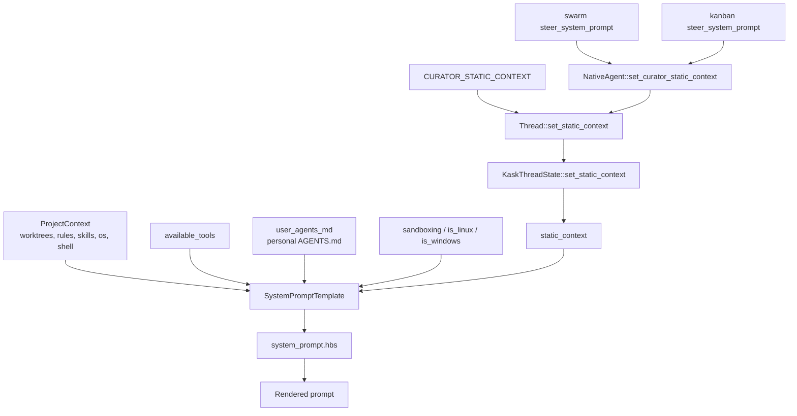

This document consolidates the two surfaces that instruct the zed-kask agent:
the system prompt (base template + three overlays, and its divergences from
upstream Zed) and the skill system (SKILL.md body injection, composition
principles, testing). Formerly two documents — `AGENT_SYSTEM_PROMPT.md` and
`explanation/skills-and-composition.md` — folded 2026-08-28 during the docs
condensation; git history preserves the originals.

# Part I — The Agent System Prompt

> **Scope:** the agent system prompt only. Verified against zed-kask `HEAD`
> (`47e1c3b1d5`) and upstream Zed `upstream/main` (`6bd93fc319`). Every claim
> here is traceable to a `file:line` or a named test.

## 1. Purpose

This document answers two questions an upstream rebase or a prompt edit has to
answer immediately: **what is the agent system prompt made of**, and **where does
zed-kask deviate from upstream Zed**. It exists because the prompt is a divergence
surface that `DIVERGENCE.md` covers only in passing — the base template is tracked
under D1/D2, but the three overlay prompts had no entry at all until 2026-08-12.

Treating a prompt as a versioned interface with an explicit change log follows
the same reasoning that motivates architecture decision records: the cost of a
change is dominated not by writing it but by later readers reconstructing why it
was made[^nygard-adr]. Prompts are especially prone to this because their
"behaviour" is unobservable from the artifact alone.

## 2. The four prompt surfaces

Upstream Zed renders **one** system prompt. zed-kask renders that same prompt
plus **three overlays**, all delivered through a single channel.

| # | Surface | Location | Size | Scope |
|---|---------|----------|------|-------|
| 1 | Base template | `crates/agent/src/templates/system_prompt.hbs` | 23,949 B / 313 lines | Every thread |
| 2 | Curator overlay | `crates/agent/src/curator_agent_server.rs:37-59` (`CURATOR_STATIC_CONTEXT`) | ~1.1 KB | Curator threads |
| 3 | Swarm Steer overlay | `crates/swarm_panel/src/swarm_panel.rs:126-299` (`steer_system_prompt`) | ~9.7 KB | Swarm panel, Steer mode |
| 4 | Kanban Steer overlay | `crates/kanban_panel/src/kanban_panel.rs:210-245` (`steer_system_prompt`) | ~2.2 KB | Kanban panel, Steer mode |

Upstream's base template is 19,815 B, so zed-kask carries **+4.1 KB** of
fork-specific instruction in the base plus up to ~9.7 KB more when an overlay is
active. The swarm overlay is the largest single instruction block in the system —
roughly 40 % of the base prompt's size.

Overlays are **appended, never substituted**: the Zed coding instructions remain
intact and the overlay adds role and scope on top. `CuratorAgentServer` documents
this explicitly (`curator_agent_server.rs:33-36`). Composing a specialisation onto
a stable base, rather than forking a second full prompt, is the open/closed
principle applied to instruction text — the base is extended without being
modified, so upstream changes to it keep flowing through[^martin-ocp].

## 3. Rendering pipeline

`SystemPromptTemplate` (`crates/agent/src/templates.rs:36-65`) is the Handlebars
render context; `TEMPLATE_NAME` pins it to `system_prompt.hbs` (`:67-69`).



<!-- DIAGRAM_ALIGNMENT
id: DIAG-PROMPT-001
verified_date: 2026-08-26
verified_against: crates/agent/src/templates.rs:36-69 (SystemPromptTemplate, TEMPLATE_NAME), crates/agent/src/thread.rs (Thread::set_static_context → KaskThreadState::set_static_context), crates/agent/src/kask_thread_state.rs (KaskThreadState::static_context, set_static_context)
status: VERIFIED
-->

The overlay path is the load-bearing detail: **all three overlays converge on
the single `agent_static_context` field** (on `KaskThreadState`, accessed via
`thread.kask.static_context()`), so a defect in that one field disables all
three at once. That is exactly what happened (§5.1).

### 3.1 Conditional sections

The prompt is not a static string. Sections appear or vanish based on the render
context, so the model is never told about a capability it does not have — an
application of the principle that an interface should not advertise operations it
cannot honour[^parnas-1972].

| Guard | Line | Effect when false |
|-------|------|-------------------|
| `(gt (len available_tools) 0)` | `:34` | Entire tool-use half is replaced by a no-tools instruction (`:139-145`) |
| `(contains available_tools 'grep')` | `:63` | Drops the grep/find_path search guidance |
| `(contains available_tools 'spawn_agent')` | `:117` | Drops `## Multi-agent delegation` |
| `sandboxing` + `(contains available_tools 'terminal')` | `:159-160` | Drops `## Terminal sandbox` entirely |
| `is_linux` / `is_windows` | `:166`, `:173`, `:190` | Selects the platform-correct writable-temp and network story |
| `model_name` | `:217` | Drops `## Model Information` |
| `has_skills` | `:223` | Drops `## Agent Skills` and the `<available_skills>` catalog |
| `(or user_agents_md has_rules)` | `:271` | Drops `## User's Custom Instructions` |
| `static_context` | `:305` | Drops `## Session Context` |

## 4. Section inventory

Section headings are **identical to upstream** except for two additions. The
divergence is in section *contents*, not structure.

*Scope-exempt from the Sourced-Ideas Mandate: this section is a traceability
matrix over §5's divergences and the template's own headings; it decides nothing.*

| Section | Line | Status vs. upstream |
|---------|------|---------------------|
| Communication | `:3` | Identical |
| Formatting Responses | `:13` | **Modified** (§5.3) |
| Tool Use | `:35` | **Modified** (§5.4) |
| Task Execution | `:49` | **Modified** (§5.2) |
| Searching and Reading | `:56` | Identical |
| Making Code Changes | `:69` | Identical |
| Ambition vs. Precision | `:82` | Identical |
| Validation | `:88` | Identical |
| Fixing Diagnostics | `:96` | Identical |
| Debugging | `:101` | Identical |
| Calling External APIs | `:110` | Identical |
| Multi-agent delegation | `:118` | Identical |
| Final Message | `:133` | Identical |
| System Information | `:147` | Identical |
| Terminal sandbox | `:161` | Identical |
| Model Information | `:218` | Identical |
| Agent Skills | `:224` | **Rewritten** (§5.5) |
| → Multi-skill composition with `skill_bundle` | `:255` | **New section** (§5.6) |
| User's Custom Instructions | `:272` | Identical |
| → Personal `AGENTS.md` | `:277` | Identical |
| → Project Rules | `:287` | Identical |
| Session Context | `:305` | **New section** (§5.1) |

## 5. Divergences from upstream

`git diff upstream/main -- crates/agent/src/templates/system_prompt.hbs` reports
**40 insertions, 6 deletions across 5 hunks**. Each is catalogued below with its
D-seam and its pinning test. Every zed-kask deviation that disables or replaces
upstream behaviour carries a test, per the repo's divergence rule.

### 5.1 `## Session Context` — new section (D2 / D6)

- **zed-kask** renders `{{{static_context}}}`. Field declared at
  `templates.rs:49`.
- **Upstream** has no such block and no `static_context` field.
- **Why:** it is the render target for agent overlays (Curator role, Steer
  panel prompts). Memory recall is per-turn via `inject_context`
  (`Role::System` message), not via this block.
- **Pinned by** `test_system_prompt_renders_session_context_without_rules_or_agents_md`.

**Defect fixed 2026-08-12 — the reason the test exists.** The block was
originally nested *inside* the `{{#if (or user_agents_md has_rules)}}` guard.
For any project with no `.rules` file **and** no personal `AGENTS.md`,
`static_context` rendered as nothing — silently dropping the Curator, swarm Steer,
and kanban Steer prompts. It went unnoticed because this repo has a `.rules` file
(making `has_rules` true) and because all eleven pre-existing template tests
passed `static_context: None`. The block is now a **sibling** of that guard. This
is the class of failure that motivates asserting on observable behaviour rather
than on the presence of code: the overlay existed, was wired, and never
arrived[^hunt-thomas-1999].

**Refactored 2026-08-25 — `inject_static_context` deleted.** The
`ContextInjector::inject_static_context` method and `Thread.static_context` /
`static_context_loaded` fields were removed. Tool-use warnings moved into the
`system_prompt.hbs` template as an unconditional `## Tool failure-mode warnings
(kask)` section. Thread-scoped memory recall (`recall_thread` /
`recall_thread_curator`) was folded into the per-turn `inject_context` path so
memory is fresh at decision time rather than snapshotted once per session. The
`## Session Context` block now carries only agent overlays (Curator role + Steer
prompts). Pinned by `test_system_prompt_contains_tool_failure_mode_warnings`.

### 5.2 Loop-termination guardrail — new bullet

- **zed-kask** `:54`: *"If a tool loop repeats without measurable progress (the
  same error recurring or no new state appearing) **three times**, stop, summarize
  what you tried, and ask the user rather than continuing indefinitely."*
- **Upstream** `## Task Execution` ends at its `:51` with no loop bound.
- **Why:** upstream pairs a strong autonomy injunction (`:51-52`, "keep going
  until… completely resolved") with no termination signal. A control loop with no
  bound on corrective action is an unregulated loop; the bound is what makes the
  autonomy safe rather than open-ended[^ashby-1956]. The threshold is a concrete
  count deliberately — "several iterations" left the stop point to model
  discretion, which varied by model.
- **Pinned by** `test_system_prompt_contains_loop_termination_guardrail`, which
  asserts both the sentence and the literal `three times`.

### 5.3 Mermaid diagram-type list (D18)

- **zed-kask** `:26` names the exact directives the renderer accepts —
  `sankey-beta`, `xychart-beta`, `architecture-beta`, `radar-beta`, `treemap`,
  `block`, `kanban` — and separately notes that ` ```graph `, ` ```media `,
  ` ```portfolio `, ` ```scenarios ` fenced blocks are kask viz widgets, not
  mermaid.
- **Upstream** `:26` lists only its thirteen core types.
- **Why:** the renderer's allowlist is `crates/markdown/src/mermaid.rs:428-451`,
  whose comment asked for manual sync with the prompt — and drifted anyway. The
  prompt had advertised bare `sankey`/`xychart`, which the renderer silently
  drops, while denying `kanban` was a mermaid type at all (it is; `mermaid.rs:445`).
- **Pinned by** `test_system_prompt_advertises_every_supported_diagram_type`
  (`mermaid.rs:1252`) — an exhaustive prompt-vs-allowlist check living next to
  the constant, replacing the manual-sync comment. Also
  `test_system_prompt_mermaid_list_uses_renderer_directives` in `templates.rs`.

**Note on `kanban`:** it is *both* a valid mermaid directive *and* a viz-widget
fenced tag. The prompt must disambiguate the two, not deny either.

### 5.4 Media display-hint bullets (D18)

- **zed-kask** `:46-47`: copy the ` ```media ` block from a `display_hint` /
  `display_hints` tool-result field verbatim into the reply.
- **Upstream** has neither bullet.
- **Why load-bearing:** the media block *renderer* lives in
  `hkask_viz_core::block_renderer()` (wired at
  `crates/agent_ui/src/conversation_view.rs:3516`), so the prompt bullets
  remain live for any tool that emits the ` ```media ` fenced block.

### 5.5 `## Agent Skills` — body injection (D1)

This is the largest behavioural divergence in the prompt.

| | Upstream | zed-kask |
|---|---|---|
| What `skill` returns | "the full instructions" (`upstream:223`) | the SKILL.md body, injected via `render_skill_envelope` (`:228`) |
| Model's job | "Follow the instructions in the Skill" (`upstream:244`) | read the injected body and follow it (`:253`) |
| `SKILL.md` body | read it; `read_file` referenced files (`upstream:245`) | **never** read it via `read_file`; `read_file` refuses (`:250`) |

Upstream's step 4 instructs precisely the behaviour zed-kask's `:250` prohibits.
`SKILL.md` in zed-kask is a discovery-only catalog entry; the body is injected via
`render_skill_envelope` when the `skill` tool is invoked — not read via `read_file`.

**This is the progressive disclosure pattern.** Anthropic's Agent Skills use *progressive
disclosure*: only `name` and `description` are preloaded into the system prompt, and
the `SKILL.md` body loads only when judged relevant[^anthropic-skills]. zed-kask
keeps the catalog-in-prompt half and injects the body via the `skill` tool when the
model invokes it. Skill execution is upstream-Zed body injection via `SkillTool::run`
(`crates/agent/src/tools/skill_tool.rs:266`).

**The cost of being one step ahead** is that the model's trained prior — every
other major agent system loads skill bodies as prose — actively pushes against the
invariant. Prompt text alone could not hold it, which is why the prohibition is
now backed by a runtime gate:

- `refuse_skill_catalog_read` (`crates/agent/src/tools/read_file_tool.rs`) returns
  a tool error redirecting the model to the `skill` tool, wired into **both** the
  global-skills fast path and the project-path path.
- Resource files *inside* a skill directory stay readable, so a cascade result can
  legitimately point at a template or reference.
- Blocked attempts log `skill.catalog_read_blocked`. That key is deliberately
  **not** in the `reg.skill.*` namespace, which is reserved for per-skill feedback
  spans and CI-enforced by `kask/scripts/check-skill-span-namespace.sh`.
- Pinned by `test_refuse_skill_catalog_read_redirects_to_skill_tool`,
  `test_refuse_skill_catalog_read_allows_skill_resources_and_other_files`,
  `test_read_file_refuses_global_skill_catalog_entry`, and
  `test_blocked_read_telemetry_key_avoids_reserved_skill_span_namespace`.

Installing the gate is what made it safe to trim ~400 B of justification prose
from this section while making the prohibition *stronger* — a statement of fact
("`read_file` refuses it") rather than a request. The general rule this yielded:
**when prose is the only enforcement of an invariant, the move is never "delete"
or "keep" — it is "install the gate, then delete."** This mirrors the finding that
runtime permission enforcement belongs outside the model's instructions, and that
vendors are explicit about where such enforcement does *not* apply[^augment-permissions].

`:251` retains the no-body fallback for skills with no `SKILL.md` file. It is
unreachable for shipped skills — 60 SKILL.md directories exist in `.agents/skills/`
— but still live for a user-authored skill with no body
(`skill_tool.rs:544`).

**Pinned by** `test_system_prompt_skills_section_describes_body_injection`,
which asserts on the *invariant* (a prohibition naming `read_file` and
`SKILL.md`, plus the enforcement claim) rather than one exact sentence, so prose
can be tightened without a false failure.

### 5.6 `skill_bundle` composition — new section (D1)

- **zed-kask** `:255-268` documents `skill_bundle`: use it once for **three or
  more peer-level skills**; use `skill` individually for one, two, or a delegation
  relationship. Output carries `<composition_score>` and `<bundle_manifest>`.
- **Upstream** has no such tool or section.

## 6. Divergence-free sections

Fourteen of the sixteen upstream `##` sections are byte-identical, including all
of `## Terminal sandbox` (`:161-215`) with its platform matrix. This is
deliberate: the fork's leverage is in skill execution and context injection, not
in re-litigating upstream's coding guidance. Keeping unrelated sections identical
is what makes `git merge upstream/main` tractable on this file — every additional
edited line is a future conflict.

*Scope-exempt from the Sourced-Ideas Mandate: this section decides nothing, it
records the absence of change relative to §4's inventory.*

## 7. Rebase procedure for this file

`system_prompt.hbs` is a **shared upstream file with zed-kask edits**, the
highest-conflict category in `DIVERGENCE.md`. The procedure below treats the
pinning tests as the executable record of intent: a merge that silently drops a
divergence fails a named test instead of shipping, which is the regression-test
discipline applied to a vendor-branch merge[^fowler-vendor-branch]. On upstream
sync:

1. Merge normally. Conflicts will land in the five hunks of §5.
2. Re-apply each §5 divergence. The pinning tests are the checklist — run
   `cargo test -p agent --lib templates::` (14 tests) and
   `cargo test -p markdown --lib mermaid` (21 tests). A dropped divergence fails a
   named test rather than silently reverting.
3. If upstream restructures `## Agent Skills`, treat §5.5 as a **re-application**,
   not a merge: the two versions state opposite instructions, so a textual merge
   can produce a prompt that both forbids and requires reading `SKILL.md`.
4. Check `mermaid.rs:428-451` against `:26` — upstream adds diagram types, and the
   drift test will fail until the prompt is updated.

## 8. Verification

Every claim above is checkable. Reproducible commands are given rather than
asserted results, so a reader can falsify this document rather than trust
it[^popper-1959].

```sh
# Structure and size
wc -c crates/agent/src/templates/system_prompt.hbs          # 23949
git show upstream/main:crates/agent/src/templates/system_prompt.hbs | wc -c  # 19815

# The complete divergence
git diff upstream/main -- crates/agent/src/templates/system_prompt.hbs

# The pinning tests
cargo test -p agent --lib templates::                        # 14 pass
cargo test -p agent --lib read_file_tool                     # 27 pass
cargo test -p markdown --lib mermaid                         # 21 pass

# The skill count (60 SKILL.md directories in .agents/skills/)
ls .agents/skills/ | wc -l                                    # 60
```

## References

[^nygard-adr]: Nygard, M. (2011). *Documenting architecture decisions*. https://cognitect.com/blog/2011/11/15/documenting-architecture-decisions.
    Cited for the practice of recording the *why* of a structural decision alongside the artifact; applied here to prompt divergences, which are otherwise unrecoverable from the template alone.

[^parnas-1972]: Parnas, D. L. (1972). On the criteria to be used in decomposing systems into modules. *Communications of the ACM*, 15(12), 1053–1058. https://doi.org/10.1145/361598.361623.
    Cited for information hiding: a module's interface should expose only what callers can act on. The conditional sections apply this to the prompt — the model is told about a tool or sandbox only when it actually has one.

[^ashby-1956]: Ashby, W. R. (1956). *An introduction to cybernetics*. Chapman & Hall. http://pespmc1.vub.ac.be/books/IntroCyb.pdf.
    Cited for regulation requiring a bounded corrective response; the loop-termination guardrail is the bound on an otherwise open-ended autonomy injunction.

[^anthropic-skills]: Anthropic. (2025). *Equipping agents for the real world with Agent Skills*. https://www.anthropic.com/engineering/equipping-agents-for-the-real-world-with-agent-skills.
    Cited for progressive disclosure (name + description preloaded, body loaded on relevance). zed-kask's body injection is this pattern with the body-loading step replaced rather than removed.

[^augment-permissions]: Augment Code. (2025). *Tool permissions*. https://docs.augmentcode.com/cli/permissions.
    Cited for runtime tool-permission enforcement applied per tool call, and for the explicit statement that it is "not enforced in the Augment code extension" — the precedent for backing a prompt-stated invariant with a runtime gate rather than prose.

[^hunt-thomas-1999]: Hunt, A., & Thomas, D. (1999). *The pragmatic programmer: From journeyman to master*. Addison-Wesley.
    Cited for the discipline of testing observable behaviour over implementation presence; §5.1's defect was wired code that produced no output, invisible to every existing test.

[^martin-ocp]: Martin, R. C. (1996). The open-closed principle. *C++ Report*, 8(1). https://web.archive.org/web/20150905081105/http://www.objectmentor.com/resources/articles/ocp.pdf.
    Cited for extension without modification. The overlay channel specialises the base prompt without editing it, which is what keeps upstream's base changes mergeable.

[^fowler-vendor-branch]: Fowler, M. (2020). *Patterns for managing source code branches: Vendor branch*. https://martinfowler.com/articles/branching-patterns.html#vendor-branch.
    Cited for the vendor-branch pattern and the practice of making local deviations from an upstream baseline explicit and re-applicable; §7's per-divergence pinning tests are the mechanical form of that record.

[^popper-1959]: Popper, K. (1959). *The logic of scientific discovery*. Hutchinson. https://doi.org/10.4324/9780203994627.
    Cited for falsifiability as the test of a claim's content. §8 gives commands that can refute this document's assertions rather than restating them as conclusions.


# Part II — Skills and Composition

# Skills and Composition

Design, invoke, audit, and compose hKask skills. Skills execute via **upstream Zed body injection**: `SkillTool::run` (`crates/agent/src/tools/skill_tool.rs:266`) reads the `SKILL.md` body from disk and injects it into the agent's context via `render_skill_envelope`. The model reads the body and follows the instructions. The agent is the executor.[^anthropic-skills]

This guide also covers building MCP servers that provide tool surfaces for skills and agents — in zed-kask, MCP servers register as builtins inside the editor and are launched as child processes over stdio by zed's `context_server` host (D3); the standalone `kask mcp start <id>` CLI is deleted.

---

## Skill Anatomy

A skill is a directory under `.agents/skills/<name>/` (repo root, not under `kask/`) containing a `SKILL.md` file:

```
.agents/skills/my-skill/
└── SKILL.md          ← YAML frontmatter + markdown body (process instructions)
```

- **`SKILL.md`** has YAML frontmatter (`name`, `description`, and optional metadata) and a markdown body. The body is the process instructions the model reads and follows when the skill is invoked. This is the source of truth — there is no derived manifest.
- **Template crates** under `kask/registry/templates/<name>/` are optional companion resources. A skill body may instruct the model to call the `render_template` tool to render a Jinja2 template from a template crate. The template crate is not required for skill execution — it is a resource the skill body may reference.

### The Body-Injection Model

When the agent invokes the `skill` tool with a skill name:

1. `SkillTool::run` (`crates/agent/src/tools/skill_tool.rs:172`) receives the skill name from `SkillToolInput`.
2. It resolves the skill directory and reads the `SKILL.md` body from disk.
3. It calls `render_skill_envelope(&skill, &body)` (`skill_tool.rs:47`), which wraps the body in a structured envelope.
4. The envelope is returned to the agent as the tool result (`SkillToolOutput::Found { rendered }`).
5. The agent reads the envelope content (the skill body) and follows the instructions — calling `lisp_eval` for deterministic computation, `render_template` for structured prompt scaffolding, and MCP tools for external capabilities.

The model is the executor. Convergence is the model's judgment, optionally checked by `lisp_eval` when the skill body instructs it.

### Two Supporting Tools

| Tool | Location | Purpose |
|------|----------|---------|
| `lisp_eval` | `crates/agent/src/tools/lisp_eval_tool.rs` | Sandboxed Lisp interpreter (`hkask_lisp::eval_sandboxed_with_budget`). No I/O, no `eval`, no network. Bounded by `max_steps` (default 100000) and `max_depth` (default 64). The model calls it when a SKILL.md instructs deterministic computation (convergence signals, invariant checks, scoring). |
| `render_template` | `crates/agent/src/tools/render_template_tool.rs` | Renders Jinja2 templates from `kask/registry/templates/` using `minijinja`. Strips YAML frontmatter. Path traversal protection via `canonicalize` + `starts_with` check. Template base path wired via `agent::set_template_base_path()` (OnceLock) in `crates/zed/src/main.rs:776`. |

### PDCA Loops Are Model-Coordinated

A skill body may describe a PDCA (Plan-Do-Check-Act) loop with convergence criteria. The model self-iterates: it reads the instructions, performs the plan step, calls `lisp_eval` to check convergence, and loops until the convergence criterion is met or the model judges the task complete. There is no runtime that drives the loop — the SKILL.md body describes the convergence criteria; the model coordinates the iteration using `lisp_eval` for deterministic checks and `render_template` for structured prompt scaffolding.

This is the "model-coordinated PDCA" pattern: the skill body is the process specification, the model is the executor, `lisp_eval` is the deterministic oracle, and `render_template` is the scaffolding tool.

---

## Listing and Checking Skills

Skill listing, status, and auditing are performed in-process through the zed-kask agent panel or the skill maintenance tooling. The former `kask skill list`, `kask skill status`, and `kask skill audit` standalone CLI commands have been removed.[^fagan-skill-audit]

### List Available Skills

Invoke the skill-listing surface from the agent panel. The output shows the skill directory layout with name, description, and namespace:

```
  .agents/skills/:
    coding-guidelines     description="Enforce Karpathy's four coding principles"
    diagnose              description="Disciplined diagnosis loop"
    ...
```

### Skill Auditing

Run a dual-layer audit to check skill health through the skill maintenance tooling or agent panel. The audit checks:
- `SKILL.md` presence and frontmatter validity
- Template crate existence (if the skill body references `render_template`)
- Content consistency between SKILL.md and any companion template crates

---

## Designing a Skill

### Writing a `SKILL.md`

Create `.agents/skills/my-skill/SKILL.md`:

```markdown
---
name: my-skill
description: A custom skill for automated code review
---

# My Skill

This skill performs an automated code review using a PDCA cycle:
- **Plan:** Analyze the code structure and identify review targets
- **Do:** Execute the review using available tools
- **Check:** Validate findings against quality criteria (use `lisp_eval` to check invariants)
- **Act:** Produce a review report with recommendations

## When to Use

Use this skill when reviewing Rust code for idiomatic patterns and correctness.

## Process

1. Read the target file(s) using `read_file`.
2. Identify review targets (functions, types, modules).
3. For each target, check against the criteria below.
4. Use `lisp_eval` to verify structural invariants (e.g., function count, complexity thresholds).
5. Produce a structured report with findings and recommendations.

## Convergence

The skill is complete when all identified targets have been reviewed and the `lisp_eval` invariant check passes.
```

The `description` field in the frontmatter is what the agent sees in the skill catalog (preloaded into the system prompt). The body is injected only when the skill is invoked — this is progressive disclosure.[^anthropic-skills]

### Writing Templates (`.j2` Files)

Templates are optional Jinja2 files rendered with context variables at invocation time via the `render_template` tool. A skill body may instruct the model to call `render_template` with a template path and context variables:

```jinja2
{# registry/templates/my-skill/plan.j2 #}
You are executing the "my-skill" skill. This is the PLAN phase.

Context: {{ context }}

Based on the context above, develop a structured plan for achieving the goal.
Consider:
1. What information is needed
2. What tools should be used
3. What intermediate outputs are required

Return your plan as a numbered list.
```

The model calls `render_template(template_path="my-skill/plan.j2", context={...})` and receives the rendered text. The template crate at `kask/registry/templates/my-skill/` is the companion resource; the `SKILL.md` body is the source of truth for the skill's process.

### Context Variables

The `render_template` tool accepts a `context` map. The skill body instructs the model on what variables to pass. There are no automatically-injected context variables — the model constructs the context from its current state and prior tool results.

---

## Testing a Skill Locally

### Step 1: Verify Discovery

List skills through the agent panel. Your skill should appear in the list.

### Step 2: Invoke from the Agent Panel

Open the zed-kask agent panel and invoke the skill:

```
/skill my-skill "Review the authentication module in src/auth.rs"
```

The agent panel routes this through `SkillTool::run` (D1), which:
1. Resolves the skill directory
2. Reads the `SKILL.md` body
3. Calls `render_skill_envelope(&skill, &body)` (`skill_tool.rs:47`)
4. Returns the envelope to the agent
5. The agent reads the body and follows the instructions

---

## Invoking Skills

Skills are invoked in-process through `SkillTool::run` (`crates/agent/src/tools/skill_tool.rs:172`), which reads the `SKILL.md` body and injects it via `render_skill_envelope`.[^mcp-spec-skill-invoke]

### Via the Agent Panel

Open the zed-kask agent panel and invoke a skill:

```
/skill diagnose "My application crashes on startup"
```

The agent panel routes this through the `skill` tool, which calls `SkillTool::run` directly in-process.

### What Happens During Execution

When a skill is invoked in-process:

1. **Lookup** — The skill name is resolved against the loaded skill catalog (from `agent_skills`). The `SkillTool` reads the `SKILL.md` body from disk.
2. **Envelope rendering** — `render_skill_envelope(&skill, &body)` (`skill_tool.rs:47`) wraps the body in a structured envelope.
3. **Return to agent** — The envelope is returned as `SkillToolOutput::Found { rendered }` (`skill_tool.rs:268`).
4. **Agent follows instructions** — The agent reads the envelope content (the skill body) and follows the instructions — calling `lisp_eval` for deterministic computation, `render_template` for structured prompt scaffolding, and MCP tools for external capabilities.
5. **Regulation span** — `reg.tool.skill_execute` is emitted with the skill ID and result.

### Convergence (Model-Coordinated)

A skill body may describe convergence criteria. The model self-iterates:
1. Performs the plan step (may call `render_template` for scaffolding)
2. Performs the do step (may call MCP tools)
3. Performs the check step (may call `lisp_eval` for deterministic invariant checks)
4. If convergence is not reached, loops back to plan with refined context
5. If convergence is reached, produces the final output

The convergence signal is typically produced by a `lisp_eval` call that deterministically computes a gap score from the model's output. The model reads the score and decides whether to iterate.

### Composition Principles for Skill Design

Five principles discovered through the co-evolution of skills and MCP tools. Apply these when designing the process instructions in a SKILL.md body.

#### 1. The Determinism Frontier

Every skill has a boundary between deterministic steps (output fully determined by inputs) and probabilistic steps (LLM exercises judgment). Push as much work as possible to the deterministic side.

- Use `lisp_eval` for math, invariant checks, convergence signals.
- Use MCP tool calls (via the agent's tool-use loop) for data retrieval with deterministic inputs.
- Use LLM judgment only for steps that require synthesis, reasoning, classification, or prediction.

The test: "Could a deterministic function produce this output from these inputs?" If yes, it should be `lisp_eval` or a direct tool call, not LLM judgment.

#### 2. Persistence-Grounded Learning

Every skill that produces forecasts, analyses, or recommendations should read its own prior outputs from MCP persistence before starting. This closes the feedback loop: the skill's current invocation is informed by its past performance.

The pattern: the skill body instructs the model to call the relevant MCP tool (e.g., `scenario_calibration`) at the start of the process to read prior runs, then thread the results into the first reasoning step.

#### 3. Failure Surfacing

Every MCP tool call the skill instructs should have a failure path. The skill body should instruct the model to report failures to the Curator (via `curator_report_skill_use_issue`) before escalating. Without this, a failed tool call silently propagates and the operator sees no context.

#### 4. The Lisp Scaffold Pattern

When an LLM step produces structured output with invariant properties (count, completeness, diversity, mutual exclusivity), follow it with a `lisp_eval` call that checks those invariants deterministically. The Lisp step's output (defect list or gap score) feeds the convergence signal.

Pattern: LLM generates → `lisp_eval` checks → LLM repairs (on next iteration).

#### 5. The Co-Evolution Loop

Skills and MCP tools evolve together. Skills reveal MCP tool design issues (missing inputs, confusing schemas) via failure reports. The Curator reads skill-use reports and issues `EvolveMcpToolSchema` directives. MCP tools gain new capabilities that skills should adopt.

The three co-evolution feedback loops are described in the Co-Evolution Loop principle above.

### Gas Consumption

Skill execution is bounded by the **per-agent call cap** (System A): every governed MCP tool call via `McpRuntime::invoke` charges one call against the agent's `CallCap` (`CallCapManager::charge_metered` → `CallMeterOutcome`). The cap resets to its ceiling each regulation tick. An agent with no registered cap is **auto-registered** at `DEFAULT_RUNAWAY_CALL_CEILING` (10 000) and the wiring gap is logged — a missing seed is a wiring omission, not an authorization decision (RR-0057).

Tool-call bounding is the per-agent `CallCap`.

Cost consumption is observable via Regulation spans. Query the in-process Regulation span surface (agent panel) and look for `reg.tool.invoked` (pre-invocation) and `reg.tool.completed` (post-invocation).

### Error Handling

| Error | Cause | Resolution |
|-------|-------|------------|
| `Skill 'X' not found` | Skill name not in the loaded catalog | List skills through the agent panel to see available names; ensure zed-kask was launched from the project root containing `.agents/skills/` |
| `Inference failed` | Inference port error | Check inference backend configuration via zed-kask's `CredentialsProvider` (D9); ensure the provider API key is set |
| `lisp_eval` error | Lisp evaluation exceeded budget or depth | Check the Lisp form for infinite recursion or excessive steps; increase `max_steps` if needed |
| `render_template` error | Template not found or Jinja2 syntax error | Verify the template path exists under `kask/registry/templates/`; validate Jinja2 syntax |

---

## Composing Skill Bundles

Bundle composition is driven by the **skill-bundler** skill. The former `BundleService` in the deleted `hkask-services-skill` crate and the `kask bundle compose/list/show/apply/evolve/skills/off` CLI commands have been removed.[^ousterhout-bundle]

### Creating a Bundle

Invoke the skill-bundler skill from the agent panel with the skills to compose:

```
skill: skill-bundler
skills: coding-guidelines,idiomatic-rust
name: rust-review-bundle
```

The skill-bundler performs inference-driven analysis to produce a coordinated composition.

### Bundle Management

Bundle management (list, show, apply, evolve) is performed in-process through the agent panel. The former `kask bundle list/show/apply/evolve/skills/off` CLI commands have been removed. Bundles are session-scoped: applying a bundle activates its composition for the current agent session; deactivating is a no-op since bundles do not persist beyond the session.

---

## Skill Routing and Discovery

Two meta-skills govern how tasks find the right skills: **skill-router** matches tasks to installed skills, and **skill-discovery** acquires new skills when gaps are found. They compose in a feedback loop.[^beer-feedback-loop]

### How It Works

```
task-breakdown (decompose)
  → emits skill_match_query per slice
    → skill-router (match)
      → full coverage → ranked recommendations with invocation hints
      → partial/none → uncovered_capabilities
        → skill-discovery (detect-gap → search → evaluate → install)
          → new skill installed → catalog grows → router has better coverage
```

### skill-router

Given a task description and the installed skill catalog, skill-router scores each skill 0.0–1.0 on three dimensions:

| Dimension | Weight | What it measures |
|-----------|--------|------------------|
| Capability overlap | 0.50 | Does the skill description cover the task core need? |
| Lexicon alignment | 0.25 | Do task verbs/nouns overlap with the skill's lexicon terms? |
| Trigger alignment | 0.25 | Does the task match the skill When-to-Use conditions? |

Coverage assessment: **full** (fit >= 0.80), **partial** (0.40-0.79), **none** (< 0.40). Partial/none emits `uncovered_capabilities` as gap signals for skill-discovery.

### skill-discovery

Four-phase pipeline: **detect-gap** (classify gaps: coverage, feature, automation, knowledge, governance, quality) → **search** (rank catalog candidates by fit) → **evaluate** (score format/quality/safety) → **convergence-check** (is the gap resolved?).

### Regulation Spans

| Span | When emitted |
|------|-------------|
| `reg.skill.routing.matched` | skill-router produces a ranked recommendation |
| `reg.skill.routing.uncovered` | skill-router finds no matching skill (gap signal) |
| `reg.skill.discovery.gap_detected` | skill-discovery classifies a capability gap |
| `reg.skill.discovery.searched` | skill-discovery searches the catalog for candidates |
| `reg.skill.discovery.evaluated` | skill-discovery scores a candidate skill |

---

## Building MCP Servers

zed-kask hosts 10 MCP servers as child processes over stdio via zed's `context_server` host (companies, corpus, curator, kata-kanban, portfolio, prediction-markets, research, scenarios, swarm, training). Every server follows the same bootstrap pattern defined in `hkask-mcp-server`. In zed-kask, MCP servers register as built-in context servers inside the editor (D1–D3): the `context_server` host launches them as child processes over stdio, and servers run standalone with identity from `ServerContext.webid` (resolved from `HKASK_WEBID`) — there is no `KaskCore` singleton (the composition root wires individual components directly; see `zed-host-architecture-plan.md` §13.3). The former `kask mcp start <id>` CLI and the old per-crate `BUILTIN_SERVERS` tuple registry have been superseded by in-process registration against the canonical `kask_bridge::BUILT_IN_MCP_SERVERS` list.[^mcp-spec-build][^ousterhout-mcp-build]

### Prerequisites

- zed-kask source tree with `crates/hkask-mcp-server/` built
- A new crate under `mcp-servers/` named `<your-mcp-package>`
- Familiarity with the `rmcp` crate (the MCP protocol library hKask uses)

Add to your new crate's `Cargo.toml`:

```toml
[dependencies]
hkask-mcp-server = { path = "../../crates/hkask-mcp-server" }
hkask-types = { path = "../../crates/hkask-types" }
hkask-inference = { path = "../../crates/hkask-inference" }  # if you need inference
rmcp = { workspace = true }
serde = { workspace = true }
serde_json = { workspace = true }
tokio = { workspace = true }
tracing = { workspace = true }
```

### Step 1: Define the Server Struct

Use the `mcp_server!` macro from `hkask-mcp-server`. It generates the struct with a mandatory `webid` field plus your domain-specific fields, along with a `new()` constructor and a `ToolContext` implementation.

```rust
// mcp-servers/<your-mcp-package>/src/lib.rs

use hkask_mcp_server::mcp_server;
use std::sync::Arc;
use hkask_types::InferencePort;

mcp_server! {
    /// Example MCP server — demonstrates the bootstrap pattern.
    pub struct ExampleServer {
        /// Optional inference port for LLM calls.
        inference_port: Option<Arc<dyn InferencePort>>,
        /// Your domain-specific state.
        items: std::collections::HashMap<String, String>,
    }
}
```

### Step 2: Define Tool Methods

Annotate methods with `#[tool(description = "...")]` and use `execute_tool` for Regulation span emission:

```rust
use hkask_mcp_server::server::execute_tool;
use rmcp::tool;

#[tool(description = "Liveness check")]
async fn example_ping(&self) -> String {
    execute_tool(self, "example_ping", async {
        Ok(serde_json::json!({
            "status": "ok",
            "server": "example",
        }))
    }).await
}
```

### Step 3: Apply the `tool_router` Macro

Use rmcp's `#[tool_router(server_handler)]` attribute on the `impl` block that contains your `#[tool]`-annotated methods.

```rust
use rmcp::tool_router;

#[tool_router(server_handler)]
impl ExampleServer {
    #[tool(description = "Liveness check")]
    pub async fn example_ping(&self) -> String {
        execute_tool(self, "example_ping", async {
            Ok(serde_json::json!({"status": "ok", "server": "example"}))
        }).await
    }
}
```

### Step 4: Write the `run()` Function

Every hKask MCP server has a `run()` function that calls `run_server()` with a factory closure:

```rust
use hkask_mcp_server::{McpError, run_server, ServerContext};

pub async fn run() -> Result<(), McpError> {
    run_server(
        "example",
        env!("CARGO_PKG_VERSION"),
        |ctx: ServerContext| {
            let server = ExampleServer::new(
                ctx.webid,
                /* your custom fields */
            );
            Ok(server)
        },
        vec![],  // CredentialRequirements
    ).await
}
```

### Step 5: Write the Binary Entry Point

```rust
// mcp-servers/<your-mcp-package>/src/main.rs

#[tokio::main]
async fn main() -> Result<(), hkask_mcp_server::McpError> {
    hkask_mcp_example::run().await
}
```

### Step 6: Register as an In-Process Builtin

Add your server to the canonical registry in `crates/kask_bridge/src/mcp_servers.rs` so zed-kask's in-process transport can discover and load it:

```rust
pub const BUILT_IN_MCP_SERVERS: &[BuiltinMcpServer] = &[
    // ... existing entries ...
    BuiltinMcpServer {
        id: "example",
        binary: "<your-mcp-package>",
        description: "Example — what it does",
    },   // ← add this entry
];
```

### Testing the Server

Manual test (stdio, for development):

```bash
cargo build -p <your-mcp-package>
HKASK_WEBID=<webid-uuid> cargo run -p <your-mcp-package>
```

In-process test (production path): launch zed-kask and verify the server appears in the agent panel tool list.

### Common Pitfalls

| Pitfall | Fix |
|---------|-----|
| Missing `#[tool]` attribute | Every public async method that should be an MCP tool must have `#[tool(description = "...")]` |
| Duplicate `ToolContext` impl | `mcp_server!` already calls `impl_tool_context!` — do not duplicate it |
| No Regulation spans emitted | Always wrap tool logic in `execute_tool(self, "tool_name", async { ... }).await` |
| Server starts as `"anonymous"` | Set `HKASK_WEBID` before starting (the server reads it at startup and falls back to anonymous if unset) |
| Server not loaded by zed-kask | Add a `BuiltinMcpServer { id, binary, description }` entry to `BUILT_IN_MCP_SERVERS` in `crates/kask_bridge/src/mcp_servers.rs` |
| Tool name conflicts | Tool names are global across all MCP servers. Use a prefix convention (e.g., `example_ping`) |

---

## Common Skill Pitfalls

### Skill Not Found in Agent Panel

**Symptom:** `/skill my-skill` says "Skill 'my-skill' not found."

**Fix:** Ensure zed-kask was launched from the project root containing `.agents/skills/`. Skills are loaded from the `.agents/skills/` directory at the project root.

### Template Rendering Fails

**Symptom:** `render_template` returns an error.

**Fix:** Validate Jinja2 syntax in all `.j2` files. Ensure the template path exists under `kask/registry/templates/`. Verify the template base path is wired (check `agent::set_template_base_path` in `crates/zed/src/main.rs`).

### Lisp Eval Errors

**Symptom:** `lisp_eval` returns an error.

**Fix:** Check the Lisp form for infinite recursion or excessive steps. The interpreter is bounded by `max_steps` (default 100000) and `max_depth` (default 64). Simplify the form or increase the budget if needed.

---

## Related

- [zed-kask Host Architecture Plan](../architecture/zed-host-architecture-plan.md) — D1 (skill execution), D2 (Curator agent), D3 (MCP tool transport — child processes over stdio)
- [Regulation Explanation](../diataxis/hkask-regulation/explanation.md) — Regulation spans emitted by skill execution

---

## Footnotes

[^anthropic-skills]: Anthropic. (2025). *Equipping agents for the real world with Agent Skills*. https://www.anthropic.com/engineering/equipping-agents-for-the-real-world-with-agent-skills
    Cited for progressive disclosure (name + description preloaded, body loaded on relevance). zed-kask's body-injection model is this pattern: the catalog is preloaded, the body is injected on invocation.

[^fagan-skill-audit]: Fagan, M. E. (1976). Design and code inspections to reduce errors in program development. *IBM Systems Journal*, 15(3), 182–211. https://doi.org/10.1147/sj.153.0182
    Cited for the inspection-based audit methodology the skill audit applies to SKILL.md and template consistency.

[^mcp-spec-skill-invoke]: Anthropic. (2024). *Model Context Protocol Specification*. Anthropic PBC. https://modelcontextprotocol.io/specification
    Cited for the MCP protocol that skill execution uses for tool invocation.

[^ousterhout-bundle]: Ousterhout, J. (2018). *A Philosophy of Software Design*. Yakny Press.
    Cited for the module-composition discipline the skill-bundler applies when ordering skills into phases.

[^beer-feedback-loop]: Beer, S. (1979). *The Heart of Enterprise*. John Wiley & Sons.
    Cited for the cybernetic feedback-loop design the skill-router/skill-discovery pair implements.

[^mcp-spec-build]: Anthropic. (2024). *Model Context Protocol Specification*. Anthropic PBC. https://modelcontextprotocol.io/specification
    Cited for the MCP protocol every builtin MCP server follows.

[^ousterhout-mcp-build]: Ousterhout, J. (2018). *A Philosophy of Software Design*. Yakny Press.
    Cited for the deep-module principle that the composition root wires individual components directly instead of a `KaskCore` singleton.
