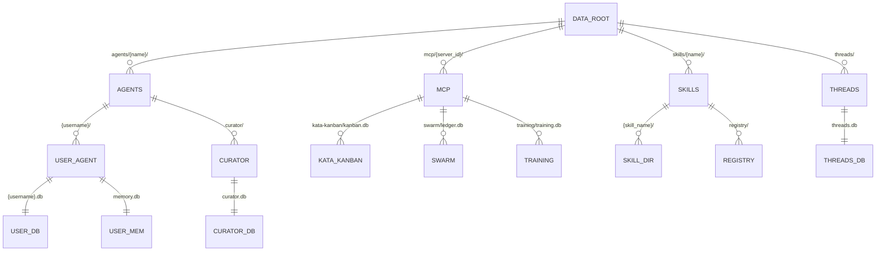

# Standardized Artifact Storage

> **Status:** Required. All persistent artifacts produced or consumed by
> zed-kask's built-in MCP servers, user skills, user agent files, and
> archived chat threads MUST conform to this layout.
>
> **Authority:** `kask/crates/hkask-types/src/agent_paths.rs` is the canonical
> path-primitive module. `resolve_data_dir()` and `resolve_under_data_dir()`
> are the only sanctioned resolvers.
>
> **D-seam:** D28 (archived-threads + skills relocation). See `DIVERGENCE.md`
> D28 and D1.
>
> **Related:** [`zed-host-architecture-plan.md`](zed-host-architecture-plan.md)
> §13 (the kask/ vs upstream-Zed invariant).

## 1. Root

All kask internal data (databases, traces, MCP state, skills, threads) lives under a single data root, resolved by
`hkask_types::agent_paths::resolve_data_dir()`
(`kask/crates/hkask-types/src/agent_paths.rs`):

| Precedence | Path (Linux) |
|---|---|
| 1 | `$HKASK_DATA_DIR` |
| 2 | `$XDG_DATA_HOME/zed-kask` |
| 3 | `$HOME/.local/share/zed-kask` |
| 4 | current working directory (fallback, warns) |

macOS: `~/Library/Application Support/zed-kask`. Windows: `%LOCALAPPDATA%\zed-kask`.

User-facing artifacts (reports, screens, exports, transaction files,
corpus cache files) are stored separately in a visible directory via
`resolve_artifacts_dir()`:

| Precedence | Path (Linux) |
|---|---|
| 1 | `$HKASK_ARTIFACTS_DIR` |
| 2 | `$XDG_DOCUMENTS_DIR/zk-data` |
| 3 | `$HOME/Documents/zk-data` |
| 4 | `$HOME/zk-data` (fallback) |

This separation keeps internal app data hidden (XDG convention) while making
user-facing output visible and intuitive. **The rule is fixed:** the hidden
internal data dir holds ONLY infrastructure — the databases. Every artifact
file and output an MCP server produces for the user (reports, screens,
transaction files, cache files, exports) lives under the visible artifacts
dir at `{server}-mcp/{artifact-type}/` (e.g. `companies-mcp/reports/`,
`portfolio-mcp/transactions/`, `corpus-mcp/cache/`), constructed via
`mcp_artifacts_subdir(server_id, artifact_type)` (`agent_paths.rs`) and
resolved via `resolve_under_artifacts_dir`.

This root is injected as `HKASK_DATA_DIR` into every MCP server child process
by `KaskSettings::mcp_env()`
(`kask/crates/kask_bridge/src/settings.rs:667`) so servers resolve paths
consistently regardless of launch context.

## 2. Artifact-class → path mapping

<!-- DIAGRAM_ALIGNMENT
id: DIAG-ARTIFACT-001
verified_date: 2026-08-28
verified_against: kask/crates/hkask-types/src/agent_paths.rs (resolve_data_dir :63, resolve_under_data_dir :99, agent_dir :157, agent_db :198, sanitize_name :209), kask/crates/kask_bridge/src/settings.rs:667 (mcp_env), kask/crates/kask_bridge/src/mcp_servers.rs:55 (BUILT_IN_MCP_SERVERS)
status: VERIFIED
-->

| Artifact class | Root | Subdir pattern | Naming rule | Programmatic contract |
|---|---|---|---|---|
| MCP servers | `{data_dir}` | `mcp/{server_id}/` | `server_id` matches `BUILT_IN_MCP_SERVERS[].id` (`kask/crates/kask_bridge/src/mcp_servers.rs:55`); files named `{purpose}.db` | `mcp_server_db(server_id, purpose)` (`agent_paths.rs:167`) or `mcp_server_subdir(server_id, subdir)` (`agent_paths.rs:182`) |
| User skills | `{data_dir}` | `skills/{skill_name}/` | `skill_name` sanitized via `sanitize_name()` (`agent_paths.rs:209-241`); files: `SKILL.md`, `*.j2` | `resolve_under_data_dir(Path::new("skills/{skill_name}/"))` |
| User agent files | `{data_dir}` | `agents/{agent_name}/` | `agent_name` via `sanitize_name()`; DB file is `{agent_name}.db` (e.g., `agents/curator/curator.db`); memory DB is `memory.db` | `agent_dir(name)` (`agent_paths.rs:157`) + `agent_db(name)` (`agent_paths.rs:198`) |
| Archived chat threads | `{data_dir}` | `threads/` | files: `threads.db` (SQLite) | `resolve_under_data_dir(Path::new("threads/threads.db"))` |

## 3. Ownership principle

An artifact lives under the class subdir of the entity that owns it.
Ownership is determined by: **which agent or MCP server produces and
consumes this artifact?**

### Agent model

The system has three agent classes:

1. **User agent** — the human user. Provisioned by `provision_agent`.
   Has `agents/{username}/` with `{username}.db` (sovereign DB) and
   `memory.db` (episodic + semantic memory). The user is the sovereign
   party — all kask artifacts ultimately serve the user's agency.

2. **Curator agent** — the system's cybernetic regulator. Hardcoded name
   `"curator"`. Has `agents/curator/curator.db` (memory + regulation +
   escalation). The curator is an in-process agent (`Agent::Curator`,
   D2) that escalates *to the user* rather than acting autonomously.

3. **Replica agents** — static memory built from a corpus of text
   materials using the corpus MCP server. Replicas are *not* provisioned
   agents — they have no `agents/` directory. Their memory DBs are
   opened from agent-provided paths (tool parameters), not from the
   `agents/` tree. If replicas gain a canonical home in the future, they
   would live under `mcp/corpus/replicas/{replica_name}/` (server-scoped,
   not agent-scoped), since the corpus server owns them.

The `agent_db(name)` function (`agent_paths.rs:198`) produces `{name}.db` — for the user, that's
`{username}.db`; for the curator, that's `curator.db`. The name always
matches the agent, making the DB identifiable at a glance. The function was
renamed from `agent_pod_db` in the 2026-08-27 cleanup (the "pod" concept was
deprecated; the rename is documented in the doc comment at `agent_paths.rs:193-197`).

### Ownership rules

- If the artifact is owned by an **agent** (user-scoped, identity-bound),
  it lives under `agents/{agent_name}/`.
- If the artifact is owned by an **MCP server** (server-scoped, not
  identity-bound), it lives under `mcp/{server_id}/`.
- If the artifact is owned by the **user** (not server-scoped, not
  agent-scoped — e.g., skills, chat threads), it lives under the flat
  class dir (`skills/`, `threads/`).

Within the owner's subtree, the naming rule is:
- `{purpose}.db` for SQLite databases
- `{purpose}.json` for JSON artifacts
- `{purpose}/` for directories of binary artifacts (e.g., `adapters/`,
  `cache/`, `transactions/`, `sources/`)

The `{purpose}` name must be human-readable and identify what the artifact
is for, not its format.

### Binary artifacts

Binary and file artifacts (transaction files, cached corpus text) are owned
by the MCP server that produces them. They are user-facing outputs and live
under the visible artifacts dir at `{server}-mcp/{artifact-type}/`:

| File artifact | Owner | Path |
|---|---|---|
| Portfolio transaction files | portfolio server | `portfolio-mcp/transactions/` (artifacts dir) |
| Corpus cache files | corpus server | `corpus-mcp/cache/` (artifacts dir) |
| Company research reports | companies server | `companies-mcp/reports/` (artifacts dir) |
| Company screens | companies server | `companies-mcp/screens/` (artifacts dir) |

LoRA adapter weights are hosted on HuggingFace (`AdapterSource::HuggingFace`);
only SQLite metadata is local (`mcp/training/training.db`).

### Agent DBs that MCP servers read

Some agent DBs are read by MCP servers (e.g., the curator's `curator.db`
is read by the curator MCP server). These are **agent artifacts** (owned
by the agent), not MCP-server artifacts. They stay under
`agents/{agent_name}/`. The MCP server reads them via an env-var override
(e.g., `HKASK_CURATOR_DB`) injected by `mcp_env()`, not by resolving
under `mcp/{server_id}/`.

## 4. Naming convention

- **Folders:** human-readable, kebab-case, sanitized via `sanitize_name()`
  (`agent_paths.rs:209-241`). An operator `ls {data_dir}/` sees the four
  class names: `agents/`, `mcp/`, `skills/`, `threads/`.
- **Files:** `{purpose}.db` for databases, `{artifact}.json` for JSON
  artifacts, `SKILL.md` / `*.j2` for skills. The filename
  identifies the artifact's purpose without reading its contents.
- **No opaque IDs at the browse level:** server IDs, tool names, skill names,
  and agent names are all human-readable strings, not UUIDs.

## 5. Shared-vs-parallel decision per class

| Class | Decision | Rationale |
|---|---|---|
| MCP servers | Parallel within class (`mcp/{server_id}/`) | Each server owns distinct DBs and credentials — per-entry `credentials`/`config_env` allowlists on `BUILT_IN_MCP_SERVERS` (`mcp_servers.rs:55-431`); server-ID segment enables browse-by-server. |
| User skills | Shared (flat `skills/{skill_name}/`) | Skills are user-owned, not server-scoped. The skill tool resolves them through the D28 `GLOBAL_SKILLS_DIR_OVERRIDE` hook (`crates/agent_skills/agent_skills.rs:962-972`); the swarm server receives its copy via `HKASK_SKILLS_DIR` (`kask/crates/kask_bridge/src/mcp_env.rs:306-307`). |
| User agent files | Shared (flat `agents/{agent_name}/`) | Agents are user-scoped, not server-scoped (`agent_paths.rs:157`). |
| Archived chat threads | Shared (flat `threads/`) | Threads are user chat history, not server-scoped. |

## 6. Archived threads path

**Upstream path (replaced):** `paths::data_dir().join("threads").join("threads.db")`
→ `~/.local/share/zed-kask/threads/threads.db`
(`crates/agent/src/db.rs`).

**Canonical kask path:** `resolve_under_data_dir(Path::new("threads/threads.db"))`
→ `~/.local/share/zed-kask/threads/threads.db`.

Pre-release: no back-compat window. The kask path is always used once
`set_threads_db_path_override` is wired (early in `main.rs`, user-independent).
The `None` arm in `ThreadsDatabase::new` is a defensive fallback for the
pre-wiring window only. No content transformation — the on-disk SQLite
format is unchanged; only the path relocates.

## 7. D-seam discipline

Every new or moved path in this layout is pinned by a test asserting the
location is used (per `.rules` zed-kask integration traps). The layout
helpers are pinned in `hkask-types` itself:
`agent_db_follows_agents_class_layout`,
`mcp_server_db_follows_mcp_class_layout`,
`mcp_server_subdir_handles_empty_and_nested`, and
`all_layout_helpers_resolve_under_one_root`
(`kask/crates/hkask-types/src/agent_paths.rs:247-313`). The archived-
threads migration is D-seam D28: an edit to `crates/agent/src/db.rs`
(upstream file) + `crates/agent/src/agent.rs` (upstream file) +
`crates/zed/src/main.rs` (upstream file), carrying `// zed-kask: D28`
comments and pinned by `test_threads_db_override_hook_round_trips`
(`crates/agent/src/db.rs:1270`), with the override wired at
`crates/zed/src/main.rs:676-678`. The `crates/agent` crate does NOT depend
on `hkask-types` — the path is passed through a global
`Mutex<Option<PathBuf>>` hook (`set_threads_db_path_override`,
`crates/agent/src/agent.rs:2985`), preserving the §13.1 invariant that
upstream crates don't depend on kask crates.
