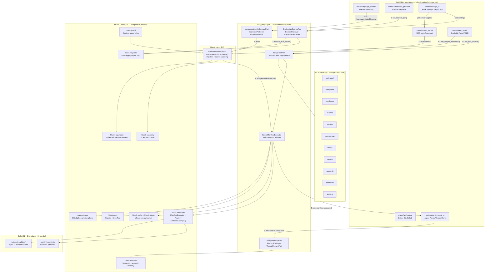
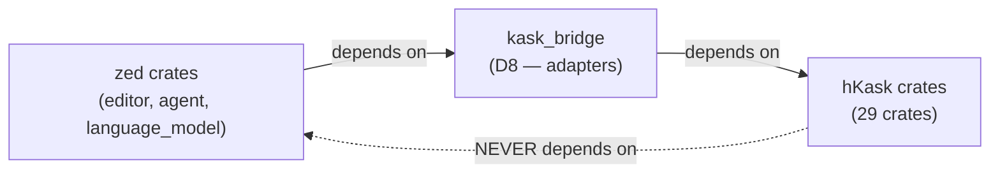

# zed-kask Integrated Architecture

The zed-kask fork integrates hKask into the Zed editor as a native in-process agent platform. This diagram shows the composition root — the dependency injection wiring at startup (`crates/zed/src/main.rs`) that connects zed's editor surfaces to hKask's agent runtime via the `kask_bridge` seam (D8).

The architecture follows a strict dependency invariant: **no hKask crate depends on a zed crate**. The `kask_bridge` crate is the sole bidirectional seam, adapting zed's `LanguageModel`, `CredentialsProvider`, and `ThreadMemoryPort` traits into hKask's `InferencePort`, `SecretsPort`, and `MemoryPort` interfaces. All ten integration seams (D1–D10) are wired at the composition root before the editor event loop begins.

<!-- DIAGRAM_ALIGNMENT
id: DIAG-ARCH-001
verified_date: 2026-07-24
verified_against: kask/docs/architecture/zed-host-architecture-plan.md (§6 composition root, D1-D10 status table); kask/crates/kask_bridge/src/lib.rs; kask/crates/zed/src/main.rs
status: VERIFIED
-->

## Dependency Invariant

The governing architectural constraint: **hKask crates never depend on zed crates**. The dependency direction is one-way — zed depends on hKask via `kask_bridge`, never the reverse. This keeps hKask portable (could run standalone again if needed) and keeps the fork's divergence surface minimal.

<!-- DIAGRAM_ALIGNMENT
id: DIAG-ARCH-002
verified_date: 2026-07-24
verified_against: kask/docs/architecture/zed-host-architecture-plan.md §13.1 (governing invariant); kask/Cargo.toml (workspace deps)
status: VERIFIED
-->

## Integration Seams (D1–D10)

All ten integration seams are wired at the composition root in `crates/zed/src/main.rs` before the editor event loop begins. Each seam is an additive divergence point — zed's code is modified only at the seam, everything else stays byte-identical to upstream.

| Seam | Surface | What It Does |
|------|---------|-------------|
| D1 | Skill execution | `SkillTool` has optional `SkillManifestExecutor`; `BridgeManifestExecutor` connects zed's agent panel to hKask's `ManifestExecutor` + skill registry (51 skills). |
| D2 | Curator agent | `Curator` variant in `agent_ui::Agent` enum; native agent selectable in Agent Panel. |
| D3 | Tools in-process | `BridgeToolPort` wraps `McpRuntime`; MCP servers run as child processes (stdio). OCAP/gas/spans enforced. |
| D4 | Guard layer | `GuardedInferencePort` wraps `InferencePort`; `hkask-guard` scans inputs (injection, role override) and outputs (secret redaction). |
| D5 | Sovereignty keys | `hkask-keystore` crypto-derivation over `SecretsPort`/`CredentialsProvider`; kask namespace (`kask://credentials/<key>`). |
| D6 | Thread → memory | `BridgeMemoryPort` adapts `ThreadMemoryPort` → `MemoryPort`; thread turn completion ingests into hKask memory. |
| D7 | App-identity | `APP_NAME`→`Zed-Kask`, port offset +500, binary `zed-kask`, bundle IDs `dev.zed-kask.*`. |
| D8 | Bridge + adapters | `kask_bridge` crate: `InferencePort`, `SecretsPort`, `BridgeManifestExecutor`, `BridgeToolPort`, `KaskSettings`. |
| D9a/b/c | Settings + credentials + UI | `KaskSettings` in settings.json; `SecretsPort` over `CredentialsProvider`; settings UI page with 5 sub-pages. |
| D10 | Kask panel | Native GPUI dockable panel; `/tool args` direct invocation (OCAP-gated); scoped inference with selected server's tools. |

## Cross-References

- [zed-host-architecture-plan.md](zed-host-architecture-plan.md) — canonical architecture document with full D1–D10 status, essentialist split, and composition root details.
- [PRINCIPLES.md](core/PRINCIPLES.md) — architecture principles P1–P12 governing the design.
- [magna-carta.md](core/magna-carta.md) — the 4 sovereignty principles enforced by the guard layer (D4) and OCAP (D3).
- [skills/README.md](../reference/skills/README.md) — skill registry (51 skills + 3 templates + 1 bundle).
- [mcp-servers/README.md](../reference/mcp-servers/README.md) — 11 in-process MCP servers.
