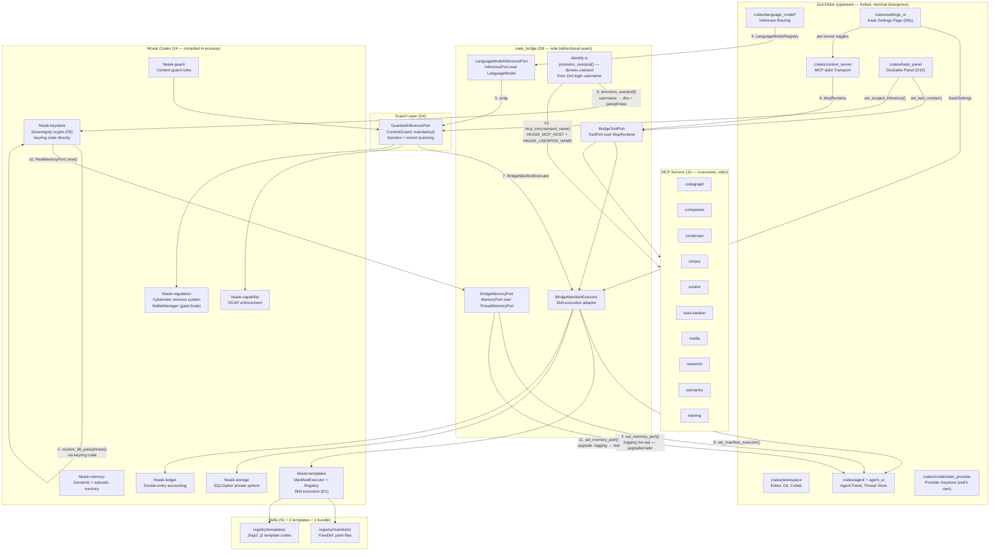

# zed-kask Integrated Architecture

The zed-kask fork integrates hKask into the Zed editor as a native in-process agent platform. This diagram shows the composition root — the dependency injection wiring at startup (`crates/zed/src/main.rs`) that connects zed's editor surfaces to hKask's agent runtime via the `kask_bridge` seam (D8).

The architecture follows a strict dependency invariant: **no hKask crate depends on a zed crate**. The `kask_bridge` crate is the sole bidirectional seam, adapting zed's `LanguageModel` and `ThreadMemoryPort` traits into hKask's `InferencePort` and `MemoryPort` interfaces. Sovereignty keys (a2a_secret, db_passphrase, ocap_secret) are accessed via the `keyring` crate directly — no async bridge, no `SecretsPort` adapter. API keys for inference providers are handled by zed's own `CredentialsProvider` through the `LanguageModelRegistry`. All ten integration seams (D1–D10) are wired at the composition root.

## Composition Root Diagram

## Startup Sequence

The composition root runs in three phases:

### Phase 1 — Early wiring (before `AppState::set_global`)

Runs inside `app.run()` before the workspace is created. No dependencies on `LanguageModelRegistry` or `UserStore`.

1. **Resolve `a2a_secret`** — `hkask_keystore::keychain::resolve_a2a_secret()` via the `keyring` crate (synchronous OS keychain I/O). Falls back to empty vec on first run.
2. **Install logging memory port** — `set_memory_port(BridgeMemoryPort(LoggingMemoryPort))`. No-op until the Zed user resolves. Uses `Mutex` (not `OnceLock`) so the port can be replaced later.

### Phase 2 — Model-dependent wiring (after `language_models::init`)

Runs after `language_model::init(cx)` and `language_models::init()` so that `LanguageModelRegistry::read_global(cx)` is available.

3. **Construct `LanguageModelInferencePort`** — wraps zed's default `LanguageModel`.
4. **Wrap with `GuardedInferencePort`** — mandatory content guard (injection scanning, secret redaction).
5. **Construct `BridgeManifestExecutor`** — skill cascade executor with guarded inference + tool port + a2a_secret.
6. **Wire kask panel** — `set_tool_invoker()` and `set_scoped_inference()` for the dockable Kask Panel (D10).
7. **Wire thread condenser** — compresses tool results before they enter message history.

### Phase 3 — Deferred provisioning (after Zed user resolves)

A spawned task watches `UserStore::current_user()`. When the Zed user logs in:

8. **Derive userpod name** — `userpod_name_from_username(User::username)` → `sanitize_name()` → filesystem-safe name.
9. **Provision userpod** — `provision_userpod(username)`:
   - Create directory structure (`~/.local/share/hkask/userpods/{username}/`)
   - Ensure DB passphrase exists (auto-generate random English word if none, stored in OS keychain via `keyring` crate)
   - Return resolved DB path and passphrase
10. **Upgrade memory port** — `RealMemoryPort::new(db_path, passphrase, webid, ...)` → `set_memory_port(BridgeMemoryPort(RealMemoryPort))`. Replaces the logging port from Phase 1.
11. **Wire context injector** — if `kask.memory.auto_inject` is enabled, injects recalled memories into prompts before inference.
12. **Launch MCP servers** — starts the 10 `hkask-mcp-*` child processes with `HKASK_MCP_HOST` and `HKASK_USERPOD_NAME` env vars set from the sanitized username.

## Dependency Invariant

The governing architectural constraint: **hKask crates never depend on zed crates**. The dependency direction is one-way — zed depends on hKask via `kask_bridge`, never the reverse. This keeps hKask portable (could run standalone again if needed) and keeps the fork's divergence surface minimal.

## Keystore Design

The `hkask-keystore` crate uses the `keyring` crate directly for all OS keychain access — synchronous, no async bridge, no runtime dependency. This replaces the deleted `SecretsPort` adapter, which bridged async `CredentialsProvider` calls to sync keystore reads and was fundamentally broken on GPUI threads (deadlocks and panics from `block_in_place` / `block_on` on a single-threaded executor).

**What lives where:**

| Concern | Mechanism | Where |
|---|---|---|
| API keys (DeepInfra, Together, OpenRouter, etc.) | zed's `CredentialsProvider` via `LanguageModelRegistry` | zed crates (upstream) |
| Sovereignty keys (a2a_secret, db_passphrase, ocap_secret) | `keyring` crate (synchronous OS keychain) | `hkask-keystore` |
| DB passphrase auto-generation | Random English word (8+ letters), stored in keychain on first run | `kask_bridge::identity::provision_userpod()` |
| Data-service API keys (EODHD, FMP, etc.) | zed's `CredentialsProvider` under `kask://credentials/<key>` namespace | Settings UI → `CredentialsProvider` |

## Divergence Map (D1–D10)

| D | Surface | Status | Mechanism |
|---|---|---|---|
| D1 | Skill execution | ✅ | `BridgeManifestExecutor` wraps `InferencePort` + `ToolPort` + registry paths |
| D2 | Curator agent | ✅ | `Agent::Curator` variant in `agent_ui`; native in-process agent |
| D3 | Tools in-process | ✅ | `BridgeToolPort` wraps `McpRuntime` (OCAP/gas/spans); MCP servers as child processes |
| D4 | Guard layer | ✅ | `GuardedInferencePort` wraps `InferencePort`; `ContentGuard::mandatory()` |
| D5 | Sovereignty keys | ✅ | `keyring` crate directly (no `SecretsPort` adapter); DB passphrase auto-provisioned |
| D6 | Thread → memory | ✅ | `BridgeMemoryPort` over `RealMemoryPort`; logging → real upgrade on user resolve |
| D7 | App-identity | ✅ | `APP_NAME`→`Zed-Kask`, binary `zed-kask`, bundle IDs `dev.zed-kask.*` |
| D8 | Bridge + adapters | ✅ | `kask_bridge` crate: `InferencePort`, `MemoryPort`, `ManifestExecutor`, `ToolPort`, `KaskSettings`, `provision_userpod` |
| D9 | Settings + credentials | ✅ | `KaskSettings` struct + `"kask"` section in settings.json; settings UI page |
| D10 | Kask panel | ✅ | Native GPUI `Panel` in right dock; gear icon; View menu entry; tool invoker + scoped inference |
