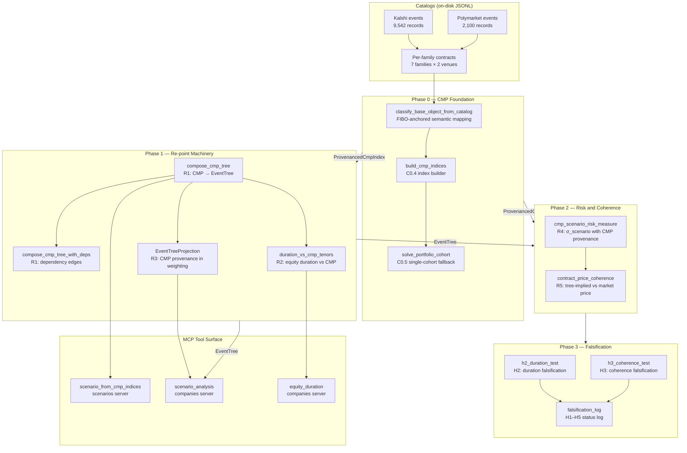
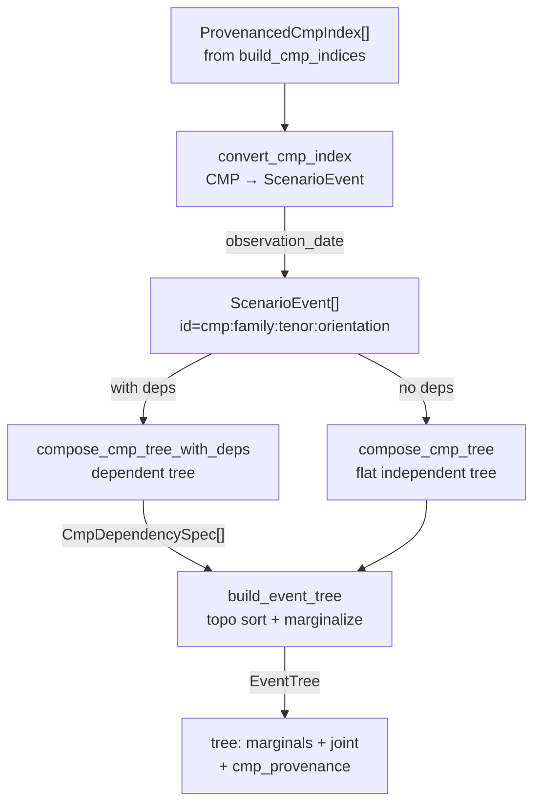
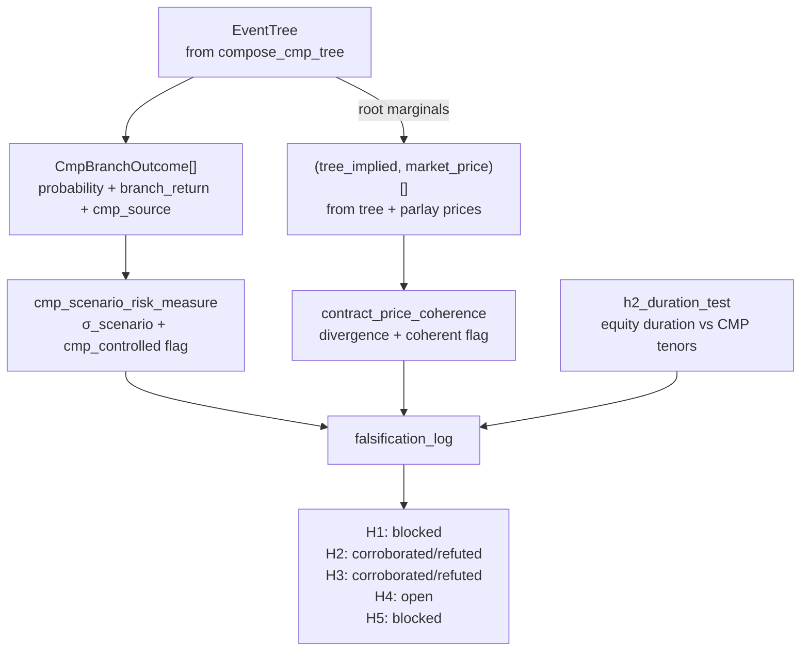

# CMP-First Research Pipeline Architecture

The Bayesian-APT research program (v2, CMP-first) is a four-phase pipeline that
builds constant-maturity prediction (CMP) indices from raw prediction-market
catalogs, composes them into scenario trees, computes risk and coherence
measures, and runs falsification tests on the H1–H5 hypotheses. The pipeline
spans four crates: `hkask-forecast` (pure math), `hkask-mcp-prediction-markets`
(CMP construction), `hkask-mcp-scenarios` (composition), and
`hkask-mcp-companies` (tree-weighted valuation).



<!-- DIAGRAM_ALIGNMENT
id: DIAG-CMP-ARCH-001
verified_date: 2026-08-07
verified_against: kask/crates/hkask-forecast/src/hkask_forecast.rs; kask/crates/hkask-forecast/src/falsification.rs; kask/mcp-servers/hkask-mcp-prediction-markets/src/cmp_index_builder.rs; kask/mcp-servers/hkask-mcp-prediction-markets/src/cmp_portfolio.rs; kask/mcp-servers/hkask-mcp-scenarios/src/superforecast.rs; kask/mcp-servers/hkask-mcp-companies/src/superforecast.rs
status: VERIFIED
-->

## Phase 0 — CMP Foundation

The foundation layer takes raw prediction-market catalogs and produces
constant-maturity, constant-orientation synthetic portfolio indices. Each index
is a weighted portfolio of real contracts whose weighted-average maturity
matches a fixed target (1m/3m/6m). The time axis is taken out of the equation
so the only thing that moves is the probability.

```mermaid
flowchart TD
    records["Catalog records<br/>Kalshi / Gamma JSONL"] --> classify["classify_base_object_from_catalog<br/>FIBO-anchored semantic mapping"]
    classify -->|"BaseEconomicObject"| eligible["build_oriented_constituents<br/>strike extraction + orientation"]
    eligible -->|"OrientedConstituent[]" --> buckets["select_available_buckets<br/>maturity window check"]
    buckets -->|"available buckets"| bracket["solve_portfolio<br/>bracket pair interpolation"]
    buckets -->|"available buckets"| cohort["solve_portfolio_cohort<br/>C0.5 single-cohort fallback"]
    bracket -->|"Interpolated"| index["ProvenancedCmpIndex<br/>family + venue + portfolio"]
    cohort -->|"BucketedSparse"| index
    bracket -->|"None — no bracket"| cohort
    cohort -->|"None — beyond tolerance"| withhold["Withheld<br/>never fabricate"]
```

<!-- DIAGRAM_ALIGNMENT
id: DIAG-CMP-ARCH-002
verified_date: 2026-08-07
verified_against: kask/mcp-servers/hkask-mcp-prediction-markets/src/cmp_index_builder.rs:build_cmp_indices_from_lines; kask/mcp-servers/hkask-mcp-prediction-markets/src/cmp_portfolio.rs:solve_portfolio; kask/mcp-servers/hkask-mcp-prediction-markets/src/cmp_portfolio.rs:solve_portfolio_cohort
status: VERIFIED
-->

## Phase 1 — Composition and Re-pointing

CMP indices flow into the scenario composition machinery. Each index becomes a
root `ScenarioEvent` with its index probability as the prior. The tree cites
the index identity (`cmp:{family}:{tenor}:{orientation}`), not a decaying
contract. Optional dependency edges between indices enable joint probability
computation for the H3 coherence test.



<!-- DIAGRAM_ALIGNMENT
id: DIAG-CMP-ARCH-003
verified_date: 2026-08-07
verified_against: kask/mcp-servers/hkask-mcp-scenarios/src/superforecast.rs:compose_cmp_tree; kask/mcp-servers/hkask-mcp-scenarios/src/superforecast.rs:compose_cmp_tree_with_deps
status: VERIFIED
-->

## Phase 2–3 — Risk, Coherence, and Falsification

The risk measure computes σ_scenario over CMP-controlled branches. The
coherence measure compares tree-implied joint probabilities against observed
market prices within a transaction-cost band. The falsification suite runs
the computable tests (H2 duration, H3 coherence) and records the blocked
tests (H1 systemic risk, H4 complexity, H5 LLM leverage).



<!-- DIAGRAM_ALIGNMENT
id: DIAG-CMP-ARCH-004
verified_date: 2026-08-07
verified_against: kask/crates/hkask-forecast/src/hkask_forecast.rs:cmp_scenario_risk_measure; kask/crates/hkask-forecast/src/hkask_forecast.rs:contract_price_coherence; kask/crates/hkask-forecast/src/falsification.rs:falsification_log
status: VERIFIED
-->

## Crate dependency graph

The pure-math crate `hkask-forecast` has no MCP dependencies. The three MCP
servers depend on it for the shared computation engine. The scenarios server
depends on the prediction-markets server for the `ProvenancedCmpIndex` type.
The companies server does not depend on the scenarios server (the integration
seam is caller-mediated paste bridging via `EventTreeProjection`).

```mermaid
graph TD
    forecast["hkask-forecast<br/>pure math: R2, R4, R5, R6"]
    pm["hkask-mcp-prediction-markets<br/>C0.1–C0.5, ONT-6"]
    scenarios["hkask-mcp-scenarios<br/>R1: compose_cmp_tree"]
    companies["hkask-mcp-companies<br/>R3: tree-weighted valuation"]

    pm -->|"depends on"| forecast
    scenarios -->|"depends on"| forecast
    scenarios -->|"depends on"| pm
    companies -->|"depends on"| forecast
    companies -.->|"caller-mediated<br/>(EventTreeProjection JSON)"|-. scenarios
```

<!-- DIAGRAM_ALIGNMENT
id: DIAG-CMP-ARCH-005
verified_date: 2026-08-07
verified_against: kask/crates/hkask-forecast/Cargo.toml; kask/mcp-servers/hkask-mcp-prediction-markets/Cargo.toml; kask/mcp-servers/hkask-mcp-scenarios/Cargo.toml; kask/mcp-servers/hkask-mcp-companies/Cargo.toml
status: VERIFIED
-->

## See also

- [Research Plan (v2, CMP-first)](../../../tasks/bayesian-apt/plan.md) — the full plan with dependency graph and phase structure.
- [CMP Foundation Spec](../../../tasks/bayesian-apt/cmp-foundation.md) — the three-step index process, passed variables, and publication format.
- [All-Families Probe Results](../../../tasks/bayesian-apt/all-families-probe.md) — the structural maturity-ladder finding and C0.5 cohort fallback results.
- [Falsification Log](../../../tasks/bayesian-apt/falsification-log.md) — H1–H5 statuses and falsifiers.
- [C0.4 Decisions](../../../tasks/bayesian-apt/c0.4-decisions.md) — the four open-question resolutions and CP-CMP checkpoint findings.
