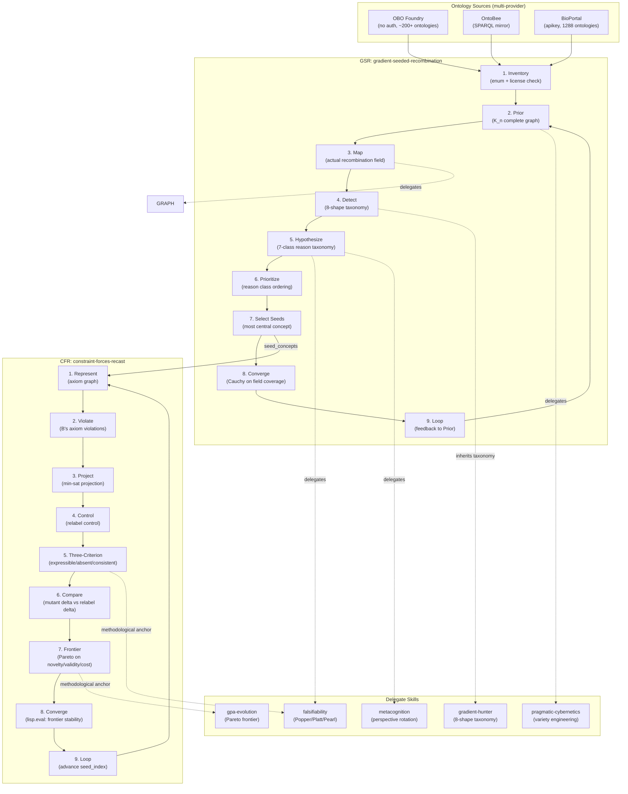

# Interdisciplinary Constraint-Forces Skills — Architecture

This diagram shows the relationship between the two scaffolded skills (GSR, CFR), their delegate skills, and the ontology-source providers. It serves as a **reference** document in the Diataxis framework — austere and factual, for architects and developers who need to understand the skill composition.

## Cross-Links

- [MDS](../architecture/core/MDS.md) — Minimal Domain Specification categories
