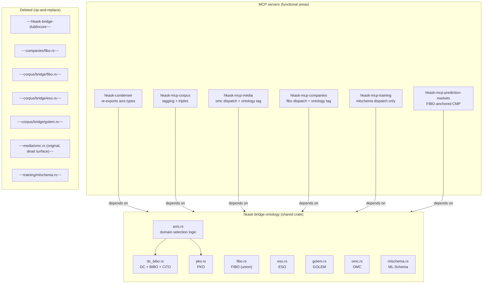
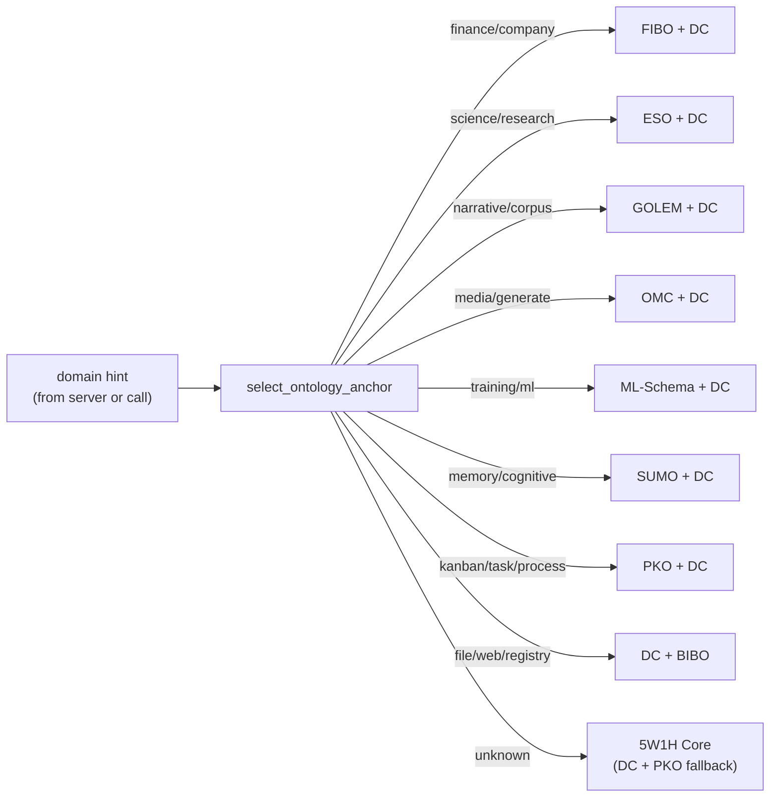

# Ontology Bridge Architecture

The ontology bridge system is a single shared crate (`hkask-bridge-ontology`)
that owns all ontology vocabulary and the dual-axis domain-selection logic.
No ontology vocabulary lives inside any MCP server; every server that does
tagging depends on this crate. The architecture enforces the orthogonality
of domain maps (ontologies) and functional-area maps (MCP servers).

<!-- DIAGRAM_ALIGNMENT
id: DIAG-ONT-001
verified_date: 2026-08-05
verified_against: kask/crates/hkask-bridge-ontology/src/hkask_bridge_ontology.rs; kask/crates/hkask-bridge-ontology/src/axis.rs
status: VERIFIED
-->

## The dual-axis invariant

State axis is always Dublin Core. Process axis is the domain ontology when
one applies, PKO otherwise. One axis is always DC or PKO, so every artifact
has a common mapping in process or state space regardless of domain.

<!-- DIAGRAM_ALIGNMENT
id: DIAG-ONT-002
verified_date: 2026-08-05
verified_against: kask/crates/hkask-bridge-ontology/src/axis.rs:select_ontology_anchor
status: VERIFIED
-->

## See also

- [PRINCIPLES.md P5.4/P8.1](../architecture/core/PRINCIPLES.md) — the dual-axis framework and bridging principles.
- [Ontology Bridge Reference](../reference/ontology-bridge.md) — the API reference for the crate, including the unified tag shape and `explain_tool_for`.
- [Using the Ontology Bridge](../diataxis/hkask-bridge-ontology/how-to.md) — a how-to guide for servers.
