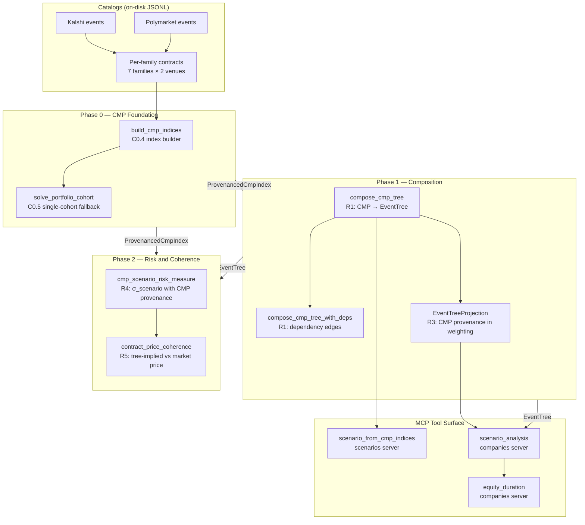
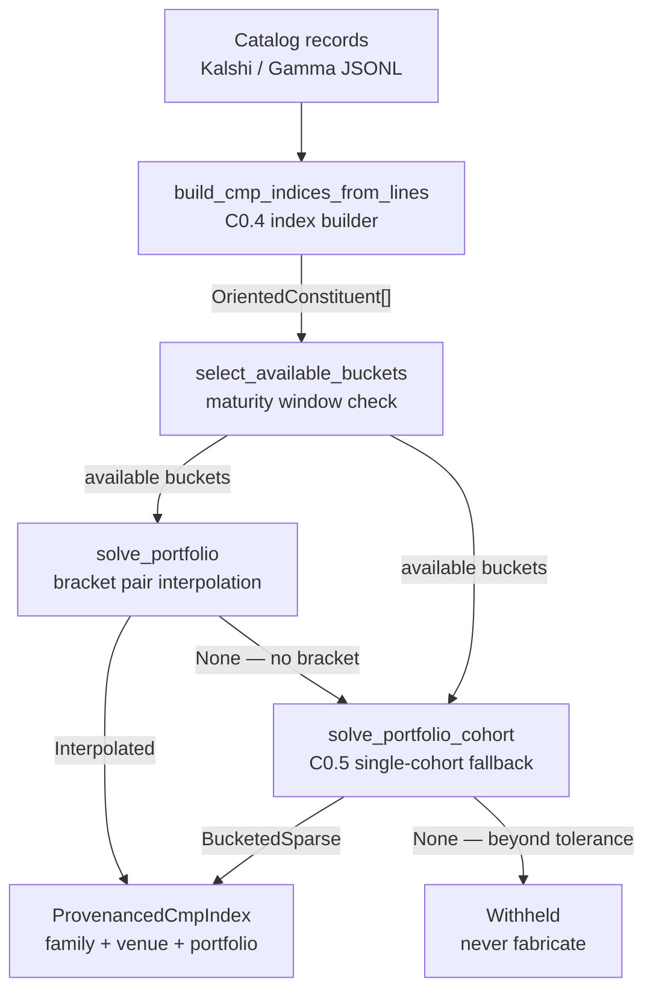
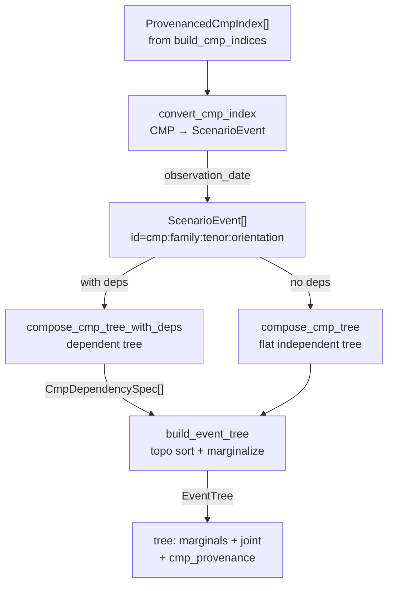
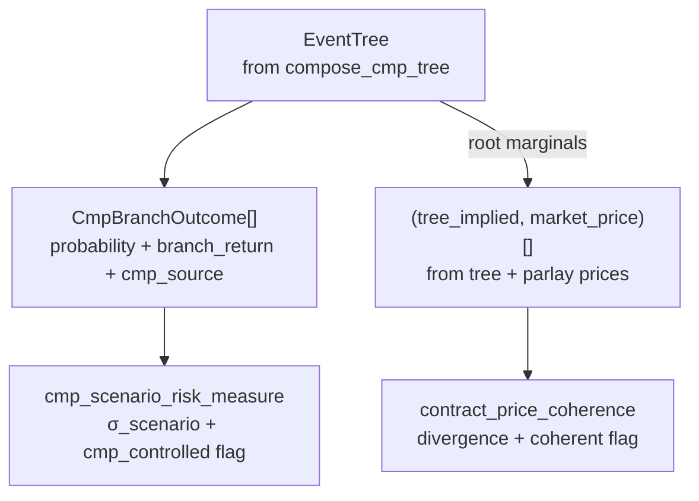
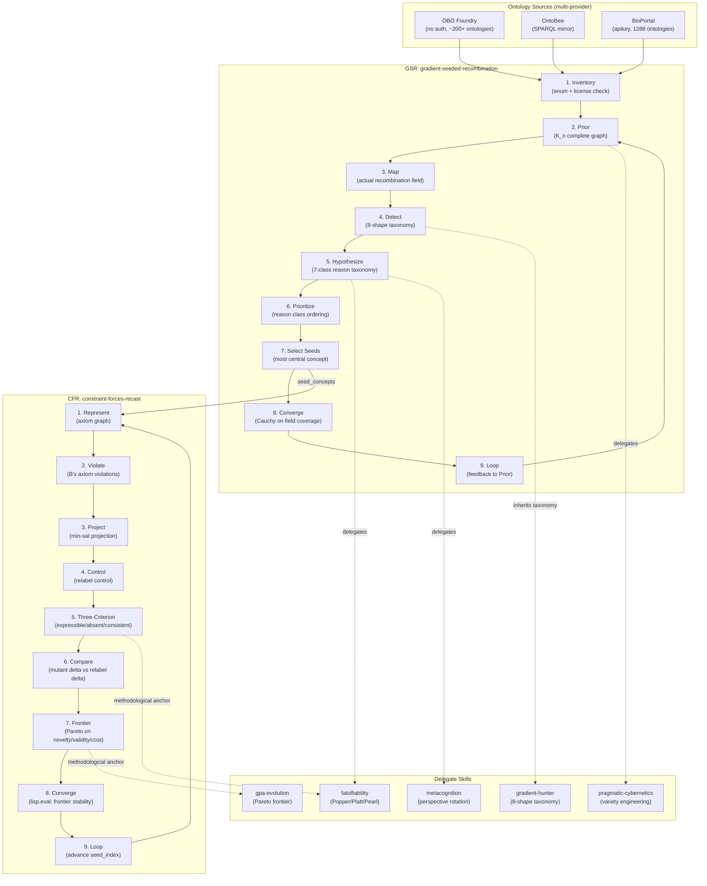
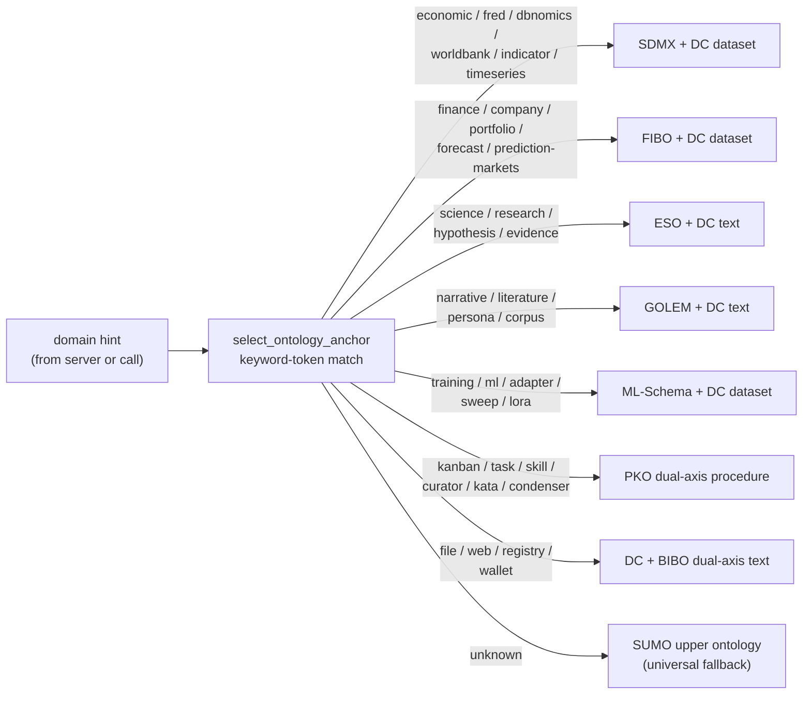
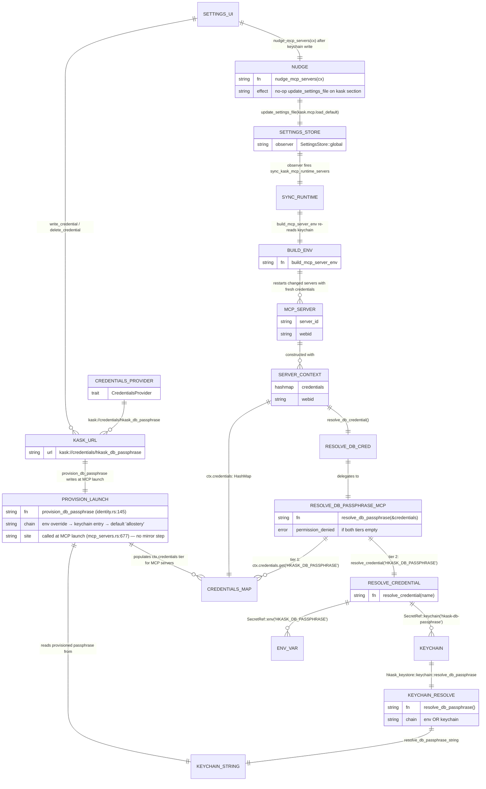
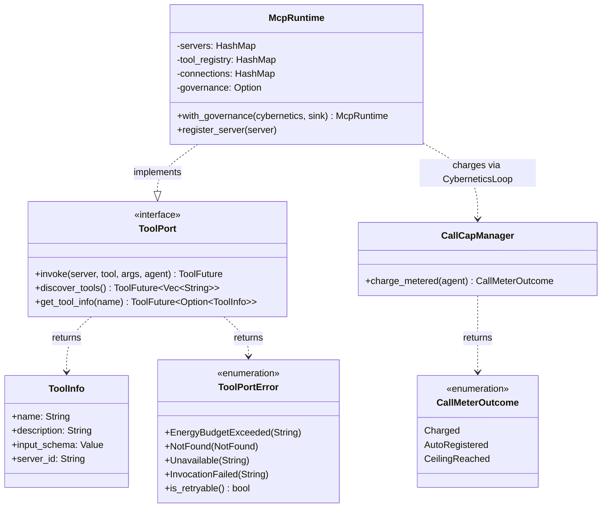
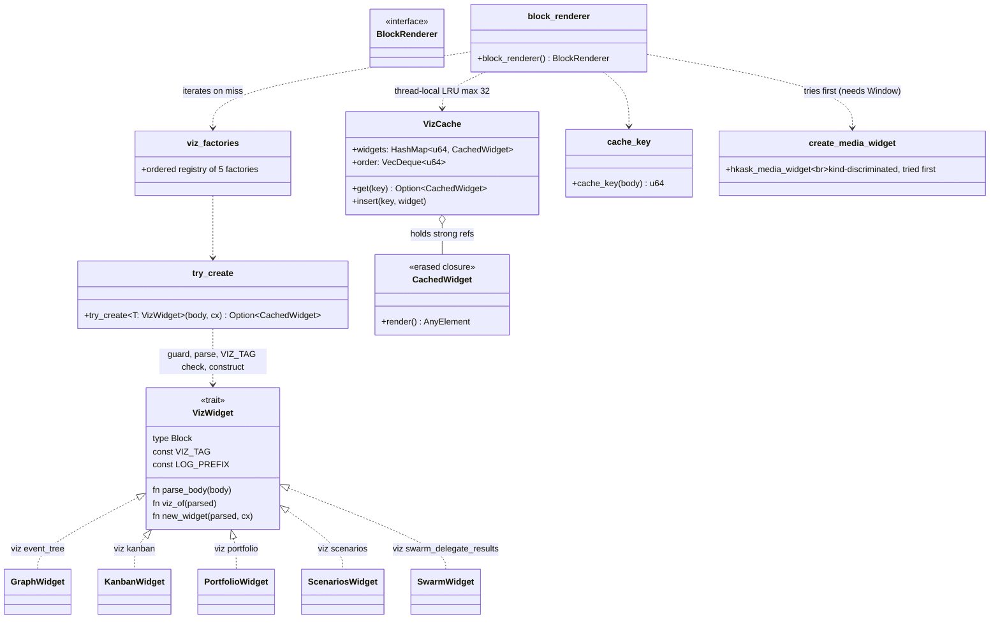

# hKask Architecture Diagrams

Consolidated reference-quadrant architecture diagrams. Each section folds a
former standalone diagram file; unique `DIAGRAM_ALIGNMENT` IDs are preserved
from the originals. Every diagram was re-verified against current code on
2026-08-28; corrected diagrams carry a "Corrections" note naming what drifted.

## CMP-First Research Pipeline

The Bayesian-APT research program (v2, CMP-first) builds constant-maturity
prediction (CMP) indices from raw prediction-market catalogs, composes them
into scenario trees, and computes risk and coherence measures. The pipeline
spans four crates: `hkask-forecast` (pure math), `hkask-mcp-prediction-markets`
(CMP construction), `hkask-mcp-scenarios` (composition), and
`hkask-mcp-companies` (tree-weighted valuation).

**Corrections (2026-08-28, updated 2026-08-29):** the falsification suite
(`falsification_log`, `h2_duration_test`, `h3_coherence_test`, and the
`falsification.rs` module) has been deleted from `hkask-forecast`; the former
Phase 3 (falsification) is dropped. The risk and coherence measures remain in
`hkask_forecast.rs`, including `duration_vs_cmp_tenors` (R2), which the
companies server's `equity_duration` tool emits as `cmp_tenor_gaps`.
`classify_base_object_from_catalog` lives in
`hkask-mcp-prediction-markets/src/semantic_mapping.rs` and is called by the CMP
index builder (`build_oriented_constituents`).



<!-- DIAGRAM_ALIGNMENT
id: DIAG-CMP-ARCH-001
verified_date: 2026-08-28
verified_against: kask/crates/hkask-forecast/src/hkask_forecast.rs (cmp_scenario_risk_measure L733, contract_price_coherence L802); kask/mcp-servers/hkask-mcp-prediction-markets/src/cmp_index_builder.rs (build_cmp_indices_from_lines L488); kask/mcp-servers/hkask-mcp-prediction-markets/src/cmp_portfolio.rs (solve_portfolio_cohort L467); kask/mcp-servers/hkask-mcp-scenarios/src/hkask_mcp_scenarios.rs (scenario_from_cmp_indices L626, compose_cmp_tree L653, compose_cmp_tree_with_deps L655); kask/mcp-servers/hkask-mcp-companies/src/tools/analytics.rs (scenario_analysis L686); kask/mcp-servers/hkask-mcp-companies/src/tools/valuation.rs (equity_duration L481); kask/mcp-servers/hkask-mcp-companies/src/superforecast.rs (EventTreeProjection L219)
status: VERIFIED
-->

### Phase 0 — CMP Foundation

Each index is a weighted portfolio of real contracts whose weighted-average
maturity matches a fixed target (1m/3m/6m). The time axis is taken out of the
equation so the only thing that moves is the probability.



<!-- DIAGRAM_ALIGNMENT
id: DIAG-CMP-ARCH-002
verified_date: 2026-08-28
verified_against: kask/mcp-servers/hkask-mcp-prediction-markets/src/cmp_index_builder.rs (build_oriented_constituents L335, build_cmp_indices_from_lines L488); kask/mcp-servers/hkask-mcp-prediction-markets/src/cmp_portfolio.rs (select_available_buckets L197, solve_portfolio L383, solve_portfolio_cohort L467)
status: VERIFIED
-->

### Phase 1 — Composition

CMP indices flow into the scenario composition machinery. Each index becomes
a root `ScenarioEvent` with its index probability as the prior. The tree
cites the index identity (`cmp:{family}:{tenor}:{orientation}`), not a
decaying contract. Optional dependency edges between indices enable joint
probability computation.



<!-- DIAGRAM_ALIGNMENT
id: DIAG-CMP-ARCH-003
verified_date: 2026-08-28
verified_against: kask/mcp-servers/hkask-mcp-scenarios/src/hkask_mcp_scenarios.rs (scenario_from_cmp_indices L626-687, convert_cmp_index format L666); kask/mcp-servers/hkask-mcp-scenarios/src/superforecast.rs (compose_cmp_tree, compose_cmp_tree_with_deps, convert_cmp_index — called at hkask_mcp_scenarios.rs L653-655); kask/mcp-servers/hkask-mcp-scenarios/src/requests.rs (CmpDependencySpec L119)
status: VERIFIED
-->

### Phase 2 — Risk and Coherence

The risk measure computes σ_scenario over CMP-controlled branches. The
coherence measure compares tree-implied joint probabilities against observed
market prices within a transaction-cost band. The former falsification
consumers (H2 duration, H3 coherence tests, `falsification_log`) were
deleted; the measures themselves remain in `hkask_forecast.rs`.



<!-- DIAGRAM_ALIGNMENT
id: DIAG-CMP-ARCH-004
verified_date: 2026-08-28
verified_against: kask/crates/hkask-forecast/src/hkask_forecast.rs (cmp_scenario_risk_measure L733, contract_price_coherence L802); falsification.rs deleted — falsification_log / h2_duration_test / h3_coherence_test no longer exist in kask/crates/hkask-forecast/src/
status: VERIFIED
-->

### Crate dependency graph

The pure-math crate `hkask-forecast` has no MCP dependencies. The three MCP
servers depend on it for the shared computation engine. The scenarios server
depends on the prediction-markets server for the `ProvenancedCmpIndex` type.
The companies server does not depend on the scenarios server (the integration
seam is caller-mediated paste bridging via `EventTreeProjection`).

```mermaid
graph TD
    forecast["hkask-forecast<br/>pure math: R4, R5"]
    pm["hkask-mcp-prediction-markets<br/>C0.1–C0.5, ONT-6"]
    scenarios["hkask-mcp-scenarios<br/>R1: compose_cmp_tree"]
    companies["hkask-mcp-companies<br/>R3: tree-weighted valuation"]

    pm -->|"depends on"| forecast
    scenarios -->|"depends on"| forecast
    scenarios -->|"depends on"| pm
    companies -->|"depends on"| forecast
    companies -.->|"caller-mediated<br/>(EventTreeProjection JSON)"|-. scenarios
```

<!-- DIAGRAM_ALIGNMENT
id: DIAG-CMP-ARCH-005
verified_date: 2026-08-28
verified_against: kask/crates/hkask-forecast/Cargo.toml; kask/mcp-servers/hkask-mcp-prediction-markets/Cargo.toml (hkask-forecast L28); kask/mcp-servers/hkask-mcp-scenarios/Cargo.toml (hkask-forecast L28, hkask-mcp-prediction-markets L29); kask/mcp-servers/hkask-mcp-companies/Cargo.toml (hkask-forecast L36)
status: VERIFIED
-->

## Interdisciplinary Constraint-Forces Skills

The relationship between the two scaffolded skills (GSR, CFR), their delegate
skills, and the ontology-source providers. Verified current — all seven
referenced SKILL.md files exist unchanged in role.



<!-- DIAGRAM_ALIGNMENT
id: DIAG-SKILL-CFR
verified_date: 2026-08-28
verified_against: .agents/skills/gradient-seeded-recombination/SKILL.md; .agents/skills/constraint-forces-recast/SKILL.md; .agents/skills/falsifiability/SKILL.md; .agents/skills/gradient-hunter/SKILL.md; .agents/skills/gpa-evolution/SKILL.md; .agents/skills/pragmatic-cybernetics/SKILL.md; .agents/skills/metacognition/SKILL.md
status: VERIFIED
-->

## Ontology Bridge

The ontology bridge is a single shared crate (`hkask-bridge-ontology`) that
owns all ontology vocabulary and the domain-selection logic. No ontology
vocabulary lives inside any MCP server; every server that does tagging
depends on this crate.

**Corrections (2026-08-28):** the crate has expanded from 3 to 10 vocabulary
modules — `fibo.rs`, `eso.rs`, `golem.rs`, and `omc.rs` exist again (the old
"Deleted (rip-and-replace)" subgraph is stale), `mlschema.rs` was renamed
`ml_schema.rs`, and `sdmx.rs` (statistical data) and `sumo.rs` (upper
ontology) are new. The dependent set grew from 5 to 9 MCP servers plus the
condenser crate and two widget crates.

```mermaid
graph TD
    subgraph shared["hkask-bridge-ontology (shared crate)"]
        direction TB
        axis["axis.rs<br/>domain-selection logic"]
        dc_bibo["dc_bibo.rs<br/>DC + BIBO + CiTO"]
        pko["pko.rs<br/>PKO"]
        fibo["fibo.rs<br/>FIBO"]
        eso["eso.rs<br/>ESO"]
        golem["golem.rs<br/>GOLEM"]
        ml_schema["ml_schema.rs<br/>ML-Schema"]
        omc["omc.rs<br/>OMC"]
        sdmx["sdmx.rs<br/>SDMX"]
        sumo["sumo.rs<br/>SUMO"]
        axis --> dc_bibo
        axis --> pko
        axis --> fibo
        axis --> eso
        axis --> golem
        axis --> ml_schema
        axis --> omc
        axis --> sdmx
        axis --> sumo
    end

    subgraph servers["Dependents (functional areas)"
    ]
        condenser["hkask-condenser"]
        corpus["hkask-mcp-corpus<br/>tagging + triples"]
        companies["hkask-mcp-companies<br/>fibo dispatch + ontology tag"]
        training["hkask-mcp-training<br/>ml_schema dispatch"]
        pm["hkask-mcp-prediction-markets<br/>FIBO-anchored CMP"]
        portfolio["hkask-mcp-portfolio"]
        research["hkask-mcp-research"]
        scenarios["hkask-mcp-scenarios"]
        swarm["hkask-mcp-swarm"]
        media["hkask-mcp-media"]
        media_widget["hkask-media-widget"]
        portfolio_widget["hkask-portfolio-widget"]
    end

    condenser -->|"depends on"| shared
    corpus -->|"depends on"| shared
    companies -->|"depends on"| shared
    training -->|"depends on"| shared
    pm -->|"depends on"| shared
    portfolio -->|"depends on"| shared
    research -->|"depends on"| shared
    scenarios -->|"depends on"| shared
    swarm -->|"depends on"| shared
    media -->|"depends on"| shared
    media_widget -->|"depends on"| shared
    portfolio_widget -->|"depends on"| shared
```



<!-- DIAGRAM_ALIGNMENT
id: DIAG-ONT-001
verified_date: 2026-08-28
verified_against: kask/crates/hkask-bridge-ontology/src/hkask_bridge_ontology.rs (pub mod axis, dc_bibo, eso, fibo, golem, ml_schema, omc, pko, sdmx, sumo L58-67); kask/crates/hkask-bridge-ontology/src/axis.rs; dependent Cargo.tomls (hkask-mcp-companies, hkask-mcp-corpus, hkask-mcp-media, hkask-mcp-portfolio, hkask-mcp-prediction-markets, hkask-mcp-research, hkask-mcp-scenarios, hkask-mcp-swarm, hkask-mcp-training, hkask-condenser, crates/hkask-media-widget, crates/hkask-portfolio-widget)
status: VERIFIED
-->

### The dual-axis / domain-supplement dispatch

`select_ontology_anchor` matches the domain hint by keyword token (exact,
prefix, or `_`/space-delimited token — no substring false positives) and
returns either a `DualAxis` anchor (DC+BIBO or PKO) or a `DomainSupplement`
anchor (SDMX, FIBO, ESO, GOLEM, ML-Schema). Unknown domains fall back to
SUMO, the universal upper ontology.

**Corrections (2026-08-28):** SDMX is a new anchor (statistical data — FRED,
DBnomics, World Bank); the unknown-domain fallback changed from "5W1H Core
(DC + PKO fallback)" to SUMO; the memory/cognitive → SUMO branch was folded
into the universal fallback.



<!-- DIAGRAM_ALIGNMENT
id: DIAG-ONT-002
verified_date: 2026-08-28
verified_against: kask/crates/hkask-bridge-ontology/src/axis.rs (select_ontology_anchor L210-340, matches_kw token matching L213-221, SDMX branch, FIBO branch, ESO branch, GOLEM branch, ML-Schema branch, PKO DualAxis branch, DC+BIBO DualAxis branch, SUMO universal fallback)
status: VERIFIED
-->

## Skill ↔ MCP ↔ Lisp Capabilities Seam

The three coupled surfaces: the **skill system** (D1, upstream-Zed body
injection), the **MCP server wiring** (D3), and the **Lisp capabilities
layer** (the `lisp_eval` tool's deterministic primitive).

**Correction (2026-08-28):** the on-disk MCP server count is 11, not 10 —
`hkask-mcp-media` was added to `BUILT_IN_MCP_SERVERS`.


The two dispatch paths into `ToolPort::invoke`:

| Caller | Entry point | Action | Resolves to |
| --- | --- | --- | --- |
| Agent tool-use loop (LLM-decided) | `Thread::enabled_tools` → `apply_router_bypassing_built_ins` | LLM emits a tool_use event | `ToolPort::invoke` under the agent's `WebID` |
| Widget compose-back (D21) | `hkask_tool_invoker::ToolInvoker` impls | UI gesture | `ToolPort::invoke` under the `swarm-panel` persona |

Both share the same metering (`CallCapManager::charge_metered`), the same
`reg.tool.*` span emission, and the same `unwrap_tool_envelope` result seam.
The only pre-dispatch refusal is `ToolPortError::EnergyBudgetExceeded` (the
runaway-loop breaker). The model decides every tool call; skills do not
dispatch MCP tools deterministically.

The 11 on-disk MCP servers are enumerated by `BUILT_IN_MCP_SERVERS` in
`kask/crates/kask_bridge/src/mcp_servers.rs`: `portfolio`, `companies`,
`corpus`, `curator`, `kata-kanban`, `research`, `scenarios`,
`prediction-markets`, `swarm`, `training`, `media`.

<!-- DIAGRAM_ALIGNMENT
id: DIAG-ARCH-SKILL-MCP-LISP-001
verified_date: 2026-08-28
verified_against: crates/agent/src/tools/skill_tool.rs; crates/agent/src/tools/lisp_eval_tool.rs; crates/agent/src/tools/render_template_tool.rs; crates/agent/src/tool_router.rs; crates/agent/src/thread.rs; kask/crates/hkask-lisp/src/hkask_lisp.rs; kask/crates/hkask-tool-port/src/tool_port.rs; kask/crates/hkask-mcp/src/runtime.rs; kask/crates/hkask-regulation/src/energy.rs; kask/crates/hkask-types/src/tool_response.rs (unwrap_tool_envelope L61); kask/crates/kask_bridge/src/mcp_servers.rs (BUILT_IN_MCP_SERVERS L55 — 11 servers incl. media)
status: VERIFIED
-->

## Credential Resolution Chain

API keys are stored in zed's `CredentialsProvider` keychain namespace
(`kask://credentials/<key>`). `build_mcp_server_env` reads from this
namespace and injects as env vars into MCP server child processes. The
server's `resolve_credential` reads API keys from env only — there is no
`service=hkask` keychain fallback for API keys. `HKASK_DB_PASSPHRASE` and
`HKASK_SWARM_MEMORY_PASSPHRASE` have dedicated `hkask-keystore` resolvers
(env → `service=hkask` keychain) because they predate the zed integration.
Writes/deletes to the `kask://credentials/...` namespace must call
`nudge_mcp_servers` to re-fire the `SettingsStore` observer and restart
changed servers. Verified current.



The 2-tier chain: `hkask_mcp_server::server::resolve_db_passphrase(&credentials)`
returns `McpToolError::permission_denied` naming the env var and keychain URL
when both tiers are empty — a missing credential is an authorization failure,
not a transient unavailability. `provision_db_passphrase`
(`kask/crates/kask_bridge/src/identity.rs:145`) is idempotent (env override →
existing keychain entry → default `"allostery"`) and runs at governed MCP
server launch (`kask/crates/kask_bridge/src/mcp_servers.rs:677`); a failed
provision logs a `tracing::warn!` naming the env var and the server fails
with `permission_denied` at tool time.

<!-- DIAGRAM_ALIGNMENT
id: DIAG-ERD-CREDENTIAL-RESOLUTION-001
verified_date: 2026-08-28
verified_against: kask/crates/hkask-mcp-server/src/server/credentials.rs (resolve_credential, resolve_db_passphrase); kask/crates/hkask-mcp-server/src/server/context.rs (ServerContext::resolve_db_credential); kask/crates/hkask-keystore/src/keychain.rs (resolve_db_passphrase, resolve_db_passphrase_string); kask/crates/kask_bridge/src/identity.rs (provision_db_passphrase, provision_agent); kask/crates/kask_bridge/src/mcp_servers.rs:677 (launch-path call site); crates/settings_ui/src/pages/kask_page.rs (nudge_mcp_servers, write_credential, delete_credential)
status: VERIFIED
-->

## hKask Tool Port

The `hkask-tool-port` crate holds the dispatch port only — no tokens, no
authorization check, no information-flow labels (the per-call capability
gate RR-0056 and the FIDES taint lattice RR-0053 were removed 2026-08-12).
`McpRuntime::invoke` meters the call and dispatches it; the only pre-dispatch
refusal is the runaway-loop breaker. Verified current.



Authority lives outside this crate: the per-request `tool_allowlist` on the
inference IPC dispatch, each swarm card's `mcp_tools` allowlist, and the
per-server MCP env/credential allowlists. `invoke`'s `agent: WebID` is an
accounting identity, not a credential.

<!-- DIAGRAM_ALIGNMENT
id: DIAG-CAP-001
verified_date: 2026-08-28
verified_against: kask/crates/hkask-tool-port/src/tool_port.rs (ToolPortError variants L12-51, is_retryable L50-52); kask/crates/hkask-tool-port/src/hkask_tool_port.rs; kask/crates/hkask-mcp/src/runtime.rs; kask/crates/hkask-regulation/src/energy.rs (CallMeterOutcome L30-40, DEFAULT_RUNAWAY_CALL_CEILING L26)
status: VERIFIED
-->

## hKask Event Store

The `hkask-event-store` crate is the append-only event log for agent
rollouts. It captures `model_request` and `verdict` events produced by local
swarm delegations, harness runs, and (reserved) curator turns. Wired into the
composition root via `kask_bridge/src/rollout_event_bridge.rs` and consumed
by `hkask-regulation/src/cybernetics_loop.rs`. Verified current.

```mermaid
classDiagram
    class EventStore {
        -driver: Arc~dyn DatabaseDriver~
        -clock: fn() -> String
        +from_driver(driver) Result~EventStore~
        +from_driver_with_clock(driver, clock) Result~EventStore~
        +driver() ~Arc~dyn DatabaseDriver~~
        -init_schema(driver) Result~()~
        +append(rollout, kind, payload) Result~i64~
        +query(filter) Result~Vec~EventRecord~~
        +compact(cutoff_rfc3339) Result~usize~
        +strip_bodies(cutoff_rfc3339) Result~usize~
        +cursor() Result~Option~i64~~
    }
    class EventRecord {
        +position: i64
        +rollout_id: String
        +kind: String
        +payload: Value
        +created_at: String
    }
    class EventFilter {
        +rollout: Option~String~
        +kind: Option~String~
        +after_position: Option~i64~
        +limit: Option~usize~
    }
    class EventStoreError {
        <<enumeration>>
        Database(DbError)
        PayloadParse(serde_json::Error)
        EmptyRolloutId
        EmptyKind
        NoPosition
    }
    class VerdictSource {
        <<enumeration>>
        DeterministicEvaluator
        Operator
        LlmJudged
        RegulationImpact
        +as_str() &'static str
        +from_str(s) Option~Self~
        +is_trusted_for_task_success() bool
    }
    class RolloutKind {
        <<enumeration>>
        Delegation
        Turn
        HarnessRun
        +as_str() &'static str
        +from_str(s) Option~Self~
    }
    class DatabaseDriver {
        <<trait>>
        +execute_batch(sql) Result~()~
        +execute(sql, params) Result~usize~
        +query(sql, params) Result~Vec~Row~~
        +query_optional(sql, params) Result~Option~Row~~
    }

    EventStore --> DatabaseDriver : backed by
    EventStore ..> EventRecord : produces
    EventStore ..> EventFilter : consumes
    EventStore ..> EventStoreError : propagates
    EventRecord ..> VerdictSource : payload carries
    EventRecord ..> RolloutKind : payload carries
    VerdictSource --|> "trusted for task_success" : DeterministicEvaluator, Operator
```

`VerdictSource` trust classification: `DeterministicEvaluator` and `Operator`
are trusted for task success; `LlmJudged` is not (the determinism constraint
forbids an LLM judging `task_success`); `RegulationImpact` is a before/after
measurement, not a task-success check.

<!-- DIAGRAM_ALIGNMENT
id: DIAG-ES-001
verified_date: 2026-08-28
verified_against: kask/crates/hkask-event-store/src/hkask_event_store.rs (from_driver L62, from_driver_with_clock L71, append L93, query L134, compact L179, strip_bodies L200, cursor L212); kask/crates/hkask-event-store/src/types.rs; kask/crates/kask_bridge/src/rollout_event_bridge.rs; kask/crates/hkask-regulation/src/cybernetics_loop.rs
status: VERIFIED
-->

## hKask Viz-Core

`hkask-viz-core` is the D18 composition root for the viz widgets. It
composes every widget into one `BlockRenderer` callback and caches widget
entities by a hash of the block body so state survives the per-token
re-renders of the streaming chat.

**Corrections (2026-08-28):** the per-widget `create_*` factory functions
were replaced by a `VizWidget` trait (`VIZ_TAG` / `LOG_PREFIX` / `parse_body`
/ `viz_of` / `new_widget`) with a shared `try_create` guard and an ordered
`viz_factories()` registry of five widgets (graph, kanban, portfolio,
scenarios, swarm). `block_renderer` now tries the media widget
(`hkask_media_widget::create_media_widget`, discriminates on `kind`, needs
`Window`) first, then the registered viz widgets (discriminate on `viz`).
`CachedWidget` is a single erased render closure (replacing the former
per-variant enum).



**Selection order** (intentional): media (`kind`) first, then graph
(`viz: "event_tree"`), kanban (`viz: "kanban"`), portfolio
(`viz: "portfolio"`), scenarios (`viz: "scenarios"`), swarm
(`viz: "swarm_delegate_results"`). The viz tags are disjoint, so factory
order is arbitrary. A body claimed by none returns `None` and falls through
to the default code-block renderer.

**Wiring seam:** `crates/agent_ui/src/conversation_view.rs` —
`render_agent_markdown` calls `.media_block_renderer(hkask_viz_core::block_renderer())`.

<!-- DIAGRAM_ALIGNMENT
id: DIAG-VIZ-CORE
verified_date: 2026-08-28
verified_against: crates/hkask-viz-core/src/hkask_viz_core.rs (VizWidget trait L85-101, impls for GraphWidget/KanbanWidget/PortfolioWidget/ScenariosWidget/SwarmWidget L103-176, CachedWidget L186-204, try_create L209-224, viz_factories L233-241, MAX_CACHE_SIZE L243, VizCache L251-281, cache_key L285-289, block_renderer L299-330); crates/hkask-media-widget/src/hkask_media_widget.rs (create_media_widget L48); crates/agent_ui/src/conversation_view.rs (media_block_renderer L3539)
status: VERIFIED
-->

## See also

- [Kanban diagrams](./kanban.md) — task status lifecycle, move controller
- [Swarm diagrams](./swarm.md) — swarm server, panel modes, steering loop
- [UI widget diagrams](./ui-widgets.md) — per-widget class diagrams
- [MCP dispatch diagrams](./mcp-dispatch.md) — invoke path, tool-call sequence, CMP tool flow
- [Ontology Bridge Reference](../reference/ontology-bridge.md) — the API reference for the crate
