# hKask Architecture Diagrams

Consolidated reference-quadrant architecture diagrams. Each section folds a
former standalone diagram file; unique `DIAGRAM_ALIGNMENT` IDs are preserved
from the originals. Every diagram was re-verified against current code on
2026-09-28; regenerated diagrams carry a note naming what drifted.

## CMP-First Research Pipeline

The CMP research pipeline builds constant-maturity
prediction (CMP) indices from raw prediction-market catalogs, composes them
into scenario trees, and computes risk and coherence measures. The pipeline
spans four crates: `hkask-forecast` (pure math), `hkask-mcp-prediction-markets`
(CMP construction), `hkask-mcp-scenarios` (composition), and
`hkask-mcp-companies` (tree-weighted valuation).

**Corrections (2026-08-28, updated 2026-08-29):** the falsification suite
(`falsification_log`, `h2_duration_test`, `h3_coherence_test`, and the
`falsification.rs` module) has been deleted from `hkask-forecast`; the former
Phase 3 (falsification) is dropped. The risk and coherence measures remain in
`hkask_forecast.rs`, including `duration_vs_cmp_tenors`, which the
companies server's `equity_duration` tool emits as `cmp_tenor_gaps`.
`classify_base_object_from_catalog` lives in
`hkask-mcp-prediction-markets/src/semantic_mapping.rs` and is called by the CMP
index builder (`build_oriented_constituents`).

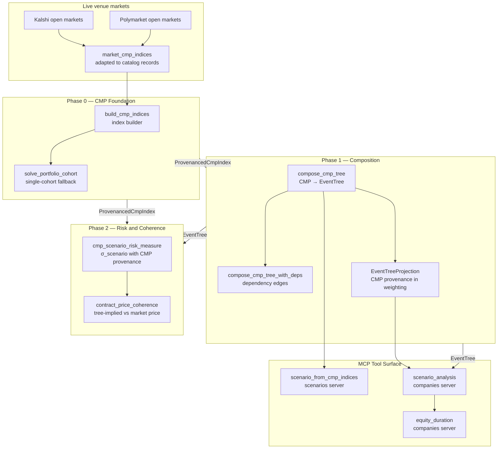
```mermaid
graph TD
    subgraph venues["Live venue markets"]
        kalshi["Kalshi open markets"]
        gamma["Polymarket open markets"]
        contracts["market_cmp_indices<br/>adapted to catalog records"]
    end

    subgraph phase0["Phase 0 — CMP Foundation"]
        direction TB
        build["build_cmp_indices<br/>index builder"]
        cohort["solve_portfolio_cohort<br/>single-cohort fallback"]
        build --> cohort
    end

    subgraph phase1["Phase 1 — Composition"]
        direction TB
        compose["compose_cmp_tree<br/>CMP → EventTree"]
        deps["compose_cmp_tree_with_deps<br/>dependency edges"]
        tree_weight["EventTreeProjection<br/>CMP provenance in weighting"]
        compose --> deps
        compose --> tree_weight
    end

    subgraph phase2["Phase 2 — Risk and Coherence"]
        direction TB
        risk["cmp_scenario_risk_measure<br/>σ_scenario with CMP provenance"]
        coherence["contract_price_coherence<br/>tree-implied vs market price"]
        risk --> coherence
    end

    subgraph mcp_tools["MCP Tool Surface"]
        direction TB
        tool_cmp["scenario_from_cmp_indices<br/>scenarios server"]
        tool_analysis["scenario_analysis<br/>companies server"]
        tool_duration["equity_duration<br/>companies server"]
    end

    kalshi --> contracts
    gamma --> contracts
    contracts --> build
    phase0 -->|"ProvenancedCmpIndex"| phase1
    phase0 -->|"ProvenancedCmpIndex"| phase2
    phase1 -->|"EventTree"| phase2
    phase1 -->|"EventTree"| tool_analysis
    compose --> tool_cmp
    tree_weight --> tool_analysis
    tool_analysis --> tool_duration
```

<!-- DIAGRAM_ALIGNMENT
id: DIAG-CMP-ARCH-001
verified_date: 2026-09-28
verified_against: kask/crates/hkask-forecast/src/hkask_forecast.rs (cmp_scenario_risk_measure L612, contract_price_coherence L681, duration_vs_cmp_tenors L741); kask/mcp-servers/hkask-mcp-prediction-markets/src/cmp_index_builder.rs (build_cmp_indices_from_lines L580); kask/mcp-servers/hkask-mcp-prediction-markets/src/cmp_portfolio.rs (solve_portfolio_cohort L477); kask/mcp-servers/hkask-mcp-prediction-markets/src/hkask_mcp_prediction_markets.rs (market_cmp_indices L1298); kask/mcp-servers/hkask-mcp-scenarios/src/hkask_mcp_scenarios.rs (scenario_from_cmp_indices L574); kask/mcp-servers/hkask-mcp-scenarios/src/superforecast/compose.rs (compose_cmp_tree L252, compose_cmp_tree_with_deps L311); kask/mcp-servers/hkask-mcp-companies/src/tools/analytics.rs (scenario_analysis L266); kask/mcp-servers/hkask-mcp-companies/src/tools/valuation.rs (equity_duration L414); kask/mcp-servers/hkask-mcp-companies/src/superforecast.rs (EventTreeProjection L220)
status: VERIFIED
-->

### Phase 0 — CMP Foundation

Each index is a weighted portfolio of real contracts whose weighted-average
maturity matches a fixed target (1m/3m/6m). The time axis is taken out of the
equation so the only thing that moves is the probability.

The agent-reachable entry point is the `market_cmp_indices` MCP tool
(hkask-mcp-prediction-markets): it fetches live open markets, adapts them to
the catalog-record shapes, and runs the index builder below. Its output —
`ProvenancedCmpIndex[]` — is the producer for `scenario_from_cmp_indices`
(hkask-mcp-scenarios).

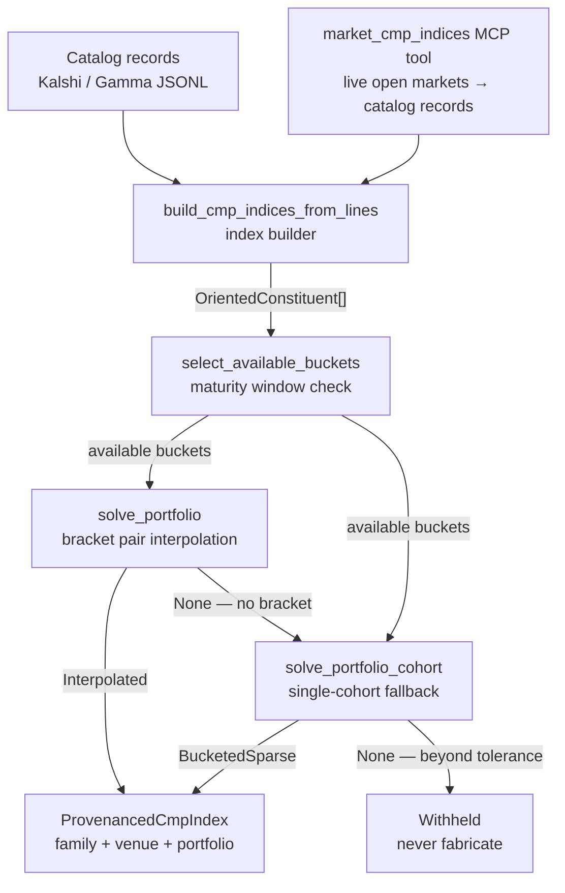
```mermaid
flowchart TD
    tool["market_cmp_indices MCP tool<br/>live open markets → catalog records"]
    records["Catalog records<br/>Kalshi / Gamma JSONL"] --> build["build_cmp_indices_from_lines<br/>index builder"]
    tool --> build
    build -->|"OrientedConstituent[]"| buckets["select_available_buckets<br/>maturity window check"]
    buckets -->|"available buckets"| bracket["solve_portfolio<br/>bracket pair interpolation"]
    buckets -->|"available buckets"| cohort["solve_portfolio_cohort<br/>single-cohort fallback"]
    bracket -->|"Interpolated"| index["ProvenancedCmpIndex<br/>family + venue + portfolio"]
    cohort -->|"BucketedSparse"| index
    bracket -->|"None — no bracket"| cohort
    cohort -->|"None — beyond tolerance"| withhold["Withheld<br/>never fabricate"]
```

<!-- DIAGRAM_ALIGNMENT
id: DIAG-CMP-ARCH-002
verified_date: 2026-09-28
verified_against: kask/mcp-servers/hkask-mcp-prediction-markets/src/cmp_index_builder.rs (build_oriented_constituents L322, build_cmp_indices_from_lines L580); kask/mcp-servers/hkask-mcp-prediction-markets/src/cmp_portfolio.rs (select_available_buckets L201, solve_portfolio L392, solve_portfolio_cohort L477); kask/mcp-servers/hkask-mcp-prediction-markets/src/hkask_mcp_prediction_markets.rs (market_cmp_indices L1298)
status: VERIFIED
-->

### Phase 1 — Composition

CMP indices flow into the scenario composition machinery. Each index becomes
a root `ScenarioEvent` with its index probability as the prior. The tree
cites the index identity (`cmp:{family}:{tenor}:{orientation}`), not a
decaying contract. Optional dependency edges between indices enable joint
probability computation.

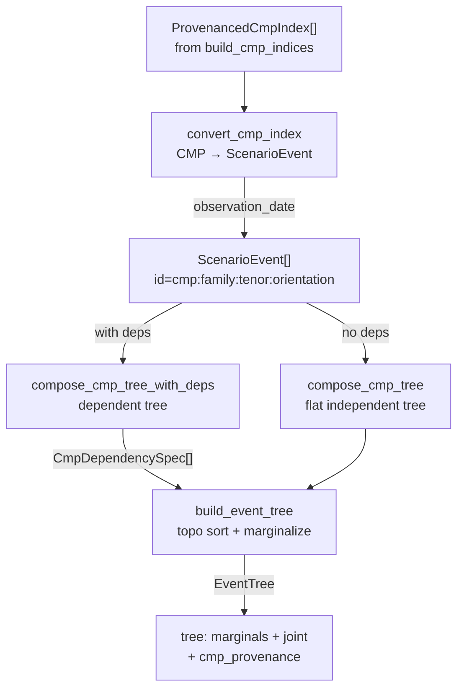
```mermaid
flowchart TD
    indices["ProvenancedCmpIndex[]<br/>from build_cmp_indices"] --> convert["convert_cmp_index<br/>CMP → ScenarioEvent"]
    convert -->|"observation_date"| events["ScenarioEvent[]<br/>id=cmp:family:tenor:orientation"]
    events -->|"no deps"| flat["compose_cmp_tree<br/>flat independent tree"]
    events -->|"with deps"| dep_tree["compose_cmp_tree_with_deps<br/>dependent tree"]
    dep_tree -->|"CmpDependencySpec[]"| build["build_event_tree<br/>topo sort + marginalize"]
    flat --> build
    build -->|"EventTree"| output["tree: marginals + joint<br/>+ cmp_provenance"]
```

<!-- DIAGRAM_ALIGNMENT
id: DIAG-CMP-ARCH-003
verified_date: 2026-09-28
verified_against: kask/mcp-servers/hkask-mcp-scenarios/src/hkask_mcp_scenarios.rs (scenario_from_cmp_indices L574-640, convert_cmp_index format L620); kask/mcp-servers/hkask-mcp-scenarios/src/superforecast/compose.rs (compose_cmp_tree L252, compose_cmp_tree_with_deps L311, convert_cmp_index L183 — called at hkask_mcp_scenarios.rs L601-603); kask/mcp-servers/hkask-mcp-scenarios/src/requests.rs (CmpDependencySpecRequest L125)
status: VERIFIED
-->

### Phase 2 — Risk and Coherence

The risk measure computes σ_scenario over CMP-controlled branches. The
coherence measure compares tree-implied joint probabilities against observed
market prices within a transaction-cost band. The former falsification
consumers (duration and coherence tests, `falsification_log`) were
deleted; the measures themselves remain in `hkask_forecast.rs`.

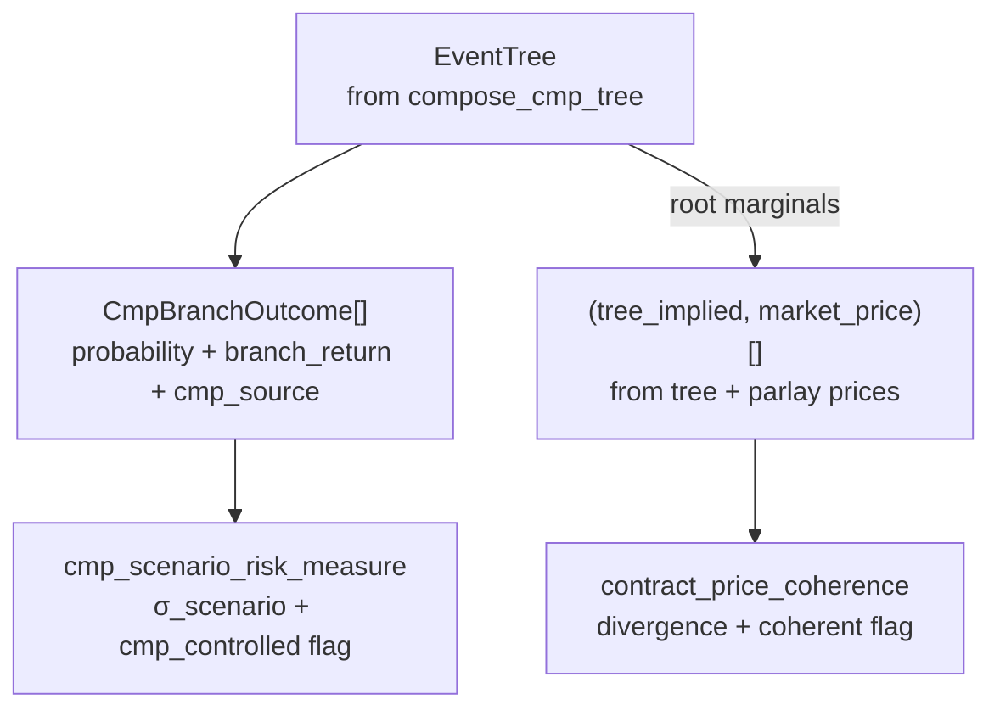
```mermaid
flowchart TD
    tree["EventTree<br/>from compose_cmp_tree"] --> branches["CmpBranchOutcome[]<br/>probability + branch_return + cmp_source"]
    branches --> risk["cmp_scenario_risk_measure<br/>σ_scenario + cmp_controlled flag"]
    tree -->|"root marginals"| pairs["(tree_implied, market_price)[]<br/>from tree + parlay prices"]
    pairs --> coherence["contract_price_coherence<br/>divergence + coherent flag"]
```

<!-- DIAGRAM_ALIGNMENT
id: DIAG-CMP-ARCH-004
verified_date: 2026-09-28
verified_against: kask/crates/hkask-forecast/src/hkask_forecast.rs (cmp_scenario_risk_measure L612, contract_price_coherence L681); falsification.rs deleted — falsification_log / h2_duration_test / h3_coherence_test no longer exist in kask/crates/hkask-forecast/src/ (only hkask_forecast.rs and property_tests.rs remain)
status: VERIFIED
-->

### Crate dependency graph

The pure-math crate `hkask-forecast` has no MCP dependencies. The three MCP
servers depend on it for the shared computation engine. The scenarios server
depends on the prediction-markets server for the `ProvenancedCmpIndex` type.
The companies server does not depend on the scenarios server (the integration
seam is caller-mediated paste bridging via `EventTreeProjection`).

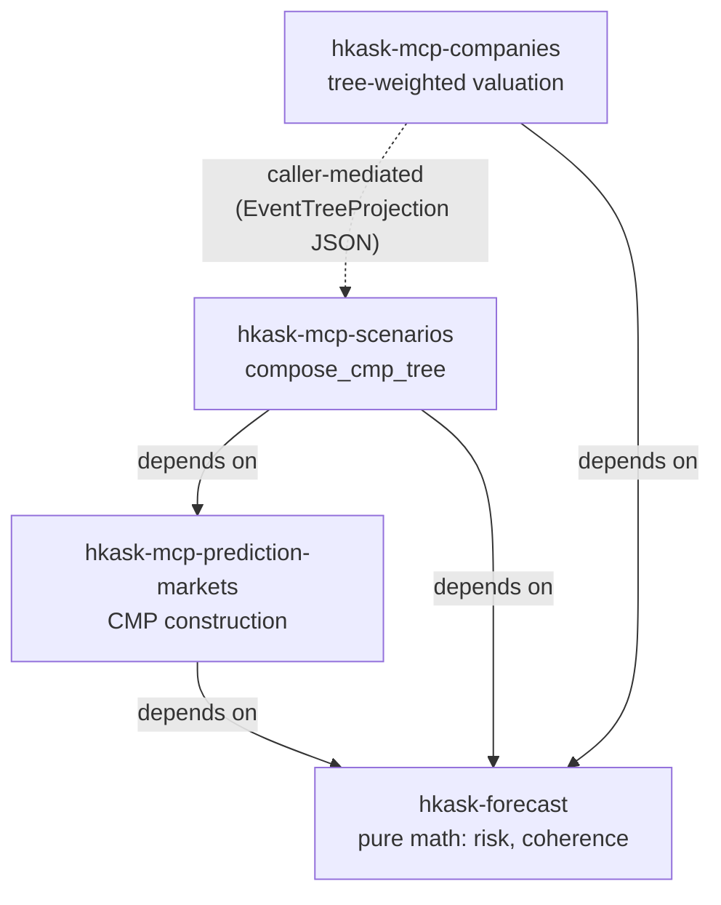
```mermaid
graph TD
    forecast["hkask-forecast<br/>pure math: risk, coherence"]
    pm["hkask-mcp-prediction-markets<br/>CMP construction"]
    scenarios["hkask-mcp-scenarios<br/>compose_cmp_tree"]
    companies["hkask-mcp-companies<br/>tree-weighted valuation"]

    pm -->|"depends on"| forecast
    scenarios -->|"depends on"| forecast
    scenarios -->|"depends on"| pm
    companies -->|"depends on"| forecast
    companies -.->|"caller-mediated<br/>(EventTreeProjection JSON)"| scenarios
```

<!-- DIAGRAM_ALIGNMENT
id: DIAG-CMP-ARCH-005
verified_date: 2026-09-28
verified_against: kask/crates/hkask-forecast/Cargo.toml (no hkask-mcp deps); kask/mcp-servers/hkask-mcp-prediction-markets/Cargo.toml (hkask-forecast L20); kask/mcp-servers/hkask-mcp-scenarios/Cargo.toml (hkask-forecast L29, hkask-mcp-prediction-markets L30); kask/mcp-servers/hkask-mcp-companies/Cargo.toml (hkask-forecast L40)
status: VERIFIED
-->

## Ontology Bridge

The ontology bridge is a single shared crate (`hkask-bridge-ontology`) that
owns all ontology vocabulary and the domain-selection logic. No ontology
vocabulary lives inside any MCP server; every crate that does tagging or
anchoring depends on this crate.

**Regenerated (2026-09-28):** the crate is now organized around the P8.3
ladder — `eso.rs` and `sdmx.rs` are gone; `data_cube.rs` (RDF Data Cube),
`derived.rs`, `ontology_graph.rs`, `published.rs`, `rdf.rs`, `schema_org.rs`,
and `term_resolution.rs` were added (`hkask_bridge_ontology.rs` L94-112 —
16 `pub mod` entries). The dependent set grew from 12 to 16 crates:
`hkask-mcp-kata-kanban`, `crates/agent`, `hkask-types`, and `kask_bridge`
now depend on the crate alongside the previous 12.

```mermaid
graph TD
    subgraph shared["hkask-bridge-ontology — shared crate"]
        direction TB
        axis["axis.rs<br/>domain-selection dispatch"]
        subgraph vocab["Pinned vocabulary modules"]
            direction TB
            data_cube["data_cube.rs<br/>RDF Data Cube"]
            dc_bibo["dc_bibo.rs<br/>DC + BIBO + CiTO"]
            fibo["fibo.rs<br/>FIBO"]
            golem["golem.rs<br/>GOLEM"]
            ml_schema["ml_schema.rs<br/>ML-Schema"]
            omc["omc.rs<br/>OMC"]
            pko["pko.rs<br/>PKO"]
            schema_org["schema_org.rs<br/>schema.org"]
            sepio["sepio.rs<br/>SEPIO"]
            sumo["sumo.rs<br/>SUMO upper"]
        end
        subgraph ladder["Ladder and resolution modules"]
            direction TB
            derived["derived.rs<br/>derived concepts"]
            ontology_graph["ontology_graph.rs<br/>graph walk"]
            published["published.rs<br/>published senses"]
            rdf["rdf.rs<br/>RDF core"]
            term_resolution["term_resolution.rs<br/>P8.3 ladder"]
        end
    end

    subgraph deps["Dependents — 16 crates"]
        direction TB
        subgraph kask_crates["kask crates"]
            condenser["hkask-condenser"]
            types["hkask-types"]
            bridge["kask_bridge"]
        end
        subgraph zed_crates["zed-side crates"]
            agent["crates/agent"]
            media_widget["hkask-media-widget"]
            portfolio_widget["hkask-portfolio-widget"]
        end
        subgraph servers["MCP servers"]
            companies["hkask-mcp-companies"]
            corpus["hkask-mcp-corpus"]
            kata_kanban["hkask-mcp-kata-kanban"]
            media["hkask-mcp-media"]
            portfolio["hkask-mcp-portfolio"]
            pm["hkask-mcp-prediction-markets"]
            research["hkask-mcp-research"]
            scenarios["hkask-mcp-scenarios"]
            swarm["hkask-mcp-swarm"]
            training["hkask-mcp-training"]
        end
    end

    condenser -->|"depends on"| shared
    types -->|"depends on"| shared
    bridge -->|"depends on"| shared
    agent -->|"depends on"| shared
    media_widget -->|"depends on"| shared
    portfolio_widget -->|"depends on"| shared
    companies -->|"depends on"| shared
    corpus -->|"depends on"| shared
    kata_kanban -->|"depends on"| shared
    media -->|"depends on"| shared
    portfolio -->|"depends on"| shared
    pm -->|"depends on"| shared
    research -->|"depends on"| shared
    scenarios -->|"depends on"| shared
    swarm -->|"depends on"| shared
    training -->|"depends on"| shared
```

<!-- DIAGRAM_ALIGNMENT
id: DIAG-ONT-001
verified_date: 2026-09-28
verified_against: kask/crates/hkask-bridge-ontology/src/hkask_bridge_ontology.rs (pub mod axis L94, data_cube L95, dc_bibo L96, derived L97, fibo L98, golem L99, ml_schema L100, omc L101, ontology_graph L102, pko L103, published L104, rdf L107, schema_org L108, sepio L110, sumo L111, term_resolution L112); dependent Cargo.tomls — kask/crates/hkask-condenser, kask/crates/hkask-types (L19), kask/crates/kask_bridge (L16), crates/agent (L48), crates/hkask-media-widget, crates/hkask-portfolio-widget, kask/mcp-servers/{companies, corpus, kata-kanban (L22), media, portfolio, prediction-markets, research, scenarios, swarm, training}
status: VERIFIED
-->

### The dual-axis / domain-supplement dispatch

`select_ontology_anchor` matches the domain hint by keyword token (exact,
prefix, or `_`/space-delimited token — no substring false positives) and
returns a `DualAxis` anchor (DC+BIBO or PKO), a `DomainSupplement` anchor
(DataCube, FIBO, SEPIO, GOLEM, ML-Schema, OMC), the `Core` interrogative
ground for an empty hint, or SUMO for unknown domains.

**Regenerated (2026-09-28):** the SDMX anchor is gone — only explicitly
cube-shaped output (`data_cube` / `data-cube` / `statistical_cube`) takes
the RDF Data Cube anchor, and other statistics fall through to SUMO; an OMC
branch (media tool-name tokens) was added; prediction markets route to
DC+BIBO (a market is a general entity, not a FIBO financial instrument);
forecast/scenario moved from FIBO to PKO (processes); the FIBO keyword list
narrowed to FIBO's actual data space; `wallet` was dropped from the
file/web/registry arm (operator decision 2026-08-29, pinned in `axis.rs`
tests).

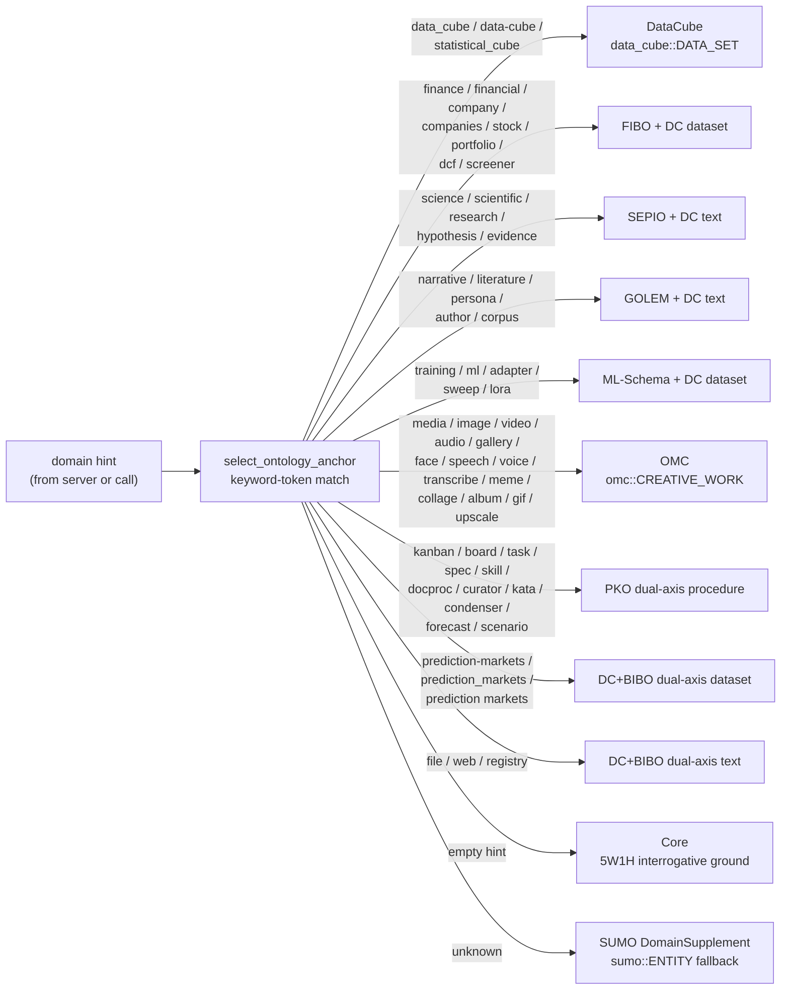
```mermaid
flowchart LR
    domain["domain hint<br/>(from server or call)"]
    select["select_ontology_anchor<br/>keyword-token match"]
    domain --> select
    select -->|"data_cube / data-cube /<br/>statistical_cube"| dcube_anchor["DataCube<br/>data_cube::DATA_SET"]
    select -->|"finance / financial / company /<br/>companies / stock / portfolio /<br/>dcf / screener"| fibo_anchor["FIBO + DC dataset"]
    select -->|"science / scientific / research /<br/>hypothesis / evidence"| sepio_anchor["SEPIO + DC text"]
    select -->|"narrative / literature / persona /<br/>author / corpus"| golem_anchor["GOLEM + DC text"]
    select -->|"training / ml / adapter /<br/>sweep / lora"| ml_anchor["ML-Schema + DC dataset"]
    select -->|"media / image / video / audio / gallery /<br/>face / speech / voice / transcribe / meme /<br/>collage / album / gif / upscale"| omc_anchor["OMC<br/>omc::CREATIVE_WORK"]
    select -->|"kanban / board / task / spec / skill /<br/>docproc / curator / kata / condenser /<br/>forecast / scenario"| pko_anchor["PKO dual-axis procedure"]
    select -->|"prediction-markets /<br/>prediction_markets /<br/>prediction markets"| pm_anchor["DC+BIBO dual-axis dataset"]
    select -->|"file / web / registry"| dc_anchor["DC+BIBO dual-axis text"]
    select -->|"empty hint"| core["Core<br/>5W1H interrogative ground"]
    select -->|"unknown"| sumo_anchor["SUMO DomainSupplement<br/>sumo::ENTITY fallback"]
```

<!-- DIAGRAM_ALIGNMENT
id: DIAG-ONT-002
verified_date: 2026-09-28
verified_against: kask/crates/hkask-bridge-ontology/src/axis.rs (select_ontology_anchor L207-381, matches_kw token matching L213-221, DataCube branch L222-230, FIBO branch L237-254, SEPIO branch L256-270, GOLEM branch L272-287, ML-Schema branch L288-297, OMC branch L298-327, PKO DualAxis branch L328-349, prediction-markets DC+BIBO branch L350-366, file/web/registry DC+BIBO branch L367-372, empty-hint Core L373-377, SUMO universal fallback L378-381)
status: VERIFIED
-->

## Skill ↔ MCP ↔ Lisp Capabilities Seam

The three coupled surfaces: the **skill system** (D1, upstream-Zed body
injection), the **MCP server wiring** (D3), and the **Lisp capabilities
layer** (the `lisp_eval` tool's deterministic primitive).

**Correction (2026-09-28):** the widget→agent compose-back seam (D21) was
retired with commit `fa95c2b8c7` — the `hkask-conversation-injector` crate
and the "I disagree" affordances are deleted. The surviving widget dispatch
path is direct tool dispatch through `hkask_tool_invoker::ToolInvoker` (no
conversation injection).

```mermaid
architecture-beta
    group skill(cloud)[Skill System — D1]
    group mcp(cloud)[MCP Server Wiring — D3]
    group lisp(cloud)[Lisp Capabilities]
    group agent(cloud)[Agent Tool-Use Loop]

    service skilltool(agent)[SkillTool::run<br/>crates/agent/src/tools/skill_tool.rs]
    service envelope(agent)[render_skill_envelope<br/>crates/agent/src/tools/skill_tool.rs]
    service read_body(skill)[agent_skills::read_skill_body<br/>crates/agent_skills/agent_skills.rs]
    service render_template(skill)[render_template tool<br/>crates/agent/src/tools/render_template_tool.rs]

    service lisp_eval(lisp)[lisp_eval tool<br/>crates/agent/src/tools/lisp_eval_tool.rs]
    service lisp_runtime(lisp)[hkask_lisp::eval_sandboxed_with_budget<br/>hkask-lisp/]

    service thread(agent)[Thread::enabled_tools<br/>crates/agent/src/thread.rs]
    service list_mcp_tools(agent)[list_mcp_tools tool<br/>crates/agent/src/tools/list_mcp_tools_tool.rs]

    service tool_port(mcp)[ToolPort trait<br/>hkask-tool-port/src/tool_port.rs]
    service mcp_runtime(mcp)[McpRuntime<br/>hkask-mcp/src/runtime.rs]
    service call_cap(mcp)[CallCapManager<br/>hkask-regulation/src/energy.rs]
    service servers(mcp)[12 MCP servers<br/>kask/mcp-servers/hkask-mcp-*]

    service unwrap(agent)[unwrap_tool_envelope<br/>hkask-types/src/tool_response.rs]

    skilltool --> read_body: reads SKILL.md body from disk
    skilltool --> envelope: injects body into agent context
    envelope --> agent: model reads body and follows instructions
    agent --> render_template: structured prompt scaffolding (model-coordinated)
    agent --> lisp_eval: deterministic checks (model-coordinated)
    lisp_eval --> lisp_runtime: eval_sandboxed_with_budget

    thread --> tool_port: full registered surface every turn (D44 — no per-turn filtering)
    list_mcp_tools --> thread: enumerates registered surface on demand
    tool_port --> mcp_runtime: invoke(server, tool, args, agent)
    mcp_runtime --> call_cap: charge_call_metered(agent)
    mcp_runtime --> servers: dispatch over stdio
    mcp_runtime --> unwrap: result is {"content": value}
```

<!-- DIAGRAM_ALIGNMENT
id: DIAG-ARCH-SKILL-MCP-LISP-001
verified_date: 2026-09-28
verified_against: crates/agent/src/tools/skill_tool.rs (SkillTool L127, run L194, render_skill_envelope L48, with_invoker L162); crates/agent_skills/agent_skills.rs (read_skill_body L841); crates/agent/src/tools/lisp_eval_tool.rs (LispEvalTool L103); crates/agent/src/tools/render_template_tool.rs (RenderTemplateTool L63); crates/agent/src/thread.rs (enabled_tools L5156); crates/agent/src/tools/list_mcp_tools_tool.rs (ListMcpToolsTool L58, enumerate_tool_listing L119); kask/crates/hkask-lisp/src/hkask_lisp.rs (eval_sandboxed_with_budget L1737); kask/crates/hkask-tool-port/src/tool_port.rs (ToolPort L89); kask/crates/hkask-mcp/src/runtime.rs (impl ToolPort for McpRuntime L1530); kask/crates/hkask-regulation/src/energy.rs (CallCapManager, DEFAULT_RUNAWAY_CALL_CEILING L26); kask/crates/hkask-types/src/tool_response.rs (unwrap_tool_envelope L61); kask/crates/kask_bridge/src/mcp_servers.rs (BUILT_IN_MCP_SERVERS L55 — 12 servers incl. media and spreadsheet); crates/hkask-tool-invoker/src/hkask_tool_invoker.rs (ToolInvoker trait L121, shared_tool_invoker L148)
status: VERIFIED
-->

The two dispatch paths into `ToolPort::invoke`:

| Caller | Entry point | Action | Resolves to |
| --- | --- | --- | --- |
| Agent tool-use loop (LLM-decided) | `Thread::enabled_tools` (profile + delegation filters, D44 — no per-turn router) | LLM emits a tool_use event | `ToolPort::invoke` under the agent's `WebID` |
| Widget direct dispatch | `hkask_tool_invoker::ToolInvoker` impls | UI gesture (kanban move, portfolio scrub, scenarios rung, spreadsheet save) | `ToolPort::invoke` under the `swarm-panel` persona |

Both share the same metering (`CallCapManager::charge_metered`), the same
`reg.tool.*` span emission, and the same `unwrap_tool_envelope` result seam.
The only pre-dispatch refusal is `ToolPortError::EnergyBudgetExceeded` (the
runaway-loop breaker). The model decides every tool call; skills do not
dispatch MCP tools deterministically.

The 12 on-disk MCP servers are enumerated by `BUILT_IN_MCP_SERVERS` in
`kask/crates/kask_bridge/src/mcp_servers.rs`: `portfolio`, `companies`,
`corpus`, `curator`, `kata-kanban`, `research`, `scenarios`,
`prediction-markets`, `swarm`, `training`, `media`, `spreadsheet`.

## Credential Resolution Chain

API keys are stored in zed's `CredentialsProvider` keychain — one key,
one location: data-service keys under `kask://credentials/<key>`,
inference-provider keys at their provider `api_url` slots.
`build_mcp_server_env` reads both slot kinds and injects as env vars into
MCP server child processes. The server's `resolve_credential` reads API
keys from env only — there is no keychain fallback for API keys.
`HKASK_DB_PASSPHRASE` resolves via the canonical 2-tier helper
(ctx.credentials → env → `kask://credentials/hkask_db_passphrase`); there
is no `HKASK_SWARM_MEMORY_PASSPHRASE` — one passphrase covers every
SQLCipher DB.
Writes/deletes to any credential URL that feeds MCP server env must call
`nudge_mcp_servers` to re-fire the `SettingsStore` observer and restart
changed servers. Verified current 2026-08-31.

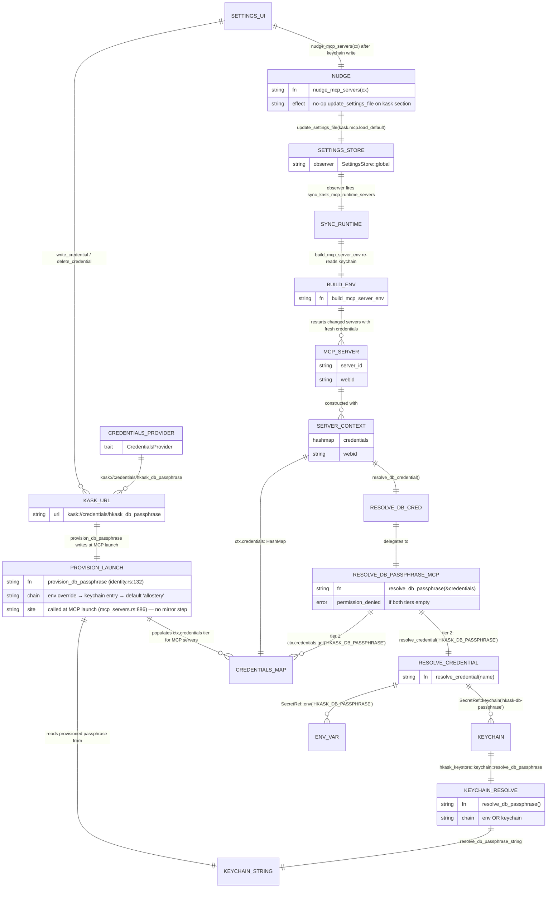
```mermaid
erDiagram
    MCP_SERVER ||--o{ SERVER_CONTEXT : "constructed with"
    SERVER_CONTEXT ||--|| CREDENTIALS_MAP : "ctx.credentials: HashMap<String,String>"
    SERVER_CONTEXT ||--|| RESOLVE_DB_CRED : "resolve_db_credential()"
    RESOLVE_DB_CRED ||--|| RESOLVE_DB_PASSPHRASE_MCP : "delegates to"
    RESOLVE_DB_PASSPHRASE_MCP ||--o{ CREDENTIALS_MAP : "tier 1: ctx.credentials.get('HKASK_DB_PASSPHRASE')"
    RESOLVE_DB_PASSPHRASE_MCP ||--|| RESOLVE_CREDENTIAL : "tier 2: resolve_credential('HKASK_DB_PASSPHRASE')"
    RESOLVE_CREDENTIAL ||--o{ ENV_VAR : "SecretRef::env('HKASK_DB_PASSPHRASE')"
    RESOLVE_CREDENTIAL ||--o{ KEYCHAIN : "SecretRef::keychain('hkask-db-passphrase')"
    KEYCHAIN ||--|| KEYCHAIN_RESOLVE : "hkask_keystore::keychain::resolve_db_passphrase"
    KEYCHAIN_RESOLVE ||--|| KEYCHAIN_STRING : "resolve_db_passphrase_string"

    CREDENTIALS_PROVIDER ||--o{ KASK_URL : "kask://credentials/hkask_db_passphrase"
    KASK_URL ||--|| PROVISION_LAUNCH : "provision_db_passphrase writes at MCP launch"
    PROVISION_LAUNCH ||--|| KEYCHAIN_STRING : "reads provisioned passphrase from"
    PROVISION_LAUNCH ||--o{ CREDENTIALS_MAP : "populates ctx.credentials tier for MCP servers"

    SETTINGS_UI ||--o{ KASK_URL : "write_credential / delete_credential"
    SETTINGS_UI ||--|| NUDGE : "nudge_mcp_servers(cx) after keychain write"
    NUDGE ||--|| SETTINGS_STORE : "update_settings_file(kask.mcp.load_default)"
    SETTINGS_STORE ||--|| SYNC_RUNTIME : "observer fires sync_kask_mcp_runtime_servers"
    SYNC_RUNTIME ||--|| BUILD_ENV : "build_mcp_server_env re-reads keychain"
    BUILD_ENV ||--o{ MCP_SERVER : "restarts changed servers with fresh credentials"

    MCP_SERVER {
        string server_id
        string webid
    }
    SERVER_CONTEXT {
        hashmap credentials
        string webid
    }
    RESOLVE_DB_PASSPHRASE_MCP {
        string fn "resolve_db_passphrase(&credentials)"
        error permission_denied "if both tiers empty"
    }
    RESOLVE_CREDENTIAL {
        string fn "resolve_credential(name)"
    }
    KEYCHAIN_RESOLVE {
        string fn "resolve_db_passphrase()"
        string chain "env OR keychain"
    }
    CREDENTIALS_PROVIDER {
        trait CredentialsProvider
    }
    KASK_URL {
        string url "kask://credentials/hkask_db_passphrase"
    }
    PROVISION_LAUNCH {
        string fn "provision_db_passphrase (identity.rs:132)"
        string chain "env override → keychain entry → default 'allostery'"
        string site "called at MCP launch (mcp_servers.rs:886) — no mirror step"
    }
    NUDGE {
        string fn "nudge_mcp_servers(cx)"
        string effect "no-op update_settings_file on kask section"
    }
    SETTINGS_STORE {
        string observer "SettingsStore::global"
    }
    BUILD_ENV {
        string fn "build_mcp_server_env"
    }
```

<!-- DIAGRAM_ALIGNMENT
id: DIAG-ERD-CREDENTIAL-RESOLUTION-001
verified_date: 2026-09-28
verified_against: kask/crates/hkask-mcp-server/src/server/credentials.rs (resolve_credential L25, resolve_db_passphrase L76); kask/crates/hkask-mcp-server/src/server/context.rs (ServerContext::resolve_db_credential L140); kask/crates/hkask-keystore/src/keychain.rs (resolve_db_passphrase L347, resolve_db_passphrase_string L362); kask/crates/kask_bridge/src/identity.rs (provision_db_passphrase L132, provision_agent L87); kask/crates/kask_bridge/src/mcp_servers.rs (provision_default_passphrase launch path L886); crates/settings_ui/src/pages/kask_page.rs (write_credential L241, nudge_mcp_servers L280, delete_credential L285)
status: VERIFIED
-->

The 2-tier chain: `hkask_mcp_server::server::resolve_db_passphrase(&credentials)`
returns `McpToolError::permission_denied` naming the env var and keychain URL
when both tiers are empty — a missing credential is an authorization failure,
not a transient unavailability. `provision_db_passphrase`
(`kask/crates/kask_bridge/src/identity.rs:132`) is idempotent (env override →
existing keychain entry → default `"allostery"`) and runs at governed MCP
server launch (`kask/crates/kask_bridge/src/mcp_servers.rs:886`); a failed
provision logs a `tracing::warn!` naming the env var and the server fails
with `permission_denied` at tool time.

## hKask Tool Port

The `hkask-tool-port` crate holds the dispatch port only — no tokens, no
authorization check, no information-flow labels (the per-call capability
gate and the FIDES taint lattice were removed 2026-08-12).
`McpRuntime::invoke` meters the call and dispatches it; the only pre-dispatch
refusal is the runaway-loop breaker. Verified current.

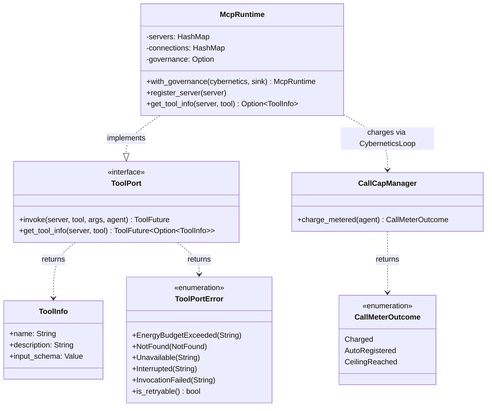
```mermaid
classDiagram
    class ToolPort {
        <<interface>>
        +invoke(server, tool, args, agent) ToolFuture
        +get_tool_info(server, tool) ToolFuture~Option~ToolInfo~~
    }

    class ToolInfo {
        +name: String
        +description: String
        +input_schema: Value
    }

    class ToolPortError {
        <<enumeration>>
        +EnergyBudgetExceeded(String)
        +NotFound(NotFound)
        +Unavailable(String)
        +Interrupted(String)
        +InvocationFailed(String)
        +is_retryable() bool
    }

    class McpRuntime {
        -servers: HashMap
        -connections: HashMap
        -governance: Option
        +with_governance(cybernetics, sink) McpRuntime
        +register_server(server)
        +get_tool_info(server, tool) Option~ToolInfo~
    }

    class CallCapManager {
        +charge_metered(agent) CallMeterOutcome
    }

    class CallMeterOutcome {
        <<enumeration>>
        Charged
        AutoRegistered
        CeilingReached
    }

    ToolPort ..> ToolInfo : returns
    ToolPort ..> ToolPortError : returns
    McpRuntime ..|> ToolPort : implements
    McpRuntime ..> CallCapManager : charges via CyberneticsLoop
    CallCapManager ..> CallMeterOutcome : returns
```

<!-- DIAGRAM_ALIGNMENT
id: DIAG-CAP-001
verified_date: 2026-09-28
verified_against: kask/crates/hkask-tool-port/src/tool_port.rs (ToolPort trait L89-116, ToolInfo L121, ToolPortError variants L8-38, is_retryable L50-51); kask/crates/hkask-tool-port/src/hkask_tool_port.rs; kask/crates/hkask-mcp/src/runtime.rs (impl ToolPort for McpRuntime L1530, McpRuntime struct L484, governance L501); kask/crates/hkask-regulation/src/energy.rs (CallMeterOutcome L30-40, DEFAULT_RUNAWAY_CALL_CEILING L26)
status: VERIFIED
-->

Authority lives outside this crate: the per-request `tool_allowlist` on the
inference IPC dispatch, each swarm card's `mcp_tools` allowlist, and the
per-server MCP env/credential allowlists. `invoke`'s `agent: WebID` is an
accounting identity, not a credential.

## hKask Event Store

The `hkask-event-store` crate is the append-only event log for agent
rollouts. It captures `model_request` and `verdict` events produced by local
swarm delegations, harness runs, and (reserved) curator turns. Wired into the
composition root via `kask_bridge/src/rollout_event_bridge.rs` and consumed
by `hkask-regulation/src/cybernetics_loop.rs`. Verified current.

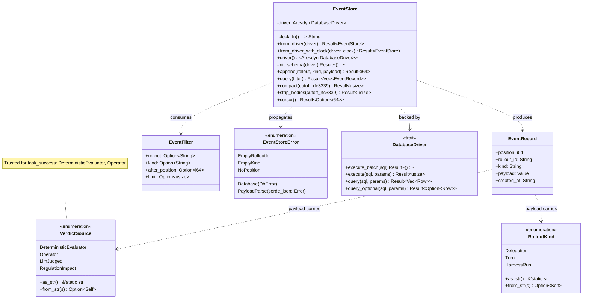
```mermaid
classDiagram
    class EventStore {
        -driver: Arc~dyn DatabaseDriver~
        -clock: fn() -> String
        +from_driver(driver) Result~EventStore~
        +from_driver_with_clock(driver, clock) Result~EventStore~
        +driver() ~Arc~dyn DatabaseDriver~~
        -init_schema(driver) Result~()~
        +append(rollout, kind, payload) Result~i64~
        +query(filter) Result~Vec~EventRecord~~
        +compact(cutoff_rfc3339) Result~usize~
        +strip_bodies(cutoff_rfc3339) Result~usize~
        +cursor() Result~Option~i64~~
    }
    class EventRecord {
        +position: i64
        +rollout_id: String
        +kind: String
        +payload: Value
        +created_at: String
    }
    class EventFilter {
        +rollout: Option~String~
        +kind: Option~String~
        +after_position: Option~i64~
        +limit: Option~usize~
    }
    class EventStoreError {
        <<enumeration>>
        Database(DbError)
        PayloadParse(serde_json::Error)
        EmptyRolloutId
        EmptyKind
        NoPosition
    }
    class VerdictSource {
        <<enumeration>>
        DeterministicEvaluator
        Operator
        LlmJudged
        RegulationImpact
        +as_str() &'static str
        +from_str(s) Option~Self~

    }
    class RolloutKind {
        <<enumeration>>
        Delegation
        Turn
        HarnessRun
        +as_str() &'static str
        +from_str(s) Option~Self~
    }
    class DatabaseDriver {
        <<trait>>
        +execute_batch(sql) Result~()~
        +execute(sql, params) Result~usize~
        +query(sql, params) Result~Vec~Row~~
        +query_optional(sql, params) Result~Option~Row~~
    }

    EventStore --> DatabaseDriver : backed by
    EventStore ..> EventRecord : produces
    EventStore ..> EventFilter : consumes
    EventStore ..> EventStoreError : propagates
    EventRecord ..> VerdictSource : payload carries
    EventRecord ..> RolloutKind : payload carries
    note for VerdictSource "Trusted for task_success: DeterministicEvaluator, Operator"
```

<!-- DIAGRAM_ALIGNMENT
id: DIAG-ES-001
verified_date: 2026-09-28
verified_against: kask/crates/hkask-event-store/src/hkask_event_store.rs (from_driver L62, from_driver_with_clock L71, driver L80, init_schema L86, append L93, query L134, compact L179, strip_bodies L200, cursor L212); kask/crates/hkask-event-store/src/types.rs (VerdictSource L43, RolloutKind L95, EventStoreError L168); kask/crates/kask_bridge/src/rollout_event_bridge.rs; kask/crates/hkask-regulation/src/cybernetics_loop.rs
status: VERIFIED
-->

`VerdictSource` trust classification: `DeterministicEvaluator` and `Operator`
are trusted for task success; `LlmJudged` is not (the determinism constraint
forbids an LLM judging `task_success`); `RegulationImpact` is a before/after
measurement, not a task-success check.

## hKask Viz-Core

`hkask-viz-core` is the D18 composition root for the viz widgets. It
composes every widget into one `BlockRenderer` callback and caches widget
entities by a hash of the block body so state survives the per-token
re-renders of the streaming chat.

**Corrections (2026-08-28, updated 2026-09-28):** the per-widget `create_*`
factory functions were replaced by a `VizWidget` trait (`VIZ_TAG` /
`LOG_PREFIX` / `parse_body` / `viz_of` / `new_widget`) with a shared
`try_create` guard and an ordered `viz_factories()` registry — now of **six**
widgets (graph, kanban, portfolio, scenarios, spreadsheet, swarm; the
spreadsheet widget was added with the LogiSheets workbook what-if).
`block_renderer` tries the media widget
(`hkask_media_widget::create_media_widget`, discriminates on `kind`, needs
`Window`) first, then the registered viz widgets (discriminate on `viz`).
`CachedWidget` is a single erased render closure (replacing the former
per-variant enum).

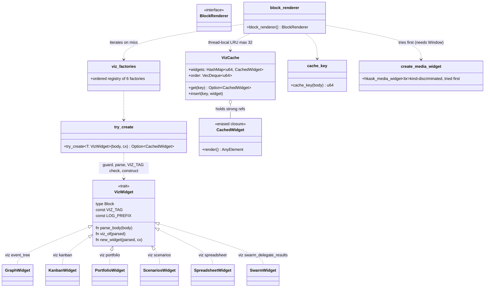
```mermaid
classDiagram
    class BlockRenderer {
        <<interface>>
    }
    class block_renderer {
        +block_renderer() BlockRenderer
    }
    class VizWidget {
        <<trait>>
        type Block
        const VIZ_TAG
        const LOG_PREFIX
        fn parse_body(body)
        fn viz_of(parsed)
        fn new_widget(parsed, cx)
    }
    class try_create {
        +try_create~T: VizWidget~(body, cx) Option~CachedWidget~
    }
    class viz_factories {
        +ordered registry of 6 factories
    }
    class CachedWidget {
        <<erased closure>>
        +render() AnyElement
    }
    class VizCache {
        +widgets: HashMap~u64, CachedWidget~
        +order: VecDeque~u64~
        +get(key) Option~CachedWidget~
        +insert(key, widget)
    }
    class cache_key {
        +cache_key(body) u64
    }
    class create_media_widget {
        +hkask_media_widget<br/>kind-discriminated, tried first
    }

    block_renderer ..> create_media_widget : tries first (needs Window)
    block_renderer ..> viz_factories : iterates on miss
    viz_factories ..> try_create
    try_create ..> VizWidget : guard, parse, VIZ_TAG check, construct
    block_renderer ..> VizCache : thread-local LRU max 32
    block_renderer ..> cache_key
    VizCache o-- CachedWidget : holds strong refs
    VizWidget <|.. GraphWidget : viz event_tree
    VizWidget <|.. KanbanWidget : viz kanban
    VizWidget <|.. PortfolioWidget : viz portfolio
    VizWidget <|.. ScenariosWidget : viz scenarios
    VizWidget <|.. SpreadsheetWidget : viz spreadsheet
    VizWidget <|.. SwarmWidget : viz swarm_delegate_results
```

<!-- DIAGRAM_ALIGNMENT
id: DIAG-VIZ-CORE
verified_date: 2026-09-28
verified_against: crates/hkask-viz-core/src/hkask_viz_core.rs (VizWidget trait L85-96, impls GraphWidget L99 / KanbanWidget L114 / PortfolioWidget L129 / ScenariosWidget L144 / SpreadsheetWidget L159 / SwarmWidget L174, CachedWidget L197, try_create L220, viz_factories L249-257, MAX_CACHE_SIZE L260, VizCache L356, cache_key L395, block_renderer L409); crates/hkask-media-widget/src/hkask_media_widget.rs (create_media_widget L56); crates/agent_ui/src/conversation_view.rs (media_block_renderer wiring L3574)
status: VERIFIED
-->

**Selection order** (intentional): media (`kind`) first, then graph
(`viz: "event_tree"`), kanban (`viz: "kanban"`), portfolio
(`viz: "portfolio"`), scenarios (`viz: "scenarios"`), spreadsheet
(`viz: "spreadsheet"`), swarm (`viz: "swarm_delegate_results"`). The viz
tags are disjoint, so factory order is arbitrary. A body claimed by none
returns `None` and falls through to the default code-block renderer.

**Wiring seam:** `crates/agent_ui/src/conversation_view.rs` —
`render_agent_markdown` calls `.media_block_renderer(hkask_viz_core::block_renderer())`.

## Skill Learning Loop

How the agent and the Curator turn skill and tool use into durable
improvements. It is a cybernetic feedback loop (`onto_anchor` → derived
`cybernetic_feedback_loop`: sense → compare against a set point → act → the
effect is sensed again). The **algedonic review** is the one evaluation
mechanism; its second half, the **gemba walk**, is where skills are evaluated
and proposals decided. Evaluation is separated from execution (operator ruling
2026-09-24, Goodhart's law): executing sessions record and propose, but only
the review records verdicts and accepts changes.

Operator rulings 2026-09-26: capture is always on and covers every agent's
skill use; proposal authority is the operator's by default and may be granted
to the Curator; accepted work is executed by a spawned agent with clear
instructions; nothing is done until verified unless the operator or Curator
explicitly skips verification.

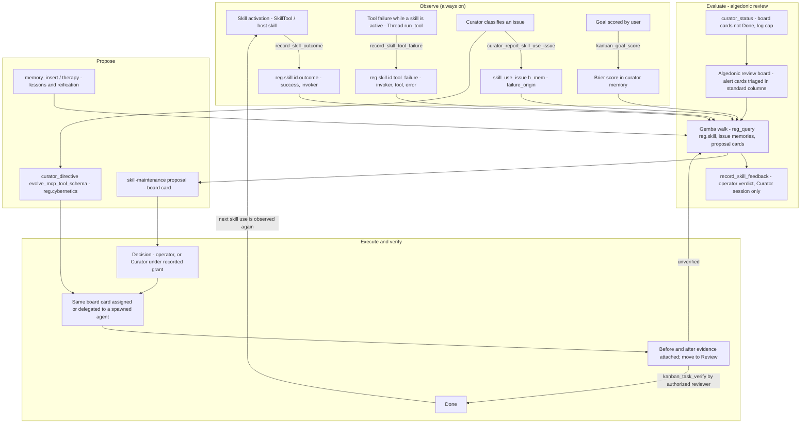
```mermaid
flowchart TD
    subgraph Observe["Observe (always on)"]
        A[Skill activation - SkillTool / host skill] -->|record_skill_outcome| O1[reg.skill.id.outcome - success, invoker]
        B[Tool failure while a skill is active - Thread run_tool] -->|record_skill_tool_failure| O2[reg.skill.id.tool_failure - invoker, tool, error]
        C[Curator classifies an issue] -->|curator_report_skill_use_issue| O3[skill_use_issue h_mem - failure_origin]
        G[Goal scored by user] -->|kanban_goal_score| O4[Brier score in curator memory]
    end
    subgraph Evaluate["Evaluate - algedonic review"]
        S[curator_status - board cards not Done, log cap] --> R[Algedonic review board - alert cards triaged in standard columns]
        R --> W[Gemba walk - reg_query reg.skill, issue memories, proposal cards]
        W --> V[record_skill_feedback - operator verdict, Curator session only]
    end
    subgraph Propose
        P1[skill-maintenance proposal - board card]
        P2[curator_directive evolve_mcp_tool_schema - reg.cybernetics]
        P3[memory_insert / therapy - lessons and reification]
    end
    subgraph Execute["Execute and verify"]
        D[Decision - operator, or Curator under recorded grant] --> K[Same board card assigned or delegated to a spawned agent]
        K --> T[Before and after evidence attached; move to Review]
        T -->|kanban_task_verify by authorized reviewer| Done[Done]
        T -->|unverified| W
    end
    O1 --> W
    O2 --> W
    O3 --> W
    O4 --> W
    W --> P1
    C --> P2
    P1 --> D
    P2 --> K
    P3 --> W
    Done -->|next skill use is observed again| A
```

<!-- DIAGRAM_ALIGNMENT
id: DIAG-ARCH-LEARNING-LOOP-001
verified_date: 2026-09-28
verified_against: crates/agent/src/tools/skill_tool.rs (with_invoker L162, activate_skill L295); crates/agent/src/agent.rs (register_session L963, activate_delegated_skill L4690, DELEGATED_SKILL_INVOKER L4716, RecorderHook L4742, record_skill_feedback tool L4814, record_skill_outcome L4853, record_skill_tool_failure L4860); crates/agent/src/thread.rs (run_tool active-skill capture L4431, L4512); crates/agent/src/kask_thread_state.rs (active_skill_handle L82); crates/zed/src/main.rs (skill outcome recorder L988, archive set L1692, tool-failure recorder L1704); kask/crates/kask_bridge/src/memory/curator_stores.rs (persist_operator_feedback L49, persist_skill_outcome L63, persist_skill_tool_failure L74); kask/mcp-servers/hkask-mcp-curator/src/hkask_mcp_curator.rs (curator_report_skill_use_issue L1228, memory_insert L1334); kask/crates/hkask-regulation/src/cybernetics_loop/directive.rs (apply_evolve_mcp_tool_schema L305); kask/crates/hkask-regulation/src/metacognition.rs (sense_feedback_drift L447); crates/agent/src/curator_agent_server.rs (CURATOR_STATIC_CONTEXT L45, Learning loop section L60); .agents/skills/algedonic-review/SKILL.md (gemba walk L4, L13); .agents/skills/skill-maintenance/SKILL.md (Plan → Do → Check → Act L157)
status: VERIFIED
-->

| Stage | Surface | Record | Who acts |
|-------|---------|--------|----------|
| Observe | `SkillTool` / `activate_delegated_skill` | `reg.skill.<id>.outcome` with `invoker` (`Curator`, `Zed Agent`, `delegated`) | automatic |
| Observe | `Thread::run_tool` (active skill set) | `reg.skill.<id>.tool_failure` — unclassified evidence | automatic |
| Observe | `curator_report_skill_use_issue` | `skill_use_issue:<skill>` h_mem with `failure_origin` | Curator, unprompted |
| Observe | `kanban_goal_score` | Brier-scored outcome in curator memory (D58) | user confirms |
| Evaluate | `algedonic-review` (triage, then gemba walk) | one Algedonic review board + `reg.skill.<id>.operator_feedback` | operator with Curator |
| Propose | `skill-maintenance`, `curator_directive` `evolve_mcp_tool_schema`, `memory_insert` / `therapy` | proposal card, `reg.cybernetics`, curator memory | Curator / agent |
| Execute | same card assigned or delegated to a spawned agent | card comments and deliverables | delegated agent |
| Verify | `kanban_task_verify` in Review | evidence on card, then Done; unverified stays open | operator or Curator under recorded grant |

The review is started by the operator, or by the Curator when `curator_status`
shows escalations awaiting review or algedonic-log cap pressure. There is no
separate trigger: new records wait for the next review.

## See also

- [Kanban diagrams](./kanban.md) — task status lifecycle, move controller
- [Swarm diagrams](./swarm.md) — swarm server, panel modes, steering loop
- [UI widget diagrams](./ui-widgets.md) — per-widget class diagrams
- [MCP dispatch diagrams](./mcp-dispatch.md) — invoke path, tool-call sequence, CMP tool flow
- [Ontology Bridge Reference](../reference/ontology-bridge.md) — the API reference for the crate
