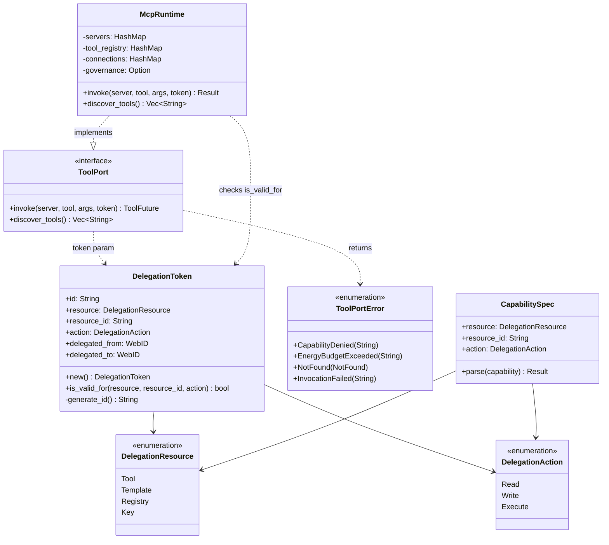

# hKask Capability — Class Diagram

Simplified type system after the 2026-08-02 OCAP removal. The `DelegationToken` carries 6 fields (no expiry, no signature, no attenuation). The `McpRuntime::invoke` gate does a pure capability-match + gas gate — no token expiry, no signature verification.

## What was removed (2026-08-02)

- `OcapConfig` struct + `ocap:` manifest blocks (59 files)
- `DelegationToken.expires_at` field + `new_with_expiry` constructor + `is_expired` method + `is_valid_for_at` (expiry-aware variant)
- `TokenRegistry` trait + `TokenRegistryStore` impl + `delegation_tokens` SQL table
- `verification/` module (signature-verification vocabulary)
- `CapabilityAwareValidator` (registration-time OCAP gate — zero production call sites)
- `Caveat` struct + `attenuation_level`/`max_attenuation`/`context_nonce`/`caveats` fields
- `CapabilityError` enum (never constructed)
- `list_tokens` curator tool + `TokenListRequest` type
- `SYSTEM_MAX_ATTENUATION` const (OCAP alias)

## What remains

- `DelegationToken` — 6 fields, minted in-process via `new()`, checked by `is_valid_for()`
- `ToolPort` trait — `invoke()` + `discover_tools()`, implemented by `McpRuntime`
- `ToolPortError` — `CapabilityDenied` / `EnergyBudgetExceeded` / `NotFound` / `InvocationFailed`
- `DelegationResource` / `DelegationAction` — enums for capability matching
- `CapabilitySpec` — parses `"tool:domain:action"` capability strings
- `capabilities_match` — action hierarchy: Execute ⊇ Write ⊇ Read
- `SYSTEM_MAX_RECURSION` — cascade depth limit (matryoshka), still used by the manifest executor

## Related

- [MCP Runtime Invoke Flow](./flowchart-mcp-runtime-invoke.md) — the simplified gate
- [Architecture Principles](../architecture/core/PRINCIPLES.md) — P4 Clear Boundaries
- [MDS](../architecture/core/MDS.md) — Trust category