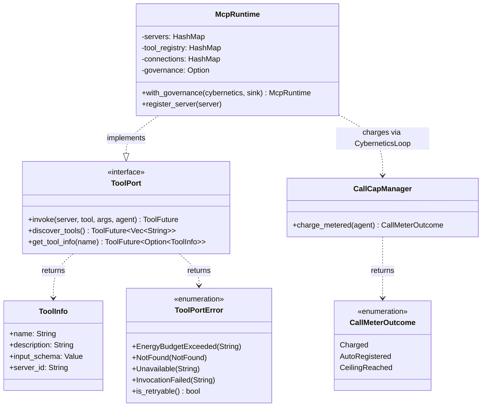

# hKask Capability — Class Diagram

Type system after the two 2026-08-12 removals: the per-call capability gate
(RR-0056) and the FIDES taint lattice (RR-0053). The crate now holds the dispatch
port only — no tokens, no authorization check, no information-flow labels.
`McpRuntime::invoke` meters the call and dispatches it; the only pre-dispatch
refusal is the runaway-loop breaker.

## What was removed (2026-08-12, RR-0053 / RR-0056 / RR-0057)

- The per-call capability gate in `McpRuntime::invoke`. All three production mint
  sites derived the token's `resource_id` from the same tool name they passed to
  `invoke`, so `is_valid_for` compared a caller-supplied value against itself and
  could not deny.
- `DelegationToken` (with `new` / `is_valid_for`), `panel_default_token`,
  `capabilities_match`, `capability_from_server_id`, `CapabilitySpec`,
  `CapabilityParseError`, `DelegationResource`, `DelegationAction`
- `ToolPortError::CapabilityDenied`, `McpRuntime::verify_capability_domain`,
  `McpRuntime::required_capability_for`, the `ToolInfo::required_capability` field
- The `src/auth.rs` and `src/resources.rs` modules
- The fail-closed branch on an *absent* call ceiling — the meter now auto-registers
  an unseeded agent at `DEFAULT_RUNAWAY_CALL_CEILING` and logs the wiring gap
  (RR-0057)
- The FIDES taint lattice: `ToolTaint`, `can_flow_to`, `can_flow_to_matrix`, the
  whole `src/tool_taint.rs` file, and the `ToolInfo.taint` field — deleted with the
  `DefaultPolicy` gate that consumed them (RR-0053). The gate was inert:
  `McpRuntime::get_tool_info` hardcoded `Pure` at the only `ToolInfo` construction
  site, so `Source`→`Sink` could never fire. The orphaned `serde` dependency went
  with it.

## What remains

- `ToolPort` — `invoke` / `discover_tools` / `get_tool_info`, dyn-compatible via
  `ToolFuture`, implemented by `McpRuntime`. `invoke`'s `agent: WebID` is an
  accounting identity, not a credential.
- `ToolPortError` — `EnergyBudgetExceeded` / `NotFound` / `Unavailable` /
  `InvocationFailed`, plus `is_retryable` (true only for `Unavailable`)
- `ToolInfo` — tool metadata: `name`, `description`, `input_schema`, `server_id`
- `ToolFuture` — the `Pin<Box<dyn Future + Send>>` alias that keeps `ToolPort`
  dyn-compatible
- `SYSTEM_MAX_RECURSION` — cascade depth limit (matryoshka), used by the registry
  bootstrap; a recursion breaker, not an authority limit.

Authority itself lives outside this crate: the per-request `tool_allowlist` on
the inference IPC dispatch, each swarm card's `mcp_tools` allowlist, and the
per-server MCP env/credential allowlists.

Information flow is not gated anywhere. Defense **Layer 5 is absent by decision**,
in the same register as Layer 3 (instruction hierarchy, RR-0010) — see
`DIVERGENCE.md` D4 and `kask/security/regressions/RR-0053.yaml`.

## Related

- [MCP Runtime Invoke Flow](./flowchart-mcp-runtime-invoke.md) — the metering path
- [Architecture Principles](../architecture/core/PRINCIPLES.md) — P4 Clear Boundaries
- [MDS](../architecture/core/MDS.md) — Trust category

<!-- DIAGRAM_ALIGNMENT
id: DIAG-CAP-001
verified_date: 2026-08-20
verified_against: kask/crates/hkask-capability/src/tool_port.rs; kask/crates/hkask-capability/src/token_types.rs; kask/crates/hkask-capability/src/hkask_capability.rs; kask/crates/hkask-mcp/src/runtime.rs; kask/crates/hkask-regulation/src/energy.rs
status: VERIFIED
-->
