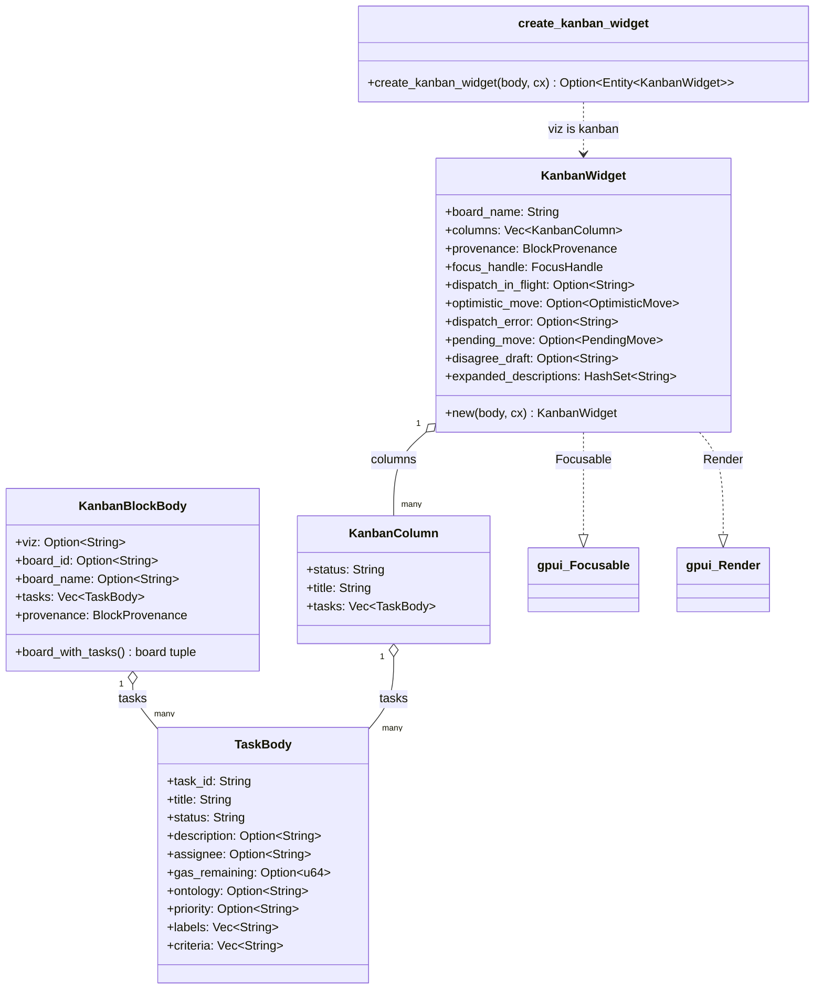

# hKask Kanban Widget — Class Diagram

`hkask-kanban-widget` renders ` ```kanban ` fenced blocks as a horizontal
column layout (Backlog → Ready → In Progress → Review → Done). It is a passive
renderer: the data comes from the parsed `KanbanBlockBody` (JSON already in the
chat stream, mirroring the combined `kanban_board_list` + `kanban_task_list`
tool responses), not from live MCP fetches. Read-only — task moves are done by
the agent calling `kanban_task_move` directly.



**Block shape:** a JSON body with `viz: "kanban"` and a single board
(`board_id` + `board_name` + `tasks`). The agent emits one block per board
when multiple boards are needed. `board_with_tasks()` returns the
`(board_id, board_name, tasks)` tuple, defaulting the name to the id or
`"Kanban Board"` when both are absent.

**Column grouping:** `group_tasks_into_columns` buckets tasks by
lowercased `status`, emits the five standard columns in order, then appends any
non-standard statuses sorted alphabetically (title-cased).

<!-- DIAGRAM_ALIGNMENT
id: DIAG-VIZ-KANBAN
verified_against: crates/hkask-kanban-widget/src/block.rs; crates/hkask-kanban-widget/src/view.rs
status: STALE
note: Fields synced to S5/S7 (TaskBody: description/priority/labels/criteria) and S4/S5 (KanbanWidget: dispatch_in_flight/optimistic_move/dispatch_error/pending_move/disagree_draft/expanded_descriptions). Method bodies and render-tree relationships not re-verified.
-->
