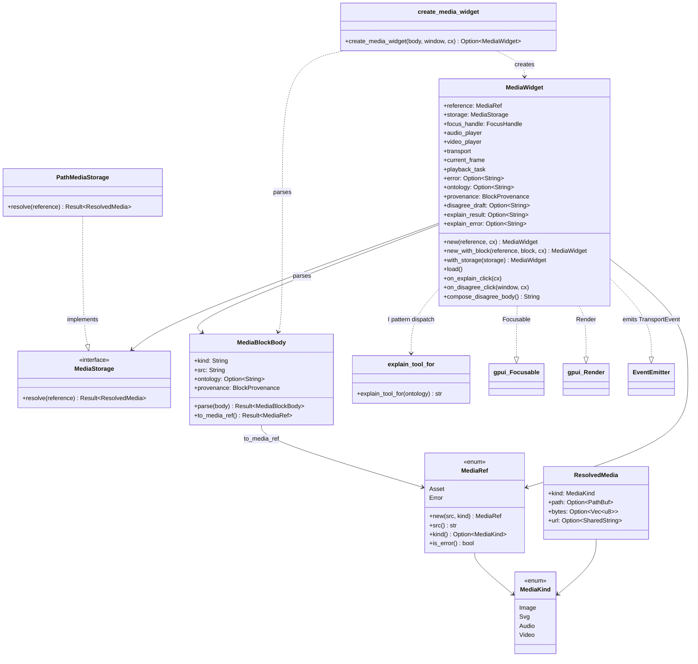

# hKask Media Widget — Class Diagram

`hkask-media-widget` renders ```` ```media ```` fenced blocks (image / SVG /
audio / video) inline in agent markdown. It resolves the asset reference via
`MediaStorage` (default `PathMediaStorage`, which handles filesystem paths,
`data:` URIs, and `http(s)` URLs directly — gallery images arrive as filesystem
paths) and drives playback through the `audio_player` / `video_decoder` /
`transport` collaborators.



**Block shape:** a JSON body with a `kind` (`"image"|"svg"|"audio"|"video"`),
a `src` (filesystem path / `data:` URI / URL), an optional `ontology` concept
URI (e.g. `omc:CreativeWork`), and optional `provenance`. The media renderer
self-selects on the `kind` field and is tried first by `hkask-viz-core` so
`kind`-bearing bodies never reach the graph/kanban/portfolio/scenarios
renderers.

**Ontology-bounded affordances (the "I" pattern):** when the block carries
`ontology` + dispatchable `provenance`, the widget renders two affordances:
- **Explain** — dispatches the explain tool selected by
  `hkask_bridge_ontology::explain_tool_for(ontology)` via `shared_tool_invoker()`.
  `omc:Scene`/`omc:Asset` → `gallery_analyze`; other OMC concepts → `describe_image`.
- **I disagree** — composes a provenance-scoped revision request and injects it
  via `shared_injector()` (D21 seam). Falls back to a copyable draft when no
  injector is active.

**Video decode** is gated behind the `video` / `vendored` cargo features
(system FFmpeg or vendored compile); without them, video blocks return an
error message instead of decoding.

<!-- DIAGRAM_ALIGNMENT
id: DIAG-VIZ-MEDIA
verified_date: 2026-08-04
verified_against: crates/hkask-media-widget/src/media_ref.rs; crates/hkask-media-widget/src/media_widget.rs; crates/hkask-media-widget/src/audio_player.rs; crates/hkask-media-widget/src/transport.rs; crates/hkask-media-widget/src/video_decoder.rs
status: VERIFIED
-->