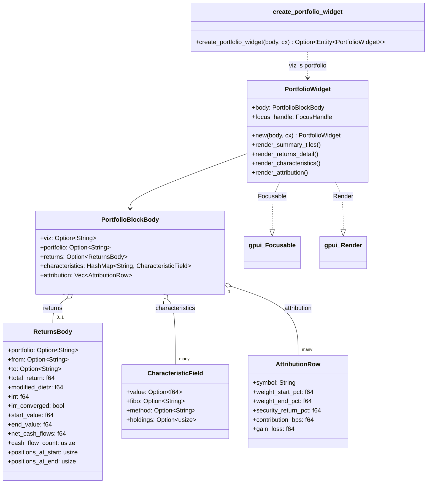

# hKask Portfolio Widget — Class Diagram

`hkask-portfolio-widget` renders ```` ```portfolio ```` fenced blocks as a
portfolio dashboard (summary tiles → returns detail → characteristics table →
attribution ranking). It is a passive renderer: the curator agent calls the
`companies` MCP tools (`portfolio_list`, `portfolio_returns`,
`portfolio_characteristics`, `portfolio_attribution`) and emits the combined
result as the block body. The portfolio selector / aggregation controls /
auto-loader / comparison mode from the deleted standalone
`PortfolioDashboardView` are intentionally omitted — the agent picks the
portfolio and the body already carries its data.



**Block shape:** a JSON body with `viz: "portfolio"`. `returns`,
`characteristics`, and `attribution` are all optional so partial bodies still
render the present sections. `AttributionRow.symbol` is required (a row without
a symbol is meaningless); other attribution fields default.

**FIBO anchors:** displayed metrics are anchored to the FIBO ontology via
constants (`FIBO_TIME_WEIGHTED_RETURN`, `FIBO_INTERNAL_RATE_OF_RETURN`,
`FIBO_TRANSACTION_LEDGER`, …) that match the `fibo` map entries the
`companies` MCP server includes in its responses.

<!-- DIAGRAM_ALIGNMENT
id: DIAG-VIZ-PORTFOLIO
verified_date: 2026-08-04
verified_against: crates/hkask-portfolio-widget/src/block.rs; crates/hkask-portfolio-widget/src/view.rs
status: VERIFIED
-->