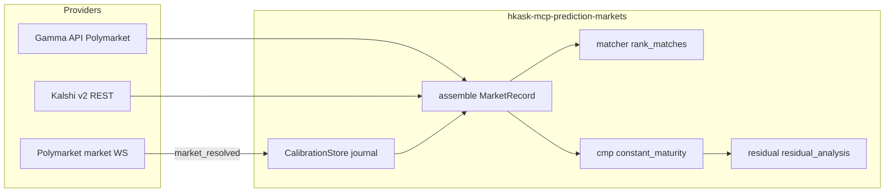

# hKask Prediction Markets Server — Class Diagram

`hkask-mcp-prediction-markets` is the market-data service for the forecasting
stack: it fetches markets from Polymarket (Gamma API + market-channel
WebSocket) and Kalshi (v2 REST), annotates every record with spread / volume /
calibration / volatility / reliability tier / dual-axis ontology, and never
returns a bare probability. The server exposes 12 tools
The server exposes 13 tools
(`prediction_markets_status`, `market_lookup`, `market_match`,
`market_ontology_map`, `market_calibration`, `market_record_resolution`,
`market_subscribe_resolutions`, `market_ladder`, `market_cmp`,
`market_cmp_index`, `market_residual`, `market_check_resolutions`,
`market_history`) — the T12 audit list of 12 omits `market_cmp_index`, which
is registered in the same `prediction_markets_router`
(`hkask_mcp_prediction_markets.rs:890`). All calibration math is reused from `hkask-forecast` — never
reimplemented here.

```mermaid
classDiagram
    direction TD
    class PredictionMarketsServer {
        +http: reqwest_Client
        +cache_ttl_secs: u64
        +calibration_store: Arc~Mutex~CalibrationStore~~
        +response_cache: TtlCache
        +calibration_path: Option~String~
        +base_events: Vec~(String,String)~
        +called_tools: Mutex~HashSet~String~~
        +combined_router() ToolRouter
    }
    class MarketRecord {
        +source: Source
        +event_id: String
        +market_id: String
        +question: String
        +deadline: String
        +probability: f64
        +probability_method: ProbabilityMethod
        +spread: Option~f64~
        +volume: Option~f64~
        +volume_grain: Option~VolumeGrain~
        +liquidity: Option~f64~
        +volatility: Volatility
        +status: MarketStatus
        +resolved_outcome: Option~bool~
        +resolution_source: Option~String~
        +calibration: Calibration
        +reliability_tier: ReliabilityTier
        +ontology: OntologyBlock
        +from_kalshi(...) MarketRecord
        +from_polymarket(...) MarketRecord
    }
    class Calibration {
        +brier: Option~f64~
        +domain_bias: f64
        +bias_source: String
        +sample_size: u64
        +stale: bool
    }
    class Volatility {
        +realized_variance: Option~f64~
        +structural_flag: StructuralFlag
        +interpretation: String
    }
    class OntologyBlock {
        +process: ProcessAxis
        +state: StateAxis
        +mapping_version: u32
    }
    class ProcessAxis {
        +type: String
        +stage: String
        +probability_role: String
    }
    class StateAxis {
        +identifier: String
        +title: String
        +description: String
        +temporal: String
        +provenance: String
    }
    class CalibrationStore {
        -buckets: HashMap~String, Vec~ResolvedObservation~~
        +record(bucket, observation)
        +brier(bucket) Result~f64~
        +contains(bucket, observation) bool
        +load(path) io::Result~Self~
        +save(path) io::Result
        stale never brier 0
    }
    class CalibrationReading {
        +bucket: String
        +brier: Option~f64~
        +sample_size: u64
        +stale: bool
    }
    class TenorPoint {
        +days_to_resolution: f64
        +price: f64
    }
    class CmpValue {
        +tenor_days: u32
        +probability: f64
        +method: CmpMethod
        +cohorts: usize
        +bracket_days: f64
    }
    class CmpIndex {
        +series: String
        +computed_at: String
        +points: Vec~CmpIndexPoint~
    }
    class ResidualAnalysis {
        +beta: f64
        +alpha: f64
        +r_squared: f64
        +observations: usize
        +latest_residual: f64
    }
    class MatchCandidate {
        +market: MarketRecord
        +match_confidence: MatchConfidence
        +score: f64
        +match_basis: MatchBasis
    }
    class GammaMarket {
        +question: String
        +outcome_prices: String
        +clob_token_ids: String
        +uma_resolution_status: String
        +yes_probability() Option~f64~
        +token_ids() Vec~String~
    }
    class KalshiMarket {
        +ticker: String
        +event_ticker: String
        +yes_bid_dollars: String
        +yes_ask_dollars: String
        +yes_midpoint() Option~f64~
        +spread() Option~f64~
    }
    class MarketEvent {
        <<enum>>
        MarketResolved
        LastTradePrice
        Other
    }
    class TtlCache {
        -ttl: Duration
        -entries: Mutex~HashMap~String, Entry~~
        +get(key) Option~Value~
        +put(key, value)
    }

    PredictionMarketsServer --> CalibrationStore : journal-backed
    PredictionMarketsServer --> TtlCache : response cache
    PredictionMarketsServer ..> MarketRecord : assembles
    GammaMarket ..> MarketRecord : from_polymarket
    KalshiMarket ..> MarketRecord : from_kalshi
    MarketRecord "1" o-- "1" Calibration : calibration
    MarketRecord "1" o-- "1" Volatility : volatility
    MarketRecord "1" o-- "1" OntologyBlock : ontology
    OntologyBlock "1" o-- "1" ProcessAxis : process
    OntologyBlock "1" o-- "1" StateAxis : state
    CalibrationStore ..> CalibrationReading : read_calibration
    MarketRecord ..> TenorPoint : ladder feeds cmp
    TenorPoint ..> CmpValue : constant_maturity
    CmpIndex "1" o-- "many" CmpIndexPoint : points
    MarketRecord ..> MatchCandidate : score_match ranks
    MarketEvent ..> CalibrationStore : market_resolved ingests

    note for CalibrationStore "Brier math reused from hkask-forecast.\nMissing/empty bucket is Err — mapped to\nstale: true, never a synthetic brier: 0\n(the .rules unwrap_or(0) trap generalized)."
    note for MarketRecord "Every probability carries spread, volume grain,\ncalibration, volatility, reliability tier,\nand a PKO + Dublin Core ontology block.\nBase events come only from config — a market\ncan never auto-promote to benchmark status."
```

**Pipeline view** (providers → matcher → calibration):

**Honest-degradation invariants:** a bucket with no data or a read failure is
`stale: true` (never `brier: 0`); `constant_maturity` returns `None` on empty
input; `residual_analysis` refuses below `MIN_OBSERVATIONS = 10` overlapping
pairs (`insufficient_overlap`); the WS stream skips unparsable frames without
dying, and a dead stream surfaces a typed error.

**Ontology anchors:** per-record `ontology` blocks and the
`market_ontology_map` tool output are both generated from `ontology.rs`
constants (`MAPPING_VERSION`, `LIFECYCLE_STAGES`) so they cannot drift.
`dcterms:*` / `pko:*` vocabulary is reused from `hkask-bridge-ontology`;
calibration vocabulary (brier, domain_bias, reliability_tier) is domain-supplement
tier pending a second consumer (ADR-042).

<!-- DIAGRAM_ALIGNMENT
id: DIAG-RF-PM
verified_date: 2026-08-05
verified_against: kask/mcp-servers/hkask-mcp-prediction-markets/src/hkask_mcp_prediction_markets.rs:163-173,191-197; kask/mcp-servers/hkask-mcp-prediction-markets/src/types.rs:20-160,459-585; kask/mcp-servers/hkask-mcp-prediction-markets/src/calibration.rs:18,33,139; kask/mcp-servers/hkask-mcp-prediction-markets/src/cmp.rs:32,49,169; kask/mcp-servers/hkask-mcp-prediction-markets/src/residual.rs:16,19; kask/mcp-servers/hkask-mcp-prediction-markets/src/matcher.rs:14,22; kask/mcp-servers/hkask-mcp-prediction-markets/src/provider_polymarket.rs:17; kask/mcp-servers/hkask-mcp-prediction-markets/src/provider_kalshi.rs:27,194; kask/mcp-servers/hkask-mcp-prediction-markets/src/streaming.rs:20; kask/mcp-servers/hkask-mcp-prediction-markets/src/cache.rs:16; kask/mcp-servers/hkask-mcp-prediction-markets/src/ontology.rs:16,25
status: VERIFIED
-->
