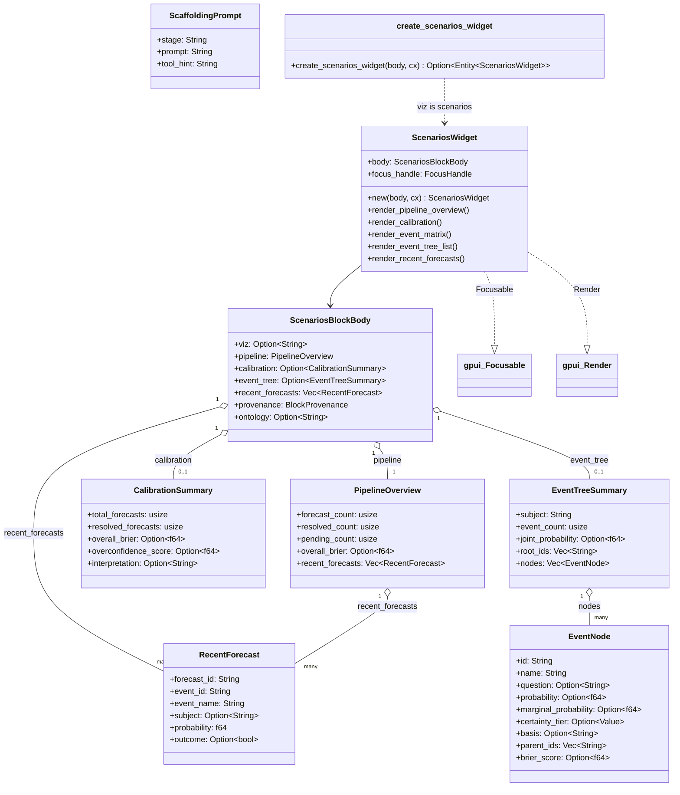

# hKask Scenarios Widget — Class Diagram

`hkask-scenarios-widget` renders ```` ```scenarios ```` fenced blocks as a
forecasting dashboard: pipeline overview, calibration summary, event matrix,
event-tree list, and recent forecasts. The event-tree DAG itself (`viz:
"event_tree"`) is rendered separately by `hkask-graph-widget`. The widget is a
passive renderer over the parsed `ScenariosBlockBody` (mirrors the
`scenario_status` tool response).



**Block shape:** a JSON body with `viz: "scenarios"`. All sub-objects default
to empty/`None` so partial bodies render the present sections. A body with
`viz: "event_tree"` is NOT claimed (it goes to `hkask-graph-widget`).

**Scaffolding:** `scaffolding_for_state` maps the current pipeline state to a
`ScaffoldingPrompt` (stage + prompt + tool_hint) — e.g. an empty pipeline
suggests `scenario_frame`, pending forecasts suggest `scenario_quantify`, and
resolved forecasts with a calibration suggest `scenario_assess`.

**FIBO / methodology anchors:** `FIBO_FORECAST_ID`, `FIBO_BRIER_SCORE`,
`FIBO_SCENARIO_PROBABILITY` anchor displayed metrics to the FIBO ontology.

<!-- DIAGRAM_ALIGNMENT
id: DIAG-VIZ-SCENARIOS
verified_date: 2026-08-04
verified_against: crates/hkask-scenarios-widget/src/block.rs; crates/hkask-scenarios-widget/src/view.rs
status: VERIFIED
-->