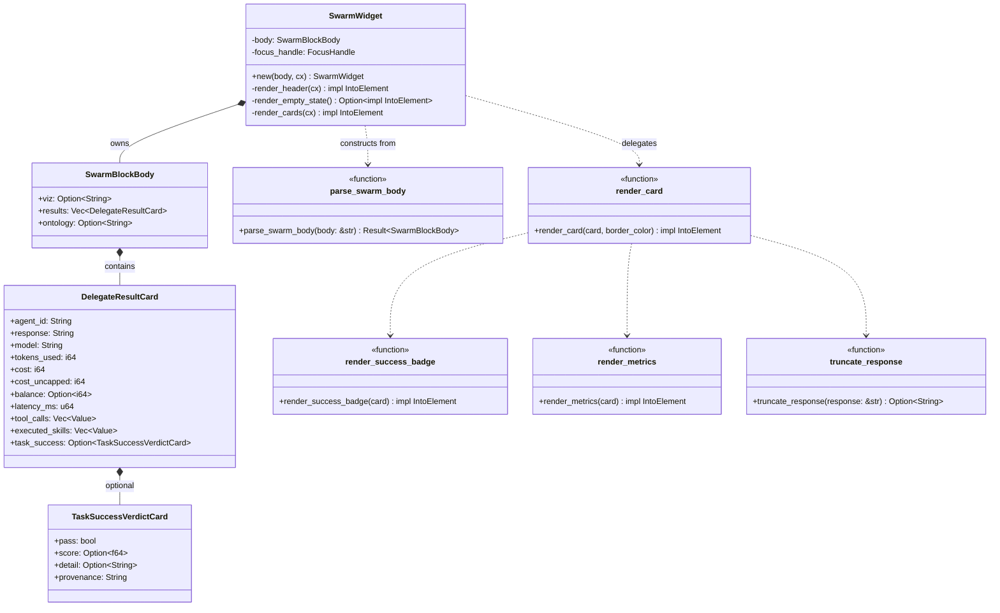

# hKask Swarm Widget — Class Diagram

The `hkask-swarm-widget` crate renders ```` ```swarm_delegate_results ```` fenced blocks inline in agent markdown. It is the sixth viz widget wired behind the D18 seam via `hkask-viz-core`'s composed `block_renderer`. The widget is a passive renderer — no `ToolInvoker` fetches, no dispatch affordance. The data is already in the chat stream; the widget makes it readable.

Each `LocalDelegateResult` from the `swarm_execute_plan_local` MCP tool renders as a structured per-agent card: agent id, task-success badge, response (truncated), model, tokens, cost, latency, tool-call count, executed-skill count.



<!-- DIAGRAM_ALIGNMENT
id: DIAG-VIZ-SWARM
verified_date: 2026-08-24
verified_against: crates/hkask-swarm-widget/src/hkask_swarm_widget.rs (SwarmWidget struct L47-50, render methods L65-113, render_card L136-164, render_success_badge L169-193, render_metrics L213-248, truncate_response L198-208, RESPONSE_TRUNCATE_CHARS L43), crates/hkask-swarm-widget/src/block.rs (SwarmBlockBody L26-39, DelegateResultCard L46-84, TaskSuccessVerdictCard L88-104, parse_swarm_body L110-112), crates/hkask-viz-core/src/hkask_viz_core.rs (wiring L62-63, L166)
status: VERIFIED
-->

## Cross-Links

- [`class-hkask-viz-core.md`](class-hkask-viz-core.md) — the composed `block_renderer` that wires this widget alongside the other five.
- [`class-swarm-server.md`](class-swarm-server.md) — the `SwarmServer` whose `swarm_execute_plan_local` tool produces the rendered `LocalDelegateResult` array.
- [`../architecture/zed-host-architecture-plan.md`](../architecture/zed-host-architecture-plan.md) §13 — D18 viz-widget seam.

## Notes

- `RESPONSE_TRUNCATE_CHARS` (240) caps the visible response body; the full response lives in the tool-call output block.
- `balance: None` renders as a muted "—" rather than a fabricated 0 — the `.rules` broken-feedback-loop trap.
- `task_success: None` renders as "not evaluated" — never a fabricated pass/fail.
- The `ontology` field on `SwarmBlockBody` carries an optional concept URI (e.g. `pko:Procedure`) emitted by the swarm server; pinned by the registry-level S4 sensor test in `hkask-viz-core`.
