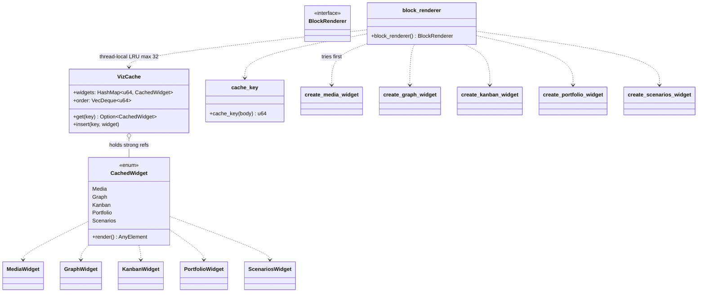

# hKask Viz-Core — Class Diagram

`hkask-viz-core` is the D18 composition root for the viz widgets. It composes every
widget's `create_*` factory into one `BlockRenderer` callback (the erased
`dyn Fn(&str, &mut Window, &mut App) -> Option<AnyElement>` that
`markdown::MarkdownElement::media_block_renderer` expects) and caches widget
entities by a hash of the block body so state survives the per-token re-renders
of the streaming chat.

**Selection order** (intentional): media first (claims bodies with a `kind`
field), then graph (`viz: "event_tree"`), kanban (`viz: "kanban"`), portfolio
(`viz: "portfolio"`), scenarios (`viz: "scenarios"`). A body claimed by none
returns `None` and falls through to the default code-block renderer.

**Wiring seam:** `crates/agent_ui/src/conversation_view.rs` —
`render_agent_markdown` calls `.media_block_renderer(hkask_viz_core::block_renderer())`.
The upstream D18 field/builder/dispatch in `markdown` stay unchanged (see
`DIVERGENCE.md` D18).

<!-- DIAGRAM_ALIGNMENT
id: DIAG-VIZ-CORE
verified_date: 2026-08-04
verified_against: crates/hkask-viz-core/src/hkask_viz_core.rs; crates/hkask-media-widget/src/media_widget.rs; crates/hkask-graph-widget/src/view.rs; crates/hkask-kanban-widget/src/view.rs; crates/hkask-portfolio-widget/src/view.rs; crates/hkask-scenarios-widget/src/view.rs; crates/agent_ui/src/conversation_view.rs
status: VERIFIED
-->