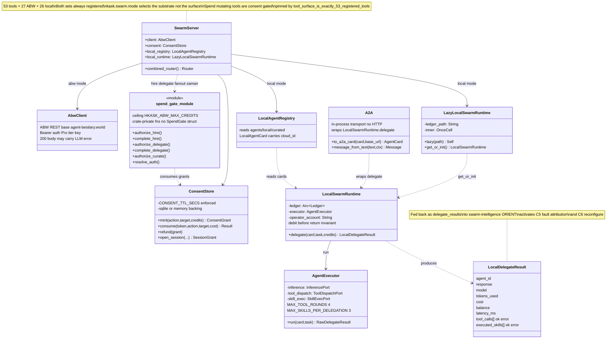

# Swarm Server Class Diagram

The `hkask-mcp-swarm` server (`SwarmServer`) exposes 52 tools (27 ABW + 25
local) — both sets always registered; `kask.swarm.mode` selects the substrate,
not the surface — pinned by
`tool_surface_is_exactly_52_registered_tools` (`hkask_mcp_swarm.rs`). `SwarmServer` composes five collaborators:
the ABW REST client, the consent store (real-time spend gate with TTL), the
local agent registry, the lazily-initialized local runtime, and the central
verification store (grounding ledger). The spend gate
consumes consent grants before any debit; the local runtime owns the
debit-before-return invariant (it debits the ledger, then `AgentExecutor`
returns the result so a failed delegation still costs credits). The verification
store runs grounding enforcement on every delegation via `enforce_and_stamp()`.
The A2A layer
wraps the existing `delegate` in protocol-compliant types over the in-process
transport (no HTTP server required). See the [Swarm MCP Server Architecture](flowchart-swarm-architecture.md).

<!-- DIAGRAM_ALIGNMENT
id: DIAG-DIA-SWARM-006
verified_date: 2026-08-14
verified_against: kask/mcp-servers/hkask-mcp-swarm/src/hkask_mcp_swarm.rs (combined_router, tool_surface_is_exactly_53_registered_tools); kask/mcp-servers/hkask-mcp-swarm/src/consent.rs; kask/mcp-servers/hkask-mcp-swarm/src/spend_gate.rs (crate-private authorize_*/complete_* fns, no pub struct SpendGate); kask/mcp-servers/hkask-mcp-swarm/src/local_runtime.rs; kask/mcp-servers/hkask-mcp-swarm/src/agent_executor.rs (AgentExecutor: inference, tool_dispatch, skill_exec — no guard field, no scan_input/scan_output); kask/mcp-servers/hkask-mcp-swarm/src/a2a.rs
status: VERIFIED
-->
