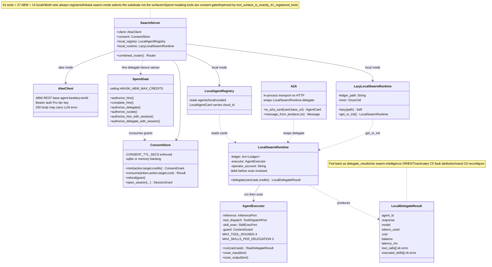

# Swarm Server Class Diagram

The `hkask-mcp-swarm` server (`SwarmServer`) exposes 41 tools (27 ABW + 14
local) selected by `kask.swarm.mode`. `SwarmServer` composes four collaborators:
the ABW REST client, the consent store (real-time spend gate with TTL), the
local agent registry, and the lazily-initialized local runtime. The spend gate
consumes consent grants before any debit; the local runtime owns the
debit-before-scan invariant (it debits the ledger, then `AgentExecutor` scans
the output so a guard-quarantined result still costs credits). The A2A layer
wraps the existing `delegate` in protocol-compliant types over the in-process
transport (no HTTP server required). See the [Swarm Cybernetics/Semantics Audit](../audits/swarm-cybernetics-semantics-audit.md) and the [Swarm MCP Server Architecture](flowchart-swarm-architecture.md).

<!-- DIAGRAM_ALIGNMENT
id: DIAG-DIA-SWARM-006
verified_date: 2026-08-03
verified_against: kask/mcp-servers/hkask-mcp-swarm/src/hkask_mcp_swarm.rs:115,124,2822; kask/mcp-servers/hkask-mcp-swarm/src/consent.rs:56,77,150,184,227; kask/mcp-servers/hkask-mcp-swarm/src/spend_gate.rs:83,253,334; kask/mcp-servers/hkask-mcp-swarm/src/local_runtime.rs:39,73; kask/mcp-servers/hkask-mcp-swarm/src/agent_executor.rs:33,38,55; kask/mcp-servers/hkask-mcp-swarm/src/a2a.rs:24
status: VERIFIED
-->