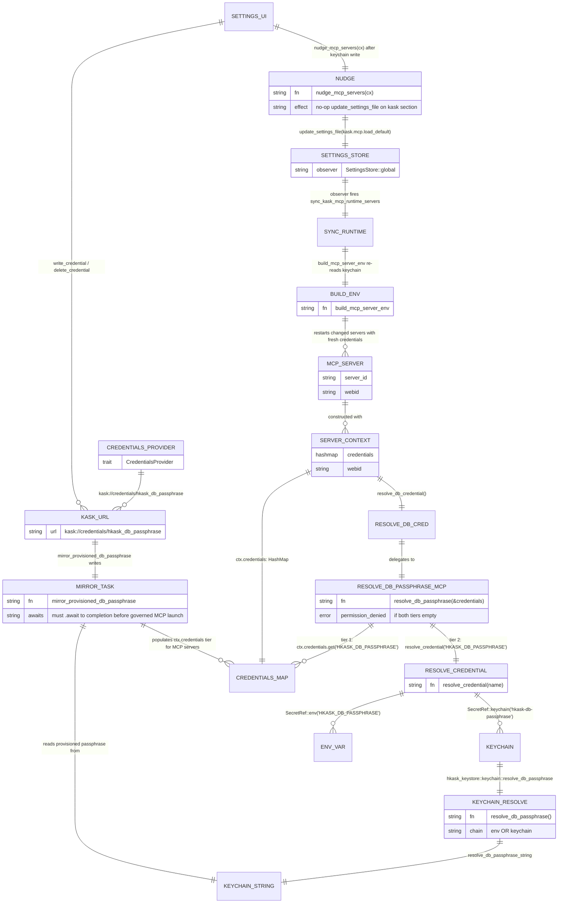

# Credential Resolution Chain — single keychain namespace

Reference-quadrant ERD of the credential resolution chain. API keys are
stored in zed's `CredentialsProvider` keychain namespace
(`kask://credentials/<key>`, label `zed-github-account`).
`build_mcp_server_env` reads from this namespace and injects as env vars
into MCP server child processes. The server's `resolve_credential` reads
API keys from env only — there is no `service=hkask` keychain fallback for
API keys. `HKASK_DB_PASSPHRASE` and `HKASK_SWARM_MEMORY_PASSPHRASE` have
dedicated `hkask-keystore` resolvers (env → `service=hkask` keychain)
because they predate the zed integration. Writes/deletes to the
`kask://credentials/...` namespace must call `nudge_mcp_servers` to
re-fire the `SettingsStore` observer and restart changed servers.

## The chain

## The 2-tier resolution chain

`hkask_mcp_server::server::resolve_db_passphrase(&credentials)` (in
`kask/crates/hkask-mcp-server/src/server/credentials.rs`) is the canonical
helper all MCP servers must use to resolve `HKASK_DB_PASSPHRASE`. It is a
2-tier chain:

1. **`ctx.credentials` tier** — if `credentials.get("HKASK_DB_PASSPHRASE")`
   returns a non-empty string, return it. This tier is populated by the
   `mirror_provisioned_db_passphrase` task (see below).
2. **`resolve_credential("HKASK_DB_PASSPHRASE")` tier** — delegates to
   `hkask_keystore::keychain::resolve_db_passphrase_string()`, which itself
   is a 2-tier chain: `SecretRef::env("HKASK_DB_PASSPHRASE")` (env var) OR
   `SecretRef::keychain(KEY_DB_PASSPHRASE)` (keychain entry
   `hkask-db-passphrase`).

If both tiers are empty, the helper returns
`McpToolError::permission_denied` naming the env var and the keychain URL —
a missing credential is an authorization failure, not a transient
unavailability or a bad argument. Silent fallbacks (empty results, in-memory
DB, skipped env injection) are broken feedback loops — the operator cannot
distinguish "not configured" from "no results" or "provider down."

`ServerContext::resolve_db_credential` (in
`kask/crates/hkask-mcp-server/src/server/context.rs`) wraps the helper and
maps the error to `McpError::DatabasePassphrase`.

## The mirror (deferred post-login task)

`provision_agent` (in `kask/crates/kask_bridge/src/identity.rs`) runs in
the deferred post-login task when `UserStore::current_user()` resolves. It
creates the directory structure and ensures a DB passphrase (auto-generate
random English word if none, written to the keychain `hkask-db-passphrase`
entry via the `keyring` crate directly).

`mirror_provisioned_db_passphrase` (also in `identity.rs`, re-exported from
`kask/crates/kask_bridge/src/kask_bridge.rs`) then reads the provisioned
passphrase from the keystore chain and writes it into zed's
`CredentialsProvider` under `kask://credentials/hkask_db_passphrase`. This
populates the primary `ctx.credentials` tier that
`resolve_db_passphrase` reads first.

**Load-bearing ordering:** the mirror task must `.await` to completion in
the deferred post-login task **before** governed MCP server launch. The
primary `ctx.credentials` tier reads the mirrored
`kask://credentials/hkask_db_passphrase` entry; a missing mirror falls back
to the env/keychain tier silently (broken feedback loop — the operator
cannot distinguish "not configured" from "configured but broken"). Reordering
the deferred task breaks first-run provisioning.

## The nudge (re-sync on keychain write)

`write_credential` and `delete_credential` for `kask://credentials/...`
URLs (in `crates/settings_ui/src/pages/kask_page.rs`) must call
`nudge_mcp_servers(cx)` after the keychain write. Without it the running
server keeps the old key until next launch.

`nudge_mcp_servers` performs a no-op `update_settings_file` on the `kask`
section (re-writing the same `kask.mcp.load_default` value) so
`SettingsStore` fires its observers. The observer fires
`sync_kask_mcp_runtime_servers` → `build_mcp_server_env` (re-reads the
keychain) → restart changed servers. Only `kask://credentials/...` URLs need
the nudge; inference-provider `api_url` writes go through zed's provider
registry reload.

The full path is pinned by two tests in `kask_page.rs`:
`nudge_mcp_servers_symbol_exists` (pins the nudge side) and the
`sync_kask_mcp_runtime_servers` test (pins the observer side).

## Related

- [Skill ↔ MCP ↔ Lisp Architecture](./architecture-skill-mcp-lisp-seam.md) — where the credentials feed
- [MCP Tool Call Sequence](./sequence-mcp-tool-call.md) — the dispatch path the credentials unlock
- [Kask Settings Reference](../reference/kask-settings.md) — the `KaskSettings` struct
- [zed-kask Host Architecture Plan](../architecture/zed-host-architecture-plan.md) §11 — D9 settings + credentials

<!-- DIAGRAM_ALIGNMENT
id: DIAG-ERD-CREDENTIAL-RESOLUTION-001
verified_date: 2026-08-15
verified_against: kask/crates/hkask-mcp-server/src/server/credentials.rs (resolve_credential, resolve_db_passphrase, McpToolError::permission_denied); kask/crates/hkask-mcp-server/src/server/context.rs (ServerContext::resolve_db_credential, McpError::DatabasePassphrase); kask/crates/hkask-mcp-server/src/hkask_mcp_server.rs (pub use server::{resolve_credential, resolve_db_passphrase}); kask/crates/hkask-keystore/src/keychain.rs (resolve_db_passphrase, resolve_db_passphrase_string, SecretRef::env/keychain, KEY_DB_PASSPHRASE); kask/crates/kask_bridge/src/identity.rs (mirror_provisioned_db_passphrase, provision_agent); kask/crates/kask_bridge/src/kask_bridge.rs (pub use identity::mirror_provisioned_db_passphrase); crates/settings_ui/src/pages/kask_page.rs (nudge_mcp_servers, write_credential, delete_credential, nudge_mcp_servers_symbol_exists); crates/zed/src/main.rs (db_passphrase_mirror_task, mirror_provisioned_db_passphrase call); kask/crates/hkask-services-core/src/config.rs (resolve_db_passphrase_string usage)
status: VERIFIED
-->
